# Auto Layout with the Xamarin Designer for iOS

> [!WARNING]
> The iOS Designer will start to be phased out in Visual Studio 2019 version 16.8 and Visual Studio 2019 for Mac version 8.8.
> The recommended way to build iOS user interfaces is directly on a Mac running Xcode. For more information, see [Designing user interfaces with Xcode](../storyboards/index.md). 

Auto Layout (also called “adaptive layout”) is a responsive design approach. Unlike the transitional layout system, where each element’s location is hard-coded to a point on the screen, Auto Layout is about *relationships* - the positions of elements relative to other elements on the design surface. At the heart of Auto Layout is the idea of constraints or rules that define the placement of an element or set of elements in the context of other elements on the screen. Because the elements are not tied to a particular position on the screen, constraints help create an adaptive layout that looks good on different screen sizes and device orientations.

In this guide, we introduce constraints and how to work with them in the Xamarin iOS Designer. This guide does not cover working with constraints programmatically. For information on using Auto Layout programmatically, refer to the [Apple documentation](https://developer.apple.com/library/prerelease/ios/documentation/UserExperience/Conceptual/AutolayoutPG/ProgrammaticallyCreatingConstraints.html).

## Requirements

The Xamarin Designer for iOS is available in Visual Studio for Mac in Visual Studio 2017 and later on Windows.

This guide assumes knowledge of the Designer's components from the [Introduction to the iOS Designer](~/ios/user-interface/designer/introduction.md) guide.

## Introduction to Constraints

A constraint is a mathematical representation of the relationship between two elements on the screen. Representing a UI element’s position as a mathematical relationship solves several problems associated with hard-coding a UI element’s location. For example, if we were to place a button 20px from the bottom of the screen in portrait mode, the button’s position would be off the screen in landscape mode. To avoid this, we could set a constraint that places the bottom edge of the button 20px from the bottom of the view. The position for the button edge would then be calculated as *button.bottom = view.bottom - 20px*, which would place the button 20px from the bottom of the view in both portrait and landscape mode. The ability to calculate placement based on a mathematical relationship is what makes constraints so useful in UI design.

When we set a constraint, we create an `NSLayoutConstraint` object which takes as arguments the objects to be constrained and the properties, or *attributes*, that the constraint will act on. In the iOS designer, attributes include edges such as the *left*, *right*, *top*, and *bottom* of an element. They also include size attributes such as *height* and *width*, and the center point location, *centerX* and *centerY*. For example, when we add a constraint on the position of the left boundary of two buttons, the Designer is generating the following code under the covers:

```csharp
View.AddConstraint (NSLayoutConstraint.Create (Button1, NSLayoutAttribute.Left, NSLayoutRelation.Equal, Button2, NSLayoutAttribute.Left, 1, 10));
```

The next section covers working with constraints using the iOS Designer, including enabling and disabling Auto Layout and using the Constraints Toolbar.

## Enable Auto Layout

The default iOS Designer configuration has constraint mode enabled. However, should you need to enable or disable it manually, you can do so in two steps:

1. Click on an empty space on the design surface. This deselects any elements and brings up the properties for the Storyboard document.
1. Check or uncheck the **Use Autolayout** checkbox in the property panel:

    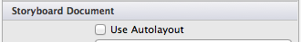

By default, no constraints are created or visible on the surface. Instead, they are automatically inferred from the frame information at compile time. To add constraints, we need to select an element on the design surface and add constraints to it. We can do that using the **Constraint Toolbar**.

## Constraints Toolbar

 [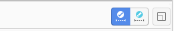](designer-auto-layout-images/toolbarnew.png#lightbox)

The constraints toolbar has been updated and now consists of two main parts:

- **A Constraints mode button toggle**:
  Previously, you entered the constraints mode by clicking again on a selected view on the design surface. You should now use this toggle button in the constraints bar:

  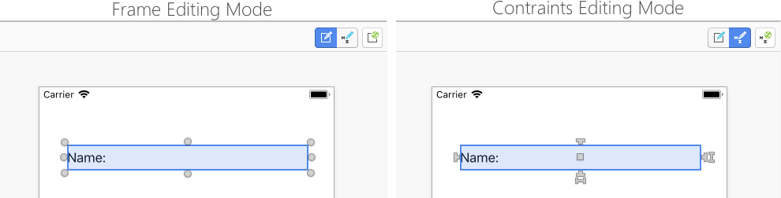

- **An "Update Constraints" button:**
  It's important to note that the changes depending on if you are in constraints editing mode.
  - In Constraint editing mode this button adjusts the constraints to match the element frame.
  - In Frame editing mode this button adjusts the element frame to match the position the constraints are defining.

## Constraints editing popover

The constraints editor pop-up allows us to add and update the multiple constraints at once for a select view. We can create multiple spacing, aspect ratio, and alignment constraints, such as align a view to the left edges of two views.

For editing constraints on the selected view, click the ellipsis to display the popover:
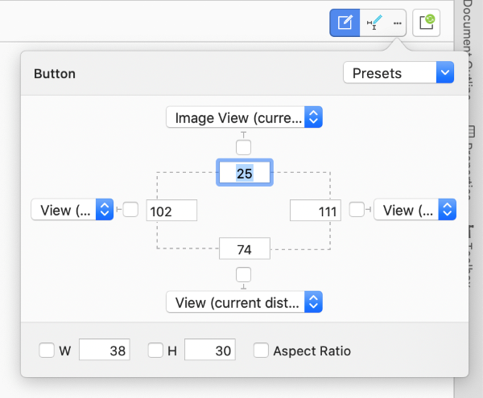

On opening the constraints popover it displays any preset constraints on the view. We can set all the spacing constraints selecting **All Sides** from the combobox on top right corner, and select **Clear All** to remove them.

The **W** will set width and **H** will set height constraint. When you check **Aspect Ratio**, the views height and width will be controlled on different screen sizes, the width of the view is used as numerator for the ration, and the height as denominator.

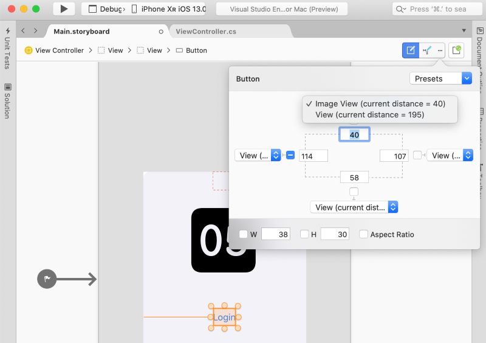

Four combo boxes for spacing constraints lists the neighboring views to anchor the constraint

## Surface-Based Constraint Editing

For more fine-tuned constraint editing, we can interact with constraints directly on the design surface. This section introduces the basics of surface-based constraint editing, including pin-spacing controls, drop areas, and working with different types of constraints.

### Creating Constraints

The iOS Designer tool offers two types of controls for manipulating elements on the design surface. *Dragging controls* and *pin-spacing controls*, as illustrated in the following image:

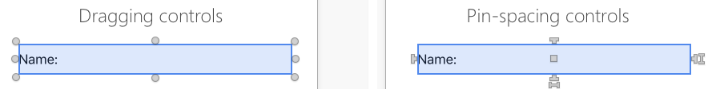

These are toggled by selecting the constraints mode button in the constraints bar.

The 4 T-shaped handles on each side of the element define the *top*, *right*, *bottom*, and *left* edges of the element for a constraint. The two I-shaped handles at the right and bottom of the element define *height* and *width* constraint respectively. The middle square handles both *centerX* and *centerY* constraints.

To create a constraint, pick a handle and drag it somewhere on the design surface. When you start the drag, a series of green lines/boxes will appear on the surface telling you what you can constrain. For example, in the screenshot below, we are constraining the top side of the middle button:

 [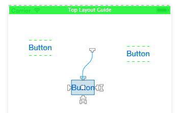](designer-auto-layout-images/image07.png#lightbox)

Note the three dashed green lines across the other two buttons. The green lines indicate *drop areas*, or the attributes of other elements to which we can constrain. In the screenshot above, the other two buttons offer 3 vertical drop areas ( *bottom*, *centerY*, *top*) to constrain our button. The dashed green line at the top of the view means the view controller offers a constraint at the top of the view, and the solid green box means the view controller offers a constraint below the top layout guide.

> [!IMPORTANT]
> Layout guides are special types of constraint targets that allow us to create top and bottom constraints that take into account the presence of system bars, such as status bars or toolbars. One of the main uses is to have an app compatible between iOS 6 and iOS 7 since the newest version has the container view extending below the status bar. For more information on the top layout guide, refer to the [Apple documentation](https://developer.apple.com/library/ios/documentation/userexperience/conceptual/transitionguide/AppearanceCustomization.html#//apple_ref/doc/uid/TP40013174-CH15-SW2).

The next three sections introduce working with different types of constraints.

### Size Constraints

With size constraints - *height* and *width* - you have two options. The first option is to drag the handle to constrain to a neighbor element size, as illustrated by the example above. The other option is to double-click the handle to create a self-constraint. This allows us to specify a constant size value, as illustrated by the screenshot below:

 [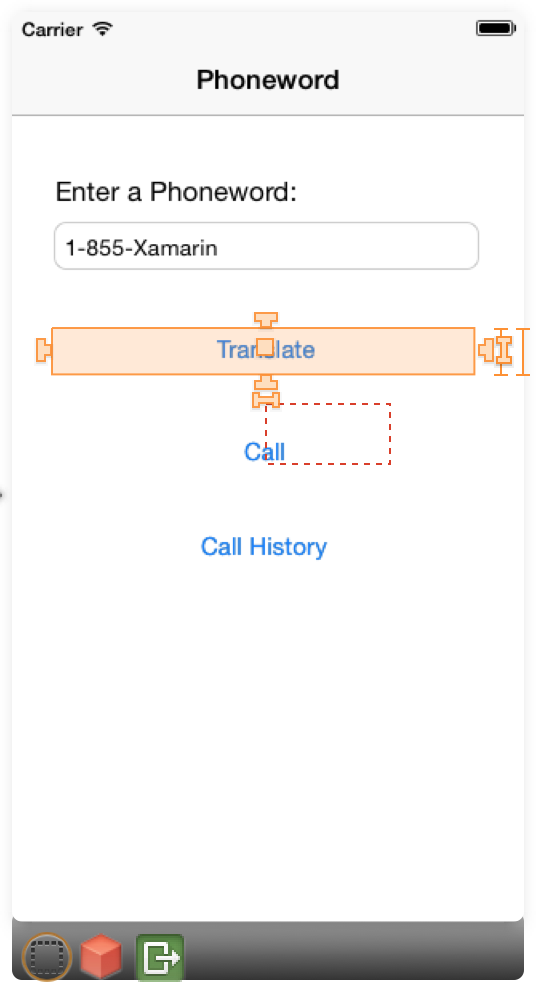](designer-auto-layout-images/sizec.png#lightbox)

### Center Constraints

The square handle will create a *centerX* or *centerY* constraint, depending on the context. Dragging the square handle will light up the other elements to offer both vertical and horizontal drop areas, as illustrated by the screenshot below:

 [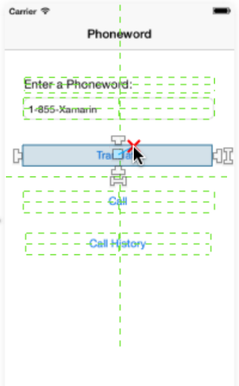](designer-auto-layout-images/centerc.png#lightbox)

If you choose a vertical drop area, a *centerY* constraint will be created. If you choose a horizontal drop area, the constraint will be based on *centerX*.

### Combinational Constraints

To create both alignment and size equality constraints between two elements, you can select items from a top toolbar to specify - in order - horizontal alignment, vertical alignment and size equalities, as illustrated by the screenshot below:

 [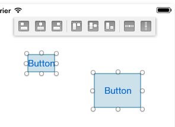](designer-auto-layout-images/image06.png#lightbox)

### Visualizing and Editing Constraints

When you add a constraint, it will be displayed on the design surface as a blue line when you select an item:

 [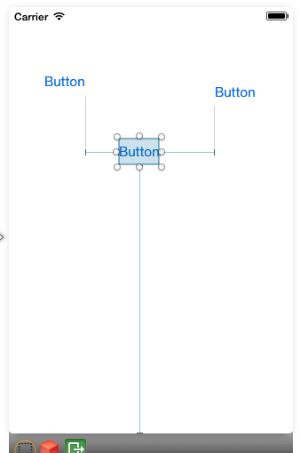](designer-auto-layout-images/image09.png#lightbox)

You can select a constraint by clicking on a blue line and editing the constraint values directly in the property panel. Alternatively, double-clicking on a blue line will bring up a popover that lets you edit the values directly on the design surface:

 [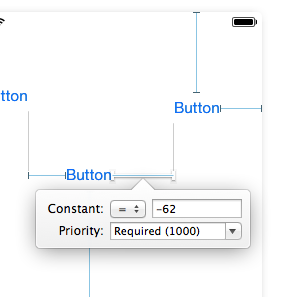](designer-auto-layout-images/image08.png#lightbox)

## Constraint Issues

Several types of issues can arise when using constraints:

- **Conflicting constraints** — This happens when multiple constraints force the element to have conflicting values for an attribute and the constraint engine is unable to reconcile them.
- **Underconstrained items** — An element’s properties (location + size) must be entirely covered by its set of constraints and intrinsic sizes for the constraints to be valid. If these values are ambiguous, the item is said to be underconstrained.
- **Frame misplacement** — This occurs when an element’s frame and its set of constraints define two different resulting rectangles.

This section elaborates on the three issues listed above, and provides details on how to handle them.

### Conflicting Constraints

Conflicting constraints are marked in red and have a warning symbol. Hovering over the warning symbols brings up a popover with information about the conflict:

 [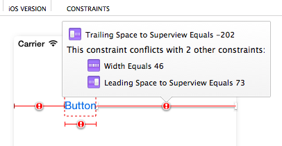](designer-auto-layout-images/image11.png#lightbox)

### Underconstrained Items

Underconstrained items appear in orange and trigger the appearance of an orange marker icon in the view controller object bar:

 [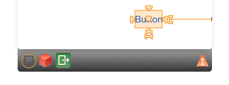](designer-auto-layout-images/image02.png#lightbox)

If you click on that marker icon, you can get information about underconstrained items in the scene and solve the issues by either fully constraining them or by removing their constraints, as illustrated by the screenshot below:

 [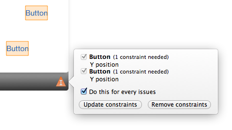](designer-auto-layout-images/image10.png#lightbox)

### Frame Misplacement

Frame misplacement uses the same color code as underconstrained items. The item will always be rendered on the surface using its native frame, but in the case of a frame misplacement a red rectangle will mark where the item will end up when the application runs, as illustrated by the screenshot below:

 [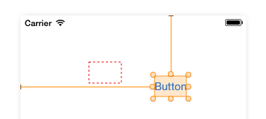](designer-auto-layout-images/image05.png#lightbox)

To resolve frame misplacement errors, select the **Update Frames Based on Constraints** button from the constraints toolbar (far right button):

 [](designer-auto-layout-images/image03.png#lightbox)

This will automatically adjust the element frame to match the positions defined by the controls.

<a name="modifying-in-code"></a>

## Modifying Constraints in Code

Based on the requirements of your app, there might be times when you need to modify a constraint in code. For example, to resize or reposition the View a Constraint is attached to, to change a Constraint's priority or deactivate a Constraint altogether.

To access a Constraint in code, you first have to expose it in the iOS Designer by doing the following:

1. Create the Constraint as normal (using any of the methods listed above).
2. In the **Document Outline Explorer**, find the desired Constraint and select it:

    [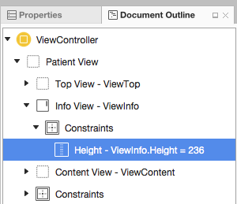](designer-auto-layout-images/modify01.png#lightbox)
3. Next, assign a **Name** to the Constraint in the **Widget** tab of the **Properties Explorer**:

    [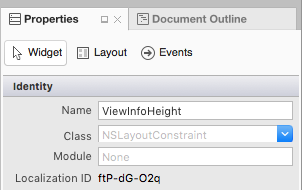](designer-auto-layout-images/modify02.png#lightbox)
4. Save your changes.

With the above changes in place, you can access the Constraint in code and modify its properties. For example, you can use the following to set the height of the attached View to zero:

```csharp
ViewInfoHeight.Constant = 0;
```

Given the following setting for the Constraint in the iOS Designer:

[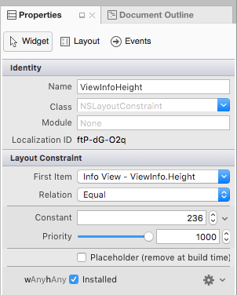](designer-auto-layout-images/modify03.png#lightbox)

### The Deferred Layout Pass

Instead of instantly updating the attached View in response to Constraint changes, the Auto Layout Engine schedules a _Deferred Layout Pass_ for the near future. During this deferred pass, not only is the given View's Constraint updated, the Constraints for every View in the hierarchy are recalculated and updated to adjust for the new layout.

At any point, you can schedule your own Deferred Layout Pass by calling the `SetNeedsLayout` or `SetNeedsUpdateConstraints` methods of the parent View.

The Deferred Layout Pass consists of two unique passes through the view hierarchy:

- **The Update Pass** - In this pass, the Auto Layout Engine traverses the view hierarchy and invokes the `UpdateViewConstraints` method on all View Controllers and the `UpdateConstraints` method on all Views.
- **The Layout Pass** - Again, the Auto Layout Engine traverses the view hierarchy, but this time invokes the `ViewWillLayoutSubviews` method on all View Controllers and the `LayoutSubviews` method on all Views. The `LayoutSubviews` method updates the `Frame` property of each subview with the rectangle calculated by the Auto Layout Engine.

### Animating Constraint Changes

In addition to modifying Constraint properties, you can use Core Animation to animate changes to a View's Constraints. For example:

```csharp
UIView.BeginAnimations("OpenInfo");
UIView.SetAnimationDuration(1.0f);
ViewInfoHeight.Constant = 237;
View.LayoutIfNeeded();

//Execute Animation
UIView.CommitAnimations();
```

The key here is calling the `LayoutIfNeeded` method of the parent view inside of the animation block. This tells the view to draw each "frame" of the animated location or size change. Without this line, the View would simply snap to the final version without animating.

## Summary

This guide introduced iOS Auto (or “adaptive”) Layout and the concept of constraints as mathematical representations of relationships between elements on the design surface. It described how to enable Auto Layout in the iOS designer, working with the **Constraints toolbar**, and editing constraints individually on the design surface. Next, it explained how to troubleshoot three common constraints issues. Finally, it showed how to modify constraints in code.

## Related Links

- [Introduction to Storyboards](~/ios/user-interface/storyboards/index.md)
- [iOS Designable Controls Walkthrough](~/ios/user-interface/designer/ios-designable-controls-walkthrough.md)
- [Android Designer Overview](~/android/user-interface/android-designer/index.md)
- [Programmatic Constraints](~/ios/user-interface/programmatic-layout-constraints.md)
