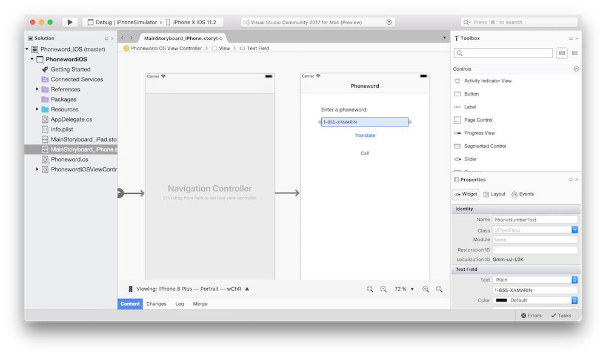
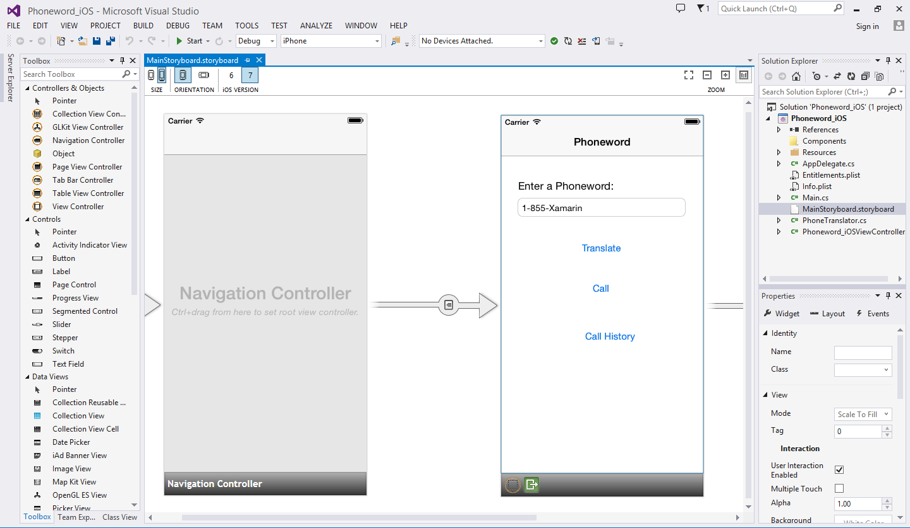

# Building User Interfaces with the iOS Designer

_The Xamarin Designer for iOS is a visual designer for the iOS Storyboard and Interface Builder formats that is fully integrated with Visual Studio for Mac and Visual Studio. The iOS Designer maintains full compatibility with the Storyboard and .xib formats, so that files can be edited in either Visual Studio for Mac or Visual Studio in addition to Xcode's Interface Builder. Additionally, the Xamarin Designer for iOS supports advanced features such as custom controls that render at design-time in the editor._

> [!WARNING]
> The iOS Designer will start to be phased out in Visual Studio 2019 version 16.8 and Visual Studio 2019 for Mac version 8.8.
> The recommended way to build iOS user interfaces is directly on a Mac running Xcode. For more information, see [Designing user interfaces with Xcode](../storyboards/index.md). 

# [Visual Studio for Mac](#tab/macos)

# [Visual Studio](#tab/windows)

-----

## Availability

The Xamarin Designer for iOS is available in Visual Studio for Mac and in Visual Studio 2017 on Windows.

These guides assumes a familiarity with the contents covered in the [Xamarin.iOS Getting Started guides](~/ios/get-started/index.md).

## [iOS Designer Basics](introduction.md)

This guide covers the features of the Xamarin iOS designer. It covers designer basics, showing how to use the designer to lay out controls visually and how to edit properties.

## [Designable Controls Overview](ios-designable-controls-overview.md)

This guide looks in depth at custom controls, how they are created and what requirements they must meet to be rendered on the design surface. Additionally, it shows how to debug common issues that can occur when using Designable Controls.

## [Walkthrough - Using Custom Controls with iOS Designer](ios-designable-controls-walkthrough.md)

This article provides a step-by-step walkthrough showing how to create a custom control and use it in the iOS designer. It shows how to make a control available in the designer’s Toolbox so it can be drag/dropped onto a view. Additionally, it shows how to implement a control so it renders properly at design time and runtime, as well as how to create properties that can be set at design time.

## [Auto Layout with the Xamarin iOS Designer](designer-auto-layout.md)

This guide introduces iOS Auto Layout and the new constraints workflow available in the iOS designer.
