# iOS Designer basics

_This guide introduces the Xamarin Designer for iOS. It demonstrates how to use the iOS Designer to visually lay out controls, how to access those controls in code, and how to edit properties._

> [!WARNING]
> The iOS Designer will start to be phased out in Visual Studio 2019 version 16.8 and Visual Studio 2019 for Mac version 8.8.
> The recommended way to build iOS user interfaces is directly on a Mac running Xcode. For more information, see [Designing user interfaces with Xcode](../storyboards/index.md). 

The Xamarin Designer for iOS is a visual interface designer similar to Xcode's Interface Builder and the Android Designer. Some of its many features include seamless integration with Visual Studio for Windows and Mac, drag-and-drop editing, an interface for setting up event handlers, and the ability to render custom controls.

## Requirements

The iOS Designer is available in Visual Studio for Mac and Visual Studio 2017 and later on Windows. In Visual Studio for Windows, the iOS Designer requires a connection to a properly configured Mac build host, though Xcode need not be running.

This guide assumes a familiarity with the contents covered in the [Getting Started guides](~/ios/get-started/index.md).

<a name="how-it-works"></a>

## How the iOS Designer works

This section describes how the iOS Designer facilitates creating a user interface and connecting it to code.

The iOS Designer allows developers to visually design an application's user interface. As outlined in the [Introduction to Storyboards](~/ios/user-interface/storyboards/index.md) guide, a storyboard describes the screens (view controllers) that make up an app, the interface elements (views) placed on those view controllers, and the app's overall navigation flow. 

A view controller has two parts: a visual representation in the iOS Designer and an associated C# class:

<!-- markdownlint-disable MD001 -->

# [Visual Studio for Mac](#tab/macos)

[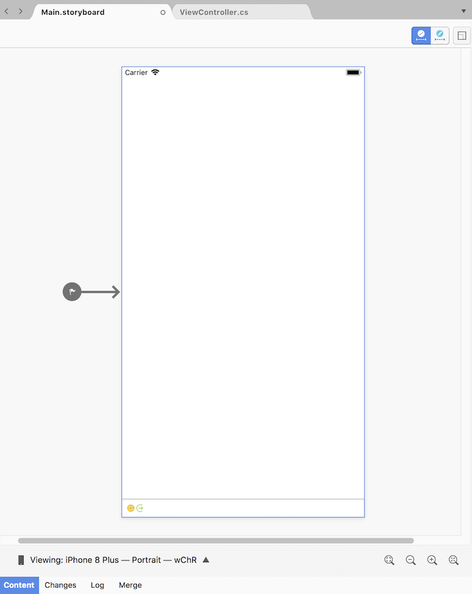](introduction-images/1-storyboardwithviewcontroller-vsmac-large.png#lightbox)

[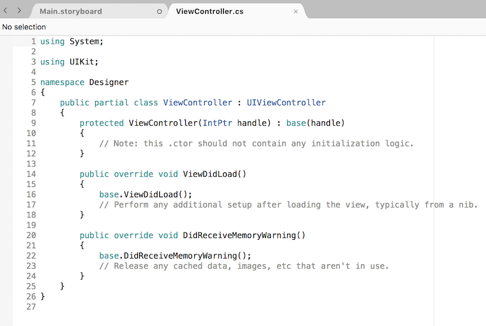](introduction-images/2-viewcontrollercode-vsmac-large.png#lightbox)

# [Visual Studio](#tab/windows)

[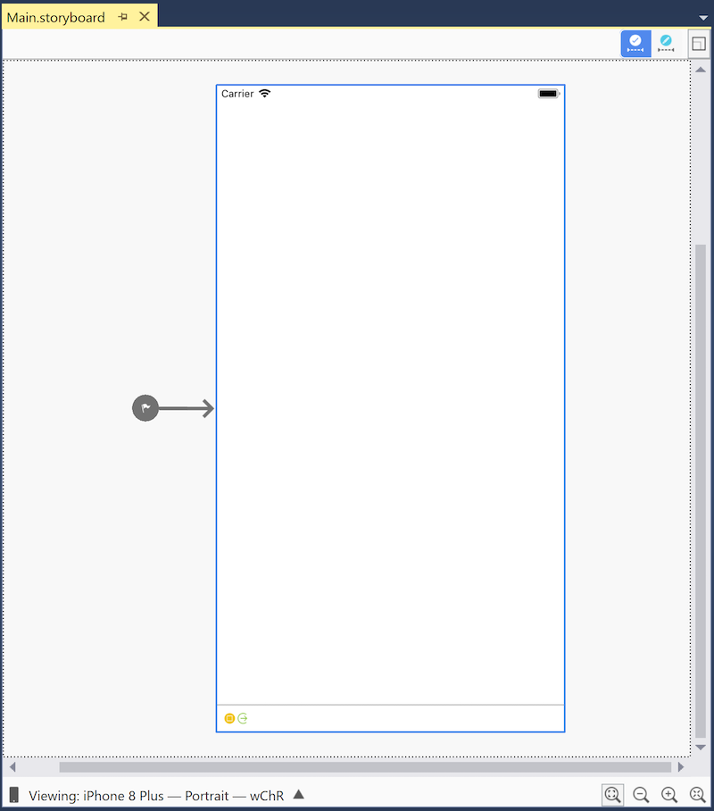](introduction-images/1-storyboardwithviewcontroller-vs-large.png#lightbox)

[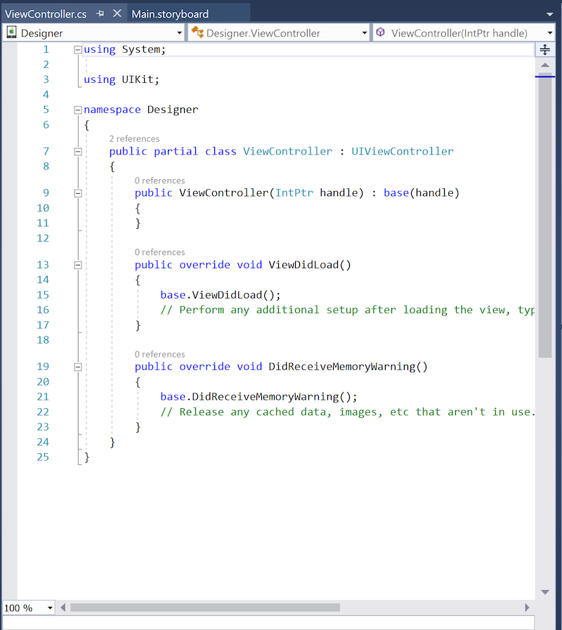](introduction-images/2-viewcontrollercode-vs-large.png#lightbox)

-----

In its default state, a view controller doesn't provide any functionality; it must be populated with controls. These controls are placed in the view controller's view, the rectangular area that contains all of the screen's content. Most view controllers contain common controls such as buttons, labels, and text fields, as illustrated in the following screenshot, which shows a view controller containing a button: 

# [Visual Studio for Mac](#tab/macos)

[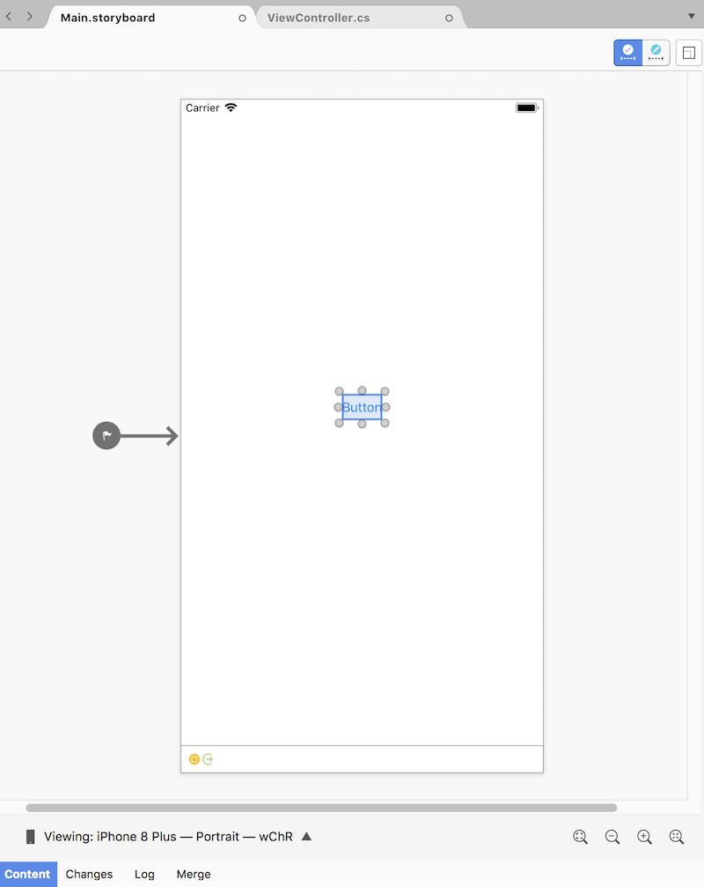](introduction-images/3-viewcontrollerwithbutton-vsmac-large.png#lightbox)

# [Visual Studio](#tab/windows)

[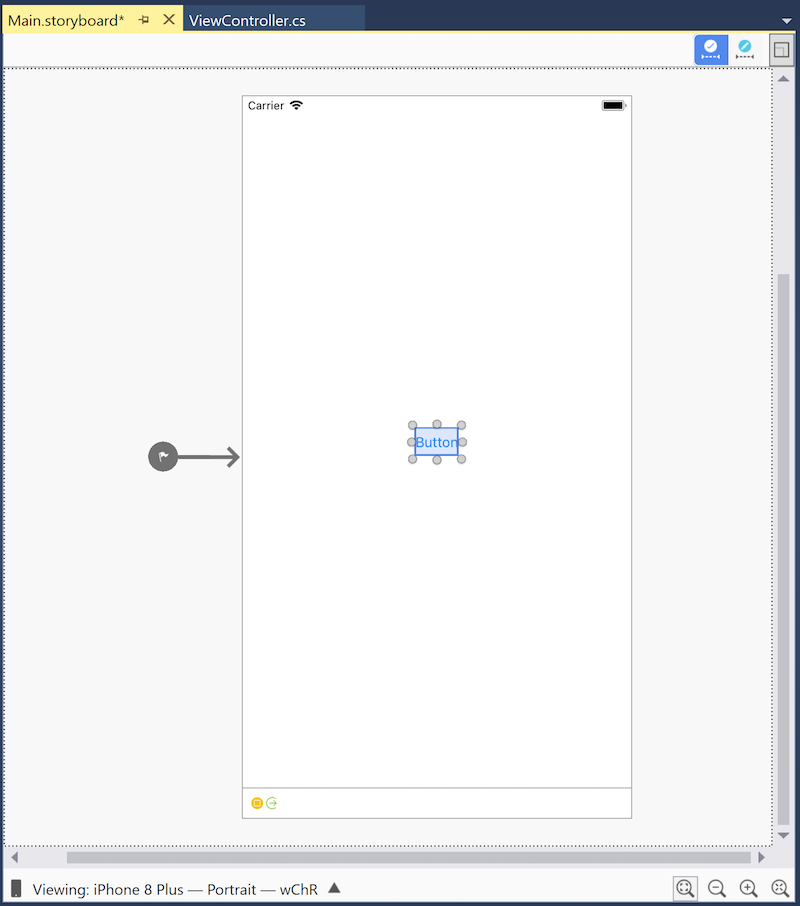](introduction-images/3-viewcontrollerwithbutton-vs-large.png#lightbox)

-----

Some controls, such as labels containing static text, can be added to the view controller and left alone. However, more often than not, controls must be customized programmatically. For example, the button added above should do something when tapped, so an event handler must be added in code.

# [Visual Studio for Mac](#tab/macos)

In order to access and manipulate the button in code, it must have a unique identifier. Provide a unique identifier by selecting the button, opening the **Properties Pad**, and setting its **Name** field to a value such as "SubmitButton":

[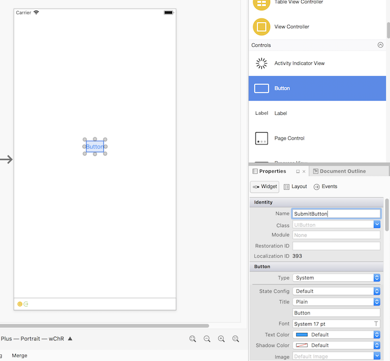](introduction-images/4-settingbuttonname-vsmac-large.png#lightbox)

# [Visual Studio](#tab/windows)

In order to access and manipulate the button in code, it must have a unique identifier. Provide a unique identifier by selecting the button, opening the **Properties Window**, and setting its **Name** field to a value such as "SubmitButton":

[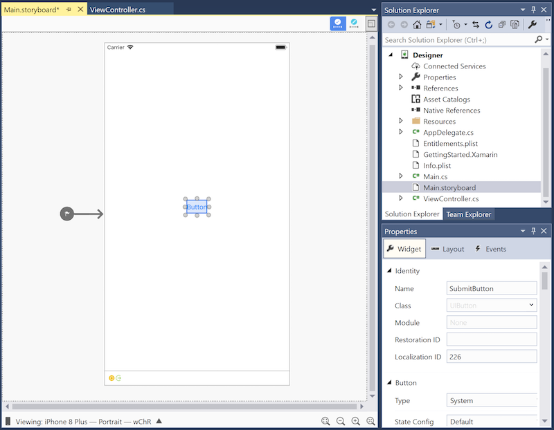](introduction-images/4-settingbuttonname-vs-large.png#lightbox)

-----

Now that the button has a name, it can be accessed in code. But how does this work?

# [Visual Studio for Mac](#tab/macos)

In the **Solution Pad**, navigating to **ViewController.cs** and clicking on the disclosure indicator reveals that the view controller's `ViewController` class definition spans two files, each of which contains a [partial class](/dotnet/csharp/programming-guide/classes-and-structs/partial-classes-and-methods) definition:

[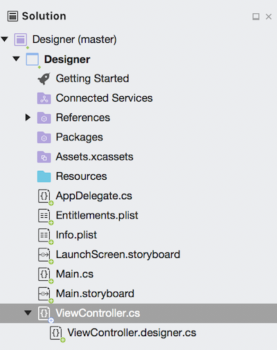](introduction-images/5-twoviewcontrollerfiles-vsmac-large.png#lightbox)

# [Visual Studio](#tab/windows)

In the **Solution Explorer**, navigating to **ViewController.cs** and clicking on the disclosure indicator reveals that the view controller's `ViewController` class definition spans two files, each of which contains a [partial class](/dotnet/csharp/programming-guide/classes-and-structs/partial-classes-and-methods) definition:

[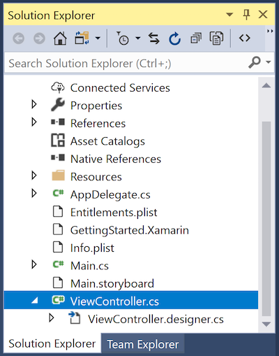](introduction-images/5-twoviewcontrollerfiles-vs-large.png#lightbox)

-----

- **ViewController.cs** should be populated with custom code related to the `ViewController` class. In this file, the `ViewController` class can respond to various iOS view controller lifecycle methods, customize the UI, and respond to user input such as button taps.

- **ViewController.designer.cs** is a generated file, created by the iOS Designer to map the visually-constructed interface to code. Since changes to this file will be overwritten, it should not be modified. Property declarations in this file make it possible for code in the `ViewController` class to access, by **Name**, controls set up in the iOS Designer. Opening **ViewController.designer.cs** reveals the following code:

```csharp
namespace Designer
{
    [Register ("ViewController")]
    partial class ViewController
    {
        [Outlet]
        [GeneratedCode ("iOS Designer", "1.0")]
        UIKit.UIButton SubmitButton { get; set; }

        void ReleaseDesignerOutlets ()
        {
            if (SubmitButton != null) {
                SubmitButton.Dispose ();
                SubmitButton = null;
            }
        }
    }
}
```

The `SubmitButton` property declaration connects the entire `ViewController` class - not just the **ViewController.designer.cs** file – to the button defined in the storyboard. Since **ViewController.cs** defines part of the `ViewController` class, it has access to `SubmitButton`.

The following screenshot illustrates that IntelliSense now recognizes the `SubmitButton` reference in **ViewController.cs**:

# [Visual Studio for Mac](#tab/macos)

[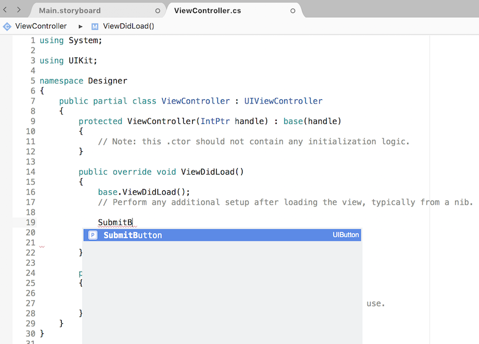](introduction-images/6-submitbuttonintellisense-vsmac-large.png#lightbox)

# [Visual Studio](#tab/windows)

[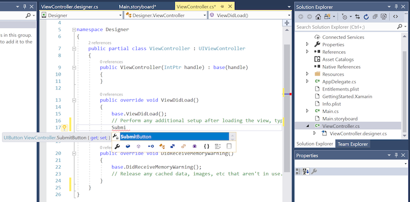](introduction-images/6-submitbuttonintellisense-vs-large.png#lightbox)

-----

This section has demonstrated how create a button in the iOS Designer and access that button in code.

The remainder of this document provides a further overview of the iOS Designer.

## iOS Designer basics

This section introduces the parts of the iOS Designer and provides a tour of its features.

### Launching the iOS Designer

# [Visual Studio for Mac](#tab/macos)

Xamarin.iOS projects created with Visual Studio for Mac include a storyboard. To view the contents of a storyboard, double-click the .storyboard file in the **Solution Pad**:

[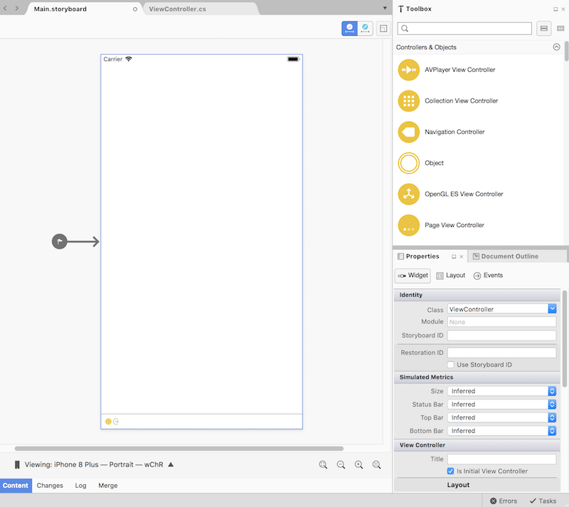](introduction-images/7-storyboardopen-vsmac-large.png#lightbox)

# [Visual Studio](#tab/windows)

Most Xamarin.iOS projects created with Visual Studio include a storyboard. To view the contents of a storyboard, double-click the .storyboard file in the **Solution Explorer**:

[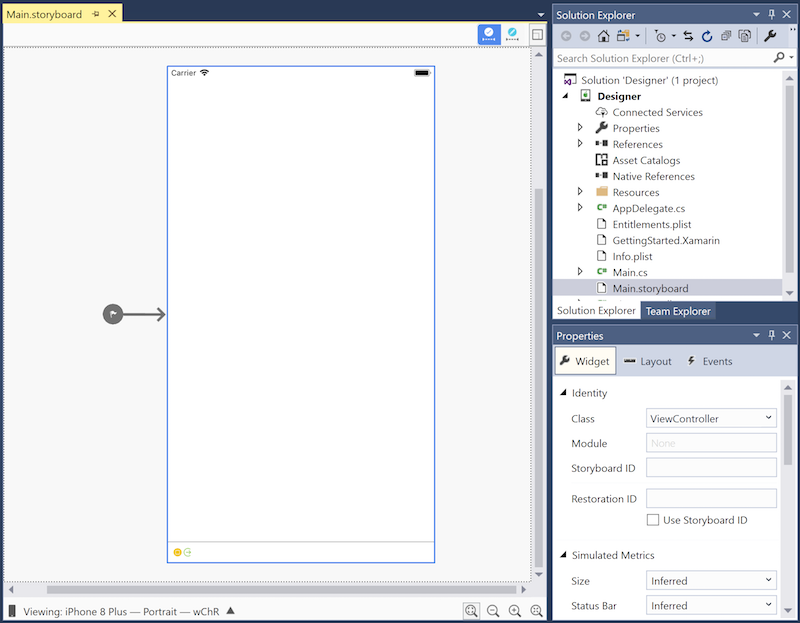](introduction-images/7-storyboardopen-vs-large.png#lightbox)

-----

<a name="iOS_Designer_features"></a>

### iOS Designer features

The iOS Designer has six primary sections:

# [Visual Studio for Mac](#tab/macos)

[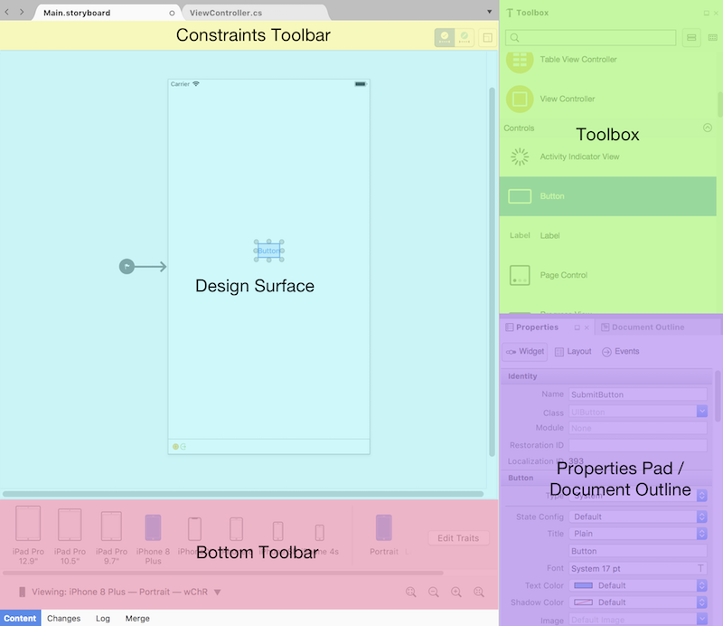](introduction-images/8-sixpartsofiosdesigner-vsmac-large.png#lightbox)

1. **Design Surface** – The iOS Designer's primary workspace. Shown in the document area, it enables the visual construction of user interfaces.
2. **Constraints Toolbar** – Allows for switching between frame editing mode and constraint editing mode, two different ways to position elements in a user interface.
3. **Toolbox** – Lists the controllers, objects, controls, data views, gesture recognizers, windows, and bars that can be dragged onto the design surface and added to a user interface.
4. **Properties Pad** – Shows properties for the selected control, including identity, visual styles, accessibility, layout, and behavior.
5. **Document Outline** – Shows the tree of controls that compose the layout for the interface being edited. Clicking on an item in the tree selects it in the iOS Designer and shows its properties in the  **Properties Pad**. This is handy for selecting a specific control in a deeply-nested user interface.
6. **Bottom Toolbar** – Contains options for changing how the iOS Designer displays the .storyboard or .xib file, including device, orientation, and zoom.

# [Visual Studio](#tab/windows)

[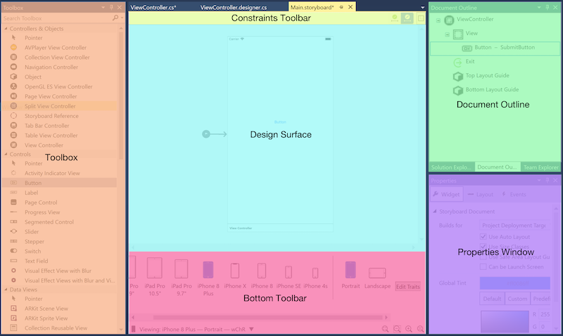](introduction-images/8-sixpartsofiosdesigner-vs-large.png#lightbox)

1. **Design Surface** – The iOS Designer's primary workspace. Shown in the document area, it enables the visual construction of user interfaces.
2. **Constraints Toolbar** – Allows for switching between frame editing mode and constraint editing mode, two different ways to position elements in a user interface.
3. **Toolbox** – Lists the controllers, objects, controls, data views, gesture recognizers, windows, and bars that can be dragged onto the design surface and added to a user interface.
4. **Properties Window** – Shows properties for the selected control, including identity, visual styles, accessibility, layout, and behavior.
5. **Document Outline** – Shows the tree of controls that compose the layout for the interface being edited. Clicking on an item in the tree selects it in the iOS Designer and shows its properties in the  **Properties Window**. This is handy for selecting a specific control in a deeply-nested user interface.
6. **Bottom Toolbar** – Contains options for changing how the iOS Designer displays the .storyboard or .xib file, including device, orientation, and zoom.

-----

### Design workflow

#### Adding a control to the interface

To add a control to an interface, drag it from the **Toolbox** and drop it on the design surface. When adding or positioning a control, vertical and horizontal guidelines highlight commonly-used layout positions such as vertical center, horizontal center, and margins:

# [Visual Studio for Mac](#tab/macos)

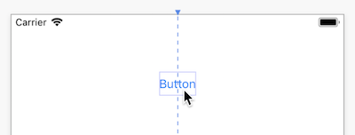

# [Visual Studio](#tab/windows)

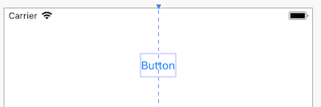

-----

The blue dotted line in the example above provides a horizontal center visual alignment guideline to help with the button placement.

# [Visual Studio for Mac](#tab/macos)

#### Context menu commands

A context menu is available both on the design surface and in the **Document Outline**. This menu provides commands for the selected control and its parent, which is helpful when working with views in a nested hierarchy:

[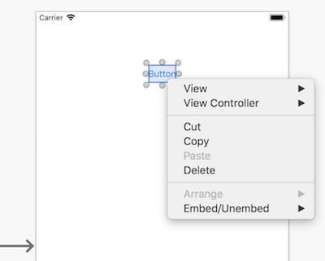](introduction-images/10-contextmenudesignsurface-vsmac-large.png#lightbox)

# [Visual Studio](#tab/windows)

-----

### Constraints toolbar

# [Visual Studio for Mac](#tab/macos)

[](introduction-images/11-constraintstoolbar-vsmac-large.png#lightbox)

# [Visual Studio](#tab/windows)

[](introduction-images/11-constraintstoolbar-vs-large.png#lightbox)

-----

The constraints toolbar has been updated and now consists of two controls: the frame editing mode / constraint editing mode toggle and the update constraints / update frames button.

#### Frame editing mode / constraint editing mode toggle

In previous versions of the iOS Designer, clicking an already-selected view on the design surface toggled between frame editing mode and constraint editing mode. Now, a toggle control in the constraints toolbar switches between these editing modes.

- Frame editing mode:

# [Visual Studio for Mac](#tab/macos)

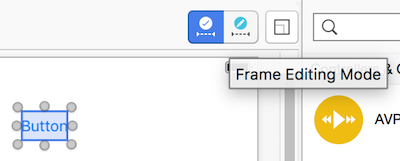

# [Visual Studio](#tab/windows)

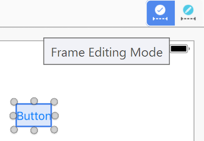

-----

- Constraint editing mode:

# [Visual Studio for Mac](#tab/macos)

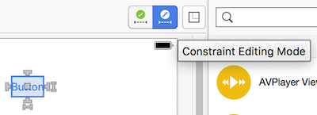

# [Visual Studio](#tab/windows)

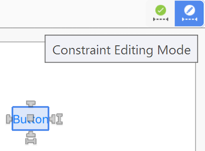

-----

#### Update constraints / update frames button

The update constraints / update frames button sits to the right of the frame editing mode / constraint editing mode toggle.

- In frame editing mode, clicking this button adjusts the frames of any selected elements to match their constraints.
- In constraint editing mode, clicking this button adjusts the constraints of any selected elements to match their frames.

### Bottom toolbar

The bottom toolbar provides a way to select the device, orientation, and zoom used to view a storyboard or .xib file in the iOS Designer:

# [Visual Studio for Mac](#tab/macos)

[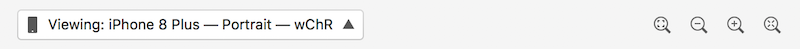](introduction-images/13-bottomtoolbar-vsmac-large.png#lightbox)

# [Visual Studio](#tab/windows)

[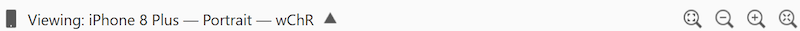](introduction-images/13-bottomtoolbar-vs-large.png#lightbox)

-----

#### Device and orientation

When expanded, the bottom toolbar displays all devices, orientations, and/or adaptations applicable to the current document. Clicking them changes the view displayed on the design surface. 

# [Visual Studio for Mac](#tab/macos)

[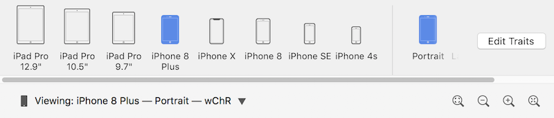](introduction-images/14-bottomtoolbarexpanded-vsmac-large.png#lightbox)

# [Visual Studio](#tab/windows)

[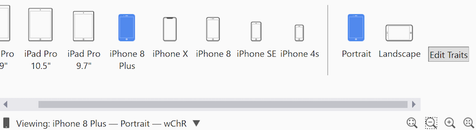](introduction-images/14-bottomtoolbarexpanded-vs-large.png#lightbox)

-----

Note that selecting a device and orientation changes only how the iOS Designer previews the design. Regardless of the current selection, newly added constraints are applied across all devices and orientations unless the **Edit Traits** button has been used to specify otherwise.

When [size classes](~/ios/user-interface/storyboards/unified-storyboards.md#size-classes) are [enabled](~/ios/user-interface/storyboards/unified-storyboards.md#enabling-size-classes), the **Edit Traits** button will appear in the expanded bottom toolbar.  Clicking the **Edit Traits** button displays options for creating an interface variation based on the size class represented by the selected device and orientation. Consider the following examples:

- If **iPhone SE** / **Portrait**, is selected, the popover will provide options to create an interface variation for the compact width, regular height size class. 
- If **iPad Pro 9.7"** / **Landscape** / **Full Screen** is selected, the popover will provide options to create an interface variation for the regular width, regular height size class.

# [Visual Studio for Mac](#tab/macos)

[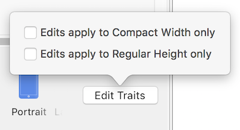](introduction-images/15-edittraitsbutton-vsmac-large.png#lightbox)

# [Visual Studio](#tab/windows)

[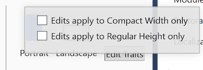](introduction-images/15-edittraitsbutton-vs-large.png#lightbox)

-----

#### Zoom controls

The design surface supports zooming via several controls:

# [Visual Studio for Mac](#tab/macos)

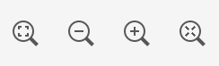

# [Visual Studio](#tab/windows)


-----

The controls include the following:

1. Zoom to fit
2. Zoom out
3. Zoom in
4. Actual size (1:1 pixel size)

These controls adjust the zoom on the design surface. They do not affect the user interface of the application at runtime.

# [Visual Studio for Mac](#tab/macos)

### Properties Pad

Use the **Properties Pad** to edit the identity, visual styles, accessibility, and behavior of a control. The following screenshot illustrates the **Properties Pad** options for a button:

[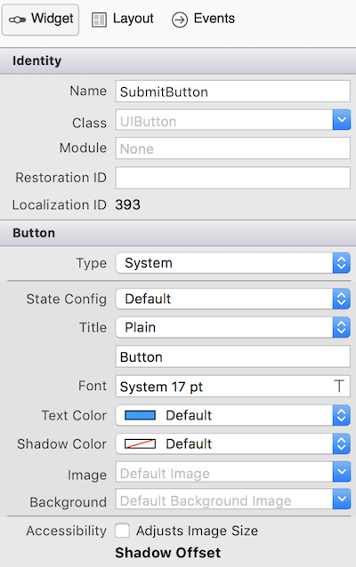](introduction-images/17-buttonpropertiespad-vsmac-large.png#lightbox)
#### Properties Pad sections

The **Properties Pad** contains three sections:

# [Visual Studio](#tab/windows)

### Properties Window

Use the **Properties Window** to edit the identity, visual styles, accessibility, and behavior of a control. The following screenshot illustrates the **Properties Window** options for a button:

[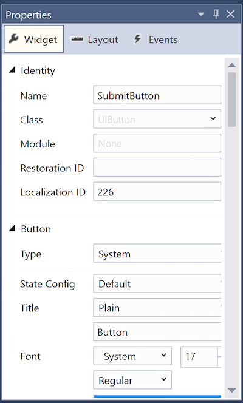](introduction-images/17-buttonpropertieswindow-vs-large.png#lightbox)

#### Properties Window sections

The **Properties Window** contains three sections:

-----

1. **Widget** – The main properties of the control, such as name, class, style properties, etc. Properties for managing the control’s content are usually placed here.
2. **Layout** – Properties that keep track of the position and size of the control, including constraints and frames, are listed here.
3. **Events** – Events and event handlers are specified here. Useful for handling events such as touch, tap, drag, etc. Events can also be handled directly in code.

# [Visual Studio for Mac](#tab/macos)

#### Editing properties in the Properties Pad

In addition to visual editing on the design surface, the iOS Designer supports editing properties in the **Properties Pad**. The available properties change based on the selected control, as illustrated by the screenshots below:

[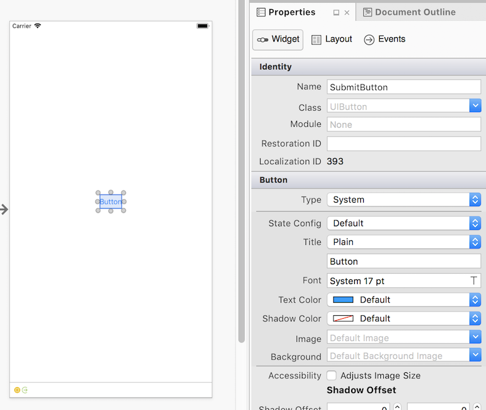](introduction-images/18a-buttonpropertiespad-vsmac-large.png#lightbox)

[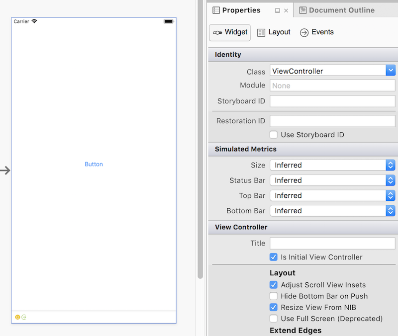](introduction-images/18b-viewcontrollerpropertiespad-vsmac-large.png#lightbox)

# [Visual Studio](#tab/windows)

#### Editing properties in the Properties Window

In addition to visual editing on the design surface, the iOS Designer supports editing properties in the **Properties Window**. The available properties change based on the selected control, as illustrated by the screenshots below:

[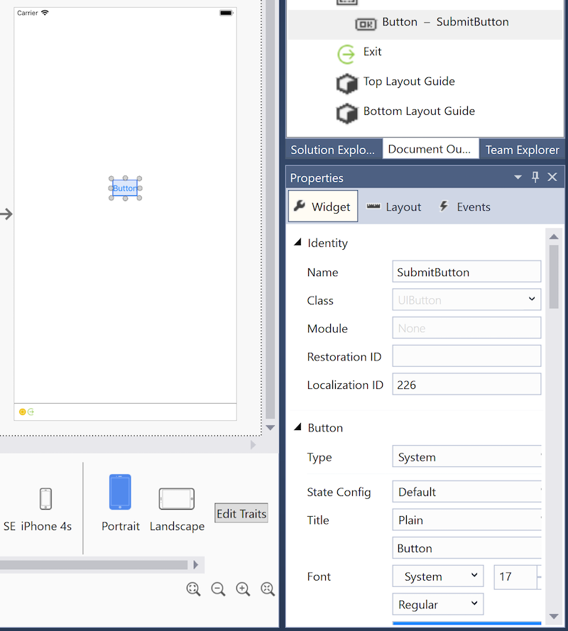](introduction-images/18a-buttonpropertieswindow-vs-large.png#lightbox)

[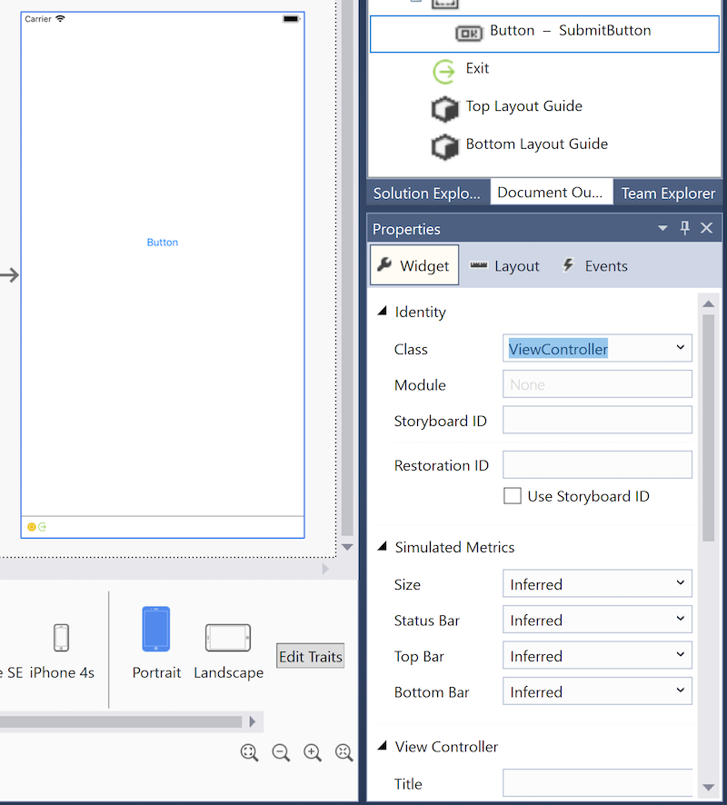](introduction-images/18b-viewcontrollerpropertieswindow-vs-large.png#lightbox)

-----

> [!IMPORTANT]
> The Identity section of the Properties Pad now shows a **Module** field. It is necessary to fill in this section only when interoperating with Swift classes. Use it to enter a module name for Swift classes, which are namespaced.

#### Default values

# [Visual Studio for Mac](#tab/macos)

Many properties in the **Properties Pad** show no value or a default value. However, the application's code may still modify these values. The **Properties Pad** does not show values set in code.

# [Visual Studio](#tab/windows)

Many properties in the **Properties Window** show no value or a default value. However, the application's code may still modify these values. The **Properties Window** does not show values set in code.

-----

#### Event handlers

# [Visual Studio for Mac](#tab/macos)

To specify custom event handlers for various events, use the **Events** tab of the **Properties Pad**. For example, in the screenshot below, a `HandleClick` method handles the button's **Touch Up Inside** event:

[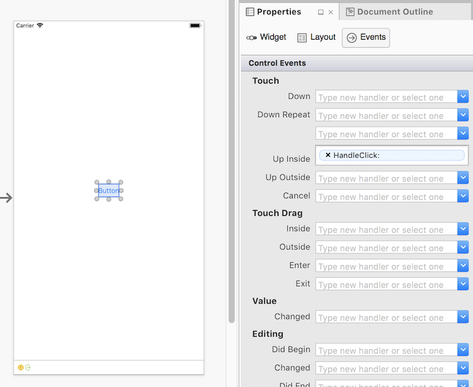](introduction-images/19-buttonpropertiespadevents-vsmac-large.png#lightbox)

# [Visual Studio](#tab/windows)

To specify custom event handlers for various events, use the **Events** tab of the **Properties Window**. For example, in the screenshot below, a `HandleClick` method handles the button's **Touch Up Inside** event:

[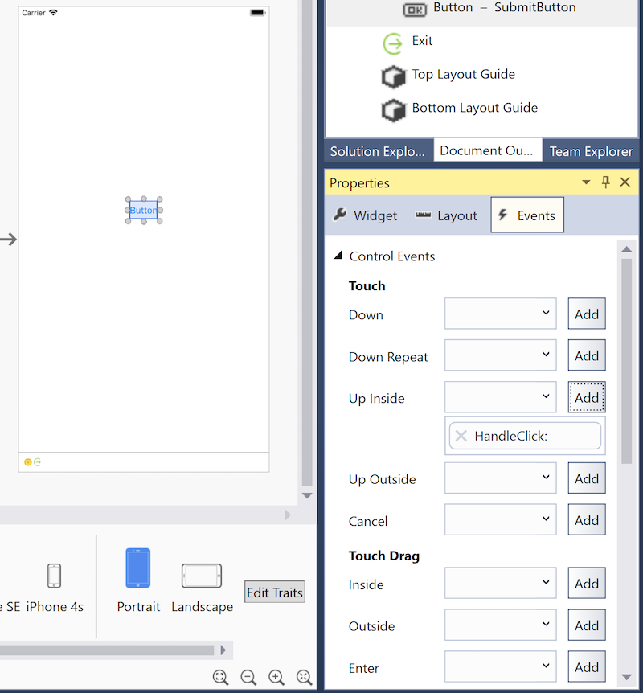](introduction-images/19-buttonpropertieswindowevents-vs-large.png#lightbox)

-----

Once an event handler has been specified, a method of the same name must be added to the corresponding view controller class. Otherwise, an `unrecognized selector` exception will occur when the button is tapped:

# [Visual Studio for Mac](#tab/macos)

[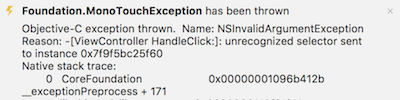](introduction-images/20-unrecognizedselector-vsmac-large.png#lightbox)

Note that after an event handler has been specified in the **Properties Pad**, the iOS Designer will immediately open the corresponding code file and offer to insert the method declaration. 

# [Visual Studio](#tab/windows)

[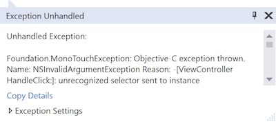](introduction-images/20-unrecognizedselector-vs-large.png#lightbox)

-----

For an example that uses custom event handlers, refer to the [Hello, iOS Getting Started Guide](~/ios/get-started/hello-ios/index.md).

### Outline view

The iOS Designer can also display an interface's hierarchy of controls as an outline. The outline is available by selecting the **Document Outline** tab, as shown below:

# [Visual Studio for Mac](#tab/macos)

[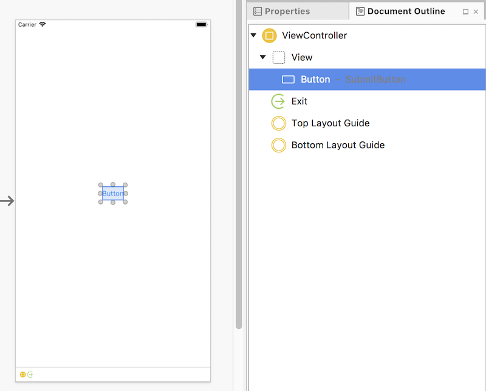](introduction-images/21-buttonoutlineview-vsmac-large.png#lightbox)

# [Visual Studio](#tab/windows)

[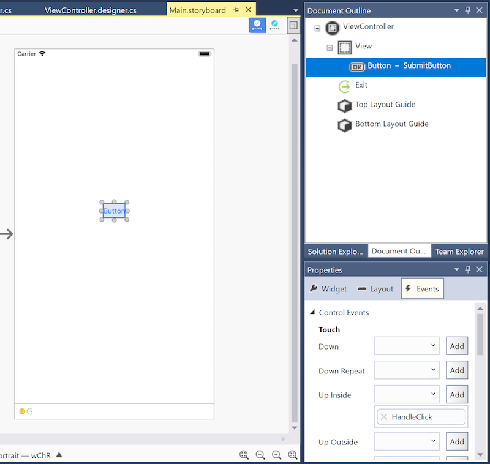](introduction-images/21-buttonoutlineview-vs-large.png#lightbox)

-----

The selected control in the outline view stays in sync with the selected control on the design surface.  This feature is useful for selecting an item from a deeply nested interface hierarchy.

# [Visual Studio for Mac](#tab/macos)

## Revert to Xcode

It is possible to use the iOS Designer and Xcode Interface Builder interchangeably. To open a storyboard or a .xib file in Xcode Interface Builder, right-click on the file and select **Open With > Xcode Interface Builder**, as illustrated by the screenshot below:

[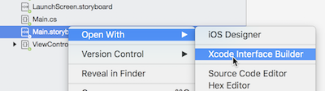](introduction-images/22-openinxcodeinterfacebuilder-vsmac-large.png#lightbox)

After making edits in Xcode Interface Builder, save the file and return to Visual Studio for Mac. The changes will sync to the Xamarin.iOS project.

# [Visual Studio](#tab/windows)

## Revert to Xcode

It is possible to use the iOS Designer and Xcode Interface Builder interchangeably, however Xcode Interface Builder is only available on Mac. To open a storyboard or .xib file in Xcode Interface Builder on a Mac, open the solution containing the Xamarin.iOS project in [Visual Studio for Mac](/visualstudio/mac/), right-click on the file and select **Open With > Xcode Interface Builder**, as illustrated by the screenshot below:

[](introduction-images/22-openinxcodeinterfacebuilder-vsmac-large.png#lightbox)

After making edits in Xcode Interface Builder, save the file and return to Visual Studio for Mac. The changes will sync to the Xamarin.iOS project.

-----

## .xib support

The iOS Designer supports creating, editing, and managing .xib files. These are XML files that respresent single, custom views which can be added to an application's view hierarchy. A .xib file generally represents the interface for a single view or screen in an application, whereas a storyboard represents many screens and the transitions between them.

There are many opinions about which solution – .xib files, storyboards, or code – works best for creating and maintaining a user interface. In reality, there is no perfect solution, and it's always worth considering the best tool for the job at hand. That said, .xib files are generally most powerful when used to represent a custom view needed in multiple places in an app, such as a custom table view cell. 

More documentation about using .xib files can be found in the following recipes:

- [Using the View .xib Template](https://github.com/xamarin/recipes/tree/master/Recipes/ios/general/templates/using_the_ios_view_xib_template)
- [Creating a Custom TableViewCell using a .xib](https://github.com/xamarin/recipes/tree/master/Recipes/ios/content_controls/tables/custom-tableviewcell)
- [Creating a Launch Screen using a .xib](https://github.com/xamarin/recipes/tree/master/Recipes/ios/general/templates/launchscreen-xib)

For more information regarding the use of storyboards, refer to the [Introduction to Storyboards](~/ios/user-interface/storyboards/index.md).

This and other iOS Designer-related guides refer to the use of storyboards as the standard approach for building user interfaces, since most Xamarin.iOS new project templates provide a storyboard by default.

## Summary

This guide provided an introduction to the iOS Designer, describing its features and outlining the tools it offers for designing beautiful user interfaces.

## Related Links

- [Introduction to Storyboards](~/ios/user-interface/storyboards/index.md)
- [iOS Designable Controls Walkthrough](~/ios/user-interface/designer/ios-designable-controls-walkthrough.md)
- [Hello, iOS](~/ios/get-started/hello-ios/index.md)
- [Hello, iOS Multiscreen](~/ios/get-started/hello-ios-multiscreen/index.md)
- [Android Designer Overview](~/android/user-interface/android-designer/index.md)
- [Partial Classes and Methods](/dotnet/csharp/programming-guide/classes-and-structs/partial-classes-and-methods)
- [Diving into the Xamarin Designer for iOS - Evolve 2014 (video)](https://www.youtube.com/watch?v=W4H9uLjoEjM)
- [Using the iOS Designer to Create a Launch Screen (video)](https://university.xamarin.com/lightninglectures/using-the-ios-designer-to-create-a-launch-screen)
