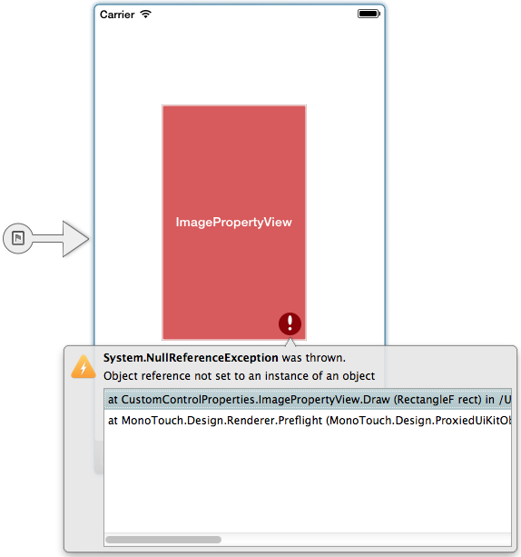
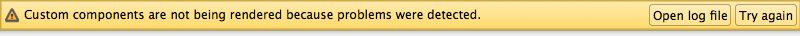

# Custom Controls in the Xamarin Designer for iOS

_The Xamarin Designer for iOS supports rendering custom controls created in your project or referenced from external sources like the Xamarin Component Store._

> [!WARNING]
> The iOS Designer will start to be phased out in Visual Studio 2019 version 16.8 and Visual Studio 2019 for Mac version 8.8.
> The recommended way to build iOS user interfaces is directly on a Mac running Xcode. For more information, see [Designing user interfaces with Xcode](../storyboards/index.md). 

The Xamarin Designer for iOS is a powerful tool for visualizing an application's user interface and provides
WYSIWYG editing support for most iOS views and view controllers. Your app may also contain custom controls
that extend the ones built into iOS. If these custom controls are written with a few guidelines in mind,
they can also be rendered by the iOS Designer, providing an even richer editing experience. This document
takes a look at those guidelines.

## Requirements

A control that meets all the following requirements will be rendered on the design surface:

1. It is a direct or indirect subclass of  [UIView](xref:UIKit.UIView) or  [UIViewController](xref:UIKit.UIViewController). Other [NSObject](xref:Foundation.NSObject) subclasses will appear as an icon on the design surface.
2. It has a  [RegisterAttribute](xref:Foundation.RegisterAttribute) to expose it to Objective-C.
3. It has  [the required IntPtr constructor](~/ios/internals/api-design/index.md).
4. It either implements the [IComponent](xref:System.ComponentModel.IComponent) interface or has a [DesignTimeVisibleAttribute](xref:System.ComponentModel.DesignTimeVisibleAttribute) set to True.

Controls defined in code that meet the above requirements will appear in the designer when their containing project is compiled for the simulator. By default, all custom controls will appear in the **Custom Components**
section of the **Toolbox**. However the [CategoryAttribute](xref:System.ComponentModel.CategoryAttribute) can be applied to the custom control's class to specify a different section.

The designer does not support loading third-party Objective-C libraries.

## Custom Properties

A property declared by a custom control will appear in the property panel if the following conditions are met:

1. The property has a public getter and setter.
1. The property has an  [ExportAttribute](xref:Foundation.ExportAttribute) as well as a  [BrowsableAttribute](xref:System.ComponentModel.BrowsableAttribute) set to True.
1. The property type is a numeric type, enumeration type, string, bool, [SizeF](xref:System.Drawing.SizeF), [UIColor](xref:UIKit.UIColor), or [UIImage](xref:UIKit.UIImage). This list of supported types may be expanded in the future.

The property may also be decorated with a [DisplayNameAttribute](xref:System.ComponentModel.DisplayNameAttribute) to specify the label that is displayed for it in the property panel.

## Initialization

For `UIViewController` subclasses, you should use the [ViewDidLoad](xref:UIKit.UIViewController.ViewDidLoad) method for code that depends on views you created in the designer.

For `UIView` and other `NSObject` subclasses, the [AwakeFromNib](xref:Foundation.NSObject.AwakeFromNib) method
is the recommended place to perform initialization of your custom control after it is loaded from the layout file. This is because any custom properties set in the property panel will not be set when the control's constructor is run, but they will be set before `AwakeFromNib` is called:

```csharp
[Register ("CustomView"), DesignTimeVisible (true)]
public class CustomView : UIView {

    public CustomView (IntPtr handle) : base (handle) { }

    public override void AwakeFromNib ()
    {
        // Initialize the view here.
    }
}
```

If the control is also designed to be created directly from code, you may want to create a method that has common initialization code, like this:

```csharp
[Register ("CustomView"), DesignTimeVisible (true)]
public class CustomView : UIView {

    public CustomView (IntPtr handle) : base (handle) { }

    public CustomView ()
    {
        // Called when created from code.
        Initialize ();
    }

    public override void AwakeFromNib ()
    {
        // Called when loaded from xib or storyboard.
        Initialize ();
    }

    void Initialize ()
    {
        // Common initialization code here.
    }
}
```

## Property Initialization and AwakeFromNib

Care should be taken on when and where to initialize designable properties in a custom component as to not overwrite values that have been set inside the iOS Designer. As an example, take the following code:

```csharp
[Register ("CustomView"), DesignTimeVisible (true)]
public class CustomView : UIView {

    [Export ("Counter"), Browsable (true)]
    public int Counter {get; set;}

    public CustomView (IntPtr handle) : base (handle) { }

    public CustomView ()
    {
        // Called when created from code.
        Initialize ();
    }

    public override void AwakeFromNib ()
    {
        // Called when loaded from xib or storyboard.
        Initialize ();
    }

    void Initialize ()
    {
        // Common initialization code here.
        Counter = 0;
    }
}
```

The `CustomView` component exposes a `Counter` property that can be set by the developer inside the iOS Designer. However, no matter what value is set inside the designer, the value of the `Counter` property will always be zero (0). Here's why:

- An instance of the  `CustomControl` is inflated from the Storyboard file.
- Any properties modified in the iOS designer are set (such as setting the value of the  `Counter` to two (2), for example).
- The  `AwakeFromNib` method is executed and a call is made to the component's  `Initialize` method.
- Inside  `Initialize` the value of the  `Counter` property is being reset to zero (0).

To fix the above situation, either initialize the `Counter` property elsewhere (such as in the component's constructor) or don't override the `AwakeFromNib` method and call `Initialize` if the component requires no further initialization outside of what is currently being handled by its constructors.

## Design Mode

On the design surface, a custom control must adhere to a few restrictions:

- App bundle resources are not available in design mode. Images are available when loaded through  [UIImage methods](xref:UIKit.UIImage) .
- Asynchronous operations, such as web requests, should not be performed in design mode. The design surface does not support animation or any other asynchronous updates to the control's UI.

A custom control can implement [IComponent](xref:System.ComponentModel.IComponent) and use the [DesignMode](xref:System.ComponentModel.ISite.DesignMode) property to check if it is on the design
surface. In this example, the label will display "Design Mode" on the design surface and "Runtime" at runtime:

```csharp
[Register ("DesignerAwareLabel")]
public class DesignerAwareLabel : UILabel, IComponent {

    #region IComponent implementation

    public ISite Site { get; set; }
    public event EventHandler Disposed;

    #endregion

    public DesignerAwareLabel (IntPtr handle) : base (handle) { }

    public override void AwakeFromNib ()
    {
        if (Site != null && Site.DesignMode)
            Text = "Design Mode";
        else
            Text = "Runtime";
    }
}
```

You should always check the `Site`
property for `null` before trying to access any of its members. If `Site` is `null`, it is safe to assume the control is not running in the designer.
In design mode, `Site` will be set after
the control's constructor has run and before `AwakeFromNib` is called.

## Debugging

A control that meets the above requirements will be displayed in the toolbox and rendered on the surface.
If a control is not rendered, check for bugs in the control or one of its dependencies.

The design surface can often catch exceptions thrown by individual controls while continuing to
render other controls. The faulty control is replaced with a red placeholder, and you can view the
exception trace by clicking on the exclamation icon:

 

If debug symbols are available for the control, the trace will have file names and line numbers.
Double clicking a line in the stack trace will jump to that line in the source code.

If the designer can't isolate the faulty control, a warning message will appear
at the top of the design surface:

 

Full rendering will resume when the faulty control is fixed or removed from the design surface.

## Summary

This article introduced the creation and application of custom controls in the iOS designer. First it described requirements that controls must meet to be rendered on the design surface and expose custom properties in the property panel. It then looked at the code behind - initialization of the control and the DesignMode property. Lastly it described what happens when exceptions are thrown and how to resolve this.
