# Using Custom Controls with the iOS Designer

> [!WARNING]
> The iOS Designer was deprecated in Visual Studio 2019 version 16.8 and Visual Studio 2019 for Mac version 8.8, and 
> removed in Visual Studio 2019 version 16.9 and Visual Studio for Mac version 8.9.
> The recommended way to build iOS user interfaces is directly on a Mac running Xcode. For more information, see [Designing user interfaces with Xcode](../storyboards/index.md). 

## Requirements

The Xamarin Designer for iOS is available in Visual Studio for Mac and Visual Studio 2017 and later on Windows.

This guide assumes a familiarity with the contents covered in the [Getting Started guides](~/ios/get-started/index.md).

## Walkthrough

> [!IMPORTANT]
> Starting in Xamarin.Studio 5.5, the way in which custom controls are created is slightly different to earlier versions. To create a custom control, either the `IComponent` interface is required (with the associated implementation methods) or the class can be annotated with `[DesignTimeVisible(true)]`. The latter method is being used in the following walkthrough example.

1. Create a new solution from the **iOS > App > Single View Application > C#** template, name it `ScratchTicket`, and continue through the New Project wizard:

    [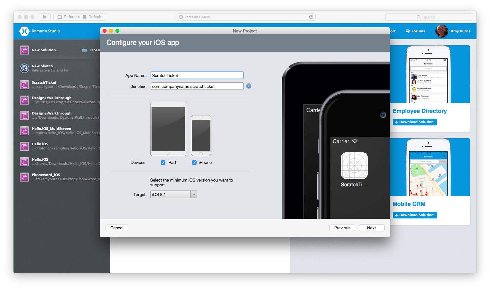](ios-designable-controls-walkthrough-images/01new.png#lightbox)

1. Create a new empty class file named `ScratchTicketView`:

    [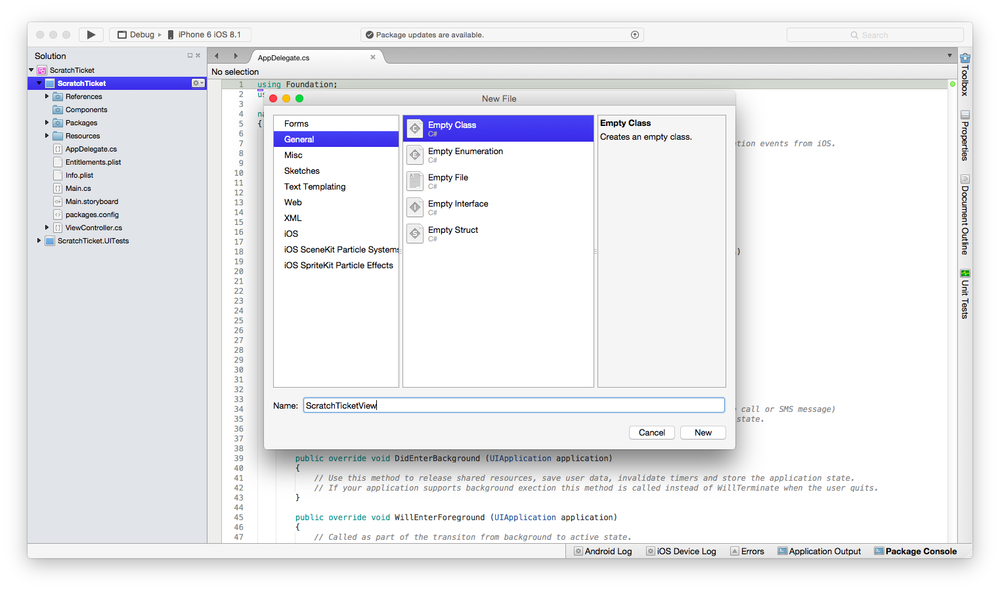](ios-designable-controls-walkthrough-images/02new.png#lightbox)

1. Add the following code for `ScratchTicketView` class:

    ```csharp
    using System;
    using System.ComponentModel;
    using CoreGraphics;
    using Foundation;
    using UIKit;

    namespace ScratchTicket
    {
        [Register("ScratchTicketView"), DesignTimeVisible(true)]
        public class ScratchTicketView : UIView
        {
            CGPath path;
            CGPoint initialPoint;
            CGPoint latestPoint;
            bool startNewPath = false;
            UIImage image;

            [Export("Image"), Browsable(true)]
            public UIImage Image
            {
                get { return image; }
                set
                {
                    image = value;
                    SetNeedsDisplay();
                }
            }

            public ScratchTicketView(IntPtr p)
                : base(p)
            {
                Initialize();
            }

            public ScratchTicketView()
            {
                Initialize();
            }

            void Initialize()
            {
                initialPoint = CGPoint.Empty;
                latestPoint = CGPoint.Empty;
                BackgroundColor = UIColor.Clear;
                Opaque = false;
                path = new CGPath();
                SetNeedsDisplay();
            }

            public override void TouchesBegan(NSSet touches, UIEvent evt)
            {
                base.TouchesBegan(touches, evt);

                var touch = touches.AnyObject as UITouch;

                if (touch != null)
                {
                    initialPoint = touch.LocationInView(this);
                }
            }

            public override void TouchesMoved(NSSet touches, UIEvent evt)
            {
                base.TouchesMoved(touches, evt);

                var touch = touches.AnyObject as UITouch;

                if (touch != null)
                {
                    latestPoint = touch.LocationInView(this);
                    SetNeedsDisplay();
                }
            }

            public override void TouchesEnded(NSSet touches, UIEvent evt)
            {
                base.TouchesEnded(touches, evt);
                startNewPath = true;
            }

            public override void Draw(CGRect rect)
            {
                base.Draw(rect);

                using (var g = UIGraphics.GetCurrentContext())
                {
                    if (image != null)
                        g.SetFillColor((UIColor.FromPatternImage(image).CGColor));
                    else
                        g.SetFillColor(UIColor.LightGray.CGColor);
                    g.FillRect(rect);

                    if (!initialPoint.IsEmpty)
                    {
                        g.SetLineWidth(20);
                        g.SetBlendMode(CGBlendMode.Clear);
                        UIColor.Clear.SetColor();

                        if (path.IsEmpty || startNewPath)
                        {
                            path.AddLines(new CGPoint[] { initialPoint, latestPoint });
                            startNewPath = false;
                        }
                        else
                        {
                            path.AddLineToPoint(latestPoint);
                        }

                        g.SetLineCap(CGLineCap.Round);
                        g.AddPath(path);
                        g.DrawPath(CGPathDrawingMode.Stroke);
                    }
                }
            }
        }
    }
    ```

1. Add the `FillTexture.png`, `FillTexture2.png` and `Monkey.png` files (available [from GitHub](https://github.com/xamarin/ios-samples/blob/master/ScratchTicket/Resources/images.zip?raw=true)) to the **Resources** folder.

1. Double-click the `Main.storyboard` file to open it in the designer:

    [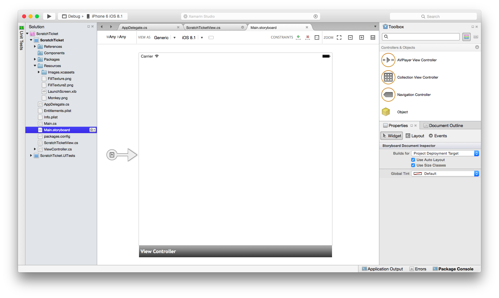](ios-designable-controls-walkthrough-images/03new.png#lightbox)

1. Drag/drop an **Image View** from the **Toolbox** onto the view in the storyboard.

    [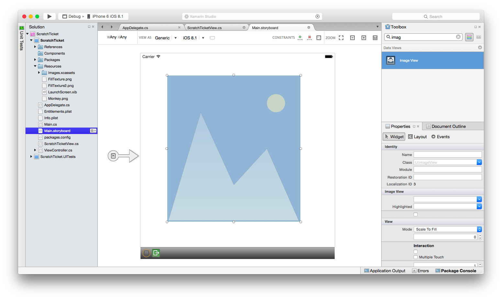](ios-designable-controls-walkthrough-images/04new.png#lightbox)

1. Select the **Image View** and change its **Image** property to `Monkey.png`.

    [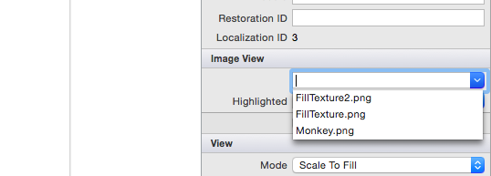](ios-designable-controls-walkthrough-images/05new.png#lightbox)

1. As we are using size classes we'll need to constrain this image view. Click on the image twice to put it into constraint mode. Let's constrain it to the center by clicking the center-pinning handle and align it both vertically and horizontally:

    [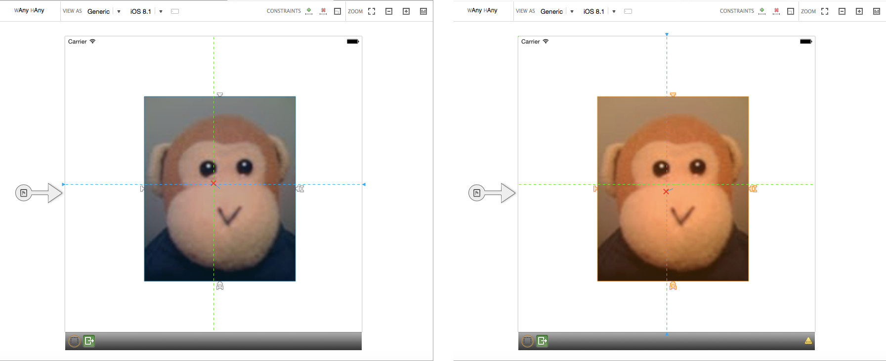](ios-designable-controls-walkthrough-images/06new.png#lightbox)

1. To constrain the height and width, click on the size-pinning handles (the 'bone' shaped handles) and select width and height respectively:

    [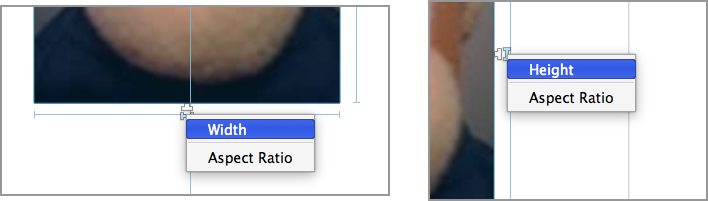](ios-designable-controls-walkthrough-images/07new.png#lightbox)

1. Update the frame based on constraints by clicking the update button in the toolbar:

    [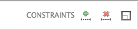](ios-designable-controls-walkthrough-images/08new.png#lightbox)

1. Next, build the project so that the **Scratch Ticket View** will appear under **Custom Components** in the Toolbox:

    [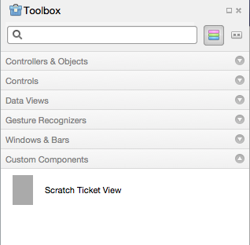](ios-designable-controls-walkthrough-images/09new.png#lightbox)

1. Drag and drop a **Scratch Ticket View** so that it appears over the monkey image. Adjust the drag handles so the Scratch Ticket View covers the monkey completely, as shown below:

    [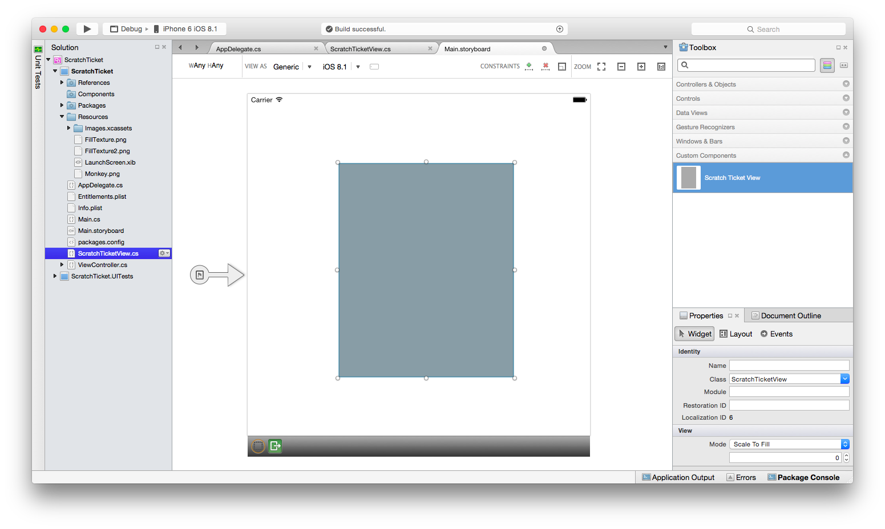](ios-designable-controls-walkthrough-images/10new.png#lightbox)

1. Constrain the Scratch Ticket View to the Image View by drawing a bounding rectangle to select both views. Select the options to constrain it to the Width, Height, Center and Middle and update frames based on constraints, as shown below:

    [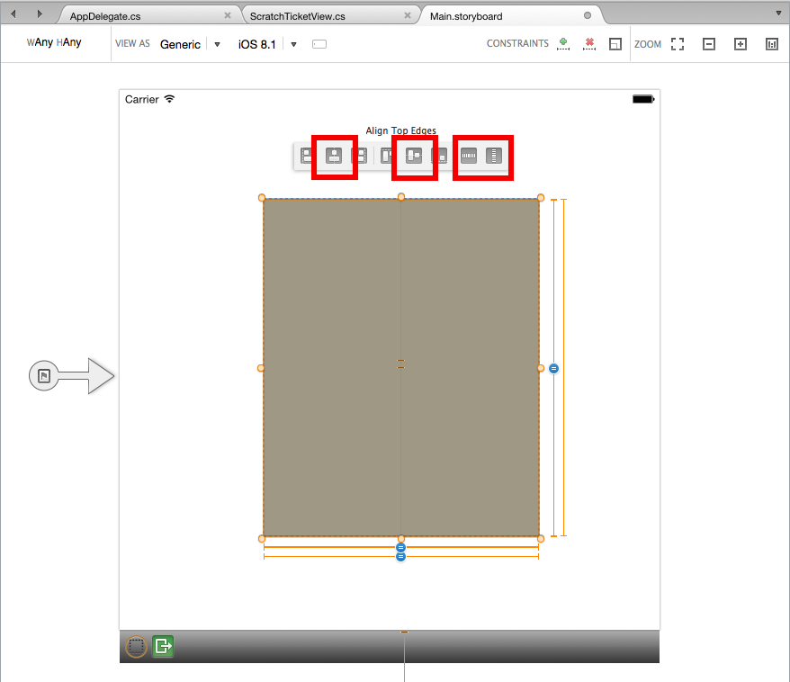](ios-designable-controls-walkthrough-images/11new.png#lightbox)

1. Run the application and “scratch off” the image to reveal the monkey.

    [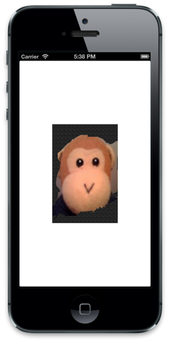](ios-designable-controls-walkthrough-images/10-app.png#lightbox)

## Adding Design-Time Properties

The designer also includes design-time support for custom controls of property type numeric, enumeration, string, bool, CGSize, UIColor, and UIImage. To demonstrate, let’s add a property to the `ScratchTicketView` to set the image that is “scratched off.”

Add the following code to the `ScratchTicketView` class for the property:

```csharp
[Export("Image"), Browsable(true)]
public UIImage Image
{
    get { return image; }
    set {
            image = value;
              SetNeedsDisplay ();
        }
}
```

We may also want to add a null check to the `Draw` method, like so:

```csharp
public override void Draw(CGRect rect)
{
    base.Draw(rect);

    using (var g = UIGraphics.GetCurrentContext())
    {
        if (image != null)
            g.SetFillColor ((UIColor.FromPatternImage (image).CGColor));
        else
            g.SetFillColor (UIColor.LightGray.CGColor);

        g.FillRect(rect);

        if (!initialPoint.IsEmpty)
        {
             g.SetLineWidth(20);
             g.SetBlendMode(CGBlendMode.Clear);
             UIColor.Clear.SetColor();

             if (path.IsEmpty || startNewPath)
             {
                 path.AddLines(new CGPoint[] { initialPoint, latestPoint });
                 startNewPath = false;
             }
             else
             {
                 path.AddLineToPoint(latestPoint);
             }

             g.SetLineCap(CGLineCap.Round);
             g.AddPath(path);
             g.DrawPath(CGPathDrawingMode.Stroke);
        }
    }
}
```

Including an `ExportAttribute` and a `BrowsableAttribute` with the argument set to `true` results in the property being displayed in the designer’s **Property** panel. Changing the property to another image included with the project, such as `FillTexture2.png`, results in the control updating at design time, as shown below:

 [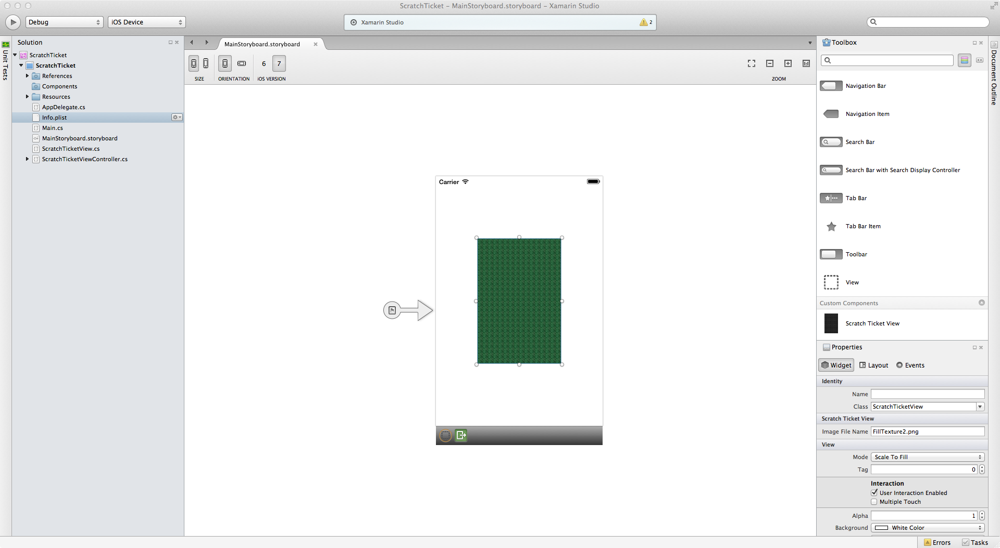](ios-designable-controls-walkthrough-images/10-app.png#lightbox)

## Summary

In this article we walked through how to create a custom control, as well as consume it in an iOS application using the iOS designer. We saw how to create and build the control to make it available to an application in the designer’s **Toolbox**. Additionally, we looked at how to implement the control such that it renders properly at both design time and runtime, as well as how to expose custom control properties in the designer.

## Related Links

- [ScratchTicket (sample)](/samples/xamarin/ios-samples/scratchticket)
- [Required images (sample)](https://github.com/xamarin/ios-samples/blob/master/ScratchTicket/Resources/images.zip?raw=true)
