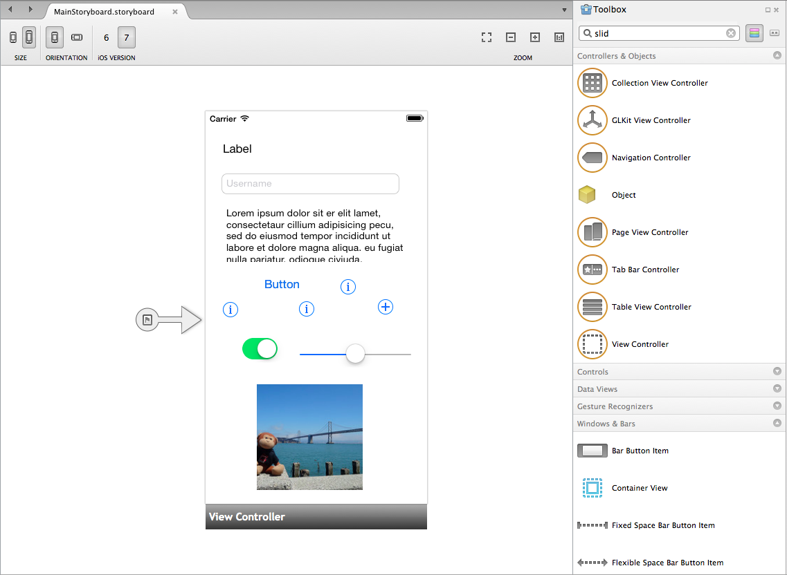
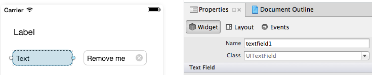
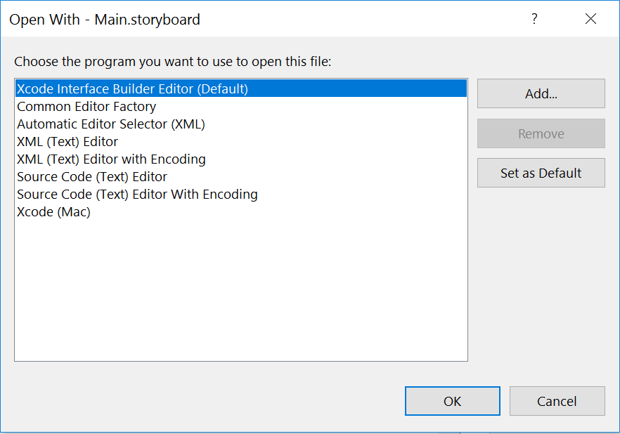
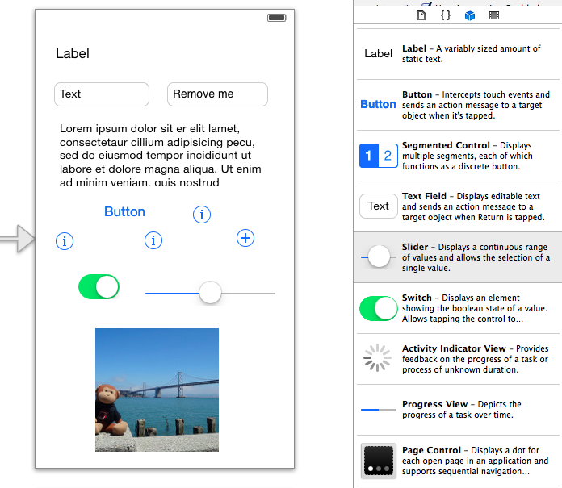
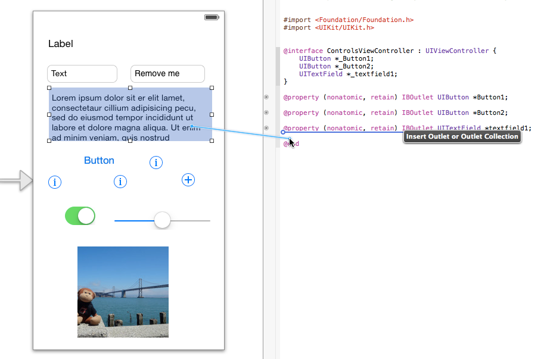

# Creating User Interface Objects in Xamarin.iOS

Apple groups related pieces of functionality into “frameworks” which equate to Xamarin.iOS namespaces. `UIKit` is the
namespace that contains all the user interface controls for iOS.

Whenever your code needs to reference a user interface control, such as a label or button, remember to include the following using statement:

```csharp
using UIKit;
```

All the controls discussed in this chapter are in the UIKit namespace, and each user control class name has the `UI` prefix.

You can edit UI controls and layouts in three ways:

- **[Xamarin iOS Designer](~/ios/user-interface/designer/index.md)** – Use Xamarin’s built-in layout designer to design screens. Double-click storyboard or XIB files to edit with the built-in designer.
- **Xcode Interface Builder** – Drag controls onto your screen layouts with Interface Builder. Open the storyboard or XIB file in Xcode by right-clicking the file in the **Solution Pad** and choosing **Open With > Xcode Interface Builder**.
- **Using C#** – Controls can also be programmatically constructed with code and added to the view hierarchy.

New Storyboard and XIB files can be added by right-clicking on an iOS project and choosing **Add > New File...**.

Whichever method you use, control properties and events can still be manipulated with C# in your application logic.

## Using Xamarin iOS Designer

To start creating your user interface in the iOS Designer, double-click on a storyboard file. Controls can be dragged onto the design surface from the **Toolbox** as illustrated below:

# [Visual Studio for Mac](#tab/macos)

 [](creating-ui-objects-images/image2b.png#lightbox)

# [Visual Studio](#tab/windows)

 [](creating-ui-objects-images/image2b.png#lightbox)

-----

When a control is selected on the design surface the **Properties Pad** will show the attributes for that control. The **Widget > Identity > Name** field, which is populated in the screenshot below, is used as the *Outlet* name. This is how you can reference the control in C#:

 [](creating-ui-objects-images/image3b.png#lightbox)

For a deeper dive into using the iOS designer, refer to the [Introduction to the iOS Designer](~/ios/user-interface/designer/introduction.md) guide.

## Using Xcode Interface Builder

If you are unfamiliar with using Interface Builder, refer to Apple's [Interface Builder](https://developer.apple.com/xcode/interface-builder/) documents.

To open a Storyboard in Xcode, right-click to access the context menu for the storyboard file and choose to open with the **Xcode Interface Builder**:

# [Visual Studio for Mac](#tab/macos)

 [](creating-ui-objects-images/imagexcode.png#lightbox)

# [Visual Studio](#tab/windows)

[](creating-ui-objects-images/imagexcode-vs.png#lightbox)

-----

Controls can be dragged onto the Design Surface from the **Object Library** illustrated below:

 [](creating-ui-objects-images/image5a.png#lightbox)

When you design your UI with Interface Builder you must create an **Outlet** for each control that you wish to
reference in C#. This is done by turning on the **Assistant Editor** using the center **Editor**
button on the Xcode toolbar button:

 [](creating-ui-objects-images/image6a.png#lightbox)

Click on a user interface object; then **Control Drag** into the .h file. To **Control Drag**, hold down the
control key then click and hold over the user interface object that you are creating the outlet (or action) for. Keep
holding down the Control key while you drag into the header file. Finish dragging below the `@interface` definition. A
 blue line should appear with a caption Insert Outlet or Outlet Collection, as illustrated in the screenshot below.

When you release the click you will be prompted to provide a name for the Outlet, which will be used to create a C#
property that can be referenced in code:

 [](creating-ui-objects-images/image8a.png#lightbox)

For more information on how Xcode's Interface Builder integrates with Visual Studio for Mac,
refer to the [Xib Code Generation](~/ios/internals/xib-code-generation.md#generated) document.

## Using C\#

If you decide to programmatically create a user interface object using C# (in a View or View Controller, for example),
follow these steps:

- Declare a class level field for the user interface object. Create the control itself once, in `ViewDidLoad`
for example. The object can then be referenced throughout the lifecycle methods of the View Controller (eg.
`ViewWillAppear`).
- Create a `CGRect` that defines the frame of the control (its X and Y coordinates on the screen, as well as its width and height). You'll need to make sure you have a `using CoreGraphics` directive for this.
- Call the constructor to create and assign the control.
- Set any properties or event handlers.
- Call `Add()` to add the control to the view hierarchy.

Here is a simple example of creating a `UILabel` in a View Controller using C#:

```csharp
UILabel label1;
public override void ViewDidLoad () {
    base.ViewDidLoad ();
    var frame = new CGRect(10, 10, 300, 30);
    label1 = new UILabel(frame);
    label1.Text = "New Label";
    View.Add (label1);
}
```

<a name="partial_classes"></a>

## Using C# and Storyboards

When View Controllers are added to the Design Surface, two corresponding C# files are created in the project. In this example, `ControlsViewController.cs` and `ControlsViewController.designer.cs` have been created automatically:

 [](creating-ui-objects-images/image9b.png#lightbox)

The `ControlsViewController.cs` file is intended for *your code*. This is where the `View` lifecycle methods such as
`ViewDidLoad` and `ViewWillAppear` are implemented and where you can add your own properties, fields and methods.

The `ControlsViewController.designer.cs` is generated code containing a partial class. When you name a control on the design surface in Visual Studio for Mac, or create an outlet or action in Xcode, a corresponding property, or partial method, is added to the designer (designer.cs) file. The code below shows an example of code generated for two buttons and a text view,
where one of the buttons also has a `TouchUpInside` event.

These elements of the partial class enable your code to reference the controls and respond to the actions that
are declared on the design surface:

```csharp
[Register ("ControlsViewController")]
    partial class ControlsViewController
    {
        [Outlet]
        [GeneratedCodeAttribute ("iOS Designer", "1.0")]
        UIKit.UIButton Button1 { get; set; }

        [Outlet]
        [GeneratedCodeAttribute ("iOS Designer", "1.0")]
        UIKit.UIButton Button2 { get; set; }

        [Outlet]
        [GeneratedCodeAttribute ("iOS Designer", "1.0")]
        UIKit.UITextField textfield1 { get; set; }

        [Action ("button2_TouchUpInside:")]
        [GeneratedCodeAttribute ("iOS Designer", "1.0")]
        partial void button2_TouchUpInside (UIButton sender);

        void ReleaseDesignerOutlets ()
        {
            if (Button1 != null) {
                Button1.Dispose ();
                Button1 = null;
            }
            if (Button2 != null) {
                Button2.Dispose ();
                Button2 = null;
            }
            if (textfield1 != null) {
                textfield1.Dispose ();
                textfield1 = null;
            }
        }
    }
}
```

The `designer.cs` file should not be manually edited – the IDE (Visual Studio for Mac or Visual Studio) is responsible for keeping
it synchronized with the Storyboard.

When user interface objects are added programmatically to a `View` or `ViewController`, you instantiate and manage the object references yourself, and therefore no designer file is required.

## Related Links

- [Controls (sample)](/samples/xamarin/ios-samples/controls)