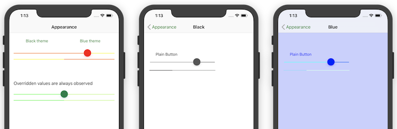
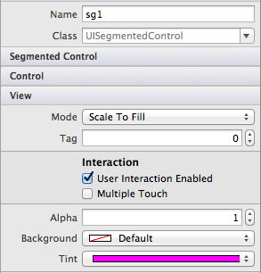
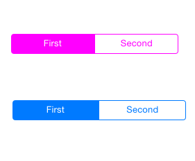
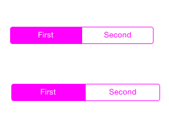

# Appearance API in Xamarin.iOS

_iOS lets you apply visual property settings at a static class level rather than on individual objects so that the change applies to all instances of that control in the application._

This functionality is exposed in Xamarin.iOS via a static `Appearance` property
on all UIKit controls that support it. Visual appearance (properties like as
tint color and background image) can therefore be easily customized to give
your application a consistent look. The Appearance API was introduced in iOS 5
and while some parts of it have been deprecated in iOS 9 it is still a good
way to achieve some styling and theming effects in Xamarin.iOS apps.

## Overview

iOS allows you customize the appearance of many UIKit controls to make the
standard controls conform to the branding you wish to apply to your
application.

There are two different ways to apply a custom appearance:

- **Directly on a control instance** – you can set the tint
    color, background image and title position (as well as some other attributes) on
    many controls including toolbars, navigation bars, buttons and sliders.

- **Set defaults on the Appearance static property** – customizable attributes for each control are exposed via the `Appearance` static
    property. Any customizations you apply to these properties will be used as the
    default for any control of that type that is created after the property is
    set.

The Appearance sample application demonstrates all three methods, as shown in
these screenshots:

[](introduction-to-the-appearance-api-images/appearance01.png#lightbox)

As of iOS 8, the Appearance proxy has been extended to TraitCollections.
 `AppearanceForTraitCollection` can be used to set the default appearance on a
 particular trait collection. You can read more about this in the
 [Introduction to Storyboards](~/ios/user-interface/storyboards/unified-storyboards.md) guide.

## Setting Appearance Properties

In the first screen, the static Appearance class is used to style the buttons
and yellow/orange elements like this:

```csharp
// Set the default appearance values
UIButton.Appearance.TintColor = UIColor.LightGray;
UIButton.Appearance.SetTitleColor(UIColor.FromRGB(0,127,14), UIControlState.Normal);

UISlider.Appearance.ThumbTintColor = UIColor.Red;
UISlider.Appearance.MinimumTrackTintColor = UIColor.Orange;
UISlider.Appearance.MaximumTrackTintColor = UIColor.Yellow;

UIProgressView.Appearance.ProgressTintColor = UIColor.Yellow;
UIProgressView.Appearance.TrackTintColor = UIColor.Orange;
```

The green element styles are set like this, in the `ViewDidLoad` method which overrides the default values and the *Appearance* static class:

```csharp
slider2.ThumbTintColor = UIColor.FromRGB (0,127,70); // dark green
slider2.MinimumTrackTintColor = UIColor.FromRGB (66,255,63);
slider2.MaximumTrackTintColor = UIColor.FromRGB (197,255,132);
```

```csharp
progress2.ProgressTintColor = UIColor.FromRGB (66,255,63);
progress2.TrackTintColor = UIColor.FromRGB (197,255,132);
```

## Using UIAppearance in Xamarin.Forms

The Appearance API can be useful when
[styling the iOS app](~/xamarin-forms/platform/ios/formatting.md#uiappearance-api)
in Xamarin.Forms solutions. A few lines in the `AppDelegate` class can help
to implement a specific color scheme without having to create a
[custom renderer](~/xamarin-forms/app-fundamentals/custom-renderer/index.md).

### Custom Themes and UIAppearance

iOS allows many visual attributes of the user interface controls to be “themed” using the *UIAppearance* APIs to force
all instances of a particular control to have the same appearance. This is exposed as an Appearance property on many user
interface control classes, not on individual instances of the control. Setting a display property on the static
`Appearance` property affects all controls of that type in your application.

To better understand the concept, consider an example.

To change a specific `UISegmentedControl` to have a Magenta tint, we
would reference the specific control on our screen like this in `ViewDidLoad`:

```csharp
sg1.TintColor = UIColor.Magenta;
```

Alternatively, set the value in the Properties pad of the Designer:

[](introduction-to-the-appearance-api-images/propertiespadtint.png#lightbox)

The image below illustrates that this sets the tint on only the control named 'sg1'.

[](introduction-to-the-appearance-api-images/image53.png#lightbox)

To set many controls in this way would be completely inefficient, so we can instead set the static `Appearance` property on
the class itself. This is shown in the code below:

```csharp
UISegmentedControl.Appearance.TintColor = UIColor.Magenta;
```

The Image below now illustrates both segmented controls with the appearance set to Magenta:

[](introduction-to-the-appearance-api-images/image54.png#lightbox)

`Appearance` properties should be set early in the application lifecycle, such as in the AppDelegate’s `FinishedLaunching`
event, or in a ViewController before the affected controls are displayed.

Refer to the [Introduction to the Appearance API](~/ios/user-interface/ios-ui/introduction-to-the-appearance-api.md) for more detailed information.

## Related Links

- [Appearance (sample)](/samples/xamarin/ios-samples/appearance)
- [UIAppearance Protocol Reference](https://developer.apple.com/library/ios/documentation/UIKit/Reference/UIAppearance_Protocol/)
- [Appearance in Xamarin.Forms](~/xamarin-forms/platform/ios/formatting.md#uiappearance-api)