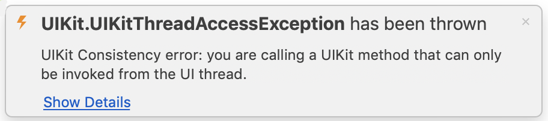

# Working with the UI Thread in Xamarin.iOS

Application user interfaces are always single-threaded, even in multi-threaded devices – there’s only one representation of the screen and any changes to what is displayed need to be coordinated through a single ‘access point’. This prevents multiple threads from trying to update the same pixel at the same time (for example).

Your code should only make changes to user interface controls from the main (or UI) thread. Any UI updates that occur on a different thread (such as a callback or background thread) may not get rendered to the screen, or could even cause a crash.

## UI Thread Execution

When you are creating controls in a view, or handling a user-initiated event such as a touch, the code is already executing in the context of the UI thread.

If code is executing on a background thread, in a task or a callback then it is likely NOT executing on the main UI thread. In this case you should wrap the code in a call to `InvokeOnMainThread` or `BeginInvokeOnMainThread` like this:

```csharp
InvokeOnMainThread ( () => {
    // manipulate UI controls
});
```

The `InvokeOnMainThread` method is defined on `NSObject` so it can be called from within methods defined on any UIKit object (such as a View or View Controller).

While debugging Xamarin.iOS applications, an error will be thrown if your code attempts to access a UI control from the wrong thread. This helps you to track down and fix these problems with the InvokeOnMainThread method. This only occurs while debugging and does not throw an error in release builds. The error message will appear like this:

 

 <a name="Background_Thread_Example"></a>

## Background Thread Example

Here is an example that attempts to access a user interface control (a `UILabel`) from a background thread using a simple thread:

```csharp
new System.Threading.Thread(new System.Threading.ThreadStart(() => {
    label1.Text = "updated in thread"; // should NOT reference UILabel on background thread!
})).Start();
```

That code will throw the `UIKitThreadAccessException` while debugging. To fix the problem (and ensure that the user interface control is only accessed from the main UI thread), wrap any code that references UI controls inside an `InvokeOnMainThread` expression like this:

```csharp
new System.Threading.Thread(new System.Threading.ThreadStart(() => {
    InvokeOnMainThread (() => {
        label1.Text = "updated in thread"; // this works!
    });
})).Start();
```

You won’t need to use this for the remainder of the examples in this document, but it is an important concept to remember when your app makes network requests, uses the notification center or other methods that require a completion-handler that will run on another thread.

 <a name="Async_Await_Example"></a>

## Async/Await Example

When using the C# 5 async/await keywords `InvokeOnMainThread` is not required because when an awaited task completes the method continues on the calling thread.

This example code (which awaits on a Delay method call, purely for demonstration purposes) shows an async method that is called on the UI thread (it is a TouchUpInside handler). Because the containing method is called on the UI thread, UI operations like setting the text on a `UILabel` or showing a `UIAlertView` can be safely called after asynchronous operations have completed on background threads.

```csharp
async partial void button2_TouchUpInside (UIButton sender)
{
    textfield1.ResignFirstResponder ();
    textfield2.ResignFirstResponder ();
    textview1.ResignFirstResponder ();
    label1.Text = "async method started";
    await Task.Delay(1000); // example purpose only
    label1.Text = "1 second passed";
    await Task.Delay(2000);
    label1.Text = "2 more seconds passed";
    await Task.Delay(1000);
    new UIAlertView("Async method complete", "This method", 
               null, "Cancel", null)
        .Show();
    label1.Text = "async method completed";
}
```

If an async method is called from a background thread (not the main UI thread) then `InvokeOnMainThread` would still be required.

## Related Links

- [Controls (sample)](/samples/xamarin/ios-samples/controls)
- [Threading](~/ios/app-fundamentals/threading.md)