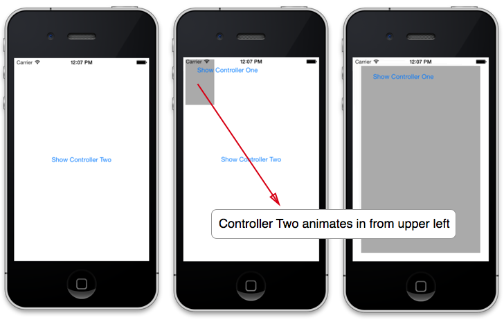

# View Controller Transitions in Xamarin.iOS

UIKit adds support for customizing the animated transition that occurs when presenting view controllers. This support is included with built-in controllers, as well as any custom controllers that inherit directly from `UIViewController`. Additionally, `UICollectionViewController` takes advantage of controller transition customization to leverage the animated transitions in collection view layouts.

## Custom Transitions

The animated transition between view controllers in iOS 7 is fully customizable. `UIViewController` now includes a `TransitioningDelegate` property that provides a custom animator class to the system when a transition occurs.

To use a custom transition with `PresentViewController`:

1. Set the  `ModalPresentationStyle` to  `UIModalPresentationStyle.Custom` on the controller to be presented.
2. Implement  `UIViewControllerTransitioningDelegate` to create an animator class, which is an instance of  `UIViewControllerAnimatedTransitioning` .
3. Set the  `TransitioningDelegate` property to an instance of  `UIViewControllerTransitioningDelegate` , also on the controller to be presented.
4. Present the view controller.

For example, the following code presents a view controller of type `ControllerTwo` - a `UIViewController` subclass:

```csharp
showTwo.TouchUpInside += (object sender, EventArgs e) => {

    controllerTwo = new ControllerTwo ();

    this.PresentViewController (controllerTwo, true, null);
};
```

Running the app and tapping the button causes the default animation of the second controller’s view to animate in from the bottom, as shown below:

 

However, setting the `ModalPresentationStyle` and `TransitioningDelegate` results in a custom animation for the transition:

```csharp
showTwo.TouchUpInside += (object sender, EventArgs e) => {

    controllerTwo = new ControllerTwo () {
        ModalPresentationStyle = UIModalPresentationStyle.Custom
        };

    transitioningDelegate = new TransitioningDelegate ();
    controllerTwo.TransitioningDelegate = transitioningDelegate;

    this.PresentViewController (controllerTwo, true, null);
};
```

The `TransitioningDelegate` is responsible for creating an instance of the `UIViewControllerAnimatedTransitioning` subclass - called `CustomAnimator` in the example below:

```csharp
public class TransitioningDelegate : UIViewControllerTransitioningDelegate
{
    CustomTransitionAnimator animator;

    public override IUIViewControllerAnimatedTransitioning GetAnimationControllerForPresentedController (UIViewController presented, UIViewController presenting, UIViewController source)
    {
        animator = new CustomTransitionAnimator ();
        return animator;
    }
}
```

When the transition takes place, the system creates an instance of `IUIViewControllerContextTransitioning`, which it passed to the animator’s methods. `IUIViewControllerContextTransitioning` contains the `ContainerView` where the animation occurs, as well as the view controller initiating the transition and the view controller being transitioned to.

The `UIViewControllerAnimatedTransitioning` class handles the actual animation. Two methods must be implemented:

1. `TransitionDuration` – returns the duration of the animation in seconds.
1. `AnimateTransition` – performs the actual animation.

For example, the following class implements `UIViewControllerAnimatedTransitioning` to animate the frame of the controller’s view:

```csharp
public class CustomTransitionAnimator : UIViewControllerAnimatedTransitioning
{
    public CustomTransitionAnimator ()
    {
    }

    public override double TransitionDuration (IUIViewControllerContextTransitioning transitionContext)
    {
        return 1.0;
    }

    public override void AnimateTransition (IUIViewControllerContextTransitioning transitionContext)
    {
        var inView = transitionContext.ContainerView;
        var toVC = transitionContext.GetViewControllerForKey (UITransitionContext.ToViewControllerKey);
        var toView = toVC.View;

        inView.AddSubview (toView);

        var frame = toView.Frame;
        toView.Frame = CGRect.Empty;

        UIView.Animate (TransitionDuration (transitionContext), () => {
            toView.Frame = new CGRect (20, 20, frame.Width - 40, frame.Height - 40);
        }, () => {
            transitionContext.CompleteTransition (true);
        });
    }
}
```

Now, when the button is tapped, the animation implemented in the `UIViewControllerAnimatedTransitioning` class is used:

 

## Collection View Transitions

Collection Views have built-in support for creating animated transitions:

- **Navigation Controllers** – The animated transition between two  `UICollectionViewController` instances can optionally be handled automatically when a  `UINavigationController` manages them.
- **Transition Layout** – A new  `UICollectionViewTransitionLayout` class allows interactive transitioning between layouts.

### Navigation Controller Transitions

When used within a navigation controller, a `UICollectionViewController` includes support for animated transitions between controllers. This support is built-in and requires only a few simple steps to implement:

1. Set  `UseLayoutToLayoutNavigationTransitions` to  `false` on a  `UICollectionViewController` .
1. Add an instance of the  `UICollectionViewController` to the root of the navigation controller’s stack.
1. Create a second  `UICollectionViewController` and set its  `UseLayoutToLayoutNavigtionTransitions` property to  `true` .
1. Push the second  `UICollectionViewController` onto the navigation controller’s stack.

The following code adds a `UICollectionViewController` subclass named `ImagesCollectionViewController` to the root of a navigation controller’s stack, with the `UseLayoutToLayoutNavigationTransitions` property set to `false`:

```csharp
UIWindow window;
ImagesCollectionViewController viewController;
UICollectionViewFlowLayout layout;
UINavigationController navController;

public override bool FinishedLaunching (UIApplication app, NSDictionary options)
{
    window = new UIWindow (UIScreen.MainScreen.Bounds);

    // create and initialize a UICollectionViewFlowLayout
    layout = new UICollectionViewFlowLayout (){
        SectionInset = new UIEdgeInsets (10,5,10,5),
        MinimumInteritemSpacing = 5,
        MinimumLineSpacing = 5,
        ItemSize = new CGSize (100, 100)
    };

    viewController = new ImagesCollectionViewController (layout) {
            UseLayoutToLayoutNavigationTransitions = false
        };

    navController = new UINavigationController (viewController);

    window.RootViewController = navController;
    window.MakeKeyAndVisible ();

    return true;
}
```

When an item is selected, a second instance of the `ImagesController` is created, only this time using a different layout class. For this controller, `UseLayoutToLayoutNavigtionTransitions` is set to `true`, as shown below:

```csharp
CircleLayout circleLayout;
ImagesCollectionViewController controller2;

...

public override void ItemSelected (UICollectionView collectionView, NSIndexPath indexPath)
{
    // UseLayoutToLayoutNavigationTransitions when item is selected
    circleLayout = new CircleLayout (Monkeys.Instance.Count){
        ItemSize = new CGSize (100, 100)
    };

    controller2 = new ImagesCollectionViewController (circleLayout) {
        UseLayoutToLayoutNavigationTransitions = true
        };

    NavigationController.PushViewController (controller2, true);
}
```

The `UseLayoutToLayoutNavigationTransitions` property must be set prior to adding the controller to the navigation stack. With this property set, the normal horizontal sliding transition is replaced with an animated transition between the layouts of the two controllers, as illustrated below:


### Transition Layout

In addition to layout transition support within navigation controllers, a new layout called `UICollectionViewTransitionLayout` is now available. This layout class allows interactive control during the layout transition process, by allowing the `TransitionProgress` to be set from code. `UICollectionViewTransitionLayout` is different from - and not a replacement for - the `SetCollectionViewLayout` method from iOS 6 that caused an animated layout transition to occur. That method did not provide built-in support for controlling the progress of the animated transition.

 `UICollectionViewTransitionLayout` allows, for example, a gesture recognizer to be configured to control the transition between layouts in response to user interaction, by managing the original layout as well as the intended layout to transition to.

The steps to implement an interactive transition within a gesture recognizer using `UICollectionViewTransitionLayout` are as follows:

1. Create a gesture recognizer.
1. Call the  `StartInteractiveTransition` method of the  `UICollectionView` , passing it the target layout and a completion handler.
1. Set the `TransitionProgress` property of the  `UICollectionViewTransitionLayout` instance returned from the  `StartInteractiveTransition` method.
1. Invalidate the layout.
1. Call the `FinishInteractiveTransition` method of the  `UICollectionView` to complete the transition or the  `CancelInteractiveTransition` method to cancel it.  `FinishInteractiveTransition` causes the animation to complete its transition to the target layout, whereas `CancelInteractiveTransition` results in the animation returning to the original layout.
1. Handle the transition completion in the completion handler of the  `StartInteractiveTransition` method.
1. Add the gesture recognizer to the collection view.

The following code implements an interactive layout transition within a pinch gesture recognizer:

```csharp
imagesController = new ImagesCollectionViewController (flowLayout);

nfloat sf = 0.4f;
UICollectionViewTransitionLayout trLayout = null;
UICollectionViewLayout nextLayout;

pinch = new UIPinchGestureRecognizer (g => {

    var progress = Math.Abs(1.0f -  g.Scale)/sf;

    if(trLayout == null){
        if(imagesController.CollectionView.CollectionViewLayout is CircleLayout)
            nextLayout = flowLayout;
        else
            nextLayout = circleLayout;

        trLayout = imagesController.CollectionView.StartInteractiveTransition (nextLayout, (completed, finished) => {
            Console.WriteLine ("transition completed");
            trLayout = null;
        });
    }

    trLayout.TransitionProgress = (nfloat)progress;

    imagesController.CollectionView.CollectionViewLayout.InvalidateLayout ();

    if(g.State == UIGestureRecognizerState.Ended){
        if (trLayout.TransitionProgress > 0.5f)
            imagesController.CollectionView.FinishInteractiveTransition ();
        else
            imagesController.CollectionView.CancelInteractiveTransition ();
    }

});

imagesController.CollectionView.AddGestureRecognizer (pinch);

```

As the user pinches the collection view, the `TransitionProgress` is set relative to the scale of the pinch. In this implementation, if the user ends the pinch before the transition is 50% completed, the transition is cancelled. Otherwise, the transition is finished.

## Related Links

- [Intro to iOS 7 (sample)](/samples/xamarin/ios-samples/introtoios7)
- [iOS 7 User Interface Overview](~/ios/platform/introduction-to-ios7/ios7-ui.md)
- [Backgrounding](~/ios/app-fundamentals/backgrounding/index.md)