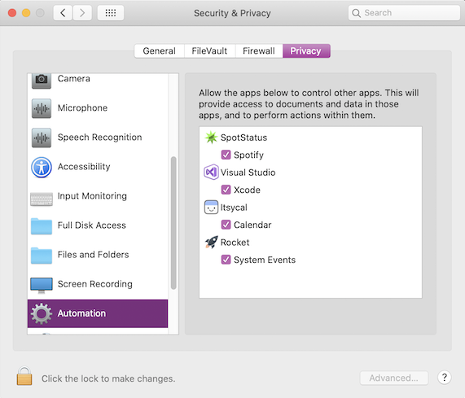

# Using Xcode to design user interfaces

_The recommended way to edit .storyboard and .nib files is by editing them in Xcode Interface Builder on a Mac._

## How to open a storyboard 

Open an iOS user interface file in Visual Studio for Mac by right-clicking on a storyboard file and selecting **Xcode Interface Builder**:

[](images/select-interface-builder.png#lightbox)

You should then see the Xcode window launch. Any edits saved here will be reflected in your Visual Studio project.

[](images/xcode.png#lightbox)

More information on the Xcode Interface Builder can be found [here](https://developer.apple.com/xcode/interface-builder/).

## Known problems

Known issues are discussed in this section.

### "Visual Studio could not communicate with Xcode"

In macOS Catalina or higher, you may encounter the error below:

[](images/could-not-communicate.png#lightbox)

First ensure that under your Mac's System Preferences Under **Security & Privacy > Automation** that Visual Studio is listed and **Xcode** is checked.

[](images/macos-security.png#lightbox)

If **Xcode** is checked and the error message still appears, you may need to reset the Visual Studio for Mac privacy permissions.

This can be accomplished by launching a Terminal Window, and issuing the command:

```bash
sudo tccutil reset All "com.microsoft.visual-studio"
```

To ensure the above change takes effect, reset your Mac's PRAM. Instructions on how to do so can be found [here](https://support.apple.com/HT204063).
