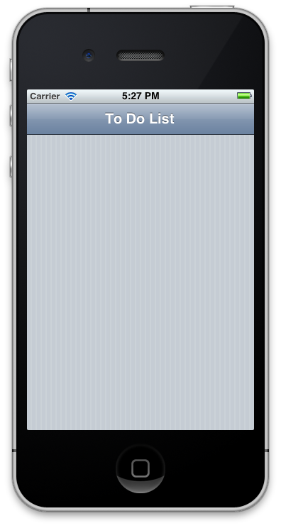
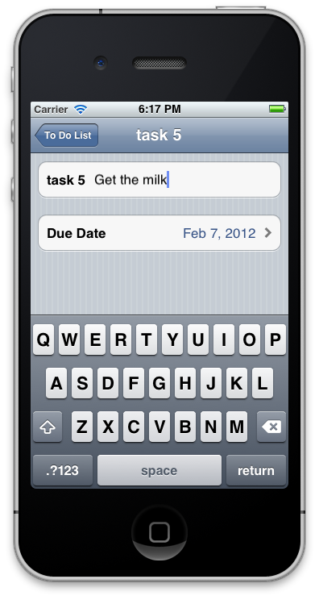
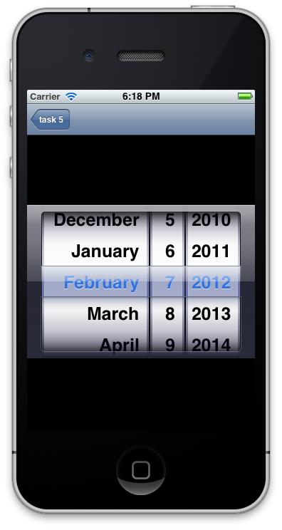

# Creating a Xamarin.iOS application using the Elements API

_This article builds upon the information presented in the Introduction to MonoTouch Dialog article. It presents a walkthrough that shows how to use the MonoTouch.Dialog (MT.D) Elements API to quickly get started building an application with MT.D._

In this walkthrough, we’ll use the MT.D Elements API to create a
master-detail style of application that displays a task list. When the user
selects the **+** button in the navigation bar, a new row
will be added to the table for the task. Selecting the row will navigate to the
detail screen that allows us to update the task description and the due date, as
illustrated below:

[](elements-api-walkthrough-images/01-task-list-app.png#lightbox)

## Setting up MT.D

MT.D is distributed with Xamarin.iOS. To use it, right-click on the
**References** node of a Xamarin.iOS project in Visual Studio 2017 or
Visual Studio for Mac and add a reference to the **MonoTouch.Dialog-1**
assembly. Then, add `using MonoTouch.Dialog` statements in your source
code as necessary.

## Elements API walkthrough

In the [Introduction to MonoTouch Dialog](~/ios/user-interface/monotouch.dialog/index.md) article, we gained a solid understanding of the different
parts of MT.D. Let’s use the Elements API to put them all together into an
application.

## Setting up the multi-screen application

To start the screen creation process, MonoTouch.Dialog creates a `DialogViewController`, and then adds a `RootElement`.

To create a multi-screen application with MonoTouch.Dialog, we need to:

1. Create a `UINavigationController.`
1. Create a `DialogViewController.`
1. Add the `DialogViewController` as the root of the  `UINavigationController.` 
1. Add a `RootElement` to the  `DialogViewController.`
1. Add `Sections` and  `Elements` to the  `RootElement.` 

### Using A UINavigationController

To create a navigation-style application, we need to create a `UINavigationController`, and then add it as the `RootViewController` in the `FinishedLaunching` method of
the `AppDelegate`. To make the `UINavigationController`
work with MonoTouch.Dialog, we add a `DialogViewController` to the `UINavigationController` as shown below:

```csharp
public override bool FinishedLaunching (UIApplication app, NSDictionary options)
{
    _window = new UIWindow (UIScreen.MainScreen.Bounds);
            
    _rootElement = new RootElement ("To Do List"){new Section ()};

    // code to create screens with MT.D will go here …

    _rootVC = new DialogViewController (_rootElement);
    _nav = new UINavigationController (_rootVC);
    _window.RootViewController = _nav;
    _window.MakeKeyAndVisible ();
            
    return true;
}
```

The code above creates an instance of a `RootElement` and passes
it into the `DialogViewController`. The `DialogViewController` always has a `RootElement` at the
top of its hierarchy. In this example, the `RootElement` is created
with the string “To Do List,” which serves as the title in the navigation
controller’s navigation bar. At this point, running the application would
present the screen shown below:

 [](elements-api-walkthrough-images/02-to-do-list-screen-.png#lightbox)

Let’s see how to use MonoTouch.Dialog’s hierarchical structure of `Sections` and `Elements` to add more screens.

### Creating the Dialog screens

A `DialogViewController` is a `UITableViewController`
subclass that MonoTouch.Dialog uses to add screens. MonoTouch.Dialog creates
screens by adding a `RootElement` to a `DialogViewController`, as we saw above. The `RootElement`
can have `Section` instances that represent the sections of a table.
The sections are made up of elements, other sections, or even other `RootElements`. By nesting `RootElements`,
MonoTouch.Dialog automatically creates a navigation-style application, as
we’ll see next.

### Using DialogViewController

The `DialogViewController`, being a `UITableViewController` subclass, has a `UITableView` as
its view. In this example, we want to add items to the table each time the **+** button is tapped. Since the `DialogViewController` was added to a `UINavigationController`, we can use the `NavigationItem`’s `RightBarButton` property to add the **+** button, as shown below:

```csharp
_addButton = new UIBarButtonItem (UIBarButtonSystemItem.Add);
_rootVC.NavigationItem.RightBarButtonItem = _addButton;
```

When we created the `RootElement` earlier, we passed it a single `Section` instance so that we could add elements as the **+** button is tapped by the user. We can use the following code
to accomplish this in the event handler for the button:

```csharp
_addButton.Clicked += (sender, e) => {                
    ++n;
                
    var task = new Task{Name = "task " + n, DueDate = DateTime.Now};
                
    var taskElement = new RootElement (task.Name) {
        new Section () {
            new EntryElement (task.Name, "Enter task description", task.Description)
        },
        new Section () {
            new DateElement ("Due Date", task.DueDate)
        }
    };
    _rootElement [0].Add (taskElement);
};
```

This code creates a new `Task` object each time the button is
tapped. The following shows the simple implementation of the `Task`
class:

```csharp
public class Task
{   
    public Task ()
    {
    }
      
    public string Name { get; set; }
        
    public string Description { get; set; }

    public DateTime DueDate { get; set; }
}
```

The task’s `Name` property is used to create the `RootElement`’s caption along with a counter variable named `n` that is incremented for each new task. MonoTouch.Dialog turns the
elements into the rows that are added to the `TableView` when each `taskElement` is added.

## Presenting and managing Dialog Screens

We used a `RootElement` so that MonoTouch.Dialog would
automatically create a new screen for each task’s details and navigate to it
when a row is selected.

The task detail screen itself is composed of two sections; each of these
sections contains a single element. The first element is created from an `EntryElement` to provide an editable row for the task’s `Description` property. When the element is selected, a keyboard for
text editing is presented as shown below:

 [](elements-api-walkthrough-images/03-create-task.png#lightbox)

The second section contains a `DateElement` that lets us manage
the task’s `DueDate` property. Selecting the date automatically
loads a date picker as shown:

 [](elements-api-walkthrough-images/04-date-picker.png#lightbox)

In both the `EntryElement` and `DateElement` cases (or
for any data-entry element in MonoTouch.Dialog), any changes to the values are
preserved automatically. We can demonstrate this by editing the date and then
navigating back and forth between the root screen and various task details,
where the values in the detail screens are preserved.

## Summary

This article presented a walkthrough that showed how to use the
MonoTouch.Dialog Elements API. It covered the basic steps to create a
multi-screen application with MT.D, including how to use a `DialogViewController` and how to add Elements and Sections to create
screens. In addition, it showed how to use MT.D in conjunction with a `UINavigationController`.

## Related links

- [MTDWalkthrough (sample)](/samples/xamarin/ios-samples/mtdwalkthrough)
- [Introduction to MonoTouch.Dialog](~/ios/user-interface/monotouch.dialog/index.md)
- [Reflection API Walkthrough](~/ios/user-interface/monotouch.dialog/reflection-api-walkthrough.md)
- [JSON Element Walkthrough](~/ios/user-interface/monotouch.dialog/json-element-walkthrough.md)
- [MonoTouch Dialog on Github](https://github.com/migueldeicaza/MonoTouch.Dialog)
- [TweetStation Application](https://github.com/migueldeicaza/TweetStation)
- [UITableViewController Class Reference](https://developer.apple.com/library/ios/#DOCUMENTATION/UIKit/Reference/UITableViewController_Class/Reference/Reference.html)
- [UINavigationController Class Reference](https://developer.apple.com/library/ios/#documentation/UIKit/Reference/UINavigationController_Class/Reference/Reference.html)