# Introduction to MonoTouch.Dialog for Xamarin.iOS

MonoTouch.Dialog, referred to as MT.D for short, is a rapid UI development
toolkit that allows developers to build out application screens and navigation
using information, rather than the tedium of creating view controllers, tables,
etc. As such, it provides a significant simplification of UI development and
code reduction. For example, consider the following screenshot:

 [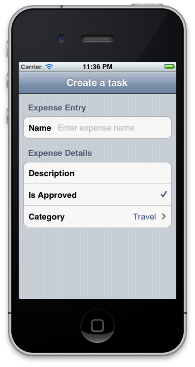](images/image1.png#lightbox)

The following code was used to define this entire screen:

```csharp
public enum Category
{
    Travel,
    Lodging,
    Books
}
        
public class Expense
{
    [Section("Expense Entry")]

    [Entry("Enter expense name")]
    public string Name;
    [Section("Expense Details")]
  
    [Caption("Description")]
    [Entry]
    public string Details;
        
    [Checkbox]
    public bool IsApproved = true;
    [Caption("Category")]
    public Category ExpenseCategory;
}
```

When working with tables in iOS, there’s often a ton of repetitious code.
For example, every time a table is needed, a data source is needed to populate
that table. In an application that has two table-based screens that are
connected via a navigation controller, each screen shares a lot of the same
code.

MT.D simplifies that by encapsulating all of that code into a generic API for
table creation. It then provides an abstraction on top of that API that allows
for a declarative object binding syntax that makes it even easier. As such,
there are two APIs available in MT.D:

- **Low-level Elements API** – The  *Elements API* is based on creating a hierarchal tree of elements that represent screens and their components. The Elements API gives developers the most flexibility and control in creating UIs. Additionally, the Elements API has advanced support for declarative definition via JSON, which allows for both incredibly fast declaration, as well as dynamic UI generation from a server. 
- **High-Level Reflection API** – Also known as the  *Binding*  *API* , in which classes are annotated with UI hints and then MT.D automatically creates screens based on the objects and provides a binding between what is displayed (and optionally edited) on screen, and the underlying object backing. The example above illustrated the use of the Reflection API. This API doesn’t provide the fine-grained control that the elements API does, but it reduces complexity even further by automatically building out the element hierarchy based on class attributes. 

MT.D comes packed with a large set of built in UI elements for screen
creation, but it also recognizes the need for customized elements and advanced
screen layouts. As such, extensibility is a first-class featured baked into the
API. Developers can extend the existing elements or create new ones and then
integrate seamlessly.

Additionally, MT.D has a number of common iOS UX features built in such as
“pull-to-refresh” support, asynchronous image loading, and search
support.

This article will take a comprehensive look at working with MT.D,
including:

- **MT.D Components** – This will focus on understanding the classes that make up MT.D to enable getting up to speed quickly. 
- **Elements Reference** – A comprehensive list of the built-in elements of MT.D. 
- **Advanced Usage** – This covers advanced features such as pull-to-refresh, search, background image loading, using LINQ to build out element hierarchies, and creating custom elements, cells, and controllers for use with MT.D. 

## Setting up MT.D

MT.D is distributed with Xamarin.iOS. To use it, right-click on the
**References** node of a Xamarin.iOS project in Visual Studio 2017 or
Visual Studio for Mac and add a reference to the **MonoTouch.Dialog-1**
assembly. Then, add `using MonoTouch.Dialog` statements in your source
code as necessary.

## Understanding the Pieces of MT.D

Even when using the Reflection API, MT.D creates an Element hierarchy under
the hood, just as if it were created via the Elements API directly. Also, the
JSON support mentioned in the previous section creates Elements as well. For
this reason, it’s important to have a basic understanding of the constituent
pieces of MT.D.

MT.D builds screens using the following four parts:

- **DialogViewController**
- **RootElement**
- **Section**
- **Element**

### DialogViewController

A *DialogViewController*, or *DVC* for short, inherits from `UITableViewController` and therefore represents a screen with a
table. DVCs can be pushed onto a navigation controller just like a regular
UITableViewController.

### RootElement

A *RootElement* is the top-level container for the items that go into
a DVC. It contains Sections, which can then contain Elements. RootElements are
not rendered; instead they’re simply containers for what actually gets
rendered. A RootElement is assigned to a DVC, and then the DVC renders its
children.

### Section

A section is a group of cells in a table. As with a normal table section, it
can optionally have a header and footer that can either be text, or even custom
views, as in the following screenshot:

 [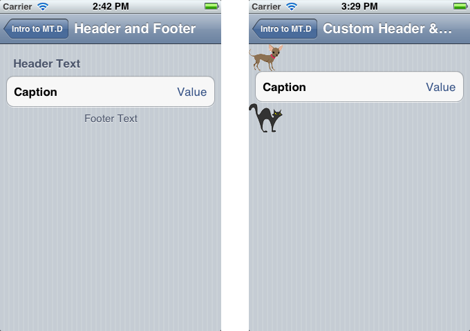](images/image2.png#lightbox)

### Element

An Element represents an actual cell in the table. MT.D comes packed with a
wide variety of Elements that represent different data types or different
inputs. For example, the following screenshots illustrate a few of the available
elements:

 [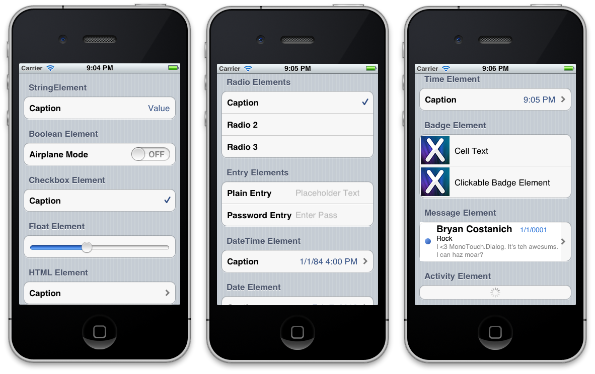](images/image3.png#lightbox)

## More on Sections and RootElements

Let’s now discuss RootElements and Sections in greater detail.

### RootElements

At least one RootElement is required to start the MonoTouch.Dialog
process.

If a RootElement is initialized with a section/element value then this value
is used to locate a child Element that will provide a summary of the
configuration, which is rendered on the right side of the display. For example,
the screenshot below shows a table on the left with a cell containing the title
of the detail screen on the right, “Dessert”, along with the value of the
selected desert.

 [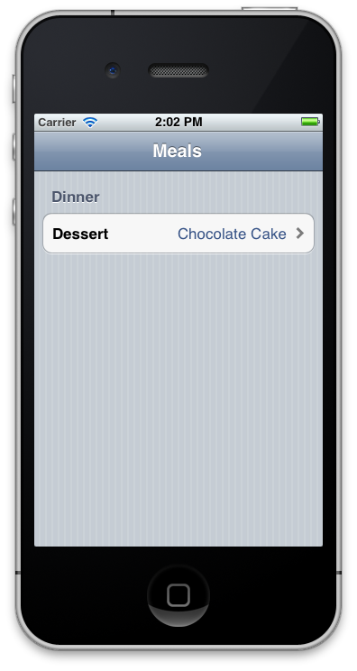](images/image4.png#lightbox) 
 [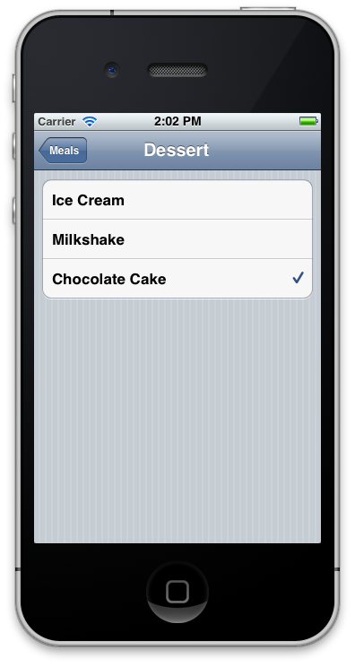](images/image5.png#lightbox)

Root elements can also be used inside Sections to trigger loading a new
nested configuration page, as shown above. When used in this mode the caption
provided is used while rendered inside a section and is also used as the Title
for the subpage. For example:

```csharp
var root = new RootElement ("Meals") {
    new Section ("Dinner") {
        new RootElement ("Dessert", new RadioGroup ("dessert", 2)) {
            new Section () {
                new RadioElement ("Ice Cream", "dessert"),
                new RadioElement ("Milkshake", "dessert"),
                new RadioElement ("Chocolate Cake", "dessert")
            }
        }
    }
};
```

In the above example, when the user taps on "Dessert", MonoTouch.Dialog will
create a new page and navigate to it with the root being "Dessert" and having a
radio group with three values.

In this particular sample, the radio group will select "Chocolate Cake" in
the "Dessert" section because we passed the value "2" to the RadioGroup. This
means pick the 3rd item on the list (zero-index).

Calling the Add method or using the C# 4 initializer syntax adds sections.
The Insert methods are provided to insert sections with an animation.

If you create the RootElement with a Group instance (instead of a RadioGroup)
the summary value of the RootElement when displayed in a Section will be the
cumulative count of all the BooleanElements and CheckboxElements that have the
same key as the Group.Key value.

### Sections

Sections are used to group elements in the screen and they are the only valid
direct children of the RootElement. Sections can contain any of the standard
elements, including new RootElements.

RootElements embedded in a section are used to navigate to a new deeper
level.

Sections can have headers and footers either as strings, or as UIViews.
Typically you will just use the strings, but to create custom UIs you can use
any UIView as the header or the footer. You can either use a string to create
them like this:

```csharp
var section = new Section ("Header", "Footer");
```

To use views, just pass the views to the constructor:

```csharp
var header = new UIImageView (Image.FromFile ("sample.png"));
var section = new Section (header);
```

### Getting Notified

#### Handling NSAction

MT.D surfaces an `NSAction` as a delegate for handling callbacks.
For example, say you want to handle a touch event for a table cell created by
MT.D. When creating an element with MT.D, simply supply a callback function, as
shown below:

```csharp
new Section () {
    new StringElement ("Demo Callback", delegate { Console.WriteLine ("Handled"); })
}
```

#### Retrieving Element Value

Combined with the `Element.Value` property, the callback can
retrieve the value set in other elements. For example, consider the following
code:

```csharp
var element = new EntryElement (task.Name, "Enter task description", task.Description);
                
var taskElement = new RootElement (task.Name) {
    new Section () { element },
    new Section () { new DateElement ("Due Date", task.DueDate) },
    new Section ("Demo Retrieving Element Value") {
        new StringElement ("Output Task Description", delegate { Console.WriteLine (element.Value); })
    }
};
```

This code creates a UI as shown below. For a complete walkthrough of this
example, see the [Elements API Walkthrough](~/ios/user-interface/monotouch.dialog/elements-api-walkthrough.md) tutorial.

 [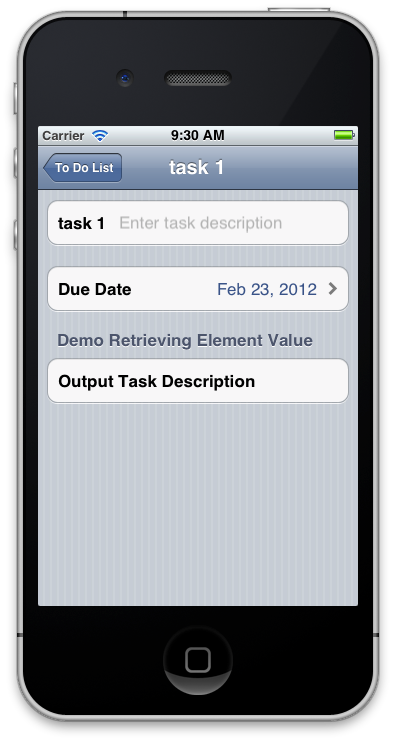](images/image6.png#lightbox)

When the user presses the bottom table cell, the code in the anonymous
function executes, writing the value from the `element` instance to
the **Application Output** pad in Visual Studio for Mac.

## Built-In Elements

MT.D comes with a number of built-in table cell items known as Elements.
These elements are used to display a variety of different types in table cells
such as strings, floats, dates and even images, to name just a few. Each element
takes care of displaying the data type appropriately. For example, a boolean
element will display a switch to toggle its value. Likewise, a float element
will display a slider to change the float value.

There are even more complex elements to support richer data types such as
images and html. For example, an html element, which will open a UIWebView to
load a web page when selected, displays a caption in the table cell.

### Working with Element Values

Elements that are used to capture user input expose a public `Value` property that holds the current value of the element at any
time. It is automatically updated as the user uses the application.

This is the behavior for all of the Elements that are part of
MonoTouch.Dialog, but it is not required for user-created elements.

### String Element

A `StringElement` shows a caption on the left side of a table cell
and the string value on the right side of the cell.

 [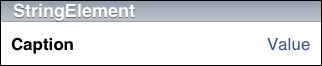](images/image7.png#lightbox)

To use a `StringElement` as a button, provide a delegate.

```csharp
new StringElement ("Click me", () => { 
    new UIAlertView("Tapped", "String Element Tapped", null, "ok", null).Show();
});
```

 [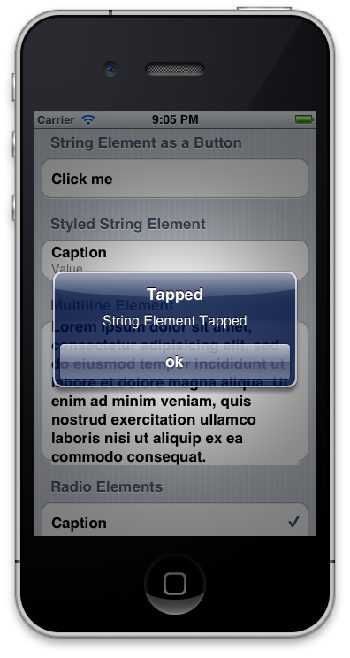](images/image8.png#lightbox)

### Styled String Element

A `StyledStringElement` allows strings to be presented using
either built-in table cell styles or with custom formatting.

 [](images/image9.png#lightbox)

The `StyledStringElement` class derives from `StringElement`, but lets developers customize a handful of
properties like the Font, text color, background cell color, line breaking mode,
number of lines to display, and whether an accessory should be displayed.

### Multiline Element

 [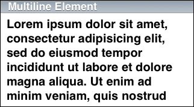](images/image10.png#lightbox)

### Entry Element

The `EntryElement`, as the name implies, is used to get user
input. It supports either regular strings or passwords, where characters are
hidden.

 [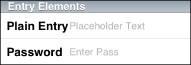](images/image11.png#lightbox)

It is initialized with three values:

- The caption for the entry that will be shown to the user.
- Placeholder text (this is the greyed-out text that provides a hint to the user). 
- The value of the text.

The placeholder and value can be null. However, the caption is required.

At any point, accessing its Value property can retrieve the value of the `EntryElement`.

Additionally the `KeyboardType` property can be set at creation
time to the keyboard type style desired for the data entry. This can be used to
configure the keyboard using the values of `UIKeyboardType` as listed
below:

- Numeric
- Phone
- Url
- Email

### Boolean Element

 [](images/image12.png#lightbox)

### Checkbox Element

 [](images/image13.png#lightbox)

### Radio Element

A `RadioElement` requires a `RadioGroup` to be
specified in the `RootElement`.

```csharp
mtRoot = new RootElement ("Demos", new RadioGroup("MyGroup", 0));
```

 [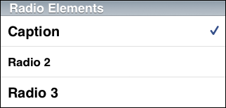](images/image14.png#lightbox)

 `RootElements` are also used to coordinate radio elements. The `RadioElement` members can span multiple Sections (for example to
implement something similar to the ring tone selector and separate custom ring
tones from system ringtones). The summary view will show the radio element that
is currently selected. To use this, create the `RootElement` with the
group constructor, like this:

```csharp
var root = new RootElement ("Meals", new RadioGroup ("myGroup", 0));
```

The name of the group in `RadioGroup` is used to show the selected
value in the containing page (if any) and the value, which is zero in this case,
is the index of the first selected item.

### Badge Element

 [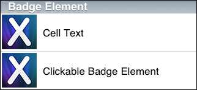](images/image15.png#lightbox)

### Float Element

 [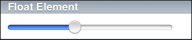](images/image16.png#lightbox)

### Activity Element

 [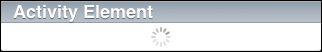](images/image17.png#lightbox)

### Date Element

 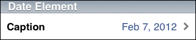

When the cell corresponding to the DateElement is selected, a date picker is
presented as shown below:

 [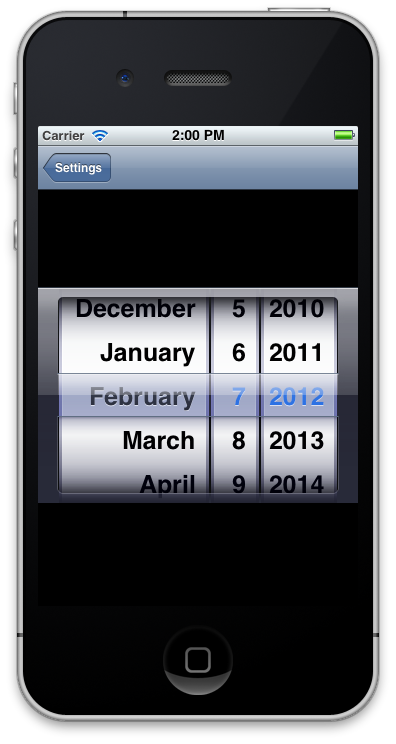](images/image19.png#lightbox)

### Time Element

 [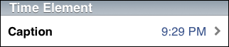](images/image20.png#lightbox)

When the cell corresponding to the TimeElement is selected, a time picker is
presented as shown below:

 [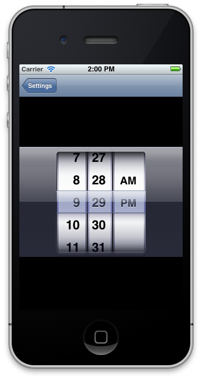](images/image21.png#lightbox)

### DateTime Element

 [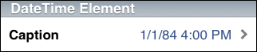](images/image22.png#lightbox)

When the cell corresponding to the DateTimeElement is selected, a datetime
picker is presented as shown below:

 [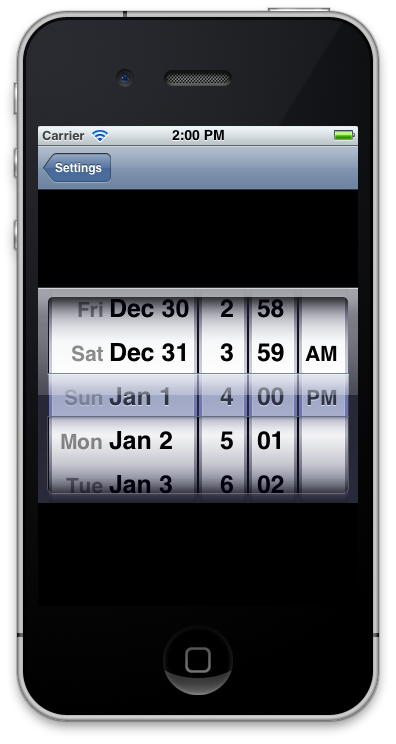](images/image23.png#lightbox)

### HTML Element

 [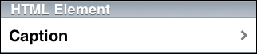](images/image24.png#lightbox)

The `HTMLElement` displays the value of its `Caption`
property in the table cell. Whe selected, the `Url` assigned to the
element is loaded in a `UIWebView` control as shown below:

 [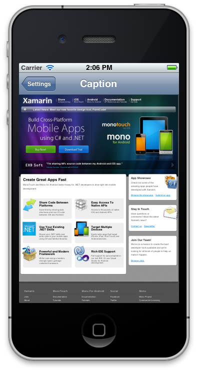](images/image25.png#lightbox)

### Message Element

 [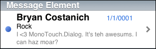](images/image26.png#lightbox)

### Load More Element

Use this element to allow users to load more items in your list. You can
customize the normal and loading captions, as well as the font and text color.
The `UIActivity` indicator starts animating, and the loading caption
is displayed when a user taps the cell, and then the `NSAction`
passed into the constructor is executed. Once your code in the `NSAction` is finished, the `UIActivity` indicator stops
animating and the normal caption is displayed again.

### UIView Element

Additionally, any custom `UIView` can be displayed using the `UIViewElement`.

### Owner-Drawn Element

This element must be subclassed as it is an abstract class. You should
override the `Height(RectangleF bounds)` method in which you should
return the height of the element, as well as `Draw(RectangleF bounds, CGContext context, UIView view)` in which you should do all your
customized drawing within the given bounds, using the context and view
parameters. This element does the heavy lifting of subclassing a `UIView`, and placing it in the cell to be returned, leaving you only
needing to implement two simple overrides. You can see a better sample
implementation in the sample app in the `DemoOwnerDrawnElement.cs`
file.

Here's a very simple example of implementing the class:

```csharp
public class SampleOwnerDrawnElement : OwnerDrawnElement
{
    public SampleOwnerDrawnElement (string text) : base(UITableViewCellStyle.Default, "sampleOwnerDrawnElement")
    {
        this.Text = text;
    }

    public string Text { get; set; }

    public override void Draw (RectangleF bounds, CGContext context, UIView view)
    {
        UIColor.White.SetFill();
        context.FillRect(bounds);

        UIColor.Black.SetColor();   
        view.DrawString(this.Text, new RectangleF(10, 15, bounds.Width - 20, bounds.Height - 30), UIFont.BoldSystemFontOfSize(14.0f), UILineBreakMode.TailTruncation);
    }

    public override float Height (RectangleF bounds)
    {
        return 44.0f;
    }
}
```

### JSON Element

The `JsonElement` is a subclass of `RootElement` that
extends a `RootElement` to be able to load the contents of nested
child from a local or remote url.

The `JsonElement` is a `RootElement` that can be
instantiated in two forms. One version creates a `RootElement` that
will load the contents on demand. These are created by using the `JsonElement` constructors that take an extra argument at the end,
the url to load the contents from:

```csharp
var je = new JsonElement ("Dynamic Data", "https://tirania.org/tmp/demo.json");
```

The other form creates the data from a local file or an existing `System.Json.JsonObject` that you have already parsed:

```csharp
var je = JsonElement.FromFile ("json.sample");
using (var reader = File.OpenRead ("json.sample"))
    return JsonElement.FromJson (JsonObject.Load (reader) as JsonObject, arg);
```

For more information on using JSON with MT.D, see the [JSON Element Walkthrough](./json-element-walkthrough.md) tutorial.

## Other Features

### Pull-to-Refresh Support

 *Pull-to-* *Refresh* is a visual effect originally found in the *Tweetie2* app, which became a popular effect among many
applications.

To add automatic pull-to-refresh support to your dialogs, you only need to do
two things: hook up an event handler to be notified when the user pulls the data
and notify the `DialogViewController` when the data has been loaded
to go back to its default state.

Hooking up a notification is simple; just connect to the `RefreshRequested` event on the `DialogViewController`,
like this:

```csharp
dvc.RefreshRequested += OnUserRequestedRefresh;
```

Then on your method `OnUserRequestedRefresh`, you would queue some
data loading, request some data from the net, or spin a thread to compute the
data. Once the data has been loaded, you must notify the `DialogViewController` that the new data is in, and to restore the
view to its default state, you do this by calling `ReloadComplete`:

```csharp
dvc.ReloadComplete ();
```

### Search Support

To support searching, set the `EnableSearch` property on your `DialogViewController`. You can also set the `SearchPlaceholder` property to use as the watermark text in the
search bar.

Searching will change the contents of the view as the user types. It searches
the visible fields and shows those to the user. The `DialogViewController` exposes three methods to programmatically
initiate, terminate or trigger a new filter operation on the results. These
methods are listed below:

- `StartSearch`
- `FinishSearch`
- `PerformFilter`

The system is extensible, so you can alter this behavior if you want.

### Background Image Loading

MonoTouch.Dialog incorporates the [TweetStation](https://github.com/migueldeicaza/TweetStation) application’s image loader. This image loader can be
used to load images in the background, supports caching and can notify your code
when the image has been loaded.

It will also limit the number of outgoing network connections.

The image loader is implemented in the `ImageLoader` class, all
you need to do is call the `DefaultRequestImage` method, you will
need to provide the Uri for the image you want to load, as well as an instance
of the `IImageUpdated` interface which will be invoked when the image
has been loaded.

For example the following code loads an image from a Url into a `BadgeElement`:

```csharp
string uriString = "http://some-server.com/some image url";

var rootElement = new RootElement("Image Loader") {
    new Section() {
        new BadgeElement( ImageLoader.DefaultRequestImage( new Uri(uriString), this), "Xamarin")
    }
};
```

The ImageLoader class exposes a Purge method that you can call when you want to release all 
of the images that are currently cached in memory. The current code has a cache for 50 images. 
If you want to use a different cache size (for instance, if you are expecting the images to be 
too large that 50 images would be too much), you can just create instances of ImageLoader and 
pass the number of images you want to keep in the cache.

## Using LINQ to Create Element Hierarchy

Via the clever usage of LINQ and C#’s initialization syntax, LINQ can be
used to create an element hierarchy. For example, the following code creates a
screen from some string arrays and handles cell selection via an anonymous
function that is passed into each `StringElement`:

```csharp
var rootElement = new RootElement ("LINQ root element") {
    from x in new string [] { "one", "two", "three" }
    select new Section (x) {
        from y in "Hello:World".Split (':')
        select (Element) new StringElement (y, delegate { Debug.WriteLine("cell tapped"); })
    }
};
```

This could easily be combined with an XML data store or data from a database
to create complex applications nearly entirely from data.

## Extending MT.D

### Creating Custom Elements

You can create your own element by inheriting from either an existing Element
or by deriving from the root class Element.

To create your own Element, you will want to override the following
methods:

```csharp
// To release any heavy resources that you might have
void Dispose (bool disposing);

// To retrieve the UITableViewCell for your element
// you would need to prepare the cell to be reused, in the
// same way that UITableView expects reusable cells to work
UITableViewCell GetCell (UITableView tv);

// To retrieve a "summary" that can be used with
// a root element to render a summary one level up.  
string Summary ();

// To detect when the user has tapped on the cell
void Selected (DialogViewController dvc, UITableView tableView, NSIndexPath path);

// If you support search, to probe if the cell matches the user input
bool Matches (string text);
```

If your element can have a variable size, you need to implement the `IElementSizing` interface, which contains one method:

```csharp
// Returns the height for the cell at indexPath.Section, indexPath.Row
float GetHeight (UITableView tableView, NSIndexPath indexPath);
```

If you are planning on implementing your `GetCell` method by
calling `base.GetCell(tv)` and customizing the returned cell, you
need to also override the `CellKey` property to return a key that
will be unique to your Element, like this:

```csharp
static NSString MyKey = new NSString ("MyKey");
protected override NSString CellKey {
    get {
        return MyKey;
    }
}
```

This works for most elements, but not for the `StringElement` and `StyledStringElement` as those use their own set of keys for various
rendering scenarios. You would have to replicate the code in those classes.

### DialogViewControllers (DVCs)

Both the Reflection and the Elements API use the same `DialogViewController`. Sometimes you will want to customize the look
of the view or you might want to use some features of the `UITableViewController` that go beyond the basic creation of UIs.

The `DialogViewController` is merely a subclass of the `UITableViewController` and you can customize it in the same way that
you would customize a `UITableViewController`.

For example, if you wanted to change the list style to be either `Grouped` or `Plain`, you could set this value by changing
the property when you create the controller, like this:

```csharp
var myController = new DialogViewController (root, true) {
    Style = UITableViewStyle.Grouped;
}
```

For more advanced customizations of the `DialogViewController`,
such as setting its background, you would subclass it and override the proper
methods, as shown in the example below:

```csharp
class SpiffyDialogViewController : DialogViewController {
    UIImage image;

    public SpiffyDialogViewController (RootElement root, bool pushing, UIImage image) 
        : base (root, pushing) 
    {
        this.image = image;
    }

    public override LoadView ()
    {
        base.LoadView ();
        var color = UIColor.FromPatternImage(image);
        TableView.BackgroundColor = UIColor.Clear;
        ParentViewController.View.BackgroundColor = color;
    }
}
```

Another customization point is the following virtual methods in the `DialogViewController`:

```csharp
public override Source CreateSizingSource (bool unevenRows)
```

This method should return a subclass of `DialogViewController.Source` for cases where your cells are evenly
sized, or a subclass of `DialogViewController.SizingSource` if your
cells are uneven.

You can use this override to capture any of the `UITableViewSource` methods. For example, [TweetStation](https://github.com/migueldeicaza/TweetStation) uses this to track when the user has scrolled to the
top and update accordingly the number of unread tweets.

## Validation

Elements do not provide validation themselves as the models that are well
suited for web pages and desktop applications do not map directly to the iPhone
interaction model.

If you want to do data validation, you should do this when the user triggers
an action with the data entered. For example a **Done** or **Next** button on the top toolbar, or some `StringElement` used as a button to go to the next stage.

This is where you would perform basic input validation, and perhaps more
complicated validation like checking for the validity of a user/password
combination with a server.

How you notify the user of an error is application specific. You could pop up
a `UIAlertView` or show a hint.

## Summary

This article covered a lot of information about MonoTouch.Dialog. It
discussed the fundamentals of the how MT.D works and covered the various
components that comprise MT.D. It also showed the wide array of elements and
table customizations supported by MT.D and discussed how MT.D can be extended
with custom elements. Additionally it explained the JSON support in MT.D that
allows creating elements dynamically from JSON.

## Related Links

- [Walkthrough: Creating an application using the Elements API](~/ios/user-interface/monotouch.dialog/elements-api-walkthrough.md)
- [Walkthrough: Creating an application using the Reflection API](~/ios/user-interface/monotouch.dialog/reflection-api-walkthrough.md)
- [Walkthrough: Using a JSON Element to create a User Interface](~/ios/user-interface/monotouch.dialog/json-element-walkthrough.md)
- [MonoTouch.Dialog JSON Markup](~/ios/user-interface/monotouch.dialog/monotouch.dialog-json-markup.md)
- [MonoTouch Dialog on Github](https://github.com/migueldeicaza/MonoTouch.Dialog)
- [UITableViewController Class Reference](https://developer.apple.com/library/ios/#DOCUMENTATION/UIKit/Reference/UITableViewController_Class/Reference/Reference.html)
- [UINavigationController Class Reference](https://developer.apple.com/library/ios/#documentation/UIKit/Reference/UINavigationController_Class/Reference/Reference.html)