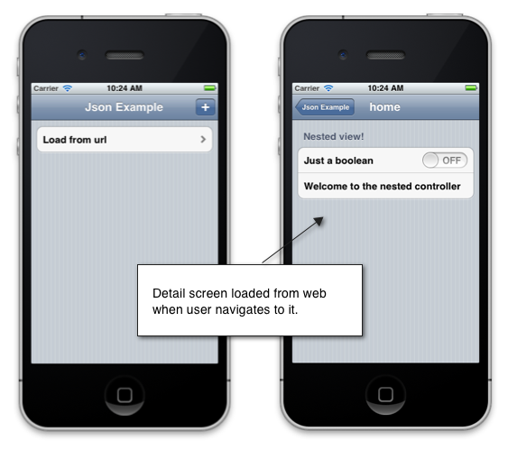

# Using JSON to create a user interface in Xamarin.iOS

_MonoTouch.Dialog (MT.D) includes support for dynamic UI generation via JSON data. In this tutorial, we’ll walk through how to use a JSONElement to create a user interface from JSON that is either included with an application, or loaded from a remote Url._

MT.D supports creating user interfaces declared in JSON. When elements are
declared using JSON, MT.D will create the associated elements for you
automatically. The JSON can be loaded either from a local file, a parsed `JsonObject` instance, or even a remote Url.

MT.D supports the full range of features that are available in the Elements
API when using JSON. For example, the application in the following screenshot is
completely declared using JSON:

[](json-element-walkthrough-images/01-load-from-file.png#lightbox) [](json-element-walkthrough-images/01-load-from-file.png#lightbox)

Let’s revisit the example from the [Elements API Walkthrough](~/ios/user-interface/monotouch.dialog/elements-api-walkthrough.md) tutorial, showing how to add a task detail screen using
JSON.

## Setting up MT.D

MT.D is distributed with Xamarin.iOS. To use it, right-click on the
**References** node of a Xamarin.iOS project in Visual Studio 2017 or
Visual Studio for Mac and add a reference to the **MonoTouch.Dialog-1**
assembly. Then, add `using MonoTouch.Dialog` statements in your source
code as necessary.

## JSON walkthrough

The example for this walkthrough allows tasks to be created. When a task is
selected on the first screen, a detail screen is presented as shown:

 [](json-element-walkthrough-images/03-task-list.png#lightbox)

## Creating the JSON

For this example, we’ll load the JSON from a file in the project named `task.json`. MT.D expects the JSON to conform to a syntax that
mirrors the Elements API. Just like using the Elements API from code, when using
JSON, we declare sections and within those sections we add elements. To declare
sections and elements in JSON, we use the strings “sections” and
“elements” respectively as the keys. For each element, the associated
element type is set using the `type` key. Every other elements
property is set with the property name as the key.

For example, the following JSON describes the sections and elements for the
task details:

```json
{
    "title": "Task",
    "sections": [
        {
            "elements" : [
                {
                    "id" : "task-description",
                    "type": "entry",
                    "placeholder": "Enter task description"
                },
                {
                    "id" : "task-duedate",
                    "type": "date",
                    "caption": "Due Date",
                    "value": "00:00"
                }
            ]
        }
    ]
}
```

Notice the JSON above includes an id for each element. Any element can
include an id, to reference it at runtime. We’ll see how this is used
in a moment when we show how to load the JSON in code.

## Loading the JSON in code

Once the JSON has been defined, we need to load it into MT.D using the `JsonElement` class. Assuming a file with the JSON we created above
has been added to the project with the name sample.json and given a build action
of content, loading the `JsonElement` is as simple as calling the
following line of code:

```csharp
var taskElement = JsonElement.FromFile ("task.json");
```

Since we are adding this on demand each time a task is created, we can modify
the button clicked from the earlier Elements API example as follows:

```csharp
_addButton.Clicked += (sender, e) => {
    ++n;

    var task = new Task{Name = "task " + n, DueDate = DateTime.Now};

    var taskElement = JsonElement.FromFile ("task.json");

    _rootElement [0].Add (taskElement);
};
```

## Accessing elements at runtime

Recall we added an id to both elements when we declared them in the JSON
file. We can use the id property to access each element at runtime to
modify their properties in code. For example, the following code references the
entry and date elements to set the values from the task object:

```csharp
_addButton.Clicked += (sender, e) => {
    ++n;

    var task = new Task{Name = "task " + n, DueDate = DateTime.Now};

    var taskElement = JsonElement.FromFile ("task.json");

    taskElement.Caption = task.Name;

    var description = taskElement ["task-description"] as EntryElement;

    if (description != null) {
        description.Caption = task.Name;
        description.Value = task.Description;       
    }

    var duedate = taskElement ["task-duedate"] as DateElement;

    if (duedate != null) {                
        duedate.DateValue = task.DueDate;
    }
    _rootElement [0].Add (taskElement);
};
```

## Loading JSON from a url

MT.D also supports dynamically loading JSON from an external Url by simply
passing the Url to the constructor of the `JsonElement`. MT.D will
expand the hierarchy declared in the JSON on demand as you navigate between
screens. For example, consider a JSON file such as the one below located at the
root of the local web server:

```json
{
    "type": "root",
    "title": "home",
    "sections": [
        {
            "header": "Nested view!",
            "elements": [
                {
                    "type": "boolean",
                    "caption": "Just a boolean",
                    "id": "first-boolean",
                    "value": false
                },
                {
                    "type": "string",
                    "caption": "Welcome to the nested controller"
                }
            ]
        }
    ]
}
```

We can load this using the `JsonElement` as in the following
code:

```csharp
_rootElement = new RootElement ("Json Example") {
    new Section ("") {
        new JsonElement ("Load from url", "http://localhost/sample.json")
    }
};
```

At runtime, the file will be retrieved and parsed by MT.D when the user
navigates to the second view, as shown in the screenshot below:

 [](json-element-walkthrough-images/04-json-web-example.png#lightbox)

## Summary

This article showed how to create a using interface with MT.D from JSON. It
showed how to load JSON included in a file with the application as well as from
a remote Url. It also showed how to access elements described in JSON at
runtime.

## Related links

- [MTDJsonDemo (sample)](/samples/xamarin/ios-samples/mtdjsondemo)
- [Introduction to MonoTouch.Dialog](~/ios/user-interface/monotouch.dialog/index.md)
- [Elements API Walkthrough](~/ios/user-interface/monotouch.dialog/elements-api-walkthrough.md)
- [Reflection API Walkthrough](~/ios/user-interface/monotouch.dialog/reflection-api-walkthrough.md)
- [MonoTouch Dialog on Github](https://github.com/migueldeicaza/MonoTouch.Dialog)
- [TweetStation Application](https://github.com/migueldeicaza/TweetStation)
- [UITableViewController Class Reference](https://developer.apple.com/library/ios/#DOCUMENTATION/UIKit/Reference/UITableViewController_Class/Reference/Reference.html)
- [UINavigationController Class Reference](https://developer.apple.com/library/ios/#documentation/UIKit/Reference/UINavigationController_Class/Reference/Reference.html)