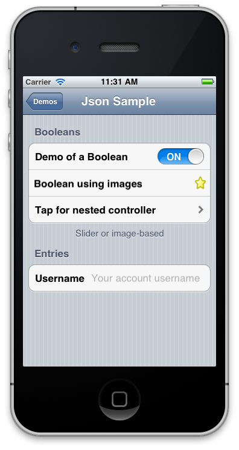

# MonoTouch.Dialog Json Markup

This page describes the Json markup accepted by MonoTouch.Dialog's [JsonElement](https://developer.xamarin.com/api/type/MonoTouch.Dialog.JsonElement/)

Let us start with an example. The following is a complete Json file that can
be passed into JsonElement.

```csharp
{     
  "title": "Json Sample",
  "sections": [ 
      {
          "header": "Booleans",
          "footer": "Slider or image-based",
          "id": "first-section",
          "elements": [
              { 
                  "type" : "boolean",
                  "caption" : "Demo of a Boolean",
                  "value"   : true
              }, {
                  "type": "boolean",
                  "caption" : "Boolean using images",
                  "value"   : false,
                  "on"      : "favorite.png",
                  "off"     : "~/favorited.png"
              }, {
                      "type": "root",
                      "title": "Tap for nested controller",
                      "sections": [ {
                         "header": "Nested view!",
                         "elements": [
                           {
                             "type": "boolean",
                             "caption": "Just a boolean",
                             "id": "the-boolean",
                             "value": false
                           },
                           {
                             "type": "string",
                             "caption": "Welcome to the nested controller"
                           }
                         ]
                       }
                     ]
                   }
          ]
      }, {
          "header": "Entries",
          "elements" : [
              {
                  "type": "entry",
                  "caption": "Username",
                  "value": "",
                  "placeholder": "Your account username"
              }
          ]
      }
  ]
}
```

The above markup produces the following UI:

 [](monotouch.dialog-json-markup-images/screen-shot-2012-03-02-at-11.31.31-am.png#lightbox)

Every element in the tree can contain the property `"id"`. It is
possible at runtime to reference individual sections or elements using the
JsonElement indexer. Like this:

```csharp
var jsonElement = JsonElement.FromFile ("demo.json");

var firstSection = jsonElement ["first-section"] as Section;

var theBoolean = jsonElement ["the-boolean"] as BooleanElement
```

 <a name="Root_Element_Syntax" />


## Root Element Syntax

The Root element contains the following values:

-  `title`
-  `sections` (optional)


The root element can appear inside a section as an element to create a nested
controller. In that case, the extra property `"type"` must be set to `"root"`

 <a name="url" />


### url

If the `"url"` property is set, if the user taps on this
RootElement, the code will request a file from the specified url and will make
the contents the new information displayed. You can use this to create extend
the user interface from the server based on what the user taps.

 <a name="group" />


### group

If set, this sets the groupname for the root element. Group names are used to
pick a summary that is displayed as the value of the root element from one of
the nested elements in the element. This is either the value of a checkbox or
the value of a radio button.

 <a name="radioselected" />


### radioselected

Identifies the radio item that is selected in nested elements

 <a name="title" />


### title

If present, it will be the title used for the RootElement

 <a name="type" />


### type

Must be set to `"root"` when this appears in a section (this is
used to nest controllers).

 <a name="sections" />


### sections

This is a Json array with individual sections

 <a name="Section_Syntax" />


## Section Syntax

The section contains:

-  `header` (optional)
-  `footer` (optional)
-  `elements` array


 <a name="header" />


### header

If present, the header text is displayed as a caption of the section.

 <a name="footer" />


### footer

If present, the footer is displayed at the bottom of the section.

 <a name="elements" />


### elements

This is an array of elements. Each element must contain at least one key, the `"type"` key that is used to identify the kind of element to create.
Some of the elements share some common properties like `"caption"`
and `"value"`. These are the list of supported elements:

-  `string` elements (both with and without styling)
-  `entry` lines (regular or password)
-  `boolean` values (using switches or images)


String elements can be used as buttons by providing a method to invoke when
the user taps on either the cell or the accessory,

 <a name="Rendering_Elements" />


## Rendering Elements

The rendering elements are based on the C# StringElement and
StyledStringElement and they can render information in various ways and it is
possible to render them in various ways. The simplest elements can be created
like this:

```csharp
{
        "type": "string",
        "caption": "Json Serializer",
}
```

This will show a simple string with all of the defaults: font, background,
text color and decorations. It is possible to hook up actions to these elements
and make them behave like buttons by setting the `"ontap"` property
or the `"onaccessorytap"` properties:

```csharp
{
    "type":    "string",
        "caption": "View Photos",
        "ontap:    "Acme.PhotoLibrary.ShowPhotos"
}
```

The above will invoke the "ShowPhotos" method in the class
"Acme.PhotoLibrary". The `"onaccessorytap"` is similar, but it will
only be invoked if the user taps on the accessory instead of tapping on the
cell. To enable this, you must also set the accessory:

```csharp
{
    "type":     "string",
        "caption":  "View Photos",
        "ontap:     "Acme.PhotoLibrary.ShowPhotos",
        "accessory: "detail-disclosure",
        "onaccessorytap": "Acme.PhotoLibrary.ShowStats"
}
```

Rendering elements can display two strings at once, one is the caption and
another is the value. How these strings are rendered depend on the style, you
can set this using the `"style"` property. The default will show the
caption on the left, and the value on the right. See the section on style for
more details. Colors are encoded using the '#' symbol followed by hex numbers
that represent the values for the red, green, blue and maybe alpha values. The
contents can be encoded in short form (3 or 4 hex digits) which represents
either RGB or RGBA values. Or the long form (6 or 8 digits) which represent
either RGB or RGBA values. The short version is a shorthand to writing the same
hex digit twice. So the "#1bc" constant is intepreted as red=0x11, green=0xbb
and blue=0xcc. If the alpha value is not present, the color is opaque. Some
examples:

```csharp
"background": "#f00"
"background": "#fa08f880"
```

 <a name="accessory" />


### accessory

Determines the kind of accessory to be shown in your rendering element, the
possible values are:

-  `checkmark`
-  `detail-disclosure`
-  `disclosure-indicator`


If the value is not present, no accessory is shown

 <a name="background" />


### background

The background property sets the background color for the cell. The value is
either a URL to an image (in this case, the async image downloader will be
invoked and the background will be updated once the image is downloaded) or it
can be a color specified using the color syntax.

 <a name="caption" />


### caption

The main string to be shown on the rendering element. The font and color can
be customized by setting the `"textcolor"` and `"font"`
properties. The rendering style is determined by the `"style"`
property.

 <a name="color_and_detailcolor" />


### color and detailcolor

The color to be used for the main text or the detailed text.

 <a name="detailfont_and_font" />


### detailfont and font

The font to use for the caption or the detail text. The format of a font
specification is the font name followed optionally by a dash and the point size.
The following are valid font specifications:

-  "Helvetica"
-  "Helvetica-14"


 <a name="linebreak" />


### linebreak

Determines how lines are broken up. The possible values are:

-  `character-wrap`
-  `clip`
-  `head-truncation`
-  `middle-truncation`
-  `tail-truncation`
-  `word-wrap`


Both `character-wrap` and `word-wrap` can be used
together with the `"lines"` property set to zero to turn the
rendering element into a multi-line element.

 <a name="ontap_and_onaccessorytap" />


### ontap and onaccessorytap

These properties must point to a static method name in your application
that takes an object as a parameter. When you create your hierarchy using the
JsonDialog.FromFile or JsonDialog.FromJson methods you can pass an optional
object value. This object value is then passed to your methods. You can use
this to pass some context to your static method. For example:

```csharp
class Foo {
    Foo ()
    {
        root = JsonDialog.FromJson (myJson, this);
    }

    static void Callback (object obj)
    {
        Foo myFoo = (Foo) obj;
        obj.Callback ();
    }
}
```

 <a name="lines" />


### lines

If this is set to zero, it will make the element auto-size depending on
the content of the strings contained. For this to work, you must also set the `"linebreak"` property to `"character-wrap"` or `"word-wrap"`.

 <a name="style" />


### style

The style determines the kind of cell style that will be used to render
the content and they correspond to the UITableViewCellStyle enumeration values.
The possible values are:

-  `"default"`
-  `"value1"`
-  `"value2"`
-  `"subtitle"` : text with a subtitle.


 <a name="subtitle" />


### subtitle

The value to use for the subtitle. This is a shortcut to set the style to `"subtitle"` and set the `"value"` property to a string.
This does both with a single entry.

 <a name="textcolor" />


### textcolor

The color to use for the text.

 <a name="value" />


### value

The secondary value to be shown on the rendering element. The layout of
this is affected by the `"style"` setting. The font and color can be
customized by setting the `"detailfont"` and `"detailcolor"`.

 <a name="Boolean_Elements" />


## Boolean Elements

Boolean elements should set the type to `"bool"`, can contain a `"caption"` to display and the `"value"` is set to either
true or false. If the `"on"` and `"off"` properties are
set, they are assumed to be images. The images are resolved relative to the
current working directory in the application. If you want to reference
bundle-relative files, you can use the `"~"` as a shortcut to
represent the application bundle directory. For example `"~/favorite.png"` will be the favorite.png that is contained in the
bundle file. For example:

```csharp
{ 
    "type" : "boolean",
    "caption" : "Demo of a Boolean",
    "value"   : true
},

{
    "type": "boolean",
    "caption" : "Boolean using images",
    "value"   : false,
    "on"      : "favorite.png",
    "off"     : "~/favorited.png"
}
```

 <a name="type" />


### type

Type can be set to either `"boolean"` or `"checkbox"`. If set to boolean it will use a UISlider or images (if
both `"on"` and `"off"` are set). If set to checkbox, it
will use a checkbox. The `"group"` property can be used to tag a
boolean element as belonging to a particular group. This is useful if the
containing root also has a `"group"` property as the root will
summarize the results with a count of all the booleans (or checkboxes) that
belong to the same group.

 <a name="Entry_Elements" />


## Entry Elements

You use entry elements to allow the user to enter data. The type for entry
elements is either `"entry"` or `"password"`. The `"caption"` property is set to the text to show on the right, and
the `"value"` is set to the initial value to set the entry to. The `"placeholder"` is used to show a hint to the user for empty entries
(it is shown greyed out). Here are some examples:

```csharp
{
        "type": "entry",
        "caption": "Username",
        "value": "",
        "placeholder": "Your account username"
}, {
        "type": "password",
        "caption": "Password",
        "value": "",
        "placeholder": "You password"
}, {
        "type": "entry",
        "caption": "Zip Code",
        "value": "01010",
        "placeholder": "your zip code",
        "keyboard": "numbers"
}, {
        "type": "entry",
        "return-key": "route",
        "caption": "Entry with 'route'",
        "placeholder": "captialization all + no corrections",
        "capitalization": "all",
        "autocorrect": "no"
}
```

 <a name="autocorrect" />


### autocorrect

Determines the auto-correction style to use for the entry. The possible
values are true or false (or the strings `"yes"` and `"no"`).

 <a name="capitalization" />


### capitalization

The capitalization style to use for the entry. The possible values are:

-  `all`
-  `none`
-  `sentences`
-  `words`


 <a name="caption" />


### caption

The caption to use for the entry

 <a name="keyboard" />


### keyboard

The keyboard type to use for data entry. The possible values are:

-  `ascii`
-  `decimal`
-  `default`
-  `email`
-  `name`
-  `numbers`
-  `numbers-and-punctuation`
-  `twitter`
-  `url`


 <a name="placeholder" />


### placeholder

The hint text that is shown when the entry has an empty value.

 <a name="return-key" />


### return-key

The label used for the return key. The possible values are:

-  `default`
-  `done`
-  `emergencycall`
-  `go`
-  `google`
-  `join`
-  `next`
-  `route`
-  `search`
-  `send`
-  `yahoo`


 <a name="value" />


### value

The initial value for the entry

 <a name="Radio_Elements" />


## Radio Elements

Radio elements have type `"radio"`. The item that is selected
is picked by the `radioselected` property on its containing root element.
Additionally, if a value is set for the `"group"` property, this
radio button belongs to that group.

 <a name="Date_and_Time_Elements" />


## Date and Time Elements

The element types `"datetime"`, `"date"` and `"time"` are used to render dates with times, dates or times. These
elements take as parameters a caption and a value. The value can be written in
any format supported by the .NET DateTime.Parse function. Example:

```csharp
"header": "Dates and Times",
"elements": [
        {
                "type": "datetime",
                "caption": "Date and Time",
                "value": "Sat, 01 Nov 2008 19:35:00 GMT"
        }, {
                "type": "date",
                "caption": "Date",
                "value": "10/10"
        }, {
                "type": "time",
                "caption": "Time",
                "value": "11:23"
                }                       
]
```

 <a name="Html/Web_Element" />


## Html/Web Element

You can create a cell that when tapped will embed a UIWebView that renders
the contents of a specified URL, either local or remote using the `"html"` type. The only two properties for this element are `"caption"` and `"url"`:

```csharp
{
        "type": "html",
        "caption": "Miguel's blog",
        "url": "http://tirania.org/blog" 
}
```
