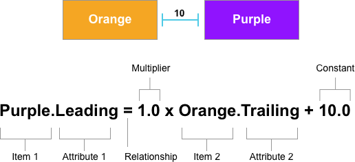

# Programmatic Layout Constraints in Xamarin.iOS

_This guide presents working with iOS Auto Layout constraints in C# code instead of creating them in the iOS Designer._

Auto Layout (also called “adaptive layout”) is a responsive design approach. Unlike the transitional layout system, where each element’s location is hard-coded to a point on the screen, Auto Layout is about *relationships* - the positions of elements relative to other elements on the design surface. At the heart of Auto Layout is the idea of constraints or rules that define the placement of an element or set of elements in the context of other elements on the screen. Because the elements are not tied to a particular position on the screen, constraints help create an adaptive layout that looks good on different screen sizes and device orientations.

Typically when working with Auto Layout in iOS, you'll use the iOS Designer to graphically place Layout Constraints on your UI items. However, there might be times when you need to create and apply constraints in C# code. For example, when using dynamically created UI elements added to a `UIView`.

This guide will show you how to create and work with constraints using C# code instead of creating them graphically in the iOS Designer.

<a name="Creating-Constraints-Programmatically"></a>

## Creating Constraints Programmatically

As stated above, typically you'll be working with Auto Layout Constraints in the iOS Designer. For those times that you do have to create your constraints programmatically, you have three options to choose from:

- [Layout Anchors](#Layout-Anchors) - This API provides access to the anchor properties (such as `TopAnchor`, `BottomAnchor` or `HeightAnchor`) of the UI items being constrained.
- [Layout Constraints](#Layout-Constraints) - You can create constraints directly using the `NSLayoutConstraint` class.
- [Visual Formatting Language](#Visual-Format-Language) - Provides an ASCII art like method to define your constraints.

The following sections will go over each option in detail.

<a name="Layout-Anchors"></a>

### Layout Anchors

By using the `NSLayoutAnchor` class, you have a fluent interface for creating constraints based on the anchor properties of the UI items being constrained. For example, a View Controller's top and bottom layout guides exposes the `TopAnchor`, `BottomAnchor` and `HeightAnchor` anchor properties while a View exposes edge, center, size and baseline properties.

> [!IMPORTANT]
> In addition to the standard set of anchor properties, iOS Views also include the `LayoutMarginsGuides` and `ReadableContentGuide` properties. These properties expose `UILayoutGuide` objects for working with the View's margins and readable content guides respectively.

Layout Anchors provide several methods for creating constraints in an easy-to-read, compact format:

- **ConstraintEqualTo** - Defines a relationship where `first attribute = second attribute + [constant]` with an optionally provided `constant` offset value.
- **ConstraintGreaterThanOrEqualTo** - Defines a relationship where `first attribute >= second attribute + [constant]` with an optionally provided `constant` offset value.
- **ConstraintLessThanOrEqualTo** - Defines a relationship where `first attribute <= second attribute + [constant]` with an optionally provided `constant` offset value.

For example:

```csharp
// Get the parent view's layout
var margins = View.LayoutMarginsGuide;

// Pin the leading edge of the view to the margin
OrangeView.LeadingAnchor.ConstraintEqualTo (margins.LeadingAnchor).Active = true;

// Pin the trailing edge of the view to the margin
OrangeView.TrailingAnchor.ConstraintEqualTo (margins.TrailingAnchor).Active = true;

// Give the view a 1:2 aspect ratio
OrangeView.HeightAnchor.ConstraintEqualTo (OrangeView.WidthAnchor, 2.0f);
```

A typical Layout Constraint can be expressed simply as a linear expression. Take the following example:

[](programmatic-layout-constraints-images/graph01.png#lightbox)

Which would be converted to the following line of C# code using Layout Anchors:

```csharp
PurpleView.LeadingAnchor.ConstraintEqualTo (OrangeView.TrailingAnchor, 10).Active = true; 
```

Where the parts of the C# code correspond to the given parts of the equation as follows:

|Equation|Code|
|---|---|
|Item 1|PurpleView|
|Attribute 1|LeadingAnchor|
|Relationship|ConstraintEqualTo|
|Multiplier|Defaults to 1.0 so not specified|
|Item 2|OrangeView|
|Attribute 2|TrailingAnchor|
|Constant|10.0|

In addition to providing only the parameters that are required to solve a given layout constraint equation, each of the Layout Anchor methods enforce the type safety of the parameters passed to them. So horizontal constraint anchors such as `LeadingAnchor` or `TrailingAnchor` can only be used with other horizontal anchor types and multipliers are only provided to size constraints.

<a name="Layout-Constraints"></a>

### Layout Constraints

You can add Auto Layout constraints manually by directly constructing a `NSLayoutConstraint` in C# code. Unlike using Layout Anchors, you must specify a value for every parameter, even if it will have no effect on the constraint being defined. As a result, you will end up producing a considerable amount of hard to read, boilerplate code. For example:

```csharp
//// Pin the leading edge of the view to the margin
NSLayoutConstraint.Create (OrangeView, NSLayoutAttribute.Leading, NSLayoutRelation.Equal, View, NSLayoutAttribute.LeadingMargin, 1.0f, 0.0f).Active = true;

//// Pin the trailing edge of the view to the margin
NSLayoutConstraint.Create (OrangeView, NSLayoutAttribute.Trailing, NSLayoutRelation.Equal, View, NSLayoutAttribute.TrailingMargin, 1.0f, 0.0f).Active = true;

//// Give the view a 1:2 aspect ratio
NSLayoutConstraint.Create (OrangeView, NSLayoutAttribute.Height, NSLayoutRelation.Equal, OrangeView, NSLayoutAttribute.Width, 2.0f, 0.0f).Active = true;
```

Where the `NSLayoutAttribute` enum defines the value for the view's margins and correspond to the `LayoutMarginsGuide` properties such as `Left`, `Right`, `Top` and `Bottom` and the `NSLayoutRelation` enum defines the relationship that will be created between the given attributes as `Equal`, `LessThanOrEqual` or `GreaterThanOrEqual`.

Unlike with the Layout Anchor API, the `NSLayoutConstraint` creation methods do not highlight the important aspects of a particular constraint and there are no compile time checks performed on the constraint. As a result, it is easy to construct an invalid constraint that will throw an exception at runtime.

<a name="Visual-Format-Language"></a>

### Visual Format Language

The Visual Format Language allows you to define constraints using ASCII art like strings that provide a visual representation of the constraint being created. This has the following advantages and disadvantages:

- The Visual Format Language enforces the creation of valid constraints only.
- Auto Layout outputs constraints to the console using the Visual Format Language so the debugging messages will resemble the code used to create the constraint.
- The Visual Format Language allows you to create multiple constraints at the same time with a very compact expression.
- Since there is no compile-side validation of the Visual Format Language strings, issues can only be discovered at runtime.
- Since the Visual Format Language emphasizes visualization over completeness some constraint types cannot be created with it (such as ratios).

You take the following steps when using the Visual Format Language to create a constraint:

1. Create a `NSDictionary` that contains the View objects and Layout Guides and a string key that will be used when defining the formats.
2. Optionally create a `NSDictionary` that defines a set of keys and values (`NSNumber`) used as the Constant value for the constraint.
3. Create the format string to layout a single column or row of items.
4. Call the `FromVisualFormat` method of the `NSLayoutConstraint` class to generate the constraints.
5. Call the `ActivateConstraints` method of the `NSLayoutConstraint` class to activate and apply the constraints.

For example, to create both a leading and a trailing constraint in the Visual Format Language, you could use the following:

```csharp
// Get views being constrained
var views = new NSMutableDictionary (); 
views.Add (new NSString ("orangeView"), OrangeView);

// Define format and assemble constraints
var format = "|-[orangeView]-|";
var constraints = NSLayoutConstraint.FromVisualFormat (format, NSLayoutFormatOptions.AlignAllTop, null, views);

// Apply constraints
NSLayoutConstraint.ActivateConstraints (constraints);
```

Since the Visual Format Language always creates zero point constraints attached to the parent View's margins when using the default spacing, this code produces identical results to the examples presented above.

For more complex UI designs, such as multiple child views on a single line, the Visual Format Language specifies both the horizontal spacing and the vertical alignment. As in the example above where it specifies the `AlignAllTop` `NSLayoutFormatOptions` aligns all of the views in a row or column to their tops.

See Apple's [Visual Format Language Appendix](https://developer.apple.com/library/ios/documentation/UserExperience/Conceptual/AutolayoutPG/VisualFormatLanguage.html#//apple_ref/doc/uid/TP40010853-CH27-SW1) for some examples of specifying common constraints and the Visual Format String Grammar.

<a name="Summary"></a>

## Summary

This guide presented creating and working with Auto Layout constraints in C# as opposed to creating them graphically in the iOS Designer. First, it looked at using Layout Anchors (`NSLayoutAnchor`) to handle Auto Layout. Next, it showed how to work with Layout Constraints (`NSLayoutConstraint`). Finally, it presented using the Visual Format Language for Auto Layout.

## Related Links

- [Introduction to Storyboards](~/ios/user-interface/storyboards/index.md)
- [iOS Designable Controls Walkthrough](~/ios/user-interface/designer/ios-designable-controls-walkthrough.md)
- [Auto Layout with the Xamarin Designer for iOS](~/ios/user-interface/designer/designer-auto-layout.md#modifying-in-code)
- [Apple - Programmatically Creating Constraints](https://developer.apple.com/library/ios/documentation/UserExperience/Conceptual/AutolayoutPG/ProgrammaticallyCreatingConstraints.html#//apple_ref/doc/uid/TP40010853-CH16-SW1)
- [Apple - Visual Format Language Appendix](https://developer.apple.com/library/ios/documentation/UserExperience/Conceptual/AutolayoutPG/VisualFormatLanguage.html#//apple_ref/doc/uid/TP40010853-CH27-SW1)
