# Introduction to Storyboards in Xamarin.iOS

In this guide we will explain what a Storyboard is and examine some of the key components – such as Segues. We'll look at how 
Storyboards can be created and used, and what advantages they  have for a developer.

Before the Storyboard file format was introduced by Apple as a visual representation of the UI of an iOS application, developers 
created XIB files for each view controller, and programmed the navigation between each view manually.  Using a Storyboard 
lets the developer define both view controllers and the navigation between them on a design surface and offers WYSIWYG editing 
of the application's user interface.

A Storyboard can be created, opened and edited with the Xamarin iOS Designer. This guide will also walkthrough how to use the 
Designer to create your storyboards while using C# to program the navigation.


## Requirements

Storyboards can be used with the iOS Designer in Visual Studio for Mac or with Visual 
Studio 2015 and 2017 with the Xamarin workloads installed.

## What is a Storyboard?

A Storyboard is the visual representation of all the screens in an application. It contains a sequence of scenes, with each 
scene representing a *View Controller* and its *Views*. These views may contain objects and 
[controls](~/ios/user-interface/controls/index.md) that will allow your user to interact with your application. This collection 
of views and controls (or *subviews*) is known as a *Content View Hierarchy*. Scenes are connected by segue objects, which 
represent a transition between view controllers. This is normally achieved by creating a segue between an object on the 
initial view, and the connecting view. The relationships on the design surface are illustrated in the image below:

 [](images/storyboardsview.png#lightbox)

As shown, the storyboard will lay out each of your scenes with content already rendered and illustrates the connections 
between them.  It is worth noting at this point, that when we talk about scenes on an iPhone, it is safe to assume that 
one *scene* on the storyboard is equal to one *screen* of content on the device. However, with an iPad it is possible to have multiple scenes appear at once – for example, using a Popover view controller.

There are many advantages to using storyboards to create your application's UI, especially when using Xamarin. Firstly, 
it is a visual representation of the UI, as all objects – 
including [custom controls](~/ios/user-interface/designer/ios-designable-controls-overview.md) – are rendered at design-time. 
This means that before building or deploying your application you can visualize its appearance and flow. Take the above 
image, for example. We can tell from a quick look at the design surface how many Scenes there are, the layout of each view 
and how everything is related. This is what makes Storyboards so powerful.

Events are more manageable with Storyboards, particularly when using the iOS Designer. Most UI controls will have a list of possible events in the Properties Pad. The event handler can be added here and completed in a partial method in the View Controllers class..

The content of a storyboard is stored as an XML file. At build time, any `.storyboard` files are compiled into binary files 
known as nibs. At runtime, these nibs are initialized and instantiated to create new views.

## Segues

A *Segue*, or *Segue Object*, is used in iOS development to represent a transition between scenes. To create a segue, hold 
down the **Ctrl** key and click-drag from one scene to another. As we drag our mouse, a blue connector appears, indicating where the segue will lead as demonstrated in the image below:

 [](images/createsegue.png#lightbox)

On mouse-up, a menu will appear letting us choose the action for our segue. It may look similar to the images below: 

**Pre-iOS 8 and Size Classes**:

[](images/segue1.png#lightbox)

**When using Size Classes and Adaptive Segues**:

[](images/16new.png#lightbox)

> [!IMPORTANT]
> If you are using VMWare for your Windows Virtual Machine,  Ctrl-click is mapped as the _Right-Click_ mouse button by default. To create a Segue, edit your Keyboard preferences through **Preferences** > **Keyboard & Mouse** > **Mouse Shortcuts** and remap your **Secondary button** as illustrated below:
> 
> [](images/image22.png#lightbox)
> 
> You should now be able to add a segue between your View Controllers as normal.

There are different types of transitions, each giving control over how a new view controller is presented to the user and how 
it interacts with other view controllers in the Storyboard. These are explained below. It is also possible to subclass a segue 
object to implement a custom transition:

-  **Show / Push** – A push segue adds the view controller to the navigation stack. It assumes the view controller originating the 
push is part of the same navigation controller as the view controller that is being added to the stack. This does the same 
thing as  `pushViewController` , and is generally used when there is some relationship between the data on the screens. Using the 
push segue gives you the luxury of having a navigation bar with a back button and title added to each view on the stack, allowing 
drill down navigation through the view hierarchy.
-  **Modal** – A modal segue create a relationship between any two view controllers in your project, with the option of an 
animated transition being shown. The child view controller will completely obscure the parent view controller when brought into 
view. Unlike a push segue, which adds a back button for us; when using a modal segue  `DismissViewController` must be used in 
order to return to the previous view controller.
-  **Custom** – Any custom segue can be created as a subclass of ` UIStoryboardSegue`.
-  **Unwind** – An unwind segue can be used to navigate back through a push or modal segue – for example, by dismissing the 
modally-presented view controller. In addition to this, you can unwind through not only one, but a series of push and modal 
segues and go back multiple steps in your navigation hierarchy with a single unwind action. To understand how to use an unwind 
segue in the iOS, read the  [Creating Unwind Segues](https://github.com/xamarin/recipes/tree/master/Recipes/ios/general/storyboard/unwind_segue) recipe.
-  **Sourceless** – A sourceless segue indicates the scene containing the initial view controller and therefore which view the 
user will see first. It is represented by the segue shown below:  

	[](images/sourcelesssegue.png#lightbox)

### Adaptive Segue Types

 iOS 8 introduced [Size Classes](~/ios/user-interface/storyboards/unified-storyboards.md#size-classes) to allow an iOS storyboard file to work with all available screen sizes, enabling developers to create one UI for all iOS devices. By default, all new Xamarin.iOS applications will use size classes. To use size classes from an older project, refer to the [Introduction to Unified Storyboards](~/ios/user-interface/storyboards/unified-storyboards.md) guide. 
 
Any application using Size Classes will also use the new [*Adaptive Segues*](~/ios/user-interface/storyboards/unified-storyboards.md). When using size classes, remember that we aren't directly specifying wether we are using an iPhone or iPad. In other words we are creating one UI that will always look the same, regardless of how much real estate it has to work with. Adaptive Segues work by judging the environment, and determining how best to present content. The Adaptive Segues are shown below: 

[](images/adaptivesegue.png#lightbox)

|Segue|Description|
|--- |--- |
|Show|This is very similar to a Push segue, but it takes the content of the screen into account.|
|Show Detail|If the app displays a master and detail view (For example, in a split view controller on an iPad), the content will replace the detail view. If the app displays only the master or detail, the content will replace the top of the view controller stack.|
|Presentation|This is similar to the Modal segue, and allows for selection of presentation and transition styles.|
|Popover Presentation|This presents content as a popover|

### Transferring Data with Segues

The benefits of a segue don't end with transitions. They can also be used to manage the transfer of data between view controllers. This is achieved by overriding the `PrepareForSegue` method on the initial view controller and handling the data ourselves. When the segue is triggered – for example, with a button press – the application will call this method, providing an opportunity to prepare the new view controller *before* any navigation occurs. The code below, from the [Phoneword](https://developer.xamarin.com/samples/monotouch/Hello_iOS/) sample, demonstrates this: 


```csharp
public override void PrepareForSegue (UIStoryboardSegue segue, 
NSObject sender)
{
    base.PrepareForSegue (segue, sender);

    var callHistoryController = segue.DestinationViewController 
                                  as CallHistoryController;

    if (callHistoryController != null) {
        callHistoryController.PhoneNumbers = PhoneNumbers;
    }
}
```

In this example, the `PrepareForSegue` method will be called when the segue is triggered by the user. We first have to create 
an instance of the 'receiving' view controller and set this as the segue's destination View Controller. This is done by the 
line of code below:

```csharp
var callHistoryController = segue.DestinationViewController as CallHistoryController;
```

The method now has the ability to set properties on the `DestinationViewController`. In this example we have taken advantage 
of this by passing a list called `PhoneNumbers` to the `CallHistoryController` and assigning it to an object of the same name:

```csharp
if (callHistoryController != null) {
        callHistoryController.PhoneNumbers = PhoneNumbers;
    }
```

Once the transition has finished, the user will see the `CallHistoryController` with the populated list.

## Adding a Storyboard to a Non-Storyboard Project

On occasion you may need to add a Storyboard to a previously non-storyboard file. Once Doing this in Visual Studio for Mac can be streamlined by following the steps below:

# [Visual Studio for Mac](#tab/macos)

1. Create a new Storyboard file by browsing to **File > New File > iOS > Storyboard**, as illustrated below: 
    
    [](images/new-storyboard-xs.png#lightbox)

2. Add your Storyboard name to the **Main Interface** section of the **Info.plist**, as shown below:
    
    [](images/infoplist.png#lightbox)
    
    This does the equivalent of instantiating the Initial View Controller in the `FinishedLaunching` method within the App Delegate. With this option set, the application instantiates a window (See below), loads the main storyboard, and assigns an instance of the storyboard's Initial View Controller (the one beside the sourceless Segue) as the `RootViewController` property of the window and then makes the window visible on the screen.

3. In the `AppDelegate`, override the default `Window` method, with the following code to implement the window property:
        
        public override UIWindow Window {
            get;
            set;
            }
            
# [Visual Studio](#tab/windows)

1. Create a new Storyboard file by right-clicking on the project to **Add > New File > iOS > Empty Storyboard**, as illustrated below: 
    
    [](images/new-storyboard-vs.png#lightbox)

2. Add your Storyboard name to the **Main Interface** section of the iOS Application, as shown below:
    
    [](images/ios-app.png#lightbox)
    
    This does the equivalent of instantiating the Initial View Controller in the `FinishedLaunching` method within the App Delegate. With this option set, the application instantiates a window (See below), loads the main storyboard, and assigns an instance of the storyboard's Initial View Controller (the one beside the sourceless Segue) as the `RootViewController` property of the window and then makes the window visible on the screen.

3. In the `AppDelegate`, override the default `Window` method, with the following code to implement the window property:

        public override UIWindow Window {
            get;
            set;
            }
            
-----

## Creating a Storyboard with the iOS Designer

A Storyboard can be created using the Xamarin Designer for iOS, which has been integrated seamlessly with Visual Studio for Mac and Visual Studio.

To get started using the iOS Designer to create storyboards, follow the [Hello, iOS Multiscreen](~/ios/get-started/hello-ios-multiscreen/index.md) guide. In this walkthrough you will explore navigation between View Controllers using Segues, and how to handle events on your controls.

## Instantiate Storyboards Manually

Storyboards totally replace individual XIB files in your project, however
individual view controllers in a Storyboard can still be instantiated using `Storyboard.InstantiateViewController`.

Sometimes applications have special requirements that can't be handled with the built-in storyboard transitions provided by the 
Designer. For example, if we were to create an application that launches different screens from the same button, depending on 
the current state of an application, we may want to instantiate the view controllers manually, and program the transition 
ourselves.

The screenshot below shows two view controllers on our design surface with no segue between them. The next section will walk 
through how that transition can be set up in code.

 [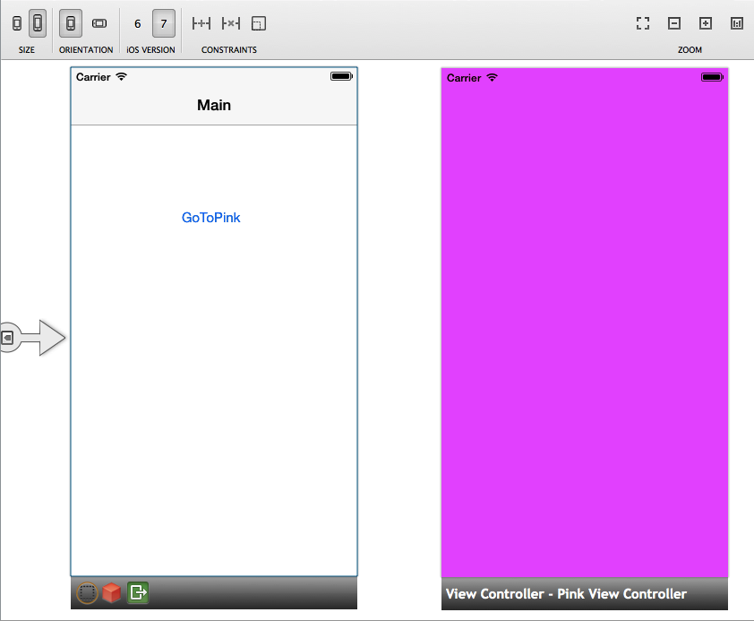](images/viewcontrollerspink.png#lightbox)

1. Add an _Empty iPhone Storyboard_ to an existing project project:
    
    [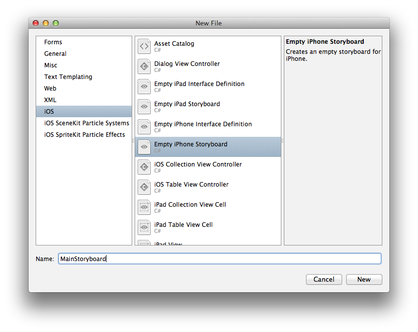](images/add-storyboard1.png#lightbox)

2. Double click on the newly created storyboard to open it, and add a new **Navigation Controller** to the design surface. As the Navigation Controller is UI-less, by default it will come with a Root View Controller, as illustrated below:

    [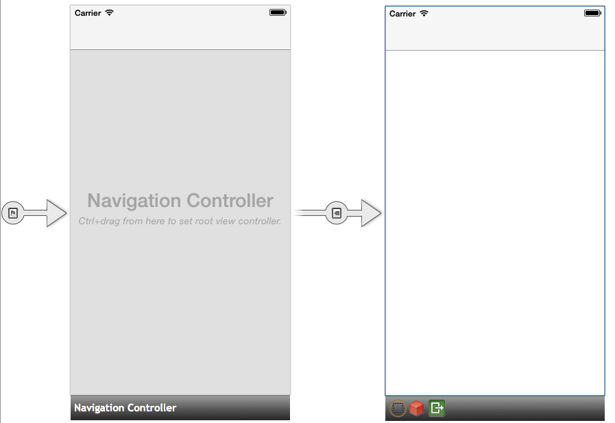](images/uinavigationcontroller.png#lightbox)

3. Select the _View Controller_ by clicking on the black bar at the bottom. In the Designer's **Property Pad**, under **Identity** we can specify a custom class as well as a unique ID for the View Controller. Set the **class name** and **Storyboard ID** to `MainViewController`.

    [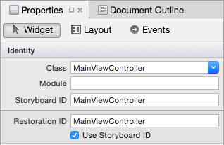](images/identitypanelnew.png#lightbox)

4. Later, we will need to instantiate our view controllers from the storyboard, and will use the Storyboard ID to reference them in our code. Setting the Restoration ID to match the Storyboard ID ensures that the view controller gets recreated correctly if the state needs to be restored.

5. We currently only have one view controller. Drag another view controller onto the design surface. In the **Property Pad**, under Identity, set the class and Storyboard ID to `PinkViewController`, as illustrated below:

    [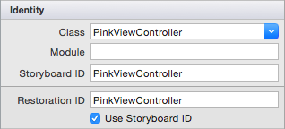](images/pinkvcnew.png#lightbox)
    
    The IDE will create these custom classes for the view controllers. These can be viewed in the **Solution Pad**, as illustrated in the screenshot below:
    
    [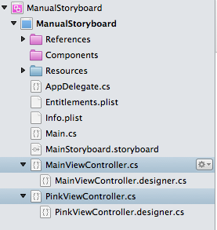](images/solution-pad.png#lightbox)

6. In the `PinkViewController`, select the view by clicking towards the center of the controller's frame. In the Properties Pad, under View change the **Background** to Magenta:
    
    [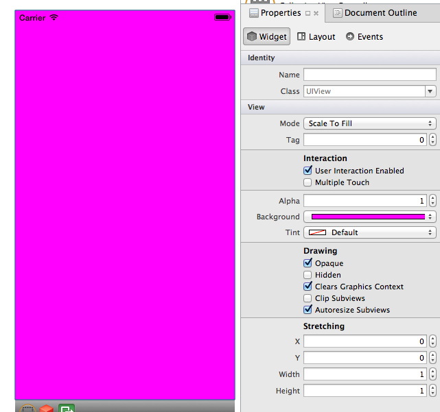](images/pinkcontroller.png#lightbox)

7. Finally, drag a button from the **ToolBox** onto the `MainViewController`. In the Properties Pad, give it the name `PinkButton` and the Title GoToPink, as illustrated below:

    [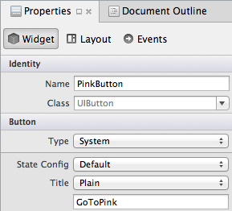](images/pinkbutton.png#lightbox)

The storyboard is complete, but if we deploy the project now, we will get a blank screen. That's because we still need to tell the IDE to use our storyboard, and to set up a root view controller to serve as the first view. Normally this can be done through our Project Options, as shown above. However in this example we will achieved the same result in code, by adding the following to the **AppDelegate**:

```csharp
public partial class AppDelegate : UIApplicationDelegate
    {
        UIWindow window;
        public static UIStoryboard Storyboard = UIStoryboard.FromName ("MainStoryboard", null);
        public static UIViewController initialViewController;

        public override bool FinishedLaunching (UIApplication app, NSDictionary options)
        {
            window = new UIWindow (UIScreen.MainScreen.Bounds);

            initialViewController = Storyboard.InstantiateInitialViewController () as UIViewController;

            window.RootViewController = initialViewController;
            window.MakeKeyAndVisible ();
            return true;
        }

    }
```

That's a lot of code, but only a few lines are unfamiliar. First, we register our storyboard with the **AppDelegate** by passing in the storyboard's name, **MainStoryboard**. Next, we tell the application to instantiate an initial view controller from the storyboard by calling `InstantiateInitialViewController` on our storyboard, and we set that view controller as our application's root view controller. This method determines the first screen that the user sees, and creates a new instance of that View Controller.

Notice in the solution pane that the IDE has created a `MainViewcontroller.cs` class, and its `corresponding designer.cs` when we added the Class name to the Properties Pad in step 4. We can see this class created a special constructor that includes a base class:

```csharp
public MainViewController (IntPtr handle) : base (handle) 
{
}
```


When creating a Storyboard using the Designer, the IDE will automatically add the [[Register]](xref:Foundation.RegisterAttribute) attribute at the top of the `designer.cs` class, and pass in a string identifier, which is identical to the Storyboard ID specified in the previous step. This will link the C# to the relevant scene in the Storyboard.

At some point you might want to add an existing class which was **not** created in the designer. In this case, you would Register this class as normal:

```csharp
[Register ("MainViewController")]
public partial class MainViewController : UIViewController
{
public MainViewController (IntPtr handle) : base (handle) 
{
}

...
}
```

For more information on registering classes and methods, refer to the [Type Registrar](http://docs.xamarin.com/guides/ios/advanced_topics/registrar/) documentation.

The last step in this class is to wire up the button and the transition to the pink view controller. We'll instantiate the `PinkViewController` from the Storyboard; then, we will program a push segue with `PushViewController`, as illustrated by the example code below:

```csharp
public partial class MainViewController : UIViewController
{
    UIViewController pinkViewController;

    public MainViewController (IntPtr handle) : base (handle)
    {

    }

    public override void AwakeFromNib ()
    {
    // Called when loaded from xib or storyboard.

    this.Initialize ();
    }

    public void Initialize(){

    //Instantiating View Controller with Storyboard ID 'PinkViewController'
    pinkViewController = Storyboard.InstantiateViewController ("PinkViewController") as PinkViewController;
    }

    public override void ViewDidLoad ()
    {
    base.ViewDidLoad ();

    //When we push the button, we will push the pinkViewController onto our current Navigation Stack
    PinkButton.TouchUpInside += (o, e) =&gt; {
        this.NavigationController.PushViewController (pinkViewController, true);
    };
    }

}
```

Running the application produces a 2-screen application:


## Conditional Segues

Often, moving from one view controller to the next is dependent upon a certain condition. For example, if we were making a simple login screen we would only want to move to the next screen *if* the username and password had been verified.

In the next example we'll add a password field to the sample above. The user will only be able to access the *PinkViewController* if they enter the correct password, otherwise an error will be displayed.

Before we begin, follow through steps 1 – 8 above. In these steps we create our storyboard, begin to create our UI, and tell our App Delegate which View Controller to use as it's RootViewController.

1. Now, let's build up our UI and add the additional views listed to the `MainViewController` to make it look like that in the screenshot below:

	- UITextField
		- Name: PasswordTextField
		- Placeholder: 'Enter the Secret Password'
	- UILabel
		- Text: 'Error: Wrong Password. You shall not pass!'
		- Color: Red
		- Alignment: Center
		- Lines: 2
		- 'Hidden' checkbox checked	
		
	[](images/passwordvc.png#lightbox)
	
2. Create a Segue between the Go To Pink button and the view controller by Ctrl-Dragging from the *PinkButton* to the *PinkViewController*, and selecting **Push** on mouse-up. 

3. Click on the Segue and give it the *Identifier* `SegueToPink`:

	[](images/namesegue.png#lightbox)  
	

4. Finally, add the following ShouldPerformSegue method to the `MainViewController` class:

    ```csharp
    public override bool ShouldPerformSegue (string segueIdentifier, NSObject sender)
    {
        
        if(segueIdentifier == "SegueToPink"){
            if (PasswordTextField.Text == "password") {
                PasswordTextField.ResignFirstResponder ();
                return true;
            }
            else{
                ErrorLabel.Hidden = false;
                return false;
            }
        }
        return base.ShouldPerformSegue (segueIdentifier, sender);
    }
    ```

In this code we have matched the segueIdentifier to our `SegueToPink` segue, so we can then test a condition; a valid password in this case. If our condition returns `true`, the Segue will perform, and will present the `PinkViewController`. If `false`, the new View Controller will not be presented.

We can apply this approach to any Segue on this view controller by checking the segueIdentifier argument to the ShouldPerformSegue method. In this case we only have one Segue identifier – `SegueToPink`.

Refer to the Storyboards.Conditional solution in the [Manual Storyboards sample](https://developer.xamarin.com/samples/monotouch/ManualStoryboard/) for a working example.

<a name="Using-Storyboard-References" />

## Using Storyboard References

A Storyboard Reference allows you to take a large, complex Storyboard design and break it into smaller Storyboards that get referenced from the original, thus removing complexity and making the resulting individual Storyboards easier to design and maintain.

Additionally, a Storyboard Reference can provide an _anchor_ to another scene within the same Storyboard or a specific scene on a different one.

<a name="Referencing-an-External-Storyboard" />

### Referencing an External Storyboard

To add a reference to an external Storyboard, do the following:

1. In the **Solution Explorer**, right-click on the Project Name and select **Add** > **New File...** > **iOS** > **Storyboard**. Enter a **Name** for the new Storyboard and click the **New** button:
	
	[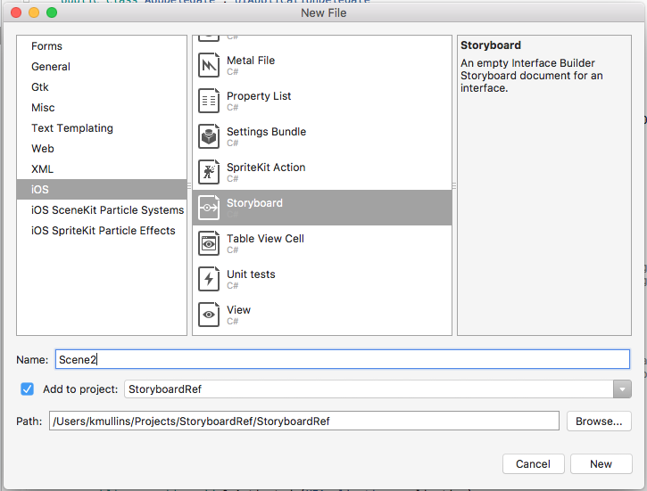](images/ref01.png#lightbox)
	
2. Design the layout of the new Storyboard's scenes as you normally would and save your changes: 
	
	[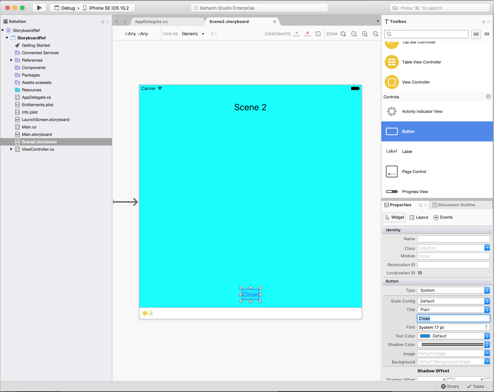](images/ref02.png#lightbox)
	
3. Open the Storyboard that you are going to be adding the reference to in the iOS Designer.

4. Drag a **Storyboard Reference** from the **Toolbox** onto the Design Surface: 
	
	[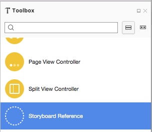](images/ref03.png#lightbox)
	
5. In the **Widget** tab of the **Properties Explorer**, select the name of the **Storyboard** that you created above: 

	[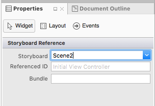](images/ref04.png#lightbox)
	
6. Control-click on a UI Widget (like a Button) on an existing Scene and create a new Segue to the **Storyboard Reference** that you just created: 

	[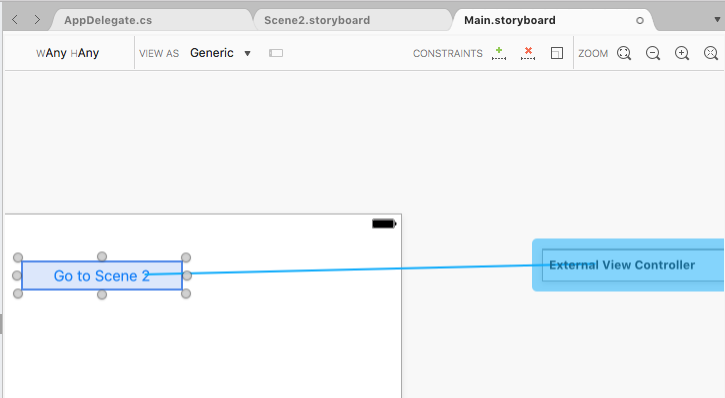](images/ref05.png#lightbox) 
	
7. From the popup menu select **Show** to complete the Segue: 

	[](images/ref06.png#lightbox) 
	
8. Save your changes to the Storyboard.

When the app is run and the user clicks on the UI element that you created the Segue from, the Initial View Controller from the External Storyboard specified in the Storyboard Reference will be displayed.

<a name="Referencing-a-Specific-Scene-in-an-External-Storyboard" />

### Referencing a Specific Scene in an External Storyboard

To add a reference to a specific Scene an external Storyboard (and not the Initial View Controller), do the following:

1. In the **Solution Explorer**, double-click the external Storyboard to open it for editing.

2. Add a new Scene and design its layout as you normally would: 

	[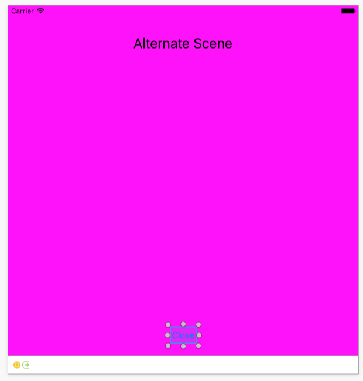](images/ref07.png#lightbox)
	
3. In the **Widget** tab of the **Properties Explorer**, enter a **Storyboard ID** for the new Scene's View Controller: 

	[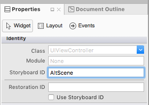](images/ref08.png#lightbox)
	
3. Open the Storyboard that you are going to be adding the reference to in the iOS Designer.

4. Drag a **Storyboard Reference** from the **Toolbox** onto the Design Surface: 

	[](images/ref03.png#lightbox)
	
5. In the **Widget** tab of the **Properties Explorer**, select the name of the **Storyboard** and the **Reference ID** (Storyboard ID) of the Scene that you created above: 

	[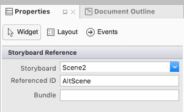](images/ref09.png#lightbox)
	
6. Control-click on a UI Widget (like a Button) on an existing Scene and create a new Segue to the **Storyboard Reference** that you just created: 

	[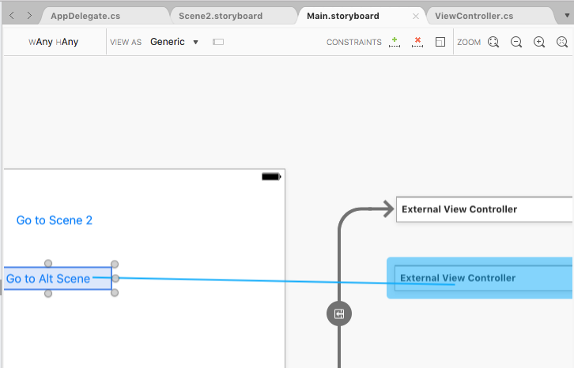](images/ref10.png#lightbox) 
	
7. From the popup menu select **Show** to complete the Segue: 

	[](images/ref06.png#lightbox) 
	
8. Save your changes to the Storyboard.

When the app is run and the user clicks on the UI element that you created the Segue from, the Scene with the given **Storyboard ID** from the External Storyboard specified in the Storyboard Reference will be displayed.

<a name="Referencing-a-Specific-Scene-in-the-Same-Storyboard" />

### Referencing a Specific Scene in the Same Storyboard

To add a reference to a specific Scene the same Storyboard, do the following:

1. In the **Solution Explorer**, double-click the Storyboard to open it for editing.

2. Add a new Scene and design its layout as you normally would: 

	[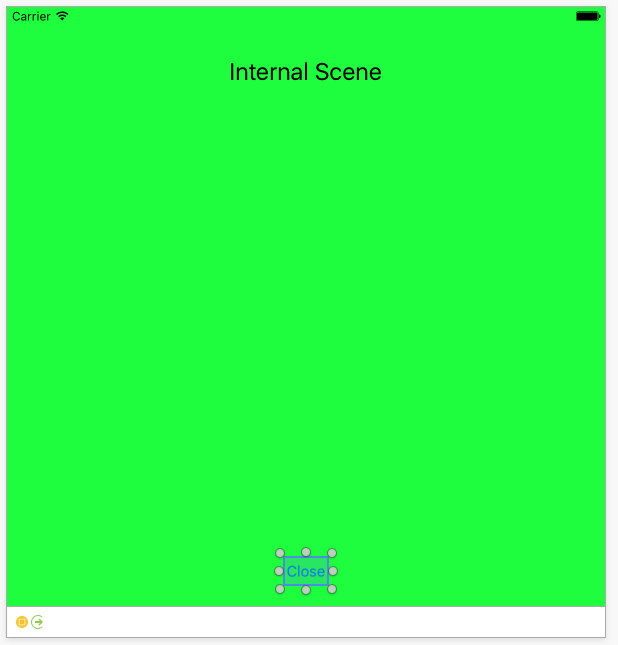](images/ref11.png#lightbox)

3. In the **Widget** tab of the **Properties Explorer**, enter a **Storyboard ID** for the new Scene's View Controller: 

	[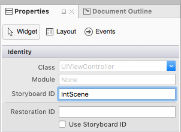](images/ref12.png#lightbox)
	
3. Drag a **Storyboard Reference** from the **Toolbox** onto the Design Surface: 

	[](images/ref03.png#lightbox)
	
5. In the **Widget** tab of the **Properties Explorer**, select **Reference ID** (Storyboard ID) of the Scene that you created above: 

	[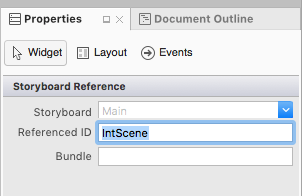](images/ref13.png#lightbox)
	
6. Control-click on a UI Widget (like a Button) on an existing Scene and create a new Segue to the **Storyboard Reference** that you just created: 

	[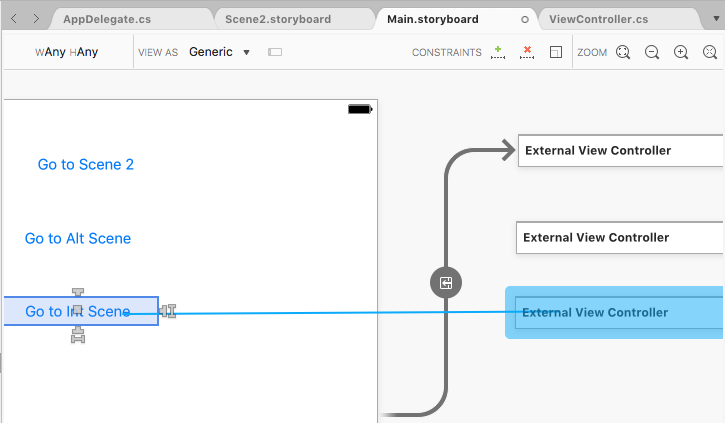](images/ref14.png#lightbox) 
	
7. From the popup menu select **Show** to complete the Segue: 

	[](images/ref06.png#lightbox) 
	
8. Save your changes to the Storyboard.

When the app is run and the user clicks on the UI element that you created the Segue from, the Scene with the given **Storyboard ID** in the same Storyboard specified in the Storyboard Reference will be displayed.

## Summary

This article introduces the concept of Storyboards and how they can be beneficial in the development of iOS applications. It discusses scenes, view controllers, views and view hierarchies and how scenes are linked together with different types of Segues.  It also explores instantiating view controllers manually from a storyboard, and creating conditional Segues.


## Related Links

- [Manual Storyboard (sample)](https://developer.xamarin.com/samples/ManualStoryboard/)
- [Introduction to iOS Designer](~/ios/user-interface/designer/introduction.md)
- [Converting to Storyboards](http://developer.apple.com/library/ios/#releasenotes/Miscellaneous/RN-AdoptingStoryboards/)
- [UIStoryboard Class Reference](https://developer.apple.com/library/ios/#documentation/UIKit/Reference/UIStoryboard_Class/Reference/Reference.html)
