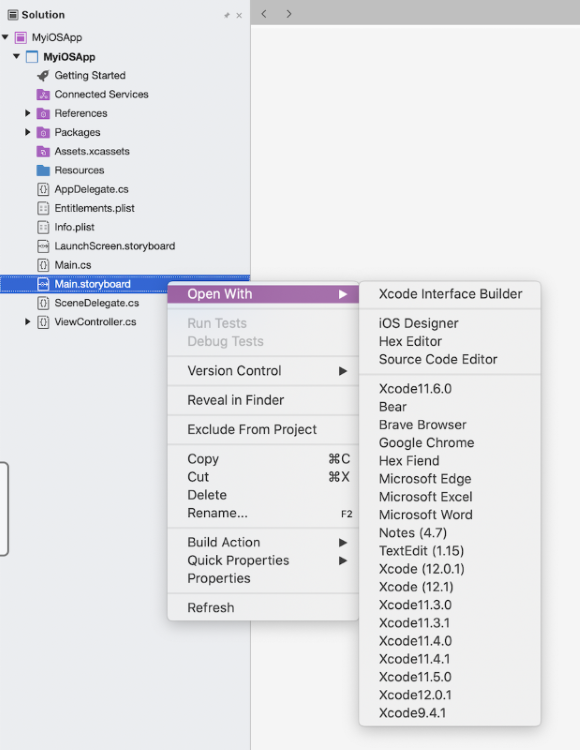
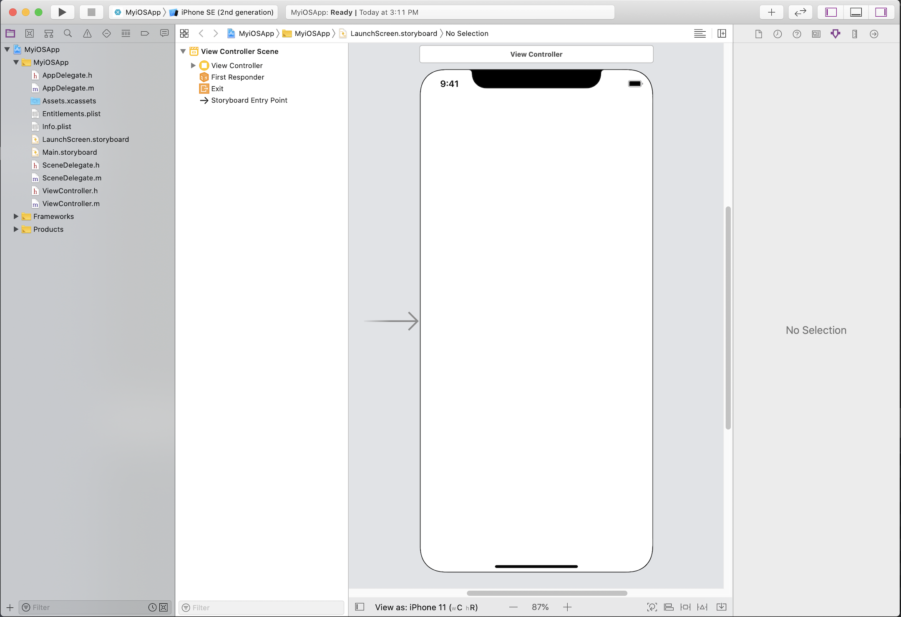
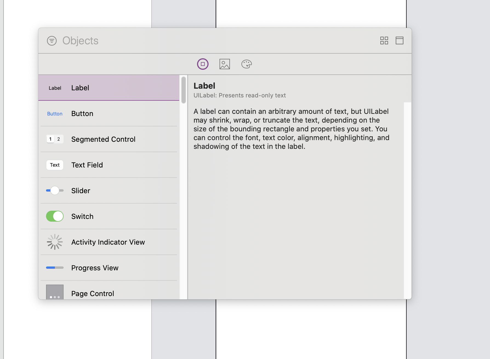
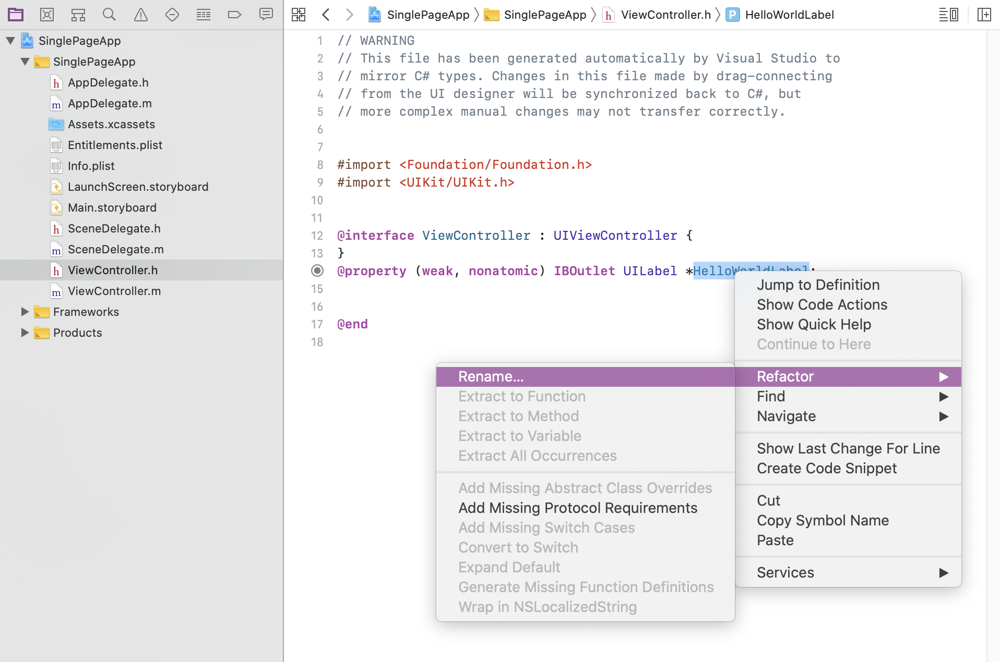
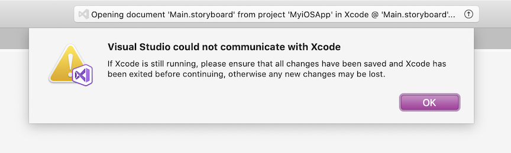

# Designing user interfaces with Xcode

Starting with Visual Studio 2019 version 16.8 and Visual Studio for Mac version 8.8, the recommended way to edit .storyboard and .nib files is by editing them in Xcode Interface Builder on a Mac.

> [!NOTE]
> Starting in Visual Studio 2019 version 16.9, there will be no supported way to edit iOS storyboards on Windows. Use Visual Studio for Mac and the Xcode Interface Builder to continue building your Xamarin.iOS user interfaces.

This article covers common solutions to building user interfaces with the Xcode Interface Builder.  This article may be particularly helpful if you previously edited your UIs with the Xamarin.iOS Designer. 

For a more in-depth walkthrough of storyboards, see [Storyboards in Xamarin.iOS](./indepth-storyboard.md).

## How to open a storyboard 

Open an iOS user interface file in Visual Studio for Mac by right-clicking on a storyboard file and selecting **Xcode Interface Builder**:

[](images/select-interface-builder.png#lightbox)

You should then see the Xcode window open. Any edits saved here will be reflected in your Visual Studio project.

[](images/xcode.png#lightbox)

For more information on the Xcode Interface Builder, see [Interface Builder Built-In](https://developer.apple.com/xcode/interface-builder/).

## Creating a new control

To create a new control with the Xcode Interface Builder, first select the storyboard you'd like to edit. Then, open the Xcode Library dialog (**View** > **Show Library**) and drag the control to your storyboard.

[](images/library-picker.png#lightbox)

Next, open up the corresponding view controller header file.  For a blank "Single View" Xamarin.iOS app, the default storyboard is called **Main.storyboard**. The corresponding view controller file is called **ViewController.cs** in Visual Studio with a corresponding **ViewController.h** header file when viewed from Xcode.

From the Xcode Interface Builder, open both the storyboard and the corresponding view controller header file.  Holding the **Control** key (**^**), drag the control from the storyboard to the view controller file until Xcode prompts you with a dialog box.

[](images/demo-link-control.gif#lightbox)

As illustrated above, the corresponding C# code will be automatically generated in the view controller's code-behind file.  You can now access this control within your Xamarin.iOS project.

## Editing an existing control's name

To edit an existing control's name from the Xcode Interface Builder and reflect that change back into your C# project, navigate to the appropriate view controller header file, right-cick, and select **Refactor**.   

[](images/refactor-control.png#lightbox)

Your code-behind file will regenerate with the new name, allowing you to access the control via code in Visual Studio for Mac.

## Known problems

This section covers known issues.

### "Visual Studio could not communicate with Xcode"

In macOS Catalina or higher, you may encounter the error below:

[](images/could-not-communicate.png#lightbox)

First, in your Mac's system preferences under **Security & Privacy > Automation**, ensure that Visual Studio is listed and **Xcode** is checked.

[](images/macos-security.png#lightbox)

If **Xcode** is checked and the error message still appears, you may need to reset the Visual Studio for Mac privacy permissions.

This can be accomplished by launching a Terminal Window and issuing the following command:

```bash
sudo tccutil reset All "com.microsoft.visual-studio"
```

To ensure the above change takes effect, reset your Mac's PRAM. For instructions, see [Reset NVRAM or PRAM on your Mac](https://support.apple.com/HT204063).
