# Unified Storyboards in Xamarin.iOS

iOS 8 includes a new, simpler-to-use mechanism for creating the user interface — the unified storyboard. With a single storyboard to cover all of the different hardware screen sizes, fast and responsive views can be created in a "design-once, use-many" style.

As the developer no longer needs to create a separate and specific storyboard for iPhone and iPad devices, they have the flexibility to design applications with a common interface and then customize that interface for different size classes. In this way, an application can be adapted to the strengths of each form factor and each user interface can be tuned to provide the best experience.

<a name="size-classes"></a>

## Size Classes

Prior to iOS 8, the developer used `UIInterfaceOrientation` and `UIInterfaceIdiom` to differentiate between portrait and landscape modes, and between iPhone and iPad devices. In iOS8, orientation and device is determined is by using *Size Classes*.

Devices are defined by Size Classes, in both vertical and horizontal axes, and there are two types of size classes in iOS 8:

- **Regular** – This is for either a large screen size (such as an iPad) or a gadget that gives the impression of a large size (such as a `UIScrollView`
- **Compact** – This is for smaller devices (such as an iPhone). This size takes into account the orientation of the device.

If the two concepts are used together, the result is a 2 x 2 grid that defines the different possible sizes that can be used in both the differing orientations, as seen in the following diagram:

 [](unified-storyboards-images/sizeclassgrid.png#lightbox)

The developer can create a View Controller that uses any of the four possibilities that would result in different layouts (as seen in the graphics above).

### iPad Size Classes

The iPad, due to the size, has a **regular** class size for both orientations.

 [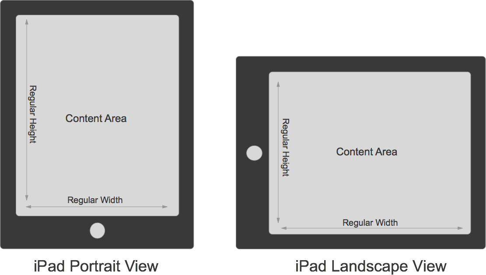](unified-storyboards-images/image1.png#lightbox)

### iPhone Size Classes

The iPhone has different size classes based on the orientation of the device:

 [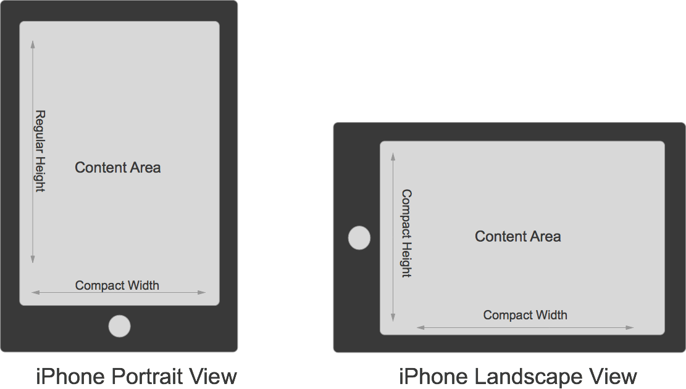](unified-storyboards-images/iphonesizeclasses.png#lightbox)

- When the device is in portrait mode, the screen has a **compact** class horizontally and **regular** vertically
- When the device is in landscape mode, the screen classes are reversed from portrait mode.

### iPhone 6 Plus Size Classes

The sizes are the same as the earlier iPhones when in portrait orientation, but different in landscape:

[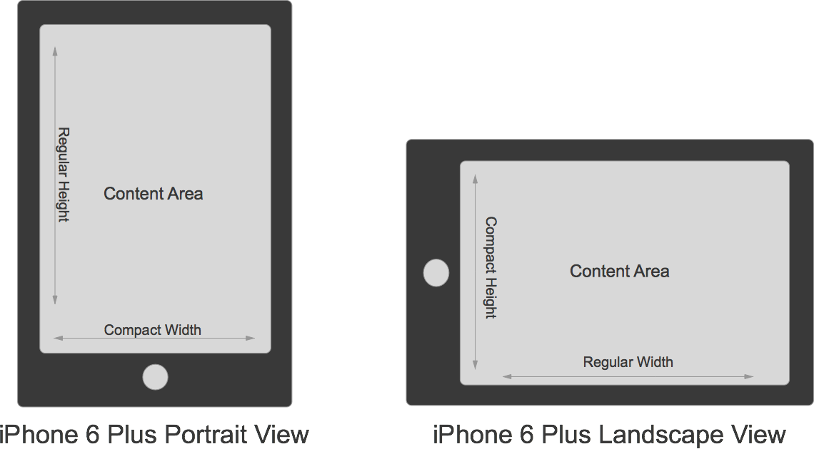](unified-storyboards-images/iphone6sizeclasses.png#lightbox)

Because the iPhone 6 Plus has a large enough screen, it is able to have a Regular Width Size Class in the Landscape mode.

### Support for a New Screen Scale

The iPhone 6 Plus uses a new Retina HD display with a screen scale factor of 3.0 (three times the original iPhone screen resolution). To provide the best possible experience on these devices, include new artwork designed for this screen scale. In Xcode 6 and above, asset catalogs can include images at 1x, 2x, and 3x sizes; simply add the new image assets and iOS will choose the correct assets when running on an iPhone 6 Plus.

The image loading behavior in iOS also recognizes an `@3x` suffix on image files. For example, if the developer includes an image asset (at different resolutions) in the application's bundle with the following file names: `MonkeyIcon.png`, `MonkeyIcon@2x.png`, and `MonkeyIcon@3x.png`. On the iPhone 6 Plus the `MonkeyIcon@3x.png` image will be used automatically if the developer loads an image using the following code:

```csharp
UIImage icon = UIImage.FromFile("MonkeyImage.png");
```

<a name="dynamic-launch-screens"></a>

### Dynamic Launch Screens

The launch screen file is displayed as a splash screen while an iOS application is launching to provide feedback to the user that the app is actually starting-up. Prior to iOS 8, the developer would have to include multiple `Default.png` image assets for each device type, orientation and screen resolution that the application would be running on.

New to iOS 8, the developer can create a single, atomic `.xib` file in Xcode that uses Auto Layout and Size Classes to create a *Dynamic Launch Screen* that will work for every device, resolution and orientation. This not only reduces the amount of work required of the developer to create and maintain all the required image assets, but it reduces the size of the application's installed bundle.

## Traits

Traits are properties that can be used to determine how a layout changes as its environment changes. They consist of a set of properties (the `HorizontalSizeClass` and `VerticalSizeClass` based on `UIUserInterfaceSizeClass`), as well as the interface idiom ( `UIUserInterfaceIdiom`) and the display scale.

All of the above states are wrapped up in a container that Apple refers to as a Trait Collection ( `UITraitCollection`), which contains not only the properties but their values as well.

## Trait Environment

Trait Environments are a new interface in iOS 8 and are able to return  a Trait Collection for the following objects:

- Screens ( `UIScreens` ).
- Windows ( `UIWindows` ).
- View Controllers ( `UIViewController` ).
- Views ( `UIView` ).
- Presentation Controller ( `UIPresentationController` ).

The developer uses the Trait Collection returned by a Trait Environment to determine how a user interface should be laid out.

All of the Trait Environments make a hierarchy as seen in the following diagram:

 [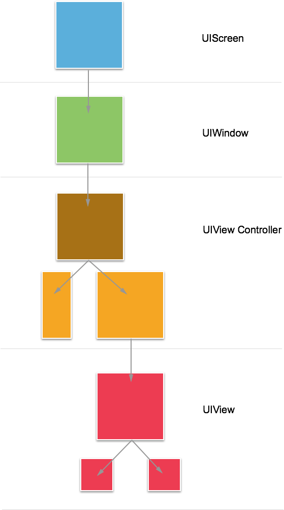](unified-storyboards-images/viewhierarchy.png#lightbox)

The Trait Collection that each of the above Trait Environments have will flow, by default, from the parent to the child environment.

In addition to getting the current Trait Collection, the Trait Environment has a `TraitCollectionDidChange` method, which can be overridden in the View or View Controller subclasses. The developer can use this method to modify any of the UI elements that depend on traits when those traits have changed.

## Typical Trait Collections

This section will cover the typical types of trait collections that the user will experience when working with iOS 8.

The following is a typical Trait Collection that the developer might see on an iPhone:

|Property|Value|
|--- |--- |
|`HorizontalSizeClass`|Compact|
|`VerticalSizeClass`|Regular|
|`UserInterfaceIdom`|Phone|
|`DisplayScale`|2.0|

The above set would represent a Fully Qualified Trait Collection, as it has values for all of its trait properties.

It is also possible to have a Trait Collection that is missing some of its values (which Apple refers to as *Unspecified*):

|Property|Value|
|--- |--- |
|`HorizontalSizeClass`|Compact|
|`VerticalSizeClass`|Unspecified|
|`UserInterfaceIdom`|Unspecified|
|`DisplayScale`|Unspecified|

Generally, however, when the developer asks the Trait Environment for its Trait Collection, it will return a fully qualified collection as seen in the example above.

If a Trait Environment (like a View or View Controller) is not inside of the current view hierarchy, the developer might get back unspecified values for one or more of the trait properties.

The developer will also get a partially qualified Trait Collection if they use one of the creation methods provided by Apple, such as `UITraitCollection.FromHorizontalSizeClass`, to create a new collection.

One operation that can be performed on multiple Trait Collections is comparing them to each other, which involves asking one Trait Collection if it contains another one. What is meant by *Containment* is that, for any trait specified in the second collection, the value must match exactly with the value in the first collection.

To test two traits use the `Contains` method of the `UITraitCollection` passing in the value of the trait to be tested.

The developer can perform the comparisons manually in code to determine how to layout Views or View Controllers. However, `UIKit` uses this method internally to provide some of its functionality, as in the Appearance Proxy, for example.

## Appearance Proxy

The Appearance Proxy was introduced in earlier versions of iOS to allow developers to customize the properties of their Views. It has been extended in iOS 8 to support Trait Collections.

Appearance Proxies now include a new method, `AppearanceForTraitCollection`, that returns a new Appearance Proxy for the given Trait Collection that has been passed in. Any customizations that the developer performs on that Appearance Proxy will only take effect on Views that conform to the specified Trait Collection.

Generally the developer will pass in a partially specified Trait Collection to the `AppearanceForTraitCollection` method, such as one that just specified a Horizontal Size Class of Compact, so that they could customize any view in the application that is compact horizontally.

## UIImage

Another class that Apple has added Trait Collection to is `UIImage`. In the past the developer had to specify a @1X and @2x version of any bitmapped graphic asset that they were going to include in the application (such as an icon).

iOS 8 has been expanded to allow the developer to include multiple version of an image in an Image Catalog based on a Trait Collection. For example, the developer could include a smaller image for working with a Compact Trait Class and a full sized image for any other collection.

When one of the images is used inside of a `UIImageView` class, the Image View will automatically display the correct version of the image for its Trait Collection. If the Trait Environment changes (such as the user switching the device from portrait to landscape), the Image View will automatically select the new image size to match the new Trait Collection and change its size to match that of the current version of the image being displayed.

## UIImageAsset

Apple has added a new class to iOS 8 called `UIImageAsset` to give the developer even more control over image selection.

An Image Asset wraps up all of the different versions of an image and allows the developer to ask for a specific image that matches a Trait Collection that has been passed in. Images can be added or removed from an Image Asset, on-the-fly.

For more information on Image Assets, see Apple's [UIImageAsset](https://developer.apple.com/library/prerelease/ios/documentation/UIKit/Reference/UIImageAsset_Ref/index.html#//apple_ref/occ/cl/UIImageAsset) documentation.

## Combining Trait Collections

Another function that a developer can perform on Trait Collections is to add two together that will result in the combined collection, where the unspecified values from one collection are replaced by the specified values in a second one. This is done using the `FromTraitsFromCollections` method of the `UITraitCollection` class.

As stated above, if any of the traits is unspecified in one of the Trait Collections and is specified in another, the value will be set to the specified version. However, if there are multiple versions of a given value specified, the value from the last Trait Collection will be the value that is used.

## Adaptive View Controllers

This section will cover the details of how the iOS View and View Controllers have adopted the concepts of Traits and Size Classes to automatically be more adaptive in the developer's applications.

### Split View Controller

One of the View Controller classes that has changed the most in iOS 8 is the `UISplitViewController` class. In the past, the developer would often use a Split View Controller on the iPad version of the application and then they would have to provide a completely different version of their view hierarchy for the iPhone version of the app.

In iOS 8, the `UISplitViewController` class is available on both platforms (iPad and iPhone), which allows the developer to create one View Controller hierarchy that will function for both iPhone and iPad.

When an iPhone is in Landscape, the Split View Controller will present its Views side-by-side, just as it would when being displayed on an iPad.

### Overriding Traits

Trait Environments cascade from the parent container down to the child containers, as in the following graphic showing a Split View Controller on an iPad in the landscape orientation:

 [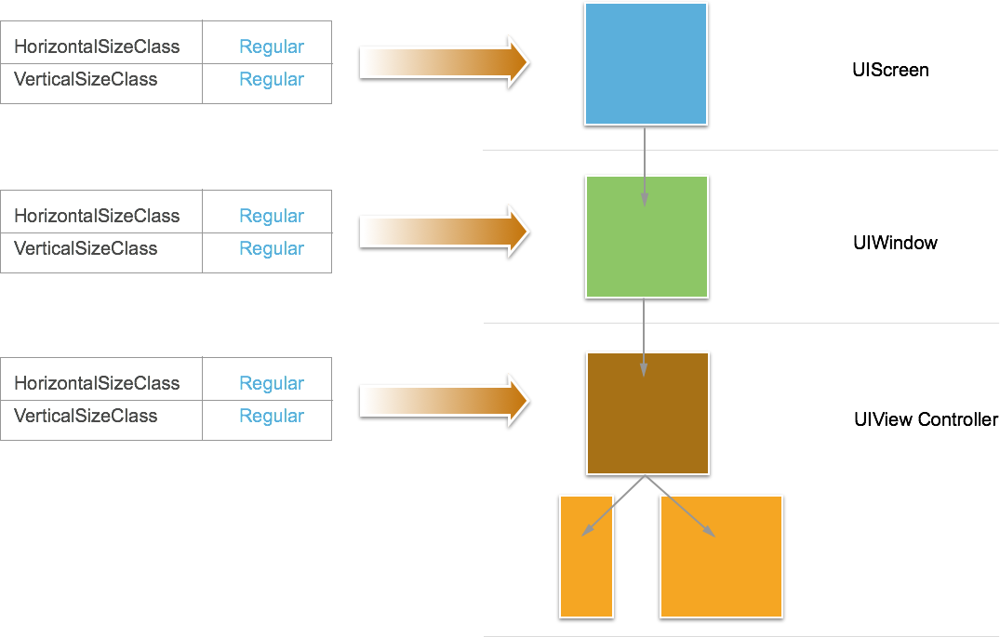](unified-storyboards-images/cascadingclasses01.png#lightbox)

Since the iPad has a Regular Size Class in both the horizontal and vertical orientations, the Split View will display both the master and detail views.

On an iPhone, where the Size Class is compact in both orientations, the Split View Controller only displays the detail view, as seen below:

 [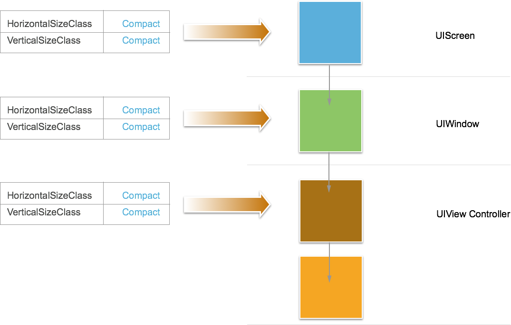](unified-storyboards-images/cascadingclasses02.png#lightbox)

In an application where the developer wants to display both the master and detail view on an iPhone in the landscape orientation, the developer must insert a parent container for the Split View Controller and override the Trait Collection. As seen in the graphic below:

 [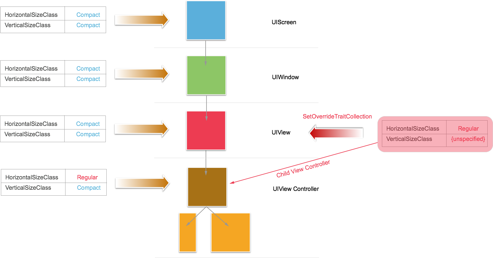](unified-storyboards-images/cascadingclasses03.png#lightbox)

A `UIView` is set as the parent of the Split View Controller and the `SetOverrideTraitCollection` method is called on the view passing in a new Trait Collection and targeting the Split View Controller. The new Trait Collection overrides the `HorizontalSizeClass`, setting it to `Regular`, so that the Split View Controller will display both the master and detail views on an iPhone in the landscape orientation.

Note that the `VerticalSizeClass` was set to `unspecified`, which allows the new Trait Collection to be added to the Trait Collection on the parent, resulting in a `Compact VerticalSizeClass` for the child Split View Controller.

### Trait Changes

This section will take a look, in detail, at how the Trait Collections transition when the Trait Environment changes. For example, when the device is rotated from portrait to landscape.

 [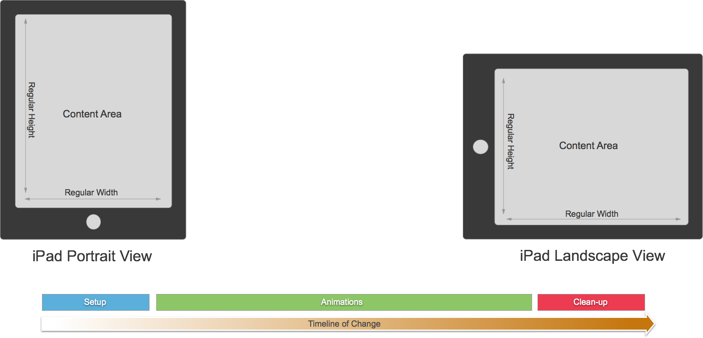](unified-storyboards-images/traittransitions01.png#lightbox)

First, iOS 8 does some setup to prepare for the transition to take place. Next, the system animates the transition state. Finally, iOS 8 cleans-up any temporary states required during the transition.

iOS 8 provides several callbacks that the developer can use to participate in the Trait Change as seen in the following table:

|Phase|Callback|Description|
|--- |--- |--- |
|Setup|<ul><li>`WillTransitionToTraitCollection`</li><li>`TraitCollectionDidChange`</li></ul>|<ul><li>This method gets called at the beginning of a Trait Change before a Trait Collection gets set to its new value.</li><li>The method gets called when the value of the Trait Collection has changed but before any animation takes place.</li></ul>|
|Animation|`WillTransitionToTraitCollection`|The Transition Coordinator that gets passed to this method has an `AnimateAlongside` property that allows the developer to add animations that will be executed along with the default animations.|
|Clean-up|`WillTransitionToTraitCollection`|Provides a method for developers to include their own cleanup code after the transition takes place.|

The `WillTransitionToTraitCollection` method is great for animating View Controllers along with the Trait Collection changes. The `WillTransitionToTraitCollection` method is only available on View Controllers ( `UIViewController`) and not on other Trait Environments, like `UIViews`.

The `TraitCollectionDidChange` is great for working with the `UIView` class, where the developer wants to update the UI as the traits are changing.

### Collapsing the Split View Controllers

Now let's take a closer look at what happens when a Split View Controller collapses from a two column to a one column view. As part of this change, there are two processes that need to occur:

- By default, the Split View Controller will use the primary view controller as the view after the collapse occurs. The developer can override this behavior by overriding the  `GetPrimaryViewControllerForCollapsingSplitViewController` method of the  `UISplitViewControllerDelegate` and providing any View Controller that they want to display in the collapsed state.
- The Secondary View Controller has to get merged into the Primary View Controller. Generally the developer will not need to take any action for this step; the Split View Controller includes automatic handling of this phase based on the hardware device. However, there may be some special cases where the developer will want to interact with this change. Calling the  `CollapseSecondViewController` method of the  `UISplitViewControllerDelegate` allows the master view controller to be displayed when the collapse occurs, instead of the details view.

### Expanding the Split View Controller

Now let's take a closer look at what happens when a Split View Controller is expanded from a collapsed state. Once again, there are two stages that need to occur:

- First, define the new Primary View Controller. By default, the Split View Controller will automatically use the Primary View Controller from the collapsed view. Again, the developer can override this behavior using the  `GetPrimaryViewControllerForExpandingSplitViewController` method of the  `UISplitViewControllerDelegate` .
- Once the Primary View Controller has been chosen, the Secondary View Controller must be recreated. Again, the Split View Controller includes automatic handling of this phase based on the hardware device. The developer can override this behavior by calling the  `SeparateSecondaryViewController` method of the  `UISplitViewControllerDelegate` .

In a Split View Controller, the Primary View Controller plays a part in both the expanding and collapsing of the views by implementing the `CollapseSecondViewController` and `SeparateSecondaryViewController` methods of the `UISplitViewControllerDelegate`. `UINavigationController` implements these methods to automatically push and pop the Secondary View controller.

### Showing View Controllers

Another change that Apple has made to iOS 8 is in the way that the developer shows View Controllers. In the past, if the application had a Leaf View Controller (such as a Table View Controller), and the developer showed a different one (for example, in response to the user tapping on a cell), the application would reach back through the controller hierarchy to the Navigation View Controller and call the `PushViewController` method against it to display the new view.

This presented a very tight coupling between the Navigation Controller and the environment that it was running in. In iOS 8, Apple has decoupled this by providing two new methods:

- `ShowViewController` – Adapts to display the new view controller based on its environment. For example, in a  `UINavigationController` it simply pushes the new view onto the stack. In a Split View Controller, the new View Controller will be presented on the left side as the new Primary View Controller. If no container view controller is present, the new view will be displayed as a Modal View Controller.
- `ShowDetailViewController` – Works in a similar fashion to  `ShowViewController`, but is implemented on a Split View Controller to replace the details view with the new View Controller being passed in. If the Split View Controller is collapsed (as might be seen in an iPhone Application), the call will be redirected to the  `ShowViewController` method, and the new view will be shown as the Primary View Controller. Again, if no container view controller is present, the new view will be displayed as a Modal View Controller.

These methods work by starting at the Leaf View Controller and walk up the view hierarchy until they find the right container view controller to handle the display of the new view.

Developers can implement `ShowViewController` and `ShowDetailViewController` in their own custom View Controllers to get the same automated functionality that `UINavigationController` and `UISplitViewController` provides.

### How it works

In this section we will take a look at how these methods are actually implemented in iOS 8. First let’s look at the new `GetTargetForAction` method:

 [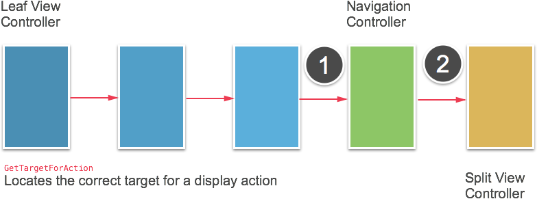](unified-storyboards-images/gettargetforaction.png#lightbox)

This method walks the hierarchy chain until the correct container view controller is found. For example:

1. If a  `ShowViewController` method is called, the first View Controller in the chain that implements this method is the Navigation Controller, so it is used as the parent of the new view.
1. If a  `ShowDetailViewController` method was called instead, the Split View Controller is the first View Controller to implement it, so it is used as the parent.

The `GetTargetForAction` method works by locating a View Controller that implements a given Action and then asking that View Controller if it wants to receive that action. Since this method is public, developers can create their own custom methods that function just like the built in `ShowViewController` and `ShowDetailViewController` methods.

## Adaptive Presentation

In iOS 8, Apple has made Popover Presentations ( `UIPopoverPresentationController`) adaptive as well. So a Popover Presentation View Controller will automatically present a normal Popover View in a Regular Size Class, but will display it full screen in a horizontally compact Size Class (such as on an iPhone).

To accommodate the changes within the unified storyboard system, a new controller object has been created to manage the presented View Controllers — `UIPresentationController`. This controller is created from the time the View Controller is presented until it is dismissed. As it is a managing class, it can be considered a super class over the View Controller as it responds to device changes that affect the View Controller (such as orientation) which are then fed back into the View Controller the Presentation Controller controls.

When the developer presents a View Controller using the `PresentViewController` method, the management of the presentation process is handed to `UIKit`. UIKit handles (among other things) the correct controller for the style being created, with the only exception being when a View Controller has the style set to `UIModalPresentationCustom`. Here, the application can provide it’s own PresentationController rather than using the `UIKit` controller.

### Custom Presentation Styles

With a custom presentation style, developers have the option to use a custom Presentation Controller. This custom controller can be used to modify the appearance and behavior of the View it is allied to.

<a name="size-classes"></a>

## Working with Size Classes

The Adaptive Photos Xamarin Project that is included with this article gives a working example of using Size Classes and Adaptive View Controllers in an iOS 8 Unified Interface application.

While the application creates its UI completely from code, as opposed to creating a Unified Storyboard using Xcode's Interface Builder, the same techniques apply. 

Now let’s take a closer look at how the Adaptive Photos project is implementing several of the Size Class features in iOS 8 to create a Adaptive Application.

### Adapting to Trait Environment Changes

When running the Adaptive Photos application on an iPhone, when the user rotates the device from portrait to landscape, the Split View Controller will display both the master and details view:

 [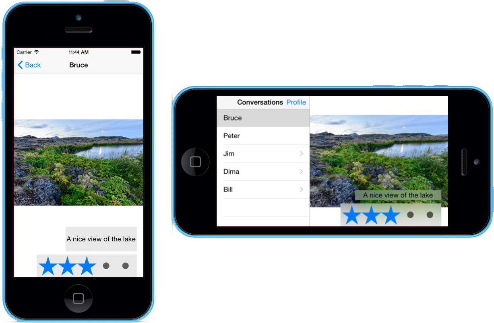](unified-storyboards-images/rotation.png#lightbox)

This is accomplished by overriding the `UpdateConstraintsForTraitCollection` method of the View Controller and adjusting the constraints based on the value of the `VerticalSizeClass`. For example:

```csharp
public void UpdateConstraintsForTraitCollection (UITraitCollection collection)
{
    var views = NSDictionary.FromObjectsAndKeys (
        new object[] { TopLayoutGuide, ImageView, NameLabel, ConversationsLabel, PhotosLabel },
        new object[] { "topLayoutGuide", "imageView", "nameLabel", "conversationsLabel", "photosLabel" }
    );

    var newConstraints = new List<NSLayoutConstraint> ();
    if (collection.VerticalSizeClass == UIUserInterfaceSizeClass.Compact) {
        newConstraints.AddRange (NSLayoutConstraint.FromVisualFormat ("|[imageView]-[nameLabel]-|",
            NSLayoutFormatOptions.DirectionLeadingToTrailing, null, views));

        newConstraints.AddRange (NSLayoutConstraint.FromVisualFormat ("[imageView]-[conversationsLabel]-|",
            NSLayoutFormatOptions.DirectionLeadingToTrailing, null, views));

        newConstraints.AddRange (NSLayoutConstraint.FromVisualFormat ("[imageView]-[photosLabel]-|",
            NSLayoutFormatOptions.DirectionLeadingToTrailing, null, views));

        newConstraints.AddRange (NSLayoutConstraint.FromVisualFormat ("V:|[topLayoutGuide]-[nameLabel]-[conversationsLabel]-[photosLabel]",
            NSLayoutFormatOptions.DirectionLeadingToTrailing, null, views));

        newConstraints.AddRange (NSLayoutConstraint.FromVisualFormat ("V:|[topLayoutGuide][imageView]|",
            NSLayoutFormatOptions.DirectionLeadingToTrailing, null, views));

        newConstraints.Add (NSLayoutConstraint.Create (ImageView, NSLayoutAttribute.Width, NSLayoutRelation.Equal,
            View, NSLayoutAttribute.Width, 0.5f, 0.0f));
    } else {
        newConstraints.AddRange (NSLayoutConstraint.FromVisualFormat ("|[imageView]|",
            NSLayoutFormatOptions.DirectionLeadingToTrailing, null, views));

        newConstraints.AddRange (NSLayoutConstraint.FromVisualFormat ("|-[nameLabel]-|",
            NSLayoutFormatOptions.DirectionLeadingToTrailing, null, views));

        newConstraints.AddRange (NSLayoutConstraint.FromVisualFormat ("|-[conversationsLabel]-|",
            NSLayoutFormatOptions.DirectionLeadingToTrailing, null, views));

        newConstraints.AddRange (NSLayoutConstraint.FromVisualFormat ("|-[photosLabel]-|",
            NSLayoutFormatOptions.DirectionLeadingToTrailing, null, views));

        newConstraints.AddRange (NSLayoutConstraint.FromVisualFormat ("V:[topLayoutGuide]-[nameLabel]-[conversationsLabel]-[photosLabel]-20-[imageView]|",
            NSLayoutFormatOptions.DirectionLeadingToTrailing, null, views));
    }

    if (constraints != null)
        View.RemoveConstraints (constraints.ToArray ());

    constraints = newConstraints;
    View.AddConstraints (constraints.ToArray ());
}
```

### Adding Transition Animations

When the Split View Controller in the Adaptive Photos application goes from collapsed to expanded, animations are added to the default animations by overriding the `WillTransitionToTraitCollection` method of the view controller. For example:

```csharp
public override void WillTransitionToTraitCollection (UITraitCollection traitCollection, IUIViewControllerTransitionCoordinator coordinator)
{
    base.WillTransitionToTraitCollection (traitCollection, coordinator);
    coordinator.AnimateAlongsideTransition ((UIViewControllerTransitionCoordinatorContext) => {
        UpdateConstraintsForTraitCollection (traitCollection);
        View.SetNeedsLayout ();
    }, (UIViewControllerTransitionCoordinatorContext) => {
    });
}
```

### Overriding the Trait Environment

As show above, the Adaptive Photos application forces the Split View Controller to display both the details and the master views when the iPhone device is in the landscape view.

This was accomplished by using the following code in the View Controller:

```csharp
private UITraitCollection forcedTraitCollection = new UITraitCollection ();
...

public UITraitCollection ForcedTraitCollection {
    get {
        return forcedTraitCollection;
    }

    set {
        if (value != forcedTraitCollection) {
            forcedTraitCollection = value;
            UpdateForcedTraitCollection ();
        }
    }
}
...

public override void ViewWillTransitionToSize (SizeF toSize, IUIViewControllerTransitionCoordinator coordinator)
{
    ForcedTraitCollection = toSize.Width > 320.0f ?
         UITraitCollection.FromHorizontalSizeClass (UIUserInterfaceSizeClass.Regular) :
         new UITraitCollection ();

    base.ViewWillTransitionToSize (toSize, coordinator);
}

public void UpdateForcedTraitCollection ()
{
    SetOverrideTraitCollection (forcedTraitCollection, viewController);
}
```

### Expanding and Collapsing the Split View Controller

Next let’s examine how the expanding and collapsing behavior of the Split View Controller was implemented in Xamarin. In the `AppDelegate`, when the Split View Controller is created, its delegate is assigned to handle these changes:

```csharp
public class SplitViewControllerDelegate : UISplitViewControllerDelegate
{
    public override bool CollapseSecondViewController (UISplitViewController splitViewController,
        UIViewController secondaryViewController, UIViewController primaryViewController)
    {
        AAPLPhoto photo = ((CustomViewController)secondaryViewController).Aapl_containedPhoto (null);
        if (photo == null) {
            return true;
        }

        if (primaryViewController.GetType () == typeof(CustomNavigationController)) {
            var viewControllers = new List<UIViewController> ();
            foreach (var controller in ((UINavigationController)primaryViewController).ViewControllers) {
                var type = controller.GetType ();
                MethodInfo method = type.GetMethod ("Aapl_containsPhoto");

                if ((bool)method.Invoke (controller, new object[] { null })) {
                    viewControllers.Add (controller);
                }
            }

            ((UINavigationController)primaryViewController).ViewControllers = viewControllers.ToArray<UIViewController> ();
        }

        return false;
    }

    public override UIViewController SeparateSecondaryViewController (UISplitViewController splitViewController,
        UIViewController primaryViewController)
    {
        if (primaryViewController.GetType () == typeof(CustomNavigationController)) {
            foreach (var controller in ((CustomNavigationController)primaryViewController).ViewControllers) {
                var type = controller.GetType ();
                MethodInfo method = type.GetMethod ("Aapl_containedPhoto");

                if (method.Invoke (controller, new object[] { null }) != null) {
                    return null;
                }
            }
        }

        return new AAPLEmptyViewController ();
    }
}
```

The `SeparateSecondaryViewController`  method tests to see if a photo is being displayed and takes action based on that state. If no photo is being shown it collapses the Secondary View Controller so that the Master View Controller is displayed.

The `CollapseSecondViewController` method is used when expanding the Split View Controller to see if any photos exist on the stack, if so it collapses back to that view.

### Moving Between View Controllers

Next, let’s take a look at how the Adaptive Photos application moves between view controllers. In the `AAPLConversationViewController` class when the user selects a cell from the table, the `ShowDetailViewController` method is called to display the details view:

```csharp
public override void RowSelected (UITableView tableView, NSIndexPath indexPath)
{
    var photo = PhotoForIndexPath (indexPath);
    var controller = new AAPLPhotoViewController ();
    controller.Photo = photo;

    int photoNumber = indexPath.Row + 1;
    int photoCount = (int)Conversation.Photos.Count;
    controller.Title = string.Format ("{0} of {1}", photoNumber, photoCount);
    ShowDetailViewController (controller, this);
}
```

### Displaying Disclosure Indicators

In the Adaptive Photo application there are several places where Disclosure Indicators are hidden or shown based on changes to the Trait Environment. This is handled with the following code:

```csharp
public bool Aapl_willShowingViewControllerPushWithSender ()
{
    var selector = new Selector ("Aapl_willShowingViewControllerPushWithSender");
    var target = this.GetTargetViewControllerForAction (selector, this);

    if (target != null) {
        var type = target.GetType ();
        MethodInfo method = type.GetMethod ("Aapl_willShowingDetailViewControllerPushWithSender");
        return (bool)method.Invoke (target, new object[] { });
    } else {
        return false;
    }
}

public bool Aapl_willShowingDetailViewControllerPushWithSender ()
{
    var selector = new Selector ("Aapl_willShowingDetailViewControllerPushWithSender");
    var target = this.GetTargetViewControllerForAction (selector, this);

    if (target != null) {
        var type = target.GetType ();
        MethodInfo method = type.GetMethod ("Aapl_willShowingDetailViewControllerPushWithSender");
        return (bool)method.Invoke (target, new object[] { });
    } else {
        return false;
    }
}
```

These are implemented using the `GetTargetViewControllerForAction` method discussed in detail above.

When a Table View Controller is displaying data, it uses the methods implemented above to see whether or not a push is going to happen, and whether or not  to display or hide the Disclosure Indicator accordingly:

```csharp
public override void WillDisplay (UITableView tableView, UITableViewCell cell, NSIndexPath indexPath)
{
    bool pushes = ShouldShowConversationViewForIndexPath (indexPath) ?
         Aapl_willShowingViewControllerPushWithSender () :
         Aapl_willShowingDetailViewControllerPushWithSender ();

    cell.Accessory = pushes ? UITableViewCellAccessory.DisclosureIndicator : UITableViewCellAccessory.None;
    var conversation = ConversationForIndexPath (indexPath);
    cell.TextLabel.Text = conversation.Name;
}
```

### New `ShowDetailTargetDidChangeNotification` Type

Apple has added a new notification type for working with Size Classes and Trait Environments from within a Split View Controller, `ShowDetailTargetDidChangeNotification`. This notification gets sent whenever the target Detail View for a Split View Controller changes, such as when the controller expands or collapses.

The Adaptive Photos application uses this notification to update the state of the Disclosure Indicator when the Detail View Controller changes:

```csharp
public override void ViewDidLoad ()
{
    base.ViewDidLoad ();
    TableView.RegisterClassForCellReuse (typeof(UITableViewCell), AAPLListTableViewControllerCellIdentifier);
    NSNotificationCenter.DefaultCenter.AddObserver (this, new Selector ("showDetailTargetDidChange:"),
        UIViewController.ShowDetailTargetDidChangeNotification, null);
    ClearsSelectionOnViewWillAppear = false;
}
```

Take a closer look at the Adaptive Photos application to see all of the ways that Size Classes, Trait Collections and Adaptive View Controllers can be used to easily create a Unified Application in Xamarin.iOS.

## Unified Storyboards

New to iOS 8, Unified Storyboards allow the developer to create one, unified storyboard file that can be displayed on both iPhone and iPad devices by targeting multiple Size Classes. By using Unified Storyboards, the developer writes less UI specific code and has only one interface design to create and maintain.

The key benefits of Unified Storyboards are:

- Use the same storyboard file for iPhone and iPad.
- Deploy backwards to iOS 6 and iOS 7.
- Preview the layout for different devices, orientations and OS versions .

<a name="enabling-size-classes"></a>

### Enabling Size Classes

By default, any new Xamarin.iOS project will use size classes. To use Size Classes and Adaptive Segues inside a storyboard from an older project, it must first be converted to the Xcode 6 Unified Storyboard format and the Use Size Classes checkbox is selected within the Xcode File Inspector for your storyboards.

## Dynamic Launch Screens

The launch screen file is displayed as a splash screen while an iOS application is launching to provide feedback to the user that the app is actually starting-up. Prior to iOS 8, the developer would have to include multiple `Default.png` image assets for each device type, orientation and screen resolution that the application would be running on. For example, `Default@2x.png`, `Default-Landscape@2x~ipad.png`, `Default-Portrait@2x~ipad.png`, etc.

Factoring in the new iPhone 6 and iPhone 6 Plus devices (and the upcoming Apple Watch) with all the existing iPhone and iPad devices, this represents a large array of varying sizes, orientations and resolutions of `Default.png` startup screen image assets that must be created and maintained. In addition, these files can be quite large and will "bloat" the deliverable application bundle, increasing the amount of time required to download the application from the iTunes App Store (possibly keeping it from being able to be delivered over a cellular network) and increasing the amount of storage required on the end user's device.

New to iOS 8, the developer can create a single, atomic `.xib` file in Xcode that uses Auto Layout and Size Classes to create a *Dynamic Launch Screen* that will work for every device, resolution and orientation. This not only reduces the amount of work required of the developer to create and maintain all the required image assets, but it greatly reduces the size of the application's installed bundle.

Dynamic Launch Screens have the following limitations and considerations:

- Use only `UIKit` classes.
- Use a single root view that is a `UIView` or `UIViewController` object.
- Don’t make any connections to the application's code (don’t add **Actions** or **Outlets**).
- Don’t add `UIWebView` objects.
- Don’t use any custom classes.
- Don’t use runtime attributes.

With the above guidelines in mind, let's look at adding a Dynamic Launch Screen to an existing Xamarin iOS 8 project.

Do the following:

1. Open **Visual Studio for Mac** and load the **Solution** to add the Dynamic Launch Screen to.
2. In the **Solution Explorer**, right-click the `MainStoryboard.storyboard` file and select **Open With** > **Xcode Interface Builder**:

    [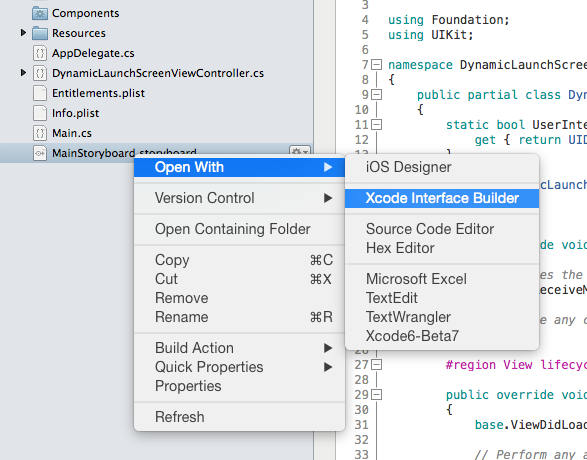](unified-storyboards-images/dls01.png#lightbox)
3. In Xcode, select **File** > **New** > **File...**:

    [](unified-storyboards-images/dls02.png#lightbox)
4. Select **iOS** > **User Interface** > **Launch Screen** and click the **Next** button:

    [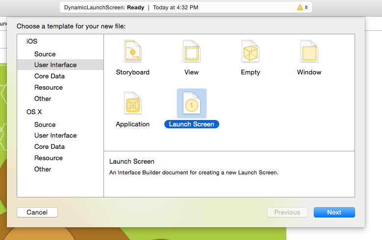](unified-storyboards-images/dls03.png#lightbox)
5. Name the file `LaunchScreen.xib` and click the **Create** button:

    [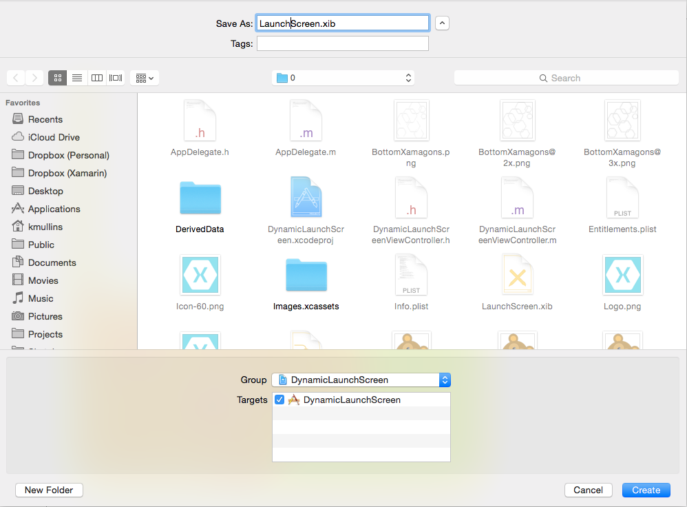](unified-storyboards-images/dls04.png#lightbox)
6. Edit the design of the launch screen by adding graphic elements and using Layout Constraints to position them for the given devices, orientations and screen sizes:

    [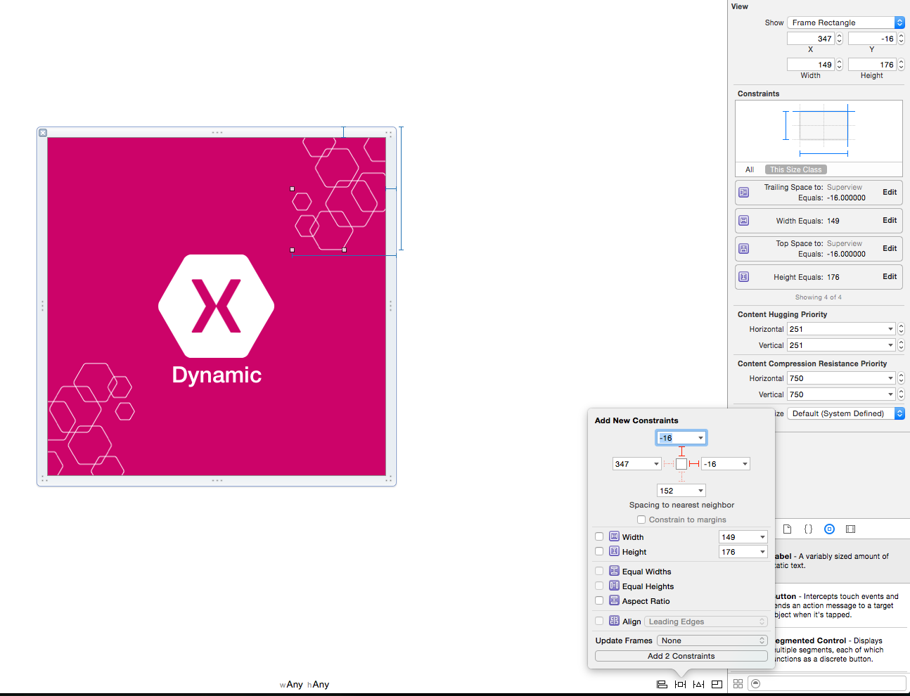](unified-storyboards-images/dls05.png#lightbox)
7. Save the changes to `LaunchScreen.xib`.
8. Select the **Applications Target** and the **General** tab:

    [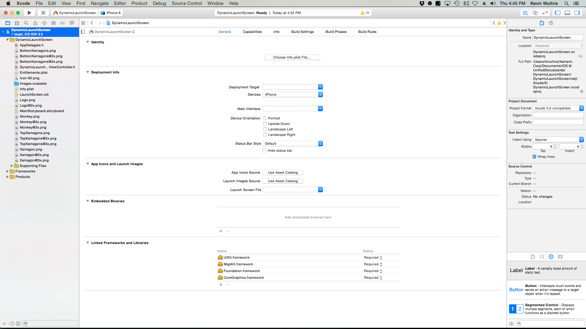](unified-storyboards-images/dls06.png#lightbox)
9. Click the **Choose Info.plist** button, select the `Info.plist` for the Xamarin app and click the **Choose** button:

    [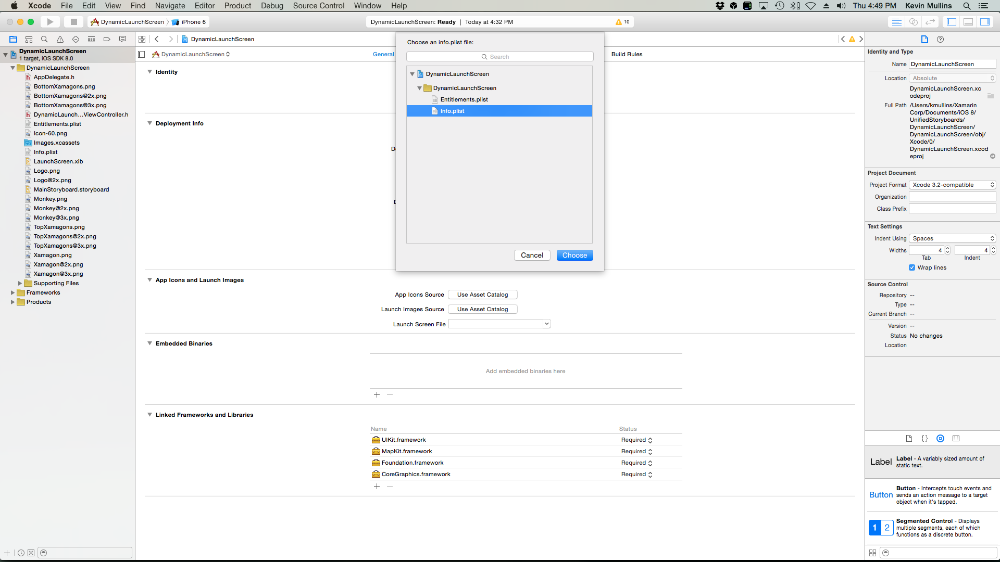](unified-storyboards-images/dls07.png#lightbox)
10. In the **App Icons and Launch Images** section, open the **Launch Screen File** dropdown and choose the `LaunchScreen.xib` created above:

    [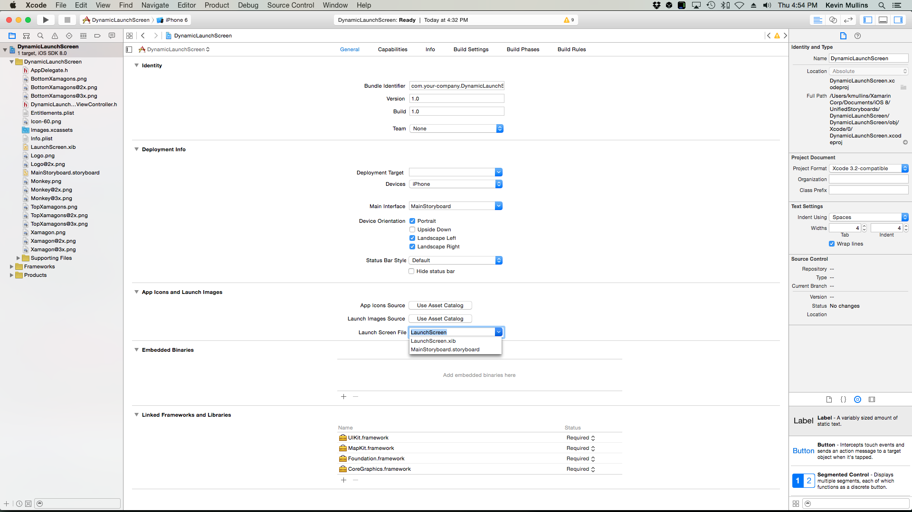](unified-storyboards-images/dls08.png#lightbox)
11. Save the changes to the file and return to Visual Studio for Mac.
12. Wait for Visual Studio for Mac to finish syncing changes with Xcode.
13. In the **Solution Explorer**, right-click on the **Resource** folder and select **Add** > **Add Files...**:

    [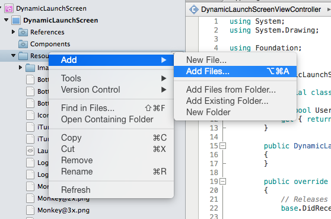](unified-storyboards-images/dls09.png#lightbox)
14. Select the `LaunchScreen.xib` file created above and click the **Open** button:

    [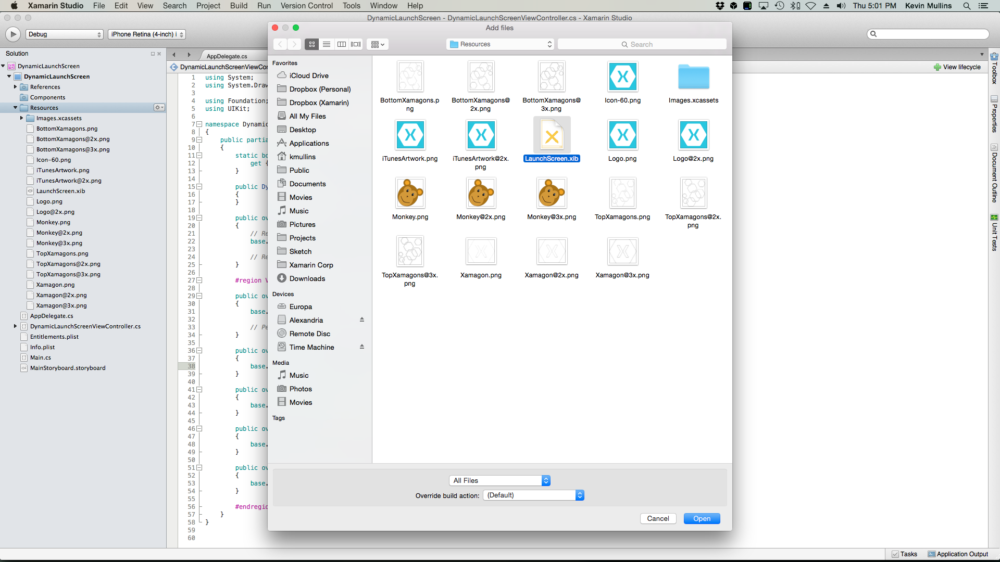](unified-storyboards-images/dls10.png#lightbox)
15. Build the application.

### Testing the Dynamic Launch Screen

In Visual Studio for Mac, select the iPhone 4 Retina simulator and run the application. The Dynamic Launch Screen will be displayed in the correct format and orientation:

[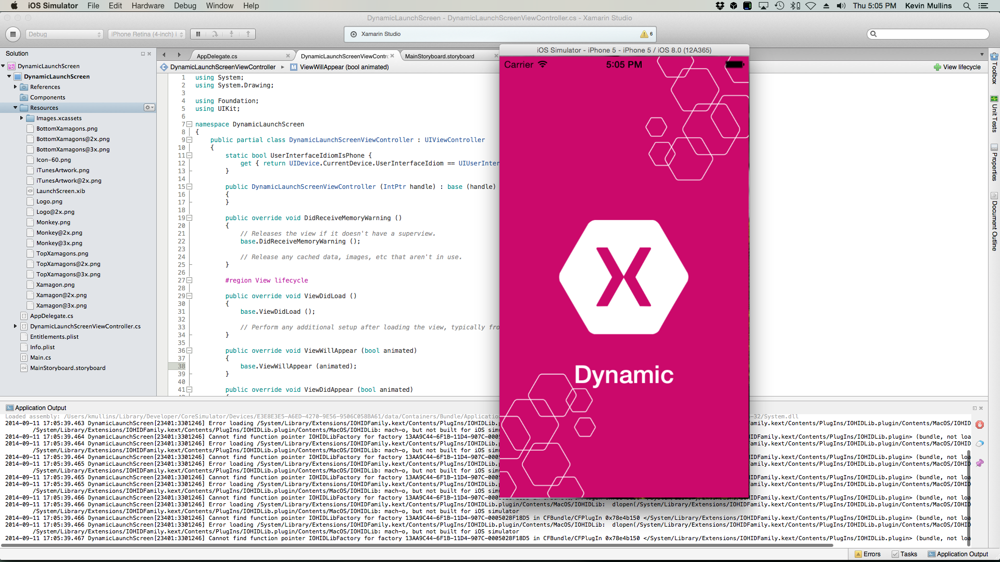](unified-storyboards-images/dls11.png#lightbox)

Stop the application in Visual Studio for Mac and select an iPad iOS 8 device. Run the application and the launch screen will be correctly formatted for this device and orientation:

[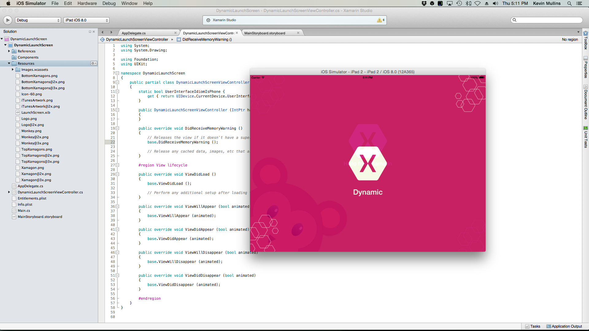](unified-storyboards-images/dls12.png#lightbox)

Return to Visual Studio for Mac and stop the application from running.

### Working with iOS 7

To maintain backward compatibility with iOS 7, just include the usual `Default.png` image assets as normal in the iOS 8 application. iOS will return to the previous behavior and use those files as the startup screen when running on an iOS 7 device.

To see an implementation of a Dynamic Launch Screen in Xamarin, look at the [Dynamic Launch Screens](/samples/xamarin/ios-samples/ios8-dynamiclaunchscreen) sample iOS 8 application attached to this document.

## Summary

This article took a quick look at Size Classes and how they affect layout in iPhone and iPad devices. It discussed how Traits, Trait Environments and Trait Collections work with Size Classes to create Unified Interfaces. It took brief look at Adaptive View Controllers and how they work with Size Classes inside of Unified Interfaces. It looked at implementing Size Classes and Unified Interfaces completely from C# code inside a Xamarin iOS 8 application.

Finally, this article covered the basics creating a single, Dynamic Launch Screen that will be displayed as the startup screen on every iOS 8 device.

## Related Links

- [Adaptive Photos (sample)](/samples/xamarin/ios-samples/ios8-adaptivephotos)
- [Dynamic Launch Screens (sample)](/samples/xamarin/ios-samples/ios8-dynamiclaunchscreen)
- [Introduction to iOS 8](~/ios/platform/introduction-to-ios8.md)
- [Dynamic Layouts in iOS8 - Evolve 2014 (video)](https://youtu.be/f3mMGlS-lM4)
- [UIPresentationController](https://developer.apple.com/library/prerelease/ios/documentation/UIKit/Reference/UIPresentationController_class/)
- [UIImageAsset](https://developer.apple.com/library/prerelease/ios/documentation/UIKit/Reference/UIImageAsset_Ref/index.html#//apple_ref/occ/cl/UIImageAsset)