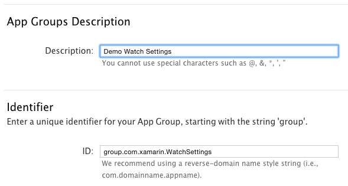

# Working with watchOS App Groups in Xamarin

An App Group allows different applications (or an
  application and its extensions) to access a shared
  file storage location. App Groups can be used for
  data like:

- Apple Watch [Settings](~/ios/watchos/app-fundamentals/settings.md).
- Shared [NSUserDefaults](~/ios/watchos/app-fundamentals/parent-app.md#nsuserdefaults).
- Shared [Files](~/ios/watchos/app-fundamentals/parent-app.md#files).

## Configure an App Group

The shared location is configured using an [App Group](https://developer.apple.com/library/ios/documentation/Miscellaneous/Reference/EntitlementKeyReference/Chapters/EnablingAppSandbox.html#//apple_ref/doc/uid/TP40011195-CH4-SW19),
  which is configured in the **Certificates, Identifiers & Profiles** section on
  [iOS Dev Center](https://developer.apple.com/devcenter/ios/). This value
  must also be referenced in each project's **Entitlements.plist**.

### Provisioning

The app group will have an identifier, which is typically your
  Bundle ID with a `group.` prefix. For example, we could use
  the Bundle ID `com.xamarin.WatchSettings` and the app group
  `group.com.xamarin.WatchSettings`.

### Entitlements.plist

As well as configuring the provisioning profile,
  **Enable App Groups** in the **Entitlements.plist** and enter
  the ID you've chosen:

### Deployment

Ensure you configure the App Group correctly
  in your [deployment](~/ios/watchos/deploy-test/index.md#App_Groups)
  provisioning.

For more information, please see the [App Group Capabilities](~/ios/deploy-test/provisioning/capabilities/app-groups-capabilities.md) documentation.

## Related Links

- [Apple's Sharing Data with Your Containing App](https://developer.apple.com/library/ios/documentation/General/Conceptual/ExtensibilityPG/ExtensionScenarios.html)
- [Apple's App Group doc](https://developer.apple.com/library/ios/documentation/Miscellaneous/Reference/EntitlementKeyReference/Chapters/EnablingAppSandbox.html#//apple_ref/doc/uid/TP40011195-CH4-SW19)
