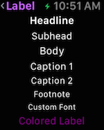
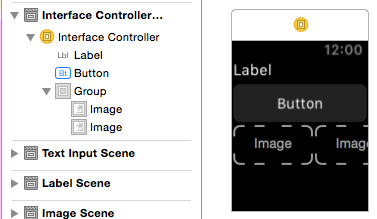
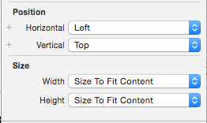
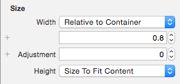
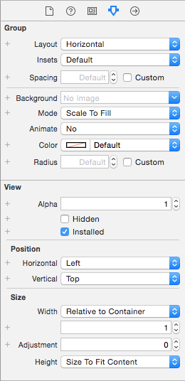
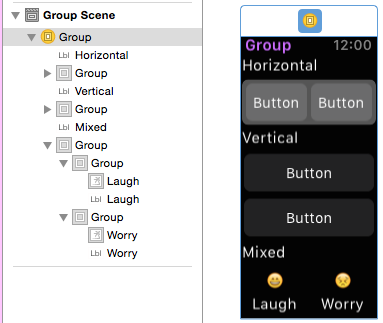
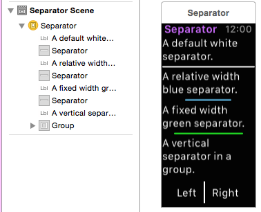

# Working with watchOS Layout in Xamarin

Designing layouts for the Apple Watch
  [screen sizes](~/ios/watchos/app-fundamentals/screen-sizes.md)
  presents unique challenges.

## Design Tips

The key point is: make your user interface readable and useable
  on a small watch screen, with a large finger. Don't fall into
  the trap of designing for the **iOS Simulator** (which appears
  very large) and a **mouse pointer** (which works with tiny touch targets)!

- Use a black background - it creates the illusion of a larger
  screen with the watch's black bezel.

- Do not pad around your screen layout - the bezel forms
  a natural visual padding.

- Focus on readability. Use font sizes and colors judiciously to
  ensure text is readable. Use the built-in text styles to get
  automatic Dynamic Type support.

- Focus on touch target sizes. Buttons/tappable table rows with
  text labels should span the whole screen. Apple says
  "never place more than three items side-by-side", and if you do
  use icons and not text labels.

- Use the [`Menu` control](~/ios/watchos/user-interface/menu.md) to
  expose less-frequently used functionality to keep your app
  design clear and concise.

## Implementation

Watch Kit includes the following controls to help you
  build attractive watch app layouts:

### Interface Controller

The `WKInterfaceController` is the base class all
  of your scenes.

The design surface for the interface controller behaves
  like a vertical **Group**: you can drag other controls
  onto the interface controller and they will be
  automatically laid-out one above the other:

You can set the **Position** and **Size** properties
  on each control to control their appearance:

When the size is set to **Relative to Container**
  you can provide a proportional value and an offset
  adjustment. This screenshot shows a button that has
  been set to use 80% of the watch screen's width (**0.8**):

### Group

`WKInterfaceGroup` is a simple layout container that
  can be configured to stack controls vertically or
  horizontally. It includes spacing between each control
  by default, but you can modify the spacing (and insets)
  in the **Attributes** inspector.

Groups can themselves be sized and positioned relative
  to the controls around them, and groups can be nested
  to create complex layouts.

### Separator

The separator control is intended to help provide
  visual guidance in your layout. Use separators
  (or background colors or images) to help the user
  understand which content is related on your screen.

Note the blue and green separators that don't use the full width
  of the screen have been configured with either
  **Fixed** or **Relative to Container** sizes.

### Content Controls

No layout would be complete without the `Label`, `Image`,
  `Button`, `Switch`, `Slider`, `Map`, and
  [other controls](~/ios/watchos/user-interface/index.md).
  These can be positioned in your layouts using **Groups**
  or the position and size settings on each control.

## Related Links

- [WatchKitCatalog (sample)](/samples/xamarin/ios-samples/watchos-watchkitcatalog)
- [Apple's Layout reference](https://developer.apple.com/design/human-interface-guidelines/layout)
- [Apple's Foundations reference](https://developer.apple.com/design/human-interface-guidelines/foundations)