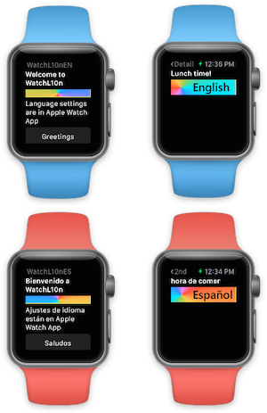
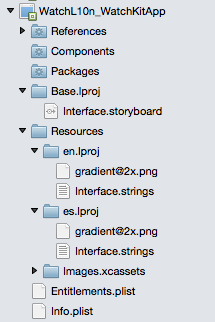
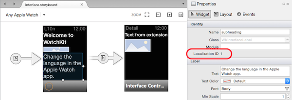
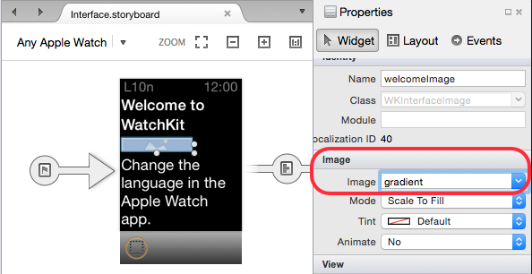
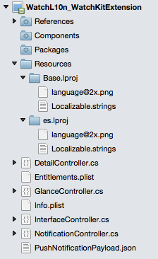
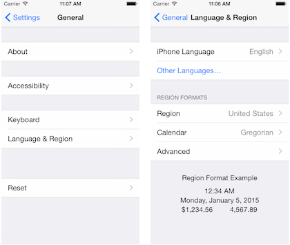
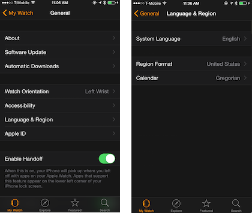

# Working with watchOS Localization in Xamarin

_Adapting your watchOS apps for multiple languages_



watchOS apps are localized using the standard iOS
  methods:

- Using **Localization ID** on storyboard elements,
- **.strings** files associated with the storyboard, and
- **Localizable.strings** files for text used in code.

The default storyboards and resources are located in a
  **Base** directory, and language-specific translations
  and other resources are stored in **.lproj** directories.
  iOS and Watch OS will automatically use the user's
  language selection to load the correct strings and resources.

Because an Apple Watch app has two parts - Watch App and Watch Extension -
  localized string resources are required in two places, depending
  on how they are used.

The localized text and resources will be *different* in the
  watch app and the watch extension.

## Watch App

The watch app contains the storyboard that describes the app's
  user interface. Any controls (such as `Label` and `Image`) that
  support localization have a **Localization ID**.

Each language-specific **.lproj** directory should contain
  **.strings** files with the translations for
  each element (using the **Localization ID**),
  as well as images referenced by the storyboard.

## Watch Extension

The watch extension is where your app code runs. Any text that
  is displayed to the user from code needs to be localized in
  the extension and not in the watch app.

The extension should also contain language-specific **.lproj**
  directories, but the **.strings** files only require translations
  for text that is used in your code.

## Globalizing the Watch Solution

Globalization is the process of making an application localizable.
  For watch apps this means designing the storyboard with different
  text-lengths in mind, ensuring each screen layout adjusts appropriately
  depending on what text is displayed. You also need to ensure any strings
  referenced in the watch extension code can be translated using the
  `LocalizedString` method.

### Watch App

By default the watch app is not configured for localization. You
  need to move the default storyboard file and create some other
  directories for your translations:

1. Create **Base.lproj** directory and move the **Interface.storyboard** into it.

2. Create **\<language>.lproj** directories for each language you wish to support.

3. The **.lproj** directories should contain an **Interface.strings** text file
  (the filename should match the storboard's name). You can optionally
  place any images that require localization in these directories.

The watch app project looks like this after these changes have been made (only
  English and Spanish language files have been added):

  

#### Storyboard Text

When you edit the storyboard, select each element and notice the
  **Localization ID** that appears in the **Properties** pad:

  [](localization-images/storyboard.png#lightbox)

In the **Base.lproj** folder, create key-value pairs as shown
  below, where the key is formed by the **Localization ID**
  and a property name on the control, joined by a dot (`.`).

```csharp
"AgC-eL-Hgc.title" = "WatchL10nEN"; // interface controller title
"0.text" = "Welcome to WatchL10n"; // Welcome
"1.text" = "Language settings are in Apple Watch App"; // How to change language
"2.title" = "Greetings"; // Greeting
"6.title" = "Detail";
"39.text" = "Second screen";
```

Notice in this example that a **Localization ID** can be a simple
  number string (eg. "0", "1", etc) or a more complex string
  (such as "AgC-eL-Hgc"). `Label` controls have a `Text` property
  and `Button`s have a `Title` property, which is reflected in the
  way their localized values are set - be sure to use the lowercase
  property name as shown in the example above.

When the storyboard is rendered on the watch, the correct
  values will be automatically extracted and displayed according
  to the language selected by the user.

#### Storyboard Images

The example solution also includes a **gradient@2x.png** image in
  each language folder. This image can be different for each language
  (eg. it may have embedded text that needs translating, or use
  localized iconography).

Simply set the image's **Image** property in the storyboard
  and the correct image will be rendered on the watch according
  to the language selected by the user.



Note: because all Apple Watches have Retina displays, only the **@2x**
  version of the image is required. You do not need to specify **@2x**
  in the storyboard.

### Watch Extension

The watch extension requires a similar directory
  structure to support localization, however there
  is no storyboard. The localized strings in the extension
  are only those referenced by C# code.



#### Strings in Code

The **Localizable.strings** file has a slightly different
  structure than if it was associated with a storyboard. In
  this case we can choose any "key" string; Apple's
  recommendation is to use a key that reflects the actual
  text that would be displayed in the default language:

```csharp
"Breakfast time" = "Breakfast time!"; // morning
"Lunch time" = "Lunch time!"; // midday
"Dinner time" = "Dinner time!"; // evening
"Bed time" = "Bed time!"; // night
```

The `NSBundle.MainBundle.LocalizedString` method is used
  to resolve strings into their translated counterparts,
  as shown in the code below.

```csharp
var display = "Breakfast time";
var localizedDisplay =
  NSBundle.MainBundle.LocalizedString (display, comment:"greeting");
displayText.SetText (localizedDisplay);
```

#### Images in Code

Images that are populated by code can be set in two ways.

1. You can change an `Image` control by setting its value to the string
    name of an image that already exists in the Watch App, eg

    ```csharp
    displayImage.SetImage("gradient"); // image in Watch App (as shown above)
    ```

2. You can move an image from the extension to the watch
    using `FromBundle` and the app will automatically choose
    the correct image for the user's language selection. In the
    example solution there is an image **language@2x.png** in
    each language folder, and it is displayed on `DetailController`
    using the following code:

    ```csharp
    using (var image = UIImage.FromBundle ("language")) {
        displayImage.SetImage (image);
    }
    ```

    Note that you do not need to specify the **@2x** when referring
    to the image's filename.

The second method is also applicable if you download an image from
a remote server to render on the watch; however in this case you
should ensure that the image you download is correctly localized
according to the user's preferences.

## Localization

Once you have configured your solution, translators will need
  to process your **.strings** files and images for each
  language you wish to support.

You can create as many **.lproj** directories as you need
  (one for each supported language). They are named using
  language codes, such as **en**, **es**, **de**, **ja**,
  **pt-BR**, etc. (for English, Spanish, German, Japanese, and Portuguese (Brazilian) respectively).

The attached sample uses (machine-generated)
  translations to demonstrate how to localize a watchOS app.

### Watch App

These values are used to translate the user interface defined
  in the watch app's storyboard. The *key* value is a combination
  of each storyboard control's **Localization ID** and the property
  being translated.

It is recommended to add comments containing the original text
  to the file so that translators know what the translation should be.

#### es.lproj/Interface.strings

The (machine translated) Spanish language strings for the
  storyboard are shown below. It is helpful to add comments
  to each line, because it is difficult to know what
  the **Localization ID** is referring to otherwise:

```csharp
"AgC-eL-Hgc.title" = "Spanish"; // app screen heading
"0.text" = "Bienvenido a WatchL10n"; // Welcome to WatchL10n
"1.text" = "Ajustes de idioma están en Apple Watch App"; // Change the language in the Apple Watch App
"2.title" = "Saludos"; // Greetings
"6.title" = "2nd"; // second screen heading
"39.text" = "Segunda pantalla"; // second screen
```

### Watch Extension

These values are used in code to translate information
  before being displayed to the user. The *key* is selected
  by the developer while they're writing code, and usually
  contains the actual string to be translated.

#### es.lproj/Localizable.strings file

The (machine translated) Spansish language strings:

```csharp
"Breakfast time" = "la hora del desayuno"; // morning
"Lunch time" = "hora de comer"; // midday
"Dinner time" = "hora de la cena"; // evening
"Bed time" = "la hora de dormir"; // night
```

## Testing

The method to change language preferences differs between the simulator
  and physical devices.

### Simulator

On the simulator, select the language to test using the
  iOS **Settings** app (the grey gears icon in the simulator home screen).

  

### Watch device

When testing with a watch, change the watch's language
  in the **Apple Watch** app on the paired iPhone.

  

## Related Links

- [WatchLocalization (sample)](https://developer.xamarin.com//samples/monotouch/watchOS/WatchLocalization/)
