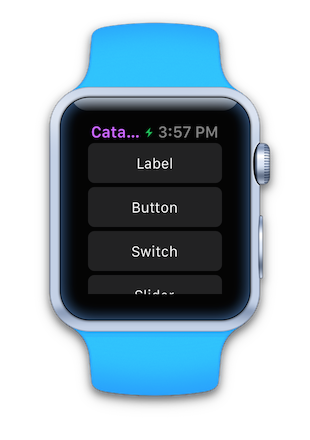
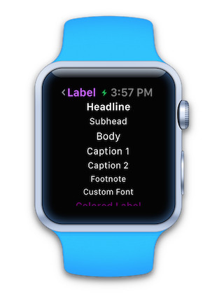
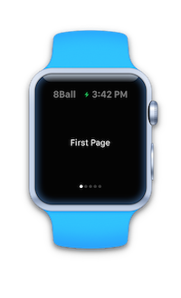
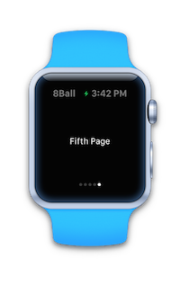

# Working with watchOS Navigation in Xamarin

The simplest navigation option available on the watch
  is a simple [modal popup](#modal) that appears on top
  of the current scene.

For multi-scene watch apps there are two navigation paradigms
  available:

- [Hierarchical Navigation](#Hierarchical_Navigation)
- [Page-based Interfaces](#Page-Based_Interfaces)

<a name="modal"></a>

## Modal Interfaces

Use the `PresentController` method to open an interface
  controller modally. The interface controller must already
  be defined in the **Interface.storyboard**.

```csharp
PresentController ("pageController","some context info");
```

Modally-presented controllers use the entire screen (covering the
  previous scene). By default the title is set to **Cancel**
  and tapping it will dismiss the controller.

To programmatically close the modally-presented controller,
  call `DismissController`.

```csharp
DismissController();
```

Modal screens can be either a single scene or use a
  page-based layout.

<a name="Hierarchical_Navigation"></a>

## Hierarchical Navigation

Presents scenes like a stack that can be
  navigated back through, similar to the way
  `UINavigationController` works on iOS. Scenes
  can be pushed onto the navigation stack and
  popped off (either programmatically or by user-selection).

 

As with iOS, a left-edge-swipe navigates back to the
  parent controller in a hierarchical navigation stack.

Both the [WatchKitCatalog](/samples/xamarin/ios-samples/watchos-watchkitcatalog) and
  [WatchTables](/samples/xamarin/ios-samples/watchos-watchtables) samples include hierarchical
  navigation.

### Pushing and Popping in Code

Watch Kit does not require an over-arching "navigation controller"
  to be created like iOS does - simply push a controller using
  the `PushController` method and a navigation stack will automatically
  be created.

```csharp
PushController("secondPageController","some context info");
```

The watch's screen will include a **back** button in the top
  left, but you can also programmatically remove a scene
  from the navigation stack using `PopController`.

```csharp
PopController();
```

As with iOS, it is also possible to return to the root
  of the navigation stack using `PopToRootController`.

```csharp
PopToRootController();
```

### Using Segues

Segues can be created between scenes in the storyboard
  to define hierarchical navigation. To get context
  for the target scene, the operating system calls
  `GetContextForSegue` to initialize the new interface
  controller.

```csharp
public override NSObject GetContextForSegue (string segueIdentifier)
{
  if (segueIdentifier == "mySegue") {
    return new NSString("some context info");
  }
  return base.GetContextForSegue (segueIdentifier);
}
```

<a name="Page-Based_Interfaces"></a>

## Page-Based Interfaces

Page-based interfaces swipe left-to-right, similar to the way
  `UIPageViewController` works on iOS. Indicator dots are displayed
  along the bottom of the screen to show which page is
  currently displayed.

  

To make a page-based interface the main UI for your watch app,
  use `ReloadRootControllers` with an array of interface
  controllers and contexts:

```csharp
var controllerNames = new [] { "pageController", "pageController", "pageController", "pageController", "pageController" };
var contexts = new [] { "First", "Second", "Third", "Fourth", "Fifth" };
ReloadRootControllers (controllerNames, contexts);
```

You can also present a page-based controller that is not
  the root using `PresentController` from one of the
  other scenes in an app.

```csharp
var controllerNames = new [] { "pageController", "pageController", "pageController", "pageController", "pageController" };
var contexts = new [] { "First", "Second", "Third", "Fourth", "Fifth" };
PresentController (controllerNames, contexts);
```

## Related Links

- [WatchKitCatalog (sample)](/samples/xamarin/ios-samples/watchos-watchkitcatalog)
- [WatchTables (sample)](https://developer.xamarin.com//samples/monotouch/watchOS/WatchTables/)