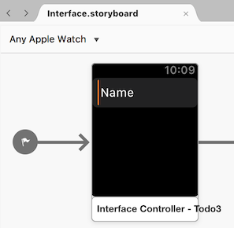
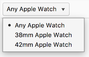
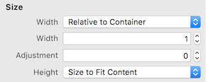
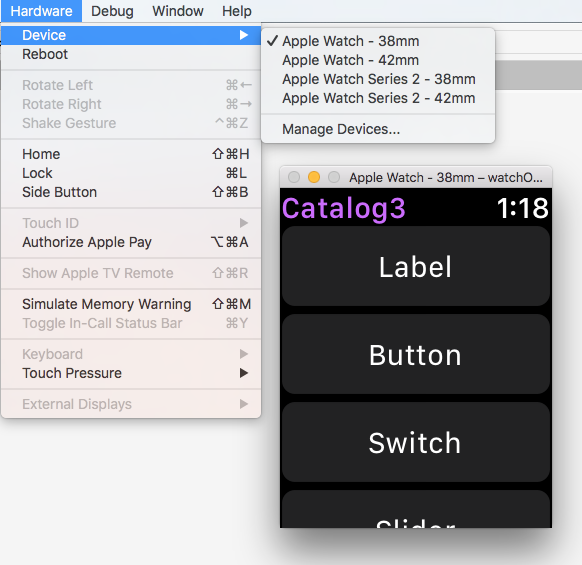
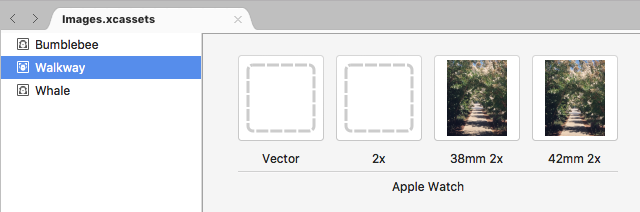

# Working with watchOS Screen Sizes in Xamarin

Apple Watch is available in two screen sizes:

- **38mm**
  - 136 x 170 logical pixels (272 x 340 physical pixels)

- **42mm**
  - 156 x 195 logical pixels (312 x 390 physical pixels).

You should take screen size into account when designing and testing your apps.

## watchOS Interface Designer

By default the Visual Studio for Mac Designer will display
  watch interface controllers at **Any Apple Watch**.



Use the size menu to edit and preview your storyboard at either
  of the available screen sizes: **38mm** or **42mm**:



The larger screen size will sometimes render content
  that would be truncated/hidden on the smaller screen.
  Be sure to test on both sizes.

### Interface Design

Your app should display the same content on the screen,
  regardless of size, and should expand or contract elements
  as appropriate. In the Visual Studio for Mac Designer, in the Attribute
  Inspector, you should use **Relative to Container** or
  **Size to Fit Content** in preference to fixed sizes.



Because the watch screen is surrounded by a black bezel, providing
  padding around your interface is not recommended. Let
  elements rest against the edge of the screen and let
  the bezel form a natural border around the app.

## watchOS Simulator

When testing on the simulator you can easily switch between the
  two screen sizes using the **Hardware > Device** menu.



## Image Resources

You should use multiple image assets if a single asset does not look
  good at different sizes. Image asset catalogs allow for separate bitmaps
  to be specified for each size:



```csharp
// specify the asset name, the correct size will automatically be loaded
staticImage.SetImage(UIImage.FromBundle("Walkway"));
```

Alternatively, use code to determine the screen size and load
different images altogether:

```csharp
bool large = WKInterfaceDevice.CurrentDevice.ScreenBounds.Size.Width > 136.0;
// Load image depending on screen size
using (var image = UIImage.FromBundle (large ? "42mm-Walkway" : "38mm-Walkway"))
{
   myImage.SetImage (image);

}
```

Read more about using the [image control](~/ios/watchos/user-interface/image.md).

## Related Links

- [Introduction to watchOS 3](~/ios/watchos/platform/introduction-to-watchos3/index.md)
