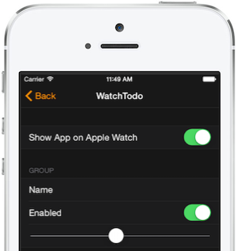
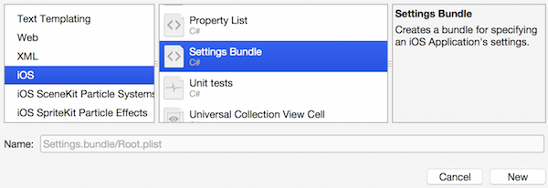
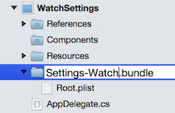
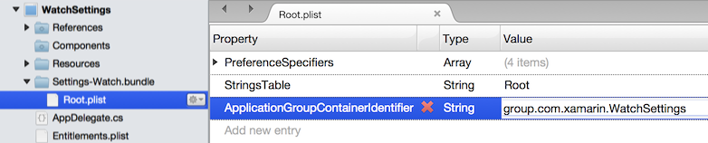
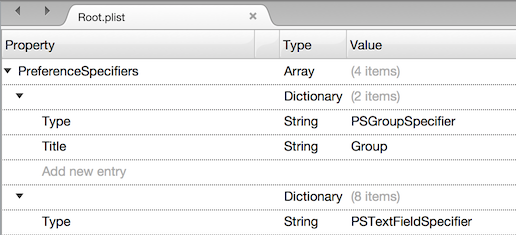
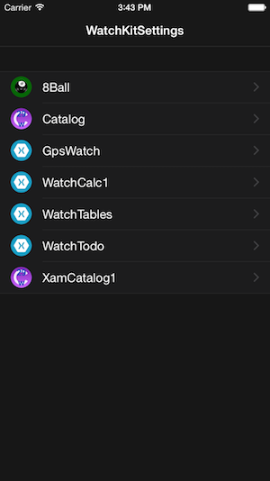
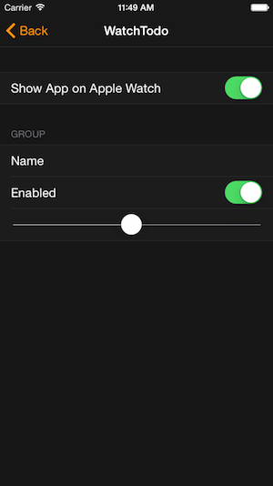

# Working with watchOS Settings in Xamarin

Apple Watch apps can use the same Settings functionality
  as iOS apps - the settings user interface is displayed
  in the **Apple Watch** iPhone app but the values are accessible
  in both your iPhone app and also the watch extension.



The settings will be stored in a shared file location that is
  accessible to both the iOS app and the watch app extension,
  defined by an **App Group**. You
  should [configure an App Group](~/ios/watchos/app-fundamentals/app-groups.md)
  before adding the settings using the instructions below.

## Add Settings in a Watch Solution

In the **iPhone app** in your solution (*not* the watch app or extension):

1. Right-click **Add > New File...** and choose **Settings.bundle**
  (you cannot edit the name in the **New File** dialog):

   [](settings-images/settings-add.png#lightbox)

2. Change the name to **Settings-Watch.bundle**
  (select and type **Command + R** to rename):

   

3. Add a new key `ApplicationGroupContainerIdentifier` to the
  **Root.plist** with the value set to the app group you've
  configured, (eg. `group.com.xamarin.WatchSettings` in the sample):

   [](settings-images/settings-appgroup.png#lightbox)

4. Edit the **Settings-Watch.bundle/Root.plist** to contain the
  options you wish to use - the template file contains a group.
  textfield, toggle switch and slider by default (which you can
  delete and replace with your own settings):

  [](settings-images/rootplist.png#lightbox)

## Use Settings in the Watch App

To access the values selected by the user, create an `NSUserDefaults`
  instance using the app group and specifying `NSUserDefaultsType.SuiteName`:

```csharp
NSUserDefaults shared = new NSUserDefaults(
    "group.com.xamarin.WatchSettings",
    NSUserDefaultsType.SuiteName);

var isEnabled = shared.BoolForKey ("enabled_preference");
var userName = shared.StringForKey ("name_preference");
```

## Apple Watch App

[](settings-images/settings-app.png#lightbox)

Users will interact with the settings via the new **Apple Watch**
  app on their iPhone. This app allows the user to show/hide
  apps on the watch, and also edit the settings exposed
  using the **Settings-Watch.bundle**.

 

## Related Links

- [Apple's Settings doc](https://developer.apple.com/library/prerelease/ios/documentation/General/Conceptual/WatchKitProgrammingGuide/Settings.html#//apple_ref/doc/uid/TP40014969-CH22-SW1)
