# Deploying watchOS Apps to the App Store

> [!IMPORTANT]
> Be sure to review [Apple's Watch Kit Submission Guide](https://developer.apple.com/app-store/watch/), and see the [Troubleshooting](#troubleshooting) section for any issues you may have.

- Ensure you have:
  - [**Distribution Provisioning Profiles**](#provisioning) created
  for your projects.
  - The **Deployment Target** (`MinimumOSVersion`) for the iOS
  parent app set to **8.2** or earlier (8.3 is not supported).

- In [**iTunes Connect**](#iTunes_Connect):

  - Create your iOS app entry (or add a **New Version** to an existing app).
  - Add Watch icon and screenshots.

- Then in [Visual Studio for Mac](#xamarin_studio) (Visual Studio is not currently supported):

  - Right-click the iOS app and choose **Set As Startup Project**.
  - Change to the **App Store** configuration.
  - Use the **Archive** feature create an application archive.

- Finally, switch to [Xcode 6.2+](#xcode)

  - Go to the **Window > Organizer** and choose **Archives**.
  - Select the application and archive from the list.
  - (Optionally) **Validate...** the archive.
  - **Submit...** the archive and follow the steps to
  upload to iTunes Connect for review and approval.

Read specific tips related to these items below. See the [Troubleshooting](#troubleshooting) section if you have problems.

<a name="provisioning"></a>

## Distribution Provisioning Profiles

To build for App Store deployment you need to
  create a **Distribution Provisioning Profile** for
  each App ID in your solution.

If you have a wildcard App ID, *only one Provisioning Profile
  will be required*; but if you have a separate App ID for each
  project then you'll need a provisioning profile for each
  App ID:

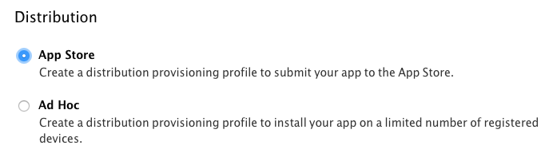

Once you've created all three profiles, they'll appear
  in the list. Remember to download and install each one
  (by double-clicking on it):

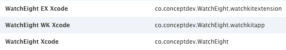

You can verify the provisioning profile in the **Project Options**
  by selecting the **Build > iOS Bundle Signing** screen
  and selecting the **AppStore | iPhone** configuration.

The **Provisioning Profile** list will show all matching
  profiles - you should see the matching profiles that
  you've created in this drop-down list.


<a name="iTunes_Connect"></a>

## iTunes Connect

Follow the [app distribution overview](~/ios/deploy-test/app-distribution/index.md), in particular:

- [Configuring an app in iTunes Connect](~/ios/deploy-test/app-distribution/app-store-distribution/itunesconnect.md)
- [Publishing to the App Store](~/ios/deploy-test/app-distribution/app-store-distribution/publishing-to-the-app-store.md)

When configuring the app in iTunes Connect, don't forget to
  add the Watch icon and screenshots:

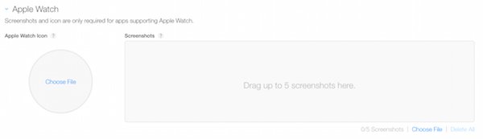

The icon file should be 1024x1024 pixels, and will have a circular
  mask applied to it when it is displayed. The icon should not have
  an alpha channel.

At least one screenshot is required, up to five may be submitted.
  They should be 312x390 pixels and demonstrate your Watch App in action.
  You can use the 42mm watch simulator to take screenshots at this size.

<a name="xamarin_studio"></a>

## Visual Studio for Mac

1. Ensure that the iOS app is the startup project. If not,
   right-click to set it:

   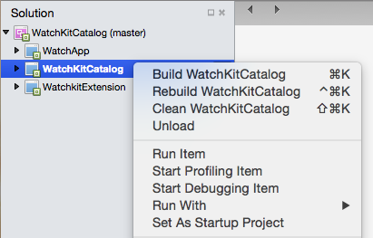

2. Choose the **AppStore** build configuration:

   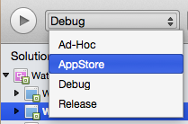

3. Choose the **Build > Archive** menu item to start the archive process:

   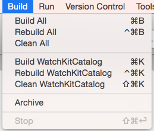

You can also choose the **View > Archives...** menu item to
  see archives that have been created previously.

  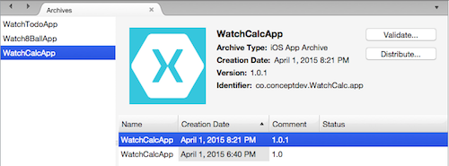

<a name="xcode"></a>

## Xcode

Xcode will automatically show archives created in Visual Studio for Mac.

1. Start Xcode and choose **Window > Organizer**:

   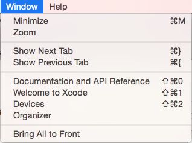

2. Switch to the **Archives** tab and select the archive that
  was created with Visual Studio for Mac:

   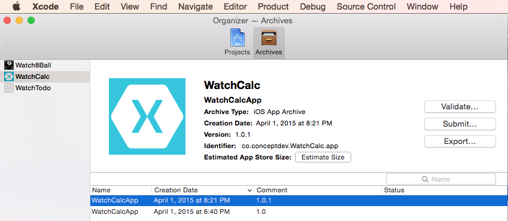

3. Optionally **Validate...** the archive, then choose **Submit...**
   to upload the app to iTunes Connect.

4. Choose the development team (if you belong to more than one)
   and then confirm the submission:

   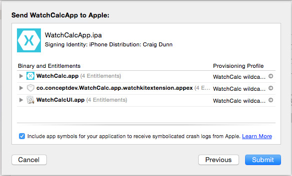

5. Visit iTunes Connect again to see the uploaded binary. Go to
   your app's configuration page and choose **Prerelease** from the top
   menu to see the **Builds** list:

   [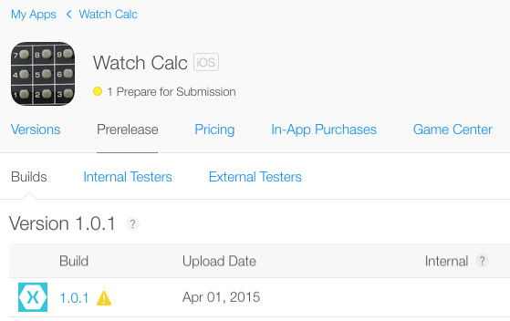](appstore-images/itc-prerelease.png#lightbox)

You can then submit the app for approval on the **Versions** page. Refer to the
 [iOS app distribution overview](~/ios/deploy-test/app-distribution/index.md)
 for more information.

## Troubleshooting

Here are some errors you might encounter while submitting to the
  App Store, and the steps you can take to fix them.

### Archive menu option is not visible in Visual Studio for Mac

Follow the [steps above](#xamarin_studio) to configure the
  solution for archiving. If you cannot set the startup project
  correctly, ensure the build configuration is first set to Debug
  or Release before attempting to change the startup project. Then
  set the build configuration back to **AppStore**.

### Invalid Icon

```csharp
Invalid Icon - The watch application '...watchkitextension.appex/WatchApp.app'
contains an icon file '...watchkitextension.appex/WatchApp.app/AppIcon27.5x27.5@2x.png'
with an alpha channel. Icons should not have an alpha channel.
```

Follow the [instructions for removing the alpha channel](~/ios/watchos/troubleshooting.md) from your icons.

### CFBundleVersion Mismatch

```csharp
CFBundleVersion Mismatch. The CFBundleVersion value '1' of watch application
'...watchkitextension.appex/WatchApp.app' does not match the CFBundleVersion
value '1.0' of its containing iOS application `YouriOS.app`.
```

All the projects in your solution - the iOS App, the Watch Extension, and
  the Watch App - should be using the same version number. Edit
  each **Info.plist** file so that the version number matches exactly.

### Missing Icons

```csharp
Missing Icons. No icons found for watch application '...watchkitextension.appex/WatchApp.app'.
Please make sure that its Info.plist file includes entries for CFBundleIconFiles.
```

Follow the instructions in the [working with icons](~/ios/watchos/app-fundamentals/icons.md)
  to add all the required images to the Watch App project.

### Missing Icon

```csharp
Missing Icon. The watch application '...watchkitextension.appex/WatchApp.app'
is missing icon with name pattern '*44x44@2x.png' (Home Screen 42mm).
```

Ensure you have the latest version of Visual Studio for Mac, and that your
  **AppIcon.appiconset** contains a complete set of images. If you are
  still seeing this error, view the source of the **Contents.json** to
  confirm it contains an entry for all the required images. Alternatively,
  once you have ensured you're using the latest version of Xamarin, delete
  and re-create the **AppIcon.appiconset**.

> [!IMPORTANT]
> There is a known bug in Visual Studio for Mac's Watch icon support: it expects an 88x88 pixel image for the **29x29@3x** image (which should be 87x87 pixels).

You cannot fix this in Visual Studio for Mac - either edit the image asset in Xcode or manually
edit the **Contents.json** file.

### Invalid WatchKit Support

```csharp
Invalid WatchKit Support - The bundle contains an invalid implementation of WatchKit.
The app may have been built or signed with non-compliant or pre-release tools.
```

This message may appear during validation and submission, or in an
  automated email from iTunes Connect after an apparently successful upload.
<!--
Ensure you are using the latest version of Xcode and Xamarin's tools.
-->
> [!IMPORTANT]
> You must **Archive** your app in Visual Studio for Mac and then switch to Xcode 6.2+ to validate and upload to iTunes Connect.

Use the Stable Xamarin channel, and Xcode 6.2+.

### Invalid Provisioning Profile

```csharp
Invalid Provisioning Profile. The provisioning profile included in the bundle
...iOSWatchApp.watchkitapp [iOSWatchApp.app/PlugIns/...iOSWatchApp.watchkitextension.appex/WatchApp.app]
is invalid. [Missing code-signing certificate.]
```

**Distribution Provisioning Profiles** must be supplied for all three
  projects in a watch app solution: the iOS App, the Watch Extension, and
  the Watch App - either explicitly (three profiles) or via a single
  wildcard profile. Check that the provisioning profiles exist in the
  iOS Dev Center and that you have downloaded and added them to your Mac.

### Invalid Code Signing Entitlements

```csharp
ITMS-90046: Invalid Code Signing Entitlements. Your application bundle's signature contains
code signing entitlements that are not supported on iOS. Specifically, value
'...watchkitextension' for key 'application-identifier' in '...watchkitextension'
is not supported. The value should be a string startign with your TEAMID, followed
by a dot '.' followed by the bundle identifier.
```

Ensure your provisioning profiles are set-up correctly on the Apple Dev Center,
  and that you have downloaded and installed them. Also check they are set
  in Visual Studio for Mac's properties window for each project.

### Invalid Architecture

```csharp
Invalid architecture: Apps that include an app extension
and framework must support arm64.
```

You can only add Watch Apps [Unified API (64-bit)](~/cross-platform/macios/unified/index.md) Xamarin.iOS apps.
  Right-click on the iOS app project then go to
  **Options > Build > iOS Build > Advanced tab** and ensure that the
  **Supported Architectures** for the AppStore-iPhone configuration
  includes **ARM64** (eg. **ARMv7 + ARM64**).

### This bundle is invalid.

```csharp
ITMS-90068: This bundle is invalid. The value provided for the key
MinimumOSVersion '8.3' is not acceptable.
```

Your parent iOS application must have the MinimumOSVersion set
  to '8.2' or earlier.

### Non-public API usage

```csharp
Your app contains non-public API usage.
Please review the errors, and resubmit your application.
```

Ensure you are using the latest version of Xcode and Xamarin's tools.
  Your code should not access any non-public APIs.

### Build Error MT5309

```csharp
Error MT5309: Native linking error: clang: error: no such file or directory:
```

This error is likely the result of your having renamed your
Xcode installation from **Xcode.app**. For instance, this
error will occur if you rename your installation to **XCode 6.2.app**.

## Related Links

- [Apple WatchKit Submission Guide](https://developer.apple.com/app-store/watch/)
