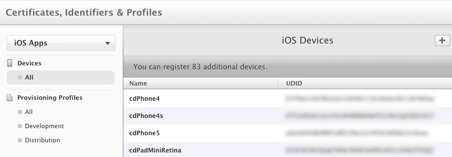
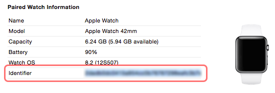
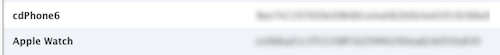
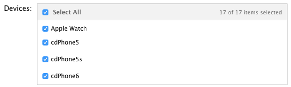
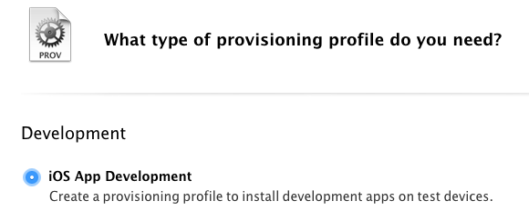
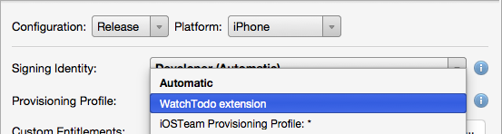
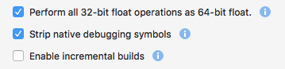
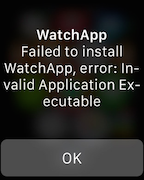

# Testing on Apple Watch Devices

After you've followed the [deployment steps](~/ios/watchos/deploy-test/index.md)
  to create App IDs and App Groups (if required), use the instructions
  on this page to:

- [Set-up your Devices](#devices) in the Apple Dev Center, and
- [Create Development Provisioning Profiles](#profiles), then
- [Deploy and test](#testing) on an Apple Watch.

<a name="devices"></a>

## Devices

Testing iOS apps on a real iPhone or iPad has always required
  the device to be registered on the Dev Center. The device list
  looks like this (click the plus sign **+** to add a new device):



Watches are no different - you now need to add your Apple Watch
  device before deploying apps to it. Find the watch's UDID using
  **Xcode** (**Windows > Devices** list). When the paired phone
  is connected the watch's information will also be displayed:

[](device-images/xcode-devices.png#lightbox)

When you know the Watch's UDID, add it to the device list
  in the Dev Center:



Once the Watch device has been added, ensure it is selected
  in any new or existing development or ad-hoc provisioning
  profiles you create:



Don't forget if you edit an existing provisioning profile
  to download and re-install it!

<a name="profiles"></a>

## Development Provisioning Profiles

To build for testing on your device you need to
  create a **Development Provisioning Profile** for
  each App ID in your solution.

If you have a wildcard App ID, *only one Provisioning Profile
  will be required*; but if you have a separate App ID for each
  project then you'll need a provisioning profile for each
  App ID:



Once you've created all three profiles, they'll appear
  in the list. Remember to download and install each one:


You can verify the provisioning profile in the **Project Options**
  by selecting the **Build > iOS Bundle Signing** screen
  and selecting the **Release** or **Debug iPhone** configuration.

The **Provisioning Profile** list will show all matching
  profiles - you should see the matching profiles that
  you've created in this drop-down list:



<a name="testing"></a>

## Testing on a Watch device

Once you have configured your Device, App IDs, and Provisioning
  Profiles, you are ready to test.

1. Make sure your iPhone is plugged in, and the Watch is already
  paired with the iPhone.

2. Ensure the configuration is set to **Release** or **Debug**.

3. Ensure the connected iPhone device is selected in the target list.

4. Right-click on the iOS App project (not the watch or extension)
  and choose **Set As Startup Project**.

5. Click the **Run** button (or choose a **Start** option from the **Run** menu).

6. The solution will build and the iOS app will be deployed to the iPhone.
  If the iOS app or watch extension provisioning is not set correctly then
  deployment to the iPhone will fail.

7. If deployment completes successfully, the iPhone will automatically attempt to
  send the watch app to the paired Watch. Your app icon will appear
  on the watch screen with a circular *installing* progress indicator.

8. If the watch app is successfully installed, the icon will remain on the watch
  screen - touch it to start testing your app!

## Troubleshooting

If an error occurs during deployment use the **View > Pads > Device Log** to
  see more information about the error. Some errors and their causes
  are listed below:

### Error MT3001: Could not AOT the assembly

This may occur when building in DEBUG mode to deploy to an Apple Watch device.

To *temporarily* work around this issue, disable **Incremental Builds** in the Watch Extension
**Project Options > Build > watchOS Build** window:

[](device-images/disable-incremental.png#lightbox)

This will be fixed in a future release, after which incremental builds can be
re-enabled to take advantage of faster build times.

### Watch App fails to start while debugging on device

When attempting to debug a watch app on a physical device, only the icon & loading
spinner appear (and eventually time-out). This will be addressed in a future release;
a workaround is to run a RELEASE build (which will not allow debugging).

### Invalid Application Executable or Application Verification Failed

```csharp
Failed to install [APPNAME]
Invalid executable/Application Verification Failed
```



If these messages appear *on the watch screen* after the
  app has attempted to install, there could be a couple of
  issues:

- The Watch device itself has not been added as a device
  on the Apple Dev Center. Follow the instructions
  to [configure devices correctly](#devices).

- The development provisioning profiles being used for testing
  did not have the Watch device included; or after the Watch was
  added to the provisioning profiles they weren't re-downloaded
  and re-installed. Follow the instructions to [configure the provisioning profiles correctly](#profiles).

- If the **iOS Device Log** contains `The system version is lower than the minimum OS version specified for bundle...Have 8.2; need 8.3` then the Watch App's **Info.plist** has the wrong **MinimumOSVersion** value.
  This should be **8.2** - if you have installed Xcode 6.3 you
  might need to manually edit the source to insert set it to 8.2.

- The Watch App's **Entitlements.plist** incorrectly has
  an entitlement enabled (such as App Groups) that it shouldn't have.

- The Watch App's **App ID** incorrectly has an entitlement
  enabled (such as App Groups) in the Dev Center that it shouldn't have.

### Install Never Finished

```csharp
SPErrorGizmoInstallNeverFinishedErrorMessage
```

This error could indicate unnecessary (and invalid) keys
  in the Watch App's **Info.plist** file. You should not
  include keys meant for the iOS app or watch extension
  in the Watch App.

<!--eg. NSLocationAlwaysUsageDescription -->

### "waiting for debugger to connect"

If the **Application Output** window gets stuck showing

```csharp
waiting for debugger to connect
```

check if any of the NuGets that have been included in your
  project have a dependency on **Microsoft.Bcl.Build**. This
  is automatically added with some Microsoft-published libraries
  including the popular [Microsoft Http Client Libraries](https://www.nuget.org/packages/Microsoft.Net.Http/).

The **Microsoft.Bcl.Build.targets** file that is added to the
  **.csproj** can interfere with the packaging of iOS
  extensions during deployment. You can track the [bug](https://bugzilla.xamarin.com/show_bug.cgi?id=29912).
  A possible workaround is to edit the .csproj file and manually
  move the **Microsoft.Bcl.Build.targets** to be the last element.
