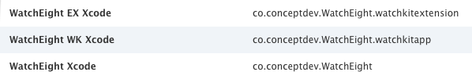
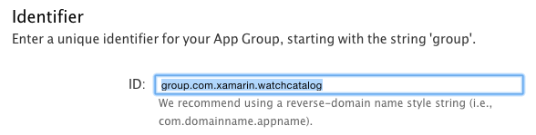
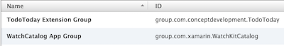
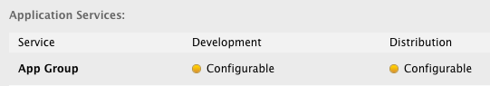
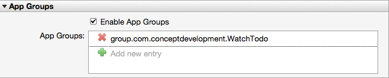

# Deploying and Testing watchOS Apps with Xamarin

## Deployment Checklist

Whether you are deploying to a test Watch, or uploading to the App Store,
  you need to complete the steps on this page:

- In the **iOS Dev Center**:
  - [App IDs](#App_IDs) have been created.
  - [App Groups](#App_Groups) configured (if required).
  - Distribution Provisioning Profile(s) created

- In your solution:

  - Verify the [Bundle IDs and project references](~/ios/watchos/get-started/installation.md) are set.
  - Check your icons are [configured correctly](~/ios/watchos/app-fundamentals/icons.md).
  - Check the bundle version numbers match in all projects.
  - Configure the **Entitlements.plist** for App Groups (if required).

- Then follow the instructions to:
  - [Deploy to an Apple Watch for testing](~/ios/watchos/deploy-test/device.md), or
  - [Upload to the App Store](~/ios/watchos/deploy-test/appstore.md).

## App IDs

As discussed in the [setup instructions](~/ios/watchos/get-started/installation.md),
  all three projects in a Watch App have related Bundle IDs, such as:

- Xamarin.iOS Unified project - `com.xamarin.WatchKitCatalog`
- WatchKit Extension project - `com.xamarin.WatchKitCatalog.watchkitextension`
- Watch App project - `com.xamarin.WatchKitCatalog.watchkitapp`

All three projects require a matching Distribution Provisioning Profile,
  either using explicitly App IDs for each, or a wildcard App ID.

### Explicit App IDs

Create an **App ID** for each project's Bundle ID (which will look like
  this on the iOS Dev Center):

When creating or configuring App IDs, remember to enable the specific
  features your app requires. This could include push notifications
  and app groups.

You will need to create a Distribution Provisioning Profile for
  each App ID.

### Wildcard App ID

Alternatively, you can create a wildcard **App ID** that
  matches all three projects, such as `com.xamarin.*`.

Note that some features cannot be used with a wildcard
  App ID (such as push notifications). If your app
  requires these features you should create explicit
  App IDs.

For distribution, you'll only need to create one
  Distribution Provisioning Profile for the wildcard App ID.

## App Groups

You can use an App Group to share data between your iOS App and
  the Watch Extension. You should ensure that your solution has:

- Configured the **App Group** in the Apple Developer Portal
**Certificates, Identifiers & Profiles** section.

- Enabled **App Groups** (and provided the **App Group ID**) in *both*
  the iOS App and the Watch Extension's **App ID** and **Entitlements.plist**.

### Certificates, Identifiers & Profiles

To use an App Group, create an entry in the **App Groups**
  screen. In the example below the group is named with
  the same reverse-DNS style that is commonly used for
  App IDs, but with the `group.` prefix (which is required):

The app group will then appear in the list:

Once the group is created, it can be referenced in your
  **App ID** configuration. Remember to include it both the
  iOS App and Watch Extension **App IDs**.

Do **not** enable App Groups in the Apple Watch App ID. It is not
  required to be enabled on the watch itself.

### Entitlements.plist

Some app features (eg. App Groups) require you to set your entitlements.
  Double-click to edit the **Entitlements.plist** file in these projects:

- iOS App project
- Watch Extension project

.

Do **not** enable entitlements in the Watch App project. It is not
  required to be enabled on the watch itself.

## Related Links

- [Apple WatchKit Submission Guide](https://developer.apple.com/app-store/watch/)
