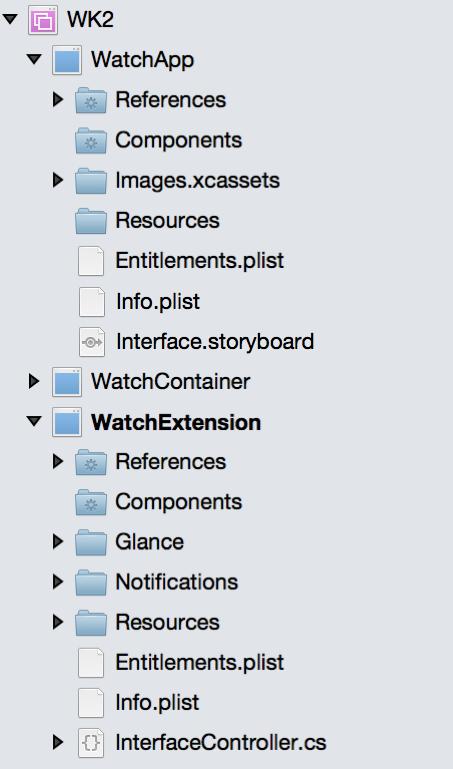
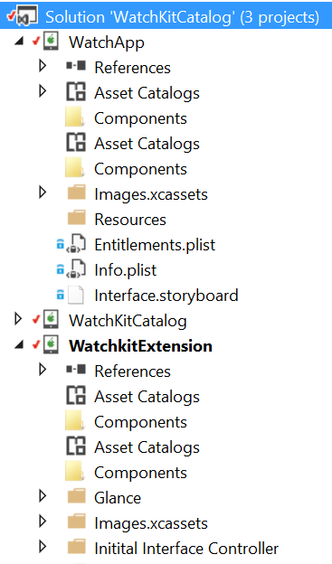
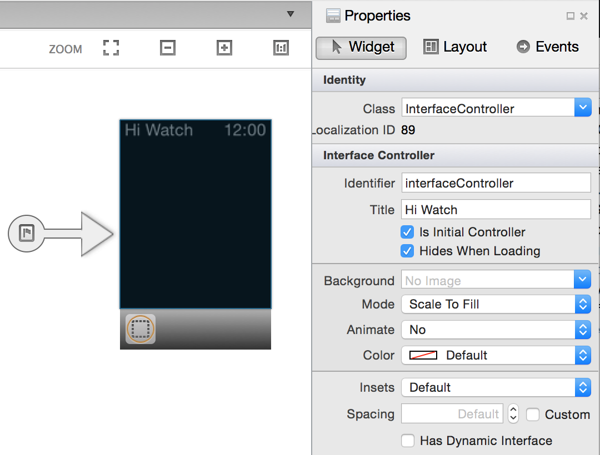
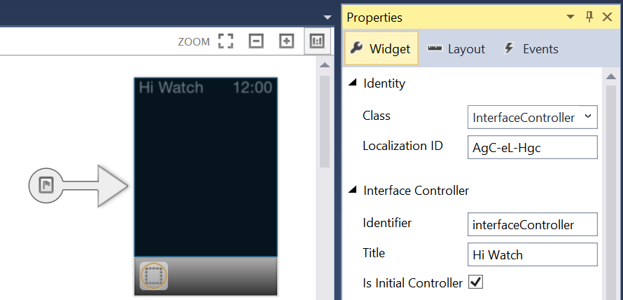
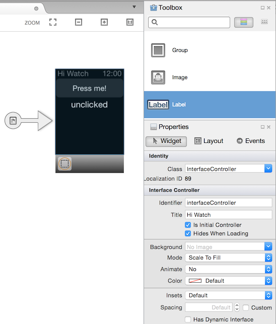
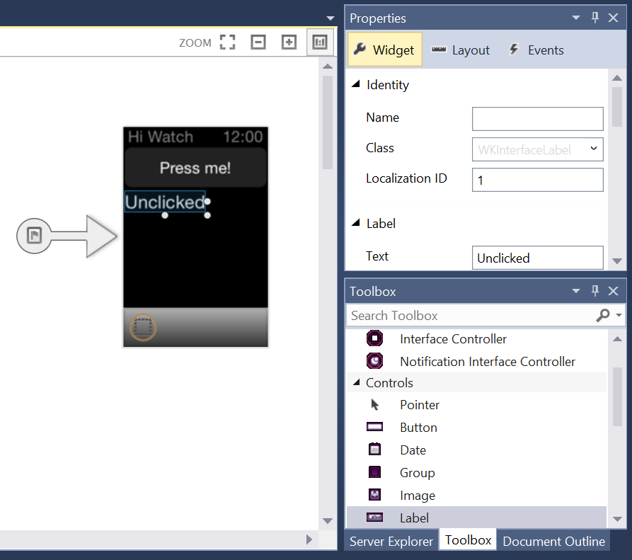
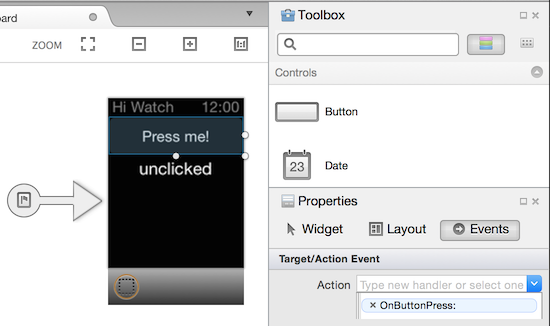
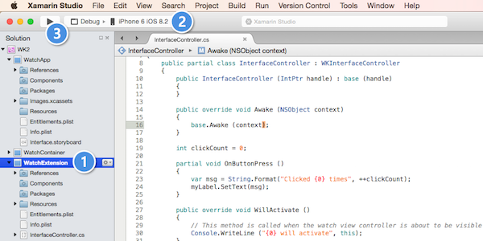

# Hello, watchOS – Walkthrough

After you have created a solution following the steps in
[Setup and Installation](~/ios/watchos/get-started/installation.md), you will have 3 projects:

- The iOS Parent app which is used for setup or other on-device administrative tasks. (With other types of iOS Extensions, this is often referred to as the "Container" app.) With Watch Apps, it will be possible for users to start running the Watch App without **ever** running the Parent app;
- The Watch Extension which contains the program code for the watch app; and
- The Watch App, which holds the storyboard and image resources that are rendered on the watch.

Check that your [references are correct](~/ios/watchos/get-started/project-references.md): that the Parent app has a reference to the Watch App, and that the Watch App has a reference to the Extension.

Confirm that your Bundle Identifiers follow the \*.watchkitextension \*.watchkitapp convention and that your Extension’s Info.plist file has it's **WKApp Bundle ID** value set to the Bundle Identifier of your Watch App.

You should be able to run your Watch App now, but because the storyboard file within your Watch App is blank, you wouldn’t be able to tell.

# [Visual Studio for Mac](#tab/macos)



# [Visual Studio](#tab/windows)



-----

# [Visual Studio for Mac](#tab/macos)

Double-click on the Interface.storyboard in your Watch App to
  start the Xamarin iOS Designer (if you are on a Mac you can
  also right-click and **Open With > Xcode Interface Builder**)

1. Ensure the **Toolbox** and **Properties** pads are visible,
1. Click to select the Interface Controller,
1. Set the Identifier and Title of the Interface Controller to **interfaceController** and **Hi Watch**,
1. Verify the **Class** is set to  **InterfaceController**

    

# [Visual Studio](#tab/windows)

Double-click on the Interface.storyboard in your Watch App
  to edit with the Xamarin iOS Designer in Visual Studio:

1. Open the Properties pane;
1. Change the Class to **InterfaceController**;
1. Click the Interface Controller; and
1. Set the Identifier and Title of the Interface Controller to **interfaceController** and **Hi Watch**.

    

-----

Create your UI:

1. From the **Toolbox** pad,
1. Drag and drop a **Button** and a **Label** onto the scene, and
1. Set the text and attributes of the controls as shown:

# [Visual Studio for Mac](#tab/macos)



# [Visual Studio](#tab/windows)



-----

1. Set the **Name** in the **Properties** pad for each
  control. In this example we've used `myButton` and `myLabel`.

1. Select the button on the storyboard and go to the **Properties** pad's
  **Events** list, then

1. Create a new **Action** by typing `OnButtonPress` and pressing **Enter**.
  The action will appear in the list, and a partial method will automatically
  be created in C#.



After you save the storyboard, the **InterfaceController.designer.cs**
  gets updated with the control names and actions.. If you open this file after it
  has updated, you can see how the `RegisterAttribute` corresponds
  to the controller and how UI controls correspond
  to C# instance variables marked with the `OutletAttribute`
  and how Actions map to partial methods tagged
  with the `ActionAttribute`:

```csharp
// WARNING
//
// This file has been generated automatically by Visual Studio for Mac from the outlets and
// actions declared in your storyboard file.
// Manual changes to this file will not be maintained.
//
[Register ("InterfaceController")]
partial class InterfaceController
{
    [Outlet]
    [GeneratedCode ("iOS Designer", "1.0")]
    WatchKit.WKInterfaceButton myButton { get; set; }

    [Outlet]
    [GeneratedCode ("iOS Designer", "1.0")]
    WatchKit.WKInterfaceLabel myLabel { get; set; }

    [Action ("OnButtonPress:")]
    [GeneratedCode ("iOS Designer", "1.0")]
    partial void OnButtonPress (WatchKit.WKInterfaceButton sender);

    void ReleaseDesignerOutlets ()
    {
        if (myButton != null) {
            myButton.Dispose ();
            myButton = null;
        }
        if (myLabel != null) {
            myLabel.Dispose ();
            myLabel = null;
        }
    }
}
```

Now open **InterfaceController.cs** (*not* InterfaceController.designer.cs)
  and add the following code:

```csharp
int clickCount = 0;
partial void OnButtonPress (WatchKit.WKInterfaceButton sender)
{
  var msg = String.Format("Clicked {0} times", ++clickCount);
  myLabel.SetText(msg);
}
```

This code should be fairly transparent: the instance variable `clickCount` is incremented every time the function `OnButtonPress` is called. The text of `myLabel` is changed to reflect this count; `myLabel`, of course, is the name of one of the Outlets you created in XCode. The `partial` function is the implementation of the function associated with the name of the Action you specified.

If it is not already the Startup Project,

1. Right-click on your Watch Extension project and choose **Set as Startup Project**,

1. Set the Deployment Target to a Watch Kit-compatible simulator image (such as iPhone 6 iOS 8.2),

1. Press the **Debug** button to trigger a build and simulator launch.

    [](hello-watch-images/readytodebug.png#lightbox)

When the Simulator launches, press the button to increment the label.
  Congratulations, you’ve got yourself a Watch App!


## Related Links

- [Setup and Installation](~/ios/watchos/get-started/installation.md)
- [First Watch App video](https://blog.xamarin.com/your-first-watch-kit-app/)
