# Installing and Using watchOS in Xamarin

watchOS 4 requires macOS Sierra (10.12) with Xcode 9.

watchOS 1 originally required OS X Yosemite (10.10) with Xcode 7.

> [!WARNING]
> [watchOS 1 updates will not be accepted after April 1, 2018](https://developer.apple.com/news/?id=11162017a). Future updates must use watchOS 2 SDK or later; building with the watchOS 4 SDK is recommended.

## Project Structure

A watch app consists of three projects:

- **Xamarin.iOS iPhone app project** -
  This is a normal iPhone project, it can be any of
  the Xamarin.iOS templates. The Watch App and its
  extension will be bundled inside this main project.

- **Watch Extension project** - This contains
  the code (such as Controller classes) for the Watch App.

- **Watch App project** - This contains the User Interface
  storyboard file with all the UI resources for the Watch App.

The [Watch Kit Catalog sample](/samples/xamarin/ios-samples/watchos-watchkitcatalog)
  solution looks like this in Xamarin.Studio:

# [Visual Studio for Mac](#tab/macos)

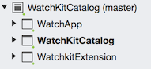

# [Visual Studio](#tab/windows)

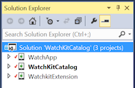

-----

Download and run the [WatchKitCatalog](/samples/xamarin/ios-samples/watchos-watchkitcatalog) sample to get started.
  Screens from the sample can be found on the [Controls](~/ios/watchos/user-interface/index.md)
  page.

## Creating a New Project

You cannot create a new "Watch Solution"... rather you can add
  a Watch App to an existing iOS application. Follow these
  steps to create a watch app:

1. If you don't have
    an existing project, first choose **File > New Solution** and
    create an iOS app (for example, a **Single View App**):

    [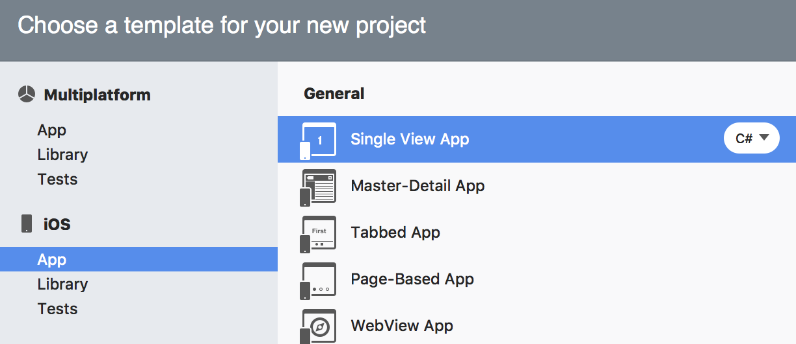](installation-images/cycle8-2.png#lightbox)

2. Once the iOS app is created (or you plan to use your existing iOS app),
    right-click on the solution
    and choose **Add > Add New Project..**. In the **New Project**
    window select **watchOS > App > WatchKit App**:

    [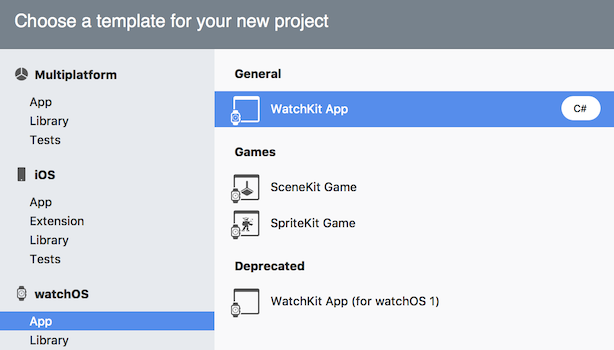](installation-images/cycle8-6.png#lightbox)

3. The next screen lets you choose which iOS app project
    should include the watch app:

    [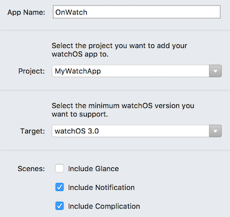](installation-images/cycle8-7.png#lightbox)

4. Finally, choose the location to save the project
    (and optionally enabled source control):

    [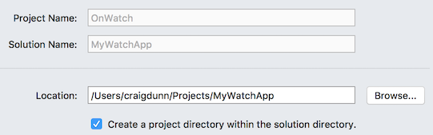](installation-images/cycle8-8.png#lightbox)

5. Visual Studio for Mac automatically configures [project references
    and **Info.plist** settings](~/ios/watchos/get-started/project-references.md) for you.

## Creating the Watch User Interface

<a name="designer"></a>

### Using the Xamarin iOS Designer

Double-click on the watch app's **Interface.storyboard** to edit
  using the iOS Designer. You can drag interface controllers
  and UI controls onto the storyboard from the **Toolbox** and
  configure them using the **Properties** pad:

# [Visual Studio for Mac](#tab/macos)

[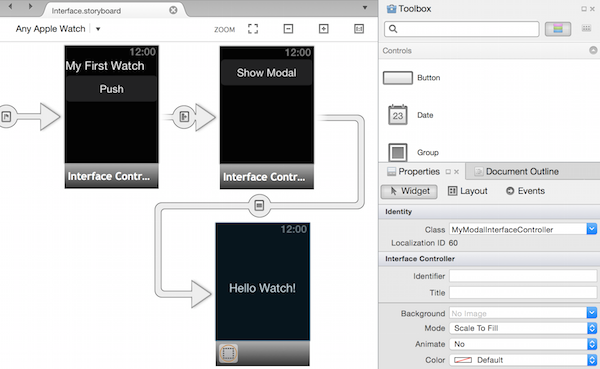](installation-images/iosdesigner.png#lightbox)

# [Visual Studio](#tab/windows)

[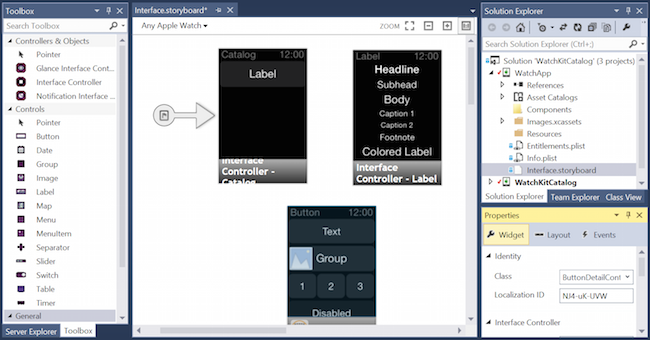](installation-images/iosdesigner-vs.png#lightbox)

-----

You should give each new interface controller a **Class**
  by selecting it and then entering the name in the **Properties**
  pad (this will create the required C# codebehind files automatically):

# [Visual Studio for Mac](#tab/macos)

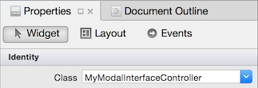

# [Visual Studio](#tab/windows)

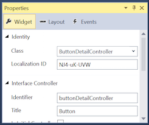

-----

Create segues by **Ctrl + dragging** from a button, table
  or interface controller onto another interface controller.

### Using Xcode on the Mac

# [Visual Studio for Mac](#tab/macos)

You can continue to use Xcode to build your user interface
  by right-clicking on the Interface.storyboard file
  and selecting **Open With > Xcode Interface Builder**:

# [Visual Studio](#tab/windows)

Visual Studio users can also use Xcode to build their user interface
  by switching over to use the Mac Build Host directly.
  Open your solution in Visual Studio for Mac and then
  right-click on the Interface.storyboard file
  and select **Open With > Xcode Interface Builder**:

-----

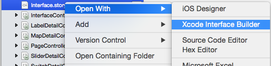

If using Xcode, then you should follow the same steps
  for watch apps as for normal
  [iOS app storyboards](~/ios/user-interface/storyboards/index.md)
  (such as creating outlets and actions by **Ctrl+dragging**
  into the **.h** header file).

When you save the storyboard in Xcode Interface Builder
  it will automatically add the outlets
  and actions you create to the C# **.designer.cs** files
  in the watch extension project.

### Adding Additional Screens in Xcode

When you add additional screens (beyond what
  is included in the template by default) to your
  storyboard using Xcode Interface Builder **you must manually add the C# code
  files** for each new interface controller.

Refer to the [Advanced instructions on how to add
  new interface controllers to a storyboard](~/ios/watchos/troubleshooting.md#add).

*The Xamarin iOS Designer does this automatically, no manual steps are required.*

## Building

A project that includes a watch app builds like other
  iOS projects. The building process will result in an
  iPhone application (.app) that contains a watch
  extension (.appex), which in turn contains the
  code-less watch application (.app).

## Launching

You can launch watch apps in the simulator using either
  Visual Studio for Mac or Visual Studio (starts on the Mac Build Host).

There are two modes for launching a WatchKit app:

- normal app mode (the default), and
- [Notifications](~/ios/watchos/platform/notifications.md)
  (which requires a test notification payload in JSON format).

### Xcode 8 support

Once Xcode 8 (or later) is installed, Apple Watch simulators are separate from
iOS Simulators (unlike [Xcode 6](#xcode6), where they appeared as an *external display*).
When you select the Watch App project and make it the
startup project, the simulator list will show *iOS Simulators* to choose from
(as shown below).

[](installation-images/xs-xcode8-watchos3.png#lightbox)

When you start debugging, *two* simulators should start - the iOS Simulator
*and* the Apple Watch Simulator. Use **Command+Shift+H** to navigate
to the watch menu and clock face; and use the **Hardware** menu to set
the **Force Touch Pressure**. Scrolling on the trackpad or mouse will
simulate using the Digital Crown.

#### Troubleshooting

The following error will appear in the **Application Output** if you try to
launch to a simulator that does not have a paired watch:

```csharp
error MT0000: Unexpected error - Please file a bug report at https://github.com/xamarin/xamarin-macios/issues/new
error HE0020: Could not find a paired Watch device for the iOS device 'iPhone 6'.
```

Refer to [Apple's forums](https://forums.developer.apple.com/thread/7783)
for instructions on configuring the simulators, if the defaults do not
work.

<a name="xcode6"></a>

### Xcode 6 and watchOS 1

You must make the *watch extension project* the **Startup
  Project** before running or debugging the app. You cannot
  "start" the watch app itself, and if you choose the iOS
  app then it will start as normal in the iOS Simulator.

By default a watch app starts in normal **app** mode (not Glance or Notifications mode)
  from Visual Studio for Mac's **Run** or **Debug** commands.

When using Xcode 6, only the iPhone 5, iPhone 5S, iPhone 6, and iPhone 6 Plus
  can activate the external display for either
  **Apple Watch - 38mm** or **Apple Watch - 42mm**
  where the watch applications will be displayed.

> [!NOTE]
> Remember that the watch screen does not
> automatically appear in the iOS Simulator when using Xcode 6.
> Use the **Hardware > External Displays** menu to show the watch screen.

<a name="custommodes"></a>

## Launching Notification Mode

Refer to the [Notifications page](~/ios/watchos/platform/notifications.md) for
information how to handle notifications in code.

Visual Studio for Mac can start the watch app with a notification
  _startup modes_ for notifications:

Right-click on the watch app project and choose
  **Run With > Custom Configuration...**:

[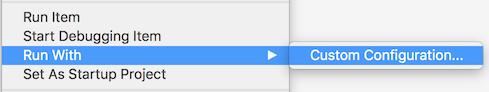](installation-images/runwith-customparams.png#lightbox)

This opens the **Custom Parameters** window where you can select
  **Notification** (and provide a JSON
  payload), then press **Run** to start the watch app in the simulator:

[](installation-images/runwith-execargs.png#lightbox)

## Debugging

Debugging is supported in both Visual Studio for Mac and Visual Studio.
  Remember to supply a notification JSON file when debugging in
  notifications mode. This screenshot shows a debug breakpoint
  being hit in a watch app:

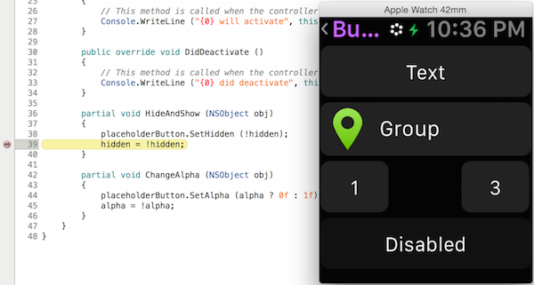

After following the launch instructions you will end up with
  your watch app running on the **iOS Simulator (Watch)**.
  For the notification mode you can select **Debug > Open System Log**
  (**CMD + /**) and use `Console.WriteLine` in your code.

### Debugging Lifecycle Event Handlers

<!--
To test the functionality in your  and 
  methods, use the **Hardware > Lock** command in the iOS Simulator.
  Locking will trigger the `DidDeactivate` method and the watch simulator
  will indicate that it has been locked. Swipe the iOS Simulator to unlock,
  which triggers the `WillActivate` method of the watch app.
-->

The watchOS template files (such as `InterfaceController`,
  `ExtensionDelegate`, `NotificationController`, and `ComplicationController`)
  come with their required lifecycle methods already implemented. Add
  `Console.WriteLine` calls and read the **Application Output** to better
  understand the event lifecycle.

## Related Links

- [WatchKitCatalog (sample)](/samples/xamarin/ios-samples/watchos-watchkitcatalog)
- [First Watch App video](https://blog.xamarin.com/your-first-watch-kit-app/)
- [Apple's WatchKit Documentation](https://developer.apple.com/documentation/watchkit/)