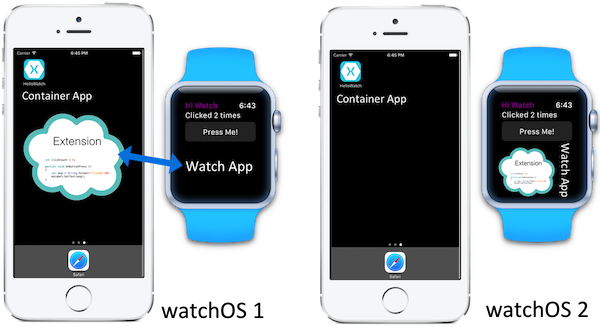
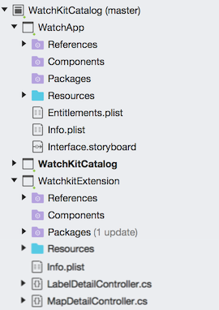
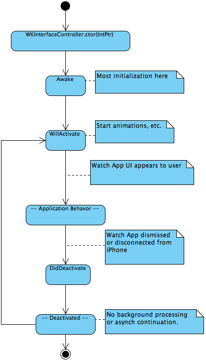
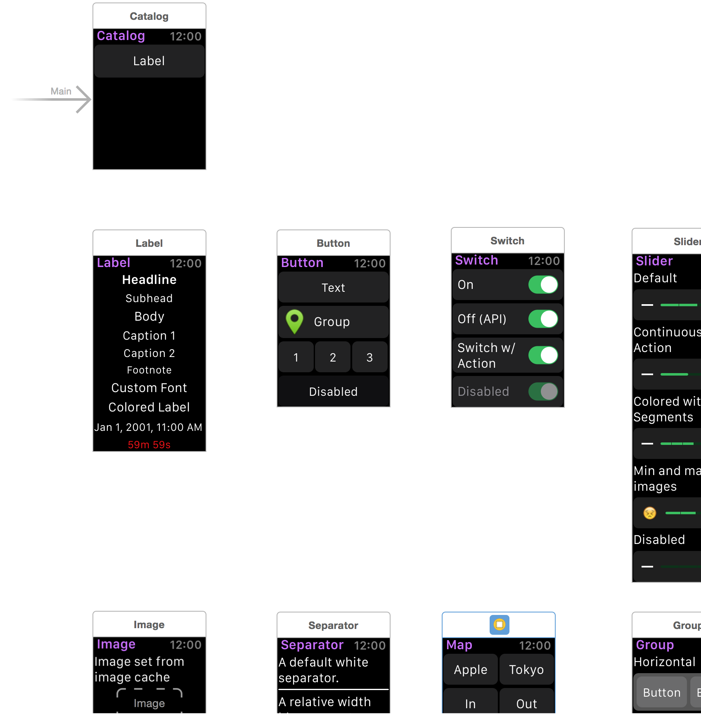
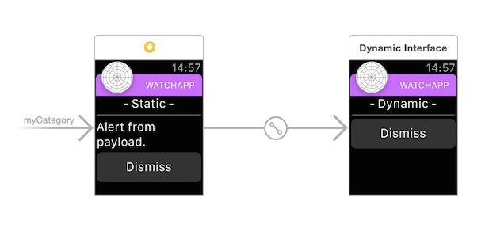

# Introduction to watchOS

> [!NOTE]
> Check out the [Introduction to watchOS 3](~/ios/watchos/platform/introduction-to-watchos3/index.md)
> for an overview of the latest features.

## About watchOS

A watchOS app solution has 3 projects:

- **Watch Extension** – A project that contains the code for the watch app.
- **Watch App** – Contains the user-interface storyboard and resources.
- **iOS Parent App** – This app is a normal iPhone app. The watch app and extension are bundled into the iPhone app for delivery to the user's watch.

In watchOS 1 apps, the code in the extension runs on the iPhone – the
Apple Watch is effectively an external display. watchOS 2 and 3 apps run
entirely on the Apple Watch. This difference is shown in the diagram below:

Regardless of which version of watchOS is targeted, in Visual Studio for Mac’s Solution Pad
a complete solution will look something like this:

The *Parent App* in a watchOS solution is a regular iOS app. This is the only project
in the solution that is visible **on the phone**. Use-cases for this app would
include tutorials, administrative screens, and middle-tier filtering, cacheing, etc.
However, it is possible for the user to install and run the watch app/extension
without **ever** having opened the parent app, so if you need the Parent app to
run for one-time initialization or administration, you need to program your
watch app/extension to tell the user that.

Although the parent app delivers the watch app and extension,
  they run in different sandboxes.

On watchOS 1 they can share data via a
  shared app group or via the static function
  `WKInterfaceController.OpenParentApplication`, which will
  trigger the `UIApplicationDelegate.HandleWatchKitExtensionRequest`
  method in  your parent app’s `AppDelegate`
  (see [working with the Parent app](~/ios/watchos/app-fundamentals/parent-app.md)).

On watchOS 2 or later the Watch Connectivity framework is used
  to communicate with the parent app, using the `WCSession` class.

## Application Lifecycle

In the watch extension, a subclass of the `WKInterfaceController` class
is created for each Storyboard scene.

These `WKInterfaceController` classes are analogous to the `UIViewController`
objects in iOS programming but do not have the same level of access to the view.
For instance, you cannot dynamically add controls to or restructure your UI.
You can, however, hide and reveal controls and, with some controls, change their size,
transparency, and appearance options.

The lifecycle of a `WKInterfaceController` object involves the following calls:

- [Awake](xref:WatchKit.WKInterfaceController.Awake*) : You should perform most of your initialization in this method.
- [WillActivate](xref:WatchKit.WKInterfaceController.WillActivate) : Called shortly before the Watch App appears to the user. Use this method to perform last-moment initialization, start animations, etc.
- At this point, the Watch App appears and the Extension begins responding to user input and updating the Watch App’s display per your application logic.
- [DidDeactivate](xref:WatchKit.WKInterfaceController.DidDeactivate) After the Watch App has been dismissed by the user, this method is called. After this method returns, user interface controls cannot be modified until the next time `WillActivate` is called. This method will also be called if the connection to the iPhone is broken.
- After the extension has been deactivated, it is inaccessible to your program. Pending asynchronous functions **will not** be called. Watch Kit Extensions may not use background processing modes. If the program is reactivated by the user but the app has not been terminated by the operating system, the first method called will be `WillActivate`.

## Types of User Interface

There are three types of interaction the user can have with your watch app.
All are programmed using custom sub-classes of `WKInterfaceController`, so
the previously-discussed lifecycle sequence applies universally (notifications
are programmed with sub-classes of `WKUserNotificationController`, which itself
is a sub-class of `WKInterfaceController`):

### Normal Interaction

The majority of watch app/extension interaction will be with  sub-classes of
`WKInterfaceController` that you write to correspond to scenes in your watch app’s
**Interface.storyboard**. This is covered in detail in the [Installation](~/ios/watchos/get-started/installation.md)
and [Getting Started](~/ios/watchos/get-started/index.md) articles.
The following image shows a portion of the [Watch Kit Catalog](/samples/xamarin/ios-samples/watchos-watchkitcatalog)
sample’s Storyboard. For each scene showed here, there is a corresponding custom
`WKInterfaceController` (`LabelDetailController`, `ButtonDetailController`, `SwitchDetailController`, etc.)
in the extension project.

### Notifications

[Notifications](~/ios/watchos/platform/notifications.md) are a major use-case
  for the Apple Watch. Both local and remote notifications are
  supported. Interaction with notifications occurs in two stages,
  called Short- and Long-Look.

Short Looks are displayed briefly and show the watch app icon, its name, and
the Title (as specified with `WKInterfaceController.SetTitle`).

The Long Look combines a system-provided **sash** area and Dismiss button with
your custom Storyboard-based content.

`WKUserNotificationInterfaceController` extends `WKInterfaceController` with the
methods `DidReceiveLocalNotification` and `DidReceiveRemoteNotification`.
Override these methods to react to notification events.

For more information on Notification UI design, refer to the
[Apple Watch Human Interface Guidelines](https://developer.apple.com/design/human-interface-guidelines/designing-for-watchos)

## Screen Sizes

The Apple Watch has two face sizes: 38mm and 42mm, both with a 5:4 display ratio,
  and a Retina display. Their useable sizes are:

- 38mm: 136 x 170 logical pixels (272 x 340 physical pixels)
- 42mm: 156 x 195  logical pixels (312 x 390  physical pixels).

Use `WKInterfaceDevice.ScreenBounds` to determine on which
  display your Watch App is running.

Generally, it’s easier to develop your text and layout design
  with the more constrained 38mm display and then scale up.
  If you start with the larger environment, scaling down may
  lead to ugly overlap or text truncation.

Read more about [working with screen sizes](~/ios/watchos/app-fundamentals/screen-sizes.md).

## Limitations of watchOS

There are some limitations of watchOS to be aware of when developing watchOS apps:

- Apple Watch devices have limited storage - be aware of the available
  space before downloading large files (eg. audio or movie files).

- Many watchOS [controls](~/ios/watchos/user-interface/index.md) have analogues in UIKit, but are different
  classes (`WKInterfaceButton` rather than `UIButton`, `WKInterfaceSwitch`
  for `UISwitch`, etc.) and have a limited set of methods compared
  to their UIKit equivalents. Additionally, watchOS has some controls
  such as `WKInterfaceDate` (for displaying a date and time) that UIKit does not have.

  - You cannot route notifications to the Watch only, or the iPhone
    only (what kind of control the user has over routing has not been announced by Apple).

Some other known limitations / frequently asked questions:

- Apple will not allow 3rd-party custom watch faces.

- The APIs that allow the Watch to control iTunes on the connected phone are private.

## Further Reading

Check out the documentation from Apple:

- [Developing for Watch Kit](https://developer.apple.com/library/prerelease/ios/documentation/General/Conceptual/WatchKitProgrammingGuide/index.html#//apple_ref/doc/uid/TP40014969-CH8-SW1)

- [Watch Kit Programming Guide](https://developer.apple.com/library/prerelease/ios/documentation/General/Conceptual/WatchKitProgrammingGuide/DesigningaWatchKitApp.html)

- [Apple Watch Human Interface Guidelines](https://developer.apple.com/design/human-interface-guidelines/designing-for-watchos)

## Related Links

- [watchOS 3 Catalog (sample)](/samples/xamarin/ios-samples/watchos-watchkitcatalog)
- [watchOS 1 Catalog (sample)](/samples/xamarin/ios-samples/watchos-watchkitcatalog)
- [Setup and Install](~/ios/watchos/get-started/installation.md)
- [First Watch App video](https://blog.xamarin.com/your-first-watch-kit-app/)
- [Apple's Developing for Watch Kit guide](https://developer.apple.com/library/prerelease/ios/documentation/General/Conceptual/WatchKitProgrammingGuide/index.html)
- [Apple's WatchKit Documentation](https://developer.apple.com/documentation/watchkit/)
- [Introduction to watchOS 3](~/ios/watchos/platform/introduction-to-watchos3/index.md)