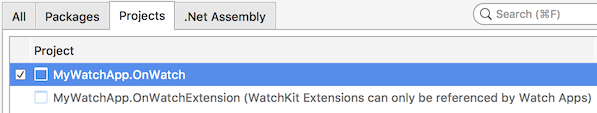
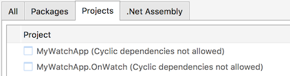
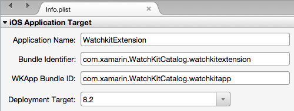
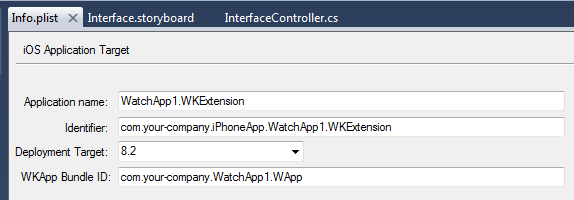
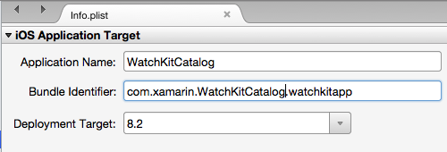

# watchOS Project References in Xamarin

_Explanation of the relationship between the iOS app, watch app, and watch extension._

The three projects in a watchOS solution are *automatically configured* to reference each other
	in a specific way for watchOS 3 apps to be
	built and bundled correctly. These project references and bundle identifier settings
	are described below for reference.

## Project References

View the references by double-clicking on the References
	nodes for each project:

- **iPhone app** references **Watch App**

- **Watch App** references **Watch App Extension**

 - The **Watch App Extension** does not reference either of the other projects

## Bundle Identifiers

You also need to make sure your **Bundle Identifiers** are correct.
	All three projects should have the *same* identifier prefix,
	with the two watch projects having predefined extensions of
	`watchkitextension` and `watchkitapp`, as follows
	(for the **WatchKitCatalog** example):

 - Xamarin.iOS Unified project - `com.xamarin.WatchKitCatalog`

 - WatchKit Extension project  - `com.xamarin.WatchKitCatalog.watchkitextension`

 - Watch App project - `com.xamarin.WatchKitCatalog.watchkitapp`

Also make sure that these **Info.plist** settings are correct:

 - The Watch App project's
	`WKCompanionAppBundleIdentifier` matches the parent/container
	app's Bundle ID (ie. the one that runs on the iPhone);

 - The Watch Kit Extension project's
	**WKApp Bundle ID** matches the Watch App project’s
	Bundle ID.

You can edit the identifiers by double-clicking
	on the **Info.plist** file in each project.

This screenshot
	is the **Watch Extension's** Info.plist file, showing the
	**Watch App's** identifier as well:

# [Visual Studio for Mac](#tab/macos)
	

# [Visual Studio](#tab/windows)
	

-----

This screenshot is the **Watch App's** Info.plist file.
	The current **Watch OS** version is 8.2, so the
	**Deployment Target** for the Watch App should be
	**8.2**. Note that if you have Xcode 6.3 installed,
	this value might be set to 8.3 - you should change
	it 8.2.

The deployment target for the Watch App can be
	different from the Watch Extension and iOS App.

