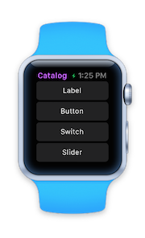
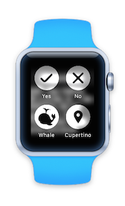
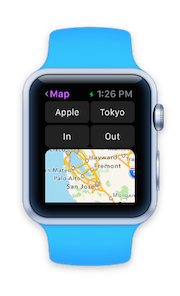

# Building watchOS Apps with Xamarin

  

<!-- watch images courtesy of http://infinitapps.com/bezel/ -->

## [Getting Started](~/ios/watchos/get-started/index.md)

* [Introduction to watchOS](~/ios/watchos/get-started/intro-to-watchos.md).
* [Installation info](~/ios/watchos/get-started/installation.md).
* Build your [first watchOS app](~/ios/watchos/get-started/hello-watch.md) using Xamarin.

## [User Interface](~/ios/watchos/user-interface/index.md)

Brief overview of the controls included in the Watch Kit Catalog sample app, including the
    [image](~/ios/watchos/user-interface/image.md),
    [table](~/ios/watchos/user-interface/menu.md)
    [menu](~/ios/watchos/user-interface/menu.md), and
    [text input](~/ios/watchos/user-interface/text-input.md) controls.

## [Platform Features](platform/index.md)

How to include watchOS-specific features like
[Notifications](~/ios/watchos/platform/notifications.md) and
[Complications](~/ios/watchos/platform/complications.md) into watch apps.

## [App Fundamentals](~/ios/watchos/app-fundamentals/index.md)

Working with different aspects of the watchOS API, including
    the [parent application](~/ios/watchos/app-fundamentals/parent-app.md),
    [icons](~/ios/watchos/app-fundamentals/icons.md),
    [layout](~/ios/watchos/app-fundamentals/layout.md),
    [navigation](~/ios/watchos/app-fundamentals/navigation.md),
    [screen sizes](~/ios/watchos/app-fundamentals/screen-sizes.md), and
    [settings](~/ios/watchos/app-fundamentals/settings.md).

## [Deployment and Testing](~/ios/watchos/deploy-test/index.md)

Checklist and instructions to deploy Apple Watch apps test devices, and to the App Store.

## [Troubleshooting](~/ios/watchos/troubleshooting.md)

Known issues and workarounds.

## [Xamarin watchOS on Q&A](/answers/topics/dotnet-watchos.html)

Ask questions about building and deploying watchOS applications with Xamarin.

## [API Documentation](xref:WatchKit)

Class and method coverage of the Watch Kit API.
