# watchOS Background Tasks in Xamarin

With watchOS 3, there are three main ways that a watch app can keep its information up-to-date:

- Using one of the several new background tasks.
- Having one of its Complications on the watch face (giving it extra time to update).
- Having the user pin to app to the new Dock (where its kept in memory and updated often).

## Keeping an App Up-To-Date

Before discussing all of the ways a developer can keep a watchOS app's data and User Interface current and updated, this section will take a look at a typical set of use patterns and how a user might move between their iPhone and their Apple Watch throughout the day based on the time of day and the activity they are currently doing (such as driving).

Take the following example:

[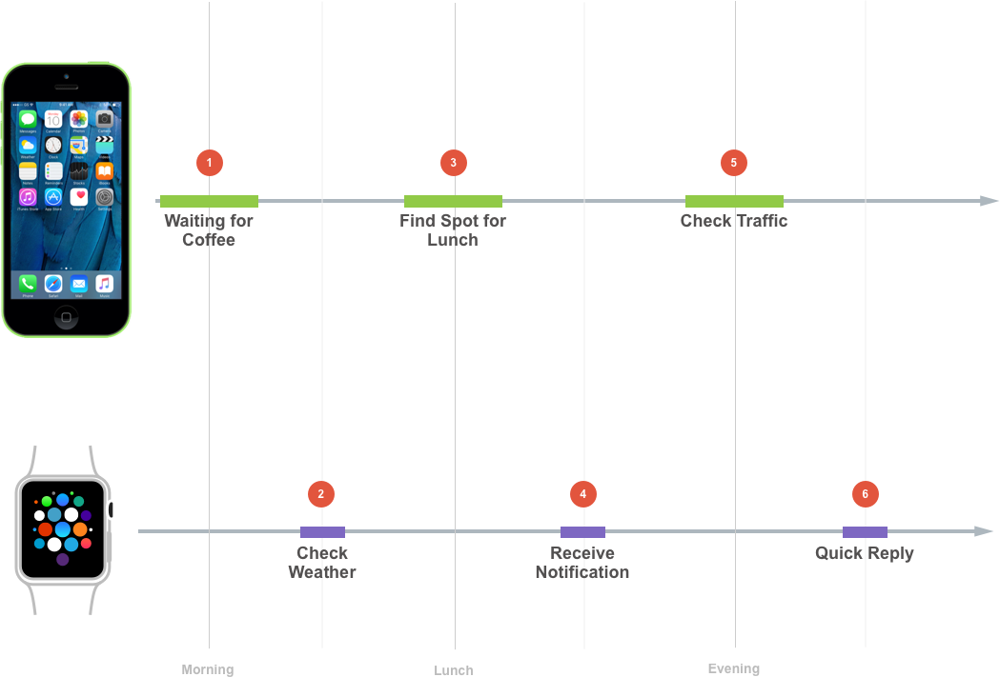](background-tasks-images/update00.png#lightbox)

1. In the morning, while waiting in line for a coffee, the user browses the current news on their iPhone for several minutes.
2. Before leaving the coffee shop, they quickly check the weather with a Complication on their watch face.
3. Before lunch, they use the Maps app on the iPhone to find an nearby restaurant and book a reservation to meet a client.
4. While traveling to the restaurant, they get a notification on their Apple Watch and with a quick glance, they know their lunch appointment is running late.
5. In the evening, they use the Maps app on the iPhone to check traffic before driving home.
6. On the way home, they receive an iMessage notification on their Apple Watch asking them to pick up some milk and they use the Quick Reply feature to send the response "OK".

Because of the "quick glance" (less than three seconds) nature of how a user is wanting to use an Apple Watch app, there typically isn't enough time for the app to fetch desired information and update its UI before displaying it to the user.

By using the new APIs Apple has included in watchOS 3, the app can schedule for a _Background Refresh_ and have the desired information ready before the user requests it. Take the example of the Weather Complication discussed above:

[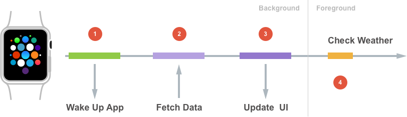](background-tasks-images/update01.png#lightbox)

1. The app schedules to be woken up by the system at a specific time.
2. The app fetches the information that it will require to generate the update.
3. The app regenerates its User Interface to reflect the new data.
4. When the user glances at the app's Complication, it has up-to-date information without the user having to wait for the update.

As seen above, the watchOS system wakes the app using one or more Tasks, of which it has a very limited pool available:

[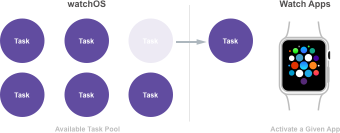](background-tasks-images/update02.png#lightbox)

Apple suggest making the most of this Task (since it is such a limited resource to the app) by holding onto it until the app has finished the process of updating itself.

The system delivers these Tasks by calling the new `HandleBackgroundTasks` method of the `WKExtensionDelegate` delegate. For example:

```csharp
using System;
using Foundation;
using WatchKit;

namespace MonkeyWatch.MonkeySeeExtension
{
  public class ExtensionDelegate : WKExtensionDelegate
  {
    #region Constructors
    public ExtensionDelegate ()
    {
    }
    #endregion

    #region Override Methods
    public override void HandleBackgroundTasks (NSSet<WKRefreshBackgroundTask> backgroundTasks)
    {
      // Handle background request here
      ...
    }
    #endregion
  }
}
```

When the app has finished the given Task, it returns it to the system by marking it completed:

[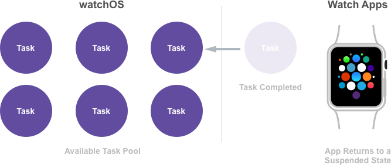](background-tasks-images/update03.png#lightbox)

<a name="New-Background-Tasks"></a>

## New Background Tasks

watchOS 3 introduces several background tasks that an app can use to update its information ensuring that it has the content the user needs before they open the app, such as:

- **Background App Refresh** - The [WKApplicationRefreshBackgroundTask](https://developer.apple.com/reference/watchkit/wkapplicationrefreshbackgroundtask) task allows the app to update its state in the background. Typically this will include another task such as downloading new content from the internet using a [NSUrlSession](https://developer.apple.com/reference/foundation/nsurlsession).
- **Background Snapshot Refresh** - The [WKSnapshotRefreshBackgroundTask](https://developer.apple.com/reference/watchkit/wksnapshotrefreshbackgroundtask) task allows the app to update both its content and UI before the system takes a snapshot that will be used to populate the Dock.
- **Background Watch Connectivity** - The [WKWatchConnectivityRefreshBackgroundTask](https://developer.apple.com/reference/watchkit/wkwatchconnectivityrefreshbackgroundtask) task is started for the app when it receives background data from the paired iPhone.
- **Background URL Session** - The [WKURLSessionRefreshBackgroundTask](https://developer.apple.com/reference/watchkit/wkurlsessionrefreshbackgroundtask) task is started for the app when a background transfer requires authorization or completes (successfully or in error).

These Tasks will be covered in detail in the sections below.

<a name="WKApplicationRefreshBackgroundTask"></a>

### WKApplicationRefreshBackgroundTask

The `WKApplicationRefreshBackgroundTask` is a generic Task that can be scheduled to have the app woken at a future date:

[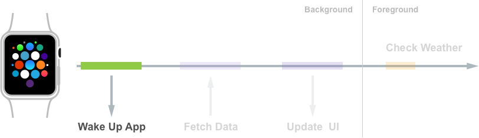](background-tasks-images/update04.png#lightbox)

Within the runtime of the Task, the app can do any kind of local processing such as update a Complication timeline or fetch some required data with a `NSUrlSession`.

<a name="WKURLSessionRefreshBackgroundTask"></a>

### WKURLSessionRefreshBackgroundTask

The system will send a `WKURLSessionRefreshBackgroundTask` when the data has finished downloading and ready to be processed by the app:

[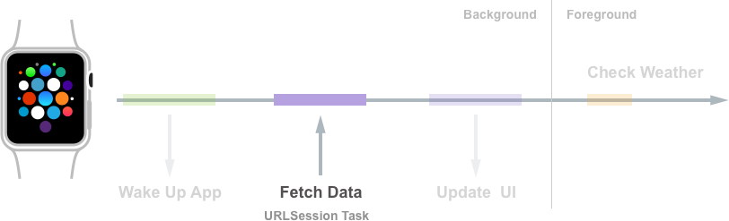](background-tasks-images/update05.png#lightbox)

An app is not left running while data is downloading in the background. Instead, the app schedules the request for data, then it is suspended and the system handles the downloading of the data, only reawakening the app when the download is complete.

<a name="WKSnapshotRefreshBackgroundTask"></a>

### WKSnapshotRefreshBackgroundTask

In watchOS 3, Apple has added the Dock where users can pin their favorite apps and quickly access them. When the user presses the Side Button on the Apple Watch, a gallery of pinned app Snapshots will be displayed. The user can swipe left or right to find the desired app, then tap the app to launch it replacing the Snapshot with the running app's interface.

[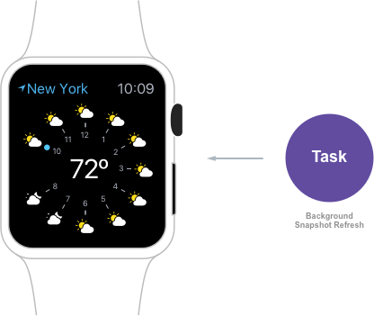](background-tasks-images/update06.png#lightbox)

The system periodically takes snapshots of the app's UI (by sending a `WKSnapshotRefreshBackgroundTask`) and uses those snapshots to populate the Dock. watchOS gives the app the opportunity to update its content and UI before this Snapshot is taken.

Snapshots are very important in watchOS 3 since they function as both the preview and launch images for the app. If the user settles on an app in the Dock, it will expand to full screen, enter the foreground and start running, so it is imperative that the Snapshot be up-to-date:

[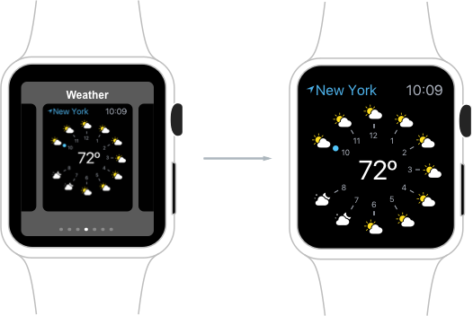](background-tasks-images/update07.png#lightbox)

Again, the system will issue a `WKSnapshotRefreshBackgroundTask` so that the app can prepare (by updating the data and the UI) before the snapshot is taken:

[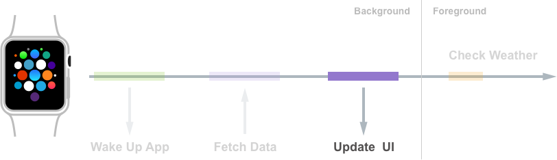](background-tasks-images/update08.png#lightbox)

When the app marks the `WKSnapshotRefreshBackgroundTask` completed, the system will automatically take a Snapshot of the app's UI.

> [!IMPORTANT]
> It is important to always schedule a `WKSnapshotRefreshBackgroundTask` after the app has received new data and updated its User Interface or the user will not see the modified information.

Additionally, when the user receives a notification from the app and taps it to bring the app to the foreground, the Snapshot needs to be up-to-date since it is acting as the launch screen as well:

[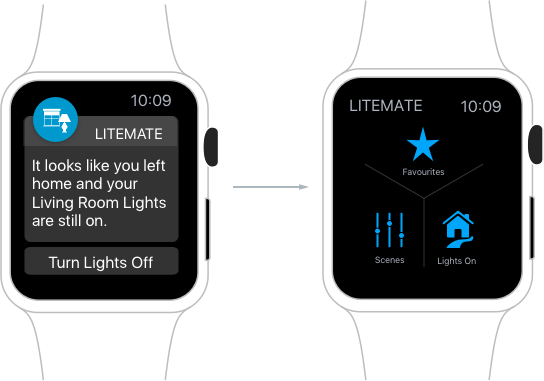](background-tasks-images/update09.png#lightbox)

If it has been more than one hour since the user has interacted with a watchOS app, it will be able to return to its Default State. The Default State can mean different things to different apps and, based on the design of an app, it might not have a Default State at all.

<!--TODO - Possibly link to Apple's Designing Great Apple Watch Experiences video or add our own version here...-->

<a name="WKWatchConnectivityRefreshBackgroundTask"></a>

### WKWatchConnectivityRefreshBackgroundTask

In watchOS 3, Apple has integrated watch connectivity with the Background Refresh API via the new `WKWatchConnectivityRefreshBackgroundTask`. Using this new feature, an iPhone app can deliver fresh data to its watch app counterpart, while the watchOS app is running in the background:

[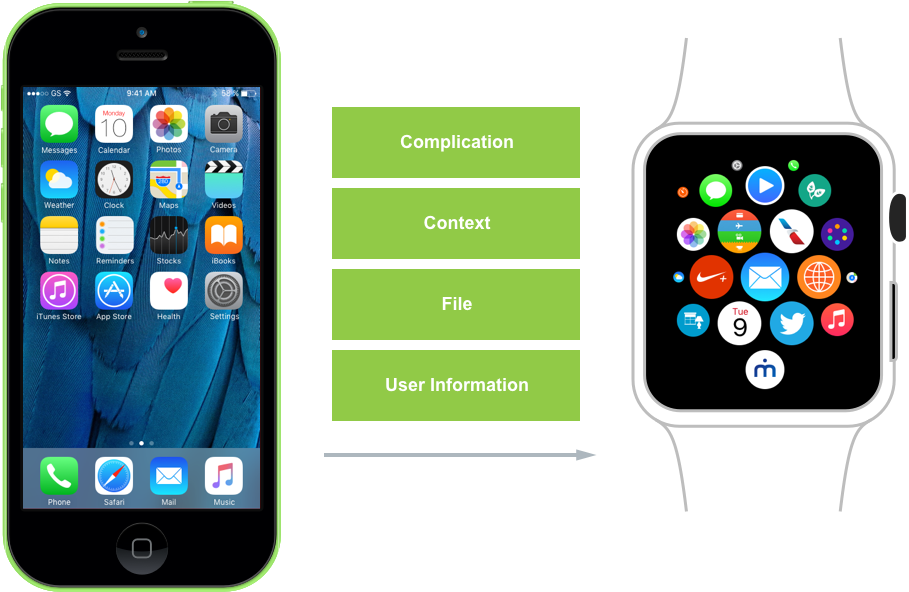](background-tasks-images/update10.png#lightbox)

Initiating a Complication Push, App Context, sending a file or updating User Information from the iPhone app will wake the Apple Watch app in the background.

When the watch app is woken via a `WKWatchConnectivityRefreshBackgroundTask` it will need to use the standard API methods to receive the data from the iPhone app.

[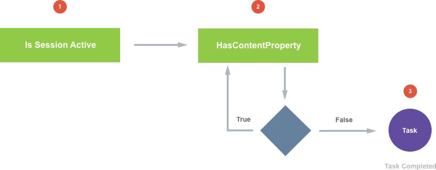](background-tasks-images/update11.png#lightbox)

1. Ensure that the Session has activated.
2. Monitor the new `HasContentPending` property as long as the value is `true`, the app still has data to process. As before, the app should hold onto the Task until it has finished processing all data.
3. When there is no more data to be processed (`HasContentPending = false`), mark the Task completed to return it to the system. Failing to do this will exhaust the app's allotted background runtime resulting in a crash report.

<a name="The-Background-API-Lifecycle"></a>

## The Background API Lifecycle

Placing all of the pieces of the new Background Tasks API together, a typical set of interactions would look like the following:

[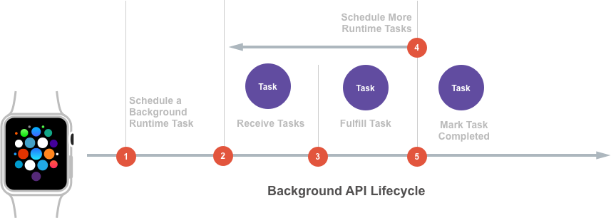](background-tasks-images/update12.png#lightbox)

1. First, the watchOS app schedules a background Task to be awoke as some point in the future.
2. The app is woken by the system and sent a Task.
3. The app processes the Task to complete whatever work was required.
4. As a result of processing the Task, the app may need to schedule more background Tasks to complete more work in the future, such as downloading more content using a `NSUrlSession`.
5. The app marks the Task completed and returns it to the system.

<a name="Using-Resources-Responsibly"></a>

## Using Resources Responsibly

It is critical that a watchOS app behaves responsibly within this ecosystem by limiting its drain on the system's shared resources.

Take a look at the following scenario:

[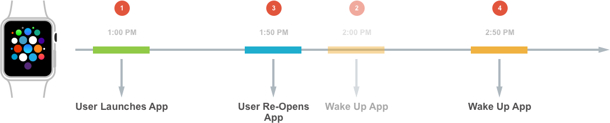](background-tasks-images/update13.png#lightbox)

1. The user launches a watchOS app at 1:00 PM.
2. The app schedules a task to wake up and download new content in an hour at 2:00 PM.
3. At 1:50 PM the user re-opens the app which allows it to update its data and UI at this time.
4. Instead of letting the Task wake the app again in 10 minutes, the app should reschedule the Task to run an hour later at 2:50 PM.

While every app is different, Apple suggests finding patterns of usage, like those shown above, to help conserve system resources.

<a name="Implementing-Background-Tasks"></a>

## Implementing Background Tasks

For the sake of example, this document will use the fake MonkeySoccer sports app that reports soccer scores to the user.

Take a look at the following typical usage scenario:

[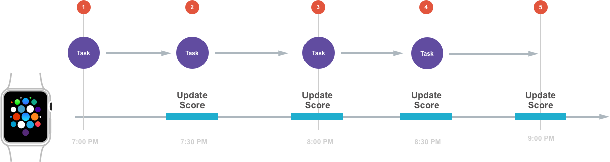](background-tasks-images/update14.png#lightbox)

The user's favorite soccer team is playing a big match from 7:00 PM to 9:00 PM so the app should expect the user to be checking the score regularly and it decides on a 30 minute update interval.

1. The user opens the app and it schedules a Task for background update 30 minutes later. The Background API allows only one type of background Task to be running at a given time.
2. The app receives the Task and updates its data and UI, then schedules for another background Task 30 minutes later. It is important that the developer remembers to schedule another background Task, or the app will never be re-awoken to get more updates.
3. Again, the app receives the Task and updates its data, updates its UI and schedules another background Task 30 minutes later.
4. The same process repeats again.
5. The last background Task is received and the app again updates its data and UI. Since this is the final score it doesn't schedule for a new background refresh.

<a name="Scheduling-for-Background-Update"></a>

## Scheduling for Background Update

Given the above scenario, the MonkeySoccer app can use the following code to schedule for a background update:

```csharp
private void ScheduleNextBackgroundUpdate ()
{
  // Create a fire date 30 minutes into the future
  var fireDate = NSDate.FromTimeIntervalSinceNow (30 * 60);

  // Create
  var userInfo = new NSMutableDictionary ();
  userInfo.Add (new NSString ("LastActiveDate"), NSDate.FromTimeIntervalSinceNow(0));
  userInfo.Add (new NSString ("Reason"), new NSString ("UpdateScore"));

  // Schedule for update
  WKExtension.SharedExtension.ScheduleBackgroundRefresh (fireDate, userInfo, (error) => {
    // Was the Task successfully scheduled?
    if (error == null) {
      // Yes, handle if needed
    } else {
      // No, report error
    }
  });
}
```

It creates a new `NSDate` 30 minutes into the future when the app wants to be awoken and creates a `NSMutableDictionary` to hold the details of the requested Task. The `ScheduleBackgroundRefresh` method of the `SharedExtension` is used to request the task be scheduled.

The system will return a `NSError` if it was unable to schedule the requested Task.

<a name="Processing-the-Update"></a>

## Processing the Update

Next, take a closer look at the 5 minute window showing the steps required to update the score:

[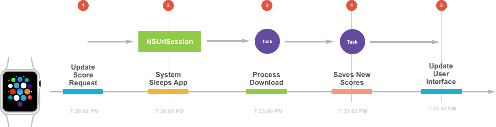](background-tasks-images/update15.png#lightbox)

1. At 7:30:02 PM the app is awakened by the system and given the update background Task. Its first priority is to get the latest scores from the server. See [Scheduling a NSUrlSession](#Scheduling-a-NSUrlSession) below.
2. At 7:30:05 the app completes the original Task, the system puts the app to sleep and continues to download the requested data in the background.
3. When the system completes the download, it creates a new Task to wake the app so it can process the downloaded information. See [Handling Background Tasks](#Handling-Background-Tasks) and [Handling the Download Completing](#Handling-the-Download-Completing) below.
4. The app saves the updated information and marks the Task completed. The developer may be tempted to update the app's User Interface at this time, however Apple suggests scheduling a Snapshot Task to handle that process. See [Scheduling a Snapshot Update](#Scheduling-a-Snapshot-Update) below.
5. The app receives the Snapshot Task, updates its User Interface and marks the Task completed. See [Handling a Snapshot Update](#Handling-a-Snapshot-Update) below.

<a name="Scheduling-a-NSUrlSession"></a>

## Scheduling a NSUrlSession

The following code can be used to schedule the downloading of the latest scores:

```csharp
private void ScheduleURLUpdateSession ()
{
  // Create new configuration
  var configuration = NSUrlSessionConfiguration.CreateBackgroundSessionConfiguration ("com.example.urlsession");

  // Create new session
  var backgroundSession = NSUrlSession.FromConfiguration (configuration);

  // Create and start download task
  var downloadTask = backgroundSession.CreateDownloadTask (new NSUrl ("https://example.com/gamexxx/currentScores.json"));
  downloadTask.Resume ();
}
```

It configures and creates a new `NSUrlSession`, then uses that session to create a new download Task using the `CreateDownloadTask` method. It calls the `Resume` method of the download Task to start the session.

<a name="Handling-Background-Tasks"></a>

## Handling Background Tasks

By overriding the `HandleBackgroundTasks` method of the `WKExtensionDelegate`, the app can handle the incoming background tasks:

```csharp
using System;
using System.Collections.Generic;
using Foundation;
using WatchKit;

namespace MonkeySoccer.MonkeySoccerExtension
{
  public class ExtensionDelegate : WKExtensionDelegate
  {
    #region Computed Properties
    public List<WKRefreshBackgroundTask> PendingTasks { get; set; } = new List<WKRefreshBackgroundTask> ();
    #endregion

    ...

    #region Public Methods
    public void CompleteTask (WKRefreshBackgroundTask task)
    {
      // Mark the task completed and remove from the collection
      task.SetTaskCompleted ();
      PendingTasks.Remove (task);
    }
    #endregion

    #region Override Methods
    public override void HandleBackgroundTasks (NSSet<WKRefreshBackgroundTask> backgroundTasks)
    {
      // Handle background request
      foreach (WKRefreshBackgroundTask task in backgroundTasks) {
        // Is this a background session task?
        var urlTask = task as WKUrlSessionRefreshBackgroundTask;
        if (urlTask != null) {
          // Create new configuration
          var configuration = NSUrlSessionConfiguration.CreateBackgroundSessionConfiguration (urlTask.SessionIdentifier);

          // Create new session
          var backgroundSession = NSUrlSession.FromConfiguration (configuration, new BackgroundSessionDelegate (this, task), null);

          // Keep track of all pending tasks
          PendingTasks.Add (task);
        } else {
          // Ensure that all tasks are completed
          task.SetTaskCompleted ();
        }
      }
    }
    #endregion

    ...
  }
}
```

The `HandleBackgroundTasks` method cycles through all of the Tasks that the system has sent the app (in `backgroundTasks`) searching for a `WKUrlSessionRefreshBackgroundTask`. If one is found, it rejoins the session and attaches a `NSUrlSessionDownloadDelegate` to handle the download completing (see [Handling the Download Completing](#Handling-the-Download-Completing) below):

```csharp
// Create new session
var backgroundSession = NSUrlSession.FromConfiguration (configuration, new BackgroundSessionDelegate (this, task), null);
```

It keeps a handle on the Task until it has completed by adding it to a collection:

```csharp
public List<WKRefreshBackgroundTask> PendingTasks { get; set; } = new List<WKRefreshBackgroundTask> ();
...

// Keep track of all pending tasks
PendingTasks.Add (task);
```

All of the Tasks sent to the app need to be completed, for any task not currently being handled, mark it complete:

```csharp
if (urlTask != null) {
  ...
} else {
  // Ensure that all tasks are completed
  task.SetTaskCompleted ();
}
```

<a name="Handling-the-Download-Completing"></a>

## Handling the Download Completing

The MonkeySoccer app uses the following `NSUrlSessionDownloadDelegate` delegate to handle the download completing and process the requested data:

```csharp
using System;
using Foundation;
using WatchKit;

namespace MonkeySoccer.MonkeySoccerExtension
{
  public class BackgroundSessionDelegate : NSUrlSessionDownloadDelegate
  {
    #region Computed Properties
    public ExtensionDelegate WatchExtensionDelegate { get; set; }

    public WKRefreshBackgroundTask Task { get; set; }
    #endregion

    #region Constructors
    public BackgroundSessionDelegate (ExtensionDelegate extensionDelegate, WKRefreshBackgroundTask task)
    {
      // Initialize
      this.WatchExtensionDelegate = extensionDelegate;
      this.Task = task;
    }
    #endregion

    #region Override Methods
    public override void DidFinishDownloading (NSUrlSession session, NSUrlSessionDownloadTask downloadTask, NSUrl location)
    {
      // Handle the downloaded data
      ...

      // Mark the task completed
      WatchExtensionDelegate.CompleteTask (Task);

    }
    #endregion
  }
}
```

When initialized, it keeps a handle to both the `ExtensionDelegate` and the `WKRefreshBackgroundTask` that spawned it. It overrides the `DidFinishDownloading` method to handle the download completing. Then uses the `CompleteTask` method of the `ExtensionDelegate` to inform the Task that it has completed and remove it from the collection of pending tasks. See [Handling Background Tasks](#Handling-Background-Tasks) above.

<a name="Scheduling-a-Snapshot-Update"></a>

## Scheduling a Snapshot Update

The following code can be used to schedule a Snapshot Task to update the UI with the latest scores:

```csharp
private void ScheduleSnapshotUpdate ()
{
  // Create a fire date of now
  var fireDate = NSDate.FromTimeIntervalSinceNow (0);

  // Create user info dictionary
  var userInfo = new NSMutableDictionary ();
  userInfo.Add (new NSString ("lastActiveDate"), NSDate.FromTimeIntervalSinceNow (0));
  userInfo.Add (new NSString ("reason"), new NSString ("UpdateScore"));

  // Schedule for update
  WKExtension.SharedExtension.ScheduleSnapshotRefresh (fireDate, userInfo, (error) => {
    // Was the Task successfully scheduled?
    if (error == null) {
      // Yes, handle if needed
    } else {
      // No, report error
    }
  });
}
```

Just like `ScheduleURLUpdateSession` method above, it creates a new `NSDate` for when the app wants to be awoken and creates a `NSMutableDictionary` to hold the details of the requested Task. The `ScheduleSnapshotRefresh` method of the `SharedExtension` is used to request the task be scheduled.

The system will return a `NSError` if it was unable to schedule the requested Task.

<a name="Handling-a-Snapshot-Update"></a>

## Handling a Snapshot Update

To handle the Snapshot Task, the `HandleBackgroundTasks` method (see [Handling Background Tasks](#Handling-Background-Tasks) above) is modified to look like the following:

```csharp
public override void HandleBackgroundTasks (NSSet<WKRefreshBackgroundTask> backgroundTasks)
{
  // Handle background request
  foreach (WKRefreshBackgroundTask task in backgroundTasks) {
    // Take action based on task type
    if (task is WKUrlSessionRefreshBackgroundTask) {
      var urlTask = task as WKUrlSessionRefreshBackgroundTask;

      // Create new configuration
      var configuration = NSUrlSessionConfiguration.CreateBackgroundSessionConfiguration (urlTask.SessionIdentifier);

      // Create new session
      var backgroundSession = NSUrlSession.FromConfiguration (configuration, new BackgroundSessionDelegate (this, task), null);

      // Keep track of all pending tasks
      PendingTasks.Add (task);
    } else if (task is WKSnapshotRefreshBackgroundTask) {
      var snapshotTask = task as WKSnapshotRefreshBackgroundTask;

      // Update UI
      ...

      // Create a expiration date 30 minutes into the future
      var expirationDate = NSDate.FromTimeIntervalSinceNow (30 * 60);

      // Create user info dictionary
      var userInfo = new NSMutableDictionary ();
      userInfo.Add (new NSString ("lastActiveDate"), NSDate.FromTimeIntervalSinceNow (0));
      userInfo.Add (new NSString ("reason"), new NSString ("UpdateScore"));

      // Mark task complete
      snapshotTask.SetTaskCompleted (false, expirationDate, userInfo);
    } else {
      // Ensure that all tasks are completed
      task.SetTaskCompleted ();
    }
  }
}
```

The method tests for the type of Task being processed. If it is a `WKSnapshotRefreshBackgroundTask` it gains access to the task:

```csharp
var snapshotTask = task as WKSnapshotRefreshBackgroundTask;
```

The method updates the User Interface then creates a `NSDate` to tell the system when the Snapshot will be stale. It creates a `NSMutableDictionary` with user info to describe the new Snapshot and marks the Snapshot Task completed with this information:

```csharp
// Mark task complete
snapshotTask.SetTaskCompleted (false, expirationDate, userInfo);
```

Additionally, it also tells the Snapshot Task that the app is not returning to the Default State (in the first parameter). Apps that have no concept of a Default State should always set this property to `true`.

<a name="Working-Efficiently"></a>

## Working Efficiently

As seen in the above example of the five minute window that the MonkeySoccer app took to update its scores, by working efficiently and using the new watchOS 3 background Tasks, the app was only active for a total of 15 seconds:

[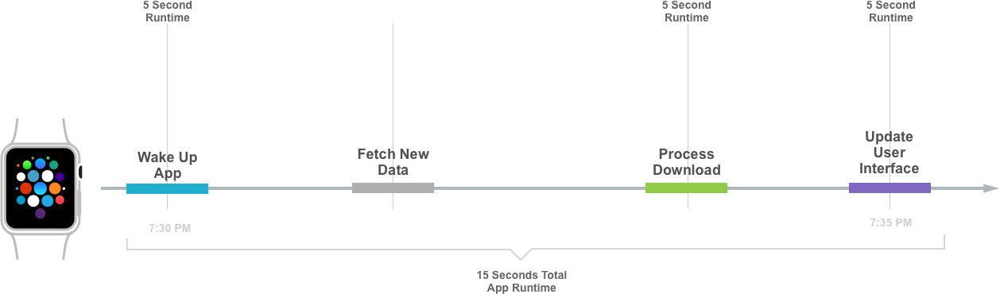](background-tasks-images/update16.png#lightbox)

This lowers the impact that the app will have on both available Apple Watch resources and battery life and also allows the app to work better with other apps running on the watch.

<a name="How-Scheduling-Works"></a>

## How Scheduling Works

While a watchOS 3 app is in the foreground, it is always scheduled to run and can do any type of processing required such as update data or redraw its UI. When the app moves into the background, it is usually suspended by the system and all runtime operations are halted.

While the app is in the background, it may be targeted by the system to quickly run a specific task. So, in watchOS 2, the system might temporarily wake a background app to do things like handling a long look notification or to update the app's Complication. In watchOS 3, there are several new ways that an app can be run in the background.

While an app is in the background, the system imposes several limits on it:

- It is only given a few seconds to complete any given task. The system takes into consideration not only the amount of time passed but also how much CPU power the app is consuming to derive this limit.
- Any app that exceeds its limits will be killed with the following error codes:
  - **CPU** - 0xc51bad01
  - **Time** - 0xc51bad02
- The system will impose different limits based on the type of Background Task it has asked the app to perform. For example, `WKApplicationRefreshBackgroundTask` and `WKURLSessionRefreshBackgroundTask` Tasks are given slightly longer runtimes over other types of Background Tasks.

<a name="Complications-and-App-Updates"></a>

### Complications and App Updates

In addition to the new Background Tasks that Apple has added to watchOS 3, a watchOS app's Complications can have an affect on how and when the app receives background updates.

Complications are small visual elements that provide useful information at a glance. Depending on the watch face selected, the user has the ability to customize a watch face with one or more Complication that can be supplied by a watch app in watchOS 3.

If the user includes one of the app's Complications on their watch face, it gives the app the following updated benefits:

- It causes the system to keep the app in a ready-to-launch state, where it attempts to launch the app in the background, keeps it in memory and gives it extra time to update.
- Complications are guaranteed at least 50 push updates per day.

The developer should always strive to create compelling Complications for their apps to entice the user into adding them to their watch face for the reasons listed above.

In watchOS 2, Complications were the primary way that an app received runtime while in the background. In watchOS 3, a Complication app will  still be ensured to receive multiple updates per hour, however, it can use `WKExtensions` to request more runtime to update its complications.

Take a look at the following code used to update the Complication from the connected iPhone app:

```csharp
using System;
using WatchConnectivity;
using UIKit;
using Foundation;
using System.Collections.Generic;
using System.Linq;
...

private void UpdateComplication ()
{

  // Get session and the number of remaining transfers
  var session = WCSession.DefaultSession;
  var transfers = session.RemainingComplicationUserInfoTransfers;

  // Create user info dictionary
  var iconattrs = new Dictionary<NSString, NSObject>
    {
      {new NSString ("lastActiveDate"), NSDate.FromTimeIntervalSinceNow (0)},
      {new NSString ("reason"), new NSString ("UpdateScore")}
    };

  var userInfo = NSDictionary<NSString, NSObject>.FromObjectsAndKeys (iconattrs.Values.ToArray (), iconattrs.Keys.ToArray ());

  // Take action based on the number of transfers left
  if (transfers < 1) {
    // No transfers left, either attempt to send or inform
    // user of situation.
    ...
  } else if (transfers < 11) {
    // Running low on transfers, only send on important updates
    // else conserve for a significant change.
    ...
  } else {
    // Send data
    session.TransferCurrentComplicationUserInfo (userInfo);
  }
}
```

It uses the `RemainingComplicationUserInfoTransfers` property of the `WCSession` to see how many high priority transfers the app has left for the day and then takes action based on that number. If the app begins to run low on transfers, it can hold off on sending minor updates and only send information when there is a significant change.

<a name="Scheduling-and-Dock"></a>

### Scheduling and the Dock

In watchOS 3, Apple has added the Dock where users can pin their favorite apps and quickly access them. When the user presses the Side Button on the Apple Watch, a gallery of pinned app snapshots will be displayed. The user can swipe left or right to find the desired app, then tap the app to launch it replacing the snapshot with the running app's interface.

[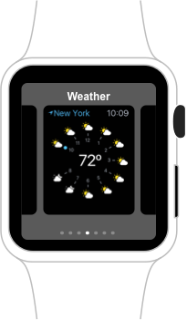](background-tasks-images/dock01.png#lightbox)

The system periodically takes snapshots of the app's UI and uses those snapshots to populate the Docs. watchOS gives the app the opportunity to update its content and UI before this snapshot is taken.

Apps that have been pinned to the dock can expect the following:

- They will receive a minimum of one updated per hour. This includes both an App Refresh Task and a Snapshot Task.
- The update budget is distributed between all of the apps in the Dock. So the fewer apps the user has pinned, the more potential updates each app will receive.
- The app will be kept in memory so the app will resume quickly when selected from the Dock.

The last app the user ran will be considered the _Most Recently Used_ app  and will occupy the last slot in the Dock. From there, there user can choose to pin it permanently to the Dock. The Most Recently Used will be treated like any other favorite app the user has already pinned to the Dock.

> [!IMPORTANT]
> Apps that have only been added to the Home Screen will not be given any regular scheduling. To receive regular scheduling and background updates, an app _must_ be added to the Dock.

As stated earlier in this document, Snapshots are very important in watchOS 3 since they function as both the preview and launch images for the app. If the user settles on an app in the Dock, it will expand to full screen, enter the foreground and start running, so it is imperative that the Snapshot be up-to-date.

There might be times when the system decides it needs a fresh Snapshot of the app's UI. In this situations, the Snapshot request will not count against the app's runtime budget. The following will trigger a system Snapshot request:

- A Complication timeline update.
- User interaction with an app's notification.
- Switching from the Foreground to the Background state.
- After one hour of being in the Background state, so the app can return to the Default State.
- When watchOS first boots.

<a name="Best-Practices"></a>

## Best Practices

Apple suggests the following best practices when working with Background Tasks:

- Schedule as often as the app needs to be updated. Every time the app runs it should re-evaluate its future needs and adjust this schedule as required.
- If the system sends a Background Refresh Task and the app doesn't require an update, defer the work until an update is actually required.
- Consider all runtime opportunities available to an app:
  - Dock and Foreground activation.
  - Notifications.
  - Complication updates.
  - Background refreshes.
- Use `ScheduleBackgroundRefresh` for general-purpose background runtime such as:
  - Polling the system for information.
  - Schedule future `NSURLSessions` to request background data.
  - Known time transitions.
  - Triggering Complication updates.

<a name="Snapshot-Best-Practices"></a>

## Snapshot Best Practices

When working with Snapshot updates, Apple makes the following suggestions:

- Invalidate Snapshots only when required, for example, when there is a significant content change.
- Avoid high-frequency Snapshot invalidation. For example, a timer app shouldn't update the Snapshot every second, it should only be done when the timer has ended.

<a name="App-Data-Flow"></a>

## App Data Flow

Apple suggest the following for working with data flow:

[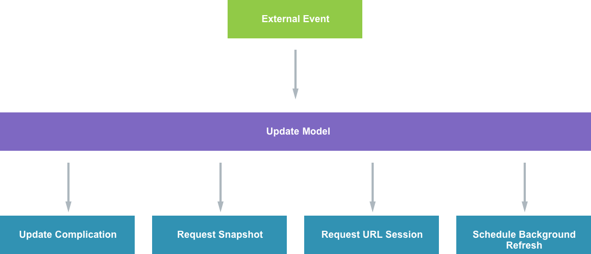](background-tasks-images/update17.png#lightbox)

An external event (such as Watch Connectivity) wakes the app. This forces the app to update its Data Model (that represents the apps current state). As a result of the Data Model change the app will need to update its Complications, request a new Snapshot, possibly start a background `NSURLSession` to pull more data and schedule further background refreshes.

<a name="The-App-Lifecycle"></a>

## The App Lifecycle

Because of the Dock and the ability to pin favorite apps to it, Apple thinks that users will be moving between far more apps, far more often, then they did with watchOS 2. As a result, the app should be ready to handle this change and move between the foreground and background states quickly.

Apple has the following suggestions:

- Ensure that the app finishes any background task as soon as possible upon entering foreground activation.
- Ensure to finish all foreground work before entering the background by calling `NSProcessInfo.PerformExpiringActivity`.
- When testing an app in the watchOS Simulator, none of the Task budgets will be enforced so an app can refresh as much as needed to properly test a feature.
- Always test on real Apple Watch hardware to ensure that the app isn't running past its budgets before publishing to iTunes Connect.
- Apple suggests keeping the Apple Watch on the charger while testing and debugging.
- Ensure that both cold launching and resuming an app are thoroughly tested.
- Verify that all app Tasks are being completed.
- Vary the number of apps that are pinned in the Dock to test both the best and worst case scenarios.

<a name="Summary"></a>

## Summary

This article has covered the enhancements Apple has made to watchOS and how they can be used to keep a watch app up-to-date. First, it covered all of the new Background Task Apple has added in watchOS 3. Then, it covered the Background API Lifecycle and how to implement Background Tasks in a Xamarin watchOS app. Finally, it covered how scheduling works and gave some best practices.

## Related Links

- [iOS 10 Samples](/samples/browse/?products=xamarin&term=Xamarin.iOS%2biOS10)