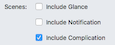
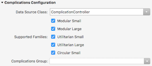

# watchOS Complications in Xamarin

_watchOS allows developers to write custom complications for watch faces_

This page explains the different types of complications available,
and how to add a complication to your watchOS 3 app.

Note that each watchOS application can only have one complication.

Start by reading
[Apple's docs](https://developer.apple.com/library/watchos/documentation/General/Conceptual/WatchKitProgrammingGuide/ManagingComplications.html)
to determine whether your app is suitable for a complication. There are 5 `CLKComplicationFamily` types
of display to choose from:

[](complications-images/all-complications.png#lightbox)

Apps can implement just one style, or all five, depending on the data being displayed.
You can also support Time Travel, providing values
for past and/or future times as the user turns the Digital Crown.

<a name="adding"></a>

## Adding a Complication

### Configuration

Complications can be added to a watch app during creation, or added manually
to an existing solution.

### Add New Project...

The **Add New Project...** wizard includes a checkbox that will automatically
create a complication controller class and configure the **Info.plist** file:



### Existing Projects

To add a complication to an existing project:

1. Create a new **ComplicationController.cs** class file and implement
  `CLKComplicationDataSource`.
2. Configure the app's **Info.plist** to expose the complication, and identity
  which complication families are supported.

These steps are described in more detail below.

<a name="clkcomplicationcontroller"></a>

### CLKComplicationDataSource Class

The following C# template includes the minimum required methods to
implement a `CLKComplicationDataSource`.

```csharp
[Register ("ComplicationController")]
public class ComplicationController : CLKComplicationDataSource
{
  public ComplicationController ()
  {
  }
  public override void GetPlaceholderTemplate (CLKComplication complication, Action<CLKComplicationTemplate> handler)
  {
  }
  public override void GetCurrentTimelineEntry (CLKComplication complication, Action<CLKComplicationTimelineEntry> handler)
  {
  }
  public override void GetSupportedTimeTravelDirections (CLKComplication complication, Action<CLKComplicationTimeTravelDirections> handler)
  {
  }
}
```

Follow the [writing a complication](#writing) instructions to add code to this class.

### Info.plist

The watch extension's **Info.plist** file should specify the name of the
`CLKComplicationDataSource` and which complication families you wish to
support:

[](complications-images/complications-config.png#lightbox)

The **Data Source Class** entry list will show class names that subclass
`CLKComplicationDataSource` subclass that includes your complication logic.

## CLKComplicationDataSource

All complication functionality is implemented in a single class, overriding
methods from the `CLKComplicationDataSource` abstract class (which implements
the `ICLKComplicationDataSource` interface).

### Required Methods

You must implement the following methods for the complication to run:

- `GetPlaceholderTemplate` - Return the static display used during configuration
  or when the app cannot supply a value.
- `GetCurrentTimelineEntry` - Calculate the correct display when the
  complication is running.
- `GetSupportedTimeTravelDirections` - Returns options from
  `CLKComplicationTimeTravelDirections` such as `None`, `Forward`, `Backward`,
  or `Forward | Backward`.

### Privacy

Complications that display personal data

- `GetPrivacyBehavior` - `CLKComplicationPrivacyBehavior.ShowOnLockScreen` or `HideOnLockScreen`

If this method returns `HideOnLockScreen` then the complication will show either
an icon or the application name (and not any data) when the watch is locked.

### Updates

- `GetNextRequestedUpdateDate` - Return a time when the operating system
  should next query the app for updated complication display data.

You can also force an update from your iOS app.

### Supporting Time Travel

Time Travel support is optional, and controlled by the `GetSupportedTimeTravelDirections`
method. If it returns `Forward`, `Backward`, or `Forward | Backward` then you
must implement the following methods

- `GetTimelineStartDate`
- `GetTimelineEndDate`
- `GetTimelineEntriesBeforeDate`
- `GetTimelineEntriesAfterDate`

<a name="writing"></a>

## Writing a Complication

Complications range from simple data display to complicated image and data
rendering with Time Travel support. The code below shows how to
build a simple, single-template complication.

<!--
The [sample]() for this article supports more template styles.
-->

## Sample Code

This example only supports the `UtilitarianLarge` template,
so can only be selected on specific watch faces that
support that type of complication. When *selecting* complications
on a watch, it displays **MY COMPLICATION** and when *running* it displays the text
**MINUTE _hour_** (with a portion of the time).

```csharp
[Register ("ComplicationController")]
public class ComplicationController : CLKComplicationDataSource
{
    public ComplicationController ()
    {
    }
    public ComplicationController (IntPtr p) : base (p)
    {
    }
    public override void GetCurrentTimelineEntry (CLKComplication complication, Action<CLKComplicationTimelineEntry> handler)
    {
        CLKComplicationTimelineEntry entry = null;
    var complicationDisplay = "MINUTE " + DateTime.Now.Minute.ToString(); // text to display on watch face
        if (complication.Family == CLKComplicationFamily.UtilitarianLarge)
        {
            var textTemplate = new CLKComplicationTemplateUtilitarianLargeFlat();
            textTemplate.TextProvider = CLKSimpleTextProvider.FromText(complicationDisplay); // dynamic display
            entry = CLKComplicationTimelineEntry.Create(NSDate.Now, textTemplate);
        } else {
            Console.WriteLine("Complication family timeline not supported (" + complication.Family + ")");
        }
        handler (entry);
    }
    public override void GetPlaceholderTemplate (CLKComplication complication, Action<CLKComplicationTemplate> handler)
    {
        CLKComplicationTemplate template = null;
        if (complication.Family == CLKComplicationFamily.UtilitarianLarge) {
            var textTemplate = new CLKComplicationTemplateUtilitarianLargeFlat ();
            textTemplate.TextProvider = CLKSimpleTextProvider.FromText ("MY COMPLICATION"); // static display
            template = textTemplate;
        } else {
            Console.WriteLine ("Complication family placeholder not not supported (" + complication.Family + ")");
        }
        handler (template);
    }
    public override void GetSupportedTimeTravelDirections (CLKComplication complication, Action<CLKComplicationTimeTravelDirections> handler)
    {
        handler (CLKComplicationTimeTravelDirections.None);
    }
}
```

<a name="templates"></a>

## Complication Templates

There are a number of different templates available for each complication style.
The **Ring** templates let you display a progress-style ring around the complication,
which can be used to display progress or some other value graphically.

[Apple's CLKComplicationTemplate docs](https://developer.apple.com/reference/clockkit/clkcomplicationtemplate)

### Circular Small

These template class names are all prefixed with `CLKComplicationTemplateCircularSmall`:

- **RingImage** - Display a single image, with a progress ring around it.
- **RingText** - Display a single line of text, with a progress ring around it.
- **SimpleImage** - Just display a small single image.
- **SimpleText** - Just display a small snippet of text.
- **StackImage** - Display an image and a line of text, one above the other
- **StackText** - Display two lines of text.

### Modular Small

These template class names are all prefixed with `CLKComplicationTemplateModularSmall`:

- **ColumnsText** - Display a small grid of text values (2 rows and 2 columns).
- **RingImage** - Display a single image, with a progress ring around it.
- **RingText** - Display a single line of text, with a progress ring around it.
- **SimpleImage** - Just display a small single image.
- **SimpleText** - Just display a small snippet of text.
- **StackImage** - Display an image and a line of text, one above the other
- **StackText** - Display two lines of text.

### Modular Large

These template class names are all prefixed with `CLKComplicationTemplateModularLarge`:

- **Columns** - Display a grid of 3 rows with 2 columns, optionally including an image to the left of each row.
- **StandardBody** - Display a bold header string, with two rows of plain text. The header can optionally display an image on the left.
- **Table** - Display a bold header string, with a 2x2 grid of text beneath it. The header can optionally display an image on the left.
- **TallBody** - Display a bold header string, with a larger font single line of text beneath.

### Utilitarian Small

These template class names are all prefixed with `CLKComplicationTemplateUtilitarianSmall`:

- **Flat** - Displays an image and some text on a single line (the text should be short).
- **RingImage** - Display a single image, with a progress ring around it.
- **RingText** - Display a single line of text, with a progress ring around it.
- **Square** - Display a square image (40px or 44px square for the 38mm or 42mm Apple Watch respectively).

### Utilitarian Large

There's only one template for this complication style: `CLKComplicationTemplateUtilitarianLargeFlat`.
It displays a single image and some text, all on a single line.

## Related Links

- [Apple's docs](https://developer.apple.com/library/watchos/documentation/General/Conceptual/WatchKitProgrammingGuide/ComplicationEssentials.html)
- [WWDC video](https://developer.apple.com/videos/play/wwdc2015-209/)
