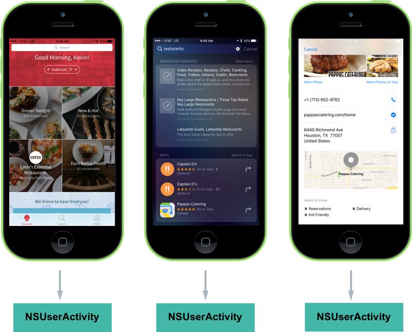

# watchOS Proactive Suggestions in Xamarin

_This article shows how to use Proactive Suggestions in a watchOS 3 app to drive engagement by allowing the system to proactively present helpful information automatically to the user._

New to watchOS 3, Proactive Suggestions present news ways for users to engage with a Xamarin.iOS app by proactively present helpful information automatically to the user at appropriate times.

## About Proactive Suggestions

New to watchOS 3, `NSUserActivity` includes a `MapItem` property that allows the app to provide location information that can be used in other contexts. For example, if the app displayed hotel reviews and provides a `MapItem` location, if the user switched to the Maps app, the location of the hotel they were just viewing would be available.

The app exposes this functionality to the system using a collection of technologies such as `NSUserActivity`, MapKit, Media Player and UIKit. Additionally, by providing Proactive Suggestion support for the app, it gets deeper Siri integration for free.

## Location Based Suggestions

New to watchOS 3, the `NSUserActivity` class includes a `MapItem` property that allows the developer to provide location information that can be used in other contexts. For example, if the app displays restaurant reviews, the developer can set the `MapItem` property to the location of the restaurant that the user is viewing in the app. If the user switches to the Maps app, the restaurant's location is automatically available.

If the app supports App Search, it can use the new address components of the `CSSearchableItemAttributesSet` class to specify locations that the user may want to visit. By setting the `MapItem` property, the other properties are automatically filled-in.

In addition to setting the `Latitude` and `Longitude` of the address component properties, it is recommended that the app supply the `NamedLocation` and `PhoneNumbers` properties too, so Siri can initiate a call to the location.

## Contextual Siri Reminders

Allows the user to use Siri to quickly make a reminder to view the content they are currently viewing in the app at a later date. For example, if they were viewing a restaurant review in the app, they could invoke Siri and say *"Remind me about this when I get home."* Siri would generate the reminder with a link to the review in the app.

## Implementing Proactive Suggestions

Adding Proactive Suggestion support to the Xamarin.iOS app is typically as easy as implementing a few APIs or expanding on a few APIs that the app might already be implementing.

Proactive Suggestions work with the apps in three main ways:

- **`NSUserActivity`** - Helps the system understand what information the user is currently working with on screen.
- **Location Suggestions** - If the app offers or consumes location based information, these API extension offer new ways to share this information across apps.

And is supported in the app by implementing the following:

- **Contextual Siri Reminders** - In iOS 10, `NSUserActivity` has been expanded to allow Siri to quickly make a reminder to view the content they are currently viewing in the app at a later date.
- **Location Suggestions** - iOS 10 enhances `NSUserActivity` to capture locations viewed inside of the app and promote them in many places throughout the system.
- **Contextual Siri Requests** - `NSUserActivity` provides context to the information presented inside of the app to Siri so that the user can get directions or place a call be invoking Siri from within the app.

All of these features have one thing in common, they all use `NSUserActivity` in one form or another to provide their functionality. 

## NSUserActivity

As stated above, `NSUserActivity` helps the system understand what information the user is currently working with on screen. `NSUserActivity` is a light-weight state caching mechanism to capture the user's activity as they navigate through the app. For example, looking at the restaurant app:

[](proactive-suggestions-images/activity02.png#lightbox)

With the following interactions:

1. As the user works with the app, a `NSUserActivity` is created to recreate the state of the app later.
2. If the user searches for a restaurant, the same pattern of creating activities is followed.
3. And again, when the user views a result. In this last case, the user is viewing a location and in iOS 10, the system is more aware of certain concepts (such as location or communication interactions).

Take a closer look at the last screen:

[](proactive-suggestions-images/activity03.png#lightbox)

Here the app is creating a `NSUserActivity` and it has been populated with information to recreate the state later. The app has also included some metadata such as the location's name and address. With this activity created, the app lets iOS know that it represents the user's current state.

The app then decides if the activity will be advertised over-the-air for Handoff, saved as a temporary value for location suggestions or added to the on-device Spotlight index for displaying in search results.

For more information on Handoff and Spotlight search, please see our [Introduction to Handoff](~/ios/platform/handoff.md) and [iOS 9 New Search APIs](~/ios/platform/search/index.md) guides.

### Creating an Activity

Before creating an Activity, an Activity Type Identifier will needed to be created to identify it. The Activity Type Identifier is a short string added to the `NSUserActivityTypes` array of the app's `Info.plist` file used to uniquely identify a given User Activity Type. There will be one entry in the array for each activity that the app supports and exposes to App Search. See our [Creating Activity Type Identifiers Reference](~/ios/platform/search/nsuseractivity.md) for more details.

Look at an example of an activity:

```csharp
// Create App Activity
var activity = new NSUserActivity ("com.xamarin.platform");

// Define details
var info = new NSMutableDictionary ();
info.Add(new NSString("link"),new NSString("http://xamarin.com/platform"));

// Populate Activity
activity.Title = "The Xamarin Platform";
activity.UserInfo = info;

// Enable capabilities
activity.EligibleForSearch = true;
activity.EligibleForHandoff = true;
activity.EligibleForPublicIndexing = true;

// Inform system of Activity
activity.BecomeCurrent();
```

A new activity is created using an Activity Type Identifier. Next, some metadata defining the activity is created so this state can be restored at a later date. Then, the activity is given a meaningful title and attached to the user info. Finally, some capabilities are enabled and the activity is sent to the system.

The code above could further be enhanced to include metadata that provides context to the activity by making the following changes:

```csharp
...

// Provide context
var attributes = new CSSearchableItemAttributeSet ("com.xamarin.location");
attributes.ThumbnailUrl = myThumbnailURL;
attributes.Keywords = new string [] { "software", "mobile", "language" }; 
activity.ContentAttributeSet = attributes;

// Inform system of Activity
activity.BecomeCurrent();
```

If the developer has a website that is capable of displaying the same information as the app, the app can include the URL and the content can be displayed on other devices that don't have the app installed (via Handoff):

```csharp
// Restore on the web
activity.WebPageUrl = new NSUrl("http://xamarin.com/platform");
```

### Restoring an Activity

To respond to the user tapping on a search result (`NSUserActivity`) for the app, edit the **AppDelegate.cs** file and override the `ContinueUserActivity` method. For example:

```csharp
public override bool ContinueUserActivity (UIApplication application, NSUserActivity userActivity, UIApplicationRestorationHandler completionHandler)
{

    // Take action based on the activity type
    switch (userActivity.ActivityType) {
    case "com.xamarin.platform":
        // Restore the state of the app here...
        break;
    }

    return true;
}
```

Ensure this is the same Activity Type Identifier (`com.xamarin.platform`) as the activity created above. The app uses the information stored in the `NSUserActivity` to restore the state back to where the user left off.

### Benefits of Creating an Activity

With the minimal amount of code presented above, the app is now able to take advantage of three new iOS 10 features:

- **Handoff**
- **Spotlight Search**
- **Contextual Siri Reminders**

The following section will take a look at enabling two other new iOS 10 features:

- **Location Suggestions**
- **Contextual Siri Requests**

### Location Based Suggestions 

Take the example of the restaurant search app above. If it has implemented `NSUserActivity` and correctly populated all of the metadata and attributes, the user would be able to do the following:

1. Find a restaurant in the app that they would like to meet a friend at.
2. If the user switches to the Maps app, the restaurant's address is automatically suggested as a destination.
3. This even works for 3rd Party apps (that support `NSUserActivity`), so the user can switch to a ride-sharing app and the restaurant's address is automatically suggested as a destination there as well.
4. It also provides context to Siri, so the user can invoke Siri within the restaurant app and ask *"Get directions..."* and Siri will provide directions to the restaurant the user is viewing.

All of the above functionality has one thing in common, they all indicate where the suggestion is originally coming from. In the case of the example above, it's the fictitious restaurant review app.

watchOS 3 has been enhanced to enable this functionality for an app through several small modifications and additions to existing frameworks:

- `NSUserActivity` has additional fields for capturing location information that is viewed inside of the app.
- Several additions have been made to MapKit and CoreSpotlight to capture location.
- Location aware functionality has been added to Siri, Maps, Multitasking and other apps within the system.

To implement location based suggestions, start with the same activity code presented above:

```csharp
// Create App Activity
var activity = new NSUserActivity ("com.xamarin.platform");

// Define details
var info = new NSMutableDictionary ();
info.Add(new NSString("link"),new NSString("http://xamarin.com/platform"));

// Populate Activity
activity.Title = "The Xamarin Platform";
activity.UserInfo = info;

// Enable capabilities
activity.EligibleForSearch = true;
activity.EligibleForHandoff = true;
activity.EligibleForPublicIndexing = true;

// Provide context
var attributes = new CSSearchableItemAttributeSet ("com.xamarin.location");
attributes.ThumbnailUrl = myThumbnailURL;
attributes.Keywords = new string [] { "software", "mobile", "language" }; 
activity.ContentAttributeSet = attributes;

// Restore on the web
activity.WebPageUrl = new NSUrl("http://xamarin.com/platform");

// Inform system of Activity
activity.BecomeCurrent();
```

If the app is using MapKit, it is as simple as adding the current map `MKMapItem` to the activity:

```csharp
// Save MKMapItem location
activity.MapItem = myMapItem;
```

If the app isn't using MapKit, it can adopt App Search and specify the following new attributes for location:

```csharp
// Provide context
var attributes = new CSSearchableItemAttributeSet ("com.xamarin.location");
...

attributes.NamedLocation = "Apple Inc.";
attributes.SubThoroughfare = "1";
attributes.Thoroughfare = "Infinite Loop";
attributes.City = "Cupertino";
attributes.StateOrProvince = "CA";
attributes.Country = "United States";
attributes.Latitude = 37.33072;
attributes.Longitude = 122.029674;
attributes.PhoneNumbers = new string[]{"(800) 275-2273"};
attributes.SupportsPhoneCalls = true;
attributes.SupportsNavigation = true;
```

Take a look at the above code in detail. First, the name of the location is required in every instance:

```csharp
attributes.NamedLocation = "Apple Inc.";
```

Then, the text based description in required for text based instances (such as the QuickType keyboard):

```csharp
attributes.SubThoroughfare = "1";
attributes.Thoroughfare = "Infinite Loop";
attributes.City = "Cupertino";
attributes.StateOrProvince = "CA";
attributes.Country = "United States";
```

The latitude and longitude are optional, but ensure that the user is routed to the exact location the app is wanting to send them to:

```csharp
attributes.Latitude = 37.33072;
attributes.Longitude = 122.029674;
```

By setting the phone numbers, the app can gain access to Siri so the user can invoke Siri from the app by saying something like, *"Call this place":

```csharp
attributes.PhoneNumbers = new string[]{"(800) 275-2273"};
```

Finally, the app can indicate if the instance is suitable for navigation and phone calls:

```csharp
attributes.SupportsPhoneCalls = true;
attributes.SupportsNavigation = true;
```

## Activities Best Practices

Apple suggests the following best practices when working with activities:

- Use `NeedsSave` for lazy payload updates.
- Ensure to keep a strong reference to the current activity.
- Only transfer small payloads that include just enough information to restore the state.
- Ensure that the Activity Type Identifiers are unique and descriptive by using reverse-DNS notation to specify them. 

## Consuming Location Suggestions

This next section will cover consuming Location Suggestion that have come from other parts of the system (such as the Maps app) or other 3rd party apps.

## Routing Apps and Locations Suggestions

This section will take a look at consuming Location Suggestions directly from within a routing app. For the routing app to add this functionality, the developer will leverage the existing `MKDirectionsRequest` framework as follows:

- To promote the app in Multitasking.
- To register the app as a routing app.
- To handle launching the app with a MapKit `MKDirectionsRequest` object.
- Give watchOS the ability to learn to suggest the app based on user engagement.

When the app is started with a MapKit `MKDirectionsRequest` object, it should automatically start giving the user directions to the requested location, or present a UI that makes it easy for the user to start getting directions. For example:

```csharp
using System;
using Foundation;
using UIKit;
using MapKit;
using CoreLocation;

namespace MonkeyChat
{
    [Register ("AppDelegate")]
    public class AppDelegate : UIApplicationDelegate, IUISplitViewControllerDelegate
    {
        ...

        public override bool OpenUrl (UIApplication app, NSUrl url, NSDictionary options)
        {
            if (MKDirectionsRequest.IsDirectionsRequestUrl (url)) {
                var request = new MKDirectionsRequest (url);
                var coordinate = request.Destination?.Placemark.Location?.Coordinate;
                var address = request.Destination.Placemark.AddressDictionary;
                if (coordinate.IsValid()) {
                    var geocoder = new CLGeocoder ();
                    geocoder.GeocodeAddress (address, (place, err) => {
                        // Handle the display of the address

                    });
                }
            }

            return true;
        }
    }
}
```

Take a look at this code in detail. It tests to see if it is a valid destination request:

```csharp
if (MKDirectionsRequest.IsDirectionsRequestUrl(url)) {
```

If it is, then it creates a `MKDirectionsRequest` from the URL:

```csharp
var request = new MKDirectionsRequest(url);
```

New in watchOS 3, the app can be sent an address that does not have geo-coordinates, in that cause the developer needs to encode the address:

```csharp
var geocoder = new CLGeocoder();
geocoder.GeocodeAddress(address, (place, err)=> {
    // Handle the display of the address

});

```

## Summary

This article has covered Proactive Suggestions and showed how the developer can use them to drive traffic to a Xamarin.iOS app for watchOS. It covered the step to implement Proactive Suggestions and presented usage guidelines.

## Related Links

- [watchOS Samples](/samples/browse/?products=xamarin&term=Xamarin.iOS%2bwatchOS)
- [SiriKit Programming Guide](https://developer.apple.com/library/prerelease/content/documentation/Intents/Conceptual/SiriIntegrationGuide/index.html)