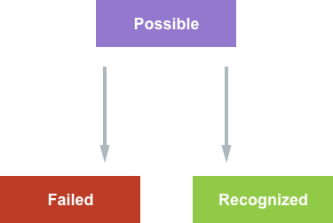
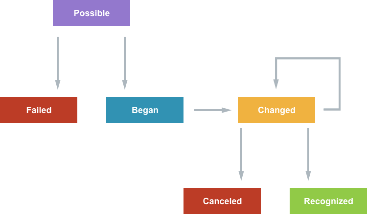
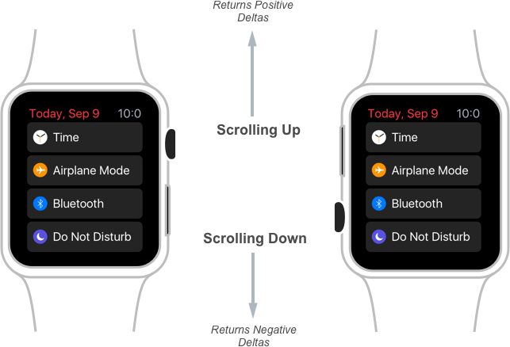
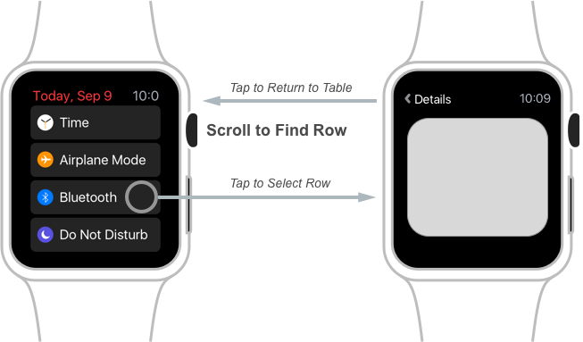
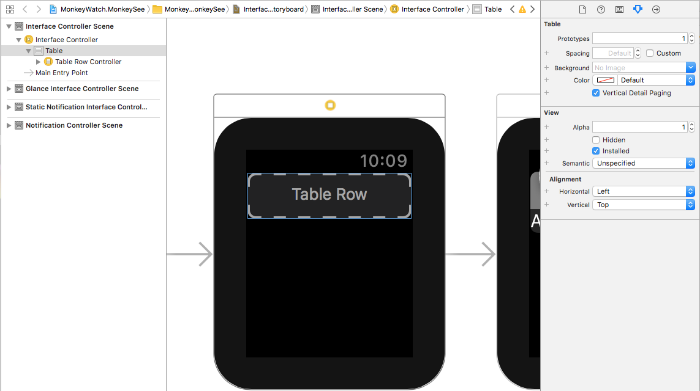
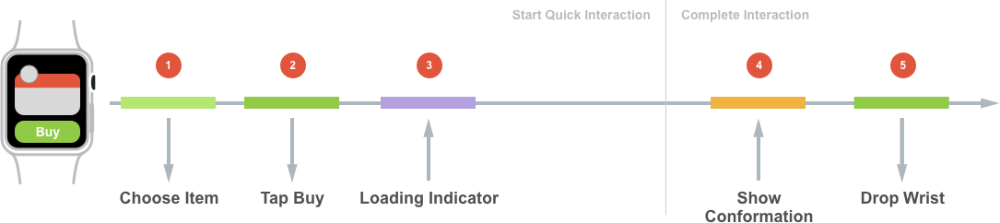
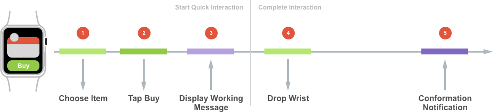

# Quick Interaction Techniques for watchOS 3 in Xamarin

_This article covers the quick interaction techniques Apple has added in watchOS 3 and how to implement them in Xamarin.iOS for Apple Watch._

Providing quick user interactions are essential to creating compelling Apple Watch apps and Complications. New to watchOS 3, Apple has added support for Gesture Recognizers, access to the Digital Crown and new User Notification and navigation techniques. This, along with added support for both SceneKit and SpriteKit, allow the developer to easily create rich, glanceable interfaces that are both quick and responsive.

## What are Quick Interactions

For a developer that is used to creating applications for iOS or macOS (where the amount of time that a user spends interacting with the app is measured in minutes or hours), designing a successful app for the Apple Watch can be a challenge and requires a different approach.

In watchOS, the user typically wants to raise their wrist, quickly interact with an app (usually for a brief couple of seconds), then drop their wrist and continue whatever it was that they were doing.

The following are a few examples of typical quick interactions on the Apple Watch:

- Starting a timer.
- Checking the weather.
- Marking an item off a todo list.

To achieve these goals, an app on the Apple Watch must be:

- **Glanceable** - Which means that with a quick glance the user should be able to get the information that they need. 
- **Actionable** - Which means users should be able to make quick, well-informed decisions.
- **Responsive** - Which means the user should never wait to receive the info that they need or to achieve the action they desire.

### Quick Interactions Length

Because of the glanceable nature of Apple Watch apps, Apple suggests that the ideal length of a quick interaction should be two seconds or less. As a result of this two second limit, the developer will need to spend a considerable amount of time both designing and implementing an Apple Watch app. 

## New watchOS 3 Features and APIs

Apple has added several new features and APIs to WatchKit to assist the developer in adding quick interactions to their Apple Watch apps:

- watchOS 3 provides access to new kinds of user input such as:
  - Gesture Recognizers
  - Digital Crown rotation 
- watchOS 3 provides new ways of displaying and updating information, such as:
  - Enhanced Table navigation
  - New User Notification framework support
  - SpriteKit and SceneKit integration

By implementing these new features, the developer can ensure that their watchOS 3 app is Glanceable, Actionable and Responsive.

### Gesture Recognizer Support

If the developer has implemented Gesture Recognizers in iOS, they should be very familiar with how Gesture Recognizers work in watchOS 3. To refresh, Gesture Recognizers are objects that parse low-level touch events into recognizable, pre-defined gestures.

watchOS 3 will support the four following Gesture Recognizers:

- Discrete gestures types:
  - The Swipe Gesture (`WKSwipeGestureRecognizer`).
  - The Tap Gesture (`WKTapGestureRecognizer`).
- Continuous gesture types:
  - The Pan Gesture (`WKPanGestureRecognizer`).
  - The Long-Press Gesture (`WKLongPressGestureRecognizer`).

To implement one of the new Gesture Recognizers, simply drag it onto a view in Xcode's Interface Builder and configure its properties.

In code, respond to the Action of the recognizer to handle the gesture being triggered by the user. Again, this is done in the same way as it would be handled in iOS.

#### Discrete Gesture States

For Discrete Gestures, the Action is called when the gesture is recognized and a State (`WKGestureRecognizerState`) is assigned as:

[](quick-interaction-techniques-images/quick01.png#lightbox)

All Discrete Gestures start out in the `Possible` state and transition into either the `Failed` or `Recognized` state. When using Discrete Gestures, the developer generally doesn't deal directly with the State. Instead, they rely on the Action being called when the gesture is recognized only.

#### Continuous Gesture States

Continuous Gestures are slightly different from Discrete Gestures, where the Action is called multiple times as the gesture is being recognized:

[](quick-interaction-techniques-images/quick02.png#lightbox)

Again, Continuous Gestures starts out in the `Possible` state, but they progress over multiple updates. Here the developer will need to consider recognizer's state and update the app's UI during the `Changed` phase until the gesture is finally `Recognized` or `Canceled`.

#### Gesture Recognizer Usage Tips

Apple suggest the following when working with Gesture Recognizers in watchOS 3:

- Add the Gesture Recognizers to Group Elements instead of individual Controls. Since the Apple Watch has a smaller physical screen size, Group Elements tend to be bigger and easier targets for the user to hit. Also, the Gesture Recognizers can conflict with built in gestures already in the native UI Controls.
- Set dependency relationships in the watch app's Storyboard.
- Some gesture take precedence over other gesture types, such as:
  - Scrolling
  - Force Touch

### Digital Crown Rotation

By implementing Digital Crown Support in their watchOS 3 apps, a developer can provide increased navigation speed and precision interactions for their users.

Since watchOS 2, Apple Watch app's could use the `WKInterfacePicker` object to access the Digital Crown by providing a list of `WKPickerItems` and a Picker Style (List, Stacked or Image Sequence). watchOS then allowed the user to use the Digital Crown to select an item from the list.

When using a `WKInterfacePicker`, WatchKit is handling most of the work by:

- Drawing the list and the individual interface elements.
- Processing the Digital Crown events.
- Calling an Action when an item is selected.

New to watchOS 3, the developer now has direct access to the Digital Crown rotation events which allows them to create their own UI elements that respond to rotation values.

Digital Crown access is provided by the following elements:

- `WKCrownSequencer` - Provides access to rotations per second.
- `WKCrownDelegate` - Provides access to rotational delta events.

#### Rotations Per Second

Accessing the Rotations Per Second from the Digital Crown is useful when working with physics based animations. To access the Rotations Per Second, use the `CrownSequencer` property of the `WKInterfaceController` of the Watch Extension. For example:

```csharp
var rotationsPerSecond = CrownSequencer.RotationsPerSecond;
```

#### Rotational Deltas

Use the Rotational Deltas from the Digital Crown to count the number of rotations. Use the `CrownDidRotate` override method of the `WKCrownDelegate` to access the Rotational Deltas. For example:

```csharp
using System;
using WatchKit;
using Foundation;

namespace MonkeyWatch.MonkeySeeExtension
{
  public class CrownDelegate : WKCrownDelegate
  {
    #region Computed Properties
    public double AccumulatedRotations { get; set;}
    #endregion

    #region Constructors
    public CrownDelegate ()
    {
    }
    #endregion

    #region Override Methods
    public override void CrownDidRotate (WKCrownSequencer crownSequencer, double rotationalDelta)
    {
      base.CrownDidRotate (crownSequencer, rotationalDelta);

      // Accumulate rotations
      AccumulatedRotations += rotationalDelta;
    }
    #endregion
  }
}
```

Here the app maintains an accumulator (`AccumulatedRotations`) to determine the number of rotations. One full rotation of the Digital Crown is equal to an accumulated delta of `1.0` and a half rotation would be `0.5`.

Apple has left it up to the developer to determine how the rotation counts correspond to the sensitivity of changes on the UI element being updated.

The sign (`+/-`) of the Rotational Delta indicates the direction that the user is turning the Digital Crown:

[](quick-interaction-techniques-images/quick03.png#lightbox)

If the user is scrolling up, WatchKit will return positive deltas and if scrolling down, then negative deltas will be returned, no matter what orientation the user is wearing the watch in.

#### Digital Crown Focus

Just like any other interface elements, the Digital Crown has the concept of Focus. This Focus can be shifted away from the Digital Crown to other interface elements based on how the user is interacting with the watch. 

For example, any of the following controls could steal the Focus of the Digital Crown:

- Picker
- Slider
- Scrolling Controller

It is up to the developer to determine when their custom interface element needs to be the Focus of the Digital Crown. Apple suggests using the new Gesture Recognizers to gain focus in the custom UI element.

### Vertical Paging

The standard way that a user navigates a Table View in a watchOS app is to scroll to the desired piece of data, tap on a specific row to display the Detailed View, tap the back button when finished viewing the details and repeat the process for any other information that they are interested in from within the table:

[](quick-interaction-techniques-images/quick04.png#lightbox)

New to watchOS 3, the developer can enable Vertical Paging on their Table View controls. With this feature enabled, the user can scroll to find a Table View row and tap the row to view its detail as before. However, they can now swipe up to select the next row in the table or down to select the previous row (or use the Digital Crown), all without having to return to the Table View first:

[](quick-interaction-techniques-images/quick05.png#lightbox)

To enable this mode, open the watchOS app's Storyboard in Xcode for editing, select the Table View and check the **Vertical Detail Paging** checkbox:

[](quick-interaction-techniques-images/quick06.png#lightbox)

Ensure that the Table is using Segues to display the Detailed View and Save the changes to the Storyboard and return to Visual Studio for Mac to sync.

The developer can programmatically engage Vertical Paging to a specific row using the following code against a Table View:

```csharp
// Segue into Vertical Paging and select the first row
MenuTable.PerformSegue (0);
```

When using Vertical Paging, the developer needs to be aware that WatchKit will automatically handle the preloading of controllers and as a result, some controller lifecycle methods can be called before the UI is actually visible.

### Notification Enhancements

Notification are the primary form of Quick Interaction that a user typically experiences on watchOS and have been available since the first Apple Watch and watchOS 1.

A typical Notification Quick Interaction is as follows:

1. The user feels the Notification Haptic when a new Notification is received.
2. They raise their wrist to see the Short Look interface for the Notification.
3. If they continue to keep their wrist raised, watchOS automatically transitions into the Long Look Notification interface.

There are several ways that a user may respond to the Notification:

- For a well defined and presented Notification, the user will do nothing and simply dismiss the Notification.
- They might also tap of the Notification to launch the watchOS app.
- For a Notification that supports Custom Actions, the user might select one of the custom actions. These can either be:
  - **Foreground Actions** - These launch the app to perform the action.
  - **Background Actions** - Were always routed to the iPhone in watchOS 2 but can be routed to the watchApp in watchOS 3.

New for watchOS 3:

- Notification use a similar API across all platforms (iOS, watchOS, tvOS and macOS).
- Local Notification can be scheduled on the Apple Watch.
- Background Notification will be routed to the app's Extension if they were scheduled on the Apple Watch.

#### Notification Scheduling and Delivery

Notification from the user's iPhone will be forward to the Apple Watch when the following occurs:

- The iPhone's screen is off.
- The Apple Watch is being worn and has been unlocked.

In watchOS 3, Local Notifications can be scheduled on the Apple Watch and are only delivered on the watch. It is up the developer to schedule a corresponding iPhone Notification if it is required by the app.

By including the same Notification Identifier on both the Apple Watch and iPhone versions of the Notifications, it prevents duplicate Notifications from being displayed on the watch. The Apple Watch version of the Notification will take precedence over the iPhone version.

Since watchOS 3 uses the same `UINotification` API framework as iOS 10, please see our iOS 10 [User Notification Framework](~/ios/platform/user-notifications/index.md) documentation for more details.

### Using SpriteKit and SceneKit

New to watchOS 3, the developer can now use both SpritKit and SceneKit objects in their app's User Interface design to present both 2D and 3D graphics.

Two new interface classes have been added to support this feature:

- `WKInterfaceSKScene` - For working with SpriteKit 2D graphics.
- `WKInterfaceSCNScene` - For working with SceneKit 3D graphics.

To use these objects, simply drag them onto the design surface inside of the watch app's Storyboard in Xcode's Interface Builder and use the **Attributes Inspector** to configure them.

From this point, working with either the SpriteKit or SceneKit scenes works the same as it does inside of an iOS app. The watch app will present a `WKInterfaceSKScene` by calling one of the `Present` methods. For SceneKit, simply set the `Scene` property of the `WKInterfaceSCNScene` object.

## Actionable Complications

In watchOS 2, Apple introduced Complications for 3rd party apps. In watchOS 3, Apple has expanded the abilities that a developer can include in a WatchKit Complication. 

Additionally, more of the built in watch faces can now include Complications and existing watch faces that already supported Complications can now included even more Complications.

Also new is the ability for a user to quickly swipe left or right to transition through all of the watch faces they have installed on their Apple Watch. Using the new gallery on the Apple Watch's companion iPhone app, the user can add and customize new watch faces and any of the Complications that they can include.

Because of these new features, Apple suggests that every app on Apple Watch should also include at least one Complication and as such, all of the Native Apple Watch app now have Complications.

Complications provide the following features to an app:

- They are highly glanceable since they are always present on the watch face.
- Complications are frequently updated by watchOS. Any app that includes a Complication on the user's currently displayed watch face is updated at least twice an hour.
- Any app with a Complication on the user's currently displayed watch face is kept in memory which makes the app launch quickly and improves the speed of responses from the app.
- Complications make it easy for the user to launch specific functionality in a watchOS app.

## Glanceable Notification

Notification on Apple Watch provide a great, customizable way to quickly inform the user of events or new information such as incoming messages or achieving a goal in a workout app.

By using a Notification, valuable information can be quickly presented to the user. In many situations, a well-designed Notification can remove the necessity for the user to actually launch the app.

New to watchOS 3, all notifications now support:

- SpriteKit
- SceneKit
- Inline Video

## Enhanced UI with SpriteKit and SceneKit

Typically, a developer might think of game UI when SpriteKit and SceneKit are mentioned. However, both SpriteKit and SceneKit can be useful for creating non-gaming UIs that include customized layouts, content and animations that are not otherwise possible in WatchKit alone.

For example, a user notification from a photo sharing app can use SpriteKit to provide a rich user experience by including the user that posted the picture along with an actual image and other customized information that enriches the user experience.

Additionally, both SpriteKit and SceneKit can be mixed with standard WatchKit UI elements in the app's User Interface design.

## Simple Navigation

watchOS 3 presents several ways that a developer can simplify the navigation within their watchOS apps such as the new [Vertical Paging](#vertical-paging), [Gesture Recognizer Support](#gesture-recognizer-support) and [Digital Crown Rotation](#digital-crown-rotation) features presented above.

The Digital Crown is unique to the Apple Watch and can be used in many different ways to simplify navigation. For example, a timer application can use the Digital Crown to scrub through available timer lengths.

Custom Gestures can present new and unique ways for the user to interact with a watch app and can also be used to simplify app navigation.

Apple suggest looking for ways to combine all of the new Quick Interaction features added in watchOS 3 to present rich, easy and quick to use watchOS app interfaces.

## Finishing the Quick Interaction

A well designed quick interaction experience will give the user the confidence to drop their wrist (and disengage with the app) when they have finished the current interaction.

Where this specifically becomes an issue is when the watch app is doing any type of network connection or sharing information with its companion iPhone app. This can often lead to a waiting indicator while the transaction is taking place, which is not desirable during a quick interaction. Take the following example:

[](quick-interaction-techniques-images/quick07.png#lightbox)

1. The user chooses an item to purchase on the watch.
2. They tap the buy button.
3. The app starts the network transaction and displays a loading indicator.
4. Some time later, the transaction completes and the app displays a purchase conformation.
5. The user drops their wrist and disengages with the app.

From the time the user taps the buy button until the transaction is completed, they have their wrist raised looking at a loading indicator. To solve this situation, Apple suggests that the developer should present instant feedback to the user instead of showing a loading indicator. 

Using Apple's suggested model, take a look at the same quick interaction again:

[](quick-interaction-techniques-images/quick08.png#lightbox)

1. The user chooses an item to purchase on the watch.
2. They tap the buy button.
3. The app starts the network transaction and displays a message saying that the purchase has successfully started.
4. The user drops their wrist and disengages with the app.
5. When the transaction successfully completes some time later, the app displays a Local Notification to inform the user of a successful purchase.

This time, as soon as the user taps the buy button they are shown a message stating that the purchase has started, so they can confidently drop their wrist and end the quick interaction at this point. Later they are informed of the success or failure of the transaction in a User Notification. In this way, the user is only interacting with the app during the "active" phases of the process.

For apps that are doing networking, they can use a background `NSURLSession` to handle the network communication with a download task. This will allow the app to be woken up in the background to process the downloaded information. For app that require background processing, use a Background Task Assertion to handle the required processing.

## Quick Interaction Design Tips

Since the desired length of a Quick Interaction is two seconds or less, the developer should focus on the design of the app's interactions from the very beginning of the design process. Find areas where those interactions can be simplified (using the technique presented above) and use the new features of watchOS 3 to make the app quick and responsive.

Apple suggests the following:

- Focus on Quick Interactions by bringing the most used features of the app forward.
- Use Complications and User Notifications to surface common features and functions.
- Create rich, glanceable User Interface with SceneKit and SpriteKit.
- Whenever possible, simplify navigation within the app.
- Never make the user wait, allow them to drop their wrist and disengage with the app as soon as possible.

## Summary

This article has covered the quick interaction techniques Apple has added in watchOS 3 and how to implement them in Xamarin.iOS for Apple Watch.

## Related Links

- [watchOS Samples](/samples/browse/?products=xamarin&term=Xamarin.iOS%2bwatchOS)