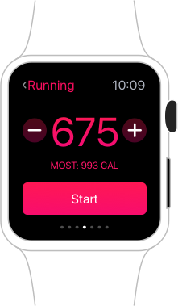
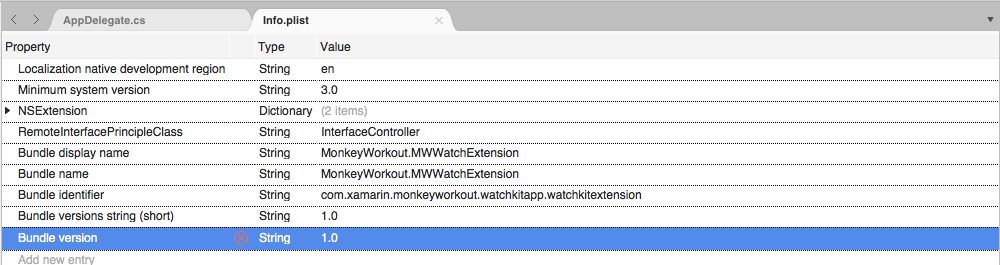
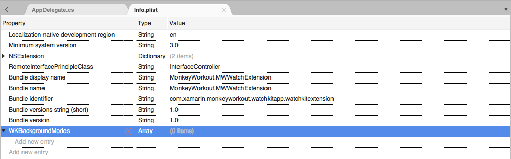
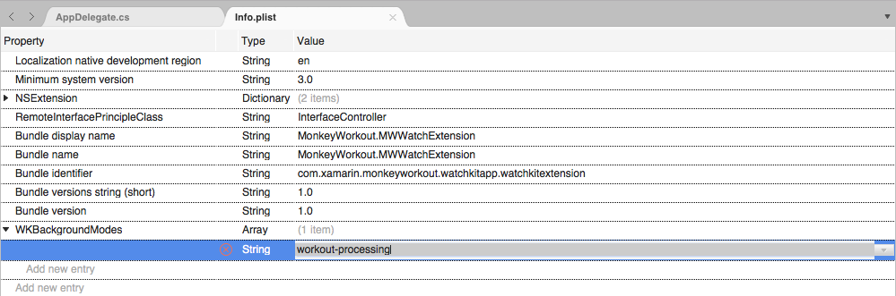
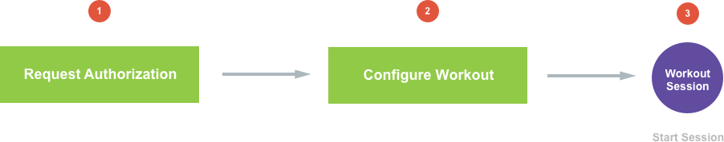
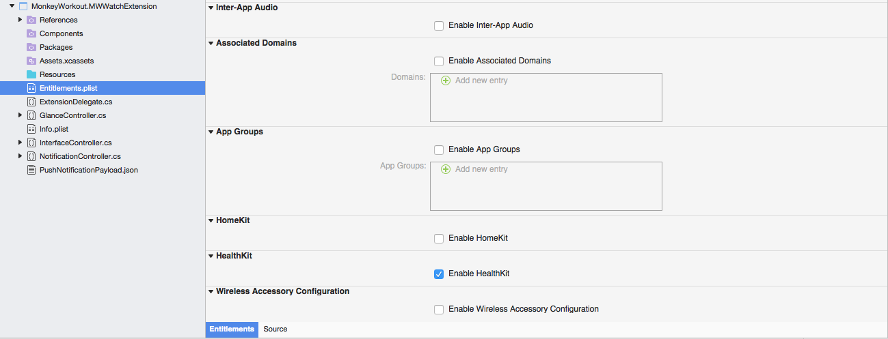
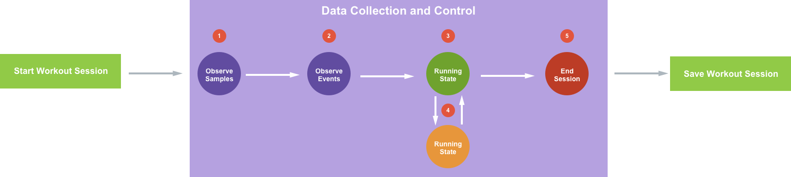
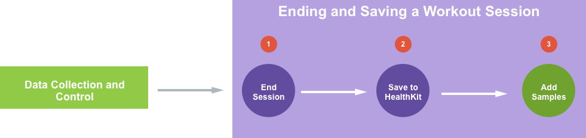
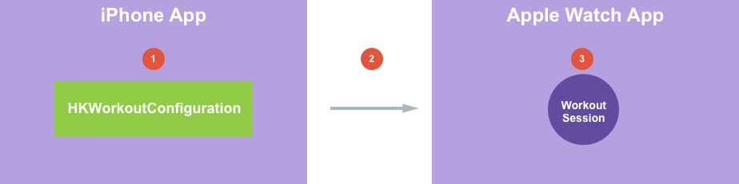

# watchOS Workout Apps in Xamarin

_This article covers the enhancements Apple has made to workout apps in watchOS 3 and how to implement them in Xamarin._

New to watchOS 3, workout related apps have the ability to run in the background on the Apple Watch and gain access to HealthKit data. Their parent iOS 10 based app also has the ability to launch the watchOS 3 based app without user intervention.

The following topics will be covered in detail:

## About Workout Apps

Users of fitness and workout apps can be highly dedicated, devoting several hours of the day towards their health and fitness goals. As a result, they expect responsive, easy-to-use apps that accurately collect and display data and integrate seamlessly with Apple Health.

A well designed fitness or workout app helps users chart their activities to reach their fitness goals. By using the Apple Watch, fitness and workout apps have instant access to heart rate, calorie burn and activity detection.

[](workout-apps-images/workout01.png#lightbox)

New to watchOS 3, _Background Running_ gives workout related apps the ability to run in the background on the Apple Watch and gain access to HealthKit data.

This document will introduce the Background Running feature, cover the workout app lifecycle and show how a workout app can contribute to the user's _Activity Rings_ on the Apple Watch.

## About Workout Sessions

The heart of every workout app is a _Workout Session_ (`HKWorkoutSession`) that the user can start and stop. The Workout Session API is easy to implement and provides several benefits to a workout app, such as:

- Motion and calorie burn detection based on the Activity Type.
- Automatic contribution to the user's Activity Rings.
- While in a session, the app will automatically be displayed whenever the user wakes the device (either by raising their wrist or interacting with the Apple Watch).

## About Background Running

As stated above, with watchOS 3 a workout app can be set to run in the background. Using Background Running a workout app can process data from the Apple Watch's sensors while running in the background. For example, an app can continue to monitor the user's heart rate, even though it is no longer displayed on screen.

Background Running also provides the ability to present live feedback to the user at any time during an active Workout Session, such as sending a haptic alert to inform the user of their current progress.

Additionally, Background Running allows the app to quickly update its User Interface so the user has the latest data when they quickly glance at their Apple Watch.

To maintain high performance on Apple Watch, a watch app using Background Running should limit the amount of background work to conserve battery. If an app is using excessive CPU while in the background, it can get suspended by watchOS.

### Enabling Background Running

To enable Background Running, do the following:

1. In the **Solution Explorer**, double-click the Watch Extension's companion iPhone app's `Info.plist` file to open it for editing.
2. Switch to the **Source** view: 

    [](workout-apps-images/plist01.png#lightbox)
3. Add a new key called `WKBackgroundModes` and set the **Type** to `Array`: 

    [](workout-apps-images/plist02.png#lightbox)
4. Add a new item to the array with the **Type** of `String` and a value of `workout-processing`: 

    [](workout-apps-images/plist03.png#lightbox)
5. Save the changes to the file.

## Starting a Workout Session

There are three main steps to starting a Workout Session:

[](workout-apps-images/workout02.png#lightbox)

1. The app must request authorization to access data in HealthKit.
2. Create a Workout Configuration object for the type of workout being started.
3. Create and start a Workout Session using the newly created Workout Configuration.

### Requesting Authorization

Before an app can access the user's HealthKit data, it must request and receive authorization from the user. Depending on the nature of the workout app it might make the following types of requests:

- Authorization to write data:
  - Workouts
- Authorization to read data:
  - Energy burned
  - Distance
  - Heart Rate  

Before an app can request authorization, it needs to be configured to access HealthKit.

Do the following:

1. In the **Solution Explorer**, double-click the `Entitlements.plist` file to open it for editing.
2. Scroll to the bottom and check **Enable HealthKit**: 

    [](workout-apps-images/auth01.png#lightbox)
3. Save the changes to the file.
4. Follow the instructions in the [Explicit App ID and Provisioning Profile](~/ios/platform/healthkit.md) and [Associating the App ID and Provisioning Profile With Your Xamarin.iOS App](~/ios/platform/healthkit.md) sections of the [Introduction to HealthKit](~/ios/platform/healthkit.md) article to correctly provision the app.
5. Finally, use the instructions in the [Programming Health Kit](~/ios/platform/healthkit.md) and [Requesting Permission From the User](~/ios/platform/healthkit.md) sections of the [Introduction to HealthKit](~/ios/platform/healthkit.md) article to request authorization to access the user's HealthKit datastore.

### Setting the Workout Configuration

Workout Sessions are created using a Workout Configuration object (`HKWorkoutConfiguration`) that specifies the workout type (such as `HKWorkoutActivityType.Running`) and the workout location (such as `HKWorkoutSessionLocationType.Outdoor`):

```csharp
using HealthKit;
...

// Create a workout configuration
var configuration = new HKWorkoutConfiguration () {
  ActivityType = HKWorkoutActivityType.Running,
  LocationType = HKWorkoutSessionLocationType.Outdoor
};
```

### Creating a Workout Session Delegate 

To handle the events that can occur during a Workout Session, the app will need to create a Workout Session Delegate instance. Add a new class to the project and base it off of the `HKWorkoutSessionDelegate` class. For the example of an outdoor run, it could look like the following:

```csharp
using System;
using Foundation;
using WatchKit;
using HealthKit;

namespace MonkeyWorkout.MWWatchExtension
{
  public class OutdoorRunDelegate : HKWorkoutSessionDelegate
  {
    #region Computed Properties
    public HKHealthStore HealthStore { get; private set; }
    public HKWorkoutSession WorkoutSession { get; private set;}
    #endregion

    #region Constructors
    public OutdoorRunDelegate (HKHealthStore healthStore, HKWorkoutSession workoutSession)
    {
      // Initialize
      this.HealthStore = healthStore;
      this.WorkoutSession = workoutSession;

      // Attach this delegate to the session
      workoutSession.Delegate = this;
    }
    #endregion

    #region Override Methods
    public override void DidFail (HKWorkoutSession workoutSession, NSError error)
    {
      // Handle workout session failing
      RaiseFailed ();
    }

    public override void DidChangeToState (HKWorkoutSession workoutSession, HKWorkoutSessionState toState, HKWorkoutSessionState fromState, NSDate date)
    {
      // Take action based on the change in state
      switch (toState) {
      case HKWorkoutSessionState.NotStarted:
        break;
      case HKWorkoutSessionState.Paused:
        RaisePaused ();
        break;
      case HKWorkoutSessionState.Running:
        RaiseRunning ();
        break;
      case HKWorkoutSessionState.Ended:
        RaiseEnded ();
        break;
      }

    }

    public override void DidGenerateEvent (HKWorkoutSession workoutSession, HKWorkoutEvent @event)
    {
      base.DidGenerateEvent (workoutSession, @event);
    }
    #endregion

    #region Events
    public delegate void OutdoorRunEventDelegate ();

    public event OutdoorRunEventDelegate Failed;
    internal void RaiseFailed ()
    {
      if (this.Failed != null) this.Failed ();
    }

    public event OutdoorRunEventDelegate Paused;
    internal void RaisePaused ()
    {
      if (this.Paused != null) this.Paused ();
    }

    public event OutdoorRunEventDelegate Running;
    internal void RaiseRunning ()
    {
      if (this.Running != null) this.Running ();
    }

    public event OutdoorRunEventDelegate Ended;
    internal void RaiseEnded ()
    {
      if (this.Ended != null) this.Ended ();
    }
    #endregion
  }
}
```

This class creates several events that will be raised as the state of the Workout Session changes (`DidChangeToState`) and if the Workout Session fails (`DidFail`). 

### Creating a Workout Session

Using the Workout Configuration and Workout Session Delegate created above to create a new Workout Session and start it against the user's default HealthKit store:

```csharp
using HealthKit;
...

#region Computed Properties
public HKHealthStore HealthStore { get; set;} = new HKHealthStore ();
public OutdoorRunDelegate RunDelegate { get; set; }
#endregion
...

private void StartOutdoorRun ()
{
  // Create a workout configuration
  var configuration = new HKWorkoutConfiguration () {
    ActivityType = HKWorkoutActivityType.Running,
    LocationType = HKWorkoutSessionLocationType.Outdoor
  };

  // Create workout session
  // Start workout session
  NSError error = null;
  var workoutSession = new HKWorkoutSession (configuration, out error);

  // Successful?
  if (error != null) {
    // Report error to user and return
    return;
  }

  // Create workout session delegate and wire-up events
  RunDelegate = new OutdoorRunDelegate (HealthStore, workoutSession);

  RunDelegate.Failed += () => {
    // Handle the session failing
  };

  RunDelegate.Paused += () => {
    // Handle the session being paused
  };

  RunDelegate.Running += () => {
    // Handle the session running
  };

  RunDelegate.Ended += () => {
    // Handle the session ending
  };

  // Start session
  HealthStore.StartWorkoutSession (workoutSession);
}
```

If the app starts this Workout Session and the user switches back to their watch face, a tiny green "running man" icon will be displayed above the face:

[](workout-apps-images/workout03.png#lightbox)

If the user taps this icon, they will be taken back to the app.

## Data Collection and Control

Once a Workout Session has been configured and started, the app will need to collect data about the session (such as the user's heart rate) and control the state of the session:

[](workout-apps-images/workout04.png#lightbox)

1. **Observing Samples** - The app will need to retrieve information from HealthKit that will be acted upon and displayed to the user.
2. **Observing Events** - The app will need to respond to events that are generated by HealthKit or from the app's UI (such as the user pausing the workout).
3. **Enter Running State** - The session has been started and is currently running.
4. **Enter Paused State** - The user has paused the current workout session and can restart it at a later date. The user may switch between the running and paused states several times in a single Workout Session.
5. **End Workout Session** - At any point the user can end the Workout Session or it may expire and end on its own if it was a metered workout (such as a two mile run).

The final step is to save the results of the Workout Session to the user's HealthKit datastore.

### Observing HealthKit Samples

The app will need to open a _Anchor Object Query_ for each of the HealthKit data points that it is interested in, such as heart rate or active energy burned. For each data point being observed, an update handler will need to be created to capture new data as it is sent to the app.

From these data points, the app can accumulate totals (such as the total run distance) and update it's User Interface as required. Additionally, the app can notify users when they have reached a specific goal or achievement, such as completing the next mile of a run.

Take a look at the following sample code:

```csharp
private void ObserveHealthKitSamples ()
{
  // Get the starting date of the required samples
  var datePredicate = HKQuery.GetPredicateForSamples (WorkoutSession.StartDate, null, HKQueryOptions.StrictStartDate);

  // Get data from the local device
  var devices = new NSSet<HKDevice> (new HKDevice [] { HKDevice.LocalDevice });
  var devicePredicate = HKQuery.GetPredicateForObjectsFromDevices (devices);

  // Assemble compound predicate
  var queryPredicate = NSCompoundPredicate.CreateAndPredicate (new NSPredicate [] { datePredicate, devicePredicate });

  // Get ActiveEnergyBurned
  var queryActiveEnergyBurned = new HKAnchoredObjectQuery (HKQuantityType.Create (HKQuantityTypeIdentifier.ActiveEnergyBurned), queryPredicate, null, HKSampleQuery.NoLimit, (query, addedObjects, deletedObjects, newAnchor, error) => {
    // Valid?
    if (error == null) {
      // Yes, process all returned samples
      foreach (HKSample sample in addedObjects) {
        var quantitySample = sample as HKQuantitySample;
        ActiveEnergyBurned += quantitySample.Quantity.GetDoubleValue (HKUnit.Joule);
      }
      
      // Update User Interface
      ...
    }
  });

  // Start Query
  HealthStore.ExecuteQuery (queryActiveEnergyBurned);
                                        
}
```

It creates a predicate to set the starting date that it wants to get data for using the `GetPredicateForSamples` method. It creates a set of devices to pull HealthKit information from using the `GetPredicateForObjectsFromDevices` method, in this case the local Apple Watch only (`HKDevice.LocalDevice`). The two predicates are combined into a Compound Predicate (`NSCompoundPredicate`) using the `CreateAndPredicate` method.

A new `HKAnchoredObjectQuery` is created for the data point desired (in this case `HKQuantityTypeIdentifier.ActiveEnergyBurned` for the Active Energy Burned data point), no limit is imposed on the amount of data returned (`HKSampleQuery.NoLimit`) and an update handler is defined to handle data being return to the app from HealthKit. 

The update handler will be called any time new data is delivered to the app for the given data point. If no error is returned, the app can safely read the data, make any required calculations and update its UI as required.

The code loops over all of the samples (`HKSample`) returned in the `addedObjects` array and casts them to a Quantity Sample (`HKQuantitySample`). Then it gets the double value of the sample as a joule (`HKUnit.Joule`) and accumulates it into the running total of active energy burned for the workout and updates the User Interface.

### Achieved Goal Notification

As mentioned above, when the user achieves a goal in the workout app (such as completing the first mile of a run), it can send haptic feedback to the user via the Taptic Engine. The app should also update it's UI at this point, since the user will more than likely raise their wrist to see the event that prompted the feedback.

To play the haptic feedback, use the following code:

```csharp
// Play haptic feedback
WKInterfaceDevice.CurrentDevice.PlayHaptic (WKHapticType.Notification);
```

### Observing Events

Events are timestamps that the app can use to highlight certain points during the user's workout. Some events will be created directly by the app and saved into the workout and some events will be created automatically by HealthKit.

To observe events that are created by HealthKit, the app will override the `DidGenerateEvent` method of the `HKWorkoutSessionDelegate`:

```csharp
using System.Collections.Generic;
...

public List<HKWorkoutEvent> WorkoutEvents { get; set; } = new List<HKWorkoutEvent> ();
...

public override void DidGenerateEvent (HKWorkoutSession workoutSession, HKWorkoutEvent @event)
{
  base.DidGenerateEvent (workoutSession, @event);
  
  // Save HealthKit generated event
  WorkoutEvents.Add (@event);
  
  // Take action based on the type of event
  switch (@event.Type) {
  case HKWorkoutEventType.Lap:
    break;
  case HKWorkoutEventType.Marker:
    break;
  case HKWorkoutEventType.MotionPaused:
    break;
  case HKWorkoutEventType.MotionResumed:
    break;
  case HKWorkoutEventType.Pause:
    break;
  case HKWorkoutEventType.Resume:
    break;
  }
}
```

Apple has added the following new event types in watchOS 3:

- `HKWorkoutEventType.Lap` - Are for events that break the workout into equal distance portions. For example, for marking one lap around a track while running.
- `HKWorkoutEventType.Marker` - Are for arbitrary points of interest within the workout. For example, reaching a specific point on the route of an outdoor run.

These new types can be created by the app and stored in the workout for later use in creating graphs and statistics.

To create a Marker Event, do the following:

```csharp
using System.Collections.Generic;
...

public float MilesRun { get; set; }
public List<HKWorkoutEvent> WorkoutEvents { get; set; } = new List<HKWorkoutEvent> ();
...

public void ReachedNextMile ()
{
  // Create and save marker event
  var markerEvent = HKWorkoutEvent.Create (HKWorkoutEventType.Marker, NSDate.Now);
  WorkoutEvents.Add (markerEvent);

  // Notify user
  NotifyUserOfReachedMileGoal (++MilesRun);
}
```

This code creates a new instance of a Marker Event (`HKWorkoutEvent`) and saves it into a private collection of events (that will later be written to the Workout Session) and notifies the user of the event via haptics.

### Pausing and Resuming Workouts

At any point in a workout session, the user can temporarily pause the workout and resume it at a later time. For example, they might pause an indoor run to take an important call and resume the run after the call has completed.

The app's UI should provide a way to pause and resume the workout (by calling into HealthKit) so that the Apple Watch can conserve both power and data space while the user has suspended their activity. Also, the app should ignore any new data points that might be received when the Workout Session is in a paused state.

HealthKit will respond to pause and resume calls by generating Pause and Resume events. While the Workout Session is paused, no new events or data will be sent to the app by HealthKit until the session is resumed.

Use the following code to pause and resume a Workout Session:

```csharp
public HKHealthStore HealthStore { get; set;} = new HKHealthStore ();
public HKWorkoutSession WorkoutSession { get; set;}
...

public void PauseWorkout ()
{
  // Pause the current workout
  HealthStore.PauseWorkoutSession (WorkoutSession);
}

public void ResumeWorkout ()
{
  // Pause the current workout
  HealthStore.ResumeWorkoutSession (WorkoutSession);
}
```

The Pause and Resume events that will be generated from HealthKit can be handled by overriding the `DidGenerateEvent` method of the `HKWorkoutSessionDelegate`:

```csharp
public override void DidGenerateEvent (HKWorkoutSession workoutSession, HKWorkoutEvent @event)
{
  base.DidGenerateEvent (workoutSession, @event);

  // Take action based on the type of event
  switch (@event.Type) {
  case HKWorkoutEventType.Pause:
    break;
  case HKWorkoutEventType.Resume:
    break;
  }
}
```

### Motion Events

Also new to watchOS 3, are the Motion Paused (`HKWorkoutEventType.MotionPaused`) and Motion Resumed (`HKWorkoutEventType.MotionResumed`) events. These events are raised automatically by HealthKit during a running workout when the user starts and stops moving.

When the app receives a Motion Paused event, it should stop collecting data until the user resumes motion and the Motion Resumes event is received. App should not pause the Workout session in response to a Motion Paused event.

> [!IMPORTANT]
> The Motion Paused and Motion Resume events are only supported for the RunningWorkout Activity Type (`HKWorkoutActivityType.Running`).

Again, these events can be handled by overriding the `DidGenerateEvent` method of the `HKWorkoutSessionDelegate`:

```csharp
public override void DidGenerateEvent (HKWorkoutSession workoutSession, HKWorkoutEvent @event)
{
  base.DidGenerateEvent (workoutSession, @event);
  
  // Take action based on the type of event
  switch (@event.Type) {
  case HKWorkoutEventType.MotionPaused:
    break;
  case HKWorkoutEventType.MotionResumed:
    break;
  }
}

```

## Ending and Saving the Workout Session

When the user has completed their workout, the app will need to end the current Workout Session and save it to the HealthKit database. Workouts saved to HealthKit will automatically be displayed in the Workout Activity List.

New to iOS 10, this includes the Workout Activity List list on the user's iPhone as well. So even if the Apple Watch isn't nearby, the workout will be presented on the phone.

Workouts that include Energy Samples will update the user's Move Ring in the Activities app so 3rd party apps can now contribute to the user's daily Move goals.

The following steps are required to end and save a Workout Session:

[](workout-apps-images/workout05.png#lightbox)

1. First, the app will need to end the Workout Session.
2. The Workout Session is saved to HealthKit.
3. Add any samples (such as energy burned or distance) to the saved Workout Session.

### Ending the Session

To end the Workout Session, call the `EndWorkoutSession` method of the `HKHealthStore` passing in the `HKWorkoutSession`:

```csharp
public HKHealthStore HealthStore { get; private set; }
public HKWorkoutSession WorkoutSession { get; private set;}
...

public void EndOutdoorRun ()
{
  // End the current workout session
  HealthStore.EndWorkoutSession (WorkoutSession);
}
```

This will reset the devices sensors to their normal mode. When HealthKit finishes ending the workout, it will receive a callback to the `DidChangeToState` method of the `HKWorkoutSessionDelegate`:

```csharp
public override void DidChangeToState (HKWorkoutSession workoutSession, HKWorkoutSessionState toState, HKWorkoutSessionState fromState, NSDate date)
{
  // Take action based on the change in state
  switch (toState) {
  ...
  case HKWorkoutSessionState.Ended:
    StopObservingHealthKitSamples ();
    RaiseEnded ();
    break;
  }

}
```

### Saving the Session

Once the app has ended the Workout Session, it will need to create a Workout (`HKWorkout`) and save it (along with an events) to the HealthKit data store (`HKHealthStore`):

```csharp
public HKHealthStore HealthStore { get; private set; }
public HKWorkoutSession WorkoutSession { get; private set;}
public float MilesRun { get; set; }
public double ActiveEnergyBurned { get; set;}
public List<HKWorkoutEvent> WorkoutEvents { get; set; } = new List<HKWorkoutEvent> ();
...

private void SaveWorkoutSession ()
{
  // Build required workout quantities 
  var energyBurned = HKQuantity.FromQuantity (HKUnit.Joule, ActiveEnergyBurned);
  var distance = HKQuantity.FromQuantity (HKUnit.Mile, MilesRun);

  // Create any required metadata
  var metadata = new NSMutableDictionary ();
  metadata.Add (new NSString ("HKMetadataKeyIndoorWorkout"), new NSString ("NO"));

  // Create workout
  var workout = HKWorkout.Create (HKWorkoutActivityType.Running, 
                                  WorkoutSession.StartDate, 
                                  NSDate.Now, 
                                  WorkoutEvents.ToArray (), 
                                  energyBurned, 
                                  distance, 
                                  metadata);

  // Save to HealthKit
  HealthStore.SaveObject (workout, (successful, error) => {
    // Handle any errors
    if (error == null) {
      // Was the save successful
      if (successful) {

      }
    } else {
      // Report error
    }
  });

}
```

This code creates the require total amount of energy burned and distance for the workout as `HKQuantity` objects. A dictionary of metadata defining the workout is created and the location of the workout is specified:

```csharp
metadata.Add (new NSString ("HKMetadataKeyIndoorWorkout"), new NSString ("NO"));
```

A new `HKWorkout` object is created with the same `HKWorkoutActivityType` as the `HKWorkoutSession`, the starting and ending dates, the list of events (being accumulated from the sections above), the energy burned, total distance and metadata dictionary. This object is saved to the Health Store and any errors handled.  

### Adding Samples

When the app saves a set of samples to a Workout, HealthKit generates a connection between the samples and the Workout itself so that the app can query HealthKit at a later date for all samples associated with a given workout. Using this information, the app can generate graphs from the workout data and plot them against a workout timeline.

For an app to contribute to the Activity app's Move Ring, it must include energy samples with the saved workout. Additionally, the totals for distance and energy must match the sum of any samples that the app associates with a saved workout.

To add samples to a saved workout, do the following:

```csharp
using System.Collections.Generic;
using WatchKit;
using HealthKit;
...

public HKHealthStore HealthStore { get; private set; }
public List<HKSample> WorkoutSamples { get; set; } = new List<HKSample> ();
...

private void SaveWorkoutSamples (HKWorkout workout)
{
  // Add samples to saved workout
  HealthStore.AddSamples (WorkoutSamples.ToArray (), workout, (success, error) => {
    // Handle any errors
    if (error == null) {
      // Was the save successful
      if (success) {

      }
    } else {
      // Report error
    }
  });
}
```

Optionally, the app can calculate and create a smaller subset of samples or one mega sample (spanning the entire range of the workout) that then gets associated with the saved workout.

## Workouts and iOS 10

Every watchOS 3 workout app has a parent iOS 10 based workout app and, new to iOS 10, this iOS app can be used to start a workout that will place the Apple Watch in the Workout Mode (without user intervention) and run the watchOS app in the Background Running mode (see [About Background Running](#about-background-running) above for more details).

While the watchOS app is running, it can use WatchConnectivity for messaging and communication with the parent iOS app.

Take a look at how this process works:

[](workout-apps-images/workout06.png#lightbox)

1. The iPhone app creates a `HKWorkoutConfiguration` object and sets the Workout Type and Location.
2. The `HKWorkoutConfiguration` object is sent the Apple Watch version of the app and, if it is not already running, it is started by the system.
3. Using the passed in Workout Configuration, the watchOS 3 app starts a new Workout Session (`HKWorkoutSession`).

> [!IMPORTANT]
> In order for the parent iPhone app to start a workout on the Apple Watch, the watchOS 3 app must have Background Running enabled. Please see [Enabling Background Running](#enabling-background-running) above for more details.

This process is very similar to the process of starting a Workout Session in the watchOS 3 app directly. On the iPhone, use the following code:

```csharp
using System;
using HealthKit;
using WatchConnectivity;
...

#region Computed Properties
public HKHealthStore HealthStore { get; set; } = new HKHealthStore ();
public WCSession ConnectivitySession { get; set; } = WCSession.DefaultSession;
#endregion
...

private void StartOutdoorRun ()
{
  // Can the app communicate with the watchOS version of the app?
  if (ConnectivitySession.ActivationState == WCSessionActivationState.Activated && ConnectivitySession.WatchAppInstalled) {
    // Create a workout configuration
    var configuration = new HKWorkoutConfiguration () {
      ActivityType = HKWorkoutActivityType.Running,
      LocationType = HKWorkoutSessionLocationType.Outdoor
    };

    // Start watch app
    HealthStore.StartWatchApp (configuration, (success, error) => {
      // Handle any errors
      if (error == null) {
        // Was the save successful
        if (success) {
          ...
        }
      } else {
        // Report error
        ...
      }
    });
  }
}
```

This code ensures that the watchOS version of the app is installed and the iPhone version can connect to it first:

```csharp
if (ConnectivitySession.ActivationState == WCSessionActivationState.Activated && ConnectivitySession.WatchAppInstalled) {
  ...
}
```

Then it creates a `HKWorkoutConfiguration` as usual and uses the `StartWatchApp` method of the `HKHealthStore` to send it to the Apple Watch and start the app and the Workout Session.

And on the watch OS app, use the following code in the `WKExtensionDelegate`:

```csharp
using WatchKit;
using HealthKit;
...

#region Computed Properties
public HKHealthStore HealthStore { get; set;} = new HKHealthStore ();
public OutdoorRunDelegate RunDelegate { get; set; }
#endregion
...

public override void HandleWorkoutConfiguration (HKWorkoutConfiguration workoutConfiguration)
{
  // Create workout session
  // Start workout session
  NSError error = null;
  var workoutSession = new HKWorkoutSession (workoutConfiguration, out error);

  // Successful?
  if (error != null) {
    // Report error to user and return
    return;
  }

  // Create workout session delegate and wire-up events
  RunDelegate = new OutdoorRunDelegate (HealthStore, workoutSession);

  RunDelegate.Failed += () => {
    // Handle the session failing
  };

  RunDelegate.Paused += () => {
    // Handle the session being paused
  };

  RunDelegate.Running += () => {
    // Handle the session running
  };

  RunDelegate.Ended += () => {
    // Handle the session ending
  };

  // Start session
  HealthStore.StartWorkoutSession (workoutSession);
}
```

It takes the `HKWorkoutConfiguration` and creates a new `HKWorkoutSession` and attaches an instance of the custom `HKWorkoutSessionDelegate`. The Workout Session is started against the user's HealthKit Health Store.

## Bringing all the Pieces Together

Taking all of the information presented in this document, a watchOS 3 based workout app and its parent iOS 10 based workout app might include the following parts:

1. **iOS 10 `ViewController.cs`** - Handles the starting of a Watch Connectivity session and a workout on the Apple Watch.
2. **watchOS 3 `ExtensionDelegate.cs`** - Handles the watchOS 3 version of the workout app.
3. **watchOS 3 `OutdoorRunDelegate.cs`** - A custom `HKWorkoutSessionDelegate` to handle events for the workout.

> [!IMPORTANT]
> The code shown in the following sections only includes the parts required to implement the new, enhanced features provided to Workout apps in watchOS 3. All supporting code and the code to present and update the UI is not included but can be easily created by following our other watchOS documentation.<p/>

### ViewController.cs

The `ViewController.cs` file in the parent iOS 10 version of the workout app would include the following code:

```csharp
using System;
using HealthKit;
using UIKit;
using WatchConnectivity;

namespace MonkeyWorkout
{
  public partial class ViewController : UIViewController
  {
    #region Computed Properties
    public HKHealthStore HealthStore { get; set; } = new HKHealthStore ();
    public WCSession ConnectivitySession { get; set; } = WCSession.DefaultSession;
    #endregion

    #region Constructors
    protected ViewController (IntPtr handle) : base (handle)
    {
      // Note: this .ctor should not contain any initialization logic.
    }
    #endregion

    #region Private Methods
    private void InitializeWatchConnectivity ()
    {
      // Is Watch Connectivity supported?
      if (!WCSession.IsSupported) {
        // No, abort
        return;
      }

      // Is the session already active?
      if (ConnectivitySession.ActivationState != WCSessionActivationState.Activated) {
        // No, start session
        ConnectivitySession.ActivateSession ();
      }
    }

    private void StartOutdoorRun ()
    {
      // Can the app communicate with the watchOS version of the app?
      if (ConnectivitySession.ActivationState == WCSessionActivationState.Activated && ConnectivitySession.WatchAppInstalled) {
        // Create a workout configuration
        var configuration = new HKWorkoutConfiguration () {
          ActivityType = HKWorkoutActivityType.Running,
          LocationType = HKWorkoutSessionLocationType.Outdoor
        };

        // Start watch app
        HealthStore.StartWatchApp (configuration, (success, error) => {
          // Handle any errors
          if (error == null) {
            // Was the save successful
            if (success) {
              ...
            }
          } else {
            // Report error
            ...
          }
        });
      }
    }
    #endregion

    #region Override Methods
    public override void ViewDidLoad ()
    {
      base.ViewDidLoad ();

      // Start Watch Connectivity
      InitializeWatchConnectivity ();
    }
    #endregion
  }
}
```

### ExtensionDelegate.cs

The `ExtensionDelegate.cs` file in the watchOS 3 version of the workout app would include the following code:

```csharp
using System;
using Foundation;
using WatchKit;
using HealthKit;

namespace MonkeyWorkout.MWWatchExtension
{
  public class ExtensionDelegate : WKExtensionDelegate
  {
    #region Computed Properties
    public HKHealthStore HealthStore { get; set;} = new HKHealthStore ();
    public OutdoorRunDelegate RunDelegate { get; set; }
    #endregion

    #region Constructors
    public ExtensionDelegate ()
    {
      
    }
    #endregion

    #region Private Methods
    private void StartWorkoutSession (HKWorkoutConfiguration workoutConfiguration)
    {
      // Create workout session
      // Start workout session
      NSError error = null;
      var workoutSession = new HKWorkoutSession (workoutConfiguration, out error);

      // Successful?
      if (error != null) {
        // Report error to user and return
        return;
      }

      // Create workout session delegate and wire-up events
      RunDelegate = new OutdoorRunDelegate (HealthStore, workoutSession);

      RunDelegate.Failed += () => {
        // Handle the session failing
        ...
      };

      RunDelegate.Paused += () => {
        // Handle the session being paused
        ...
      };

      RunDelegate.Running += () => {
        // Handle the session running
        ...
      };

      RunDelegate.Ended += () => {
        // Handle the session ending
        ...
      };
      
      RunDelegate.ReachedMileGoal += (miles) => {
        // Handle the reaching a session goal
        ...
      };

      RunDelegate.HealthKitSamplesUpdated += () => {
        // Update UI as required
        ...
      };

      // Start session
      HealthStore.StartWorkoutSession (workoutSession);
    }

    private void StartOutdoorRun ()
    {
      // Create a workout configuration
      var workoutConfiguration = new HKWorkoutConfiguration () {
        ActivityType = HKWorkoutActivityType.Running,
        LocationType = HKWorkoutSessionLocationType.Outdoor
      };

      // Start the session
      StartWorkoutSession (workoutConfiguration);
    }
    #endregion

    #region Override Methods
    public override void HandleWorkoutConfiguration (HKWorkoutConfiguration workoutConfiguration)
    {
      // Start the session
      StartWorkoutSession (workoutConfiguration);
    }
    #endregion
  }
}
```

### OutdoorRunDelegate.cs

The `OutdoorRunDelegate.cs` file in the watchOS 3 version of the workout app would include the following code:

```csharp
using System;
using System.Collections.Generic;
using Foundation;
using WatchKit;
using HealthKit;

namespace MonkeyWorkout.MWWatchExtension
{
  public class OutdoorRunDelegate : HKWorkoutSessionDelegate
  {
    #region Private Variables
    private HKAnchoredObjectQuery QueryActiveEnergyBurned;
    #endregion

    #region Computed Properties
    public HKHealthStore HealthStore { get; private set; }
    public HKWorkoutSession WorkoutSession { get; private set;}
    public float MilesRun { get; set; }
    public double ActiveEnergyBurned { get; set;}
    public List<HKWorkoutEvent> WorkoutEvents { get; set; } = new List<HKWorkoutEvent> ();
    public List<HKSample> WorkoutSamples { get; set; } = new List<HKSample> ();
    #endregion

    #region Constructors
    public OutdoorRunDelegate (HKHealthStore healthStore, HKWorkoutSession workoutSession)
    {
      // Initialize
      this.HealthStore = healthStore;
      this.WorkoutSession = workoutSession;

      // Attach this delegate to the session
      workoutSession.Delegate = this;

    }
    #endregion

    #region Private Methods
    private void ObserveHealthKitSamples ()
    {
      // Get the starting date of the required samples
      var datePredicate = HKQuery.GetPredicateForSamples (WorkoutSession.StartDate, null, HKQueryOptions.StrictStartDate);

      // Get data from the local device
      var devices = new NSSet<HKDevice> (new HKDevice [] { HKDevice.LocalDevice });
      var devicePredicate = HKQuery.GetPredicateForObjectsFromDevices (devices);

      // Assemble compound predicate
      var queryPredicate = NSCompoundPredicate.CreateAndPredicate (new NSPredicate [] { datePredicate, devicePredicate });

      // Get ActiveEnergyBurned
      QueryActiveEnergyBurned = new HKAnchoredObjectQuery (HKQuantityType.Create (HKQuantityTypeIdentifier.ActiveEnergyBurned), queryPredicate, null, HKSampleQuery.NoLimit, (query, addedObjects, deletedObjects, newAnchor, error) => {
        // Valid?
        if (error == null) {
          // Yes, process all returned samples
          foreach (HKSample sample in addedObjects) {
            // Accumulate totals
            var quantitySample = sample as HKQuantitySample;
            ActiveEnergyBurned += quantitySample.Quantity.GetDoubleValue (HKUnit.Joule);

            // Save samples
            WorkoutSamples.Add (sample);
          }

          // Inform caller
          RaiseHealthKitSamplesUpdated ();
        }
      });

      // Start Query
      HealthStore.ExecuteQuery (QueryActiveEnergyBurned);
                                            
    }

    private void StopObservingHealthKitSamples ()
    {
      // Stop query
      HealthStore.StopQuery (QueryActiveEnergyBurned);
    }

    private void ResumeObservingHealthkitSamples ()
    {
      // Resume current queries 
      HealthStore.ExecuteQuery (QueryActiveEnergyBurned);
    }

    private void NotifyUserOfReachedMileGoal (float miles)
    {
      // Play haptic feedback
      WKInterfaceDevice.CurrentDevice.PlayHaptic (WKHapticType.Notification);

      // Raise event
      RaiseReachedMileGoal (miles);
    }

    private void SaveWorkoutSession ()
    {
      // Build required workout quantities
      var energyBurned = HKQuantity.FromQuantity (HKUnit.Joule, ActiveEnergyBurned);
      var distance = HKQuantity.FromQuantity (HKUnit.Mile, MilesRun);

      // Create any required metadata
      var metadata = new NSMutableDictionary ();
      metadata.Add (new NSString ("HKMetadataKeyIndoorWorkout"), new NSString ("NO"));

      // Create workout
      var workout = HKWorkout.Create (HKWorkoutActivityType.Running, 
                                      WorkoutSession.StartDate, 
                                      NSDate.Now, 
                                      WorkoutEvents.ToArray (), 
                                      energyBurned, 
                                      distance, 
                                      metadata);

      // Save to HealthKit
      HealthStore.SaveObject (workout, (successful, error) => {
        // Handle any errors
        if (error == null) {
          // Was the save successful
          if (successful) {
            // Add samples to workout
            SaveWorkoutSamples (workout);
          }
        } else {
          // Report error
          ...
        }
      });

    }

    private void SaveWorkoutSamples (HKWorkout workout)
    {
      // Add samples to saved workout
      HealthStore.AddSamples (WorkoutSamples.ToArray (), workout, (success, error) => {
        // Handle any errors
        if (error == null) {
          // Was the save successful
          if (success) {
            ...
          }
        } else {
          // Report error
          ...
        }
      });
    }
    #endregion

    #region Public Methods
    public void PauseWorkout ()
    {
      // Pause the current workout
      HealthStore.PauseWorkoutSession (WorkoutSession);
    }

    public void ResumeWorkout ()
    {
      // Pause the current workout
      HealthStore.ResumeWorkoutSession (WorkoutSession);
    }

    public void ReachedNextMile ()
    {
      // Create and save marker event
      var markerEvent = HKWorkoutEvent.Create (HKWorkoutEventType.Marker, NSDate.Now);
      WorkoutEvents.Add (markerEvent);

      // Notify user
      NotifyUserOfReachedMileGoal (++MilesRun);
    }

    public void EndOutdoorRun ()
    {
      // End the current workout session
      HealthStore.EndWorkoutSession (WorkoutSession);
    }
    #endregion

    #region Override Methods
    public override void DidFail (HKWorkoutSession workoutSession, NSError error)
    {
      // Handle workout session failing
      RaiseFailed ();
    }

    public override void DidChangeToState (HKWorkoutSession workoutSession, HKWorkoutSessionState toState, HKWorkoutSessionState fromState, NSDate date)
    {
      // Take action based on the change in state
      switch (toState) {
      case HKWorkoutSessionState.NotStarted:
        break;
      case HKWorkoutSessionState.Paused:
        StopObservingHealthKitSamples ();
        RaisePaused ();
        break;
      case HKWorkoutSessionState.Running:
        if (fromState == HKWorkoutSessionState.Paused) {
          ResumeObservingHealthkitSamples ();
        } else {
          ObserveHealthKitSamples ();
        }
        RaiseRunning ();
        break;
      case HKWorkoutSessionState.Ended:
        StopObservingHealthKitSamples ();
        SaveWorkoutSession ();
        RaiseEnded ();
        break;
      }

    }

    public override void DidGenerateEvent (HKWorkoutSession workoutSession, HKWorkoutEvent @event)
    {
      base.DidGenerateEvent (workoutSession, @event);

      // Save HealthKit generated event
      WorkoutEvents.Add (@event);

      // Take action based on the type of event
      switch (@event.Type) {
      case HKWorkoutEventType.Lap:
        ...
        break;
      case HKWorkoutEventType.Marker:
        ...
        break;
      case HKWorkoutEventType.MotionPaused:
        ...
        break;
      case HKWorkoutEventType.MotionResumed:
        ...
        break;
      case HKWorkoutEventType.Pause:
        ...
        break;
      case HKWorkoutEventType.Resume:
        ...
        break;
      }
    }
    #endregion

    #region Events
    public delegate void OutdoorRunEventDelegate ();
    public delegate void OutdoorRunMileGoalDelegate (float miles);

    public event OutdoorRunEventDelegate Failed;
    internal void RaiseFailed ()
    {
      if (this.Failed != null) this.Failed ();
    }

    public event OutdoorRunEventDelegate Paused;
    internal void RaisePaused ()
    {
      if (this.Paused != null) this.Paused ();
    }

    public event OutdoorRunEventDelegate Running;
    internal void RaiseRunning ()
    {
      if (this.Running != null) this.Running ();
    }

    public event OutdoorRunEventDelegate Ended;
    internal void RaiseEnded ()
    {
      if (this.Ended != null) this.Ended ();
    }

    public event OutdoorRunMileGoalDelegate ReachedMileGoal;
    internal void RaiseReachedMileGoal (float miles)
    {
      if (this.ReachedMileGoal != null) this.ReachedMileGoal (miles);
    }

    public event OutdoorRunEventDelegate HealthKitSamplesUpdated;
    internal void RaiseHealthKitSamplesUpdated ()
    {
      if (this.HealthKitSamplesUpdated != null) this.HealthKitSamplesUpdated ();
    }
    #endregion
  }
}
```

## Best Practices

Apple suggests using the following best practices when designing and implementing Workout apps in watchOS 3 and iOS 10:

- Ensure that the watchOS 3 Workout app is still functional even when it is unable to connect to the iPhone and the iOS 10 version of the app.
- Use HealthKit distance when GPS is unavailable since it is able to generate distance samples without GPS.
- Allow the user to start the workout from either the Apple Watch or the iPhone.
- Allow the app to display workouts from other sources (such as other 3rd party apps) in its historical data views.
- Ensure that the app does not display deleted workouts in historical data.

## Summary

This article has covered the enhancements Apple has made to workout apps in watchOS 3 and how to implement them in Xamarin.

## Related Links

- [iOS 10 Samples](/samples/browse/?products=xamarin&term=Xamarin.iOS%2biOS10)
- [Introduction to HealthKit](~/ios/platform/healthkit.md)