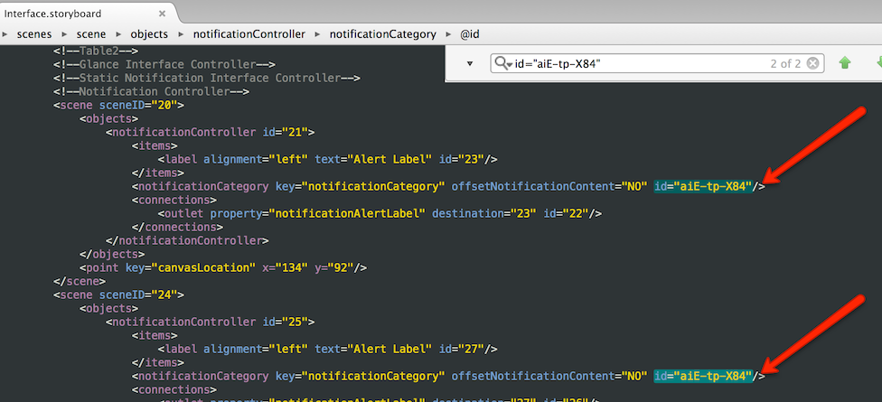
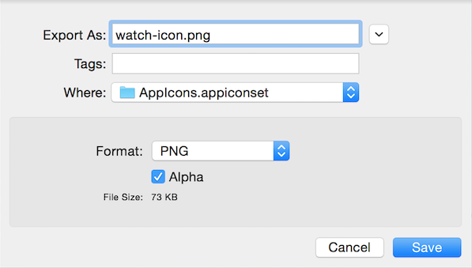
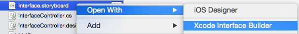
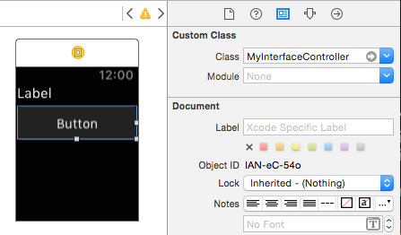
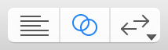
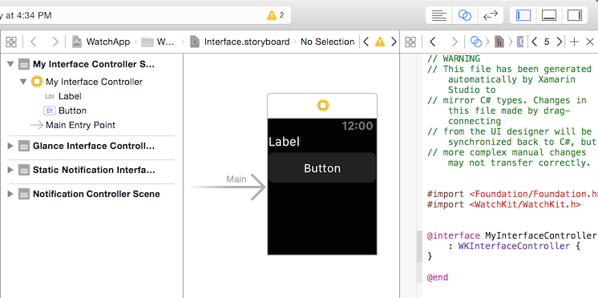
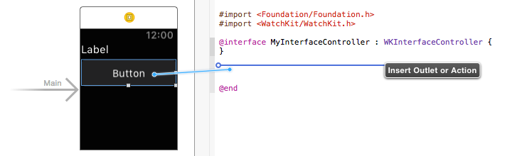
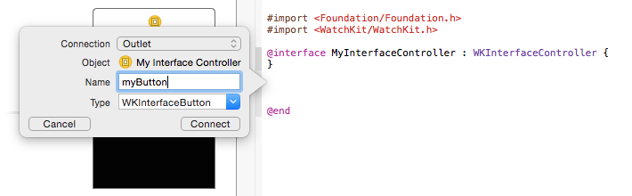

# watchOS Troubleshooting

This page contains additional information and workarounds for issues you may encounter.

- [Known Issues](#knownissues)

- [Removing the Alpha Channel from Icon Images](#noalpha)

- [Manually Adding Interface Controller Files](#add) for Xcode Interface Builder.

- [Launching the WatchApp from the Command Line](#command_line).

<a name="knownissues"></a>

## Known Issues

### General

<a name="deploy"></a>

- Earlier releases of Visual Studio for Mac incorrectly show one of the
    **AppleCompanionSettings** icons as being 88x88 pixels; which results in a
    **Missing Icon Error** if you attempt to submit to the App Store.
    This icon should be 87x87 pixels (29 units for **@3x** Retina screens). You
    cannot fix this in Visual Studio for Mac - either edit the image asset in Xcode or manually
    edit the **Contents.json** file.

- If the Watch Extension Project's **Info.plist > WKApp Bundle ID** is not [correctly
    set](~/ios/watchos/get-started/project-references.md)
    to match the Watch App's **Bundle ID**, the debugger will fail to
    connect and Visual Studio for Mac will wait with the message *"Waiting for debugger to connect"*.

- Debugging is supported in **Notifications** mode but can be
    unreliable. Retrying will sometimes work. Confirm that the
    Watch App's **Info.plist** `WKCompanionAppBundleIdentifier`
    is set to match the bundle identifier of the iOS parent/container
    app (ie. the one that runs on the iPhone).

- iOS Designer does not show entrypoint arrows for Glance or Notification
    interface controllers.

- You cannot add two `WKNotificationControllers` to a storyboard.
    Workaround: The `notificationCategory` element in the storyboard XML is always
    inserted with the same `id`. To work around this problem you can
    add two (or more) Notification Controllers, open the storyboard
    file in a text editor and then manually change the `id`
    element to be unique.

    [](troubleshooting-images/duplicate-id.png#lightbox)

- You may see an error "The application has not been built"
    when trying to launch the app. This occurs after a **Clean**
    when the startup project is set to the watch extension project.
    The fix is to select **Build > Rebuild All** and then
    re-launch the app.

<a name="noalpha"></a>

## Removing the Alpha Channel from Icon Images

Icons should not contain an alpha channel (the alpha channel defines
    transparent areas of an image), otherwise the app
    will be rejected during App Store submission with an error
    similar to this:

```csharp
Invalid Icon - The watch application '...watchkitextension.appex/WatchApp.app'
contains an icon file '...watchkitextension.appex/WatchApp.app/Icon-27.5@2x.png'
with an alpha channel. Icons should not have an alpha channel.
```

It's easy to remove the alpha channel on Mac OS X using the **Preview** app:

1. Open the icon image in **Preview** and then choose **File > Export**.

2. The dialog that appears will include an **Alpha** checkbox if an alpha channel
    is present.

    

3. *Untick* the **Alpha** checkbox and **Save** the file to the correct location.

4. The icon image should now pass Apple's validation checks.

<a name="add"></a>

## Manually Adding Interface Controller Files

> [!IMPORTANT]
> Xamarin's WatchKit support includes designing watch storyboards in the
> iOS designer (in both Visual Studio for Mac and Visual Studio), which
> does not require the steps outlined below. Simply give an interface
> controller a Class name in the Visual Studio for Mac Properties pad and
> the C# code files will be created automatically.

*If* you are using Xcode Interface Builder, follow
    these steps to create new interface controllers
    for your watch app and enable synchronization with
    Xcode so that the outlets and actions are available
    in C#:

1. Open the watch app's **Interface.storyboard** in **Xcode Interface Builder**.

    

2. Drag a new `InterfaceController` onto the storyboard:

    

3. You can now drag controls onto the interface controller
    (eg. labels and buttons) but you cannot create outlets or actions yet,
    because there is no **.h** header file. The following steps will
    cause the required **.h** header file to be created.

    

4. Close the storyboard and return to Visual Studio for Mac. Create a new C# file **MyInterfaceController.cs** (or whatever name you like) in the **watch app extension** project (NOT the watch app itself where the storyboard is). Add the following code (updating the namespace, classname,
    and the constructor name):

    ```csharp
    using System;
    using WatchKit;
    using Foundation;

    namespace WatchAppExtension  // remember to update this
    {
        public partial class MyInterfaceController // remember to update this
        : WKInterfaceController
        {
            public MyInterfaceController // remember to update this
            (IntPtr handle) : base (handle)
            {
            }
            public override void Awake (NSObject context)
            {
                base.Awake (context);
                // Configure interface objects here.
                Console.WriteLine ("{0} awake with context", this);
            }
            public override void WillActivate ()
            {
                // This method is called when the watch view controller is about to be visible to the user.
                Console.WriteLine ("{0} will activate", this);
            }
            public override void DidDeactivate ()
            {
                // This method is called when the watch view controller is no longer visible to the user.
                Console.WriteLine ("{0} did deactivate", this);
            }
        }
    }
    ```

5. Create another new C# file **MyInterfaceController.designer.cs**
    in the **watch app extension** project and
    add the code below. Be sure to update the namespace, the classname
    and the `Register` attribute:

    ```csharp
    using Foundation;
    using System.CodeDom.Compiler;

    namespace HelloWatchExtension  // remember to update this
    {
        [Register ("MyInterfaceController")] // remember to update this
        partial class MyInterfaceController  // remember to update this
        {
            void ReleaseDesignerOutlets ()
            {
            }
        }
    }
    ```

    > [!TIP]
    > You can (optionally) make this file a child node of the first file by dragging it onto the other C# file in the Visual Studio for Mac Solution Pad. It will then appear like this:

    

6. Select **Build > Build All** so that Xcode synchronization
    will recognize the new class (via the `Register` attribute)
    that we used.

7. Re-open the storyboard by right-clicking on the watch app
    storyboard file and selecting
    **Open With > Xcode Interface Builder**:

    

8. Select your new interface controller and
    give it the classname you defined above, eg. `MyInterfaceController`.
    If everything has worked correctly, it should appear automatically
    in the **Class:** drop down list and you can select it from there.

    

9. Choose the **Assistant Editor** view in Xcode (the icon
    with two overlapping circles) so that you
    can see the storyboard and the code side-by-side:

    

    When the focus is in the code pane, ensure you're look at the
    **.h** header file, and if not right-click in the breadcrumb
    bar and select the correct file (**MyInterfaceController.h**)

    

10. You can now create outlets and actions by **Ctrl + drag**
    from the storyboard into the **.h** header file.

    

    When you release the drag, you'll be prompted to select whether
    to create an outlet or an action, and choose its name:

    

11. Once the storyboard changes are saved and Xcode is closed,
    return to Visual Studio for Mac. It will detect the header file changes
    and automatically add code to the **.designer.cs** file:

    ```csharp
    [Register ("MyInterfaceController")]
    partial class MyInterfaceController
    {
        [Outlet]
        WatchKit.WKInterfaceButton myButton { get; set; }

        void ReleaseDesignerOutlets ()
        {
            if (myButton != null) {
                myButton.Dispose ();
                myButton = null;
            }
        }
    }
    ```

You can now reference the control (or implement the action)
in C#!

<a name="command_line"></a>

## Launching the Watch App from the Command Line

> [!IMPORTANT]
> You can start the Watch App in normal app mode by default, and also in
> **Glance** or **Notification** modes using
> [custom execution parameters](~/ios/watchos/get-started/installation.md#custommodes) in
> Visual Studio for Mac and Visual Studio.

You can also use the command line to control the iOS Simulator. The command
     line tool used to launch watch apps is **mtouch**.

Here is a full example (executed as a single line in the terminal):

```bash
/Library/Frameworks/Xamarin.iOS.framework/Versions/Current/bin/mtouch --sdkroot=/Applications/Xcode.app/Contents/Developer/ --device=:v2:runtime=com.apple.CoreSimulator.SimRuntime.iOS-8-2,devicetype=com.apple.CoreSimulator.SimDeviceType.iPhone-6
--launchsimwatch=/path/to/watchkitproject/watchsample/bin/iPhoneSimulator/Debug/watchsample.app
```

The parameter you need to update to reflect your app is `launchsimwatch`:

### --launchsimwatch

The full path to the main app bundle *for the iOS app that
    contains the watch app and extension*.

> [!NOTE]
> The path you need to supply is for the *iPhone application .app file*,
> i.e. the one that will be deployed to the iOS simulator and that contains
> both the watch extension and watch app.

Example:

```bash
--launchsimwatch=/path/to/watchkitproject/watchsample/bin/iPhoneSimulator/Debug/watchsample.app
```

## Notification Mode

To test the app's [**Notification** mode](~/ios/watchos/platform/notifications.md), set the
     `watchlaunchmode` parameter to `Notification` and
     supply a path to a JSON file that contains a
     test notification payload.

The payload parameter is *required* for Notification mode.

For example, add these arguments to the mtouch command:

```bash
--watchlaunchmode=Notification --watchnotificationpayload=/path/to/file.json
```

## Other Arguments

The remaining arguments are explained below:

### --sdkroot

Required. Specifies the path to Xcode (6.2 or later).

Example:

```bash
 --sdkroot /Applications/Xcode.app/Contents/Developer/
```

### --device

The simulator device to execute. This can be specified in two ways,
    either using the udid of a specific device, or using a combination
    of runtime and device type.

The exact values varies between machines, and can be queried using
    Apple’s **simctl** tool:

```bash
/Applications/Xcode.app/Contents/Developer/usr/bin/simctl list
```

**UDID**

Example:

```bash
--device=:v2:udid=AAAAAAA-BBBB-CCCC-DDDD-EEEEEEEEEEEE
```

**Runtime and Device type**

Example:

```bash
--device=:v2:runtime=com.apple.CoreSimulator.SimRuntime.iOS-8-2,devicetype=com.apple.CoreSimulator.SimDeviceType.iPhone-6
```

## Related Links

- [WatchKitCatalog (sample)](/samples/xamarin/ios-samples/watchos-watchkitcatalog)
- [WatchTables (sample)](/samples/xamarin/ios-samples/watchos-watchtables)