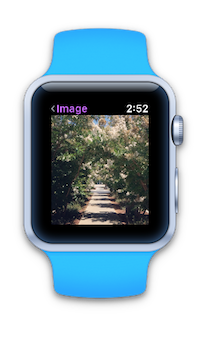
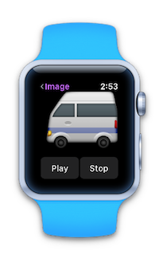
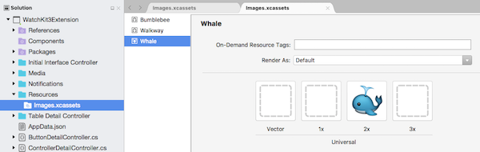
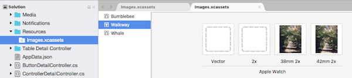
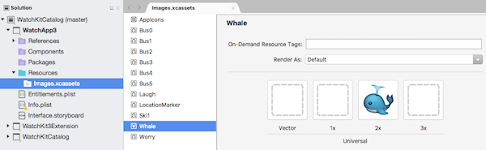
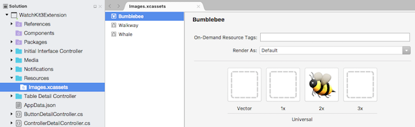
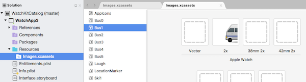

# watchOS Image Controls in Xamarin

watchOS provides a [`WKInterfaceImage`](xref:WatchKit.WKInterfaceImage) control to display
  images and simple animations. Some controls
  can also have a background image (such as
  buttons, groups, and interface controllers).

 
<!-- watch image courtesy of http://infinitapps.com/bezel/ -->

Use asset catalog images to add images to Watch Kit apps.
  Only **@2x** versions are required, since all watch devices
  have Retina displays.



It is good practice to ensure the images themselves
  are the correct size for the watch display. *Avoid*
  using incorrectly sized images (especially large ones)
  and scaling to display them on the watch.

You can use the Watch Kit sizes (38mm and 42mm) in an asset
  catalog image to specify different images for each display
  size.



## Images on the Watch

The most efficient way to display images is to
  *include them in the watch app project* and
  display them using the `SetImage(string imageName)`
  method.

For example, the [WatchKitCatalog](/samples/xamarin/ios-samples/watchos-watchkitcatalog/) sample
  has a number of images added to an asset catalog in the watch app project:



These can be efficiently loaded and displayed
  on the watch using `SetImage` with the string
  name parameter:

```csharp
myImageControl.SetImage("Whale");
myOtherImageControl.SetImage("Worry");
```

### Background Images

The same logic applies for the `SetBackgroundImage (string imageName)`
  on the `Button`, `Group`, and `InterfaceController` classes. Best
  performance is achieved by storing the images in the watch app itself.

## Images in the Watch Extension

In addition to loading images that are stored in the watch
  app itself, you can send images from the extension bundle
  to the watch app for display (or you could
  download images from a remote location, and display those).

To load images from the watch extension, create
  `UIImage` instances and then call `SetImage` with
  the `UIImage` object.

For example, the [WatchKitCatalog](/samples/xamarin/ios-samples/watchos-watchkitcatalog) sample
  has an image named **Bumblebee** in the watch extension project:



The following code will result in:

- the image being loaded into memory, and
- displayed on the watch.

```csharp
using (var image = UIImage.FromBundle ("Bumblebee")) {
    myImageControl.SetImage (image);
}
```

## Animations

To animate a set of images, they should all begin
  with the same prefix and have a numeric suffix.

The [WatchKitCatalog](/samples/xamarin/ios-samples/watchos-watchkitcatalog) sample
  has a series of numbered images in the watch app project
  with the **Bus** prefix:



To display these images as an animation, first load the
  image using `SetImage` with the prefix name and
  then call `StartAnimating`:

```csharp
animatedImage.SetImage ("Bus");
animatedImage.StartAnimating ();
```

Call `StopAnimating` on the image control to
  stop the animation looping:

```csharp
animatedImage.StopAnimating ();
```

<a name="cache"></a>

## Appendix: Caching Images (watchOS 1)

> [!IMPORTANT]
> watchOS 3 apps run entirely on the device. The following
> information is for watchOS 1 apps only.

If the application repeatedly uses an image that is
  stored in the extension (or has been downloaded),
  it is possible to cache the image in the watch's
  storage, to increase performance for subsequent
  displays.

Use the `WKInterfaceDevice`s `AddCachedImage` method
  to transfer the image to the watch, and then use
  `SetImage` with the image name parameter as a string
  to display it:

```csharp
var device = WKInterfaceDevice.CurrentDevice;
using (var image = UIImage.FromBundle ("Bumblebee")) {
    if (!device.AddCachedImage (image, "Bumblebee")) {
            Console.WriteLine ("Image cache full.");
        } else {
            cachedImage.SetImage ("Bumblebee");
        }
    }
}
```

You can query the contents of the image cache in
  code using `WKInterfaceDevice.CurrentDevice.WeakCachedImages`.

### Managing the Cache

The cache about 20 MB in size. It is kept across app restarts,
  and when it fills up it is your responsibility to clear out
  files using `RemoveCachedImage` or `RemoveAllCachedImages`
  methods on the `WKInterfaceDevice.CurrentDevice` object.

## Related Links

- [WatchKitCatalog (sample)](/samples/xamarin/ios-samples/watchos-watchkitcatalog)
- [Apple's Image doc](https://developer.apple.com/documentation/watchkit/wkinterfaceimage)