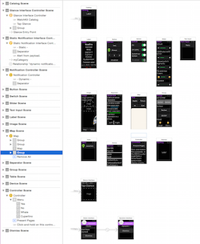

# watchOS User Interface Controls in Xamarin

The [**WatchKitCatalog**](https://github.com/xamarin/monotouch-samples/tree/master/watchOS/WatchKitCatalog) sample
  demonstrates various watchOS controls. The app's storyboard
  is shown here (click to zoom):

The programmatic names of all the controls is prefixed with
  `WKInterface` (eg. `WKInterfaceLabel`, `WKInterfaceButton`).

|Control|Description|Screenshot|
|---|---|---|
|Label|Use `SetText` and other properties to control the appearance of text in a label control. `NSAttributedString` is also supported. [Catalog code](https://github.com/xamarin/ios-samples/blob/master/watchOS/WatchKitCatalog/WatchKit3Extension/LabelDetailController.cs)||
|Button|Create and set properties in the storyboard. Ctrl+drag to add an `Action` to implement a handler for when it's clicked. [Catalog code](https://github.com/xamarin/ios-samples/blob/master/watchOS/WatchKitCatalog/WatchKit3Extension/ButtonDetailController.cs)||
|Switch|Use `SetOn` to control the switch state. [Catalog code](https://github.com/xamarin/ios-samples/blob/master/watchOS/WatchKitCatalog/WatchKit3Extension/SwitchDetailController.cs)||
|Slider|Many different styles are possible. [Catalog code](https://github.com/xamarin/ios-samples/blob/master/watchOS/WatchKitCatalog/WatchKit3Extension/SliderDetailController.cs)||
|Image|Use `myImage.SetImage("MyWatchImage")` to load images on the watch, or `WKInterfaceDevice.CurrentDevice.AddCachedImage` to cache them for repeated use on the watch. [Image Control documentation](~/ios/watchos/user-interface/image.md) [Catalog code](https://github.com/xamarin/ios-samples/blob/master/watchOS/WatchKitCatalog/WatchKit3Extension/ImageDetailController.cs)||
|Separator|Use separators to help create attractive watch UIs. [Catalog code](https://github.com/xamarin/ios-samples/blob/master/watchOS/WatchKitCatalog/WatchKit3Extension/SeparatorDetailController.cs)||
|Map|The map image is statically displayed on the watch but you can control many aspects of its appearance, including adding pins. [Catalog code](https://github.com/xamarin/ios-samples/blob/master/watchOS/WatchKitCatalog/WatchKit3Extension/MapDetailController.cs)||
|Movie & InlineMove|Movies can either open on their own, or inline [Catalog code](https://github.com/xamarin/ios-samples/blob/master/watchOS/WatchKitCatalog/WatchKit3Extension/MovieDetailController.cs)||
|Group|Use groups to help create attractive watch UIs. [Catalog code](https://github.com/xamarin/ios-samples/blob/master/watchOS/WatchKitCatalog/WatchKit3Extension/GroupDetailController.cs)||
|Table|A simplified version of tables on iOS. Implement `DidSelectRow` to respond to user selection (or use a segue). [Table Control documentation](~/ios/watchos/user-interface/table.md) [Catalog code](https://github.com/xamarin/ios-samples/blob/master/watchOS/WatchKitCatalog/WatchKit3Extension/Table%20Detail%20Controller/TableDetailController.cs)||
|Device|`WKInterfaceDevice.CurrentDevice` includes properties such as `ScreenBounds`, `ScreenScale`, and `PreferredContentSizeCategory`. [Catalog code](https://github.com/xamarin/ios-samples/blob/master/watchOS/WatchKitCatalog/WatchKit3Extension/DeviceDetailController.cs)||
|[Menu](~/ios/watchos/user-interface/menu.md)|Define the force-press menu in the storyboard and implement the actions for each button in the code. [Menu Control (Force Touch) documentation](~/ios/watchos/user-interface/menu.md) [Catalog code](https://github.com/xamarin/ios-samples/blob/master/watchOS/WatchKitCatalog/WatchKit3Extension/ControllerDetailController.cs)||
|Text Input|Use `PresentTextInputController` and the `WKTextInputMode` enumeration. [Text Input documentation](~/ios/watchos/user-interface/text-input.md) [Catalog code](https://github.com/xamarin/ios-samples/blob/master/watchOS/WatchKitCatalog/WatchKit3Extension/TextInputController.cs)||
|Digital Crown|The Digital Crown can be used to drive a picker, or it's rotation can be tracked in code. [Catalog code](https://github.com/xamarin/ios-samples/blob/master/watchOS/WatchKitCatalog/WatchKit3Extension/CrownDetailController.cs)||
|Gestures|There are four types of gesture recognition that can be added to a scene: Tap, Swipe, Pan, and LongPress. [Catalog code](https://github.com/xamarin/ios-samples/blob/master/watchOS/WatchKitCatalog/WatchKit3Extension/GestureDetailController.cs)||

## Related Links

- [WatchKitCatalog (sample)](/samples/xamarin/ios-samples/watchos-watchkitcatalog)
- [Watch Kit API Reference](xref:WatchKit)