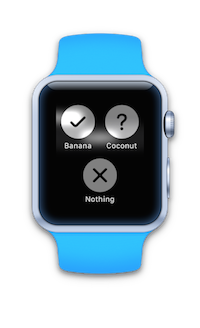
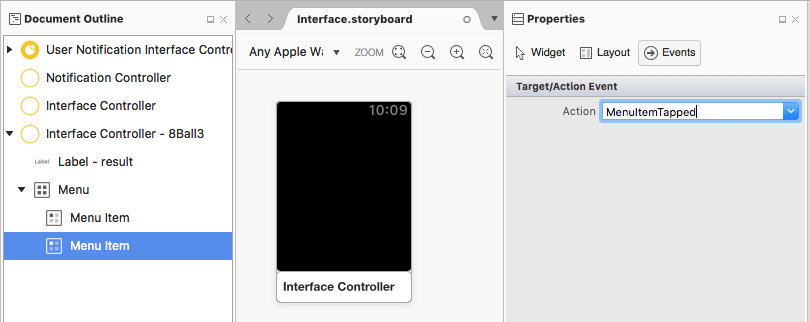

# watchOS Menu Control (Force Touch) in Xamarin

Watch Kit provides a Force Touch gesture that triggers a menu
when implemented on a watch app screen.


<!-- watch image courtesy of http://infinitapps.com/bezel/ -->

## Responding to Force Touch

If a `Menu` has been implemented for an interface controller,
when a user performs a Force Touch the menu will be displayed. If
no menu has been implemented, the screen is briefly animated an no
other action occurs.

Force Touches are not associated with any particular element on the screen;
only one menu can be attached to an interface controller and it will appear
regardless of where the Force Touch press occurs on the screen.

Between one and four menu options can be presented.

## Adding a Menu

A `Menu` must be added to an `InterfaceController` on the storyboard
at design time. When a menu control is dragged onto an interface
controller there is no visual indication on the storyboard preview
but the **Menu** appears in the **Document Outline** pad:



Up to four menu items can be added to the menu control. They can
be configured in the **Properties** pad. The following
attributes can be set:

- Title, and
- Custom Image, or
- A system image: Accept, Add, Block, Decline, Info, Maybe, More, Mute, Pause,
  Play, Repeat, Resume, Share, Shuffle, Speaker, Trash.

Create an `Action` by selecting the **Events** section of the **Properties**
pad and typing the name for the action method. A partial method will
be created in the code, which can be implemented in the interface
controller class, like this:

```csharp
partial void MenuItemTapped ()
{
    Console.WriteLine ("A menu item was tapped.");
}
```

### Custom Images

Similar to tab images in iOS, menu item images require an opaque pattern
with an alpha channel that allows the background to show through.

You should add the images used for the menu to the watch app project
(not the watch app extension project) for best performance.

## Changing the Menu Items

<!--
### Design Time Items

Menu items added the storyboard can be shown and hidden programmatically.
-->

### Adding at Runtime

You cannot cause a `Menu` to be added to an interface controller at runtime,
although the collection of `MenuItem`s *can* be altered programmatically.
Use the `AddMenuItem` method as shown:

```csharp
AddMenuItem (WKMenuItemIcon.Accept, "Yes", new ObjCRuntime.Selector ("tapped"));
```

The Xamarin.iOS Watch Kit API currently requires a `selector` for the
`AdMenuItem` method, which should be declared like this:

```csharp
[Export("tapped")]
void MenuItemTapped ()
{
    Console.WriteLine ("The dynamically added 'Yes' menu item was tapped.");
}
```

### Removing at Runtime

The `ClearAllMenuItems` method can be called to remove all *programmatically
added* menu items.

Menu items configured in the storyboard cannot be cleared.

## Related Links

- [WatchKitCatalog (sample)](/samples/xamarin/ios-samples/watchos-watchkitcatalog)
- [Apple's Menu doc](https://developer.apple.com/library/prerelease/ios/documentation/General/Conceptual/WatchKitProgrammingGuide/Menus.html)