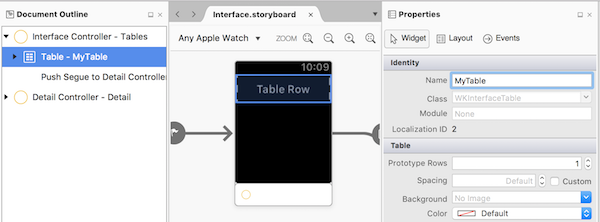
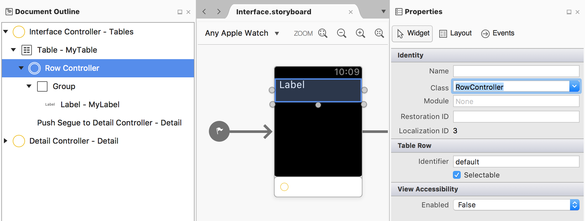
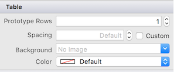
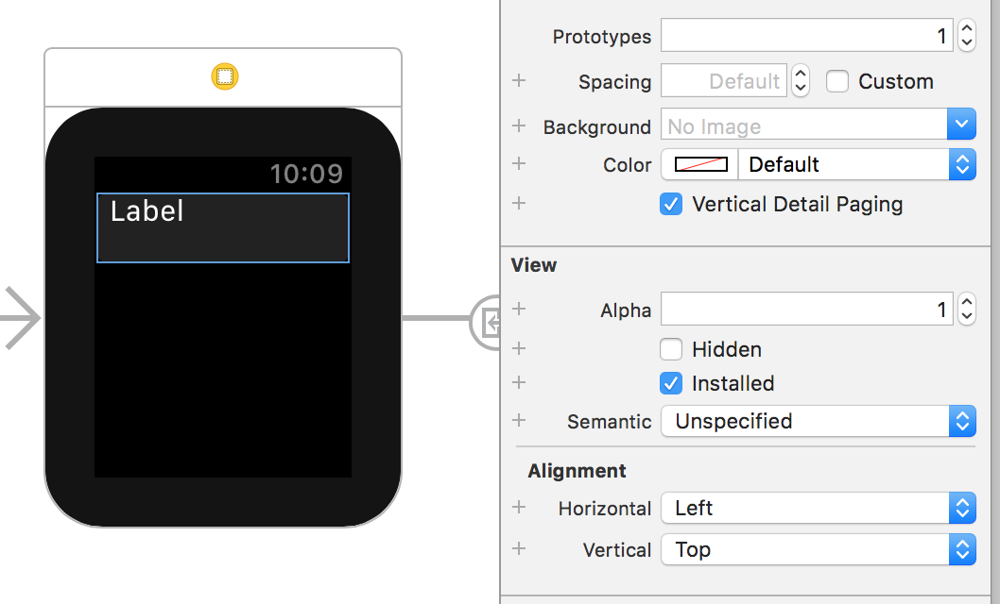

# watchOS Table Controls in Xamarin

The watchOS `WKInterfaceTable` control is much simpler than
  its iOS counterpart, but performs a similar role. It creates
  a scrolling list of rows that can have custom layouts, and
  which respond to touch events.

 
<!-- watch image courtesy of http://infinitapps.com/bezel/ -->

## Adding a Table

Drag the **Table** control into a scene. By default it will look
  like this (showing a single unspecified row layout):

[](table-images/add-table.png#lightbox)

Give the table a name in the **Properties** pad's **Name** box, so that
it can be referred to in code.

## Add a Row Controller

The table automatically includes a single row, represented by a
 row controller that contains a **Group** control by default.

To set the **Class** for the row controller, select the row in the
  **Document Outline** and type a class name in the **Properties** pad:

[](table-images/add-row-controller.png#lightbox)

Once the class for the row's controller is set, the IDE will create a
corresponding C# file in the project. Drag controls (such as labels)
onto the row and give them names so they can be referred to in code.

## Create and Populate Rows

`SetNumberOfRows` creates the row controller classes for each row, using
  the `Identifier` to select the correct one. If you gave your
  row controller a custom `Identifier`, change **default** in the
  code snippet below to the identifier you used. The `RowController`
  *for every row* is created when `SetNumberOfRows` is called and
  the table displayed.

```csharp
myTable.SetNumberOfRows ((nint)rows.Count, "default");
    // loads row controller by identifier
```

> [!IMPORTANT]
> Table rows are not virtualized like they are in iOS. Try to limit the
> number of rows (Apple recommends less than 20).

Once the rows have been created, you need to populate
  each cell (like `GetCell` would do in iOS). This code
  snippet from the [WatchTables example](/samples/xamarin/ios-samples/watchos-watchtables)
  updates the label in each row

```csharp
for (var i = 0; i < rows.Count; i++) {
    var elementRow = (RowController)myTable.GetRowController (i);
    elementRow.myRowLabel.SetText (rows [i]);
}
```

> [!IMPORTANT]
> Using `SetNumberOfRows` and then looping through using
> `GetRowController` causes the entire table to be sent to the watch. On
> subsequent views of the table, if you need to add or remove specific rows
> use `InsertRowsAt` and `RemoveRowsAt` for better performance.

## Respond to Taps

You can respond to row selection in two different ways:

- implement the `DidSelectRow` method on the interface controller, or
- create a segue on the storyboard and implement `GetContextForSegue` if
  you want the row selection to open another scene.

### DidSelectRow

To programmatically handle row selection, implement the `DidSelectRow`
  method. To open a new scene, use `PushController` and pass the
  scene's identifier and the data context to use:

```csharp
public override void DidSelectRow (WKInterfaceTable table, nint rowIndex)
{
    var rowData = rows [(int)rowIndex];
    Console.WriteLine ("Row selected:" + rowData);
    // if selection should open a new scene
    PushController ("secondInterface", rows[(int)rowIndex]);
}
```

### GetContextForSegue

Drag a segue on the storyboard from your table row to
  another scene (hold down the **Control** key while dragging).
  Be sure to select the segue and give it
  an identifier in the **Properties** pad (such as
  `secondLevel` in the example below).

In the interface controller, implement the `GetContextForSegue`
  method and return the data context that should be provided
  to the scene that is presented by the segue.

```csharp
public override NSObject GetContextForSegue (string segueIdentifier, WKInterfaceTable table, nint rowIndex)
{
    if (segueIdentifier == "secondLevel") {
        return new NSString (rows[(int)rowIndex]);
    }
    return null;
}
```

This data is passed to the target storyboard scene in its `Awake` method.

## Multiple Row Types

By default the table control has a single row type that you
  can design. To add more row 'templates' use the **Rows** box
  in the **Properties** pad to create more row controllers:



Setting the **Rows** property to **3** will create additional
  row placeholders for you to drag controls into. For each row,
  set the **Class** name in the **Properties** pad to ensure
  the row controller class is created.


To populate a table with different row types use the `SetRowTypes`
  method to specify the row controller type to be used for each
  row in the table. Use the row's identifiers to specify which
  row controller should be used for each row.

The number of elements in this array should match
  the number of rows you expect to be in the table:

```csharp
myTable.SetRowTypes (new [] {"type1", "default", "default", "type2", "default"});
```

When populating a table with multiple row controllers, you'll need
  to keep track of which type you expect as you populate the UI:

```csharp
for (var i = 0; i < rows.Count; i++) {
    if (i == 0) {
        var elementRow = (Type1RowController)myTable.GetRowController (i);
        // populate UI controls
    } else if (i == 3) {
        var elementRow = (Type2RowController)myTable.GetRowController (i);
        // populate UI controls
    } else {
        var elementRow = (DefaultRowController)myTable.GetRowController (i);
        // populate UI controls
    }
}
```

## Vertical Detail Paging

watchOS 3 introduced a new feature for tables: the ability to scroll through
the detail pages related to each row, without having to go back to the
table and choose another row. The detail screens can be scrolled by swiping
up and down, or using the Digital Crown.

 

> [!IMPORTANT]
> This feature is currently only available by editing the
> storyboard in Xcode Interface Builder.

To enable this feature, select the `WKInterfaceTable` on the design surface
and tick the **Vertical Detail Paging** option:



As [explained by Apple](https://developer.apple.com/reference/watchkit/wkinterfacetable#1682023)
the table navigation must use segues for the paging feature to work. Re-write
any existing code that uses `PushController` to use segues instead.

<a name="add_row_controller"></a>

## Appendix: Row Controller Code Example

The IDE will automatically create two code files when a
  row controller is created in the designer. The code in these generated
  files is shown below for reference.

The first will be named for the class, for example **RowController.cs**, like this:

```csharp
using System;
using Foundation;

namespace WatchTablesExtension
{
    public partial class RowController : NSObject
    {
        public RowController ()
        {
        }
    }
}
```

The other **.designer.cs** file is a partial class definition
  that contains the outlets and actions that are created on
  the designer surface, such as this example with one `WKInterfaceLabel` control:

```csharp
using Foundation;
using System;
using System.CodeDom.Compiler;
using UIKit;

namespace WatchTables.OnWatchExtension
{
    [Register ("RowController")]
    partial class RowController
    {
        [Outlet]
        [GeneratedCode ("iOS Designer", "1.0")]
        public WatchKit.WKInterfaceLabel MyLabel { get; set; }

        void ReleaseDesignerOutlets ()
        {
            if (MyLabel != null) {
                MyLabel.Dispose ();
                MyLabel = null;
            }
        }
    }
}
```

The outlets and actions declared here can then be referenced in
code - however the **.designer.cs** file should NOT be edited directly.

## Related Links

- [WatchTables (sample)](/samples/xamarin/ios-samples/watchos-watchtables)
- [WatchKitCatalog (sample)](/samples/xamarin/ios-samples/watchos-watchkitcatalog)
- [Apple's Table doc](https://developer.apple.com/reference/watchkit/wkinterfacetable)