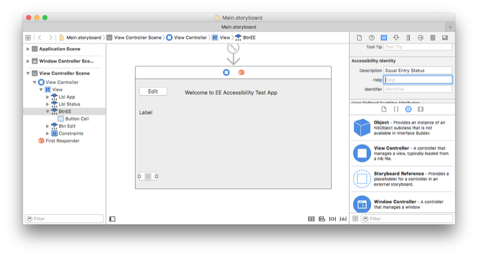
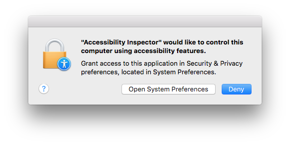
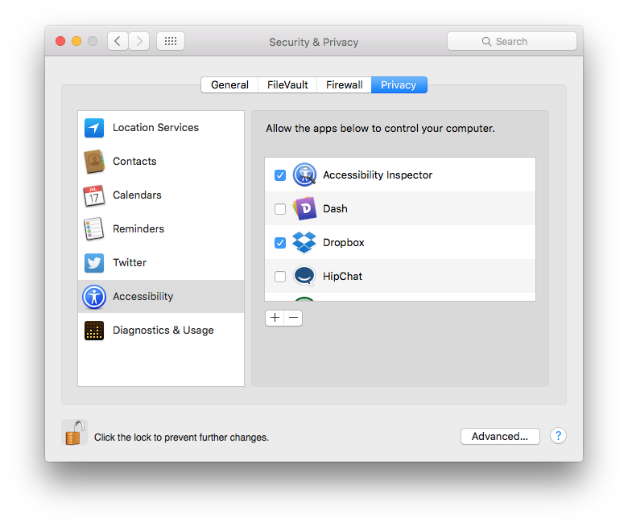
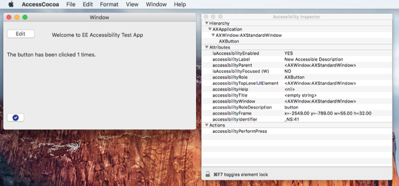

# Accessibility on macOS

This page describes how to use the macOS Accessibility APIs
to build apps according to the
[accessibility checklist](~/cross-platform/app-fundamentals/accessibility.md).
Refer to the [Android accessibility](~/android/app-fundamentals/accessibility.md)
and [iOS accessibility](~/ios/app-fundamentals/accessibility.md) pages for
other platform APIs.

To understand how the accessibility APIs work in macOS (formerly called OS X), first review
the [OS X accessibility model](https://developer.apple.com/library/mac/documentation/Accessibility/Conceptual/AccessibilityMacOSX/OSXAXmodel.html).

## Describing UI elements

AppKit uses the `NSAccessibility` protocol to expose APIs that help
make the user interface accessible. This includes a default behavior
that attempts to set meaningful values for accessibility properties, such
as setting a button's `AccessibilityLabel`. The label
is typically a single word or short phrase describing the control or view.

### Storyboard Files

Xamarin.Mac uses the Xcode Interface Builder to edit storyboard files.
Accessibility information can be edited in the **Identity inspector**
when a control is selected on the design surface (as shown in the screenshot below):

[](accessibility-images/xcode-large.png#lightbox)

### Code

Xamarin.Mac does not currently expose as `AccessibilityLabel` setter.  Add 
the following helper method to set the accessibility label:

```csharp
public static class AccessibilityHelper
{
	[System.Runtime.InteropServices.DllImport (ObjCRuntime.Constants.ObjectiveCLibrary)]
	extern static void objc_msgSend (IntPtr handle, IntPtr selector, IntPtr label);

	static public void SetAccessibilityLabel (this NSView view, string value)
	{
		objc_msgSend (view.Handle, new ObjCRuntime.Selector ("setAccessibilityLabel:").Handle, new NSString (value).Handle);
	}
}
```

This method can then be used in code as shown:

```csharp
AccessibilityHelper.SetAccessibilityLabel (someButton, "New Accessible Description");
```

The `AccessibilityHelp` property is for an explanation of what the control
or view does, and should only be added when the label may not provide sufficient
information. The help text should still be kept as short as possible, for
example "Deletes the document".

Some user interface elements are not relevant for accessible access (such as
a label next to an input that has its own accessibility label and help).
In these cases, set `AccessibilityElement = false` so that these controls or
views will be skipped by screen readers or other accessibility tools.

Apple provides [accessibility guidelines](https://developer.apple.com/library/mac/documentation/Accessibility/Conceptual/AccessibilityMacOSX/EnhancingtheAccessibilityofStandardAppKitControls.html)
that explains the best practices for accessibility labels and help text.

## Custom controls

Refer to Apple's [guidelines for accessible custom controls](https://developer.apple.com/library/mac/documentation/Accessibility/Conceptual/AccessibilityMacOSX/ImplementingAccessibilityforCustomControls.html)
for details on the additional steps required.

## Testing accessibility

macOS provides an **Accessibility Inspector** that helps test
accessibility functionality. The inspector is included with Xcode.

The first time it is launched, the **Accessibility Inspector** will
require permission to control the computer via accessibility:



Unlock the settings screen (if required, on the lower-left) and tick
the **Accessibility Inspector**:



Once enabled, the inspector appears as a floating window that can be moved around
the screen. The screenshot below shows the inspector running next to a sample Mac app. As the cursor
is moved over the window, the inspector displays all the accessible properties
of each control:

[](accessibility-images/accessibility-example-large.png#lightbox)

For more information, read the [testing accessibility for OS X guide](https://developer.apple.com/library/mac/documentation/Accessibility/Conceptual/AccessibilityMacOSX/OSXAXTestingApps.html).


## Related Links

- [Cross-platform accessibility](~/cross-platform/app-fundamentals/accessibility.md)
- [Mac Accessibility](https://www.apple.com/accessibility/mac/)
