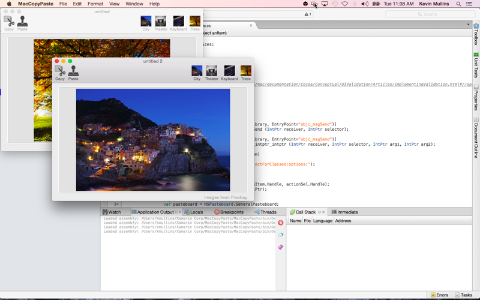
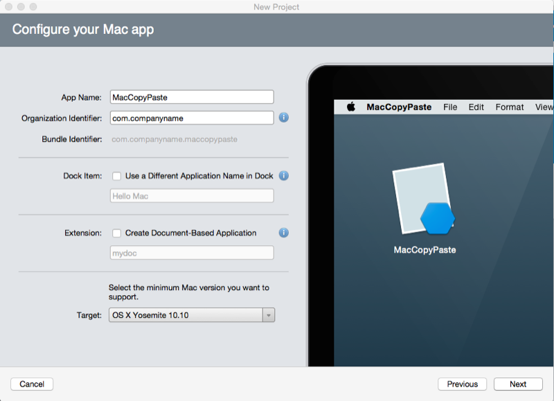
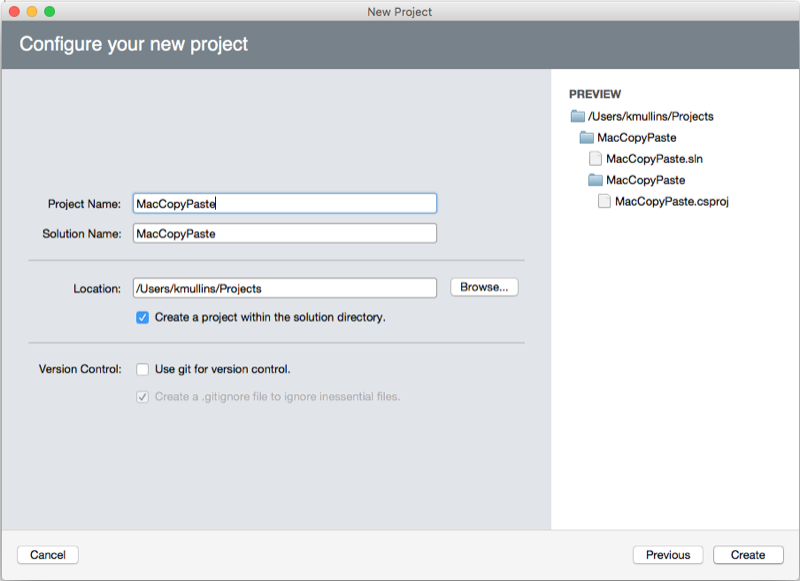
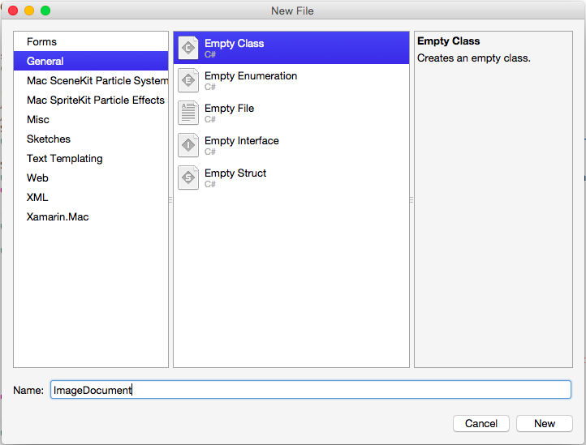
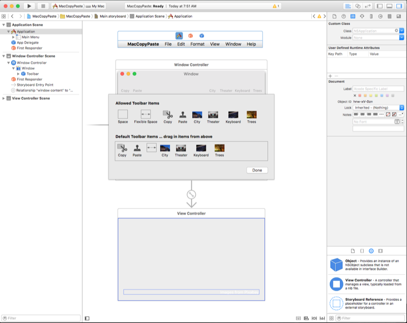
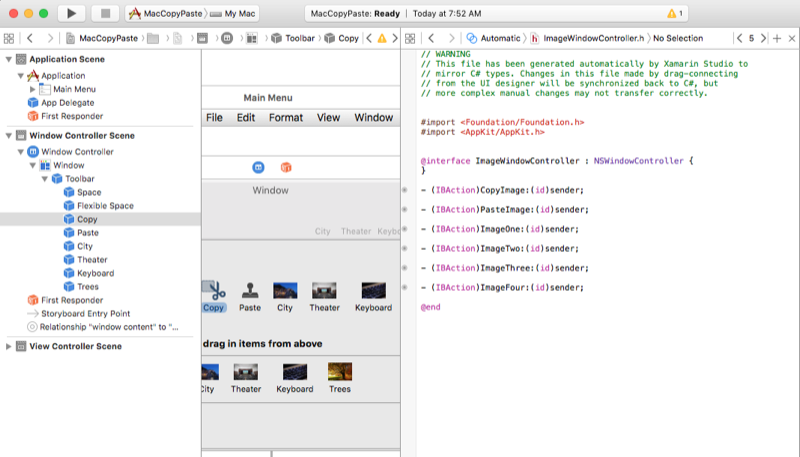
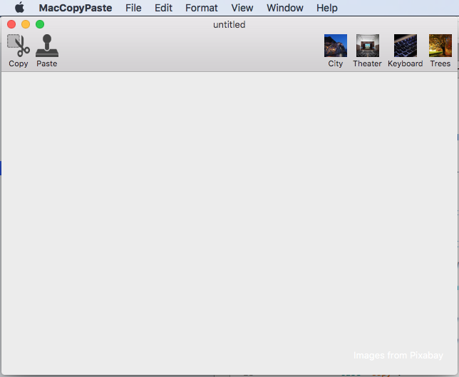
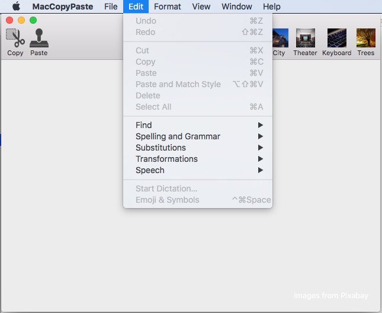
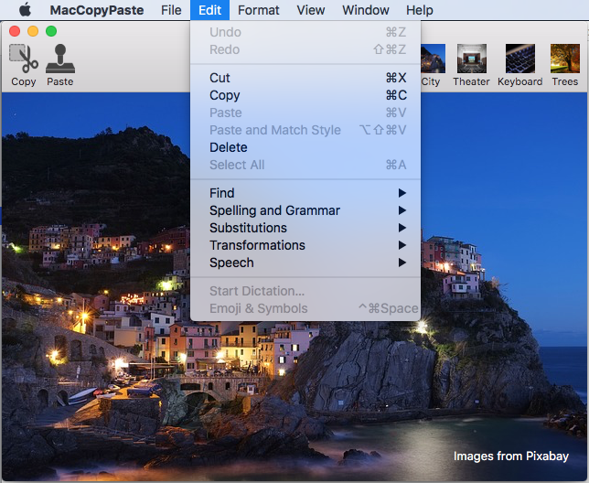
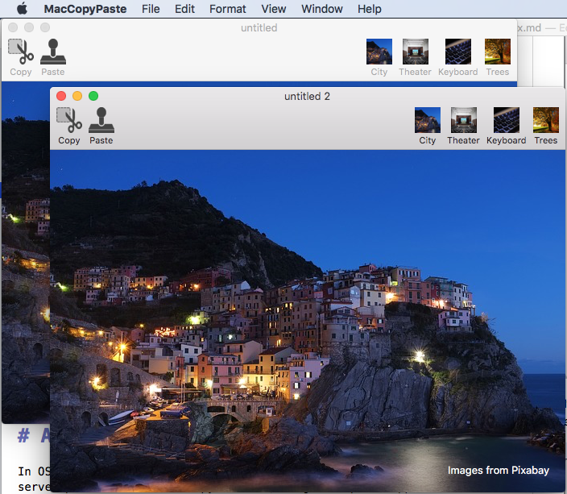

# Copy and paste in Xamarin.Mac

_This article covers working with the pasteboard to provide copy and paste in a Xamarin.Mac application. It shows how to work with standard data types that can be shared between multiple apps and how to support custom data within a given app._

## Overview

When working with C# and .NET in a Xamarin.Mac application, you have access to the same pasteboard (copy and paste) support that a developer working in Objective-C has.

In this article we will be covering the two main ways to use the pasteboard in a Xamarin.Mac app:

1. **Standard Data Types** - Since pasteboard operations are typically carried out between two unrelated apps, neither app knows the types of data that the other supports. To maximize the potential for sharing, the pasteboard can hold multiple representations of a given item (using a standard set of common data types), this allow the consuming app to pick the version that is best suited for its needs.
2. **Custom Data** - To support the copying and pasting of complex data within your Xamarin.Mac you can define a custom data type that will be handled by the pasteboard. For example, a vector drawing app that allows the user to copy and paste complex shapes that are composed of multiple data types and points.

[](copy-paste-images/intro01-large.png#lightbox)

In this article, we'll cover the basics of working with the pasteboard in a Xamarin.Mac application to support copy and paste operations. It is highly suggested that you work through the [Hello, Mac](~/mac/get-started/hello-mac.md) article first, specifically the [Introduction to Xcode and Interface Builder](~/mac/get-started/hello-mac.md#introduction-to-xcode-and-interface-builder) and [Outlets and Actions](~/mac/get-started/hello-mac.md#outlets-and-actions) sections, as it covers key concepts and techniques that we'll be using in this article.

You may want to take a look at the [Exposing C# classes / methods to Objective-C](~/mac/internals/how-it-works.md) section of the [Xamarin.Mac Internals](~/mac/internals/how-it-works.md) document as well, it explains the `Register` and `Export` attributes used to wire up your C# classes to Objective-C objects and UI elements.

## Getting started with the pasteboard

The pasteboard presents a standardized mechanism for exchanging data within a given application or between applications. The typical use for a pasteboard in a Xamarin.Mac application is to handle copy and paste operations, however a number of other operations are also supported (such as Drag & Drop and Application Services).

To get you off the ground quickly, we are going to start with a simple, practical introduction to using pasteboards in a Xamarin.Mac app. Later, we'll provide an in-depth explanation of how the pasteboard works and the methods used.

For this example, we will be creating a simple document based application that manages a window containing an image view. The user will be able to copy and paste images between documents in the app and to or from other apps or multiple windows inside the same app.

### Creating the Xamarin project

First, we are going to create a new document based Xamarin.Mac app that we will be adding copy and paste support for.

Do the following:

1. Start Visual Studio for Mac and click the **New Project...** link.
2. Select **Mac** > **App** > **Cocoa App**, then click the **Next** button: 

    [](copy-paste-images/sample01-large.png#lightbox)
3. Enter `MacCopyPaste` for the **Project Name** and keep everything else as default. Click Next: 

    [](copy-paste-images/sample01a-large.png#lightbox)

4. Click the **Create** button: 

    [](copy-paste-images/sample02-large.png#lightbox)

### Add an NSDocument

Next we will add custom `NSDocument` class that will act as the background storage for the application's user interface. It will contain a single Image View and know how to copy an image from the view into the default pasteboard and how to take an image from the default pasteboard and display it in the Image View.

Right-click on the Xamarin.Mac project in the **Solution Pad** and select **Add** > **New File..**:



Enter `ImageDocument` for the **Name** and click the **New** button. Edit the **ImageDocument.cs** class and make it look like the following:

```csharp
using System;
using AppKit;
using Foundation;
using ObjCRuntime;

namespace MacCopyPaste
{
    [Register("ImageDocument")]
    public class ImageDocument : NSDocument
    {
        #region Computed Properties
        public NSImageView ImageView {get; set;}

        public ImageInfo Info { get; set; } = new ImageInfo();

        public bool ImageAvailableOnPasteboard {
            get {
                // Initialize the pasteboard
                NSPasteboard pasteboard = NSPasteboard.GeneralPasteboard;
                Class [] classArray  = { new Class ("NSImage") };

                // Check to see if an image is on the pasteboard
                return pasteboard.CanReadObjectForClasses (classArray, null);
            }
        }
        #endregion

        #region Constructor
        public ImageDocument ()
        {
        }
        #endregion

        #region Public Methods
        [Export("CopyImage:")]
        public void CopyImage(NSObject sender) {

            // Grab the current image
            var image = ImageView.Image;

            // Anything to process?
            if (image != null) {
                // Get the standard pasteboard
                var pasteboard = NSPasteboard.GeneralPasteboard;

                // Empty the current contents
                pasteboard.ClearContents();

                // Add the current image to the pasteboard
                pasteboard.WriteObjects (new NSImage[] {image});

                // Save the custom data class to the pastebaord
                pasteboard.WriteObjects (new ImageInfo[] { Info });

                // Using a Pasteboard Item
                NSPasteboardItem item = new NSPasteboardItem();
                string[] writableTypes = {"public.text"};

                // Add a data provier to the item
                ImageInfoDataProvider dataProvider = new ImageInfoDataProvider (Info.Name, Info.ImageType);
                var ok = item.SetDataProviderForTypes (dataProvider, writableTypes);

                // Save to pasteboard
                if (ok) {
                    pasteboard.WriteObjects (new NSPasteboardItem[] { item });
                }
            }

        }

        [Export("PasteImage:")]
        public void PasteImage(NSObject sender) {

            // Initialize the pasteboard
            NSPasteboard pasteboard = NSPasteboard.GeneralPasteboard;
            Class [] classArray  = { new Class ("NSImage") };

            bool ok = pasteboard.CanReadObjectForClasses (classArray, null);
            if (ok) {
                // Read the image off of the pasteboard
                NSObject [] objectsToPaste = pasteboard.ReadObjectsForClasses (classArray, null);
                NSImage image = (NSImage)objectsToPaste[0];

                // Display the new image
                ImageView.Image = image;
            }

            Class [] classArray2 = { new Class ("ImageInfo") };
            ok = pasteboard.CanReadObjectForClasses (classArray2, null);
            if (ok) {
                // Read the image off of the pasteboard
                NSObject [] objectsToPaste = pasteboard.ReadObjectsForClasses (classArray2, null);
                ImageInfo info = (ImageInfo)objectsToPaste[0];

            }

        }
        #endregion
    }
}
```

Let's take a look at some of the code in detail below.

The following code provides a property to test for the existence of image data on the default pasteboard, if an image is available, `true` is returned else `false`:

```csharp
public bool ImageAvailableOnPasteboard {
    get {
        // Initialize the pasteboard
        NSPasteboard pasteboard = NSPasteboard.GeneralPasteboard;
        Class [] classArray  = { new Class ("NSImage") };

        // Check to see if an image is on the pasteboard
        return pasteboard.CanReadObjectForClasses (classArray, null);
    }
}
```

The following code copies an image from the attached image view into the default pasteboard:

```csharp
[Export("CopyImage:")]
public void CopyImage(NSObject sender) {

    // Grab the current image
    var image = ImageView.Image;

    // Anything to process?
    if (image != null) {
        // Get the standard pasteboard
        var pasteboard = NSPasteboard.GeneralPasteboard;

        // Empty the current contents
        pasteboard.ClearContents();

        // Add the current image to the pasteboard
        pasteboard.WriteObjects (new NSImage[] {image});

        // Save the custom data class to the pastebaord
        pasteboard.WriteObjects (new ImageInfo[] { Info });

        // Using a Pasteboard Item
        NSPasteboardItem item = new NSPasteboardItem();
        string[] writableTypes = {"public.text"};

        // Add a data provider to the item
        ImageInfoDataProvider dataProvider = new ImageInfoDataProvider (Info.Name, Info.ImageType);
        var ok = item.SetDataProviderForTypes (dataProvider, writableTypes);

        // Save to pasteboard
        if (ok) {
            pasteboard.WriteObjects (new NSPasteboardItem[] { item });
        }
    }

}
```

And the following code pastes an image from the default pasteboard and displays it in the attached image view (if the pasteboard contains a valid image):

```csharp
[Export("PasteImage:")]
public void PasteImage(NSObject sender) {

    // Initialize the pasteboard
    NSPasteboard pasteboard = NSPasteboard.GeneralPasteboard;
    Class [] classArray  = { new Class ("NSImage") };

    bool ok = pasteboard.CanReadObjectForClasses (classArray, null);
    if (ok) {
        // Read the image off of the pasteboard
        NSObject [] objectsToPaste = pasteboard.ReadObjectsForClasses (classArray, null);
        NSImage image = (NSImage)objectsToPaste[0];

        // Display the new image
        ImageView.Image = image;
    }

    Class [] classArray2 = { new Class ("ImageInfo") };
    ok = pasteboard.CanReadObjectForClasses (classArray2, null);
    if (ok) {
        // Read the image off of the pasteboard
        NSObject [] objectsToPaste = pasteboard.ReadObjectsForClasses (classArray2, null);
        ImageInfo info = (ImageInfo)objectsToPaste[0]
    }
}
```

With this document in place, we'll create the user interface for the Xamarin.Mac app.

### Building the user interface

Double-click the **Main.storyboard** file to open it in Xcode. Next, add a toolbar and an image well and configure them as follows:

[](copy-paste-images/sample04-large.png#lightbox)

Add a copy and paste **Image Toolbar Item** to the left side of the toolbar. We'll be using those as shortcuts to copy and paste from the Edit menu. Next, add four **Image Toolbar Items** to the right side of the toolbar. We'll use these to populate the image well with some default images.

For more information on working with toolbars, please see our [Toolbars](~/mac/user-interface/toolbar.md) documentation.

Next, let's expose the following outlets and actions for our toolbar items and the image well:

[](copy-paste-images/sample05-large.png#lightbox)

For more information on working with outlets and actions, please see the [Outlets and Actions](~/mac/get-started/hello-mac.md#outlets-and-actions) section of our [Hello, Mac](~/mac/get-started/hello-mac.md) documentation.

### Enabling the user interface

With our user interface created in Xcode and our UI element exposed via outlets and actions, we need to add the code to enable the UI. Double-click the **ImageWindow.cs** file in the **Solution Pad** and make it look like the following:

```csharp
using System;
using Foundation;
using AppKit;

namespace MacCopyPaste
{
    public partial class ImageWindow : NSWindow
    {
        #region Private Variables
        ImageDocument document;
        #endregion

        #region Computed Properties
        [Export ("Document")]
        public ImageDocument Document {
            get {
                return document;
            }
            set {
                WillChangeValue ("Document");
                document = value;
                DidChangeValue ("Document");
            }
        }

        public ViewController ImageViewController {
            get { return ContentViewController as ViewController; }
        }

        public NSImage Image {
            get {
                return ImageViewController.Image;
            }
            set {
                ImageViewController.Image = value;
            }
        }
        #endregion

        #region Constructor
        public ImageWindow (IntPtr handle) : base (handle)
        {
        }
        #endregion

        #region Override Methods
        public override void AwakeFromNib ()
        {
            base.AwakeFromNib ();

            // Create a new document instance
            Document = new ImageDocument ();

            // Attach to image view
            Document.ImageView = ImageViewController.ContentView;
        }
        #endregion

        #region Public Methods
        public void CopyImage (NSObject sender)
        {
            Document.CopyImage (sender);
        }

        public void PasteImage (NSObject sender)
        {
            Document.PasteImage (sender);
        }

        public void ImageOne (NSObject sender)
        {
            // Load image
            Image = NSImage.ImageNamed ("Image01.jpg");

            // Set image info
            Document.Info.Name = "city";
            Document.Info.ImageType = "jpg";
        }

        public void ImageTwo (NSObject sender)
        {
            // Load image
            Image = NSImage.ImageNamed ("Image02.jpg");

            // Set image info
            Document.Info.Name = "theater";
            Document.Info.ImageType = "jpg";
        }

        public void ImageThree (NSObject sender)
        {
            // Load image
            Image = NSImage.ImageNamed ("Image03.jpg");

            // Set image info
            Document.Info.Name = "keyboard";
            Document.Info.ImageType = "jpg";
        }

        public void ImageFour (NSObject sender)
        {
            // Load image
            Image = NSImage.ImageNamed ("Image04.jpg");

            // Set image info
            Document.Info.Name = "trees";
            Document.Info.ImageType = "jpg";
        }
        #endregion
    }
}
```

Let's take a look at this code in detail below.

First, we expose an instance of the `ImageDocument` class that we created above:

```csharp
private ImageDocument _document;
...

[Export ("Document")]
public ImageDocument Document {
    get { return _document; }
    set {
        WillChangeValue ("Document");
        _document = value;
        DidChangeValue ("Document");
    }
}
```

By using `Export`, `WillChangeValue` and `DidChangeValue`, we have setup the `Document` property to allow for Key-Value Coding and Data Binding in Xcode.

We also expose the Image from the image well we added to our UI in Xcode with the following property:

```csharp
public ViewController ImageViewController {
    get { return ContentViewController as ViewController; }
}

public NSImage Image {
    get {
        return ImageViewController.Image;
    }
    set {
        ImageViewController.Image = value;
    }
}
```

When the Main Window is loaded and displayed, we create an instance of our `ImageDocument` class and attach the UI's image well to it with the following code:

```csharp
public override void AwakeFromNib ()
{
    base.AwakeFromNib ();

    // Create a new document instance
    Document = new ImageDocument ();

    // Attach to image view
    Document.ImageView = ImageViewController.ContentView;
}
```

Finally, in response to the user clicking on the copy and paste toolbar items, we call the instance of the `ImageDocument` class to do the actual work:

```csharp
partial void CopyImage (NSObject sender) {
    Document.CopyImage(sender);
}

partial void PasteImage (Foundation.NSObject sender) {
    Document.PasteImage(sender);
}
```

### Enabling the File and Edit menus

The last thing we need to do is enable the **New** menu item from the **File** menu (to create new instances of our main window) and to enable the **Cut**, **Copy** and **Paste** menu items from the **Edit** menu.

To enable the **New** menu item, edit the **AppDelegate.cs** file and add the following code:

```csharp
public int UntitledWindowCount { get; set;} =1;
...

[Export ("newDocument:")]
void NewDocument (NSObject sender) {
    // Get new window
    var storyboard = NSStoryboard.FromName ("Main", null);
    var controller = storyboard.InstantiateControllerWithIdentifier ("MainWindow") as NSWindowController;

    // Display
    controller.ShowWindow(this);

    // Set the title
    controller.Window.Title = (++UntitledWindowCount == 1) ? "untitled" : string.Format ("untitled {0}", UntitledWindowCount);
}
```

For more information, please see the [Working with Multiple Windows](~/mac/user-interface/window.md) section of our [Windows](~/mac/user-interface/window.md) documentation.

To enable the **Cut**, **Copy** and **Paste** menu items, edit the **AppDelegate.cs** file and add the following code:

```csharp
[Export("copy:")]
void CopyImage (NSObject sender)
{
    // Get the main window
    var window = NSApplication.SharedApplication.KeyWindow as ImageWindow;

    // Anything to do?
    if (window == null)
        return;

    // Copy the image to the clipboard
    window.Document.CopyImage (sender);
}

[Export("cut:")]
void CutImage (NSObject sender)
{
    // Get the main window
    var window = NSApplication.SharedApplication.KeyWindow as ImageWindow;

    // Anything to do?
    if (window == null)
        return;

    // Copy the image to the clipboard
    window.Document.CopyImage (sender);

    // Clear the existing image
    window.Image = null;
}

[Export("paste:")]
void PasteImage (NSObject sender)
{
    // Get the main window
    var window = NSApplication.SharedApplication.KeyWindow as ImageWindow;

    // Anything to do?
    if (window == null)
        return;

    // Paste the image from the clipboard
    window.Document.PasteImage (sender);
}
```

For each menu item, we get the current, topmost, key window and cast it to our `ImageWindow` class:

```csharp
var window = NSApplication.SharedApplication.KeyWindow as ImageWindow;
```

From there we call the `ImageDocument` class instance of that window to handle the copy and paste actions. For example: 

```csharp
window.Document.CopyImage (sender);
```

We only want **Cut**, **Copy** and **Paste** menu items to be accessible if there is image data on the default pasteboard or in the image well of the current active window.

Let's add a **EditMenuDelegate.cs** file to the Xamarin.Mac project and make it look like the following:

```csharp
using System;
using AppKit;

namespace MacCopyPaste
{
    public class EditMenuDelegate : NSMenuDelegate
    {
        #region Override Methods
        public override void MenuWillHighlightItem (NSMenu menu, NSMenuItem item)
        {
        }

        public override void NeedsUpdate (NSMenu menu)
        {
            // Get list of menu items
            NSMenuItem[] Items = menu.ItemArray ();

            // Get the key window and determine if the required images are available
            var window = NSApplication.SharedApplication.KeyWindow as ImageWindow;
            var hasImage = (window != null) && (window.Image != null);
            var hasImageOnPasteboard = (window != null) && window.Document.ImageAvailableOnPasteboard;

            // Process every item in the menu
            foreach(NSMenuItem item in Items) {
                // Take action based on the menu title
                switch (item.Title) {
                case "Cut":
                case "Copy":
                case "Delete":
                    // Only enable if there is an image in the view
                    item.Enabled = hasImage;
                    break;
                case "Paste":
                    // Only enable if there is an image on the pasteboard
                    item.Enabled = hasImageOnPasteboard;
                    break;
                default:
                    // Only enable the item if it has a sub menu
                    item.Enabled = item.HasSubmenu;
                    break;
                }
            }
        }
        #endregion
    }
}
```

Again, we get the current, topmost window and use its `ImageDocument` class instance to see if the required image data exists. Then we use the `MenuWillHighlightItem` method to enable or disable each item based on this state.

Edit the **AppDelegate.cs** file and make the `DidFinishLaunching` method look like the following:

```csharp
public override void DidFinishLaunching (NSNotification notification)
{
    // Disable automatic item enabling on the Edit menu
    EditMenu.AutoEnablesItems = false;
    EditMenu.Delegate = new EditMenuDelegate ();
}
```

First, we disable the automatic enabling and disabling of menu items in the Edit menu. Next, we attach an instance of the `EditMenuDelegate` class that we created above.

For more information, please see our [Menus](~/mac/user-interface/menu.md) documentation.

### Testing the app

With everything in place, we are ready to test the application. Build and run the app and the main interface is displayed:



If you open the Edit menu, note that **Cut**, **Copy** and **Paste** are disabled because there is no image in the image well or in the default pasteboard:



If you add an image to the image well and reopen the Edit menu, the items will now be enabled:



If you copy the image and select **New** from the file menu, you can paste that image into the new window:



In the following sections, we'll take a detailed look at working with the pasteboard in a Xamarin.Mac application.

## About the pasteboard

In macOS (formerly known as OS X) the pasteboard (`NSPasteboard`) provide support for several server processes such as Copy & Paste, Drag & Drop and Application Services. In the following sections, we'll take a closer look at several key pasteboard concepts.

### What is a pasteboard?

The `NSPasteboard` class provides a standardized mechanism for exchanging information between applications or within a given app. The main function of a pasteboard is for handling copy and paste operations:

1. When the user selects an item in an app and uses the **Cut** or **Copy** menu item, one or more representations of the selected item are placed on the pasteboard.
2. When the user uses the **Paste** menu item (within the same app or a different one), the version of the data that it can handle is copied from the pasteboard and added to the app.

Less obvious pasteboard uses include find, drag, drag and drop, and application services operations:

- When the user initiates a drag operation, the drag data is copied to the pasteboard. If the drag operation ends with a drop onto another app, that app copies the data from the pasteboard.
- For translation services, the data to be translated is copied to the pasteboard by the requesting app. The application service, retrieves the data from pasteboard, does the translation, then pastes the data back on the pasteboard.

In their simplest form, pasteboards are used to move data inside a given app or between apps and therefor exist in a special global memory area outside of the app's process. While the concepts of the pasteboards are easily grasps, there are several more complex details that must be considered. These will be covered in detail below.

### Named pasteboards

A pasteboard can be public or private and may be used for a variety of purposes within an application or between multiple apps. macOS provides several standard pasteboards, each with a specific, well-defined usage:

- `NSGeneralPboard` - The default pasteboard for **Cut**, **Copy** and **Paste** operations.
- `NSRulerPboard` - Supports **Cut**, **Copy** and **Paste** operations on **Rulers**.
- `NSFontPboard` - Supports **Cut**, **Copy** and **Paste** operations on `NSFont` objects.
- `NSFindPboard` - Supports application-specific find panels that can share search text.
- `NSDragPboard` - Supports **Drag & Drop** operations.

For most situations, you'll use one of the system defined pasteboards. But there might be situations that require you to create your own pasteboards. In these situations, you can use the `FromName (string name)` method of the `NSPasteboard` class to create a custom pasteboard with the given name.

Optionally, you can call the `CreateWithUniqueName` method of the `NSPasteboard` class to create a uniquely named pasteboard.

### Pasteboard items

Each piece of data that an application writes to a pasteboard is considered a _Pasteboard Item_ and a pasteboard can hold multiple items at the same time. In this way, an app can write multiple versions of the data being copied to a pasteboard (for example, plain text and formatted text) and the retrieving app can read off only the data that it can process (such as the plain text only).

### Data representations and uniform type identifiers

Pasteboard operations typically take place between two (or more) applications that have no knowledge of each other or the types of data that each can handle. As stated in the section above, to maximize the potential for sharing information, a pasteboard can hold multiple representations of the data being copied and pasted.

Each representation is identified via a Uniform Type Identifier (UTI), which is nothing more than a simple string that uniquely identifies the type of date being presented (for more information, please see Apple's [Uniform Type Identifiers Overview](https://developer.apple.com/library/prerelease/mac/documentation/FileManagement/Conceptual/understanding_utis/understand_utis_intro/understand_utis_intro.html#//apple_ref/doc/uid/TP40001319) documentation). 

If you are creating a custom data type (for example, a drawing object in a vector drawing app), you can create your own UTI to uniquely identify it in copy and paste operations.

When an app prepares to paste data copied from a pasteboard, it must find the representation that best fits its abilities (if any exists). Typically this will be the richest type available (for example formatted text for a word processing app), falling back to the simplest forms available as required (plain text for a simple text editor).

<a name="Promised_Data"></a>

### Promised data

Generally speaking, you should provide as many representations of the data being copied as possible to maximize sharing between apps. However, because of time or memory constraints, it might be impractical to actually write each data type into the pasteboard.

In this situation, you can place the first data representation on the pasteboard and the receiving app can request a different representation, that can be generated on-the-fly just before the paste operation.

When you place the initial item in the pasteboard, you will specify that one or more of the other representations available are provided by an object that conforms to the `NSPasteboardItemDataProvider` interface. These objects will provide the extra representations on demand, as requested by the receiving app.

### Change count

Each pasteboard maintains a _Change Count_ that increments each time a new owner is declared. An app can determine if the pasteboard's contents have changed since the last time it examined it by checking the value of the Change Count.

Use the `ChangeCount` and `ClearContents` methods of the `NSPasteboard` class to modify a given pasteboard's Change Count.

## Copying data to a pasteboard

You perform a copy operation by first accessing a pasteboard, clearing any existing contents and writing as many representations of the data as are required to the pasteboard.

For example:

```csharp
// Get the standard pasteboard
var pasteboard = NSPasteboard.GeneralPasteboard;

// Empty the current contents
pasteboard.ClearContents();

// Add the current image to the pasteboard
pasteboard.WriteObjects (new NSImage[] {image});
```

Typically, you'll just be writing to the general pasteboard, as we have done in the example above. Any object that you send to the `WriteObjects` method *must* conform to the `INSPasteboardWriting` interface. Several, built-in classes (such as `NSString`, `NSImage`, `NSURL`, `NSColor`, `NSAttributedString`, and `NSPasteboardItem`) automatically conform to this interface.

If you are writing a custom data class to the pasteboard it must conform to the `INSPasteboardWriting` interface or be wrapped in an instance of the `NSPasteboardItem` class (see the [Custom Data Types](#Custom_Data_Types) section below).

## Reading data from a pasteboard

As stated above, to maximize the potential for sharing data between apps, multiple representations of the copied data may be written to the pasteboard. It is up to the receiving app to select the richest version possible for its capabilities (if any exists).

### Simple paste operation

You read data from the pasteboard using the `ReadObjectsForClasses` method. It will require two parameters:

1. An array of `NSObject` based class types that you want to read from the pasteboard. You should order this with the most desired data type first, with any remaining types in decreasing preference.
2. A dictionary containing additional constraints (such as limiting to specific URL content types) or an empty dictionary if no further constraints are required.

The method returns an array of items that meet the criteria that we passed in and therefore contains at most the same number of data types that are requested. it is also possible that none of the requested types are present and an empty array will be returned.

For example, the following code checks to see if an `NSImage` exists in the general pasteboard and displays it in an image well if it does:

```csharp
[Export("PasteImage:")]
public void PasteImage(NSObject sender) {

    // Initialize the pasteboard
    NSPasteboard pasteboard = NSPasteboard.GeneralPasteboard;
    Class [] classArray  = { new Class ("NSImage") };

    bool ok = pasteboard.CanReadObjectForClasses (classArray, null);
    if (ok) {
        // Read the image off of the pasteboard
        NSObject [] objectsToPaste = pasteboard.ReadObjectsForClasses (classArray, null);
        NSImage image = (NSImage)objectsToPaste[0];

        // Display the new image
        ImageView.Image = image;
    }

    Class [] classArray2 = { new Class ("ImageInfo") };
    ok = pasteboard.CanReadObjectForClasses (classArray2, null);
    if (ok) {
        // Read the image off of the pasteboard
        NSObject [] objectsToPaste = pasteboard.ReadObjectsForClasses (classArray2, null);
        ImageInfo info = (ImageInfo)objectsToPaste[0];
            }
}
```

### Requesting multiple data types

Based on the type of Xamarin.Mac application being created, it may be able to handle multiple representations of the data being pasted. In this situation, there are two scenarios for retrieving data from the pasteboard:

1. Make a single call to the `ReadObjectsForClasses` method and providing an array of all of the representations that you desire (in the preferred order).
2. Make multiple calls to the `ReadObjectsForClasses` method asking for a different array of types each time.

See the **Simple Paste Operation** section above for more details on retrieving data from a pasteboard.

### Checking for existing data types

There are times that you might want to check if a pasteboard contains a given data representation without actually reading the data from the pasteboard (such as enabling the **Paste** menu item only when valid data exists).

Call the `CanReadObjectForClasses` method of the pasteboard to see if it contains a given type.

For example, the following code determines if the general pasteboard contains a `NSImage` instance:

```csharp
public bool ImageAvailableOnPasteboard {
    get {
        // Initialize the pasteboard
        NSPasteboard pasteboard = NSPasteboard.GeneralPasteboard;
        Class [] classArray  = { new Class ("NSImage") };

        // Check to see if an image is on the pasteboard
        return pasteboard.CanReadObjectForClasses (classArray, null);
    }
}
```

### Reading urls from the pasteboard

Based on the function of a given Xamarin.Mac app, it may be required to read URLs from a pasteboard, but only if they meet a given set of criteria (such as pointing to files or URLs of a specific data type). In this situation, you can specify additional search criteria using the second parameter of the `CanReadObjectForClasses` or `ReadObjectsForClasses` methods.

<a name="Custom_Data_Types"></a>

## Custom data types

There are times when you will need to save your own custom types to the pasteboard from a Xamarin.Mac app. For example, a vector drawing app that allows the user to copy and paste drawing objects.

In this situation, you'll need to design your data custom class so that it inherits from `NSObject` and it conforms to a few interfaces (`INSCoding`, `INSPasteboardWriting` and `INSPasteboardReading`). Optionally, you can use a `NSPasteboardItem` to encapsulate the data to be copied or pasted.

Both of these options will be covered in detail below.

### Using a custom class

In this section we will be expanding on the simple example app that we created at the start of this document and adding a custom class to track information about the image that we are copying and pasting between windows.

Add a new class to the project and call it **ImageInfo.cs**. Edit the file and make it look like the following:

```csharp
using System;
using AppKit;
using Foundation;

namespace MacCopyPaste
{
    [Register("ImageInfo")]
    public class ImageInfo : NSObject, INSCoding, INSPasteboardWriting, INSPasteboardReading
    {
        #region Computed Properties
        [Export("name")]
        public string Name { get; set; }

        [Export("imageType")]
        public string ImageType { get; set; }
        #endregion

        #region Constructors
        [Export ("init")]
        public ImageInfo ()
        {
        }
        
        public ImageInfo (IntPtr p) : base (p)
        {
        }

        [Export ("initWithCoder:")]
        public ImageInfo(NSCoder decoder) {

            // Decode data
            NSString name = decoder.DecodeObject("name") as NSString;
            NSString type = decoder.DecodeObject("imageType") as NSString;

            // Save data
            Name = name.ToString();
            ImageType = type.ToString ();
        }
        #endregion

        #region Public Methods
        [Export ("encodeWithCoder:")]
        public void EncodeTo (NSCoder encoder) {

            // Encode data
            encoder.Encode(new NSString(Name),"name");
            encoder.Encode(new NSString(ImageType),"imageType");
        }

        [Export ("writableTypesForPasteboard:")]
        public virtual string[] GetWritableTypesForPasteboard (NSPasteboard pasteboard) {
            string[] writableTypes = {"com.xamarin.image-info", "public.text"};
            return writableTypes;
        }

        [Export ("pasteboardPropertyListForType:")]
        public virtual NSObject GetPasteboardPropertyListForType (string type) {

            // Take action based on the requested type
            switch (type) {
            case "com.xamarin.image-info":
                return NSKeyedArchiver.ArchivedDataWithRootObject(this);
            case "public.text":
                return new NSString(string.Format("{0}.{1}", Name, ImageType));
            }

            // Failure, return null
            return null;
        }

        [Export ("readableTypesForPasteboard:")]
        public static string[] GetReadableTypesForPasteboard (NSPasteboard pasteboard){
            string[] readableTypes = {"com.xamarin.image-info", "public.text"};
            return readableTypes;
        }

        [Export ("readingOptionsForType:pasteboard:")]
        public static NSPasteboardReadingOptions GetReadingOptionsForType (string type, NSPasteboard pasteboard) {

            // Take action based on the requested type
            switch (type) {
            case "com.xamarin.image-info":
                return NSPasteboardReadingOptions.AsKeyedArchive;
            case "public.text":
                return NSPasteboardReadingOptions.AsString;
            }

            // Default to property list
            return NSPasteboardReadingOptions.AsPropertyList;
        }

        [Export ("initWithPasteboardPropertyList:ofType:")]
        public NSObject InitWithPasteboardPropertyList (NSObject propertyList, string type) {

            // Take action based on the requested type
            switch (type) {
            case "com.xamarin.image-info":
                return new ImageInfo();
            case "public.text":
                return new ImageInfo();
            }

            // Failure, return null
            return null;
        }
        #endregion
    }
}
    
```

In the following sections we'll take a detailed look at this class.

#### Inheritance and interfaces

Before a custom data class can be written to or read from a pasteboard, it must conform to the `INSPastebaordWriting` and `INSPasteboardReading` interfaces. In addition, it must inherit from `NSObject` and also conform to the `INSCoding` interface:

```csharp
[Register("ImageInfo")]
public class ImageInfo : NSObject, INSCoding, INSPasteboardWriting, INSPasteboardReading
...
```

The class must also be exposed to Objective-C using the `Register` directive and it must expose any required properties or methods using `Export`. For example:

```csharp
[Export("name")]
public string Name { get; set; }

[Export("imageType")]
public string ImageType { get; set; }
```

We are exposing the two fields of data that this class will contain - the image's name and its type (jpg, png, etc.). 

For more information, see the [Exposing C# classes / methods to Objective-C](~/mac/internals/how-it-works.md) section of the [Xamarin.Mac Internals](~/mac/internals/how-it-works.md) documentation, it explains the `Register` and `Export` attributes used to wire up your C# classes to Objective-C objects and UI elements.

#### Constructors

Two constructors (properly exposed to Objective-C) will be required for our custom data class so that it can be read from a pasteboard:

```csharp
[Export ("init")]
public ImageInfo ()
{
}

[Export ("initWithCoder:")]
public ImageInfo(NSCoder decoder) {

    // Decode data
    NSString name = decoder.DecodeObject("name") as NSString;
    NSString type = decoder.DecodeObject("imageType") as NSString;

    // Save data
    Name = name.ToString();
    ImageType = type.ToString ();
}
```

First, we expose the _empty_ constructor under the default Objective-C method of `init`.

Next, we expose a `NSCoding` compliant constructor that will be used to create a new instance of the object from the pasteboard when pasting under the exported name of `initWithCoder`.

This constructor takes an `NSCoder` (as created by a `NSKeyedArchiver` when written to the pasteboard), extracts the key/value paired data and saves it to the property fields of the data class.

#### Writing to the pasteboard

By conforming to the `INSPasteboardWriting` interface, we need to expose two methods, and optionally a third method, so that the class can be written to the pasteboard.

First, we need to tell the pasteboard what data type representations that the custom class can be written to:

```csharp
[Export ("writableTypesForPasteboard:")]
public virtual string[] GetWritableTypesForPasteboard (NSPasteboard pasteboard) {
    string[] writableTypes = {"com.xamarin.image-info", "public.text"};
    return writableTypes;
}
```

Each representation is identified via a Uniform Type Identifier (UTI), which is nothing more than a simple string that uniquely identifies the type of data being presented (for more information, please see Apple's [Uniform Type Identifiers Overview](https://developer.apple.com/library/prerelease/mac/documentation/FileManagement/Conceptual/understanding_utis/understand_utis_intro/understand_utis_intro.html#//apple_ref/doc/uid/TP40001319) documentation).

For our custom format, we are creating our own UTI: "com.xamarin.image-info" (note that is in reverse notation just like an App Identifier). Our class is also capable of writing a standard string to the pasteboard (`public.text`). 

Next, we need to create the object in the requested format that actually gets written to the pasteboard:

```csharp
[Export ("pasteboardPropertyListForType:")]
public virtual NSObject GetPasteboardPropertyListForType (string type) {

    // Take action based on the requested type
    switch (type) {
    case "com.xamarin.image-info":
        return NSKeyedArchiver.ArchivedDataWithRootObject(this);
    case "public.text":
        return new NSString(string.Format("{0}.{1}", Name, ImageType));
    }

    // Failure, return null
    return null;
}
```

For the `public.text` type, we are returning a simple, formatted `NSString` object. For the custom `com.xamarin.image-info` type, we are using a `NSKeyedArchiver` and the `NSCoder` interface to encode the custom data class to a key/value paired archive. We will need to implement the following method to actually handle the encoding:

```csharp
[Export ("encodeWithCoder:")]
public void EncodeTo (NSCoder encoder) {

    // Encode data
    encoder.Encode(new NSString(Name),"name");
    encoder.Encode(new NSString(ImageType),"imageType");
}
```

The individual key/value pairs are written to the encoder and will be decoded using the second constructor that we added above.

Optionally, we can include the following method to define any options when writing data to the pasteboard:

```csharp
[Export ("writingOptionsForType:pasteboard:"), CompilerGenerated]
public virtual NSPasteboardWritingOptions GetWritingOptionsForType (string type, NSPasteboard pasteboard) {
    return NSPasteboardWritingOptions.WritingPromised;
}
```

Currently only the `WritingPromised` option is available and should be used when a given type is only promised and not actually written to the pasteboard. For more information, please see the [Promised Data](#Promised_Data) section above.

With these methods in place, the following code can be used to write our custom class to the pasteboard:

```csharp
// Get the standard pasteboard
var pasteboard = NSPasteboard.GeneralPasteboard;

// Empty the current contents
pasteboard.ClearContents();

// Add info to the pasteboard
pasteboard.WriteObjects (new ImageInfo[] { Info });
```

#### Reading from the pasteboard

By conforming to the `INSPasteboardReading` interface, we need to expose three methods so that the custom data class can be read from the pasteboard.

First, we need to tell the pasteboard what data type representations that the custom class can read from the clipboard:

```csharp
[Export ("readableTypesForPasteboard:")]
public static string[] GetReadableTypesForPasteboard (NSPasteboard pasteboard){
    string[] readableTypes = {"com.xamarin.image-info", "public.text"};
    return readableTypes;
}
```

Again, these are defined as simple UTIs and are the same types that we defined in the **Writing to the Pasteboard** section above.

Next, we need to tell the pasteboard _how_ each of the UTI types will be read using the following method:

```csharp
[Export ("readingOptionsForType:pasteboard:")]
public static NSPasteboardReadingOptions GetReadingOptionsForType (string type, NSPasteboard pasteboard) {

    // Take action based on the requested type
    switch (type) {
    case "com.xamarin.image-info":
        return NSPasteboardReadingOptions.AsKeyedArchive;
    case "public.text":
        return NSPasteboardReadingOptions.AsString;
    }

    // Default to property list
    return NSPasteboardReadingOptions.AsPropertyList;
}
```

For the `com.xamarin.image-info` type, we are telling the pasteboard to decode the key/value pair that we created with the `NSKeyedArchiver` when writing the class to the pasteboard by calling the `initWithCoder:` constructor that we added to the class.

Finally, we need to add the following method to read the other UTI data representations from the pasteboard:

```csharp
[Export ("initWithPasteboardPropertyList:ofType:")]
public NSObject InitWithPasteboardPropertyList (NSObject propertyList, string type) {

    // Take action based on the requested type
    switch (type) {
    case "public.text":
        return new ImageInfo();
    }

    // Failure, return null
    return null;
}
```

With all these methods in place, the custom data class can be read from the pasteboard using the following code:

```csharp
// Initialize the pasteboard
NSPasteboard pasteboard = NSPasteboard.GeneralPasteboard;
var classArrayPtrs = new [] { Class.GetHandle (typeof(ImageInfo)) };
NSArray classArray = NSArray.FromIntPtrs (classArrayPtrs);

// NOTE: Sending messages directly to the base Objective-C API because of this defect:
// https://bugzilla.xamarin.com/show_bug.cgi?id=31760
// Check to see if image info is on the pasteboard
ok = bool_objc_msgSend_IntPtr_IntPtr (pasteboard.Handle, Selector.GetHandle ("canReadObjectForClasses:options:"), classArray.Handle, IntPtr.Zero);

if (ok) {
    // Read the image off of the pasteboard
    NSObject [] objectsToPaste = NSArray.ArrayFromHandle<Foundation.NSObject>(IntPtr_objc_msgSend_IntPtr_IntPtr (pasteboard.Handle, Selector.GetHandle ("readObjectsForClasses:options:"), classArray.Handle, IntPtr.Zero));
    ImageInfo info = (ImageInfo)objectsToPaste[0];
}
```

### Using a NSPasteboardItem

There might be times when you need to write custom items to the pasteboard that do not warrant the creation of a custom class or you want to provide data in a common format, only as required. For these situations, you can use a `NSPasteboardItem`.

A `NSPasteboardItem` provides fine-grained control over the data that is written to the pasteboard and is designed for temporary access - it should be disposed of after it has been written to the pasteboard.

#### Writing data

To write your custom data to an `NSPasteboardItem` you'll need to provide a custom `NSPasteboardItemDataProvider`. Add a new class to the project and call it **ImageInfoDataProvider.cs**. Edit the file and make it look like the following:

```csharp
using System;
using AppKit;
using Foundation;

namespace MacCopyPaste
{
    [Register("ImageInfoDataProvider")]
    public class ImageInfoDataProvider : NSPasteboardItemDataProvider
    {
        #region Computed Properties
        public string Name { get; set;}
        public string ImageType { get; set;}
        #endregion

        #region Constructors
        [Export ("init")]
        public ImageInfoDataProvider ()
        {
        }

        public ImageInfoDataProvider (string name, string imageType)
        {
            // Initialize
            this.Name = name;
            this.ImageType = imageType;
        }

        protected ImageInfoDataProvider (NSObjectFlag t){
        }

        protected internal ImageInfoDataProvider (IntPtr handle){

        }
        #endregion

        #region Override Methods
        [Export ("pasteboardFinishedWithDataProvider:")]
        public override void FinishedWithDataProvider (NSPasteboard pasteboard)
        {
            
        }

        [Export ("pasteboard:item:provideDataForType:")]
        public override void ProvideDataForType (NSPasteboard pasteboard, NSPasteboardItem item, string type)
        {

            // Take action based on the type
            switch (type) {
            case "public.text":
                // Encode the data to string 
                item.SetStringForType(string.Format("{0}.{1}", Name, ImageType),type);
                break;
            }

        }
        #endregion
    }
}
```

As we did with the custom data class, we need to use the `Register` and `Export` directives to expose it to Objective-C. The class must inherit from `NSPasteboardItemDataProvider` and must implement the `FinishedWithDataProvider` and `ProvideDataForType` methods.

Use the `ProvideDataForType` method to provide the data that will be wrapped in the `NSPasteboardItem` as follows:

```csharp
[Export ("pasteboard:item:provideDataForType:")]
public override void ProvideDataForType (NSPasteboard pasteboard, NSPasteboardItem item, string type)
{

    // Take action based on the type
    switch (type) {
    case "public.text":
        // Encode the data to string 
        item.SetStringForType(string.Format("{0}.{1}", Name, ImageType),type);
        break;
    }

}
```

In this case, we are storing two pieces of information about our image (Name and ImageType) and writing those to a simple string (`public.text`).

Type write the data to the pasteboard, use the following code:

```csharp
// Get the standard pasteboard
var pasteboard = NSPasteboard.GeneralPasteboard;

// Using a Pasteboard Item
NSPasteboardItem item = new NSPasteboardItem();
string[] writableTypes = {"public.text"};

// Add a data provider to the item
ImageInfoDataProvider dataProvider = new ImageInfoDataProvider (Info.Name, Info.ImageType);
var ok = item.SetDataProviderForTypes (dataProvider, writableTypes);

// Save to pasteboard
if (ok) {
    pasteboard.WriteObjects (new NSPasteboardItem[] { item });
}
```

#### Reading data

To read the data back from the pasteboard, use the following code:

```csharp
// Initialize the pasteboard
NSPasteboard pasteboard = NSPasteboard.GeneralPasteboard;
Class [] classArray  = { new Class ("NSImage") };

bool ok = pasteboard.CanReadObjectForClasses (classArray, null);
if (ok) {
    // Read the image off of the pasteboard
    NSObject [] objectsToPaste = pasteboard.ReadObjectsForClasses (classArray, null);
    NSImage image = (NSImage)objectsToPaste[0];

    // Do something with data
    ...
}
            
Class [] classArray2 = { new Class ("ImageInfo") };
ok = pasteboard.CanReadObjectForClasses (classArray2, null);
if (ok) {
    // Read the image off of the pasteboard
    NSObject [] objectsToPaste = pasteboard.ReadObjectsForClasses (classArray2, null);
    
    // Do something with data
    ...
}
```

## Summary

This article has taken a detailed look at working with the pasteboard in a Xamarin.Mac application to support copy and paste operations. First, it introduced a simple example to get you familiar with standard pasteboards operations. Next, it took a detailed look at the pasteboard and how to read and write data from it. Finally, it looked at using a custom data type to support the copying and pasting of complex data types within an app.

## Related Links

- [MacCopyPaste (sample)](/samples/xamarin/mac-samples/maccopypaste)
- [Hello, Mac](~/mac/get-started/hello-mac.md)
- [Pasteboard Programming Guide](https://developer.apple.com/library/content/documentation/Cocoa/Conceptual/PasteboardGuide106/Articles/pbGettingStarted.html)
- [macOS Human Interface Guidelines](https://developer.apple.com/design/human-interface-guidelines/designing-for-macos)