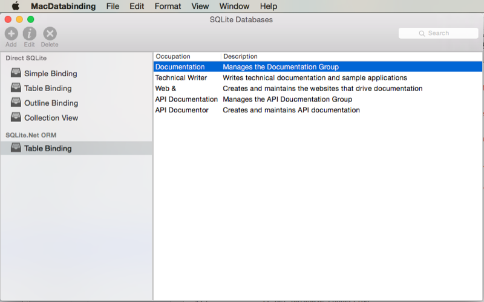
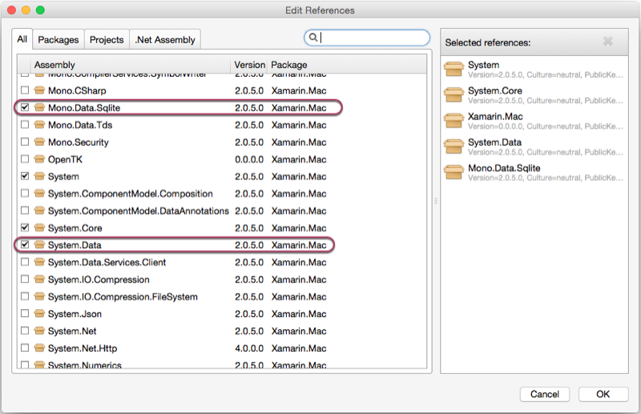
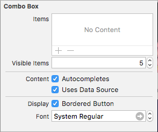
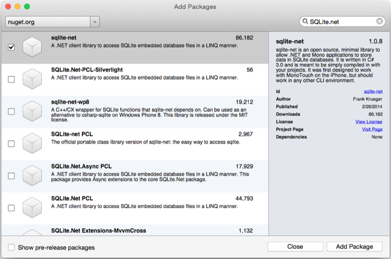
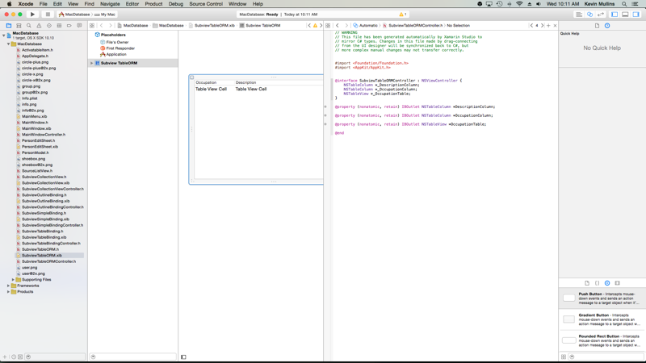

# Databases in Xamarin.Mac

_This article covers using key-value coding and key-value observing to allow for data binding between SQLite databases and UI elements in Xcode's Interface Builder. It also covers using the SQLite.NET ORM to provide access to SQLite data._

## Overview

When working with C# and .NET in a Xamarin.Mac application, you have access to the same SQLite databases that a Xamarin.iOS or Xamarin.Android application can access.

In this article we will be covering two ways to access SQLite data:

1. **Direct Access** - By directly accessing a SQLite Database, we can use data from the database for key-value coding and data binding with UI elements created in Xcode's Interface Builder. By using key-value coding and data binding techniques in your Xamarin.Mac application, you can greatly decrease the amount of code that you have to write and maintain to populate and work with UI elements. You also have the benefit of further decoupling your backing data (_Data Model_) from your front end User Interface (_Model-View-Controller_), leading to easier to maintain, more flexible application design.
2. **SQLite.NET ORM** - By using the open source [SQLite.NET](https://www.sqlite.org) Object Relationship Manager (ORM) we can greatly reduce the amount of code required to read and write data from a SQLite database. This data can then be used to populate a user interface item such as a Table View.

[](databases-images/intro01-large.png#lightbox)

In this article, we'll cover the basics of working with key-value coding and data binding with SQLite Databases in a Xamarin.Mac application. It is highly suggested that you work through the [Hello, Mac](~/mac/get-started/hello-mac.md) article first, specifically the [Introduction to Xcode and Interface Builder](~/mac/get-started/hello-mac.md#introduction-to-xcode-and-interface-builder) and [Outlets and Actions](~/mac/get-started/hello-mac.md#outlets-and-actions) sections, as it covers key concepts and techniques that we'll be using in this article.

Since we will be using key-value coding and data binding, please work through the [Data binding and key-value coding](~/mac/app-fundamentals/databinding.md) first, as core techniques and concepts will be covered that will be used in this documentation and its sample application.

You may want to take a look at the [Exposing C# classes / methods to Objective-C](~/mac/internals/how-it-works.md) section of the [Xamarin.Mac Internals](~/mac/internals/how-it-works.md) document as well, it explains the `Register` and `Export` attributes used to wire up your C# classes to Objective-C objects and UI elements.

## Direct SQLite access

For SQLite data that is going to be bound to UI elements in Xcode's Interface Builder, it is highly suggested that you access the SQLite database directly (as opposed to using a technique such as an ORM), since you have total control over the way the data is written and read from the database.

As we have seen in the [Data Binding and Key-Value Coding](~/mac/app-fundamentals/databinding.md) documentation, by using key-value coding and data binding techniques in your Xamarin.Mac application, you can greatly decrease the amount of code that you have to write and maintain to populate and work with UI elements. When combined with direct access to a SQLite database, it can also greatly reduce the amount of code required to read and write data to that database.

In this article, we will be modifying the sample app from the data binding and key-value coding document to use a SQLite Database as the backing source for the binding.

### Including SQLite database support

Before we can continue, we need to add SQLite database support to our application by including References to a couple of .DLLs files.

Do the following:

1. In the **Solution Pad**, right-click on the **References** folder and select **Edit References**.
2. Select both the **Mono.Data.Sqlite** and **System.Data** assemblies: 

    [](databases-images/reference01-large.png#lightbox)
3. Click the **OK** button to save your changes and add the references.

### Modifying the data model

Now that we have added support for directly accessing a SQLite database to our application, we need to modify our Data Model Object to read and write data from the database (as well as provide key-value coding and data binding). In the case of our sample application, we'll edit the **PersonModel.cs** class and make it look like the following:

```csharp
using System;
using System.Data;
using System.IO;
using Mono.Data.Sqlite;
using Foundation;
using AppKit;

namespace MacDatabase
{
    [Register("PersonModel")]
    public class PersonModel : NSObject
    {
        #region Private Variables
        private string _ID = "";
        private string _managerID = "";
        private string _name = "";
        private string _occupation = "";
        private bool _isManager = false;
        private NSMutableArray _people = new NSMutableArray();
        private SqliteConnection _conn = null;
        #endregion

        #region Computed Properties
        public SqliteConnection Conn {
            get { return _conn; }
            set { _conn = value; }
        }

        [Export("ID")]
        public string ID {
            get { return _ID; }
            set {
                WillChangeValue ("ID");
                _ID = value;
                DidChangeValue ("ID");
            }
        }

        [Export("ManagerID")]
        public string ManagerID {
            get { return _managerID; }
            set {
                WillChangeValue ("ManagerID");
                _managerID = value;
                DidChangeValue ("ManagerID");
            }
        }

        [Export("Name")]
        public string Name {
            get { return _name; }
            set {
                WillChangeValue ("Name");
                _name = value;
                DidChangeValue ("Name");

                // Save changes to database?
                if (_conn != null) Update (_conn);
            }
        }

        [Export("Occupation")]
        public string Occupation {
            get { return _occupation; }
            set {
                WillChangeValue ("Occupation");
                _occupation = value;
                DidChangeValue ("Occupation");

                // Save changes to database?
                if (_conn != null) Update (_conn);
            }
        }

        [Export("isManager")]
        public bool isManager {
            get { return _isManager; }
            set {
                WillChangeValue ("isManager");
                WillChangeValue ("Icon");
                _isManager = value;
                DidChangeValue ("isManager");
                DidChangeValue ("Icon");

                // Save changes to database?
                if (_conn != null) Update (_conn);
            }
        }

        [Export("isEmployee")]
        public bool isEmployee {
            get { return (NumberOfEmployees == 0); }
        }

        [Export("Icon")]
        public NSImage Icon {
            get {
                if (isManager) {
                    return NSImage.ImageNamed ("group.png");
                } else {
                    return NSImage.ImageNamed ("user.png");
                }
            }
        }

        [Export("personModelArray")]
        public NSArray People {
            get { return _people; }
        }

        [Export("NumberOfEmployees")]
        public nint NumberOfEmployees {
            get { return (nint)_people.Count; }
        }
        #endregion

        #region Constructors
        public PersonModel ()
        {
        }

        public PersonModel (string name, string occupation)
        {
            // Initialize
            this.Name = name;
            this.Occupation = occupation;
        }

        public PersonModel (string name, string occupation, bool manager)
        {
            // Initialize
            this.Name = name;
            this.Occupation = occupation;
            this.isManager = manager;
        }

        public PersonModel (string id, string name, string occupation)
        {
            // Initialize
            this.ID = id;
            this.Name = name;
            this.Occupation = occupation;
        }

        public PersonModel (SqliteConnection conn, string id)
        {
            // Load from database
            Load (conn, id);
        }
        #endregion

        #region Array Controller Methods
        [Export("addObject:")]
        public void AddPerson(PersonModel person) {
            WillChangeValue ("personModelArray");
            isManager = true;
            _people.Add (person);
            DidChangeValue ("personModelArray");
        }

        [Export("insertObject:inPersonModelArrayAtIndex:")]
        public void InsertPerson(PersonModel person, nint index) {
            WillChangeValue ("personModelArray");
            _people.Insert (person, index);
            DidChangeValue ("personModelArray");
        }

        [Export("removeObjectFromPersonModelArrayAtIndex:")]
        public void RemovePerson(nint index) {
            WillChangeValue ("personModelArray");
            _people.RemoveObject (index);
            DidChangeValue ("personModelArray");
        }

        [Export("setPersonModelArray:")]
        public void SetPeople(NSMutableArray array) {
            WillChangeValue ("personModelArray");
            _people = array;
            DidChangeValue ("personModelArray");
        }
        #endregion

        #region SQLite Routines
        public void Create(SqliteConnection conn) {

            // Clear last connection to prevent circular call to update
            _conn = null;

            // Create new record ID?
            if (ID == "") {
                ID = Guid.NewGuid ().ToString();
            }

            // Execute query
            conn.Open ();
            using (var command = conn.CreateCommand ()) {
                // Create new command
                command.CommandText = "INSERT INTO [People] (ID, Name, Occupation, isManager, ManagerID) VALUES (@COL1, @COL2, @COL3, @COL4, @COL5)";

                // Populate with data from the record
                command.Parameters.AddWithValue ("@COL1", ID);
                command.Parameters.AddWithValue ("@COL2", Name);
                command.Parameters.AddWithValue ("@COL3", Occupation);
                command.Parameters.AddWithValue ("@COL4", isManager);
                command.Parameters.AddWithValue ("@COL5", ManagerID);

                // Write to database
                command.ExecuteNonQuery ();
            }
            conn.Close ();

            // Save children to database as well
            for (nuint n = 0; n < People.Count; ++n) {
                // Grab person
                var Person = People.GetItem<PersonModel>(n);

                // Save manager ID and create the sub record
                Person.ManagerID = ID;
                Person.Create (conn);
            }

            // Save last connection
            _conn = conn;
        }

        public void Update(SqliteConnection conn) {

            // Clear last connection to prevent circular call to update
            _conn = null;

            // Execute query
            conn.Open ();
            using (var command = conn.CreateCommand ()) {
                // Create new command
                command.CommandText = "UPDATE [People] SET Name = @COL2, Occupation = @COL3, isManager = @COL4, ManagerID = @COL5 WHERE ID = @COL1";

                // Populate with data from the record
                command.Parameters.AddWithValue ("@COL1", ID);
                command.Parameters.AddWithValue ("@COL2", Name);
                command.Parameters.AddWithValue ("@COL3", Occupation);
                command.Parameters.AddWithValue ("@COL4", isManager);
                command.Parameters.AddWithValue ("@COL5", ManagerID);

                // Write to database
                command.ExecuteNonQuery ();
            }
            conn.Close ();

            // Save children to database as well
            for (nuint n = 0; n < People.Count; ++n) {
                // Grab person
                var Person = People.GetItem<PersonModel>(n);

                // Update sub record
                Person.Update (conn);
            }

            // Save last connection
            _conn = conn;
        }

        public void Load(SqliteConnection conn, string id) {
            bool shouldClose = false;

            // Clear last connection to prevent circular call to update
            _conn = null;

            // Is the database already open?
            if (conn.State != ConnectionState.Open) {
                shouldClose = true;
                conn.Open ();
            }

            // Execute query
            using (var command = conn.CreateCommand ()) {
                // Create new command
                command.CommandText = "SELECT * FROM [People] WHERE ID = @COL1";

                // Populate with data from the record
                command.Parameters.AddWithValue ("@COL1", id);

                using (var reader = command.ExecuteReader ()) {
                    while (reader.Read ()) {
                        // Pull values back into class
                        ID = (string)reader [0];
                        Name = (string)reader [1];
                        Occupation = (string)reader [2];
                        isManager = (bool)reader [3];
                        ManagerID = (string)reader [4];
                    }
                }
            }

            // Is this a manager?
            if (isManager) {
                // Yes, load children
                using (var command = conn.CreateCommand ()) {
                    // Create new command
                    command.CommandText = "SELECT ID FROM [People] WHERE ManagerID = @COL1";

                    // Populate with data from the record
                    command.Parameters.AddWithValue ("@COL1", id);

                    using (var reader = command.ExecuteReader ()) {
                        while (reader.Read ()) {
                            // Load child and add to collection
                            var childID = (string)reader [0];
                            var person = new PersonModel (conn, childID);
                            _people.Add (person);
                        }
                    }
                }
            }

            // Should we close the connection to the database
            if (shouldClose) {
                conn.Close ();
            }

            // Save last connection
            _conn = conn;
        }

        public void Delete(SqliteConnection conn) {

            // Clear last connection to prevent circular call to update
            _conn = null;

            // Execute query
            conn.Open ();
            using (var command = conn.CreateCommand ()) {
                // Create new command
                command.CommandText = "DELETE FROM [People] WHERE (ID = @COL1 OR ManagerID = @COL1)";

                // Populate with data from the record
                command.Parameters.AddWithValue ("@COL1", ID);

                // Write to database
                command.ExecuteNonQuery ();
            }
            conn.Close ();

            // Empty class
            ID = "";
            ManagerID = "";
            Name = "";
            Occupation = "";
            isManager = false;
            _people = new NSMutableArray();

            // Save last connection
            _conn = conn;
        }
        #endregion
    }
}
```

Let's take a look at the modifications in detail below.

First, we've added several using statements that are required to use SQLite and we've added a variable to save our last connection to the SQLite database:

```csharp
using System.Data;
using System.IO;
using Mono.Data.Sqlite;
...

private SqliteConnection _conn = null;
```

We'll use this saved connection to automatically save any changes to the record to the database when the user modifies the contents in the UI via data binding:

```csharp
[Export("Name")]
public string Name {
    get { return _name; }
    set {
        WillChangeValue ("Name");
        _name = value;
        DidChangeValue ("Name");

        // Save changes to database?
        if (_conn != null) Update (_conn);
    }
}

[Export("Occupation")]
public string Occupation {
    get { return _occupation; }
    set {
        WillChangeValue ("Occupation");
        _occupation = value;
        DidChangeValue ("Occupation");

        // Save changes to database?
        if (_conn != null) Update (_conn);
    }
}

[Export("isManager")]
public bool isManager {
    get { return _isManager; }
    set {
        WillChangeValue ("isManager");
        WillChangeValue ("Icon");
        _isManager = value;
        DidChangeValue ("isManager");
        DidChangeValue ("Icon");

        // Save changes to database?
        if (_conn != null) Update (_conn);
    }
}
```

Any changes made to the **Name**, **Occupation** or **isManager** properties will be sent to the database if the data has been saved there before (e.g. if the `_conn` variable is not `null`). Next, let's look at the methods that we've added to **Create**, **Update**, **Load** and **Delete** people from the database.

#### Create a new record

The following code was added to create a new record in the SQLite database:

```csharp
public void Create(SqliteConnection conn) {

    // Clear last connection to prevent circular call to update
    _conn = null;

    // Create new record ID?
    if (ID == "") {
        ID = Guid.NewGuid ().ToString();
    }

    // Execute query
    conn.Open ();
    using (var command = conn.CreateCommand ()) {
        // Create new command
        command.CommandText = "INSERT INTO [People] (ID, Name, Occupation, isManager, ManagerID) VALUES (@COL1, @COL2, @COL3, @COL4, @COL5)";

        // Populate with data from the record
        command.Parameters.AddWithValue ("@COL1", ID);
        command.Parameters.AddWithValue ("@COL2", Name);
        command.Parameters.AddWithValue ("@COL3", Occupation);
        command.Parameters.AddWithValue ("@COL4", isManager);
        command.Parameters.AddWithValue ("@COL5", ManagerID);

        // Write to database
        command.ExecuteNonQuery ();
    }
    conn.Close ();

    // Save children to database as well
    for (nuint n = 0; n < People.Count; ++n) {
        // Grab person
        var Person = People.GetItem<PersonModel>(n);

        // Save manager ID and create the sub record
        Person.ManagerID = ID;
        Person.Create (conn);
    }

    // Save last connection
    _conn = conn;
}
```

We are using a `SQLiteCommand` to create the new record in the database. We get a new command from the `SQLiteConnection` (conn) that we passed into the method by calling `CreateCommand`. Next, we set the SQL instruction to actually write the new record, providing parameters for the actual values:

```csharp
command.CommandText = "INSERT INTO [People] (ID, Name, Occupation, isManager, ManagerID) VALUES (@COL1, @COL2, @COL3, @COL4, @COL5)";
```

Later we set the values for the parameters using the `Parameters.AddWithValue` method on the `SQLiteCommand`. By using parameters, we ensure that values (such as a single quote) get properly encoded before being sent to SQLite. Example:

```csharp
command.Parameters.AddWithValue ("@COL1", ID);
```

Finally, since a person can be a manager and have a collection of employees under them, we are recursively calling the `Create` method on those people to save them to the database as well:

```csharp
// Save children to database as well
for (nuint n = 0; n < People.Count; ++n) {
    // Grab person
    var Person = People.GetItem<PersonModel>(n);

    // Save manager ID and create the sub record
    Person.ManagerID = ID;
    Person.Create (conn);
}
```

#### Updating a record

The following code was added to update an existing record in the SQLite database:

```csharp
public void Update(SqliteConnection conn) {

    // Clear last connection to prevent circular call to update
    _conn = null;

    // Execute query
    conn.Open ();
    using (var command = conn.CreateCommand ()) {
        // Create new command
        command.CommandText = "UPDATE [People] SET Name = @COL2, Occupation = @COL3, isManager = @COL4, ManagerID = @COL5 WHERE ID = @COL1";

        // Populate with data from the record
        command.Parameters.AddWithValue ("@COL1", ID);
        command.Parameters.AddWithValue ("@COL2", Name);
        command.Parameters.AddWithValue ("@COL3", Occupation);
        command.Parameters.AddWithValue ("@COL4", isManager);
        command.Parameters.AddWithValue ("@COL5", ManagerID);

        // Write to database
        command.ExecuteNonQuery ();
    }
    conn.Close ();

    // Save children to database as well
    for (nuint n = 0; n < People.Count; ++n) {
        // Grab person
        var Person = People.GetItem<PersonModel>(n);

        // Update sub record
        Person.Update (conn);
    }

    // Save last connection
    _conn = conn;
}
```

Like **Create** above, we get a `SQLiteCommand` from the passed in `SQLiteConnection`, and set our SQL to update our record (providing parameters):

```csharp
command.CommandText = "UPDATE [People] SET Name = @COL2, Occupation = @COL3, isManager = @COL4, ManagerID = @COL5 WHERE ID = @COL1";
```

We fill in the parameter values (example: `command.Parameters.AddWithValue ("@COL1", ID);`) and again, recursively call update on any child records:

```csharp
// Save children to database as well
for (nuint n = 0; n < People.Count; ++n) {
    // Grab person
    var Person = People.GetItem<PersonModel>(n);

    // Update sub record
    Person.Update (conn);
}
```

#### Loading a record

The following code was added to load an existing record from the SQLite database:

```csharp
public void Load(SqliteConnection conn, string id) {
    bool shouldClose = false;

    // Clear last connection to prevent circular call to update
    _conn = null;

    // Is the database already open?
    if (conn.State != ConnectionState.Open) {
        shouldClose = true;
        conn.Open ();
    }

    // Execute query
    using (var command = conn.CreateCommand ()) {
        // Create new command
        command.CommandText = "SELECT * FROM [People] WHERE ID = @COL1";

        // Populate with data from the record
        command.Parameters.AddWithValue ("@COL1", id);

        using (var reader = command.ExecuteReader ()) {
            while (reader.Read ()) {
                // Pull values back into class
                ID = (string)reader [0];
                Name = (string)reader [1];
                Occupation = (string)reader [2];
                isManager = (bool)reader [3];
                ManagerID = (string)reader [4];
            }
        }
    }

    // Is this a manager?
    if (isManager) {
        // Yes, load children
        using (var command = conn.CreateCommand ()) {
            // Create new command
            command.CommandText = "SELECT ID FROM [People] WHERE ManagerID = @COL1";

            // Populate with data from the record
            command.Parameters.AddWithValue ("@COL1", id);

            using (var reader = command.ExecuteReader ()) {
                while (reader.Read ()) {
                    // Load child and add to collection
                    var childID = (string)reader [0];
                    var person = new PersonModel (conn, childID);
                    _people.Add (person);
                }
            }
        }
    }

    // Should we close the connection to the database
    if (shouldClose) {
        conn.Close ();
    }

    // Save last connection
    _conn = conn;
}
```

Because the routine can be called recursively from a parent object (such as a manager object loading their employees object), special code was added to handle opening and closing the connection to the database:

```csharp
bool shouldClose = false;
...

// Is the database already open?
if (conn.State != ConnectionState.Open) {
    shouldClose = true;
    conn.Open ();
}
...

// Should we close the connection to the database
if (shouldClose) {
    conn.Close ();
}

```

As always, we set our SQL to retrieve the record and use parameters:

```csharp
// Create new command
command.CommandText = "SELECT ID FROM [People] WHERE ManagerID = @COL1";

// Populate with data from the record
command.Parameters.AddWithValue ("@COL1", id);
```

Finally, we use a Data Reader to execute the query and return the record fields (which we copy into the instance of the `PersonModel` class):

```csharp
using (var reader = command.ExecuteReader ()) {
    while (reader.Read ()) {
        // Pull values back into class
        ID = (string)reader [0];
        Name = (string)reader [1];
        Occupation = (string)reader [2];
        isManager = (bool)reader [3];
        ManagerID = (string)reader [4];
    }
}
```

If this person is a manager, we need to also load all of their employees (again, by recursively calling their `Load` method):

```csharp
// Is this a manager?
if (isManager) {
    // Yes, load children
    using (var command = conn.CreateCommand ()) {
        // Create new command
        command.CommandText = "SELECT ID FROM [People] WHERE ManagerID = @COL1";

        // Populate with data from the record
        command.Parameters.AddWithValue ("@COL1", id);

        using (var reader = command.ExecuteReader ()) {
            while (reader.Read ()) {
                // Load child and add to collection
                var childID = (string)reader [0];
                var person = new PersonModel (conn, childID);
                _people.Add (person);
            }
        }
    }
}
```

#### Deleting a record

The following code was added to delete an existing record from the SQLite database:

```csharp
public void Delete(SqliteConnection conn) {

    // Clear last connection to prevent circular call to update
    _conn = null;

    // Execute query
    conn.Open ();
    using (var command = conn.CreateCommand ()) {
        // Create new command
        command.CommandText = "DELETE FROM [People] WHERE (ID = @COL1 OR ManagerID = @COL1)";

        // Populate with data from the record
        command.Parameters.AddWithValue ("@COL1", ID);

        // Write to database
        command.ExecuteNonQuery ();
    }
    conn.Close ();

    // Empty class
    ID = "";
    ManagerID = "";
    Name = "";
    Occupation = "";
    isManager = false;
    _people = new NSMutableArray();

    // Save last connection
    _conn = conn;
}
```

Here we provide the SQL to delete both the managers record and the records of any employees under that manager (using parameters):

```csharp
// Create new command
command.CommandText = "DELETE FROM [People] WHERE (ID = @COL1 OR ManagerID = @COL1)";

// Populate with data from the record
command.Parameters.AddWithValue ("@COL1", ID);
```

After the record has been removed, we clear out the current instance of the `PersonModel` class:

```csharp
// Empty class
ID = "";
ManagerID = "";
Name = "";
Occupation = "";
isManager = false;
_people = new NSMutableArray();
```

### Initializing the database

With the changes to our Data Model in place to support reading and writing to the database, we need to open a connection to the database and initialize it on the first run. Let's add the following code to our **MainWindow.cs** file:

```csharp
using System.Data;
using System.IO;
using Mono.Data.Sqlite;
...

private SqliteConnection DatabaseConnection = null;
...

private SqliteConnection GetDatabaseConnection() {
    var documents = Environment.GetFolderPath (Environment.SpecialFolder.Desktop);
    string db = Path.Combine (documents, "People.db3");

    // Create the database if it doesn't already exist
    bool exists = File.Exists (db);
    if (!exists)
        SqliteConnection.CreateFile (db);

    // Create connection to the database
    var conn = new SqliteConnection("Data Source=" + db);

    // Set the structure of the database
    if (!exists) {
        var commands = new[] {
            "CREATE TABLE People (ID TEXT, Name TEXT, Occupation TEXT, isManager BOOLEAN, ManagerID TEXT)"
        };
        conn.Open ();
        foreach (var cmd in commands) {
            using (var c = conn.CreateCommand()) {
                c.CommandText = cmd;
                c.CommandType = CommandType.Text;
                c.ExecuteNonQuery ();
            }
        }
        conn.Close ();

        // Build list of employees
        var Craig = new PersonModel ("0","Craig Dunn", "Documentation Manager");
        Craig.AddPerson (new PersonModel ("Amy Burns", "Technical Writer"));
        Craig.AddPerson (new PersonModel ("Joel Martinez", "Web & Infrastructure"));
        Craig.AddPerson (new PersonModel ("Kevin Mullins", "Technical Writer"));
        Craig.AddPerson (new PersonModel ("Mark McLemore", "Technical Writer"));
        Craig.AddPerson (new PersonModel ("Tom Opgenorth", "Technical Writer"));
        Craig.Create (conn);

        var Larry = new PersonModel ("1","Larry O'Brien", "API Documentation Manager");
        Larry.AddPerson (new PersonModel ("Mike Norman", "API Documentor"));
        Larry.Create (conn);
    }

    // Return new connection
    return conn;
}
```

Let's take a closer look at the code above. First, we pick a location for the new database (in this example, the user's Desktop), look to see if the database exists, and if it doesn't, create it:

```csharp
var documents = Environment.GetFolderPath (Environment.SpecialFolder.Desktop);
string db = Path.Combine (documents, "People.db3");

// Create the database if it doesn't already exist
bool exists = File.Exists (db);
if (!exists)
    SqliteConnection.CreateFile (db);
```

Next, we establish the connect to the database using the path we created above:

```csharp
var conn = new SqliteConnection("Data Source=" + db);
```

Then we create all the SQL tables in the database that we require:

```csharp
var commands = new[] {
    "CREATE TABLE People (ID TEXT, Name TEXT, Occupation TEXT, isManager BOOLEAN, ManagerID TEXT)"
};
conn.Open ();
foreach (var cmd in commands) {
    using (var c = conn.CreateCommand()) {
        c.CommandText = cmd;
        c.CommandType = CommandType.Text;
        c.ExecuteNonQuery ();
    }
}
conn.Close ();
```

Finally, we use our Data Model (`PersonModel`) to create a default set of records for the database the first time the application is run or if the database is missing:

```csharp
// Build list of employees
var Craig = new PersonModel ("0","Craig Dunn", "Documentation Manager");
Craig.AddPerson (new PersonModel ("Amy Burns", "Technical Writer"));
Craig.AddPerson (new PersonModel ("Joel Martinez", "Web & Infrastructure"));
Craig.AddPerson (new PersonModel ("Kevin Mullins", "Technical Writer"));
Craig.AddPerson (new PersonModel ("Mark McLemore", "Technical Writer"));
Craig.AddPerson (new PersonModel ("Tom Opgenorth", "Technical Writer"));
Craig.Create (conn);

var Larry = new PersonModel ("1","Larry O'Brien", "API Documentation Manager");
Larry.AddPerson (new PersonModel ("Mike Norman", "API Documentor"));
Larry.Create (conn);
``` 

When the application starts and opens the Main Window, we make a connection to the database using the code we added above:

```csharp
public override void AwakeFromNib ()
{
    base.AwakeFromNib ();

    // Get access to database
    DatabaseConnection = GetDatabaseConnection ();
}
```

### Loading bound data

With all the components for directly accessing bound data from a SQLite database in place, we can load the data in the different views that our application provides and it will automatically be displayed in our UI.

#### Loading a single record

To load a single record where the ID is know, we can use the following code:

```csharp
Person = new PersonModel (Conn, "0");
```

#### Loading all records

To load all people, regardless if they are a manager or not, use the following code:

```csharp
// Load all employees
_conn.Open ();
using (var command = _conn.CreateCommand ()) {
    // Create new command
    command.CommandText = "SELECT ID FROM [People]";

    using (var reader = command.ExecuteReader ()) {
        while (reader.Read ()) {
            // Load child and add to collection
            var childID = (string)reader [0];
            var person = new PersonModel (_conn, childID);
            AddPerson (person);
        }
    }
}
_conn.Close ();

```

Here, we are using an overload of the constructor for the `PersonModel` class to load the person into memory:

```csharp
var person = new PersonModel (_conn, childID);
```

We are also calling the Data Bound class to add the person to our collection of people `AddPerson (person)`, this ensures that our UI recognizes the change and displays it:

```csharp
[Export("addObject:")]
public void AddPerson(PersonModel person) {
    WillChangeValue ("personModelArray");
    isManager = true;
    _people.Add (person);
    DidChangeValue ("personModelArray");
}
```

#### Loading top level records only

To load only managers (for example, to display data in an Outline View), we use the following code:

```csharp
// Load only managers employees
_conn.Open ();
using (var command = _conn.CreateCommand ()) {
    // Create new command
    command.CommandText = "SELECT ID FROM [People] WHERE isManager = 1";

    using (var reader = command.ExecuteReader ()) {
        while (reader.Read ()) {
            // Load child and add to collection
            var childID = (string)reader [0];
            var person = new PersonModel (_conn, childID);
            AddPerson (person);
        }
    }
}
_conn.Close ();
```

The only real difference in the in SQL statement (which loads only managers `command.CommandText = "SELECT ID FROM [People] WHERE isManager = 1"`) but works the same as the section above otherwise.

<a name="Databases-and-ComboBoxes"></a>

### Databases and comboboxes

The Menu Controls available to macOS (such as the Combo Box) can be set to populate the dropdown list either from an internal list (that can be pre-defined in Interface Builder or populated via code) or by providing your own custom, external data source. See [Providing Menu Control Data](~/mac/user-interface/standard-controls.md#Providing-Menu-Control-Data) for more details.

As an example, edit the Simple Binding example above in Interface Builder, add a Combo Box and expose it using an outlet named `EmployeeSelector`:

[](databases-images/combo01-large.png#lightbox)

In the **Attributes Inspector**, check the **Autocompletes** and **Uses Data Source** properties:



Save your changes and return to Visual Studio for Mac to sync.

#### Providing combobox data

Next, add a new class to the project called `ComboBoxDataSource` and make it look like the following:

```csharp
using System;
using System.Data;
using System.IO;
using Mono.Data.Sqlite;
using Foundation;
using AppKit;

namespace MacDatabase
{
    public class ComboBoxDataSource : NSComboBoxDataSource
    {
        #region Private Variables
        private SqliteConnection _conn = null;
        private string _tableName = "";
        private string _IDField = "ID";
        private string _displayField = "";
        private nint _recordCount = 0;
        #endregion

        #region Computed Properties
        public SqliteConnection Conn {
            get { return _conn; }
            set { _conn = value; }
        }

        public string TableName {
            get { return _tableName; }
            set { 
                _tableName = value;
                _recordCount = GetRecordCount ();
            }
        }

        public string IDField {
            get { return _IDField; }
            set {
                _IDField = value; 
                _recordCount = GetRecordCount ();
            }
        }

        public string DisplayField {
            get { return _displayField; }
            set { 
                _displayField = value; 
                _recordCount = GetRecordCount ();
            }
        }

        public nint RecordCount {
            get { return _recordCount; }
        }
        #endregion

        #region Constructors
        public ComboBoxDataSource (SqliteConnection conn, string tableName, string displayField)
        {
            // Initialize
            this.Conn = conn;
            this.TableName = tableName;
            this.DisplayField = displayField;
        }

        public ComboBoxDataSource (SqliteConnection conn, string tableName, string idField, string displayField)
        {
            // Initialize
            this.Conn = conn;
            this.TableName = tableName;
            this.IDField = idField;
            this.DisplayField = displayField;
        }
        #endregion

        #region Private Methods
        private nint GetRecordCount ()
        {
            bool shouldClose = false;
            nint count = 0;

            // Has a Table, ID and display field been specified?
            if (TableName !="" && IDField != "" && DisplayField != "") {
                // Is the database already open?
                if (Conn.State != ConnectionState.Open) {
                    shouldClose = true;
                    Conn.Open ();
                }

                // Execute query
                using (var command = Conn.CreateCommand ()) {
                    // Create new command
                    command.CommandText = $"SELECT count({IDField}) FROM [{TableName}]";

                    // Get the results from the database
                    using (var reader = command.ExecuteReader ()) {
                        while (reader.Read ()) {
                            // Read count from query
                            var result = (long)reader [0];
                            count = (nint)result;
                        }
                    }
                }

                // Should we close the connection to the database
                if (shouldClose) {
                    Conn.Close ();
                }
            }

            // Return the number of records
            return count;
        }
        #endregion

        #region Public Methods
        public string IDForIndex (nint index)
        {
            NSString value = new NSString ("");
            bool shouldClose = false;

            // Has a Table, ID and display field been specified?
            if (TableName != "" && IDField != "" && DisplayField != "") {
                // Is the database already open?
                if (Conn.State != ConnectionState.Open) {
                    shouldClose = true;
                    Conn.Open ();
                }

                // Execute query
                using (var command = Conn.CreateCommand ()) {
                    // Create new command
                    command.CommandText = $"SELECT {IDField} FROM [{TableName}] ORDER BY {DisplayField} ASC LIMIT 1 OFFSET {index}";

                    // Get the results from the database
                    using (var reader = command.ExecuteReader ()) {
                        while (reader.Read ()) {
                            // Read the display field from the query
                            value = new NSString ((string)reader [0]);
                        }
                    }
                }

                // Should we close the connection to the database
                if (shouldClose) {
                    Conn.Close ();
                }
            }

            // Return results
            return value;
        }

        public string ValueForIndex (nint index)
        {
            NSString value = new NSString ("");
            bool shouldClose = false;

            // Has a Table, ID and display field been specified?
            if (TableName != "" && IDField != "" && DisplayField != "") {
                // Is the database already open?
                if (Conn.State != ConnectionState.Open) {
                    shouldClose = true;
                    Conn.Open ();
                }

                // Execute query
                using (var command = Conn.CreateCommand ()) {
                    // Create new command
                    command.CommandText = $"SELECT {DisplayField} FROM [{TableName}] ORDER BY {DisplayField} ASC LIMIT 1 OFFSET {index}";

                    // Get the results from the database
                    using (var reader = command.ExecuteReader ()) {
                        while (reader.Read ()) {
                            // Read the display field from the query
                            value = new NSString ((string)reader [0]);
                        }
                    }
                }

                // Should we close the connection to the database
                if (shouldClose) {
                    Conn.Close ();
                }
            }

            // Return results
            return value;
        }

        public string IDForValue (string value)
        {
            NSString result = new NSString ("");
            bool shouldClose = false;

            // Has a Table, ID and display field been specified?
            if (TableName != "" && IDField != "" && DisplayField != "") {
                // Is the database already open?
                if (Conn.State != ConnectionState.Open) {
                    shouldClose = true;
                    Conn.Open ();
                }

                // Execute query
                using (var command = Conn.CreateCommand ()) {
                    // Create new command
                    command.CommandText = $"SELECT {IDField} FROM [{TableName}] WHERE {DisplayField} = @VAL";

                    // Populate parameters
                    command.Parameters.AddWithValue ("@VAL", value);

                    // Get the results from the database
                    using (var reader = command.ExecuteReader ()) {
                        while (reader.Read ()) {
                            // Read the display field from the query
                            result = new NSString ((string)reader [0]);
                        }
                    }
                }

                // Should we close the connection to the database
                if (shouldClose) {
                    Conn.Close ();
                }
            }

            // Return results
            return result;
        }
        #endregion 

        #region Override Methods
        public override nint ItemCount (NSComboBox comboBox)
        {
            return RecordCount;
        }

        public override NSObject ObjectValueForItem (NSComboBox comboBox, nint index)
        {
            NSString value = new NSString ("");
            bool shouldClose = false;

            // Has a Table, ID and display field been specified?
            if (TableName != "" && IDField != "" && DisplayField != "") {
                // Is the database already open?
                if (Conn.State != ConnectionState.Open) {
                    shouldClose = true;
                    Conn.Open ();
                }

                // Execute query
                using (var command = Conn.CreateCommand ()) {
                    // Create new command
                    command.CommandText = $"SELECT {DisplayField} FROM [{TableName}] ORDER BY {DisplayField} ASC LIMIT 1 OFFSET {index}";

                    // Get the results from the database
                    using (var reader = command.ExecuteReader ()) {
                        while (reader.Read ()) {
                            // Read the display field from the query
                            value = new NSString((string)reader [0]);
                        }
                    }
                }

                // Should we close the connection to the database
                if (shouldClose) {
                    Conn.Close ();
                }
            }

            // Return results
            return value;
        }

        public override nint IndexOfItem (NSComboBox comboBox, string value)
        {
            bool shouldClose = false;
            bool found = false;
            string field = "";
            nint index = NSRange.NotFound;

            // Has a Table, ID and display field been specified?
            if (TableName != "" && IDField != "" && DisplayField != "") {
                // Is the database already open?
                if (Conn.State != ConnectionState.Open) {
                    shouldClose = true;
                    Conn.Open ();
                }

                // Execute query
                using (var command = Conn.CreateCommand ()) {
                    // Create new command
                    command.CommandText = $"SELECT {DisplayField} FROM [{TableName}] ORDER BY {DisplayField} ASC";

                    // Get the results from the database
                    using (var reader = command.ExecuteReader ()) {
                        while (reader.Read () && !found) {
                            // Read the display field from the query
                            field = (string)reader [0];
                            ++index;

                            // Is this the value we are searching for?
                            if (value == field) {
                                // Yes, exit loop
                                found = true;
                            }
                        }
                    }
                }

                // Should we close the connection to the database
                if (shouldClose) {
                    Conn.Close ();
                }
            }

            // Return results
            return index;
        }

        public override string CompletedString (NSComboBox comboBox, string uncompletedString)
        {
            bool shouldClose = false;
            bool found = false;
            string field = "";

            // Has a Table, ID and display field been specified?
            if (TableName != "" && IDField != "" && DisplayField != "") {
                // Is the database already open?
                if (Conn.State != ConnectionState.Open) {
                    shouldClose = true;
                    Conn.Open ();
                }

                // Escape search string
                uncompletedString = uncompletedString.Replace ("'", "");

                // Execute query
                using (var command = Conn.CreateCommand ()) {
                    // Create new command
                    command.CommandText = $"SELECT {DisplayField} FROM [{TableName}] WHERE {DisplayField} LIKE @VAL";

                    // Populate parameters
                    command.Parameters.AddWithValue ("@VAL", uncompletedString + "%");

                    // Get the results from the database
                    using (var reader = command.ExecuteReader ()) {
                        while (reader.Read ()) {
                            // Read the display field from the query
                            field = (string)reader [0];
                        }
                    }
                }

                // Should we close the connection to the database
                if (shouldClose) {
                    Conn.Close ();
                }
            }

            // Return results
            return field;
        }
        #endregion
    }
}
```

In this example, we are creating a new `NSComboBoxDataSource` that can present Combo Box Items from any SQLite Data Source. First, we define the following properties:

- `Conn` - Gets or sets a connection to the SQLite database.
- `TableName` - Gets or sets the table name.
- `IDField` - Gets or sets the field that provides the unique ID for the given Table. The default value is `ID`.
- `DisplayField` - Gets or sets the field that is displayed in the dropdown list.
- `RecordCount` - Gets the number of records in the given Table.

When we create a new instance of the object, we pass in the connection, table name, optionally the ID field and the display field:

```csharp
public ComboBoxDataSource (SqliteConnection conn, string tableName, string displayField)
{
    // Initialize
    this.Conn = conn;
    this.TableName = tableName;
    this.DisplayField = displayField;
}
```

The `GetRecordCount` method returns the number of records in the given Table:

```csharp
private nint GetRecordCount ()
{
    bool shouldClose = false;
    nint count = 0;

    // Has a Table, ID and display field been specified?
    if (TableName !="" && IDField != "" && DisplayField != "") {
        // Is the database already open?
        if (Conn.State != ConnectionState.Open) {
            shouldClose = true;
            Conn.Open ();
        }

        // Execute query
        using (var command = Conn.CreateCommand ()) {
            // Create new command
            command.CommandText = $"SELECT count({IDField}) FROM [{TableName}]";

            // Get the results from the database
            using (var reader = command.ExecuteReader ()) {
                while (reader.Read ()) {
                    // Read count from query
                    var result = (long)reader [0];
                    count = (nint)result;
                }
            }
        }

        // Should we close the connection to the database
        if (shouldClose) {
            Conn.Close ();
        }
    }

    // Return the number of records
    return count;
}
```

It is called any time the `TableName`, `IDField` or `DisplayField` properties value is changed.

The `IDForIndex` method returns the unique ID (`IDField`) for the record at the given dropdown list item index: 

```csharp
public string IDForIndex (nint index)
{
    NSString value = new NSString ("");
    bool shouldClose = false;

    // Has a Table, ID and display field been specified?
    if (TableName != "" && IDField != "" && DisplayField != "") {
        // Is the database already open?
        if (Conn.State != ConnectionState.Open) {
            shouldClose = true;
            Conn.Open ();
        }

        // Execute query
        using (var command = Conn.CreateCommand ()) {
            // Create new command
            command.CommandText = $"SELECT {IDField} FROM [{TableName}] ORDER BY {DisplayField} ASC LIMIT 1 OFFSET {index}";

            // Get the results from the database
            using (var reader = command.ExecuteReader ()) {
                while (reader.Read ()) {
                    // Read the display field from the query
                    value = new NSString ((string)reader [0]);
                }
            }
        }

        // Should we close the connection to the database
        if (shouldClose) {
            Conn.Close ();
        }
    }

    // Return results
    return value;
}
```

The `ValueForIndex` method returns the value (`DisplayField`) for the item at the given dropdown list index:

```csharp
public string ValueForIndex (nint index)
{
    NSString value = new NSString ("");
    bool shouldClose = false;

    // Has a Table, ID and display field been specified?
    if (TableName != "" && IDField != "" && DisplayField != "") {
        // Is the database already open?
        if (Conn.State != ConnectionState.Open) {
            shouldClose = true;
            Conn.Open ();
        }

        // Execute query
        using (var command = Conn.CreateCommand ()) {
            // Create new command
            command.CommandText = $"SELECT {DisplayField} FROM [{TableName}] ORDER BY {DisplayField} ASC LIMIT 1 OFFSET {index}";

            // Get the results from the database
            using (var reader = command.ExecuteReader ()) {
                while (reader.Read ()) {
                    // Read the display field from the query
                    value = new NSString ((string)reader [0]);
                }
            }
        }

        // Should we close the connection to the database
        if (shouldClose) {
            Conn.Close ();
        }
    }

    // Return results
    return value;
}
```

The `IDForValue` method returns the unique ID (`IDField`) for the given value (`DisplayField`):

```csharp
public string IDForValue (string value)
{
    NSString result = new NSString ("");
    bool shouldClose = false;

    // Has a Table, ID and display field been specified?
    if (TableName != "" && IDField != "" && DisplayField != "") {
        // Is the database already open?
        if (Conn.State != ConnectionState.Open) {
            shouldClose = true;
            Conn.Open ();
        }

        // Execute query
        using (var command = Conn.CreateCommand ()) {
            // Create new command
            command.CommandText = $"SELECT {IDField} FROM [{TableName}] WHERE {DisplayField} = @VAL";

            // Populate parameters
            command.Parameters.AddWithValue ("@VAL", value);

            // Get the results from the database
            using (var reader = command.ExecuteReader ()) {
                while (reader.Read ()) {
                    // Read the display field from the query
                    result = new NSString ((string)reader [0]);
                }
            }
        }

        // Should we close the connection to the database
        if (shouldClose) {
            Conn.Close ();
        }
    }

    // Return results
    return result;
}
```

The `ItemCount` returns the precomputed number of items in the list as calculated when the `TableName`, `IDField` or `DisplayField` properties are changed:

```csharp
public override nint ItemCount (NSComboBox comboBox)
{
    return RecordCount;
}
```

The `ObjectValueForItem` method provides the value (`DisplayField`) for the given dropdown list item index:

```csharp
public override NSObject ObjectValueForItem (NSComboBox comboBox, nint index)
{
    NSString value = new NSString ("");
    bool shouldClose = false;

    // Has a Table, ID and display field been specified?
    if (TableName != "" && IDField != "" && DisplayField != "") {
        // Is the database already open?
        if (Conn.State != ConnectionState.Open) {
            shouldClose = true;
            Conn.Open ();
        }

        // Execute query
        using (var command = Conn.CreateCommand ()) {
            // Create new command
            command.CommandText = $"SELECT {DisplayField} FROM [{TableName}] ORDER BY {DisplayField} ASC LIMIT 1 OFFSET {index}";

            // Get the results from the database
            using (var reader = command.ExecuteReader ()) {
                while (reader.Read ()) {
                    // Read the display field from the query
                    value = new NSString((string)reader [0]);
                }
            }
        }

        // Should we close the connection to the database
        if (shouldClose) {
            Conn.Close ();
        }
    }

    // Return results
    return value;
}
```

Notice that we are using the `LIMIT` and `OFFSET` statements in our SQLite command to limit to the one record that we are needed.

The `IndexOfItem` method returns dropdown item index of the value (`DisplayField`) given:

```csharp
public override nint IndexOfItem (NSComboBox comboBox, string value)
{
    bool shouldClose = false;
    bool found = false;
    string field = "";
    nint index = NSRange.NotFound;

    // Has a Table, ID and display field been specified?
    if (TableName != "" && IDField != "" && DisplayField != "") {
        // Is the database already open?
        if (Conn.State != ConnectionState.Open) {
            shouldClose = true;
            Conn.Open ();
        }

        // Execute query
        using (var command = Conn.CreateCommand ()) {
            // Create new command
            command.CommandText = $"SELECT {DisplayField} FROM [{TableName}] ORDER BY {DisplayField} ASC";

            // Get the results from the database
            using (var reader = command.ExecuteReader ()) {
                while (reader.Read () && !found) {
                    // Read the display field from the query
                    field = (string)reader [0];
                    ++index;

                    // Is this the value we are searching for?
                    if (value == field) {
                        // Yes, exit loop
                        found = true;
                    }
                }
            }
        }

        // Should we close the connection to the database
        if (shouldClose) {
            Conn.Close ();
        }
    }

    // Return results
    return index;
}
```

If the value cannot be found, the `NSRange.NotFound` value is return and all items are deselected in the dropdown list.

The `CompletedString` method returns the first matching value (`DisplayField`) for a partially typed entry:

```csharp
public override string CompletedString (NSComboBox comboBox, string uncompletedString)
{
    bool shouldClose = false;
    bool found = false;
    string field = "";

    // Has a Table, ID and display field been specified?
    if (TableName != "" && IDField != "" && DisplayField != "") {
        // Is the database already open?
        if (Conn.State != ConnectionState.Open) {
            shouldClose = true;
            Conn.Open ();
        }

        // Escape search string
        uncompletedString = uncompletedString.Replace ("'", "");

        // Execute query
        using (var command = Conn.CreateCommand ()) {
            // Create new command
            command.CommandText = $"SELECT {DisplayField} FROM [{TableName}] WHERE {DisplayField} LIKE @VAL";

            // Populate parameters
            command.Parameters.AddWithValue ("@VAL", uncompletedString + "%");

            // Get the results from the database
            using (var reader = command.ExecuteReader ()) {
                while (reader.Read ()) {
                    // Read the display field from the query
                    field = (string)reader [0];
                }
            }
        }

        // Should we close the connection to the database
        if (shouldClose) {
            Conn.Close ();
        }
    }

    // Return results
    return field;
}
```

#### Displaying data and responding to events

To bring all of the pieces together, edit the `SubviewSimpleBindingController` and make it look like the following:

```csharp
using System;
using System.Collections.Generic;
using System.Linq;
using System.Data;
using System.IO;
using Mono.Data.Sqlite;
using Foundation;
using AppKit;

namespace MacDatabase
{
    public partial class SubviewSimpleBindingController : AppKit.NSViewController
    {
        #region Private Variables
        private PersonModel _person = new PersonModel();
        private SqliteConnection Conn;
        #endregion

        #region Computed Properties
        //strongly typed view accessor
        public new SubviewSimpleBinding View {
            get {
                return (SubviewSimpleBinding)base.View;
            }
        }

        [Export("Person")]
        public PersonModel Person {
            get {return _person; }
            set {
                WillChangeValue ("Person");
                _person = value;
                DidChangeValue ("Person");
            }
        }

        public ComboBoxDataSource DataSource {
            get { return EmployeeSelector.DataSource as ComboBoxDataSource; }
        }
        #endregion

        #region Constructors
        // Called when created from unmanaged code
        public SubviewSimpleBindingController (IntPtr handle) : base (handle)
        {
            Initialize ();
        }

        // Called when created directly from a XIB file
        [Export ("initWithCoder:")]
        public SubviewSimpleBindingController (NSCoder coder) : base (coder)
        {
            Initialize ();
        }

        // Call to load from the XIB/NIB file
        public SubviewSimpleBindingController (SqliteConnection conn) : base ("SubviewSimpleBinding", NSBundle.MainBundle)
        {
            // Initialize
            this.Conn = conn;
            Initialize ();
        }

        // Shared initialization code
        void Initialize ()
        {
        }
        #endregion

        #region Private Methods
        private void LoadSelectedPerson (string id)
        {

            // Found?
            if (id != "") {
                // Yes, load requested record
                Person = new PersonModel (Conn, id);
            }
        }
        #endregion

        #region Override Methods
        public override void AwakeFromNib ()
        {
            base.AwakeFromNib ();

            // Configure Employee selector dropdown
            EmployeeSelector.DataSource = new ComboBoxDataSource (Conn, "People", "Name");

            // Wireup events
            EmployeeSelector.Changed += (sender, e) => {
                // Get ID
                var id = DataSource.IDForValue (EmployeeSelector.StringValue);
                LoadSelectedPerson (id);
            };

            EmployeeSelector.SelectionChanged += (sender, e) => {
                // Get ID
                var id = DataSource.IDForIndex (EmployeeSelector.SelectedIndex);
                LoadSelectedPerson (id);
            };

            // Auto select the first person
            EmployeeSelector.StringValue = DataSource.ValueForIndex (0);
            Person = new PersonModel (Conn, DataSource.IDForIndex(0));
    
        }
        #endregion
    }
}
```

The `DataSource` property provides a shortcut to the `ComboBoxDataSource` (created above) attached to the Combo Box.

The `LoadSelectedPerson` method loads the person from the database for the given Unique ID:

```csharp
private void LoadSelectedPerson (string id)
{

    // Found?
    if (id != "") {
        // Yes, load requested record
        Person = new PersonModel (Conn, id);
    }
}
```

In the `AwakeFromNib` method override, first we attach an instance of our custom Combo Box Data Source:

```csharp
EmployeeSelector.DataSource = new ComboBoxDataSource (Conn, "People", "Name");
```

Next, we respond to the user editing the text value of the Combo Box by finding the associated unique ID (`IDField`) of the data presenting and loading the given person if found:

```csharp
EmployeeSelector.Changed += (sender, e) => {
    // Get ID
    var id = DataSource.IDForValue (EmployeeSelector.StringValue);
    LoadSelectedPerson (id);
};
```

We also load a new person if the user selects a new item from the dropdown list:

```csharp
EmployeeSelector.SelectionChanged += (sender, e) => {
    // Get ID
    var id = DataSource.IDForIndex (EmployeeSelector.SelectedIndex);
    LoadSelectedPerson (id);
};
```

Finally, we auto-populate the Combo Box and displayed person with the first item in the list:

```csharp
// Auto select the first person
EmployeeSelector.StringValue = DataSource.ValueForIndex (0);
Person = new PersonModel (Conn, DataSource.IDForIndex(0));
```

## SQLite.NET ORM

As stated above, by using the open source [SQLite.NET](https://www.sqlite.org) Object Relationship Manager (ORM) we can greatly reduce the amount of code required to read and write data from a SQLite database. This may not be the best route to take when binding data because of several of the requirements that key-value coding and data binding place on an object.

According to the SQLite.Net website, _"SQLite is a software library that implements a self-contained, serverless, zero-configuration, transactional SQL database engine. SQLite is the most widely deployed database engine in the world. The source code for SQLite is in the public domain."_

In the following sections, we'll show how to use SQLite.Net to provide data for a Table View.

### Including the SQLite.net NuGet

SQLite.NET is presented as a NuGet Package that you include in your application. Before we can add database support using SQLite.NET, we need to include this package.

Do the following to add the package:

1. In the **Solution Pad**, right-click the **Packages** folder and select **Add Packages...**
2. Enter `SQLite.net` in the **Search Box** and select the **sqlite-net** entry:

    [](databases-images/nuget01-large.png#lightbox)
3. Click the **Add Package** button to finish.

### Creating the data model

Let's add a new class to the project and call in `OccupationModel`. Next, let's edit the **OccupationModel.cs** file and make it look like the following:

```csharp
using System;
using SQLite;

namespace MacDatabase
{
    public class OccupationModel
    {
        #region Computed Properties
        [PrimaryKey, AutoIncrement]
        public int ID { get; set; }

        public string Name { get; set;}
        public string Description { get; set;}
        #endregion

        #region Constructors
        public OccupationModel ()
        {
        }

        public OccupationModel (string name, string description)
        {

            // Initialize
            this.Name = name;
            this.Description = description;

        }
        #endregion
    }
}
```

First, we include SQLite.NET (`using Sqlite`), then we expose several Properties, each of which will be written to the database when this record is saved. The first property we make as the primary key and set it to auto increment as follows:

```csharp
[PrimaryKey, AutoIncrement]
public int ID { get; set; }
```

### Initializing the database

With the changes to our Data Model in place to support reading and writing to the database, we need to open a connection to the database and initialize it on the first run. Let's add the following code:

```csharp
using SQLite;
...

public SQLiteConnection Conn { get; set; }
...

private SQLiteConnection GetDatabaseConnection() {
    var documents = Environment.GetFolderPath (Environment.SpecialFolder.Desktop);
    string db = Path.Combine (documents, "Occupation.db3");
    OccupationModel Occupation;

    // Create the database if it doesn't already exist
    bool exists = File.Exists (db);

    // Create connection to database
    var conn = new SQLiteConnection (db);

    // Initially populate table?
    if (!exists) {
        // Yes, build table
        conn.CreateTable<OccupationModel> ();

        // Add occupations
        Occupation = new OccupationModel ("Documentation Manager", "Manages the Documentation Group");
        conn.Insert (Occupation);

        Occupation = new OccupationModel ("Technical Writer", "Writes technical documentation and sample applications");
        conn.Insert (Occupation);

        Occupation = new OccupationModel ("Web & Infrastructure", "Creates and maintains the websites that drive documentation");
        conn.Insert (Occupation);

        Occupation = new OccupationModel ("API Documentation Manager", "Manages the API Documentation Group");
        conn.Insert (Occupation);

        Occupation = new OccupationModel ("API Documenter", "Creates and maintains API documentation");
        conn.Insert (Occupation);
    }

    return conn;
}
```

First, we get a path to the database (the User's Desktop in this case) and see if the database already exists:

```csharp
var documents = Environment.GetFolderPath (Environment.SpecialFolder.Desktop);
string db = Path.Combine (documents, "Occupation.db3");
OccupationModel Occupation;

// Create the database if it doesn't already exist
bool exists = File.Exists (db);
```

Next, we establish a connection to the database at the path we created above:

```csharp
var conn = new SQLiteConnection (db);
```

Finally, we create the table and add some default records:

```csharp
// Yes, build table
conn.CreateTable<OccupationModel> ();

// Add occupations
Occupation = new OccupationModel ("Documentation Manager", "Manages the Documentation Group");
conn.Insert (Occupation);

Occupation = new OccupationModel ("Technical Writer", "Writes technical documentation and sample applications");
conn.Insert (Occupation);

Occupation = new OccupationModel ("Web & Infrastructure", "Creates and maintains the websites that drive documentation");
conn.Insert (Occupation);

Occupation = new OccupationModel ("API Documentation Manager", "Manages the API Documentation Group");
conn.Insert (Occupation);

Occupation = new OccupationModel ("API Documenter", "Creates and maintains API documentation");
conn.Insert (Occupation);
```

### Adding a table view

As an example usage, we'll add a Table View to our UI in Xcode's Interface builder. We'll expose this Table View via an outlet (`OccupationTable`) so we can access it via C# code:

[](databases-images/table01-large.png#lightbox)

Next, we'll add the custom classes to populate this table with data from the SQLite.NET database.

### Creating the table data source

Let's create a custom Data Source to provide data for our table. First, add a new class called `TableORMDatasource` and make it look like the following:

```csharp
using System;
using AppKit;
using CoreGraphics;
using Foundation;
using System.Collections;
using System.Collections.Generic;
using SQLite;

namespace MacDatabase
{
    public class TableORMDatasource : NSTableViewDataSource
    {
        #region Computed Properties
        public List<OccupationModel> Occupations { get; set;} = new List<OccupationModel>();
        public SQLiteConnection Conn { get; set; }
        #endregion

        #region Constructors
        public TableORMDatasource (SQLiteConnection conn)
        {
            // Initialize
            this.Conn = conn;
            LoadOccupations ();
        }
        #endregion

        #region Public Methods
        public void LoadOccupations() {

            // Get occupations from database
            var query = Conn.Table<OccupationModel> ();

            // Copy into table collection
            Occupations.Clear ();
            foreach (OccupationModel occupation in query) {
                Occupations.Add (occupation);
            }

        }
        #endregion

        #region Override Methods
        public override nint GetRowCount (NSTableView tableView)
        {
            return Occupations.Count;
        }
        #endregion
    }
}
```

When we create an instance of this class later, we'll pass in our open SQLite.NET database connection. The `LoadOccupations` method queries the database and copies the found records into memory (using our `OccupationModel` data model).

### Creating the table delegate

The final class we need is a custom Table Delegate to display the information that we have loaded from the SQLite.NET database. Let's add a new `TableORMDelegate` to our project and make it look like the following:

```csharp
using System;
using AppKit;
using CoreGraphics;
using Foundation;
using System.Collections;
using System.Collections.Generic;
using SQLite;

namespace MacDatabase
{
    public class TableORMDelegate : NSTableViewDelegate
    {
        #region Constants 
        private const string CellIdentifier = "OccCell";
        #endregion

        #region Private Variables
        private TableORMDatasource DataSource;
        #endregion

        #region Constructors
        public TableORMDelegate (TableORMDatasource dataSource)
        {
            // Initialize
            this.DataSource = dataSource;
        }
        #endregion

        #region Override Methods
        public override NSView GetViewForItem (NSTableView tableView, NSTableColumn tableColumn, nint row)
        {
            // This pattern allows you reuse existing views when they are no-longer in use.
            // If the returned view is null, you instance up a new view
            // If a non-null view is returned, you modify it enough to reflect the new data
            NSTextField view = (NSTextField)tableView.MakeView (CellIdentifier, this);
            if (view == null) {
                view = new NSTextField ();
                view.Identifier = CellIdentifier;
                view.BackgroundColor = NSColor.Clear;
                view.Bordered = false;
                view.Selectable = false;
                view.Editable = false;
            }

            // Setup view based on the column selected
            switch (tableColumn.Title) {
            case "Occupation":
                view.StringValue = DataSource.Occupations [(int)row].Name;
                break;
            case "Description":
                view.StringValue = DataSource.Occupations [(int)row].Description;
                break;
            }

            return view;
        }
        #endregion
    }
}
```

Here we use the Data Source's `Occupations` collection (that we loaded from the SQLite.NET database) to fill in the columns of our table via the `GetViewForItem` method override.

### Populating the table

With all of the pieces in place, let's populate our table when it is inflated from the .xib file by overriding the `AwakeFromNib` method and making it look like the following:

```csharp
public override void AwakeFromNib ()
{
    base.AwakeFromNib ();

    // Get database connection
    Conn = GetDatabaseConnection ();

    // Create the Occupation Table Data Source and populate it
    var DataSource = new TableORMDatasource (Conn);

    // Populate the Product Table
    OccupationTable.DataSource = DataSource;
    OccupationTable.Delegate = new TableORMDelegate (DataSource);
}
```

First, we gain access to our SQLite.NET database, creating and populating it if it doesn't already exist. Next, we create a new instance of our custom Table Data Source, pass in our database connection and we attach it to the Table. Finally, we create a new instance of our custom Table Delegate, pass in our Data Source and attach it to the table.

## Summary

This article has taken a detailed look at working with data binding and key-value coding with SQLite databases in a Xamarin.Mac application. First, it looked at exposing a C# class to Objective-C by using key-value coding (KVC) and key-value observing (KVO). Next, it showed how to use a KVO compliant class and Data Bind it to UI elements in Xcode's Interface Builder. The article also covered working with SQLite data via the SQLite.NET ORM and displaying that data in a Table View.

## Related Links

- [MacDatabase (sample)](/samples/xamarin/mac-samples/macdatabase)
- [Hello, Mac](~/mac/get-started/hello-mac.md)
- [Data binding and key-value coding](~/mac/app-fundamentals/databinding.md)
- [Standard controls](~/mac/user-interface/standard-controls.md)
- [Table views](~/mac/user-interface/table-view.md)
- [Outline views](~/mac/user-interface/outline-view.md)
- [Collection views](~/mac/user-interface/collection-view.md)
- [Key-Value Coding Programming Guide](https://developer.apple.com/library/content/documentation/Cocoa/Conceptual/KeyValueCoding/index.html)
- [Introduction to Cocoa Bindings Programming Topics](https://developer.apple.com/library/content/documentation/Cocoa/Conceptual/CocoaBindings/CocoaBindings.html)
- [Introduction to Cocoa Bindings Reference](https://developer.apple.com/library/content/documentation/Cocoa/Reference/CocoaBindingsRef/CocoaBindingsRef.html)
- [NSCollectionView](https://developer.apple.com/documentation/appkit/nscollectionview)
- [macOS Human Interface Guidelines](https://developer.apple.com/design/human-interface-guidelines/designing-for-macos)