# Data binding and key-value coding in Xamarin.Mac

_This article covers using key-value coding and key-value observing to allow for data binding to UI elements in Xcode's Interface Builder._

## Overview

When working with C# and .NET in a Xamarin.Mac application, you have access to the same key-value coding and data binding techniques that a developer working in *Objective-C* and *Xcode* does. Because Xamarin.Mac integrates directly with Xcode, you can use Xcode's _Interface Builder_ to Data Bind with UI elements instead of writing code.

By using key-value coding and data binding techniques in your Xamarin.Mac application, you can greatly decrease the amount of code that you have to write and maintain to populate and work with UI elements. You also have the benefit of further decoupling your backing data (_Data Model_) from your front end User Interface (_Model-View-Controller_), leading to easier to maintain, more flexible application design.

[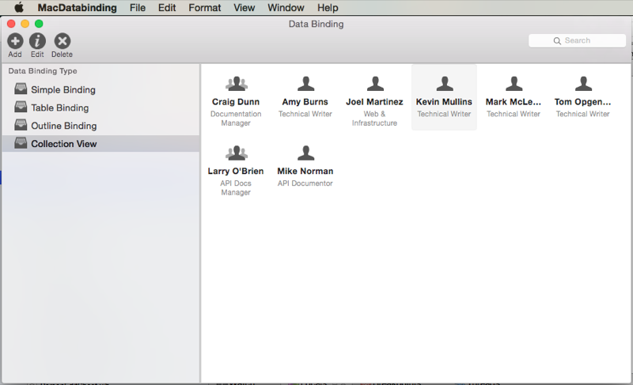](databinding-images/intro01-large.png#lightbox)

In this article, we'll cover the basics of working with key-value coding and data binding in a Xamarin.Mac application. It is highly suggested that you work through the [Hello, Mac](~/mac/get-started/hello-mac.md) article first, specifically the [Introduction to Xcode and Interface Builder](~/mac/get-started/hello-mac.md#introduction-to-xcode-and-interface-builder) and [Outlets and Actions](~/mac/get-started/hello-mac.md#outlets-and-actions) sections, as it covers key concepts and techniques that we'll be using in this article.

You may want to take a look at the [Exposing C# classes / methods to Objective-C](~/mac/internals/how-it-works.md) section of the [Xamarin.Mac Internals](~/mac/internals/how-it-works.md) document as well, it explains the `Register` and `Export` attributes used to wire up your C# classes to Objective-C objects and UI elements.

<a name="What_is_Key-Value_Coding"></a>

## What is key-value coding

Key-value coding (KVC) is a mechanism for accessing an object’s properties indirectly, using keys (specially formatted strings) to identify properties instead of accessing them through instance variables or accessor methods (`get/set`). By implementing key-value coding compliant accessors in your Xamarin.Mac application, you gain access to other macOS (formerly known as OS X) features such as key-value observing (KVO), data binding, Core Data, Cocoa bindings, and scriptability.

By using key-value coding and data binding techniques in your Xamarin.Mac application, you can greatly decrease the amount of code that you have to write and maintain to populate and work with UI elements. You also have the benefit of further decoupling your backing data (_Data Model_) from your front end User Interface (_Model-View-Controller_), leading to easier to maintain, more flexible application design.

For example, let's look at the following class definition of a KVC compliant object:

```csharp
using System;
using Foundation;

namespace MacDatabinding
{
    [Register("PersonModel")]
    public class PersonModel : NSObject
    {
        private string _name = "";

        [Export("Name")]
        public string Name {
            get { return _name; }
            set {
                WillChangeValue ("Name");
                _name = value;
                DidChangeValue ("Name");
            }
        }

        public PersonModel ()
        {
        }
    }
}
```

First, the `[Register("PersonModel")]` attribute registers the class and exposes it to Objective-C. Then, the class needs to inherit from `NSObject` (or a subclass that inherits from `NSObject`), this adds several base method that allow to the class to be KVC compliant. Next, the `[Export("Name")]` attribute exposes the `Name` property and defines the Key value that will later be used to access the property through KVC and KVO techniques.

Finally, to be able to be Key-Value Observed changes to the property's value, the accessor must wrap changes to its value in `WillChangeValue` and `DidChangeValue` method calls (specifying the same Key as the `Export` attribute).  For example:

```csharp
set {
    WillChangeValue ("Name");
    _name = value;
    DidChangeValue ("Name");
}
```

This step is _very_ important for data binding in Xcode's Interface Builder (as we will see later in this article).

For more information, please see Apple's [Key-Value Coding Programming Guide](https://developer.apple.com/library/content/documentation/Cocoa/Conceptual/KeyValueCoding/index.html).

### Keys and key paths

A _Key_ is a string that identifies a specific property of an object. Typically, a key corresponds to the name of an accessor method in a key-value coding compliant object. Keys must use ASCII encoding, usually begin with a lowercase letter, and may not contain whitespace. So given the example above, `Name` would be a Key Value of `Name` property of the `PersonModel` class. The Key and the name of the property that they expose don't have to be the same, however in most cases they are.

A _Key Path_ is a string of dot separated Keys used to specify a hierarchy of object properties to traverse. The property of the first key in the sequence is relative to the receiver, and each subsequent key is evaluated relative to the value of the previous property. In the same way you use dot notation to traverse an object and its properties in a C# class.

For example, if you expanded the `PersonModel` class and added `Child` property:

```csharp
using System;
using Foundation;

namespace MacDatabinding
{
    [Register("PersonModel")]
    public class PersonModel : NSObject
    {
        private string _name = "";
        private PersonModel _child = new PersonModel();

        [Export("Name")]
        public string Name {
            get { return _name; }
            set {
                WillChangeValue ("Name");
                _name = value;
                DidChangeValue ("Name");
            }
        }

        [Export("Child")]
        public PersonModel Child {
            get { return _child; }
            set {
                WillChangeValue ("Child");
                _child = value;
                DidChangeValue ("Child");
            }
        }

        public PersonModel ()
        {
        }
    }
}
```

The Key Path to the child's name would be `self.Child.Name` or simply `Child.Name` (based on how the Key Value was being used).

### Getting values using key-value coding

The `ValueForKey` method returns the value for the specified Key (as a `NSString`), relative to the instance of the KVC class receiving the request. For example, if `Person` is an instance of the `PersonModel` class defined above:

```csharp
// Read value
var name = Person.ValueForKey (new NSString("Name"));
```

This would return the value of the `Name` property for that instance of `PersonModel`.

### Setting values using key-value coding

Similarly, the `SetValueForKey` set the value for the specified Key (as a `NSString`), relative to the instance of the KVC class receiving the request. So again, using an instance of the `PersonModel` class, as shown below:

```csharp
// Write value
Person.SetValueForKey(new NSString("Jane Doe"), new NSString("Name"));
```

Would change the value of the `Name` property to `Jane Doe`.

<a name="Observing_Value_Changes"></a>

### Observing value changes

Using key-value observing (KVO), you can attach an observer to a specific Key of a KVC compliant class and be notified any time the value for that Key is modified (either using KVC techniques or directly accessing the given property in C# code). For example:

```csharp
// Watch for the name value changing
Person.AddObserver ("Name", NSKeyValueObservingOptions.New, (sender) => {
    // Inform caller of selection change
    Console.WriteLine("New Name: {0}", Person.Name)
});
```

Now, any time the `Name` property of the `Person` instance of the `PersonModel` class is modified, the new value is written out to the console.

For more information, please see Apple's [Introduction to Key-Value Observing Programming Guide](https://developer.apple.com/library/content/documentation/Cocoa/Conceptual/KeyValueObserving/KeyValueObserving.html#//apple_ref/doc/uid/10000177i).

## Data binding

The following sections will show how you can use a key-value coding and key-value observing compliant class to bind data to UI elements in Xcode's Interface Builder, instead of reading and writing values using C# code. In this way you separate your _Data Model_ from the views that are used to display them, making the Xamarin.Mac application more flexible and easier to maintain. You also greatly decrease the amount of code that has to be written.

<a name="Defining_your_Data_Model"></a>

### Defining your data model

Before you can Data Bind a UI element in Interface Builder, you must have a KVC/KVO compliant class defined in your Xamarin.Mac application to act as the _Data Model_ for the binding. The Data Model provides all of the data that will be displayed in the User Interface and receives any modifications to the data that the user makes in the UI while running the application.

For example, if you were writing an application that managed a group of employees, you could use the following class to define the Data Model:

```csharp
using System;
using Foundation;
using AppKit;

namespace MacDatabinding
{
    [Register("PersonModel")]
    public class PersonModel : NSObject
    {
        #region Private Variables
        private string _name = "";
        private string _occupation = "";
        private bool _isManager = false;
        private NSMutableArray _people = new NSMutableArray();
        #endregion

        #region Computed Properties
        [Export("Name")]
        public string Name {
            get { return _name; }
            set {
                WillChangeValue ("Name");
                _name = value;
                DidChangeValue ("Name");
            }
        }

        [Export("Occupation")]
        public string Occupation {
            get { return _occupation; }
            set {
                WillChangeValue ("Occupation");
                _occupation = value;
                DidChangeValue ("Occupation");
            }
        }

        [Export("isManager")]
        public bool isManager {
            get { return _isManager; }
            set {
                WillChangeValue ("isManager");
                WillChangeValue ("Icon");
                _isManager = value;
                DidChangeValue ("isManager");
                DidChangeValue ("Icon");
            }
        }

        [Export("isEmployee")]
        public bool isEmployee {
            get { return (NumberOfEmployees == 0); }
        }

        [Export("Icon")]
        public NSImage Icon {
            get {
                if (isManager) {
                    return NSImage.ImageNamed ("group.png");
                } else {
                    return NSImage.ImageNamed ("user.png");
                }
            }
        }

        [Export("personModelArray")]
        public NSArray People {
            get { return _people; }
        }

        [Export("NumberOfEmployees")]
        public nint NumberOfEmployees {
            get { return (nint)_people.Count; }
        }
        #endregion

        #region Constructors
        public PersonModel ()
        {
        }

        public PersonModel (string name, string occupation)
        {
            // Initialize
            this.Name = name;
            this.Occupation = occupation;
        }

        public PersonModel (string name, string occupation, bool manager)
        {
            // Initialize
            this.Name = name;
            this.Occupation = occupation;
            this.isManager = manager;
        }
        #endregion

        #region Array Controller Methods
        [Export("addObject:")]
        public void AddPerson(PersonModel person) {
            WillChangeValue ("personModelArray");
            isManager = true;
            _people.Add (person);
            DidChangeValue ("personModelArray");
        }

        [Export("insertObject:inPersonModelArrayAtIndex:")]
        public void InsertPerson(PersonModel person, nint index) {
            WillChangeValue ("personModelArray");
            _people.Insert (person, index);
            DidChangeValue ("personModelArray");
        }

        [Export("removeObjectFromPersonModelArrayAtIndex:")]
        public void RemovePerson(nint index) {
            WillChangeValue ("personModelArray");
            _people.RemoveObject (index);
            DidChangeValue ("personModelArray");
        }

        [Export("setPersonModelArray:")]
        public void SetPeople(NSMutableArray array) {
            WillChangeValue ("personModelArray");
            _people = array;
            DidChangeValue ("personModelArray");
        }
        #endregion
    }
}
```

Most of the features of this class were covered in the [What is key-value coding](#What_is_Key-Value_Coding) section above. However, let's look at a few specific elements and some additions that were made to allow this class to act as a Data Model for **Array Controllers** and **Tree Controllers** (which we'll be using later to Data bind **Tree Views**, **Outline Views** and **Collection Views**).

First, because an employee might be a manager, we've used a `NSArray` (specifically a `NSMutableArray` so the values can be modified) to allow the employees that they managed to be attached to them:

```csharp
private NSMutableArray _people = new NSMutableArray();
...

[Export("personModelArray")]
public NSArray People {
    get { return _people; }
}
```

Two things to note here:

1. We used a `NSMutableArray` instead of a standard C# array or collection since this is a requirement to Data Bind to AppKit controls such as **Table Views**, **Outline Views** and **Collections**.
2. We exposed the array of employees by casting it to a `NSArray` for data binding purposes and changed its C# formatted name, `People`, to one that data binding expects, `personModelArray` in the form **{class_name}Array** (note that the first character has been made lower case).

Next, we need to add some specially name public methods to support **Array Controllers** and **Tree Controllers**:

```csharp
[Export("addObject:")]
public void AddPerson(PersonModel person) {
    WillChangeValue ("personModelArray");
    isManager = true;
    _people.Add (person);
    DidChangeValue ("personModelArray");
}

[Export("insertObject:inPersonModelArrayAtIndex:")]
public void InsertPerson(PersonModel person, nint index) {
    WillChangeValue ("personModelArray");
    _people.Insert (person, index);
    DidChangeValue ("personModelArray");
}

[Export("removeObjectFromPersonModelArrayAtIndex:")]
public void RemovePerson(nint index) {
    WillChangeValue ("personModelArray");
    _people.RemoveObject (index);
    DidChangeValue ("personModelArray");
}

[Export("setPersonModelArray:")]
public void SetPeople(NSMutableArray array) {
    WillChangeValue ("personModelArray");
    _people = array;
    DidChangeValue ("personModelArray");
}
```

These allow the controllers to request and modify the data that they display. Like the exposed `NSArray` above, these have a very specific naming convention (that differs from the typical C# naming conventions):

- `addObject:` - Adds an object to the array.
- `insertObject:in{class_name}ArrayAtIndex:` - Where `{class_name}` is the name of your class. This method inserts an object into the array at a given index.
- `removeObjectFrom{class_name}ArrayAtIndex:` - Where `{class_name}` is the name of your class. This method removes the object in the array at a given index.
- `set{class_name}Array:` - Where `{class_name}` is the name of your class. This method allows you to replace the existing carry with a new one.

Inside of these methods, we've wrapped changes to the array in `WillChangeValue` and `DidChangeValue` messages for KVO compliance.

Finally, since the `Icon` property relies on the value of the `isManager` property, changes to the `isManager` property might not be reflected in the `Icon` for Data Bound UI elements (during KVO):

```csharp
[Export("Icon")]
public NSImage Icon {
    get {
        if (isManager) {
            return NSImage.ImageNamed ("group.png");
        } else {
            return NSImage.ImageNamed ("user.png");
        }
    }
}
```

To correct that, we use the following code:

```csharp
[Export("isManager")]
public bool isManager {
    get { return _isManager; }
    set {
        WillChangeValue ("isManager");
        WillChangeValue ("Icon");
        _isManager = value;
        DidChangeValue ("isManager");
        DidChangeValue ("Icon");
    }
}
```

Note that in addition to its own Key, the `isManager` accessor is also sending the `WillChangeValue` and `DidChangeValue` messages for the `Icon` Key so it will see the change as well.

We'll be using the `PersonModel` Data Model throughout the rest of this article.

<a name="Simple_Data_Binding"></a>

### Simple data binding

With our Data Model defined, let's look at a simple example of data binding in Xcode's Interface Builder. For example, let's add a form to our Xamarin.Mac application that can be used to edit the `PersonModel` that we defined above. We'll add a few Text Fields and a Check Box to display and edit properties of our model.

First, let's add a new **View Controller** to our **Main.storyboard** file in Interface Builder and name its class `SimpleViewController`:

[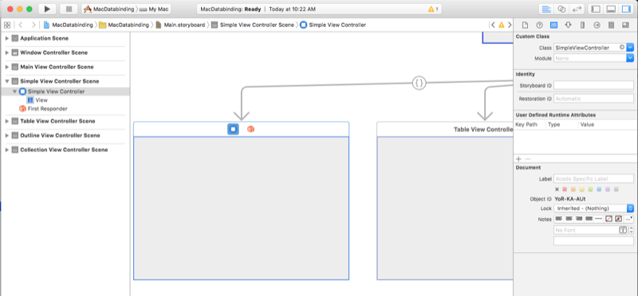](databinding-images/simple01-large.png#lightbox)

Next, return to Visual Studio for Mac, edit the **SimpleViewController.cs** file (that was automatically added to our project) and expose an instance of the `PersonModel` that we will be data binding our form to. Add the following code:

```csharp
private PersonModel _person = new PersonModel();
...

[Export("Person")]
public PersonModel Person {
    get {return _person; }
    set {
        WillChangeValue ("Person");
        _person = value;
        DidChangeValue ("Person");
    }
}
```

Next when the View is loaded, let's create an instance of our `PersonModel` and populate it with this code:

```csharp
public override void ViewDidLoad ()
{
    base.AwakeFromNib ();

    // Set a default person
    var Craig = new PersonModel ("Craig Dunn", "Documentation Manager");
    Craig.AddPerson (new PersonModel ("Amy Burns", "Technical Writer"));
    Craig.AddPerson (new PersonModel ("Joel Martinez", "Web & Infrastructure"));
    Craig.AddPerson (new PersonModel ("Kevin Mullins", "Technical Writer"));
    Craig.AddPerson (new PersonModel ("Mark McLemore", "Technical Writer"));
    Craig.AddPerson (new PersonModel ("Tom Opgenorth", "Technical Writer"));
    Person = Craig;

}
```

Now we need to create our form, double-click the **Main.storyboard** file to open it for editing in Interface Builder. Layout the form to look something like the following:

[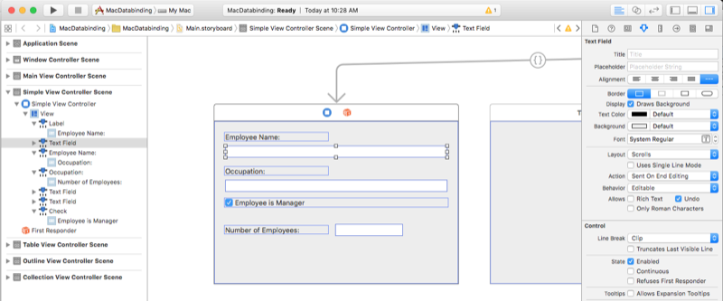](databinding-images/simple02-large.png#lightbox)

To Data Bind the form to the `PersonModel` that we exposed via the `Person` Key, do the following:

1. Select the **Employee Name** Text Field and switch to the **Bindings Inspector**.
2. Check the **Bind to** box and select **Simple View Controller** from the dropdown. Next enter `self.Person.Name` for the **Key Path**:

    [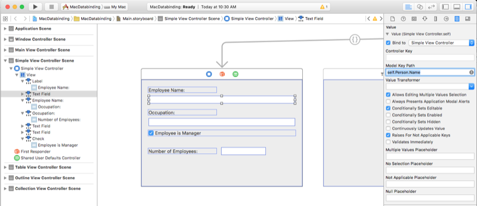](databinding-images/simple03-large.png#lightbox)
3. Select the **Occupation** Text Field and check the **Bind to** box and select **Simple View Controller** from the dropdown. Next enter `self.Person.Occupation` for the **Key Path**:

    [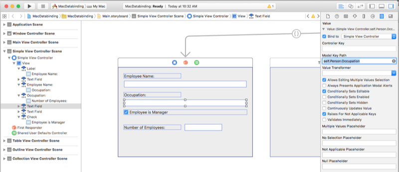](databinding-images/simple04-large.png#lightbox)
4. Select the **Employee is a Manager** Checkbox and check the **Bind to** box and select **Simple View Controller** from the dropdown. Next enter `self.Person.isManager` for the **Key Path**:

    [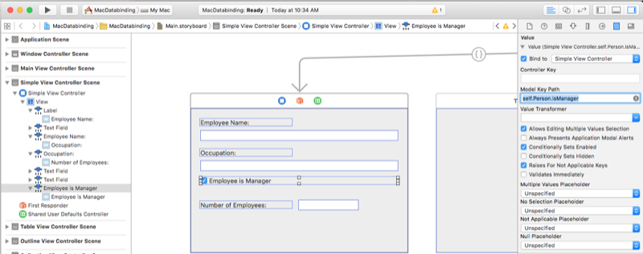](databinding-images/simple05-large.png#lightbox)
5. Select the **Number of Employees Managed** Text Field and check the **Bind to** box and select **Simple View Controller** from the dropdown. Next enter `self.Person.NumberOfEmployees` for the **Key Path**:

    [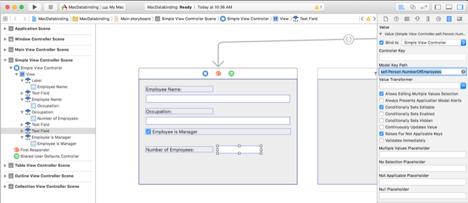](databinding-images/simple06-large.png#lightbox)
6. If the employee is not a manager, we want to hide the Number of Employees Managed Label and Text Field.
7. Select the **Number of Employees Managed** Label, expand the **Hidden** turndown and check the **Bind to** box and select **Simple View Controller** from the dropdown. Next enter `self.Person.isManager` for the **Key Path**:

    [](databinding-images/simple07-large.png#lightbox)
8. Select `NSNegateBoolean` from the **Value Transformer** dropdown:

    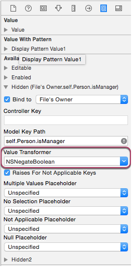
9. This tells data binding that the label will be hidden if the value of the `isManager` property is `false`.
10. Repeat steps 7 and 8 for the **Number of Employees Managed** Text Field.
11. Save your changes and return to Visual Studio for Mac to sync with Xcode.

If you run the application, the values from the `Person` property will automatically populate our form:

[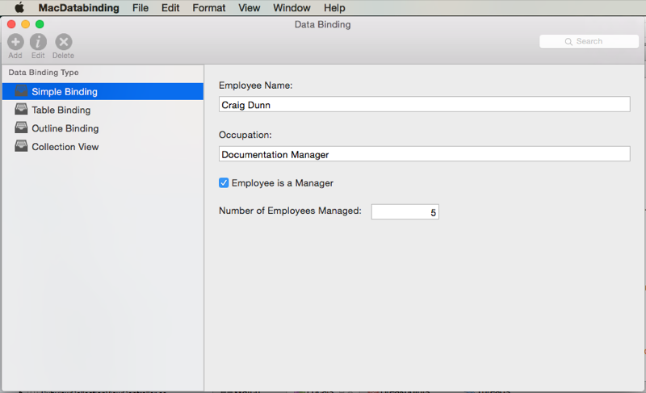](databinding-images/simple09-large.png#lightbox)

Any changes that the users makes to the form will be written back to the `Person` property in the View Controller. For example, unselecting **Employee is a Manager** updates the `Person` instance of our `PersonModel` and the **Number of Employees Managed** Label and Text Field are hidden automatically (via data binding):

[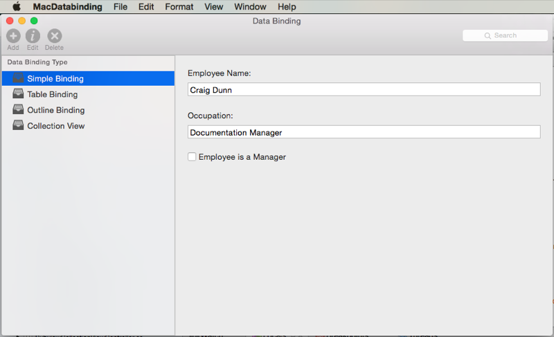](databinding-images/simple10-large.png#lightbox)

<a name="Table_View_Data_Binding"></a>

### Table view data binding

Now that we have the basics of data binding out of the way, let's look at a more complex data binding task by using an _Array Controller_ and data binding to a Table View. For more information on working with Table Views, please see our [Table Views](~/mac/user-interface/table-view.md) documentation.

First, let's add a new **View Controller** to our **Main.storyboard** file in Interface Builder and name its class `TableViewController`:

[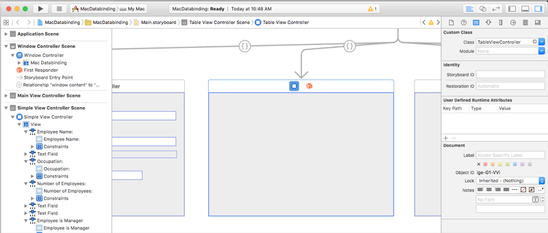](databinding-images/table01-large.png#lightbox)

Next, let's edit the **TableViewController.cs** file (that was automatically added to our project) and expose an array (`NSArray`) of `PersonModel` classes that we will be data binding our form to. Add the following code:

```csharp
private NSMutableArray _people = new NSMutableArray();
...

[Export("personModelArray")]
public NSArray People {
    get { return _people; }
}
...

[Export("addObject:")]
public void AddPerson(PersonModel person) {
    WillChangeValue ("personModelArray");
    _people.Add (person);
    DidChangeValue ("personModelArray");
}

[Export("insertObject:inPersonModelArrayAtIndex:")]
public void InsertPerson(PersonModel person, nint index) {
    WillChangeValue ("personModelArray");
    _people.Insert (person, index);
    DidChangeValue ("personModelArray");
}

[Export("removeObjectFromPersonModelArrayAtIndex:")]
public void RemovePerson(nint index) {
    WillChangeValue ("personModelArray");
    _people.RemoveObject (index);
    DidChangeValue ("personModelArray");
}

[Export("setPersonModelArray:")]
public void SetPeople(NSMutableArray array) {
    WillChangeValue ("personModelArray");
    _people = array;
    DidChangeValue ("personModelArray");
}
```

Just like we did on the `PersonModel` class above in the [Defining your Data Model](#Defining_your_Data_Model) section, we've exposed four specially named public methods so that the Array Controller and read and write data from our collection of `PersonModels`.

Next when the View is loaded, we need to populate our array with this code:

```csharp
public override void AwakeFromNib ()
{
    base.AwakeFromNib ();

    // Build list of employees
    AddPerson (new PersonModel ("Craig Dunn", "Documentation Manager", true));
    AddPerson (new PersonModel ("Amy Burns", "Technical Writer"));
    AddPerson (new PersonModel ("Joel Martinez", "Web & Infrastructure"));
    AddPerson (new PersonModel ("Kevin Mullins", "Technical Writer"));
    AddPerson (new PersonModel ("Mark McLemore", "Technical Writer"));
    AddPerson (new PersonModel ("Tom Opgenorth", "Technical Writer"));
    AddPerson (new PersonModel ("Larry O'Brien", "API Documentation Manager", true));
    AddPerson (new PersonModel ("Mike Norman", "API Documenter"));

}
```

Now we need to create our Table View, double-click the **Main.storyboard** file to open it for editing in Interface Builder. Layout the table to look something like the following:

[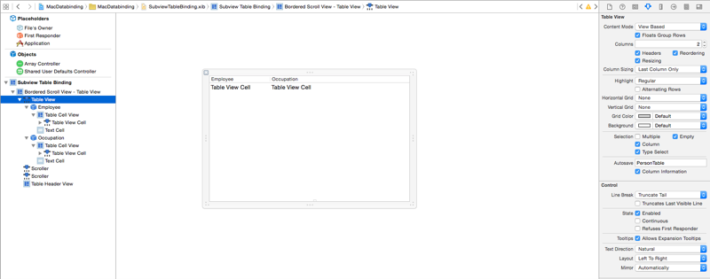](databinding-images/table02-large.png#lightbox)

We need to add an **Array Controller** to provide bound data to our table, do the following:

1. Drag an **Array Controller** from the **Library Inspector** onto the **Interface Editor**:

    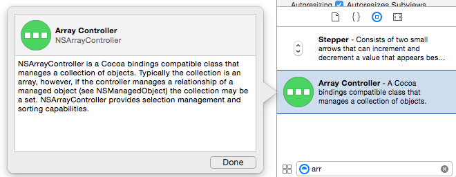
2. Select **Array Controller** in the **Interface Hierarchy** and switch to the **Attribute Inspector**:

    [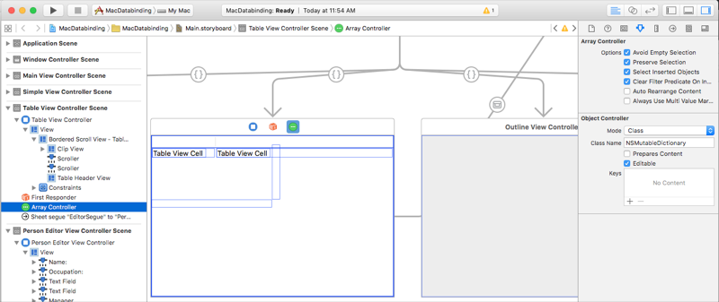](databinding-images/table04-large.png#lightbox)
3. Enter `PersonModel` for the **Class Name**, click the **Plus** button and add three Keys. Name them `Name`, `Occupation` and `isManager`:

    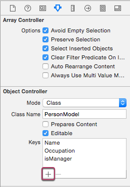
4. This tells the Array Controller what it is managing an array of, and which properties it should expose (via Keys).
5. Switch to the **Bindings Inspector** and under **Content Array** select **Bind to** and **Table View Controller**. Enter a **Model Key Path** of `self.personModelArray`:

    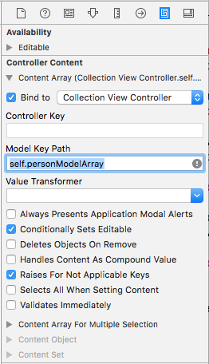
6. This ties the Array Controller to the array of `PersonModels` that we exposed on our View Controller.

Now we need to bind our Table View to the Array Controller, do the following:

1. Select the Table View and the **Binding Inspector**:

    [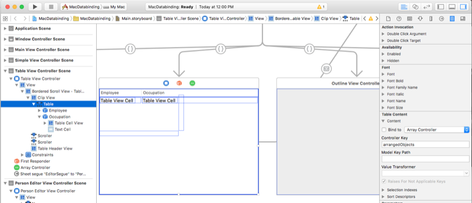](databinding-images/table07-large.png#lightbox)
2. Under the **Table Contents** turndown, select **Bind to** and **Array Controller**. Enter `arrangedObjects` for the **Controller Key** field:

    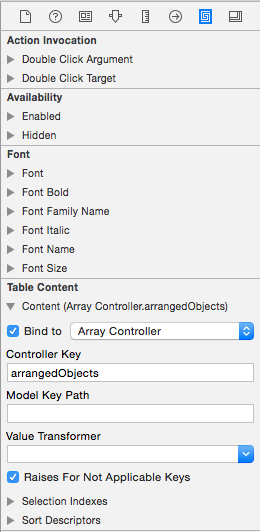
3. Select the **Table View Cell** under the **Employee** column. In the **Bindings Inspector** under the **Value** turndown, select **Bind to** and **Table Cell View**. Enter `objectValue.Name` for the **Model Key Path**:

    [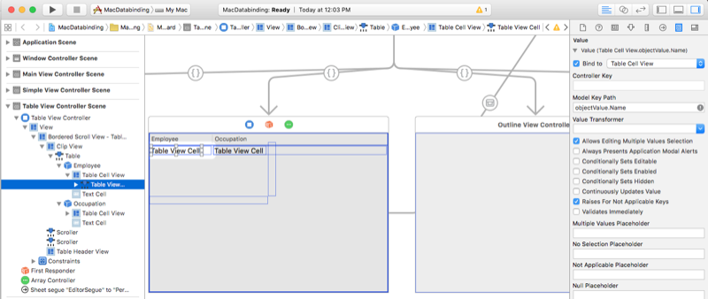](databinding-images/table09-large.png#lightbox)
4. `objectValue` is the current `PersonModel` in the array being managed by the Array Controller.
5. Select the **Table View Cell** under the **Occupation** column. In the **Bindings Inspector** under the **Value** turndown, select **Bind to** and **Table Cell View**. Enter `objectValue.Occupation` for the **Model Key Path**:

    [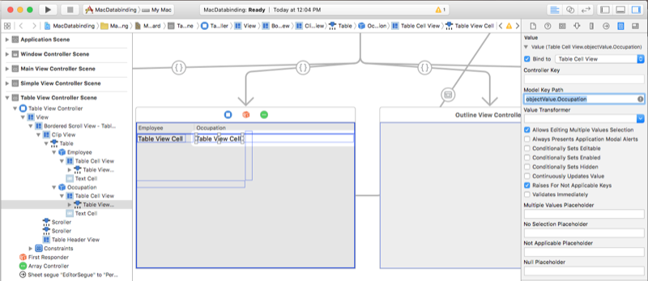](databinding-images/table10-large.png#lightbox)
6. Save your changes and return to Visual Studio for Mac to sync with Xcode.

If we run the application, the table will be populated with our array of `PersonModels`:

[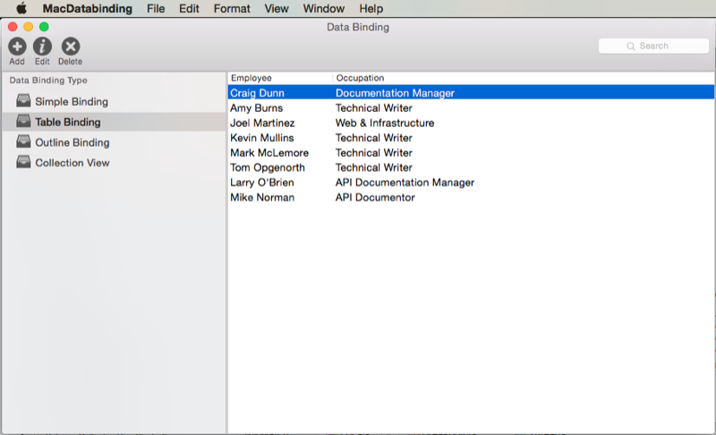](databinding-images/table11-large.png#lightbox)

<a name="Outline_View_Data_Binding"></a>

### Outline view data binding

data binding against an Outline View is very similar to binding against a Table View. The key difference is that we'll be using a **Tree Controller** instead of an **Array Controller** to provide the bound data to the Outline View. For more information on working with Outline Views, please see our [Outline Views](~/mac/user-interface/outline-view.md) documentation.

First, let's add a new **View Controller** to our **Main.storyboard** file in Interface Builder and name its class `OutlineViewController`:

[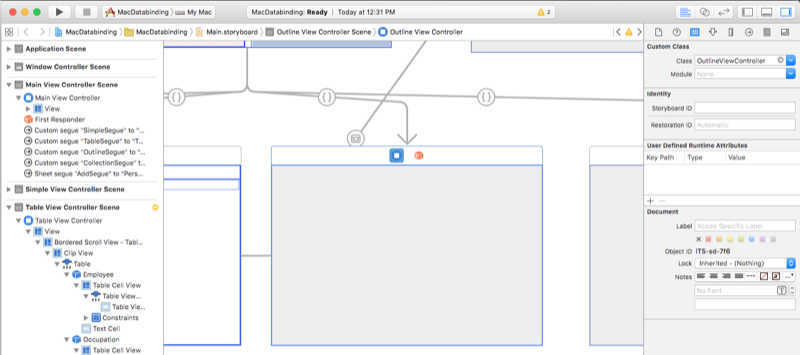](databinding-images/outline01-large.png#lightbox)

Next, let's edit the **OutlineViewController.cs** file (that was automatically added to our project) and expose an array (`NSArray`) of `PersonModel` classes that we will be data binding our form to. Add the following code:

```csharp
private NSMutableArray _people = new NSMutableArray();
...

[Export("personModelArray")]
public NSArray People {
    get { return _people; }
}
...

[Export("addObject:")]
public void AddPerson(PersonModel person) {
    WillChangeValue ("personModelArray");
    _people.Add (person);
    DidChangeValue ("personModelArray");
}

[Export("insertObject:inPersonModelArrayAtIndex:")]
public void InsertPerson(PersonModel person, nint index) {
    WillChangeValue ("personModelArray");
    _people.Insert (person, index);
    DidChangeValue ("personModelArray");
}

[Export("removeObjectFromPersonModelArrayAtIndex:")]
public void RemovePerson(nint index) {
    WillChangeValue ("personModelArray");
    _people.RemoveObject (index);
    DidChangeValue ("personModelArray");
}

[Export("setPersonModelArray:")]
public void SetPeople(NSMutableArray array) {
    WillChangeValue ("personModelArray");
    _people = array;
    DidChangeValue ("personModelArray");
}
```

Just like we did on the `PersonModel` class above in the [Defining your Data Model](#Defining_your_Data_Model) section, we've exposed four specially named public methods so that the Tree Controller and read and write data from our collection of `PersonModels`.

Next when the View is loaded, we need to populate our array with this code:

```csharp
public override void AwakeFromNib ()
{
    base.AwakeFromNib ();

    // Build list of employees
    var Craig = new PersonModel ("Craig Dunn", "Documentation Manager");
    Craig.AddPerson (new PersonModel ("Amy Burns", "Technical Writer"));
    Craig.AddPerson (new PersonModel ("Joel Martinez", "Web & Infrastructure"));
    Craig.AddPerson (new PersonModel ("Kevin Mullins", "Technical Writer"));
    Craig.AddPerson (new PersonModel ("Mark McLemore", "Technical Writer"));
    Craig.AddPerson (new PersonModel ("Tom Opgenorth", "Technical Writer"));
    AddPerson (Craig);

    var Larry = new PersonModel ("Larry O'Brien", "API Documentation Manager");
    Larry.AddPerson (new PersonModel ("Mike Norman", "API Documenter"));
    AddPerson (Larry);

}
```

Now we need to create our Outline View, double-click the **Main.storyboard** file to open it for editing in Interface Builder. Layout the table to look something like the following:

[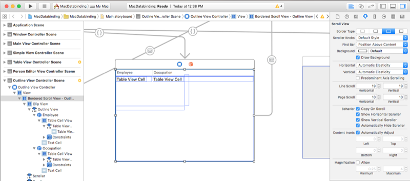](databinding-images/outline02-large.png#lightbox)

We need to add an **Tree Controller** to provide bound data to our outline, do the following:

1. Drag an **Tree Controller** from the **Library Inspector** onto the **Interface Editor**:

    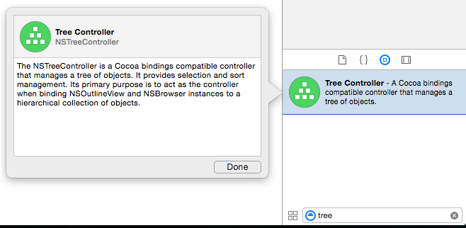
2. Select **Tree Controller** in the **Interface Hierarchy** and switch to the **Attribute Inspector**:

    [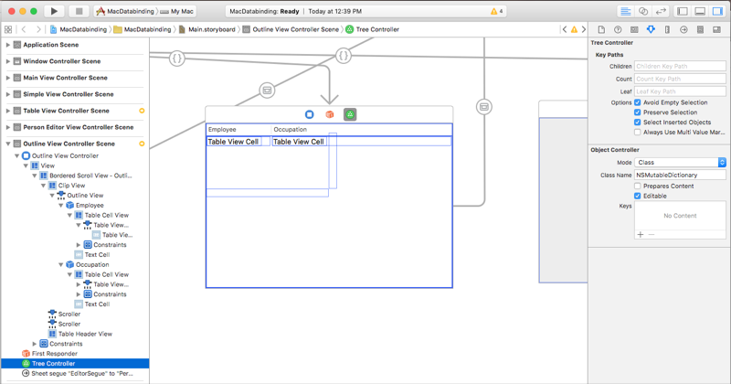](databinding-images/outline04-large.png#lightbox)
3. Enter `PersonModel` for the **Class Name**, click the **Plus** button and add three Keys. Name them `Name`, `Occupation` and `isManager`:

    
4. This tells the Tree Controller what it is managing an array of, and which properties it should expose (via Keys).
5. Under the **Tree Controller** section, enter `personModelArray` for **Children**, enter `NumberOfEmployees` under the **Count** and enter `isEmployee` under **Leaf**:

    
6. This tells the Tree Controller where to find any child nodes, how many child nodes there are and if the current node has child nodes.
7. Switch to the **Bindings Inspector** and under **Content Array** select **Bind to** and **File's Owner**. Enter a **Model Key Path** of `self.personModelArray`:

    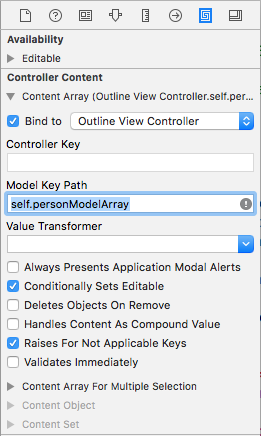
8. This ties the Tree Controller to the array of `PersonModels` that we exposed on our View Controller.

Now we need to bind our Outline View to the Tree Controller, do the following:

1. Select the Outline View and in the **Binding Inspector** select :

    [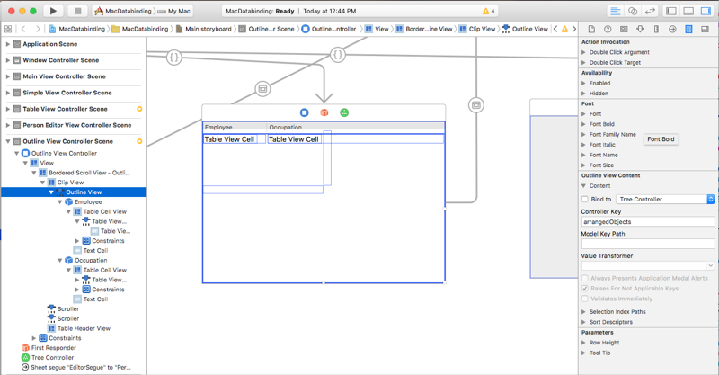](databinding-images/outline07-large.png#lightbox)
2. Under the **Outline View Contents** turndown, select **Bind to** and **Tree Controller**. Enter `arrangedObjects` for the **Controller Key** field:

    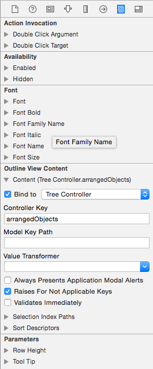
3. Select the **Table View Cell** under the **Employee** column. In the **Bindings Inspector** under the **Value** turndown, select **Bind to** and **Table Cell View**. Enter `objectValue.Name` for the **Model Key Path**:

    [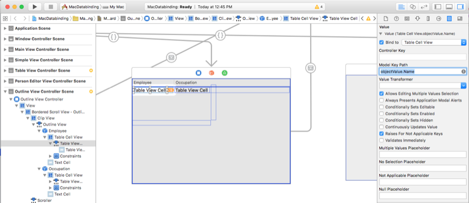](databinding-images/outline09-large.png#lightbox)
4. `objectValue` is the current `PersonModel` in the array being managed by the Tree Controller.
5. Select the **Table View Cell** under the **Occupation** column. In the **Bindings Inspector** under the **Value** turndown, select **Bind to** and **Table Cell View**. Enter `objectValue.Occupation` for the **Model Key Path**:

    [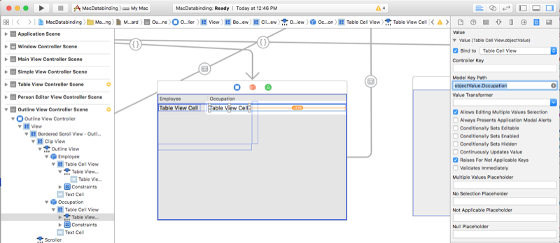](databinding-images/outline10-large.png#lightbox)
6. Save your changes and return to Visual Studio for Mac to sync with Xcode.

If we run the application, the outline will be populated with our array of `PersonModels`:

[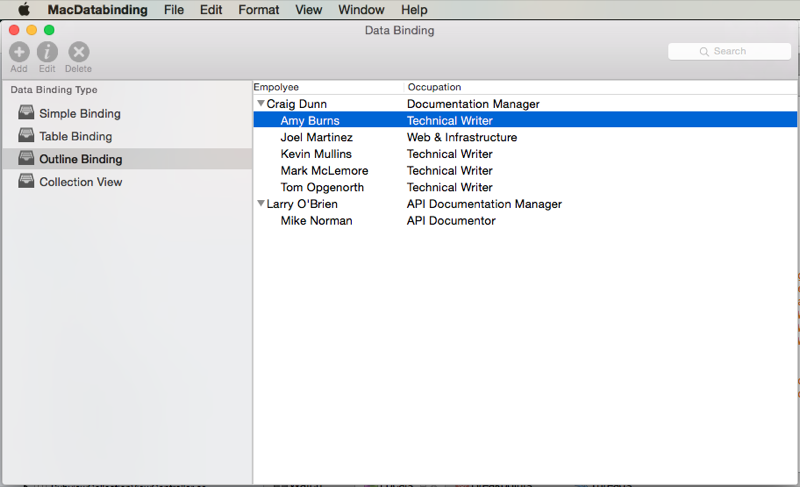](databinding-images/outline11-large.png#lightbox)

### Collection view data binding

Data binding with a Collection View is very much like binding with a Table View, as an Array Controller is used to provide data for the collection. Since the collection view doesn't have a preset display format, more work is required to provide user interaction feedback and to track user selection.

> [!IMPORTANT]
> Due to an issue in Xcode 7 and macOS 10.11 (and greater), Collection Views are unable to be used inside of a Storyboard (.storyboard) files. As a result, you will need to continue to use .xib files to define your Collection Views for your Xamarin.Mac apps. Please see our [Collection Views](~/mac/user-interface/collection-view.md) documentation for more information.

<!--KKM 012/16/2015 - Once Apple fixes the issue with Xcode and Collection Views in Storyboards, we can uncomment this section.

First, let's add a new **View Controller** to our **Main.storyboard** file in Interface Builder and name its class `CollectionViewController`:

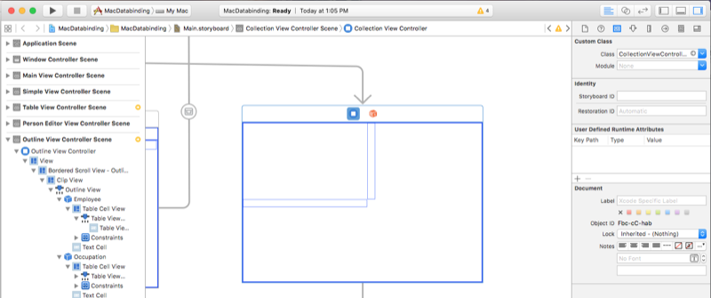

Next, let's edit the **CollectionViewController.cs** file (that was automatically added to our project) and expose an array (`NSArray`) of `PersonModel` classes that we will be data binding our form to. Add the following code:

```csharp
private NSMutableArray _people = new NSMutableArray();
...

[Export("personModelArray")]
public NSArray People {
    get { return _people; }
}
...

[Export("addObject:")]
public void AddPerson(PersonModel person) {
    WillChangeValue ("personModelArray");
    _people.Add (person);
    DidChangeValue ("personModelArray");
}

[Export("insertObject:inPersonModelArrayAtIndex:")]
public void InsertPerson(PersonModel person, nint index) {
    WillChangeValue ("personModelArray");
    _people.Insert (person, index);
    DidChangeValue ("personModelArray");
}

[Export("removeObjectFromPersonModelArrayAtIndex:")]
public void RemovePerson(nint index) {
    WillChangeValue ("personModelArray");
    _people.RemoveObject (index);
    DidChangeValue ("personModelArray");
}

[Export("setPersonModelArray:")]
public void SetPeople(NSMutableArray array) {
    WillChangeValue ("personModelArray");
    _people = array;
    DidChangeValue ("personModelArray");
}
```

Just like we did on the `PersonModel` class above in the [Defining your Data Model](#Defining_your_Data_Model) section, we've exposed four specially named public methods so that the Array Controller and read and write data from our collection of `PersonModels`.

Next when the View is loaded, we need to populate our array with this code:

```csharp
public override void AwakeFromNib ()
{
    base.AwakeFromNib ();

    // Build list of employees
    AddPerson (new PersonModel ("Craig Dunn", "Documentation Manager", true));
    AddPerson (new PersonModel ("Amy Burns", "Technical Writer"));
    AddPerson (new PersonModel ("Joel Martinez", "Web & Infrastructure"));
    AddPerson (new PersonModel ("Kevin Mullins", "Technical Writer"));
    AddPerson (new PersonModel ("Mark McLemore", "Technical Writer"));
    AddPerson (new PersonModel ("Tom Opgenorth", "Technical Writer"));
    AddPerson (new PersonModel ("Larry O'Brien", "API Documentation Manager", true));
    AddPerson (new PersonModel ("Mike Norman", "API Documenter"));

}
```

Now we need to create our Collection View, double-click the **Main.storyboard** file to open it for editing in Interface Builder. Layout the Collection View to look something like the following:

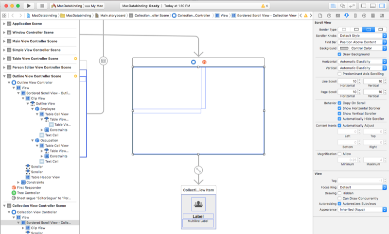

When you add a Collection View to a User Interface design, two extra elements are also added:

1. **Collection View Item** -  That manages a single instance of an item in the collection.
2. **View** - A custom view that provides the visual size and appearance of each item in the collection. This view is tied to and managed by the **Collection View Item**.

Select the view and make it look like the following using an Image View and two Text Fields:

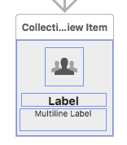

One thing to note here, a `NSBox` was added behind everything in the view with the following attributes:

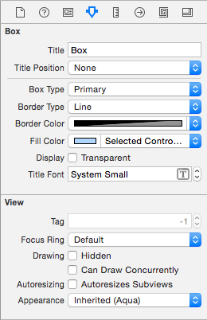

We'll be using this box to provide feedback to the user when an item is selected in the Collection View.

We need to add an **Array Controller** to provide bound data to our collection, do the following:

1. Drag an **Array Controller** from the **Library Inspector** onto the **Interface Editor**: <br/>
2. Select **Array Controller** in the **Interface Hierarchy** and switch to the **Attribute Inspector**: <br/>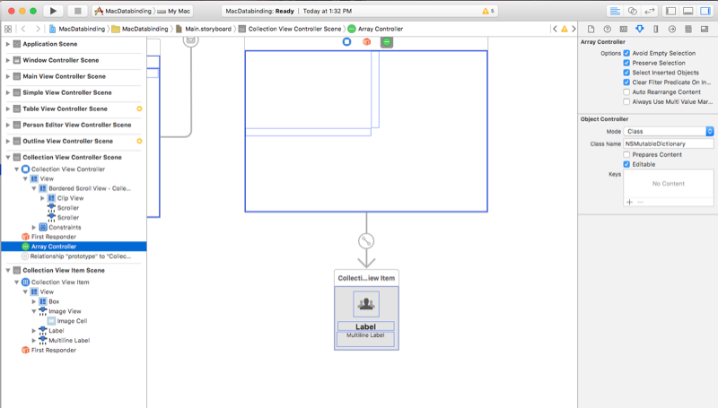
3. Enter `PersonModel` for the **Class Name**, click the **Plus** button and add four Keys. Name them `Icon`, `Name`, `Occupation` and `isManager`: <br/>
4. This tells the Array Controller what it is managing an array of, and which properties it should expose (via Keys).
5. Switch to the **Bindings Inspector** and under **Content Array** select **Bind to** and **File's Owner**. Enter a **Model Key Path** of `self.personModelArray`: <br/>
6. This ties the Array Controller to the array of `PersonModels` that we exposed on our View Controller.

Now we need to bind our Collection View to the Array Controller, do the following:

1. Select the Collection View and the **Binding Inspector**: <br/>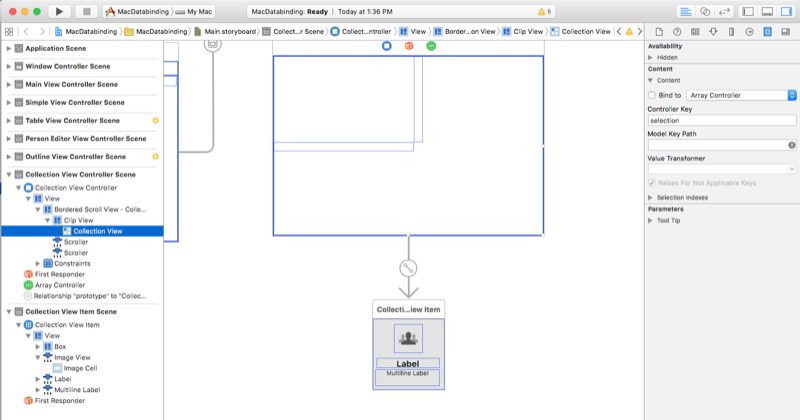
2. Under the **Contents** turndown, select **Bind to** and **Array Controller**. Enter `arrangedObjects` for the **Controller Key** field: <br/>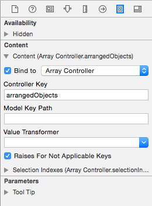
3. Under the **Selection Indexes** turndown, select **Bind to** and **Array Controller**. Enter `selectionIndexes` for the **Controller Key** field: <br/>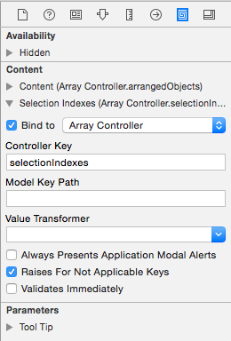
4. Select the **Image View**. In the **Bindings Inspector** under the **Value** turndown, select **Bind to** and **Person** (the name of our Collection View Item). Enter `representedObject.Icon` for the **Model Key Path**: <br/>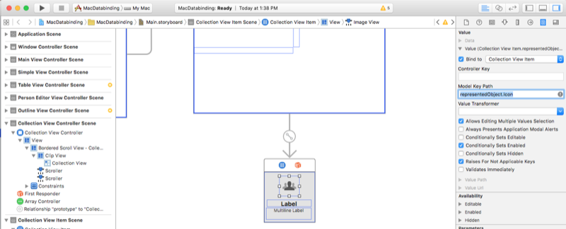
5. `representedObject` is the current `PersonModel` in the array being managed by the Array Controller.
6. Select the first **Label**. In the **Bindings Inspector** under the **Value** turndown, select **Bind to** and **Collection View Item**. Enter `representedObject.Name` for the **Model Key Path**: <br/>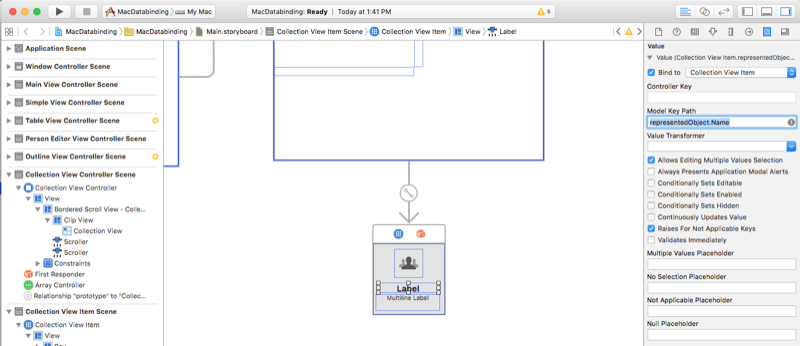
7. Select the second **Label**. In the **Bindings Inspector** under the **Value** turndown, select **Bind to** and **Collection View Item**. Enter `representedObject.Occupation` for the **Model Key Path**: <br/>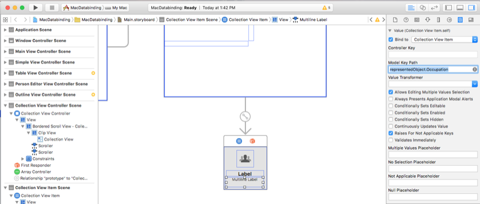
8. Select the `NSBox`. In the **Bindings Inspector** under the **Hidden** turndown, select **Bind to** and **Collection View Item**. Enter `selected` for the **Model Key Path** and `NSNegateBoolean` for the **Value Transformer**: <br/>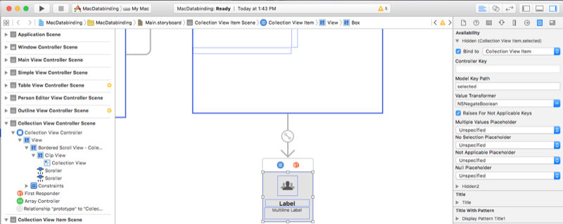
9. Save your changes and return to Visual Studio for Mac to sync with Xcode.

If we run the application, the table will be populated with our array of `PersonModels`:


For more information on working with Collection Views, please see our [Collection Views](~/mac/user-interface/collection-view.md) documentation.-->

## Debugging native crashes

Making a mistake in your data bindings can result in a _Native Crash_ in unmanaged code and cause your Xamarin.Mac application to fail completely with a `SIGABRT` error:

[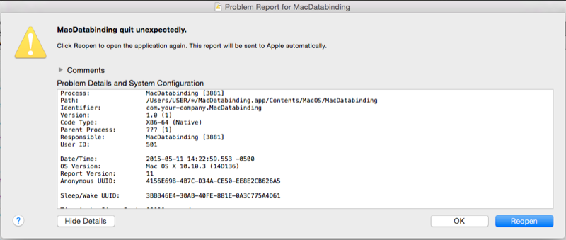](databinding-images/debug01-large.png#lightbox)

There are typically four major causes for native crashes during data binding:

1. Your Data Model does not inherit from `NSObject` or a subclass of `NSObject`.
2. You did not expose your property to Objective-C using the `[Export("key-name")]` attribute.
3. You did not wrap changes to the accessor's value in `WillChangeValue` and `DidChangeValue` method calls (specifying the same Key as the `Export` attribute).
4. You have a wrong or mistyped Key in the **Binding Inspector** in Interface Builder.

### Decoding a crash

Let's cause a native crash in our data binding so we can show how to locate and fix it. In Interface Builder, let's change our binding of first Label in the Collection View example from `Name` to `Title`:

[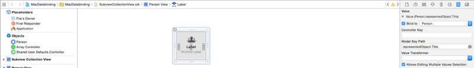](databinding-images/debug02-large.png#lightbox)

Let's save the change, switch back to Visual Studio for Mac to sync with Xcode and run our application. When the Collection View is displayed, the application will momentarily crash with a `SIGABRT` error (as shown in the **Application Output** in Visual Studio for Mac) since the `PersonModel` does not expose a property with the Key `Title`:

[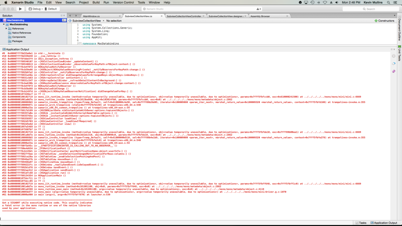](databinding-images/debug03-large.png#lightbox)

If we scroll to the very top of the error in the **Application Output** we can see the key to solving the issue:

[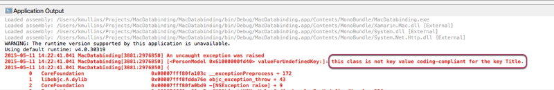](databinding-images/debug04-large.png#lightbox)

This line is telling us that the key `Title` doesn't exist on the object that we are binding to. If we change the binding back to `Name` in Interface Builder, save, sync, rebuild and run, the application will run as expected without issue.

## Summary

This article has taken a detailed look at working with data binding and key-value coding in a Xamarin.Mac application. First, it looked at exposing a C# class to Objective-C by using key-value coding (KVC) and key-value observing (KVO). Next, it showed how to use a KVO compliant class and Data Bind it to UI elements in Xcode's Interface Builder. Finally, it showed complex data binding using **Array Controllers** and **Tree Controllers**.

## Related Links

- [MacDatabinding Storyboard (sample)](/samples/xamarin/mac-samples/macdatabinding-storyboard)
- [MacDatabinding XIBs (sample)](/samples/xamarin/mac-samples/macdatabinding-xibs)
- [Hello, Mac](~/mac/get-started/hello-mac.md)
- [Standard controls](~/mac/user-interface/standard-controls.md)
- [Table views](~/mac/user-interface/table-view.md)
- [Outline views](~/mac/user-interface/outline-view.md)
- [Collection views](~/mac/user-interface/collection-view.md)
- [Key-Value Coding Programming Guide](https://developer.apple.com/library/content/documentation/Cocoa/Conceptual/KeyValueCoding/index.html)
- [Introduction to Key-Value Observing Programming Guide](https://developer.apple.com/library/content/documentation/Cocoa/Conceptual/KeyValueObserving/KeyValueObserving.html)
- [Introduction to Cocoa Bindings Programming Topics](https://developer.apple.com/library/content/documentation/Cocoa/Conceptual/CocoaBindings/CocoaBindings.html)
- [Introduction to Cocoa Bindings Reference](https://developer.apple.com/library/content/documentation/Cocoa/Reference/CocoaBindingsRef/CocoaBindingsRef.html)
- [NSCollectionView](https://developer.apple.com/documentation/appkit/nscollectionview)
- [macOS Human Interface Guidelines](https://developer.apple.com/design/human-interface-guidelines/designing-for-macos)