# Images in Xamarin.Mac

_This article covers working with images and icons in a Xamarin.Mac application. It describes creating and maintaining the images needed to create your application's icon and using images in both C# code and Xcode's Interface Builder._

## Overview

When working with C# and .NET in a Xamarin.Mac application, you have access to the same Image and Icon tools that a developer working in *Objective-C* and *Xcode* does.

There are several ways that image assets are used inside a macOS (formerly known as Mac OS X) application. From simply displaying an image as part of your application's UI to, assigning it to a UI control such as a Tool Bar or Source List Item, to providing Icons, Xamarin.Mac makes it easy to add great artwork to your macOS applications in the following ways: 

- **UI elements** - Images can be displayed as backgrounds or as part of your application in a Image View (`NSImageView`).
- **Button** - Images can be displayed in buttons (`NSButton`).
- **Image Cell** - As part of a table based control (`NSTableView` or `NSOutlineView`), images can be used in a Image Cell (`NSImageCell`).
- **Toolbar Item** - Images can be added to a Toolbar (`NSToolbar`) as a Image Toolbar Item (`NSToolbarItem`).
- **Source List Icon** - As part of a Source List (a specially formatted `NSOutlineView`).
- **App Icon** - A series of images can be grouped together into a `.icns` set and used as your application's icon. See our [Application Icon](~/mac/deploy-test/app-icon.md) documentation for more information.

Additionally, macOS provides a set of predefined images that can be used throughout your application.

[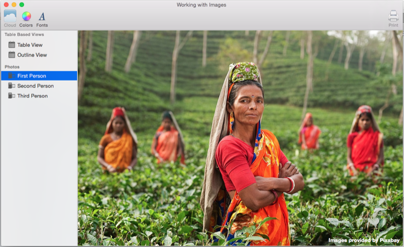](image-images/intro01-large.png#lightbox)

In this article, we'll cover the basics of working with Images and Icons in a Xamarin.Mac application. It is highly suggested that you work through the [Hello, Mac](~/mac/get-started/hello-mac.md) article first, specifically the [Introduction to Xcode and Interface Builder](~/mac/get-started/hello-mac.md#introduction-to-xcode-and-interface-builder) and [Outlets and Actions](~/mac/get-started/hello-mac.md#outlets-and-actions) sections, as it covers key concepts and techniques that we'll be using in this article.

## Adding images to a Xamarin.Mac project

When adding an image for use in a Xamarin.Mac application, there are several places and ways that the developer can include image file to the project's source:

- **Main project tree [deprecated]** - Images can be added directly to the projects tree. When calling images stored in the main project tree from code, no folder location is specified. For example: `NSImage image = NSImage.ImageNamed("tags.png");`. 
- **Resources folder [deprecated]** - The special **Resources** folder is for any file that will become part of the Application's Bundle such as Icon, Launch Screen or general Images (or any other image or file the developer wishes to add). When calling images stored in the **Resources** folder from code, just like images stored in the main project tree, no folder location is specified. For example: `NSImage.ImageNamed("tags.png")`.
- **Custom Folder or Subfolder [deprecated]** - The developer can add a custom folder to the projects source tree and store the images there. The location where the file is added can be nested in a subfolder to further help organize the project. For example, if the Developer added a `Card` folder to the project and a sub folder of `Hearts` to that folder, then store an image **Jack.png** in the `Hearts` folder, `NSImage.ImageNamed("Card/Hearts/Jack.png")` would load the image at runtime.
- **Asset Catalog Image Sets [preferred]** - Added in OS X El Capitan, **Asset Catalogs Image Sets** contain all the versions or representations of an image that are necessary to support various devices and scale factors for your application. Instead of relying on the image assets filename (**@1x**, **@2x**).

<a name="asset-catalogs"></a>

### Adding images to an asset catalog image set

As stated above, an **Asset Catalogs Image Sets** contain all the versions or representations of an image that are necessary to support various devices and scale factors for your application. Instead of relying on the image assets filename (see the Resolution Independent Images and Image Nomenclature above), **Image Sets** use the Asset Editor to specify which image belongs to which device and/or resolution.

1. In the **Solution Pad**, double-click the **Assets.xcassets** file to open it for editing: 

    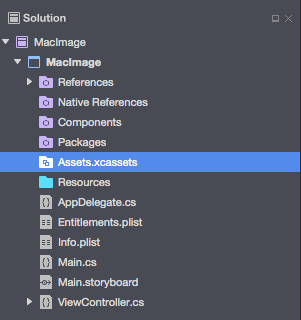
2. Right-click on the **Assets List** and select **New Image Set**: 

    [](image-images/imageset02-large.png#lightbox)
3. Select the new image set and the editor will be displayed: 

    [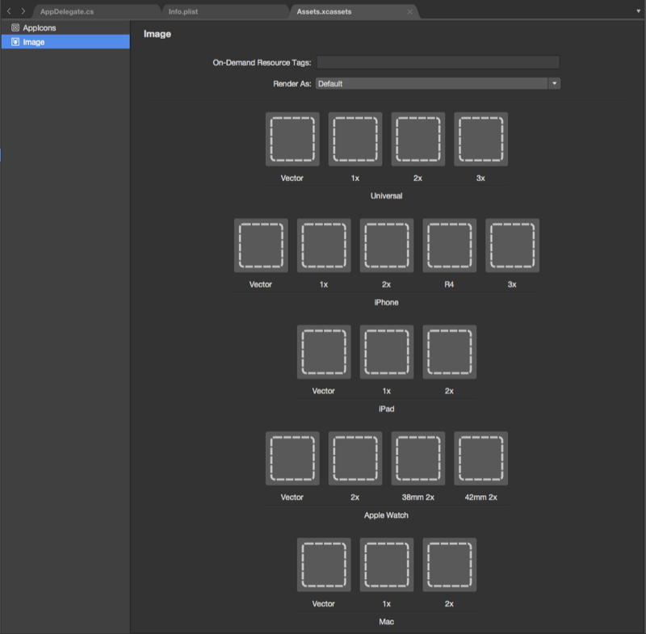](image-images/imageset03-large.png#lightbox)
4. From here we can drag in images for each of the different devices and resolutions required. 
5. Double-click the new image set's **Name** in the **Assets List** to edit it: 

    [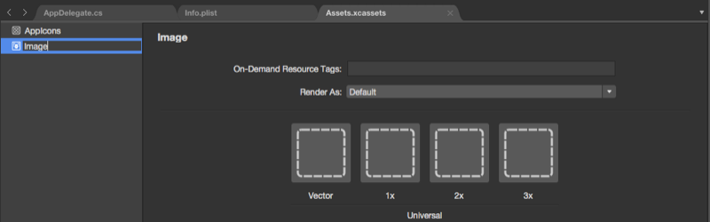](image-images/imageset04-large.png#lightbox)
    
A special **Vector** class as been added to **Image Sets** that allows us to include a _PDF_ formatted vector image in the casset instead including individual bitmap files at the different resolutions. Using this method, you supply a single vector file for the **@1x** resolution (formatted as a vector PDF file) and the **@2x** and **@3x** versions of the file will be generated at compile time and included in the application's bundle.

[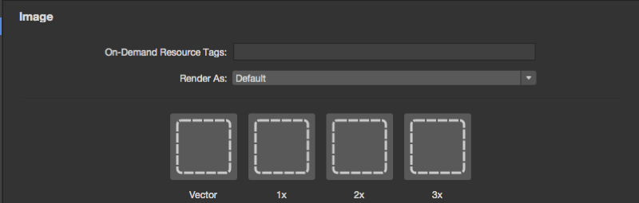](image-images/imageset05-large.png#lightbox)

For example, if you include a `MonkeyIcon.pdf` file as the vector of an Asset Catalog with a resolution of 150px x 150px, the following bitmap assets would be included in the final app bundle when it was compiled:

1. **MonkeyIcon@1x.png** - 150px x 150px resolution.
2. **MonkeyIcon@2x.png** - 300px x 300px resolution.
3. **MonkeyIcon@3x.png** - 450px x 450px resolution.

The following should be taken into consideration when using PDF vector images in Asset Catalogs:

- This is not full vector support as the PDF will be rasterized to a bitmap at compile time and the bitmaps shipped in the final application.
- You cannot adjust the size of the image once it has been set in the Asset Catalog. If you attempt to resize the image (either in code or by using Auto Layout and Size Classes) the image will be distorted just like any other bitmap.

When using an **Image Set** in Xcode's Interface Builder, you can simply select the set's name from the dropdown list in the **Attribute Inspector**:

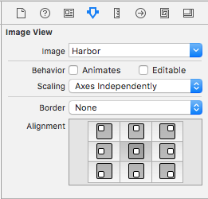

<a name="Adding-new-Assets-Collections"></a>

### Adding new assets collections

When working with images in Assets Catalogs there might be times when you want to create a new collection, instead of adding all of your images to the **Assets.xcassets** collection. For example, when designing on-demand resources.

To add a new Assets Catalog to your project:

1. Right-click on the project in the **Solution Pad** and select **Add** > **New File...**
2. Select **Mac** > **Asset Catalog**, enter a **Name** for the collection and click the **New** button: 

    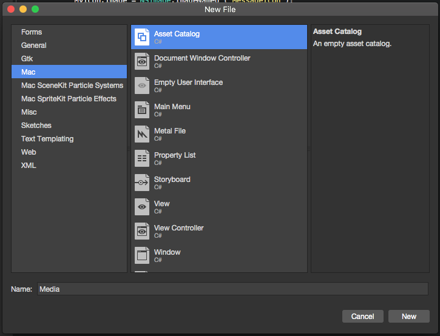

From here you can work with the collection in the same way as the default **Assets.xcassets** collection automatically included in the project.

### Adding images to resources

> [!IMPORTANT]
> This method of working with images in a macOS app has been deprecated by Apple. You should use [Asset Catalog Image Sets](#asset-catalogs) to manager your app's images instead.

Before you can use an Image file in your Xamarin.Mac application (either in C# code or from Interface Builder) it needs to be included in the project's **Resources** folder as a **Bundle Resource**. To add a file to a project, do the following:

1. Right-click on the **Resources** folder in your project in the **Solution Pad** and select **Add** > **Add Files...**: 

    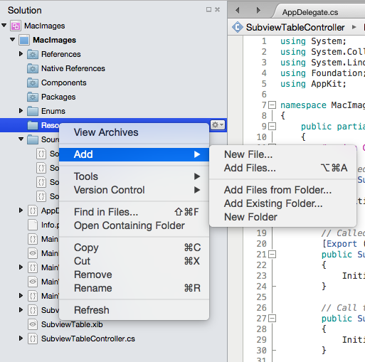
2. From the **Add Files** dialog box, select the images files to add to the project, select `BundleResource` for the **Override build action** and click the **Open** button:

    [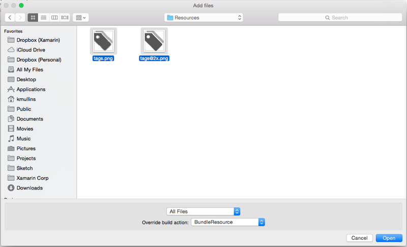](image-images/add02-large.png#lightbox)
3. If the files are not already in the **Resources** folder, you'll be asked if you want to **Copy**, **Move** or **Link** the files. Pick which every suits your needs, typically that will be **Copy**:

    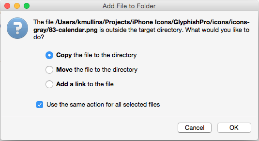
4. The new files will be included in the project and read for use: 

    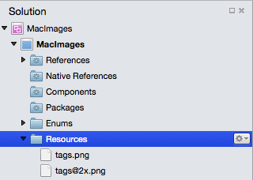
5. Repeat the process for any image files required.

You can use any png, jpg, or pdf file as a source image in your Xamarin.Mac application. In the next section, we'll look at adding High Resolution versions of our Images and Icons to support Retina based Macs.

> [!IMPORTANT]
> If you are adding Images to the **Resources** folder, you can leave the **Override build action** set to **Default**. The default Build Action for this folder is `BundleResource`.

## Provide high-resolution versions of all app graphics resources

Any graphic asset that you add to a Xamarin.Mac application (icons, custom controls, custom cursors, custom artwork, etc.) need to have high-resolution versions in addition to their standard-resolution versions. This is required so that your application will look its best when run on a Retina Display equipped Mac computer.

### Adopt the @2x naming convention

> [!IMPORTANT]
> This method of working with images in a macOS app has been deprecated by Apple. You should use [Asset Catalog Image Sets](#asset-catalogs) to manager your app's images instead.

When you create the standard and high-resolution versions of an image, follow this naming convention for the image pair when including them in your Xamarin.Mac project:

- **Standard-Resolution**  - **ImageName.filename-extension** (Example: **tags.png**)
- **High-Resolution**  - **ImageName@2x.filename-extension** (Example: **tags@2x.png**)

When added to a project, they would appear as follows:


When an image is assigned to a UI element in Interface Builder you'll simply pick the file in the _ImageName_**.**_filename-extension_ format (Example: **tags.png**). The same for using an image in C# code, you'll pick the file in the _ImageName_**.**_filename-extension_ format.

When you Xamarin.Mac application is run on a Mac, the _ImageName_**.**_filename-extension_ format image will be used on Standard Resolution Displays, the **ImageName@2x.filename-extension** image will automatically be picked on Retina Display bases Macs.

## Using images in Interface Builder

Any image resource the you have added to the **Resources** folder in your Xamarin.Mac project and have set the build action to **BundleResource** will automatically show up in Interface Builder and can be selected as part of a UI element (if it handles images).

To use an image in interface builder, do the following:

1. Add an image to the **Resources** folder with a **Build Action** of `BundleResource`: 

     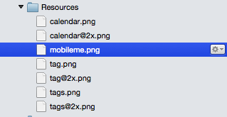
2. Double-click the **Main.storyboard** file to open it for editing in Interface Builder: 

     [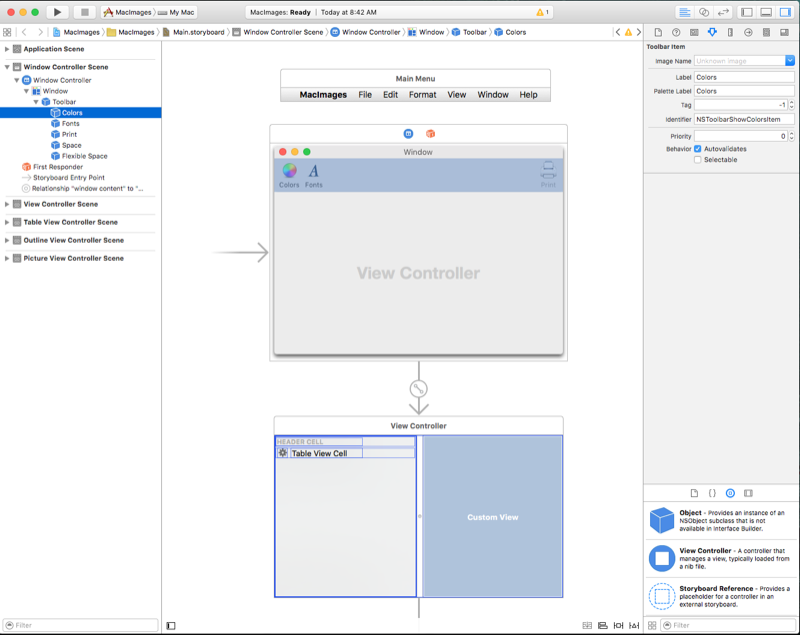](image-images/ib01-large.png#lightbox)
3. Drag a UI element that takes images onto the design surface (for example, a **Image Toolbar Item**): 

     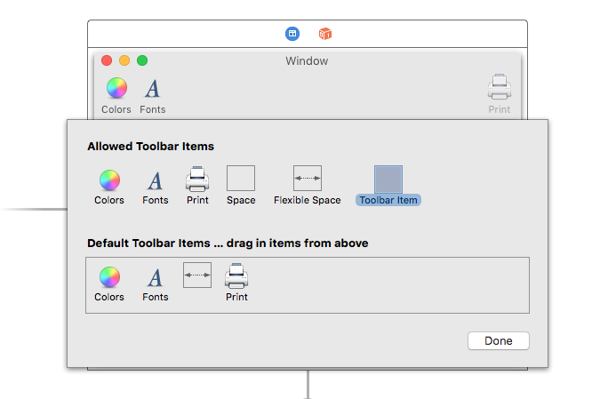
4. Select the Image that you added to the **Resources** folder in the **Image Name** dropdown: 

     [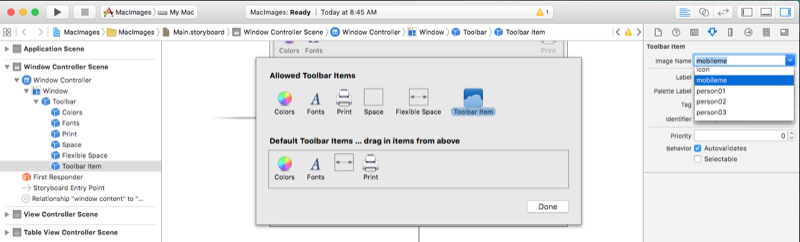](image-images/ib03-large.png#lightbox)
5. The selected image will be displayed in the design surface: 

     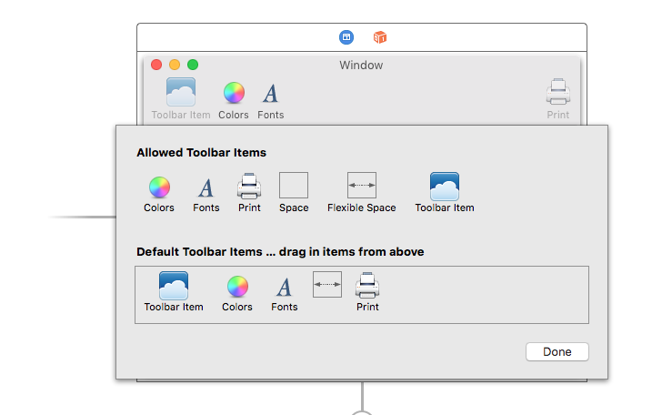
6. Save your changes and return to Visual Studio for Mac to sync with Xcode.

The above steps work for any UI element that allows their image property to be set in the **Attribute Inspector**. Again, if you have included a **@2x** version of your image file, it will automatically be used on Retina Display based Macs.

> [!IMPORTANT]
> If the Image isn't available in the **Image Name** dropdown, close your .storyboard project in Xcode and reopen it from Visual Studio for Mac. If the image still isn't available, ensure that its **Build Action** is `BundleResource` and that the image has been added to the **Resources** folder.

## Using images in C# code

When loading an image into memory using C# code in your Xamarin.Mac application, the image will be stored in a `NSImage` object. If the image file has been included in the Xamarin.Mac application bundle (included in resources), use the following code to load the image:

```csharp
NSImage image = NSImage.ImageNamed("tags.png");
```

The above code uses the static `ImageNamed("...")` method of the `NSImage` class to load the given image into memory from the **Resources** folder, if the image cannot be found, `null` will be returned. Like Images assigned in Interface Builder, if you have included a **@2x** version of your image file, it will automatically be used on Retina Display based Macs.

To load images outside of the application's bundle (from the Mac file system), use the following code:

```csharp
NSImage image = new NSImage("/Users/KMullins/Documents/photo.jpg")
```

<a name="Working-with-Template-Images"></a>

## Working with template images

Based on the design of your macOS app, there might be times when you need to customize an icon or image inside of the User Interface to match a change in color scheme (for example, based on user preferences).

To achieve this effect, switch the _Render Mode_ of your Image Asset to **Template Image**:

[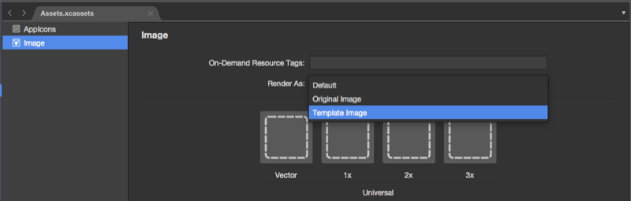](image-images/templateimage01-large.png#lightbox)

From the Xcode's Interface Builder, assign the Image Asset to a UI control:

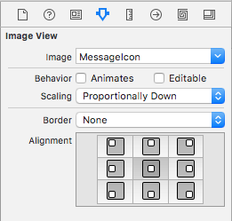

Or optionally set the image source in code:

```csharp
MyIcon.Image = NSImage.ImageNamed ("MessageIcon");
```

Add the following public function to your View Controller:

```csharp
public NSImage ImageTintedWithColor(NSImage sourceImage, NSColor tintColor)
    => NSImage.ImageWithSize(sourceImage.Size, false, rect => {
        // Draw the original source image
        sourceImage.DrawInRect(rect, CGRect.Empty, NSCompositingOperation.SourceOver, 1f);

        // Apply tint
        tintColor.Set();
        NSGraphics.RectFill(rect, NSCompositingOperation.SourceAtop);

        return true;
    });
```

> [!IMPORTANT]
> Particularly with the advent of Dark Mode in macOS Mojave, it is important to avoid the `LockFocus` API when reating custom-rendered `NSImage` objects. Such images become static and will not be automatically updated to account for appearance or display density changes.
>
> By employing the handler-based mechanism above, re-rendering for dynamic conditions will happen automatically when the `NSImage` is hosted, for example, in an `NSImageView`.

Finally, to tint a Template Image, call this function against the image to colorize:

```csharp
MyIcon.Image = ImageTintedWithColor (MyIcon.Image, NSColor.Red);
```

<a name="Using_Images_with_Table_Views"></a>

## Using images with table views

To include an image as part of the cell in a `NSTableView`, you'll need to change how the data is returned by the Table View's `NSTableViewDelegate's` `GetViewForItem` method to use a `NSTableCellView` instead of the typical `NSTextField`. For example:

```csharp
public override NSView GetViewForItem (NSTableView tableView, NSTableColumn tableColumn, nint row)
{

    // This pattern allows you reuse existing views when they are no-longer in use.
    // If the returned view is null, you instance up a new view
    // If a non-null view is returned, you modify it enough to reflect the new data
    NSTableCellView view = (NSTableCellView)tableView.MakeView (tableColumn.Title, this);
    if (view == null) {
        view = new NSTableCellView ();
        if (tableColumn.Title == "Product") {
            view.ImageView = new NSImageView (new CGRect (0, 0, 16, 16));
            view.AddSubview (view.ImageView);
            view.TextField = new NSTextField (new CGRect (20, 0, 400, 16));
        } else {
            view.TextField = new NSTextField (new CGRect (0, 0, 400, 16));
        }
        view.TextField.AutoresizingMask = NSViewResizingMask.WidthSizable;
        view.AddSubview (view.TextField);
        view.Identifier = tableColumn.Title;
        view.TextField.BackgroundColor = NSColor.Clear;
        view.TextField.Bordered = false;
        view.TextField.Selectable = false;
        view.TextField.Editable = true;

        view.TextField.EditingEnded += (sender, e) => {

            // Take action based on type
            switch(view.Identifier) {
            case "Product":
                DataSource.Products [(int)view.TextField.Tag].Title = view.TextField.StringValue;
                break;
            case "Details":
                DataSource.Products [(int)view.TextField.Tag].Description = view.TextField.StringValue;
                break; 
            }
        };
    }

    // Tag view
    view.TextField.Tag = row;

    // Setup view based on the column selected
    switch (tableColumn.Title) {
    case "Product":
        view.ImageView.Image = NSImage.ImageNamed ("tags.png");
        view.TextField.StringValue = DataSource.Products [(int)row].Title;
        break;
    case "Details":
        view.TextField.StringValue = DataSource.Products [(int)row].Description;
        break;
    }

    return view;
}
```

There are a few lines of interest here. First, for columns that we want to include an image, we create a new `NSImageView` of the required size and location, we also create a new `NSTextField` and place its default position based on whether or not we are using an image:

```csharp
if (tableColumn.Title == "Product") {
    view.ImageView = new NSImageView (new CGRect (0, 0, 16, 16));
    view.AddSubview (view.ImageView);
    view.TextField = new NSTextField (new CGRect (20, 0, 400, 16));
} else {
    view.TextField = new NSTextField (new CGRect (0, 0, 400, 16));
}
```

Secondly, we need to include the new Image View and Text Field in the parent `NSTableCellView`:

```csharp
view.AddSubview (view.ImageView);
...

view.AddSubview (view.TextField);
...

```

Lastly, we need to tell the Text Field that it can shrink and grow with the Table View Cell:

```csharp
view.TextField.AutoresizingMask = NSViewResizingMask.WidthSizable;
```

Example output:

[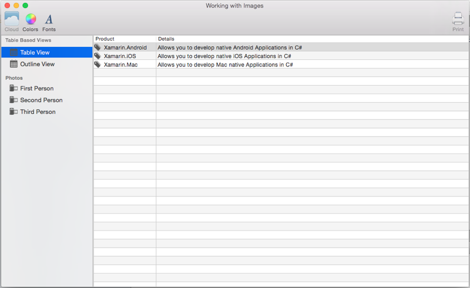](image-images/tables01-large.png#lightbox)

For more information on working with Table Views, please see our [Table Views](~/mac/user-interface/table-view.md) documentation.

<a name="Using_Images_with_Outline_Views"></a>

## Using images with outline views

To include an image as part of the cell in a `NSOutlineView`, you'll need to change how the data is returned by the Outline View's `NSTableViewDelegate's` `GetView` method to use a `NSTableCellView` instead of the typical `NSTextField`. For example:

```csharp
public override NSView GetView (NSOutlineView outlineView, NSTableColumn tableColumn, NSObject item) {
    // Cast item
    var product = item as Product;

    // This pattern allows you reuse existing views when they are no-longer in use.
    // If the returned view is null, you instance up a new view
    // If a non-null view is returned, you modify it enough to reflect the new data
    NSTableCellView view = (NSTableCellView)outlineView.MakeView (tableColumn.Title, this);
    if (view == null) {
        view = new NSTableCellView ();
        if (tableColumn.Title == "Product") {
            view.ImageView = new NSImageView (new CGRect (0, 0, 16, 16));
            view.AddSubview (view.ImageView);
            view.TextField = new NSTextField (new CGRect (20, 0, 400, 16));
        } else {
            view.TextField = new NSTextField (new CGRect (0, 0, 400, 16));
        }
        view.TextField.AutoresizingMask = NSViewResizingMask.WidthSizable;
        view.AddSubview (view.TextField);
        view.Identifier = tableColumn.Title;
        view.TextField.BackgroundColor = NSColor.Clear;
        view.TextField.Bordered = false;
        view.TextField.Selectable = false;
        view.TextField.Editable = !product.IsProductGroup;
    }

    // Tag view
    view.TextField.Tag = outlineView.RowForItem (item);

    // Allow for edit
    view.TextField.EditingEnded += (sender, e) => {

        // Grab product
        var prod = outlineView.ItemAtRow(view.Tag) as Product;

        // Take action based on type
        switch(view.Identifier) {
        case "Product":
            prod.Title = view.TextField.StringValue;
            break;
        case "Details":
            prod.Description = view.TextField.StringValue;
            break; 
        }
    };

    // Setup view based on the column selected
    switch (tableColumn.Title) {
    case "Product":
        view.ImageView.Image = NSImage.ImageNamed (product.IsProductGroup ? "tags.png" : "tag.png");
        view.TextField.StringValue = product.Title;
        break;
    case "Details":
        view.TextField.StringValue = product.Description;
        break;
    }

    return view;
}
```

There are a few lines of interest here. First, for columns that we want to include an image, we create a new `NSImageView` of the required size and location, we also create a new `NSTextField` and place its default position based on whether or not we are using an image:

```csharp
if (tableColumn.Title == "Product") {
    view.ImageView = new NSImageView (new CGRect (0, 0, 16, 16));
    view.AddSubview (view.ImageView);
    view.TextField = new NSTextField (new CGRect (20, 0, 400, 16));
} else {
    view.TextField = new NSTextField (new CGRect (0, 0, 400, 16));
}
```

Secondly, we need to include the new Image View and Text Field in the parent `NSTableCellView`:

```csharp
view.AddSubview (view.ImageView);
...

view.AddSubview (view.TextField);
...

```

Lastly, we need to tell the Text Field that it can shrink and grow with the Table View Cell:

```csharp
view.TextField.AutoresizingMask = NSViewResizingMask.WidthSizable;
```

Example output:

[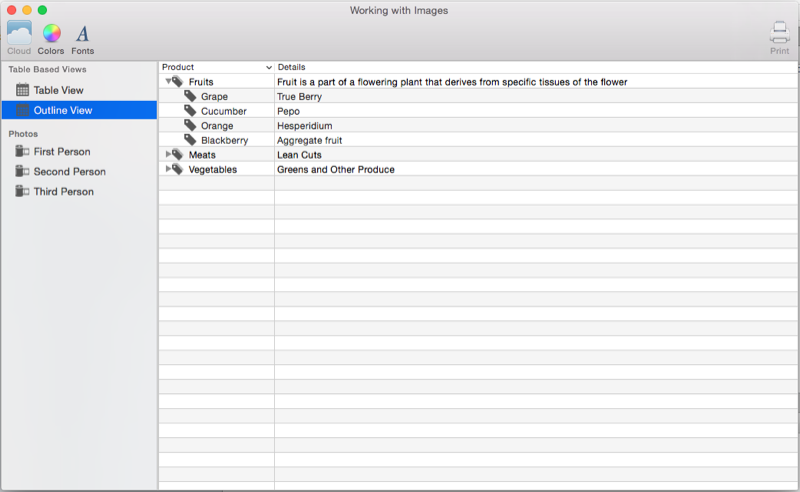](image-images/outline01-large.png#lightbox)

For more information on working with Outline Views, please see our [Outline Views](~/mac/user-interface/outline-view.md) documentation.

## Summary

This article has taken a detailed look at working with Images and Icons in a Xamarin.Mac application. We saw the different types and uses of Images, how to use Images and Icons in Xcode's Interface Builder and how to work with Images and Icons in C# code.

## Related Links

- [MacImages (sample)](/samples/xamarin/mac-samples/macimages)
- [Hello, Mac](~/mac/get-started/hello-mac.md)
- [Table views](~/mac/user-interface/table-view.md)
- [Outline views](~/mac/user-interface/outline-view.md)
- [macOS X Human Interface Guidelines](https://developer.apple.com/design/human-interface-guidelines/designing-for-macos)
- [About High Resolution for OS X](https://developer.apple.com/library/content/documentation/GraphicsAnimation/Conceptual/HighResolutionOSX/Introduction/Introduction.html)