# Sandboxing a Xamarin.Mac app

_This article covers sandboxing a Xamarin.Mac application for release on the App Store. It covers all of the elements that go into sandboxing, such as container directories, entitlements, user-determined permissions, privilege separation, and kernel enforcement._

## Overview

When working with C# and .NET in a Xamarin.Mac application, you have the same ability to sandbox an application as you do when working with Objective-C or Swift.

[](sandboxing-images/intro01-large.png#lightbox)

In this article, we'll cover the basics of working with sandboxing in a Xamarin.Mac application and all of the elements that go into sandboxing: container directories, entitlements, user-determined permissions, privilege separation, and kernel enforcement. It is highly suggested that you work through the [Hello, Mac](~/mac/get-started/hello-mac.md) article first, specifically the [Introduction to Xcode and Interface Builder](~/mac/get-started/hello-mac.md#introduction-to-xcode-and-interface-builder) and [Outlets and Actions](~/mac/get-started/hello-mac.md#outlets-and-actions) sections, as it covers key concepts and techniques that we'll be using in this article.

You may want to take a look at the [Exposing C# classes / methods to Objective-C](~/mac/internals/how-it-works.md) section of the [Xamarin.Mac Internals](~/mac/internals/how-it-works.md) document as well, it explains the `Register` and `Export` attributes used to wire up your C# classes to Objective-C objects and UI elements.

## About the App Sandbox

The App Sandbox provides strong defense against damage that can be caused by a malicious application being run on a Mac by limiting the access that an application has to system resources.

A non-sandboxed application has the full rights of the user that is running the app and can access or do anything that the user can. If the app contains security holes (or any framework that it's using), a hacker can potentially exploit those weaknesses and use the app to take control of the Mac that it is running on.

By limiting access to resources on a per-application basis, a sandboxed app provides a line of defense against theft, corruption or malicious intent on the part of an application running on the user's machine.

The App Sandbox is an access control technology built into macOS (enforced at the kernel level) that provides a twofold strategy:

1. The App Sandbox enables the developer to describe _how_ an application will interact with the OS and, in this way, it is granted only the access rights that are required to get the job done, and no more.
2. The App Sandbox allows the user to seamlessly grant further access to the system via the Open and Save dialog boxes, drag and drop operations and other, common user interactions.

### Preparing to implement the App Sandbox

The elements of the App Sandbox that will be discussed in detail in the article are as follows:

- Container Directories
- Entitlements
- User-Determined Permissions
- Privilege Separation
- Kernel Enforcement

After you understand these details, you'll be able to create a plan for adopting the App Sandbox in your Xamarin.Mac application.

First, you will need to determine if your application is a good candidate for sandboxing (most applications are). Next, you will need to resolve any API incompatibilities and determine which elements of the App Sandbox you will require. Finally, look into using Privilege Separation to maximize you application's defense level.

When adopting the App Sandbox, some file system locations that your application uses will be different. Particularly, your application will have a Container Directory that will be used for application support files, databases, caches and any other files that are not user documents. Both macOS and Xcode provide support to migrate these type of files from their legacy locations to the container.

## Sandboxing quick start

In this section, we'll create a simple Xamarin.Mac app that uses a Web View (which requires a network connection that is restricted under sandboxing unless specifically requested) as an example of getting started with the App Sandbox.

We'll verify that the application is actually sandboxed and learn how to troubleshoot and resolve common App Sandbox errors.

### Creating the Xamarin.Mac project

Let's do the following to create our sample project:

1. Start Visual Studio for Mac and click the **New Solution..** link.
2. From the **New Project** dialog box, select **Mac** > **App** > **Cocoa App**:

    [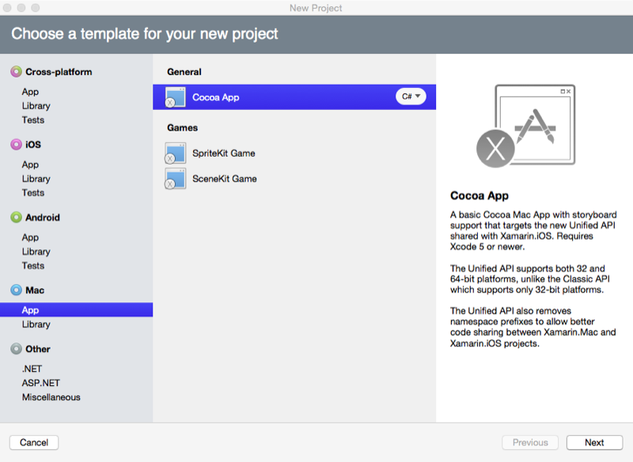](sandboxing-images/sample01-large.png#lightbox)
3. Click the **Next** button, enter `MacSandbox` for the project name and click the **Create** button:

    [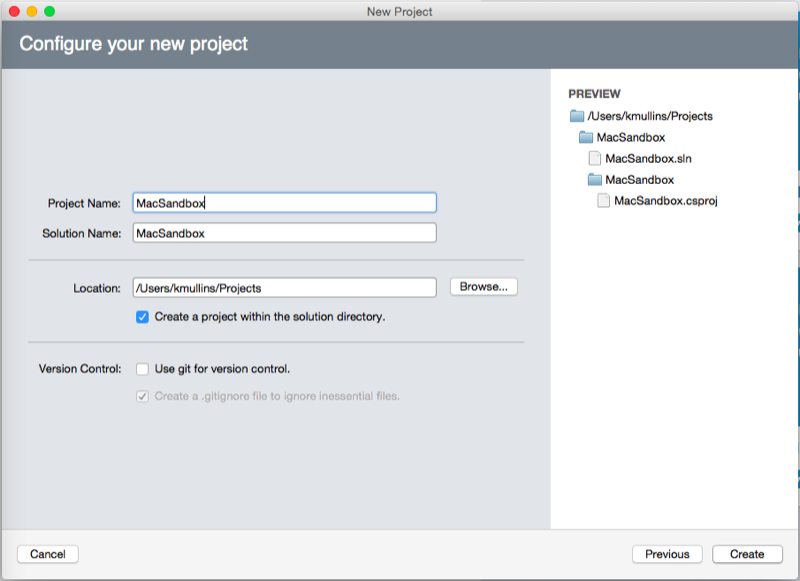](sandboxing-images/sample02-large.png#lightbox)
4. In the **Solution Pad**, double-click the **Main.storyboard** file to open it for editing in Xcode:

    [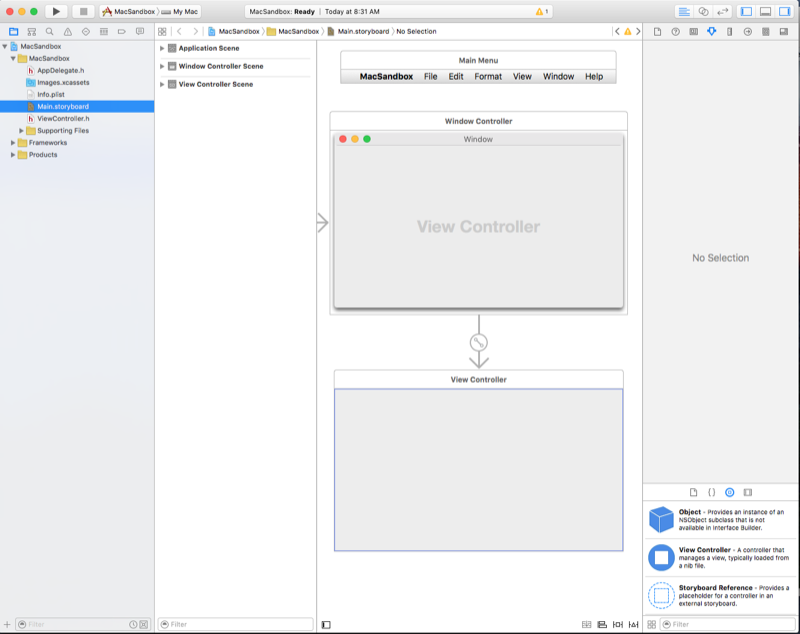](sandboxing-images/sample03-large.png#lightbox)
5. Drag a **Web View** onto the Window, size it to fill the content area and set it to grow and shrink with the window:

    [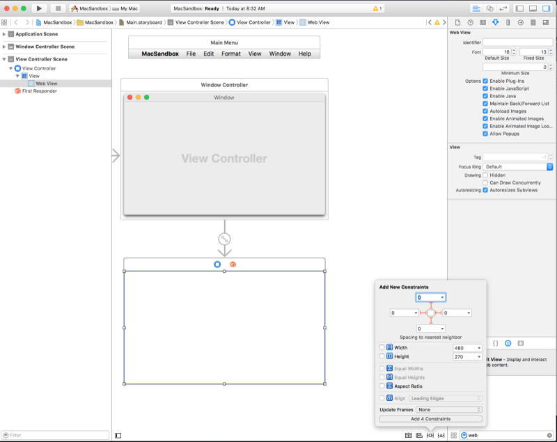](sandboxing-images/sample04-large.png#lightbox)
6. Create an outlet for the web view called `webView`:

    [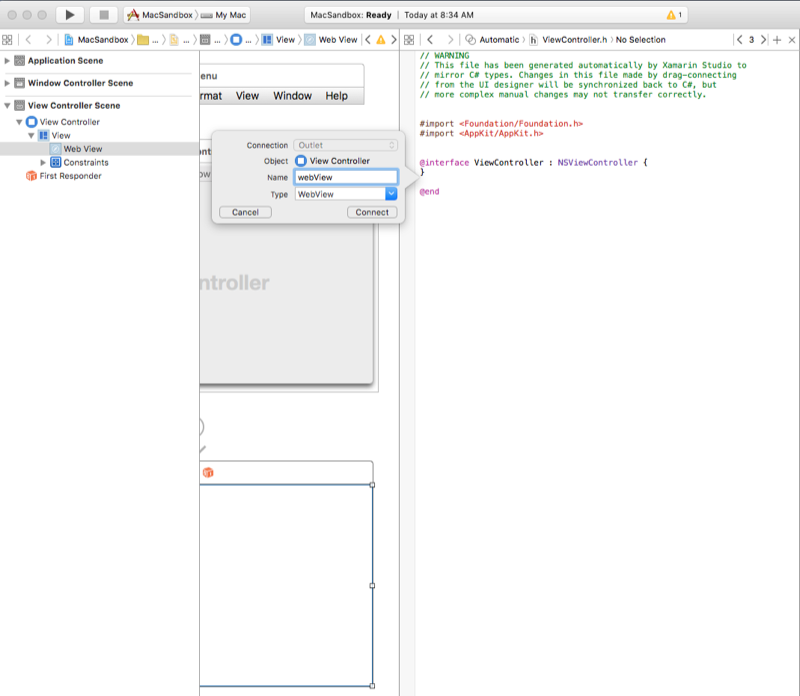](sandboxing-images/sample05-large.png#lightbox)
7. Return to Visual Studio for Mac and double-click the **ViewController.cs** file in the **Solution Pad** to open it for editing.
8. Add the following using statement: `using WebKit;`
9. Make the `ViewDidLoad` method look like the following:

    ```csharp
    public override void AwakeFromNib ()
    {
        base.AwakeFromNib ();
        webView.MainFrame.LoadRequest(new NSUrlRequest(new NSUrl("http://www.apple.com")));
    }
    ```

10. Save your changes.

Run you application and ensure that the Apple Website is displayed in the window as follows:

[](sandboxing-images/sample06-large.png#lightbox)

<a name="Signing_and_Provisioning_the_App"></a>

### Signing and provisioning the app

Before we can enable the App Sandbox, we first need to provision and sign our Xamarin.Mac application.

Let do the following:

1. Log into the Apple Developer Portal:

    [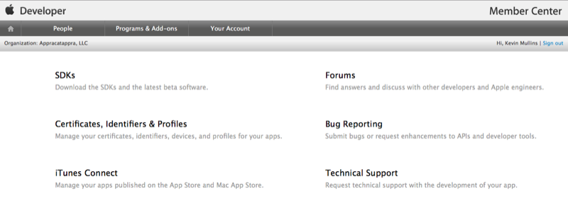](sandboxing-images/sign01-large.png#lightbox)
2. Select **Certificates, Identifiers & Profiles**:

    [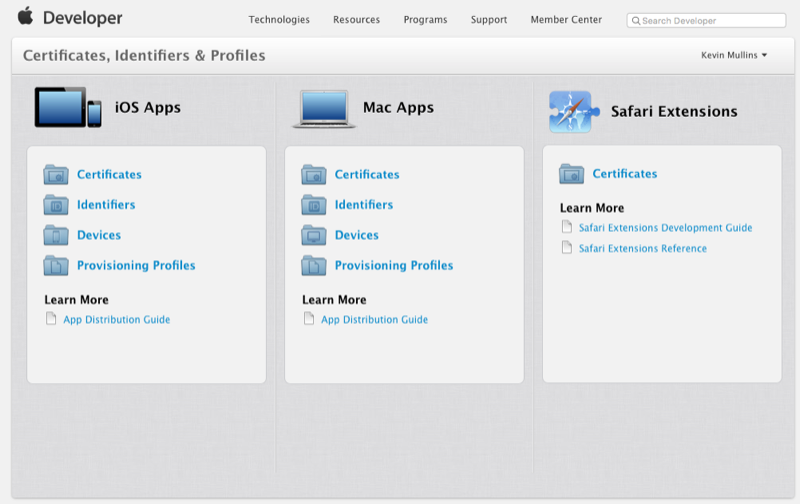](sandboxing-images/sign02-large.png#lightbox)
3. Under **Mac Apps**, select **Identifiers**:

    [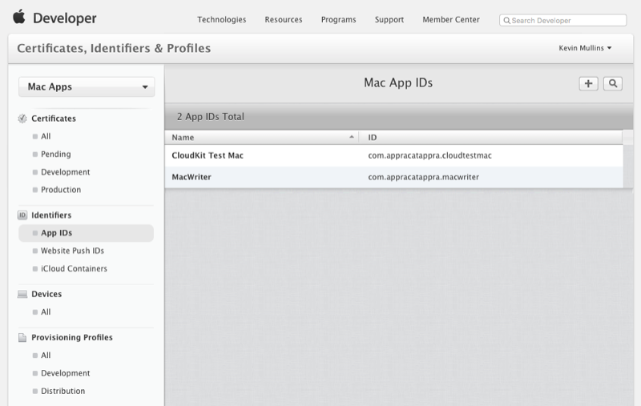](sandboxing-images/sign03-large.png#lightbox)
4. Create a new ID for the application:

    [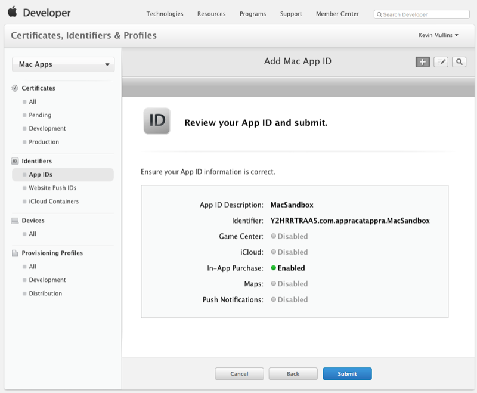](sandboxing-images/sign04-large.png#lightbox)
5. Under **Provisioning Profiles**, select **Development**:

    [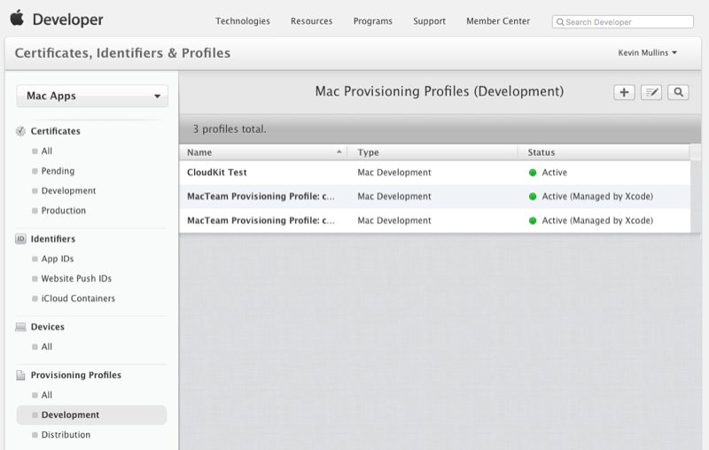](sandboxing-images/sign05-large.png#lightbox)
6. Create a new profile and select **Mac App Development**:

    [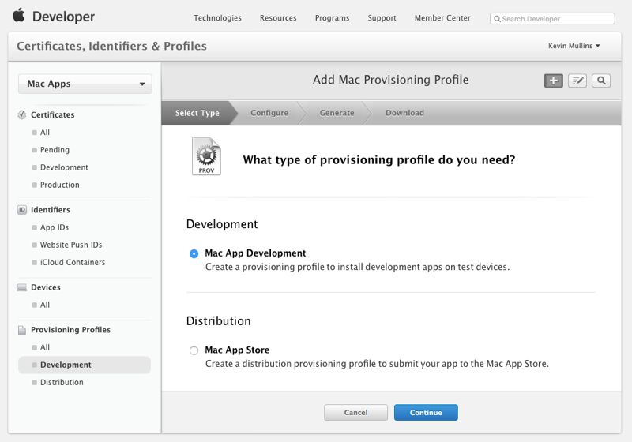](sandboxing-images/sign06-large.png#lightbox)
7. Select the App ID we created above:

    [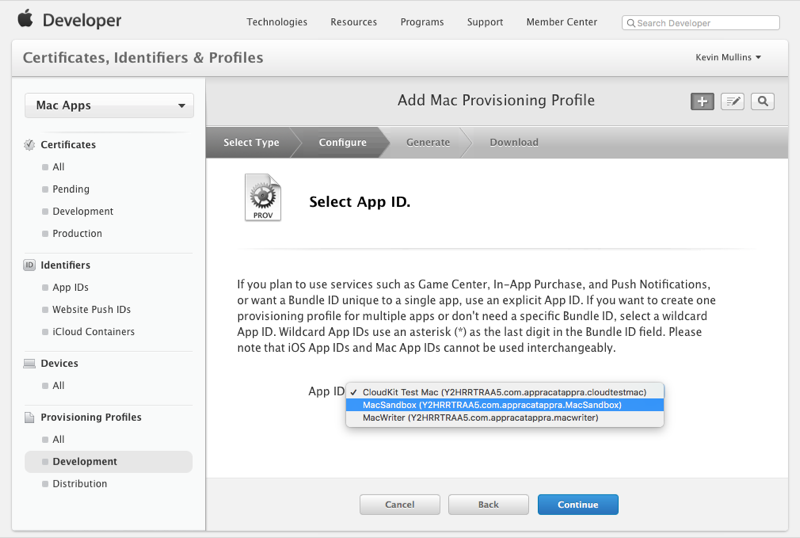](sandboxing-images/sign07-large.png#lightbox)
8. Select the Developers for this profile:

    [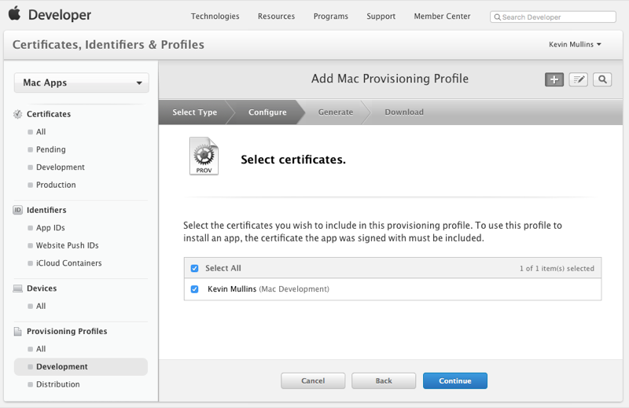](sandboxing-images/sign08-large.png#lightbox)
9. Select the computers for this profile:

    [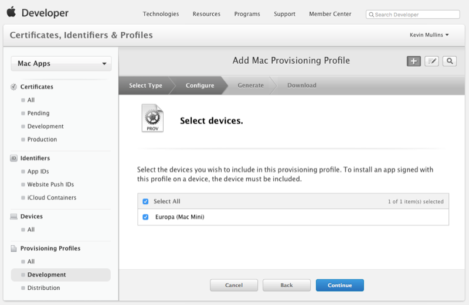](sandboxing-images/sign09-large.png#lightbox)
10. Give the profile a Name:

    [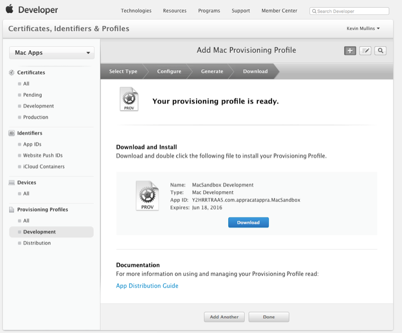](sandboxing-images/sign10-large.png#lightbox)
11. Click the **Done** button.

> [!IMPORTANT]
> In some instances you might need to download the new Provisioning Profile from Apple's Developer Portal directly and double-click it to install. You might also need to stop and restart Visual Studio for Mac before it will be able to access the new profile.

Next, we need to load the new App ID and Profile on the development machine. Let's do the following:

1. Start Xcode and select **Preferences** from the **Xcode** menu:

    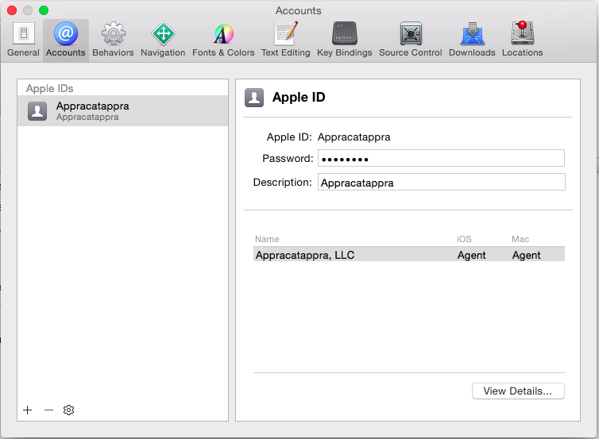
2. Click on the **View Details...** button:

    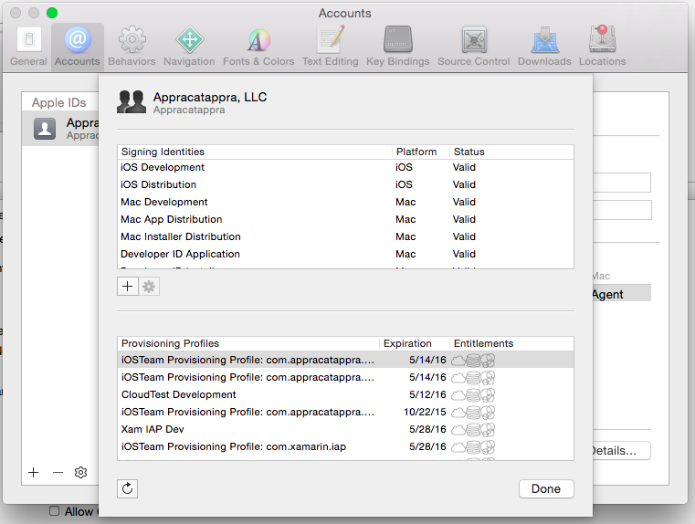
3. Click on the **Refresh** button (in the lower left hand corner).
4. Click on the **Done** button.

Next, we need to select the new App ID and Provisioning Profile in our Xamarin.Mac project. Let's do the following:

1. In the **Solution Pad**, double-click the **Info.plist** file to open it for editing.
2. Ensure that the **Bundle Identifier** matches our App ID we created above (example: `com.appracatappra.MacSandbox`):

    [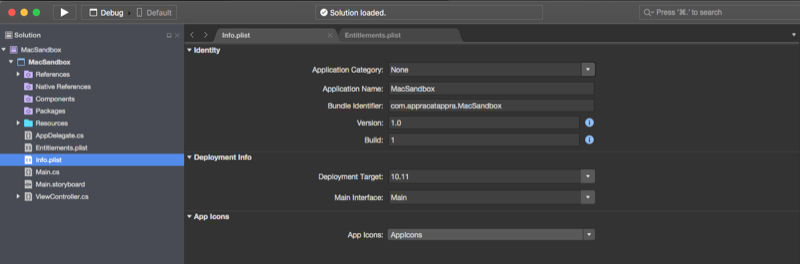](sandboxing-images/sign13-large.png#lightbox)
3. Next, double-click the **Entitlements.plist** file and ensure our **iCloud Key-Value Store** and the **iCloud Containers** all match our App ID we created above (example: `com.appracatappra.MacSandbox`):

    [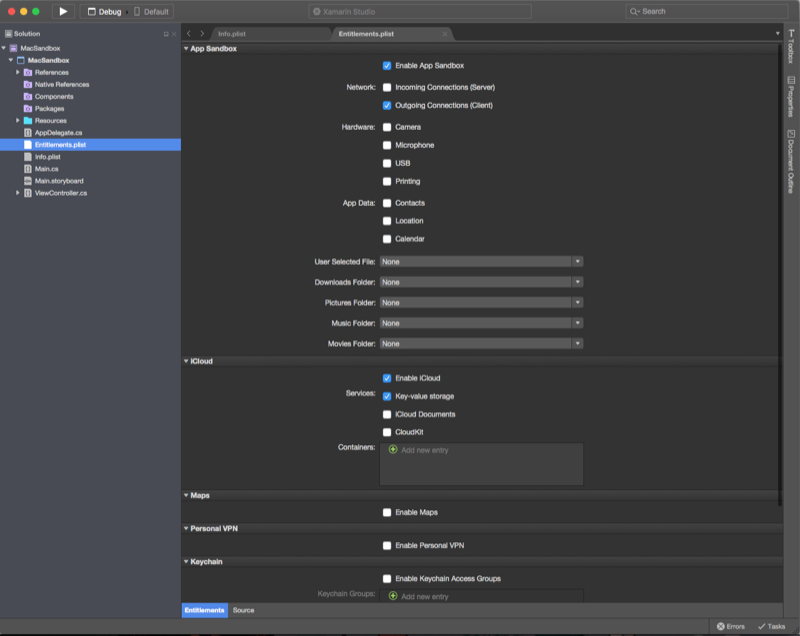](sandboxing-images/sign17-large.png#lightbox)
4. Save your changes.
5. In the **Solution Pad**, double-click the project file to open its Options for editing:

    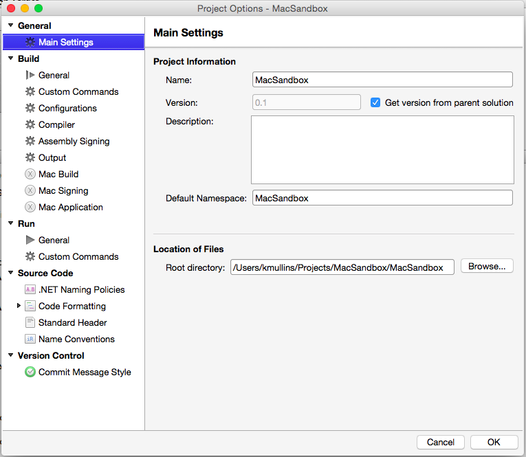
6. Select **Mac Signing**, then check **Sign the application bundle** and **Sign the installer package**. Under **Provisioning profile**, select the one we created above:

    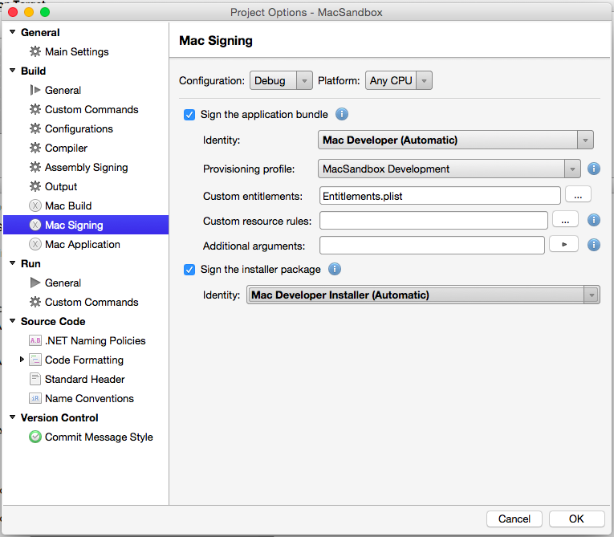
7. Click the **Done** button.

> [!IMPORTANT]
> You might have to quit and restart Visual Studio for Mac to get it to recognize the new App ID and Provisioning Profile that was installed by Xcode.

#### Troubleshooting provisioning issues

At this point you should try to run the application and make sure that everything is signed and provisioned correctly. If the app still runs as before, everything is good. In the event of a failure, you might get a dialog box like the following one:

[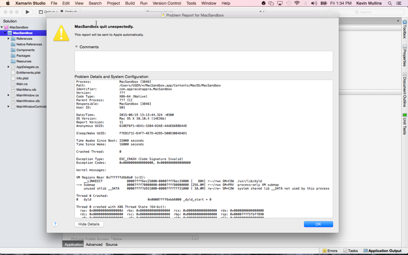](sandboxing-images/sign16-large.png#lightbox)

Here are the most common causes of provisioning and signing issues:

- The App Bundle ID doesn't match the App ID of the selected profile.
- The Developer ID doesn't match the Developer ID of the selected profile.
- The UUID of the Mac being tested on isn't registered as part of the selected profile.

In the case of an issue, correct the problem on the Apple Developer Portal, refresh the profiles in Xcode and do a clean build in Visual Studio for Mac.

### Enable the App Sandbox

You enable the App Sandbox by selecting a checkbox in your projects options. Do the following:

1. In the **Solution Pad**, double-click the **Entitlements.plist** file to open it for editing.
2. Check both **Enable Entitlements** and **Enable App Sandboxing**:

    [](sandboxing-images/sign17-large.png#lightbox)
3. Save your changes.

At this point, you have enabled the App Sandbox but you have not provided the required network access for the Web View. If you run the application now, you should get a blank window:

[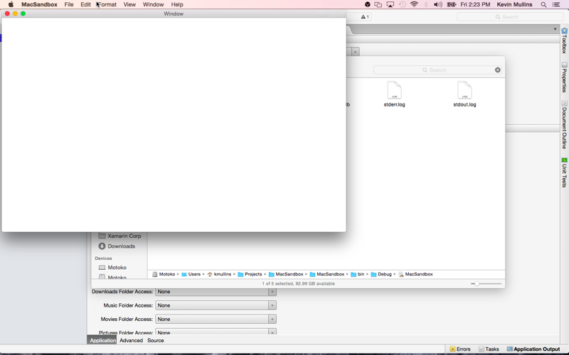](sandboxing-images/sample08-large.png#lightbox)

### Verifying that the app is sandboxed

Aside from the resource blocking behavior, there are three main ways to tell if a Xamarin.Mac application has been successfully sandboxed:

1. In Finder, check the contents of the `~/Library/Containers/` folder - If the app is sandboxed, there will be a folder named like your app's Bundle Identifier (example: `com.appracatappra.MacSandbox`):

    [](sandboxing-images/sample09-large.png#lightbox)
2. The system sees the app as sandboxed in the Activity Monitor:
    - Launch Activity Monitor (under `/Applications/Utilities`).
    - Choose **View** > **Columns** and ensure that the **Sandbox** menu item is checked.
    - Ensure that the Sandbox column reads `Yes` for your application:

    [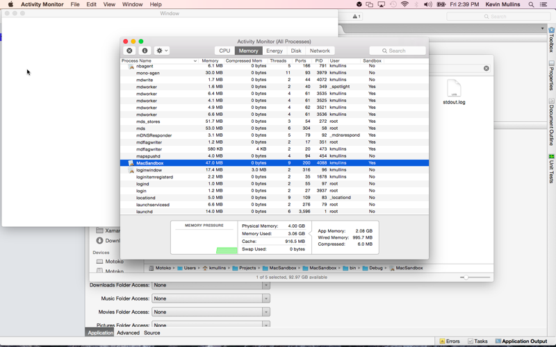](sandboxing-images/sample10-large.png#lightbox)
3. Check that the app binary is sandboxed:
    - Start the Terminal app.
    - Navigate to the applications `bin` directory.
    - Issue this command: `codesign -dvvv --entitlements :- executable_path` (where `executable_path` is the path to your application):

    [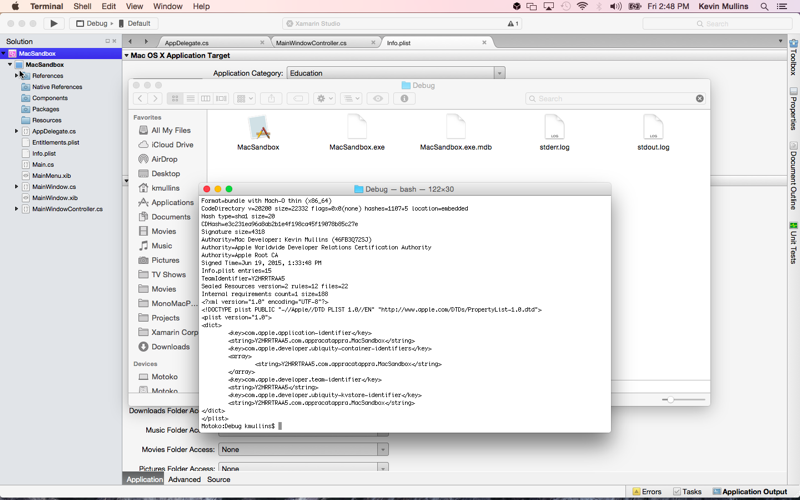](sandboxing-images/sample11-large.png#lightbox)

### Debugging a sandboxed app

The debugger connects to Xamarin.Mac apps through TCP, which means that by default when you enable sandboxing, it is unable to connect to the app, so if you try to run the app without the proper permissions enabled, you get an error *“Unable to connect to the debugger”*.

[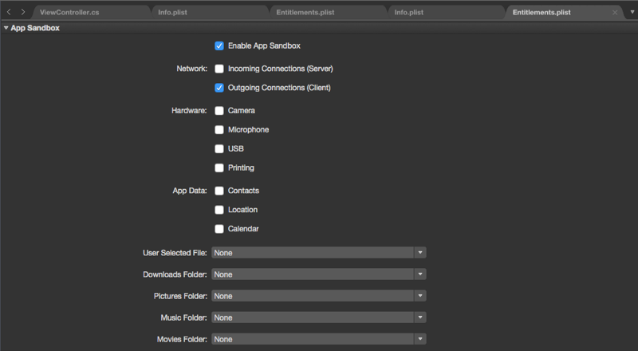](sandboxing-images/debug01-large.png#lightbox)

The **Allow Outgoing Network Connections (Client)** permission is the one required for the debugger, enabling this one will allow debugging normally. Since you can’t debug without it, we have updated the `CompileEntitlements` target for `msbuild` to automatically add that permission to the entitlements for any app that is sandboxed for debug builds only. Release builds should use the entitlements specified in the entitlements file, unmodified.

### Resolving an App Sandbox violation

An App Sandbox Violation occurs if a sandboxed Xamarin.Mac application tried to access a resource that has not be explicitly allowed. For example, our Web View no longer being able to display the Apple Website.

The most common source of App Sandbox Violations occurs when the Entitlement settings specified in Visual Studio for Mac don't match the requirements of the application. Again, back to our example, the missing Network Connection entitlements that keep the Web View from working.

#### Discovering App Sandbox violations

If you suspect an App Sandbox Violation is occurring in your Xamarin.Mac application, the quickest way to discover the issue is by using the **Console** app.

Do the following:

1. Compile the app in question and run it from Visual Studio for Mac.
2. Open the **Console** application (from `/Applications/Utilties/`).
3. Select **All Messages** in the sidebar and enter `sandbox` in the search:

    [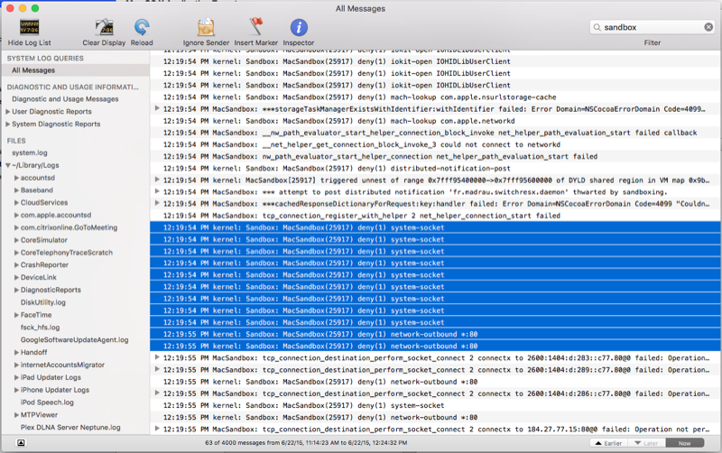](sandboxing-images/resolve01-large.png#lightbox)

For our example app above, you can see that the Kernal is blocking the `network-outbound` traffic because of the App Sandbox, since we have not requested that right.

#### Fixing App Sandbox violations with entitlements

Now that we have seen how to find App Sandboxing Violations, let's see how they can be solved by adjusting our application's Entitlements.

Do the following:

1. In the **Solution Pad**, double-click the **Entitlements.plist** file to open it for editing.
2. Under the **Entitlements** section, check the **Allow Outgoing Network Connections (Client)** checkbox:

    [](sandboxing-images/sign17-large.png#lightbox)
3. Save the changes to the application.

If we do the above for our example app, then build and run it, the web content will now be displayed as expected.

## The App Sandbox in-depth

The access control mechanisms provided by the App Sandbox are few and easy to understand. However, way that the App Sandbox will be adopted by each app is unique and based on the requirements of the app.

Given your best effort to protect your Xamarin.Mac application from being exploited by malicious code, there need be only a single vulnerability in either the app (or one of the libraries or frameworks it consumes) to gain control of the app’s interactions with the system.

The App Sandbox was designed to prevent the takeover (or limit the damage it can cause) by allowing you to specify the application's intended interactions with the system. The system will only grant access to the resource that your application requires to get its job done and nothing more.

When designing for the App Sandbox, you are designing for a worst-case scenario. If the application does become compromised by malicious code, it is limited to accessing only the files and resources in the app’s sandbox.

### Entitlements and system resource access

As we saw above, a Xamarin.Mac application that has not been sandboxed is granted the full rights and access of the user that is running the app. If compromised by malicious code, a non-protected app can act as an agent for hostile behavior, with a wide ranging potential for doing harm.

By enabling the App Sandbox, you remove all but a minimal set of privileges, which you then re-enable on a need-only basis using your Xamarin.Mac app's entitlements.

You modify your application's App Sandbox Resources by editing its **Entitlements.plist** file and checking or selecting the rights required from the editors dropdown boxes:

[](sandboxing-images/sign17-large.png#lightbox)

### Container directories and file system access

When your Xamarin.Mac application adopts the App Sandbox, it has access to the following locations:

- **The App Container Directory** - On first run, the OS creates a special _Container Directory_ where all of its resources go, that only it can access. The app will have full read/write access to this directory.
- **App Group Container Directories** - Your app can be granted access to one or more _Group Containers_ that are shared amongst apps in the same group.
- **User-Specified Files** - Your application automatically obtains access to files that are explicitly opened or dragged and dropped onto the application by the user.
- **Related Items** - With the appropriate entitlements, your application can have access to a file with the same name but a different extension. For example, a document that has been saved as both a `.txt` file and a `.pdf`.
- **Temporary directories, command-line tool directories, and specific world-readable locations** - Your app has varying degrees of access to files in other well-defined locations as specified by the system.

#### The app container directory

A Xamarin.Mac application's App Container Directory has the following characteristics:

- It is in a hidden location in the user's Home directory (usually `~Library/Containers`) and can be accessed with the `NSHomeDirectory` function (see below) within your application. Because it is in the Home directory, each user will get their own container for the app.
- The app has unrestricted read/write access to the Container Directory and all of its sub-directories and files within it.
- Most of macOS's path-finding APIs are relative to the app's container. For example, the container will have its own **Library** (accessed via `NSLibraryDirectory`), **Application Support** and **Preferences** subdirectories.
- macOS establishes and enforces the connection between and app and its container via code signing. Even is another app tries to spoof the app by using its **Bundle Identifier**, it will not be able to access the Container because of code signing.
- The Container is not for user generated files. Instead it is for files that your application uses such as databases, caches or other specific types of data.
- For _shoebox_ types of apps (like Apple's Photo app), the user's content will go into the Container.

> [!IMPORTANT]
> Unfortunately, Xamarin.Mac does not have 100% API coverage yet (unlike Xamarin.iOS), as a result the `NSHomeDirectory` API has not been mapped in the current version of Xamarin.Mac.

As a temporary workaround, you can use the following code:

```csharp
[System.Runtime.InteropServices.DllImport("/System/Library/Frameworks/Foundation.framework/Foundation")]
public static extern IntPtr NSHomeDirectory();

public static string ContainerDirectory {
    get {
        return ((NSString)ObjCRuntime.Runtime.GetNSObject(NSHomeDirectory())).ToString ();
        }
}
```

#### The app group container directory

Starting with Mac macOS 10.7.5 (and greater), an application can use the `com.apple.security.application-groups` entitlement to access a shared container that is common to all the applications in the group. You can use this shared container for non-user facing content such as database or other types of support files (such as caches).

The Group Containers are automatically added to each app's Sandbox Container (if they are part of a group) and are stored at `~/Library/Group Containers/<application-group-id>`. The Group ID _must_ begin with your Development Team ID and a period, for example:

```plist
<team-id>.com.company.<group-name>
```

For more information, please see Apple's [Adding an Application to an Application Group](https://developer.apple.com/library/prerelease/mac/documentation/Miscellaneous/Reference/EntitlementKeyReference/Chapters/EnablingAppSandbox.html#//apple_ref/doc/uid/TP40011195-CH4-SW19) in [Entitlement Key Reference](https://developer.apple.com/library/prerelease/mac/documentation/Miscellaneous/Reference/EntitlementKeyReference/Chapters/AboutEntitlements.html#//apple_ref/doc/uid/TP40011195).

#### Powerbox and file system access outside of the app container

A sandboxed Xamarin.Mac application can access file system locations outside of its container in the following ways:

- At the specific direction of the user (via Open and Save Dialogs or other methods such as drag and drop).
- By using entitlements for specific file system locations (such as `/bin` or `/usr/lib`).
- When the file system location is in certain directories that are world readable (such as Sharing).

_Powerbox_ is the macOS security technology that interacts with the user to expand your sandboxed Xamarin.Mac app's file access rights. Powerbox has no API, but is activated transparently when the app calls a `NSOpenPanel` or `NSSavePanel`. Powerbox access is enabled via the Entitlements that you set for your Xamarin.Mac application.

When a sandboxed app displays an Open or Save dialog, the window is presented by Powerbox (and not AppKit) and therefore has access to any file or directory that the user has access to.

When a user selects a file or directory from the Open or Save dialog (or drags either onto the App's icon), Powerbox adds the associated path to the app's sandbox.

Additionally, the system automatically permits the following to a sandboxed app:

- Connection to a system input method.
- Call services selected by the user from the **Services** menu (only for services marked as _safe for sandbox apps_ by the service provider).
- Open files choose by the user from the **Open Recent** menu.
- Use Copy & Paste between other applications.
- Read files from the following world-readable locations:
  - `/bin`
  - `/sbin`
  - `/usr/bin`
  - `/usr/lib`
  - `/usr/sbin`
  - `/usr/share`
  - `/System`
- Read and write files in the directories created by `NSTemporaryDirectory`.

Be default, files opened or saved by a sandboxed Xamarin.Mac app remain accessible until the app terminates (unless the file was still open when the app quits). Open files will be automatically restored to the app's sandbox via the macOS Resume feature the next time the app is started.

To provide persistence to files located outside of a Xamarin.Mac App's container, use Security-Scoped bookmarks (see below).

#### Related items

The App Sandbox allows an app to access related items that have the same filename, but different extensions. The feature has two parts: a) a list of related extensions in the app's `Info.plst` file, b) code to tell the sandbox what the app will be doing with these files.

There are two scenarios where this makes sense:

1. The app needs to be able to save a different version of the file (with a new extension). For example, exporting a `.txt` file to a `.pdf` file. To handle this situation, you must use a `NSFileCoordinator` to access the file. You'll call the `WillMove(fromURL, toURL)` method first, move the file to the new extension and then call `ItemMoved(fromURL, toURL)`.
2. The app needs to open a main file with one extension and several supporting files with different extensions. For example, a Movie and a Subtitle file. Use an `NSFilePresenter` to gain access to the secondary file. Provide the main file to the `PrimaryPresentedItemURL` property and the secondary file to the `PresentedItemURL` property. When the main file is opened, call the `AddFilePresenter` method of the `NSFileCoordinator` class to register the secondary file.

In both scenarios, the app's **Info.plist** file must declare the Document Types that the app can open. For any file type, add the `NSIsRelatedItemType` (with a value of `YES`) to its entry in the `CFBundleDocumentTypes` array.

#### Open and save dialog behavior with sandboxed apps

The following limits are placed on the `NSOpenPanel` and `NSSavePanel` when calling them from a sandboxed Xamarin.Mac app:

- You cannot programmatically invoke the **OK** button.
- You cannot programmatically alter a user's selection in a `NSOpenSavePanelDelegate`.

Additionally, the following inheritance modifications are in place:

- **Non-Sandboxed App** - `NSOpenPanel` `NSSavePanel``NSPanel``NSWindow``NSResponder``NSObject``NSOpenPanel``NSSavePanel``NSObject``NSOpenPanel``NSSavePanel`

### Security-scoped bookmarks and persistent resource access

As stated above, a Sandboxed Xamarin.Mac application can access a file or resource outside of its container by way of direct user interaction (as provided by PowerBox). However, access to these resources does not automatically persist across app launches or system restarts.

By using _Security-Scoped Bookmarks_, a Sandboxed Xamarin.Mac application can preserve user intent and maintain access to given resources after an app restart.

#### Security-scoped bookmark types

When working with Security-Scoped Bookmarks and Persistent Resource Access, there are two sistine use cases:

- **An App-Scoped Bookmark provides persistent access to a user-specified file or folder.**

    For example, if the sandboxed Xamarin.Mac application allows to use to open an external document for editing (using a `NSOpenPanel`), the app can create an App-Scoped Bookmark so that it can access the same file again in the future.
- **A Document-Scoped Bookmark provides a specific document persistent access to a sub-file.**

For example, a video editing app that creates a project file that has access to the individual images, video clips and sound files that will later be combined into a single movie.

When the user imports a resource file into the project (via a `NSOpenPanel`), the app creates a Document-Scoped Bookmark for the item that is stored in the project, so that the file is always accessible to the app.

A Document-Scoped Bookmark can be resolved by any application that can open the bookmark data and the document itself. This supports portability, allowing the user to send the project files to another user and having all of the bookmarks work for them as well.

> [!IMPORTANT]
> A Document-Scoped Bookmark can _only_ point to a single file and not a
> folder and that file cannot be in a location used by the system (such as
> `/private` or `/Library`).

#### Using security-scoped bookmarks

Using either type of Security-Scoped Bookmark, requires you to perform the following steps:

1. **Set the appropriate Entitlements in the Xamarin.Mac app that needs to use Security-Scoped Bookmarks** - For App-Scoped Bookmarks, set the `com.apple.security.files.bookmarks.app-scope` Entitlement key to `true`. For Document-Scoped Bookmarks, set the `com.apple.security.files.bookmarks.document-scope` Entitlement key to `true`.
2. **Create a Security-Scoped Bookmark** - You'll do this for any file or folder that the user has provided access to (via `NSOpenPanel` for example), that the app will need persistent access to. Use the `public virtual NSData CreateBookmarkData (NSUrlBookmarkCreationOptions options, string[] resourceValues, NSUrl relativeUrl, out NSError error)` method of the `NSUrl` class to create the bookmark.
3. **Resolve the Security-Scoped Bookmark** - When the app needs to access the resource again (for example, after restart) it will need to resolve the bookmark to a security-scoped URL. Use the `public static NSUrl FromBookmarkData (NSData data, NSUrlBookmarkResolutionOptions options, NSUrl relativeToUrl, out bool isStale, out NSError error)` method of the `NSUrl` class to resolve the bookmark.
4. **Explicitly notify the System that you want to access to file from the Security-Scoped URL** - This step needs to be done immediately after obtaining the Security-Scoped URL above or, when you later want to regain access to the resource after having relinquished your access to it. Call the `StartAccessingSecurityScopedResource ()` method of the `NSUrl` class to start accessing a Security-Scoped URL.
5. **Explicitly notify the System that you are done accessing the file from the Security-Scoped URL** - As soon as possible, you should inform the System when the app no longer needs access to the file (for example, if the user closes it). Call the `StopAccessingSecurityScopedResource ()` method of the `NSUrl` class to stop accessing a Security-Scoped URL.

After you relinquish access to a resource, you'll need to return to step 4 again to re-establish access. If the Xamarin.Mac app is restarted, you must return to step 3 and re-resolve the bookmark.

> [!IMPORTANT]
> Failure to release access to Security-Scoped URL resources will cause a Xamarin.Mac app to leak Kernel resources. As a result, the app will no longer be able to add file system locations to its Container until it is restarted.

### The App Sandbox and code signing

After you enable the App Sandbox and enable the specific requirements for your Xamarin.Mac app (via Entitlements), you must code sign the project for the sandboxing to take effect. You must perform code signing because the Entitlements required for App Sandboxing are linked to the app's signature.

macOS enforces a link between an app's Container and its code signature, in this way no other application can access that container, even if it is spoofing the apps Bundle ID. This mechanism works as follows:

1. When the System creates the app's Container, it sets an _Access Control List_ (ACL) on that Container. The initial access control entry in the list contains the app’s _Designated Requirement_ (DR), which describes how future versions of the app can be recognized (when it has been upgraded).
2. Each time an app with the same Bundle ID launches, the system checks that the app’s code signature matches the Designated Requirements specified in one of the entries in the container’s ACL. If the system does not find a match, it prevents the app from launching.

Code Signing works the following ways:

1. Before creating the Xamarin.Mac project, obtain a Development Certificate, a Distribution Certificate and a Developer ID Certificate from the Apple Developer Portal.
2. When the Mac App Store distributes the Xamarin.Mac app, it is signed with an Apple code signature.

When testing and debugging, you'll be using a version of the Xamarin.Mac application that you signed (which will be used to create the App Container). Later, if you wish to test or install the version from the Apple App Store, it will be signed with the Apple signature and will fail to launch (since it doesn't have the same code signature as the original App Container). In this situation, you will get a crash report similar to the following:

```csharp
Exception Type:  EXC_BAD_INSTRUCTION (SIGILL)
```

To fix this, you'll need to adjust the ACL entry to point to the Apple signed version of the app.

For more information on creating and downloading the Provisioning Profiles required for Sandboxing, please see the [Signing and Provisioning the App](#Signing_and_Provisioning_the_App) section above.

#### Adjusting the ACL entry

To allow the Apple signed version of the Xamarin.Mac app to run, do the following:

1. Open the Terminal app (in `/Applications/Utilities`).
2. Open a Finder window to the Apple signed version of the Xamarin.Mac app.
3. Type `asctl container acl add -file` in the Terminal window.
4. Drag the Xamarin.Mac app's icon from the Finder window and drop it on the Terminal window.
5. The full path to the file will be added to the command in Terminal.
6. Press **Enter** to execute the command.

The container's ACL now contains the designated code requirements for both versions of the Xamarin.Mac app and macOS will now allow either version to run.

#### Display a list of ACL code requirements

You can view a list of the code requirements in a container's ACL by doing the following:

1. Open the Terminal app (in `/Applications/Utilities`).
2. Type `asctl container acl list -bundle <container-name>`.
3. Press **Enter** to execute the command.

The `<container-name>` is usually the Bundle Identifier for the Xamarin.Mac application.

## Designing a Xamarin.Mac app for the App Sandbox

There is a common workflow that should be followed when designing a Xamarin.Mac app for the App Sandbox. That said, the specifics of implementing sandboxing in an app are going to be unique to the given app's functionality.

### Six steps for adopting the App Sandbox

Designing a Xamarin.Mac app for the App Sandbox typically consists of the following steps:

1. Determine if the app is suitable for sandboxing.
2. Design a development and distribution strategy.
3. Resolve any API incompatibilities.
4. Apply the required App Sandbox Entitlements to the Xamarin.Mac project.
5. Add privilege separation using XPC.
6. Implement a migration strategy.

> [!IMPORTANT]
> You must not only sandbox the main executable in you app bundle, but also every included helper app or tool in that bundle. This is required for any app distributed from the Mac App Store and, if possible, should be done for any other form of app distribution.

For a list of all executable binaries in a Xamarin.Mac app's bundle, type the following command in Terminal:

```bash
find -H [Your-App-Bundle].app -print0 | xargs -0 file | grep "Mach-O .*executable"
```

Where `[Your-App-Bundle]` is the name and path to the application's bundle.

### Determine whether a Xamarin.Mac app is suitable for sandboxing

Most Xamarin.Mac apps are fully compatible with the App Sandbox and therefore, suitable for sandboxing. If the app requires a behavior that the App Sandbox doesn't allow, you should consider an alternative approach.

If your app requires one of the following behaviors, it is incompatible with the App Sandbox:

- **Authorization Services** - With the App Sandbox, you cannot work with the functions described in [Authorization Services C Reference](https://developer.apple.com/library/prerelease/mac/documentation/Security/Reference/authorization_ref/index.html#//apple_ref/doc/uid/TP30000826).
- **Accessibility APIs** - You cannot sandbox assistive apps such as screen readers or apps that control other applications.
- **Send Apple Events to Arbitrary Apps** - If the app requires sending Apple events to an unknown, arbitrary app, it cannot be sandboxed. For a known list of called apps, the app can still be sandboxed and the Entitlements will need to include the called app list.
- **Send User Info Dictionaries in Distributed Notifications to other Tasks** - With the App Sandbox, you cannot include a `userInfo` dictionary when posting to an `NSDistributedNotificationCenter` object for messaging other tasks.
- **Load Kernel Extensions** - The loading of Kernel Extensions is prohibited by the App Sandbox.
- **Simulating User Input in Open and Save Dialogs** - Programmatically manipulating Open or Save dialogs to simulate or alter user input is prohibited by the App Sandbox.
- **Accessing or Setting Preferences on other Apps** - Manipulating the settings of other apps is prohibited by the App Sandbox.
- **Configuring Network Settings** - Manipulating Network Settings is prohibited by the App Sandbox.
- **Terminating other Apps** - The App Sandbox prohibits using `NSRunningApplication` to terminate other apps.

### Resolving API incompatibilities

When designing a Xamarin.Mac app for the App Sandbox, you may encounter incompatibilities with the usage of some macOS APIs.

Here are a few common issues and things that you can do to solve them:

- **Opening, Saving and Tracking Documents** - If you are managing documents using any technology other than `NSDocument`, you should switch to it because of the built in support for the App Sandbox. `NSDocument` automatically works with PowerBox and provides support for keeping documents within your sandbox if the user moves them in Finder.
- **Retain Access to File System Resources** - If the Xamarin.Mac app depends on persistent access to resources outside of its container, use security-scoped bookmarks to maintain access.
- **Create a Login Item for an App** - With the App Sandbox, you cannot create a login item using `LSSharedFileList` nor can you manipulate the state of launch services using `LSRegisterURL`. Use the `SMLoginItemSetEnabled` function as described in Apples [Adding Login Items Using the Service Management Framework](https://developer.apple.com/library/prerelease/mac/documentation/MacOSX/Conceptual/BPSystemStartup/Chapters/CreatingLoginItems.html#//apple_ref/doc/uid/10000172i-SW5-SW1) documentation.
- **Accessing User Data** - If you are using POSIX functions such as `getpwuid` to obtain the user's home directory from directory services, consider using Cocoa or Core Foundation symbols such as `NSHomeDirectory`.
- **Accessing the Preferences of Other Apps** - Because the App Sandbox directs path-finding APIs to the app's container, modifying preferences takes place within that container and accessing another apps preferences in not allowed.
- **Using HTML5 Embedded Video in Web Views** - If the Xamarin.Mac app uses WebKit to play embedded HTML5 videos, you must also link the app against the AV Foundation framework. The App Sandbox will prevent CoreMedia from play these videos otherwise.

### Applying required App Sandbox entitlements

You will need to edit the Entitlements for any Xamarin.Mac application that you want to run in the App Sandbox and check the **Enable App Sandboxing** checkbox.

Based on the functionality of the app, you might need to enable other Entitlements to access OS features or resources. App Sandboxing works best when you minimize the entitlements you request to the bare minimum required to run your app so do just randomly enable entitlements.

To determine which entitlements a Xamarin.Mac app requires, do the following:

1. Enable the App Sandbox and run the Xamarin.Mac app.
2. Run through the features of the App.
3. Open the Console app (available in `/Applications/Utilities`) and look for `sandboxd` violations in the **All Messages** log.
4. For each `sandboxd` violation, resolve the issue either by using the app container instead of other file system locations or apply App Sandbox Entitlements to enable access to restricted OS features.
5. Re-run and test all Xamarin.Mac app features again.
6. Repeat until all `sandboxd` violations have been resolved.

### Add privilege separation using XPC

When developing a Xamarin.Mac app for the App Sandbox, look at the app's behaviors in the terms of privileges and access, then consider separating high-risk operations into their own XPC services.

For more information, see Apple's [Creating XPC Services](https://developer.apple.com/library/prerelease/mac/documentation/MacOSX/Conceptual/BPSystemStartup/Chapters/CreatingXPCServices.html#//apple_ref/doc/uid/10000172i-SW6) and [Daemons and Services Programming Guide](https://developer.apple.com/library/prerelease/mac/documentation/MacOSX/Conceptual/BPSystemStartup/Chapters/Introduction.html#//apple_ref/doc/uid/10000172i).

### Implement a migration strategy

If you are releasing a new, sandboxed version of a Xamarin.Mac application that was not previously sandboxed, you'll need to ensure that current users have a smooth upgrade path.

 For details on how to implement a container migration manifest, read Apple's [Migrating an App to a Sandbox](https://developer.apple.com/library/prerelease/mac/documentation/Security/Conceptual/AppSandboxDesignGuide/MigratingALegacyApp/MigratingAnAppToASandbox.html#//apple_ref/doc/uid/TP40011183-CH6-SW1) documentation.

## Summary

This article has taken a detailed look at sandboxing a Xamarin.Mac application. First, we created a simply Xamarin.Mac app to show the basics of the App Sandbox. Next, we showed how to resolve sandbox violations. Then, we took an in-depth look at the App Sandbox and finally, we looked at designing a Xamarin.Mac app for the App Sandbox.

## Related Links

- [Publishing to the App Store](~/mac/deploy-test/publishing-to-the-app-store/index.md)
- [About App Sandbox](https://developer.apple.com/library/content/documentation/Security/Conceptual/AppSandboxDesignGuide/AboutAppSandbox/AboutAppSandbox.html)
- [Common App Sandboxing issues](https://developer.apple.com/library/content/qa/qa1773/_index.html)
