# .xib files in Xamarin.Mac

_This article covers working with .xib files created in Xcode's Interface Builder to create and maintain user interfaces for a Xamarin.Mac application._

> [!NOTE]
> The preferred way to create a user interface for a Xamarin.Mac app is with storyboards. This documentation has been left in place for historical reasons and for working with older Xamarin.Mac projects. For more information, please see our [Introduction to Storyboards](~/mac/platform/storyboards/index.md) documentation.

## Overview

When working with C# and .NET in a Xamarin.Mac application, you have access to the same user interface elements and tools that a developer working in *Objective-C* and *Xcode* does. Because Xamarin.Mac integrates directly with Xcode, you can use Xcode's _Interface Builder_ to create and maintain your user interfaces (or optionally create them directly in C# code).

A .xib file is used by macOS to define elements of your application's user interface (such as Menus, Windows, Views, Labels, Text Fields) that are created and maintained graphically in Xcode's Interface Builder.

[](xib-images/intro01-large.png#lightbox)

In this article, we'll cover the basics of working with .xib files in a Xamarin.Mac application. It is highly suggested that you work through the [Hello, Mac](~/mac/get-started/hello-mac.md) article first, as it covers key concepts and techniques that we'll be using in this article.

You may want to take a look at the [Exposing C# classes / methods to Objective-C](~/mac/internals/how-it-works.md) section of the [Xamarin.Mac Internals](~/mac/internals/how-it-works.md) document as well, it explains the `Register` and `Export` attributes used to wire up your C# classes to Objective-C objects and UI elements.

## Introduction to Xcode and Interface Builder

As part of Xcode, Apple has created a tool called Interface Builder, which allows you to create your User Interface visually in a designer. Xamarin.Mac integrates fluently with Interface Builder, allowing you to create your UI with the same tools that Objective-C users do.

### Components of Xcode

When you open a .xib file in Xcode from Visual Studio for Mac, it opens with a **Project Navigator** on the left, the **Interface Hierarchy** and **Interface Editor** in the middle, and a **Properties & Utilities** section on the right:

[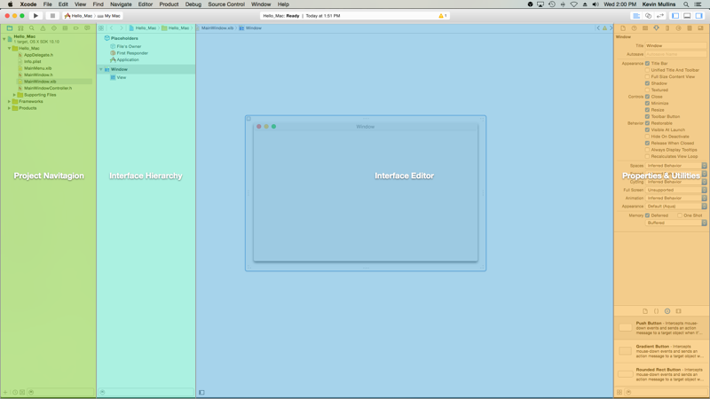](xib-images/xcode03-large.png#lightbox)

Let's take a look at what each of these Xcode sections does and how you will use them to create the interface for your Xamarin.Mac application.

#### Project navigation

When you open a .xib file for editing in Xcode, Visual Studio for Mac creates an Xcode project file in the background to communicate changes between itself and Xcode. Later, when you switch back to Visual Studio for Mac from Xcode, any changes made to this project are synchronized with your Xamarin.Mac project by Visual Studio for Mac.

The **Project Navigation** section allows you to navigate between all of the files that make up this _shim_ Xcode project. Typically, you will only be interested in the .xib files in this list such as **MainMenu.xib** and **MainWindow.xib**.

#### Interface hierarchy

The **Interface Hierarchy** section allows you to easily access several key properties of the User Interface such as its **Placeholders** and main **Window**. You can also use this section to access the individual elements (views) that make up your user interface and the adjust the way that they are nested by dragging them around within the hierarchy.

#### Interface editor

The **Interface Editor** section provides the surface on which you graphically layout your User Interface. You'll drag elements from the **Library** section of the **Properties & Utilities** section to create your design. As you add user interface elements (views) to the design surface, they will be added to the **Interface Hierarchy** section in the order that they appear in the **Interface Editor**.

#### Properties & utilities

The **Properties & Utilities** section is divided into two main sections that we will be working with, **Properties** (also called Inspectors) and the **Library**:

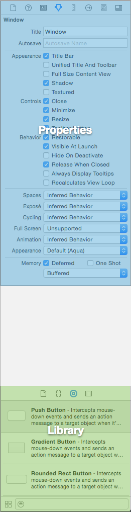

Initially this section is almost empty, however if you select an element in the **Interface Editor** or **Interface Hierarchy**, the **Properties** section will be populated with information about the given element and properties that you can adjust.

Within the **Properties** section, there are 8 different *Inspector Tabs*, as shown in the following illustration:

[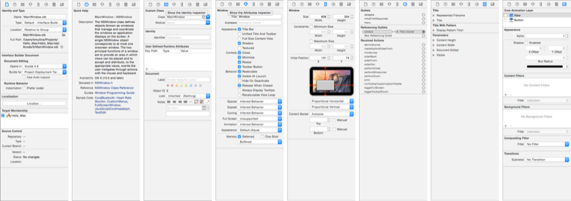](xib-images/xcode05-large.png#lightbox)

From left-to-right, these tabs are:

- **File Inspector** – The File Inspector shows file information, such as the file name and location of the Xib file that is being edited.
- **Quick Help** – The Quick Help tab provides contextual help based on what is selected in Xcode.
- **Identity Inspector** – The Identity Inspector provides information about the selected control/view.
- **Attributes Inspector** – The Attributes Inspector allows you to customize various attributes of the selected control/view.
- **Size Inspector** – The Size Inspector allows you to control the size and resizing behavior of the selected control/view.
- **Connections Inspector** – The Connections Inspector shows the outlet and action connections of the selected controls. We’ll examine Outlets and Actions in just a moment.
- **Bindings Inspector** – The Bindings Inspector allows you to configure controls so that their values are automatically bound to data models.
- **View Effects Inspector** – The View Effects Inspector allows you to specify effects on the controls, such as animations.

In the **Library** section, you can find controls and objects to place into the designer to graphically build your user interface:

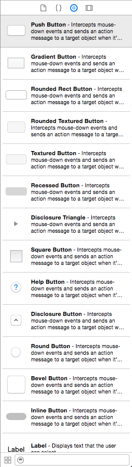

Now that you are familiar with the Xcode IDE and Interface Builder, let’s look at using it to create a user interface.

## Creating and maintaining windows in Xcode

The preferred method for creating a Xamarin.Mac app's User Interface is with Storyboards (please see our [Introduction to Storyboards](~/mac/platform/storyboards/index.md) documentation for more information) and, as a result, any new project started in Xamarin.Mac will use Storyboards by default.

To switch to using a .xib based UI, do the following:

1. Open Visual Studio for Mac and start a new Xamarin.Mac project.
2. In the **Solution Pad**, right-click on the project and select **Add** > **New File...**
3. Select **Mac** > **Windows Controller**:

    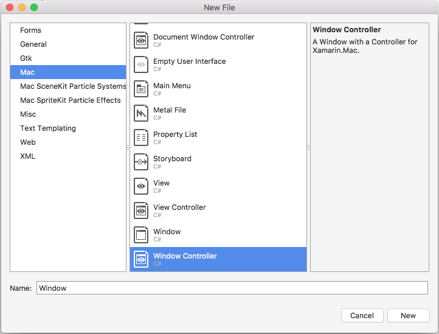
4. Enter `MainWindow` for the name and click the **New** button:

    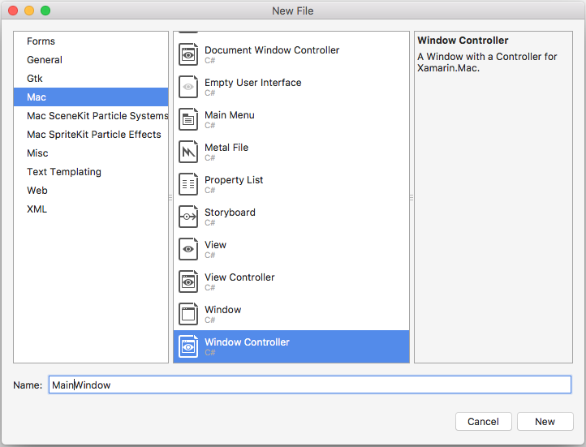
5. Right-click on the project again and select **Add** > **New File...**
6. Select **Mac** > **Main Menu**:

    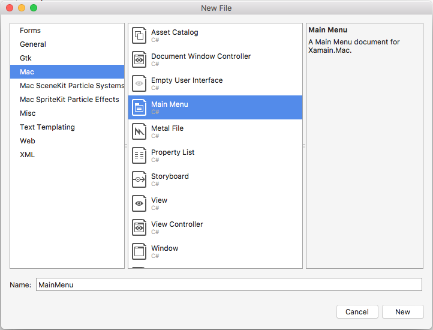
7. Leave the name as `MainMenu` and click the **New** button.
8. In the **Solution Pad** select the **Main.storyboard** file, right-click and select **Remove**:

    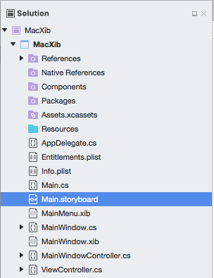
9. In the Remove Dialog Box, click the **Delete** button:

    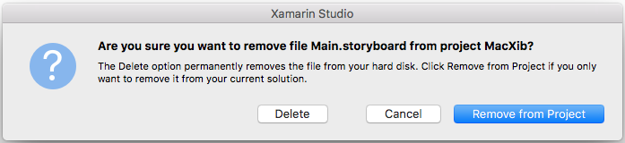
10. In the **Solution Pad**, double-click the **Info.plist** file to open it for editing.
11. Select `MainMenu` from the **Main Interface** dropdown:

    [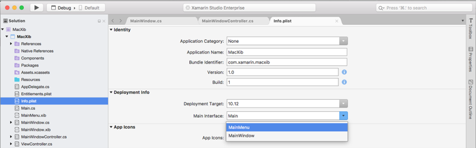](xib-images/setup05-large.png#lightbox)
12. In the **Solution Pad**, double-click the **MainMenu.xib** file to open it for editing in Xcode's Interface Builder.
13. In the **Library Inspector**, type `object` in the search field then drag a new **Object** onto the design surface:

    [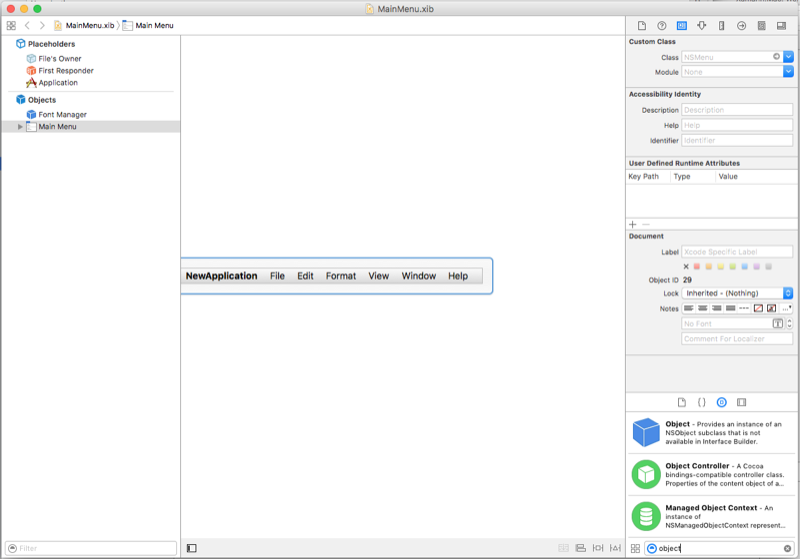](xib-images/setup06-large.png#lightbox)
14. In the **Identity Inspector**, enter `AppDelegate` for the **Class**:

    [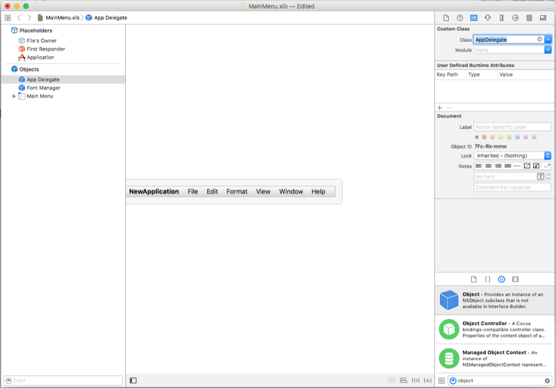](xib-images/setup07-large.png#lightbox)
15. Select **File's Owner** from the **Interface Hierarchy**, switch to the **Connection Inspector** and drag a line from the delegate to the `AppDelegate` **Object** just added to the project:

    [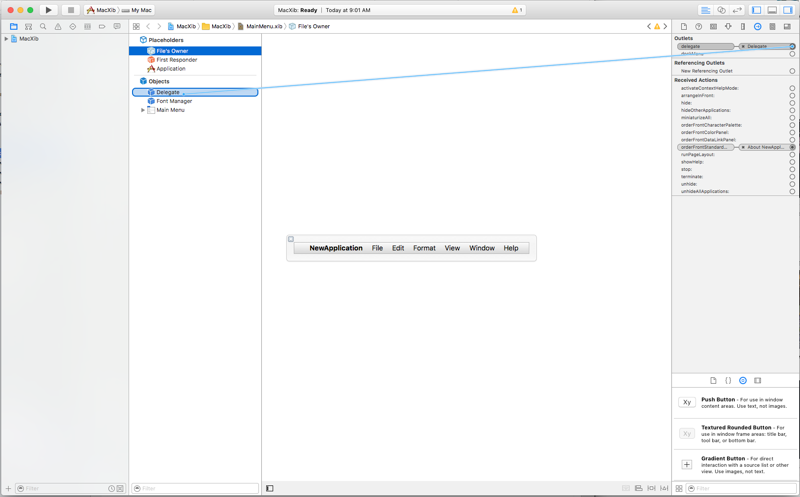](xib-images/setup08-large.png#lightbox)
16. Save the changes and return to Visual Studio for Mac.

With all these changes in place, edit the **AppDelegate.cs** file and make it look like the following:

```csharp
using AppKit;
using Foundation;

namespace MacXib
{
    [Register ("AppDelegate")]
    public class AppDelegate : NSApplicationDelegate
    {
        public MainWindowController mainWindowController { get; set; }

        public AppDelegate ()
        {
        }

        public override void DidFinishLaunching (NSNotification notification)
        {
            // Insert code here to initialize your application
            mainWindowController = new MainWindowController ();
            mainWindowController.Window.MakeKeyAndOrderFront (this);
        }

        public override void WillTerminate (NSNotification notification)
        {
            // Insert code here to tear down your application
        }
    }
}
```

Now the app's Main Window is defined in a **.xib** file automatically included in the project when adding a Window Controller. To edit your windows design, in the **Solution Pad**, double click the **MainWindow.xib** file:

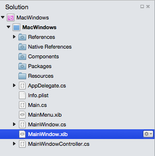

This will open the window design in Xcode's Interface Builder:

[](xib-images/edit02-large.png#lightbox)

### Standard window workflow

For any window that you create and work with in your Xamarin.Mac application, the process is basically the same:

1. For new windows that are not the default added automatically to your project, add a new window definition to the project.
2. Double-click the .xib file to open the window design for editing in Xcode's Interface Builder.
3. Set any required window properties in the **Attribute Inspector** and the **Size Inspector**.
4. Drag in the controls required to build your interface and configure them in the **Attribute Inspector**.
5. Use the **Size Inspector** to handle the resizing for your UI elements.
6. Expose the window's UI elements to C# code via outlets and actions.
7. Save your changes and switch back to Visual Studio for Mac to sync with Xcode.

### Designing a window layout

The process for laying out a User Interface in Interface builder is basically the same for every element that you add:

1. Find the desired control in the **Library Inspector** and drag it into the **Interface Editor** and position it.
2. Set any required window properties in the **Attribute Inspector**.
3. Use the **Size Inspector** to handle the resizing for your UI elements.
4. If you are using a custom class, set it in the **Identity Inspector**.
5. Expose the UI elements to C# code via outlets and actions.
6. Save your changes and switch back to Visual Studio for Mac to sync with Xcode.

For Example:

1. In Xcode, drag a **Push Button** from the **Library Section**:

    [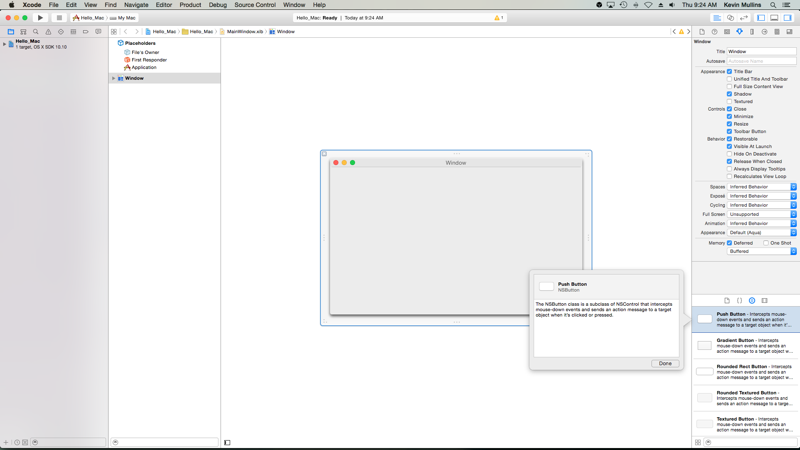](xib-images/xcode07-large.png#lightbox)
2. Drop the button onto the **Window** in the **Interface Editor**:

    [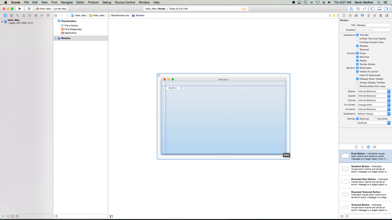](xib-images/xcode08-large.png#lightbox)
3. Click on the **Title** property in the **Attribute Inspector** and change the button's title to `Click Me`:

    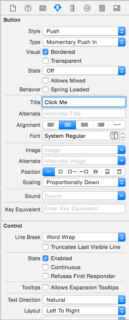
4. Drag a **Label** from the **Library Section**:

    [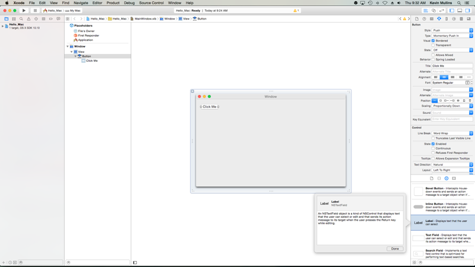](xib-images/xcode10-large.png#lightbox)
5. Drop the label onto the **Window** beside the button in the **Interface Editor**:

    [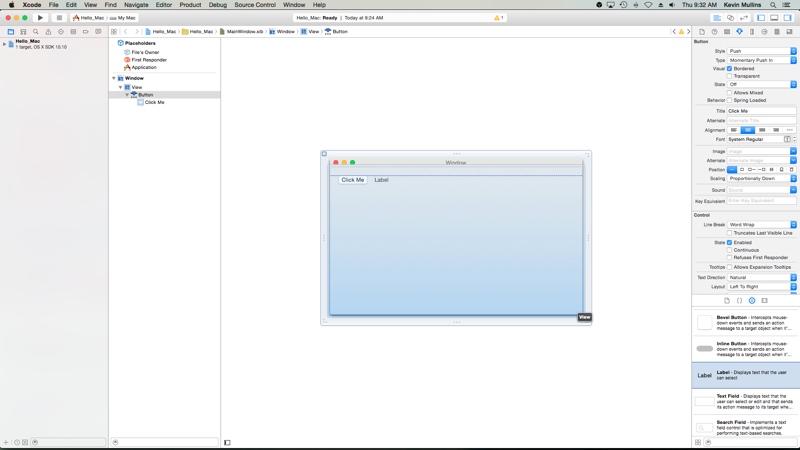](xib-images/xcode11-large.png#lightbox)
6. Grab the right handle on the label and drag it until it is near the edge of the window:

    [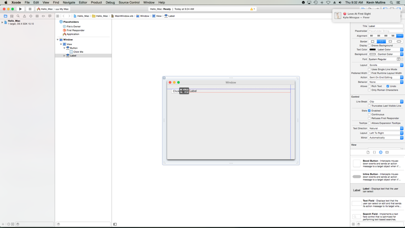](xib-images/xcode12-large.png#lightbox)
7. With the label still selected in the **Interface Editor**, switch to the **Size Inspector**:

    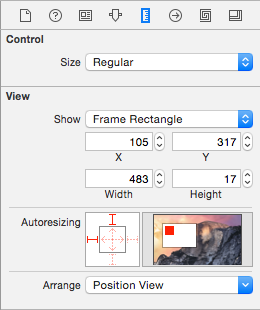
8. In the **Autosizing Box** click the **Dim Red Bracket** at the right and the **Dim Red Horizontal Arrow** in the center:

    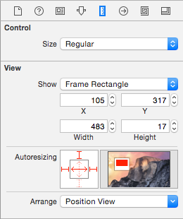
9. This ensures that the label will stretch to grow and shrink as the window is resized in the running application. The **Red Brackets** and the top and left of the **Autosizing Box** box tell the label to be stuck to its given X and Y locations.
10. Save your changes to the User Interface

As you were resizing and moving controls around, you should have noticed that Interface Builder gives you helpful snap hints that are based on [OS X Human Interface Guidelines](https://developer.apple.com/library/mac/documentation/UserExperience/Conceptual/OSXHIGuidelines/). These guidelines will help you create high quality applications that will have a familiar look and feel for Mac users.

If you look in the **Interface Hierarchy** section, notice how the layout and hierarchy of the elements that make up our user Interface are shown:

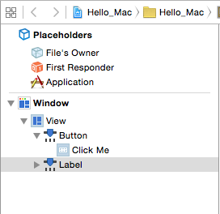

From here you can select items to edit or drag to reorder UI elements if needed. For example, if a UI element was being covered by another element, you could drag it to the bottom of the list to make it the top-most item on the window.

For more information on working with Windows in a Xamarin.Mac application, please see our [Windows](~/mac/user-interface/window.md) documentation.

## Exposing UI elements to C# code

Once you have finished laying out the look and feel of your user interface in Interface Builder, you'll need to expose elements of the UI so that they can be accessed from C# code. To do this, you'll be using actions and outlets.

### Setting a custom main window controller

To be able to create Outlets and Actions to expose UI elements to C# code, the Xamarin.Mac app will need to be using a Custom Window Controller.

Do the following:

1. Open the app's Storyboard in Xcode's Interface Builder.
2. Select the `NSWindowController` in the  Design Surface.
3. Switch to the **Identity Inspector** view and enter `WindowController` as the **Class Name**:

    [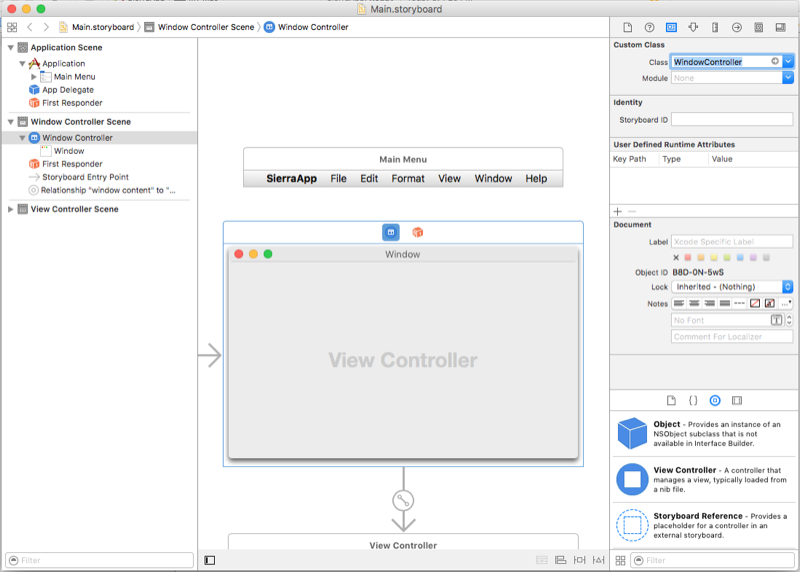](xib-images/windowcontroller01-large.png#lightbox)
4. Save your changes and return to Visual Studio for Mac to sync.
5. A **WindowController.cs** file will be added to your project in the **Solution Pad** in Visual Studio for Mac:

    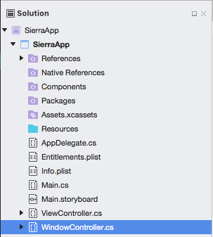
6. Reopen the Storyboard in Xcode's Interface Builder.
7. The **WindowController.h** file will be available for use:

    [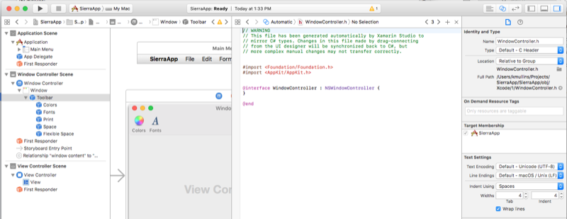](xib-images/windowcontroller03-large.png#lightbox)

### Outlets and actions

So what are outlets and actions? In traditional .NET User Interface programming, a control in the User Interface is automatically exposed as a property when it’s added. Things work differently in Mac, simply adding a control to a view doesn’t make it accessible to code. The developer must explicitly expose the UI element to code. In order do this, Apple gives us two options:

- **Outlets** – Outlets are analogous to properties. If you wire up a control to an Outlet, it’s exposed to your code via a property, so you can do things like attach event handlers, call methods on it, etc.
- **Actions** – Actions are analogous to the command pattern in WPF. For example, when an Action is performed on a control, say a button click, the control will automatically call a method in your code. Actions are powerful and convenient because you can wire up many controls to the same Action.

In Xcode, outlets and actions are added directly in code via *Control-dragging*. More specifically, this means that to create an outlet or action, you choose which control element you’d like to add an outlet or action, hold down the **Control** button on the keyboard, and drag that control directly into your code.

For Xamarin.Mac developers, this means that you drag into the Objective-C stub files that correspond to the C# file where you want to create the outlet or action. Visual Studio for Mac created a file called **MainWindow.h** as part of the shim Xcode project it generated to use the Interface Builder:

[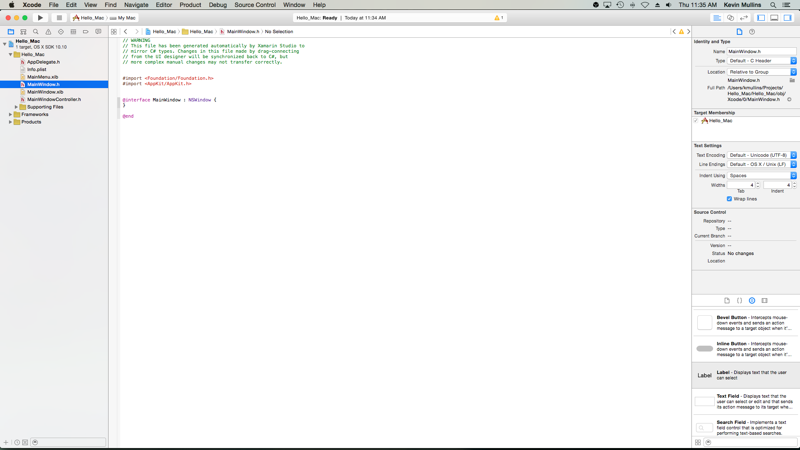](xib-images/xcode16-large.png#lightbox)

This stub .h file mirrors the **MainWindow.designer.cs** that is automatically added to a Xamarin.Mac project when a new `NSWindow` is created. This file will be used to synchronize the changes made by Interface Builder and is where we will create your outlets and actions so that UI elements are exposed to C# code.

#### Adding an outlet

With a basic understanding of what outlets and actions are, let's look at creating an outlet to expose a UI element to your C# code.

Do the following:

1. In Xcode at the far right top-hand corner of the screen, click the **Double Circle** button to open the **Assistant Editor**:

    [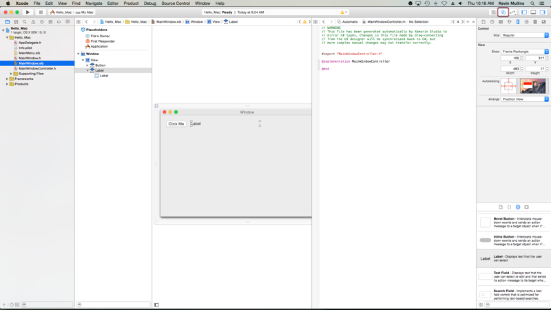](xib-images/outlet01-large.png#lightbox)
2. The Xcode will switch to a split-view mode with the **Interface Editor** on one side and a **Code Editor** on the other.
3. Notice that Xcode has automatically picked the **MainWindowController.m** file in the **Code Editor**, which is incorrect. If you remember from our discussion on what outlets and actions are above, we need to have the **MainWindow.h** selected.
4. At the top of the **Code Editor** click on the **Automatic Link** and select the **MainWindow.h** file:

    [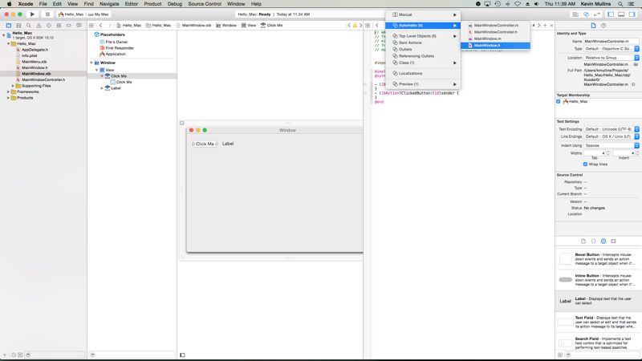](xib-images/outlet02-large.png#lightbox)
5. Xcode should now have the correct file selected:

    [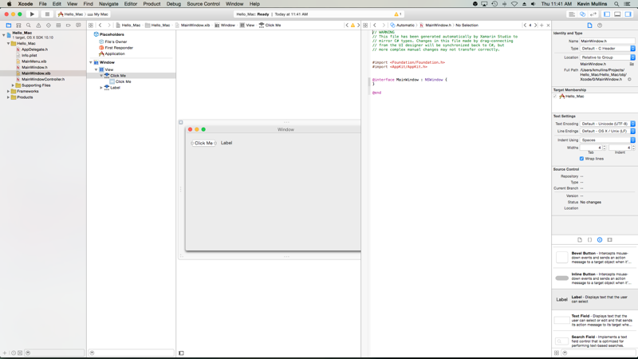](xib-images/outlet03-large.png#lightbox)
6. **The last step was very important!** If you don't have the correct file selected, you won't be able to create outlets and actions or they will be exposed to the wrong class in C#!
7. In the **Interface Editor**, hold down the **Control** key on the keyboard and click-drag the label we created above onto the code editor just below the `@interface MainWindow : NSWindow { }` code:

    [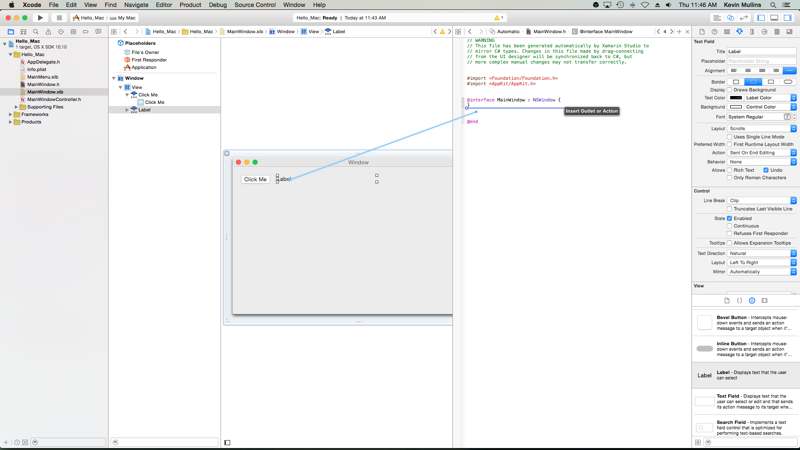](xib-images/outlet04-large.png#lightbox)
8. A dialog box will be displayed. Leave the **Connection** set to outlet and enter `ClickedLabel` for the **Name**:

    [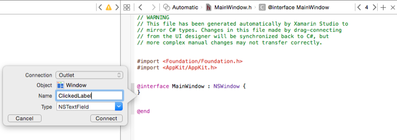](xib-images/outlet05-large.png#lightbox)
9. Click the **Connect** button to create the outlet:

    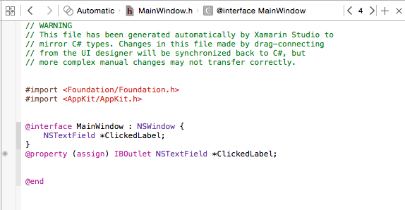
10. Save the changes to the file.

#### Adding an action

Next, let's look at creating an action to expose a user interaction with UI element to your C# code.

Do the following:

1. Make sure we are still in the **Assistant Editor** and the **MainWindow.h** file is visible in the **Code Editor**.
2. In the **Interface Editor**, hold down the **Control** key on the keyboard and click-drag the button we created above onto the code editor just below the `@property (assign) IBOutlet NSTextField *ClickedLabel;` code:

    [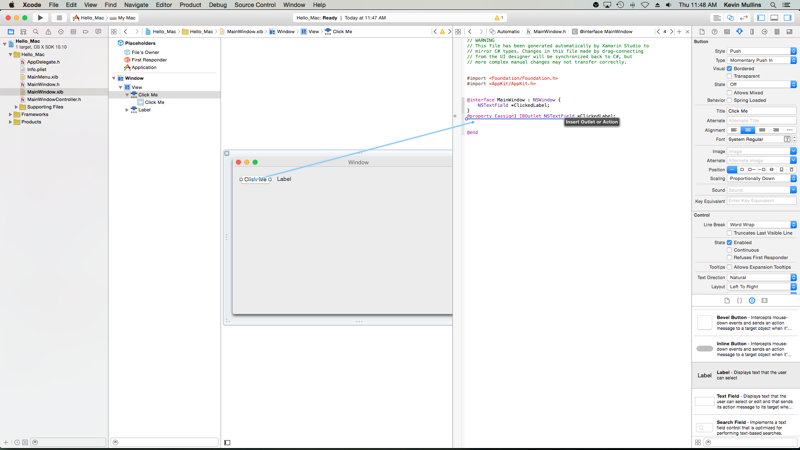](xib-images/action01-large.png#lightbox)
3. Change the **Connection** type to action:

    [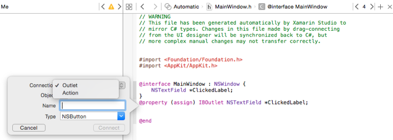](xib-images/action02-large.png#lightbox)
4. Enter `ClickedButton` as the **Name**:

    [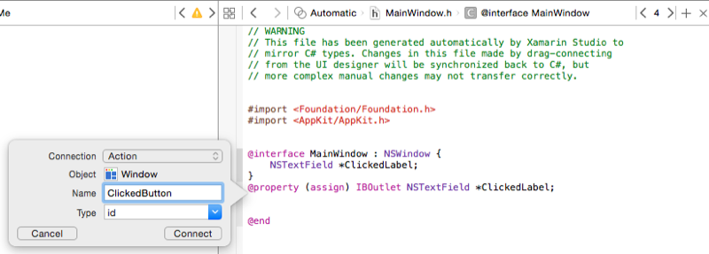](xib-images/action03-large.png#lightbox)
5. Click the **Connect** button to create action:

    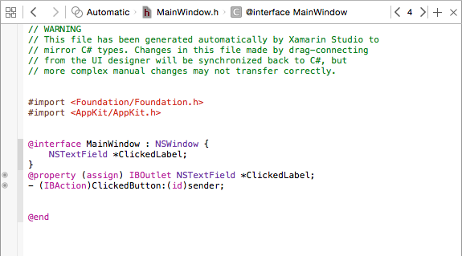
6. Save the changes to the file.

With your User Interface wired-up and exposed to C# code, switch back to Visual Studio for Mac and let it synchronize the changes from Xcode and Interface Builder.

### Writing the code

With your User Interface created and its UI elements exposed to code via outlets and actions, you are ready to write the code to bring your program to life. For example, open the **MainWindow.cs** file for editing by double-clicking it in the **Solution Pad**:

[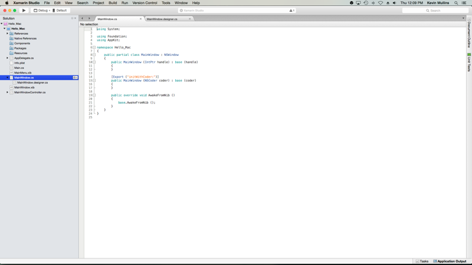](xib-images/code01-large.png#lightbox)

And add the following code to the `MainWindow` class to work with the sample outlet that you created above:

```csharp
private int numberOfTimesClicked = 0;
...

public override void AwakeFromNib ()
{
    base.AwakeFromNib ();

    // Set the initial value for the label
    ClickedLabel.StringValue = "Button has not been clicked yet.";
}
```

Note that the `NSLabel` is accessed in C# by the direct name that you assigned it in Xcode when you created its outlet in Xcode, in this case, it's called `ClickedLabel`. You can access any method or property of the exposed object the same way you would any normal C# class.

> [!IMPORTANT]
> You need to use `AwakeFromNib`, instead of another method such as `Initialize`, because `AwakeFromNib` is called _after_ the OS has loaded and instantiated the User Interface from the .xib file. If you tried to access the label control before the .xib file has been fully loaded and instantiated, you’d get a `NullReferenceException` error because the label control would not be created yet.

Next, add the following partial class to the `MainWindow` class:

```csharp
partial void ClickedButton (Foundation.NSObject sender) {

    // Update counter and label
    ClickedLabel.StringValue = string.Format("The button has been clicked {0} time{1}.",++numberOfTimesClicked, (numberOfTimesClicked < 2) ? "" : "s");
}
```

This code attaches to the action that you created in Xcode and Interface Builder and will be called any time the user clicks the button.

Some UI elements automatically have built in actions, for example, items in the default Menu Bar such as the **Open...** menu item (`openDocument:`). In the **Solution Pad**, double-click the **AppDelegate.cs** file to open it for editing and add the following code below the `DidFinishLaunching` method:

```csharp
[Export ("openDocument:")]
void OpenDialog (NSObject sender)
{
    var dlg = NSOpenPanel.OpenPanel;
    dlg.CanChooseFiles = false;
    dlg.CanChooseDirectories = true;

    if (dlg.RunModal () == 1) {
        var alert = new NSAlert () {
            AlertStyle = NSAlertStyle.Informational,
            InformativeText = "At this point we should do something with the folder that the user just selected in the Open File Dialog box...",
            MessageText = "Folder Selected"
        };
        alert.RunModal ();
    }
}
```

The key line here is `[Export ("openDocument:")]`, it tells `NSMenu` that the **AppDelegate** has a method `void OpenDialog (NSObject sender)` that responds to the `openDocument:` action.

For more information on working with Menus, please see our [Menus](~/mac/user-interface/menu.md) documentation.

## Synchronizing changes with Xcode

When you switch back to Visual Studio for Mac from Xcode, any changes that you have made in Xcode will automatically be synchronized with your Xamarin.Mac project.

If you select the **MainWindow.designer.cs** in the **Solution Pad** you'll be able to see how our outlet and action have been wired up in our C# code:

[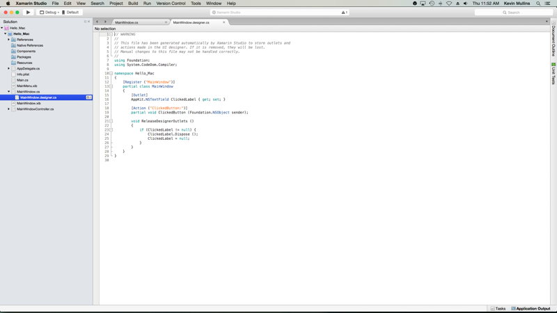](xib-images/sync01-large.png#lightbox)

Notice how the two definitions in the **MainWindow.designer.cs** file:

```csharp
[Outlet]
AppKit.NSTextField ClickedLabel { get; set; }

[Action ("ClickedButton:")]
partial void ClickedButton (Foundation.NSObject sender);
```

Line up with the definitions in the **MainWindow.h** file in Xcode:

```objc
@property (assign) IBOutlet NSTextField *ClickedLabel;
- (IBAction)ClickedButton:(id)sender;
```

As you can see, Visual Studio for Mac listens for changes to the .h file, and then automatically synchronizes those changes in the respective **.designer.cs** file to expose them to your application. You may also notice that **MainWindow.designer.cs** is a partial class, so that Visual Studio for Mac doesn't have to modify **MainWindow.cs** which would overwrite any changes that we have made to the class.

You normally will never need to open the **MainWindow.designer.cs** yourself, it was presented here for educational purposes only.

> [!IMPORTANT]
> In most situations, Visual Studio for Mac will automatically see any changes made in Xcode and sync them to your Xamarin.Mac project. In the off occurrence that synchronization doesn't automatically happen, switch back to Xcode and them back to Visual Studio for Mac again. This will normally kick off a synchronization cycle.

## Adding a new window to a project

Aside from the main document window, a Xamarin.Mac application might need to display other types of windows to the user, such as Preferences or Inspector Panels. When adding a new Window to your project you should always use the **Cocoa Window with Controller** option, as this makes the process of loading the Window from the .xib file easier.

To add a new window, do the following:

1. In the **Solution Pad**, right-click on the project and select **Add** > **New File..**.
2. In the New File dialog box, select **Xamarin.Mac** > **Cocoa Window with Controller**:

    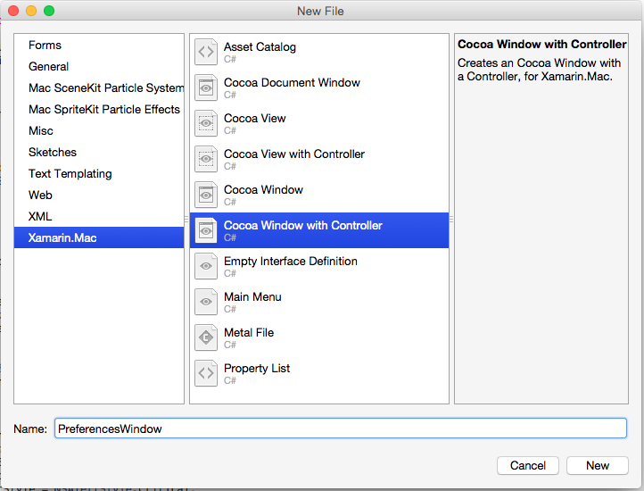
3. Enter `PreferencesWindow` for the **Name** and click the **New** button.
4. Double-click the **PreferencesWindow.xib** file to open it for editing in Interface Builder:

    [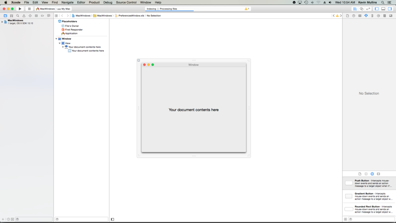](xib-images/new02-large.png#lightbox)
5. Design your interface:

    [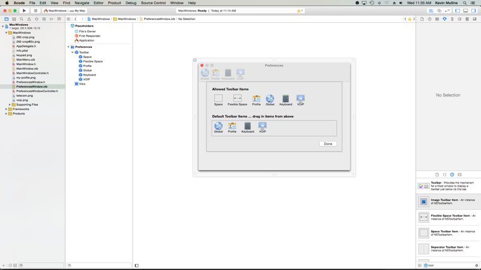](xib-images/new03-large.png#lightbox)
6. Save your changes and return to Visual Studio for Mac to sync with Xcode.

Add the following code to **AppDelegate.cs** to display your new window:

```csharp
[Export("applicationPreferences:")]
void ShowPreferences (NSObject sender)
{
    var preferences = new PreferencesWindowController ();
    preferences.Window.MakeKeyAndOrderFront (this);
}
```

The `var preferences = new PreferencesWindowController ();` line creates a new instance of the Window Controller that loads the Window from the .xib file and inflates it. The `preferences.Window.MakeKeyAndOrderFront (this);` line displays the new Window to the user.

If you run the code and select the **Preferences...** from the **Application Menu**, the window will be displayed:

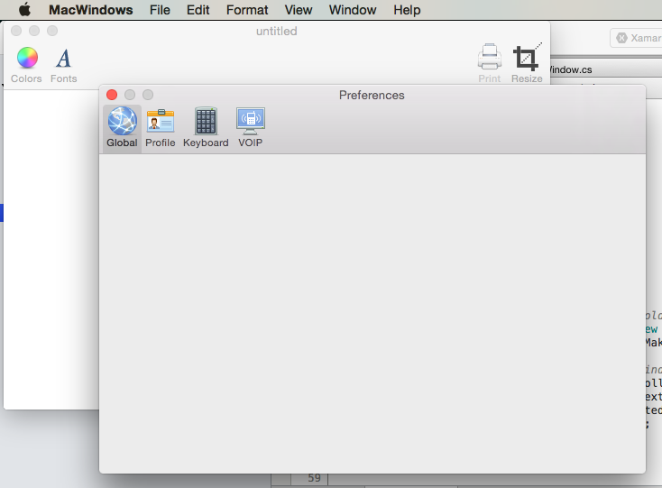

For more information on working with Windows in a Xamarin.Mac application, please see our [Windows](~/mac/user-interface/window.md) documentation.

## Adding a new view to a project

There are times when it is easier to break your Window's design down into several, more manageable .xib files. For example, like switching out the contents of the main Window when selecting a Toolbar item in a **Preferences Window** or swapping out content in response to a **Source List** selection.

When adding a new View to your project you should always use the **Cocoa View with Controller** option, as this makes the process of loading the View from the .xib file easier.

To add a new view, do the following:

1. In the **Solution Pad**, right-click on the project and select **Add** > **New File..**.
2. In the New File dialog box, select **Xamarin.Mac** > **Cocoa View with Controller**:

    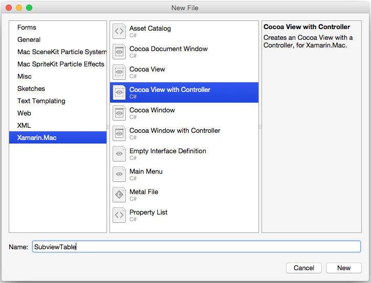
3. Enter `SubviewTable` for the **Name** and click the **New** button.
4. Double-click the **SubviewTable.xib** file to open it for editing in Interface Builder and Design the User Interface:

    [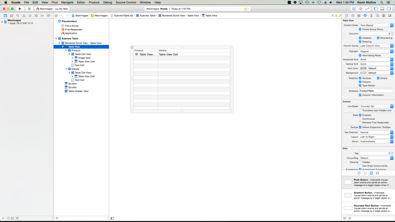](xib-images/view02-large.png#lightbox)
5. Wire up any required actions and outlets.
6. Save your changes and return to Visual Studio for Mac to sync with Xcode.

Next edit the **SubviewTable.cs** and add the following code to the **AwakeFromNib** file to populate the new View when it is loaded:

```csharp
public override void AwakeFromNib ()
{
    base.AwakeFromNib ();

    // Create the Product Table Data Source and populate it
    var DataSource = new ProductTableDataSource ();
    DataSource.Products.Add (new Product ("Xamarin.iOS", "Allows you to develop native iOS Applications in C#"));
    DataSource.Products.Add (new Product ("Xamarin.Android", "Allows you to develop native Android Applications in C#"));
    DataSource.Products.Add (new Product ("Xamarin.Mac", "Allows you to develop Mac native Applications in C#"));
    DataSource.Sort ("Title", true);

    // Populate the Product Table
    ProductTable.DataSource = DataSource;
    ProductTable.Delegate = new ProductTableDelegate (DataSource);

    // Auto select the first row
    ProductTable.SelectRow (0, false);
}
```

Add an enum to the project to track which view is currently being display. For example, **SubviewType.cs**:

```csharp
public enum SubviewType
{
    None,
    TableView,
    OutlineView,
    ImageView
}
```

Edit the .xib file of the window that will be consuming the View and displaying it. Add a **Custom View** that will act as the container for the View once it is loaded into memory by C# code and expose it to an outlet called `ViewContainer`:

[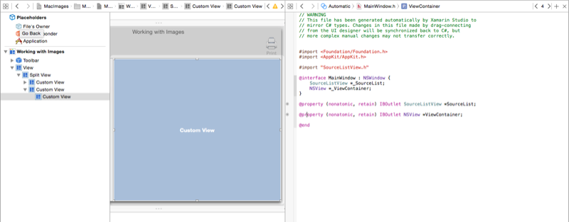](xib-images/view03-large.png#lightbox)

Save your changes and return to Visual Studio for Mac to sync with Xcode.

Next, edit the .cs file of the Window that will be displaying the new view (for example, **MainWindow.cs**) and add the following code:

```csharp
private SubviewType ViewType = SubviewType.None;
private NSViewController SubviewController = null;
private NSView Subview = null;
...

private void DisplaySubview(NSViewController controller, SubviewType type) {

    // Is this view already displayed?
    if (ViewType == type) return;

    // Is there a view already being displayed?
    if (Subview != null) {
        // Yes, remove it from the view
        Subview.RemoveFromSuperview ();

        // Release memory
        Subview = null;
        SubviewController = null;
    }

    // Save values
    ViewType = type;
    SubviewController = controller;
    Subview = controller.View;

    // Define frame and display
    Subview.Frame = new CGRect (0, 0, ViewContainer.Frame.Width, ViewContainer.Frame.Height);
    ViewContainer.AddSubview (Subview);
}
```

When we need to show a new View loaded from a .xib file in the Window's Container (the **Custom View** added above), this code handles removing any existing view and swapping it out for the new one. It looks to see it you already have a view displayed, if so it removes it from the screen. Next it takes the view that has been passed in (as loaded from a View Controller) resizes it to fit in the Content Area and adds it to the content for display.

To display a new view, use the following code:

```csharp
DisplaySubview(new SubviewTableController(), SubviewType.TableView);
```

This creates a new instance of the View Controller for the new view to be displayed, sets its type (as specified by the enum added to the project) and uses the `DisplaySubview` method added to the Window's class to actually display the view. For example:

[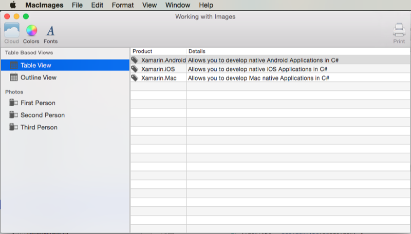](xib-images/view04-large.png#lightbox)

For more information on working with Windows in a Xamarin.Mac application, please see our [Windows](~/mac/user-interface/window.md) and [Dialogs](~/mac/user-interface/dialog.md) documentation.

## Summary

This article has taken a detailed look at working with .xib files in a Xamarin.Mac application. We saw the different types and uses of .xib files to create your application's User Interface, how to create and maintain .xib files in Xcode's Interface Builder and how to work with .xib files in C# code.

## Related Links

- [MacImages (sample)](/samples/xamarin/mac-samples/macimages)
- [Hello, Mac](~/mac/get-started/hello-mac.md)
- [Windows](~/mac/user-interface/window.md)
- [Menus](~/mac/user-interface/menu.md)
- [Dialogs](~/mac/user-interface/dialog.md)
- [Working with images](~/mac/app-fundamentals/image.md)
- [macOS Human Interface Guidelines](https://developer.apple.com/design/human-interface-guidelines/designing-for-macos)