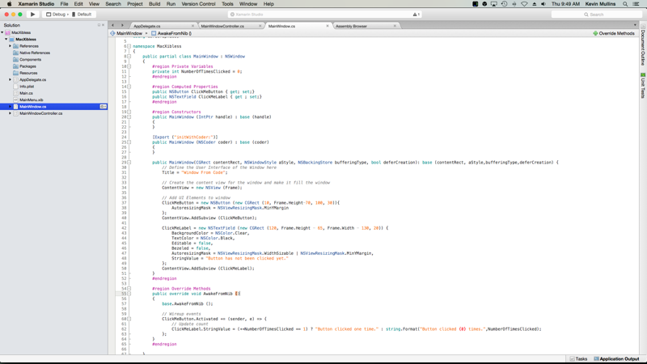
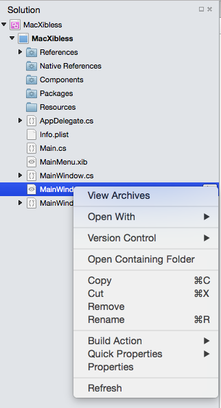
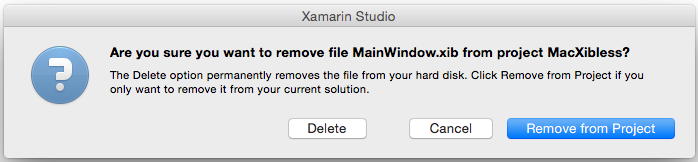
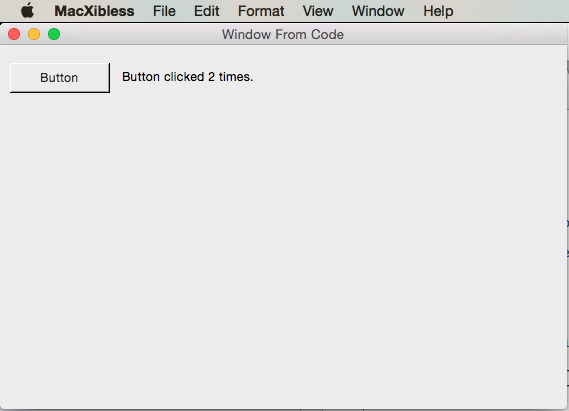
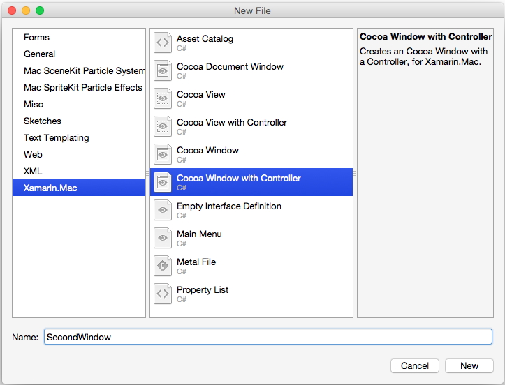

# .storyboard/.xib-less user interface design in Xamarin.Mac

_This article covers creating a Xamarin.Mac application's user interface directly from C# code, without .storyboard files, .xib files, or Interface Builder._

## Overview

When working with C# and .NET in a Xamarin.Mac application, you have access to the same user interface elements and tools that a developer working in *Objective-C* and *Xcode* does. Typically, when creating a Xamarin.Mac application, you'll use Xcode's Interface Builder with .storyboard or .xib files to create and maintain you application's user interface.

You also have the option of creating some or all of your Xamarin.Mac application's UI directly in C# code. In this article, we'll cover the basics of creating user interfaces and UI elements in C# code.

[](xibless-ui-images/intro01-large.png#lightbox)

<a name="Switching_a_Window_to_use_Code"></a>

## Switching a window to use code

When you create a new Xamarin.Mac Cocoa application, you get a standard blank, window by default. This windows is defined in a **Main.storyboard** (or traditionally a **MainWindow.xib**) file automatically included in the project. This also includes a **ViewController.cs** file that manages the app's main view (or again traditionally a **MainWindow.cs** and a **MainWindowController.cs** file).

To switch to a Xibless window for an application, do the following:

1. Open the application that you want to stop using `.storyboard` or .xib files to define the user interface in Visual Studio for Mac.
2. In the **Solution Pad**, right-click on the **Main.storyboard** or **MainWindow.xib** file and select **Remove**:

    
3. From the **Remove Dialog**, click the **Delete** button to remove the .storyboard or .xib completely from the project:

    

Now we'll need to modify the **MainWindow.cs** file to define the window's layout and modify the **ViewController.cs** or **MainWindowController.cs** file to create an instance of our `MainWindow` class since we are no longer using the .storyboard or .xib file.

Modern Xamarin.Mac apps that use Storyboards for their user interface may not automatically include the **MainWindow.cs**, **ViewController.cs** or **MainWindowController.cs** files. As required, simply add a new Empty C# Class to the project (**Add** > **New File...** > **General** > **Empty Class**) and name it the same as the missing file.

### Defining the window in code

Next, edit the **MainWindow.cs** file and make it look like the following:

```csharp
using System;
using Foundation;
using AppKit;
using CoreGraphics;

namespace MacXibless
{
    public partial class MainWindow : NSWindow
    {
        #region Private Variables
        private int NumberOfTimesClicked = 0;
        #endregion

        #region Computed Properties
        public NSButton ClickMeButton { get; set;}
        public NSTextField ClickMeLabel { get ; set;}
        #endregion

        #region Constructors
        public MainWindow (IntPtr handle) : base (handle)
        {
        }

        [Export ("initWithCoder:")]
        public MainWindow (NSCoder coder) : base (coder)
        {
        }

        public MainWindow(CGRect contentRect, NSWindowStyle aStyle, NSBackingStore bufferingType, bool deferCreation): base (contentRect, aStyle,bufferingType,deferCreation) {
            // Define the user interface of the window here
            Title = "Window From Code";

            // Create the content view for the window and make it fill the window
            ContentView = new NSView (Frame);

            // Add UI elements to window
            ClickMeButton = new NSButton (new CGRect (10, Frame.Height-70, 100, 30)){
                AutoresizingMask = NSViewResizingMask.MinYMargin
            };
            ContentView.AddSubview (ClickMeButton);

            ClickMeLabel = new NSTextField (new CGRect (120, Frame.Height - 65, Frame.Width - 130, 20)) {
                BackgroundColor = NSColor.Clear,
                TextColor = NSColor.Black,
                Editable = false,
                Bezeled = false,
                AutoresizingMask = NSViewResizingMask.WidthSizable | NSViewResizingMask.MinYMargin,
                StringValue = "Button has not been clicked yet."
            };
            ContentView.AddSubview (ClickMeLabel);
        }
        #endregion

        #region Override Methods
        public override void AwakeFromNib ()
        {
            base.AwakeFromNib ();

            // Wireup events
            ClickMeButton.Activated += (sender, e) => {
                // Update count
                ClickMeLabel.StringValue = (++NumberOfTimesClicked == 1) ? "Button clicked one time." : string.Format("Button clicked {0} times.",NumberOfTimesClicked);
            };
        }
        #endregion

    }
}
```

Let's discuss a few of the key elements.

First, we added a few _Computed Properties_ that will act like outlets (as if the window was created in a .storyboard or .xib file):

```csharp
public NSButton ClickMeButton { get; set;}
public NSTextField ClickMeLabel { get ; set;}
```

These will give us access to the UI elements that we are going to display on the window. Since the window isn't being inflated from a .storyboard or .xib file, we need a way to instantiate it (as we'll see later in the `MainWindowController` class). That's what this new constructor method does:

```csharp
public MainWindow(CGRect contentRect, NSWindowStyle aStyle, NSBackingStore bufferingType, bool deferCreation): base (contentRect, aStyle,bufferingType,deferCreation) {
    ...
}
```

This is where we will design the layout of the window and place any UI elements needed to create the required user interface. Before we can add any UI elements to a window, it needs a _Content View_ to contain the elements:

```csharp
ContentView = new NSView (Frame);
```

This creates a Content View that will fill the window. Now we add our first UI element, an `NSButton`, to the window:

```csharp
ClickMeButton = new NSButton (new CGRect (10, Frame.Height-70, 100, 30)){
    AutoresizingMask = NSViewResizingMask.MinYMargin
};
ContentView.AddSubview (ClickMeButton);
```

The first thing to note here is that, unlike iOS, macOS uses mathematical notation to define its window coordinate system. So the origin point is in the lower left hand corner of the window, with values increasing right and towards the upper right hand corner of the window. When we create the new `NSButton`, we take this into account as we define its position and size on screen.

The `AutoresizingMask = NSViewResizingMask.MinYMargin` property tells the button that we want it to stay in the same location from the top of the window when the window is resized vertically. Again, this is required because (0,0) is at the bottom left of the window.

Finally, the `ContentView.AddSubview (ClickMeButton)` method adds the `NSButton` to the Content View so that it will be displayed on screen when the application is run and the window displayed.

Next a label is added to the window that will display the number of times that the `NSButton` has been clicked:

```csharp
ClickMeLabel = new NSTextField (new CGRect (120, Frame.Height - 65, Frame.Width - 130, 20)) {
    BackgroundColor = NSColor.Clear,
    TextColor = NSColor.Black,
    Editable = false,
    Bezeled = false,
    AutoresizingMask = NSViewResizingMask.WidthSizable | NSViewResizingMask.MinYMargin,
    StringValue = "Button has not been clicked yet."
};
ContentView.AddSubview (ClickMeLabel);
```

Since macOS doesn't have a specific _Label_ UI element, we've added a specially styled, non-editable `NSTextField` to act as a Label. Just like the button before, the size and location takes into account that (0,0) is at the bottom left of the window. The `AutoresizingMask = NSViewResizingMask.WidthSizable | NSViewResizingMask.MinYMargin` property is using the **or** operator to combine two `NSViewResizingMask` features. This will make the label stay in the same location from the top of the window when the window is resized vertically and shrink and grow in width as the window is resized horizontally.

Again, the `ContentView.AddSubview (ClickMeLabel)` method adds the `NSTextField` to the Content View so that it will be displayed on screen when the application is run and the window opened.

### Adjusting the window controller

Since the design of the `MainWindow` is no longer being loaded from a .storyboard or .xib file, we'll need to make some adjustments to the window controller. Edit the **MainWindowController.cs** file and make it look like the following:

```csharp
using System;

using Foundation;
using AppKit;
using CoreGraphics;

namespace MacXibless
{
    public partial class MainWindowController : NSWindowController
    {
        public MainWindowController (IntPtr handle) : base (handle)
        {
        }

        [Export ("initWithCoder:")]
        public MainWindowController (NSCoder coder) : base (coder)
        {
        }

        public MainWindowController () : base ("MainWindow")
        {
            // Construct the window from code here
            CGRect contentRect = new CGRect (0, 0, 1000, 500);
            base.Window = new MainWindow(contentRect, (NSWindowStyle.Titled | NSWindowStyle.Closable | NSWindowStyle.Miniaturizable | NSWindowStyle.Resizable), NSBackingStore.Buffered, false);

            // Simulate Awaking from Nib
            Window.AwakeFromNib ();
        }

        public override void AwakeFromNib ()
        {
            base.AwakeFromNib ();
        }

        public new MainWindow Window {
            get { return (MainWindow)base.Window; }
        }
    }
}

```

Let discuss the key elements of this modification.

First, we define a new instance of the `MainWindow` class and assign it to the base window controller's `Window` property:

```csharp
CGRect contentRect = new CGRect (0, 0, 1000, 500);
base.Window = new MainWindow(contentRect, (NSWindowStyle.Titled | NSWindowStyle.Closable | NSWindowStyle.Miniaturizable | NSWindowStyle.Resizable), NSBackingStore.Buffered, false);
```

We define the location of the window of screen with a `CGRect`. Just like the coordinate system of the window, the screen defines (0,0) as the lower left hand corner. Next, we define the style of the window by using the **Or** operator to combine two or more `NSWindowStyle` features:

```csharp
... (NSWindowStyle.Titled | NSWindowStyle.Closable | NSWindowStyle.Miniaturizable | NSWindowStyle.Resizable) ...
```

The following `NSWindowStyle` features are available:

- **Borderless** - The window will have no border.
- **Titled** - The window will have a title bar.
- **Closable** - The window has a Close Button and can be closed.
- **Miniaturizable** - The window has a Miniaturize Button and can be minimized.
- **Resizable** - The window will have a Resize Button and be resizable.
- **Utility** - The window is a Utility style window (panel).
- **DocModal** - If the window is a Panel, it will be Document Modal instead of System Modal.
- **NonactivatingPanel** - If the window is a Panel, it will not be made the main window.
- **TexturedBackground** - The window will have a textured background.
- **Unscaled** - The window will not be scaled.
- **UnifiedTitleAndToolbar** - The window's title and toolbar areas will be joined.
- **Hud** - The window will be displayed as a heads-up display Panel.
- **FullScreenWindow** - The window can enter full screen mode.
- **FullSizeContentView** - The window's content view is behind the title and toolbar Area.

The last two properties define the _Buffering Type_ for the window and if drawing of the window will be deferred. For more information on `NSWindows`, please see Apple's [Introduction to Windows](https://developer.apple.com/library/mac/documentation/Cocoa/Conceptual/WinPanel/Introduction.html#//apple_ref/doc/uid/10000031-SW1) documentation.

Finally, since the window isn't being inflated from a .storyboard or .xib file, we need to simulate it in our **MainWindowController.cs** by calling the windows `AwakeFromNib` method:

```csharp
Window.AwakeFromNib ();
```

This will allow you to code against the window just like a standard window loaded from a .storyboard or .xib file.

### Displaying the window

With the .storyboard or .xib file removed and the **MainWindow.cs** and **MainWindowController.cs** files modified, you'll be using the window just as you would any normal window that had been created in Xcode's Interface Builder with a .xib file.

The following will create a new instance of the window and its controller and display the window on screen:

```csharp
private MainWindowController mainWindowController;
...

mainWindowController = new MainWindowController ();
mainWindowController.Window.MakeKeyAndOrderFront (this);
```

At this point, if the application is run and the button clicked a couple of times, the following will be displayed:



## Adding a code only window

If we want to add a code only, xibless window to an existing Xamarin.Mac application, right-click on the project in the **Solution Pad** and select **Add** > **New File..**. In the **New File** dialog choose **Xamarin.Mac** > **Cocoa Window with Controller**, as illustrated below:



Just like before, we'll delete the default .storyboard or .xib file from the project (in this case **SecondWindow.xib**) and follow the steps in the [Switching a Window to use Code](#Switching_a_Window_to_use_Code) section above to cover the window's definition to code.

## Adding a UI element to a window in code

Whether a window was created in code or loaded from a .storyboard or .xib file, there might be times where we want to add a UI element to a window from code. For example:

```csharp
var ClickMeButton = new NSButton (new CGRect (10, 10, 100, 30)){
    AutoresizingMask = NSViewResizingMask.MinYMargin
};
MyWindow.ContentView.AddSubview (ClickMeButton);
```

The above code creates a new `NSButton` and adds it to the `MyWindow` window instance for display. Basically any UI element that can be defined in Xcode's Interface Builder in a .storyboard or .xib file can be created in code and displayed in a window.

## Defining the menu bar in code

Because of current limitations in Xamarin.Mac, it is not suggested that you create your Xamarin.Mac application's Menu Bar–`NSMenuBar`–in code but continue to use the **Main.storyboard** or **MainMenu.xib** file to define it. That said, you can add and remove Menus and Menu Items in C# code.

For example, edit the **AppDelegate.cs** file and make the `DidFinishLaunching` method look like the following:

```csharp
public override void DidFinishLaunching (NSNotification notification)
{
    mainWindowController = new MainWindowController ();
    mainWindowController.Window.MakeKeyAndOrderFront (this);

    // Create a Status Bar Menu
    NSStatusBar statusBar = NSStatusBar.SystemStatusBar;

    var item = statusBar.CreateStatusItem (NSStatusItemLength.Variable);
    item.Title = "Phrases";
    item.HighlightMode = true;
    item.Menu = new NSMenu ("Phrases");

    var address = new NSMenuItem ("Address");
    address.Activated += (sender, e) => {
        Console.WriteLine("Address Selected");
    };
    item.Menu.AddItem (address);

    var date = new NSMenuItem ("Date");
    date.Activated += (sender, e) => {
        Console.WriteLine("Date Selected");
    };
    item.Menu.AddItem (date);

    var greeting = new NSMenuItem ("Greeting");
    greeting.Activated += (sender, e) => {
        Console.WriteLine("Greetings Selected");
    };
    item.Menu.AddItem (greeting);

    var signature = new NSMenuItem ("Signature");
    signature.Activated += (sender, e) => {
        Console.WriteLine("Signature Selected");
    };
    item.Menu.AddItem (signature);
}
```

The above creates a Status Bar menu from code and displays it when the application is launched. For more information on working with Menus, please see our [Menus](~/mac/user-interface/menu.md) documentation.

## Summary

This article has taken a detailed look at creating a Xamarin.Mac application's user interface in C# code as opposed to using Xcode's Interface Builder with .storyboard or .xib files.

## Related Links

- [MacXibless (sample)](/samples/xamarin/mac-samples/macxibless)
- [Windows](~/mac/user-interface/window.md)
- [Menus](~/mac/user-interface/menu.md)
- [macOS Human Interface Guidelines](https://developer.apple.com/design/human-interface-guidelines/designing-for-macos)
- [Introduction to Windows](https://developer.apple.com/library/content/documentation/Cocoa/Conceptual/WinPanel/Introduction.html)